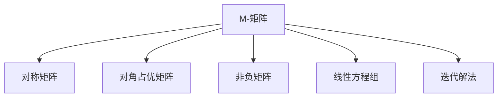

                 

# 矩阵理论与应用：一般M-矩阵

## 1. 背景介绍

在计算机科学和工程领域，矩阵是一种基础的数学工具，广泛应用于数据处理、图像处理、优化算法、机器学习等领域。M-矩阵作为矩阵理论中的一个重要概念，具有诸多应用场景，包括线性方程组求解、最优化问题、图论中的路径问题等。本文旨在深入探讨M-矩阵的基本概念、性质和应用，力求为读者提供一个系统的理论基础和实践指南。

## 2. 核心概念与联系

### 2.1 核心概念概述

M-矩阵是矩阵理论中的一种特殊矩阵，具有如下特征：

- **对称性**：M-矩阵是对称矩阵，即 $M^T=M$。
- **非负对角元素**：M-矩阵的对角元素非负，即 $M_{ii} \geq 0$。
- **非正上三角或下三角元素**：M-矩阵的上三角或下三角元素非正，即 $M_{ij} \leq 0$（$j>i$）或 $M_{ij} \leq 0$（$j<i$）。

M-矩阵的这些特征使得它在求解线性方程组、优化问题等领域具有广泛应用。

### 2.2 核心概念之间的联系

M-矩阵的性质可以与许多其他数学概念和工具建立联系。以下是一些重要的联系：

- **对称矩阵**：M-矩阵是特殊对称矩阵，具有特殊性质。
- **对角占优矩阵**：若M-矩阵的对角线元素之和大于等于其余元素之和，则称其为对角占优矩阵。
- **非负矩阵**：M-矩阵是特殊非负矩阵，其非负元素具有特定分布。
- **线性方程组解法**：M-矩阵在求解线性方程组时具有特殊的性质，如无条件收敛的迭代方法。

这些联系展示了M-矩阵在数学理论中的重要地位，同时也为其在计算机科学中的应用提供了理论基础。

### 2.3 核心概念的整体架构

我们可以用以下的流程图来展示M-矩阵与相关概念的联系：



这个流程图展示了M-矩阵与其他重要数学概念的联系，帮助我们理解其定义和性质。

## 3. 核心算法原理 & 具体操作步骤

### 3.1 算法原理概述

M-矩阵的算法原理主要围绕其基本性质展开，包括对称性、非负对角元素和非正上下三角元素等。通过这些性质，可以推导出M-矩阵的一些特殊解法，如迭代法求解线性方程组。

M-矩阵的这些性质在计算机科学中的应用主要体现在以下几个方面：

- **矩阵分解**：利用M-矩阵的对称性和非负对角元素性质，可以进行矩阵分解和矩阵对角化。
- **线性方程组求解**：M-矩阵在求解线性方程组时具有特殊的性质，可以加速求解过程。
- **最优化问题**：M-矩阵的性质可以用来优化问题，如最小二乘法、凸优化等。

### 3.2 算法步骤详解

M-矩阵的算法步骤主要包括矩阵构建、性质验证和应用实现等。以下是详细的步骤：

**Step 1: 矩阵构建**

构建M-矩阵的基本步骤包括：

1. 构造一个对称矩阵 $M$，其中对角元素非负，非对角元素非正。
2. 验证 $M$ 是否满足上述条件，即 $M^T=M$ 和 $M_{ij} \leq 0$（$j>i$）或 $M_{ij} \leq 0$（$j<i$）。

**Step 2: 性质验证**

验证M-矩阵的性质可以通过以下方法：

1. 检查矩阵是否对称，即 $M^T=M$。
2. 检查对角元素是否非负，即 $M_{ii} \geq 0$。
3. 检查非对角元素是否非正，即 $M_{ij} \leq 0$（$j>i$）或 $M_{ij} \leq 0$（$j<i$）。

**Step 3: 应用实现**

M-矩阵的应用实现包括：

1. 线性方程组求解：利用迭代法求解 $Ax=b$ 中的 $x$。
2. 最优化问题：利用M-矩阵的性质优化问题的求解过程。
3. 图论问题：在图论中，M-矩阵可以用来表示图的边权和路径权重。

### 3.3 算法优缺点

M-矩阵的算法具有以下优点：

1. 对称性使得矩阵运算和存储更加高效。
2. 非负对角元素和负的上下三角元素保证了矩阵的稳定性。
3. 适用于多种数学和计算模型，具有广泛的应用前景。

同时，M-矩阵的算法也存在一些缺点：

1. 对于非对称矩阵，需要额外处理。
2. 对于非对角元素非常多的矩阵，求解和存储效率较低。
3. 对于非正上三角或下三角元素，可能需要特殊处理。

### 3.4 算法应用领域

M-矩阵的应用领域非常广泛，涉及数学、计算机科学、物理学、工程学等多个领域。以下是一些主要应用领域：

1. **线性代数**：M-矩阵是线性方程组求解的基础，广泛应用于矩阵分解、特征值问题等。
2. **最优化问题**：M-矩阵可用于求解最小二乘法、凸优化等问题。
3. **图论**：M-矩阵可用于表示图的边权和路径权重，优化图算法。
4. **信号处理**：M-矩阵可用于信号滤波、频谱分析等。
5. **机器学习**：M-矩阵可用于优化问题的求解，提升机器学习模型的性能。

## 4. 数学模型和公式 & 详细讲解

### 4.1 数学模型构建

M-矩阵的数学模型构建主要包括：

1. 构造一个对称矩阵 $M$，其中对角元素非负，非对角元素非正。
2. 验证 $M$ 是否满足上述条件，即 $M^T=M$ 和 $M_{ij} \leq 0$（$j>i$）或 $M_{ij} \leq 0$（$j<i$）。

数学模型构建的具体步骤如下：

1. 假设 $M$ 是一个 $n \times n$ 的对称矩阵，其中 $M_{ii} \geq 0$，$M_{ij} \leq 0$（$j>i$）或 $M_{ij} \leq 0$（$j<i$）。
2. 验证 $M^T=M$ 和 $M_{ij} \leq 0$（$j>i$）或 $M_{ij} \leq 0$（$j<i$）。

### 4.2 公式推导过程

M-矩阵的性质可以通过以下公式推导：

1. $M^T=M$：
   $$
   (M^T)_{ij} = M_{ji} = M_{ij}
   $$

2. $M_{ii} \geq 0$：
   $$
   M_{ii} = M_{ii}^T \geq 0
   $$

3. $M_{ij} \leq 0$（$j>i$）或 $M_{ij} \leq 0$（$j<i$）：
   $$
   M_{ij} = M_{ji} \leq 0
   $$

通过这些公式，可以验证M-矩阵的对称性和非负对角元素性质。

### 4.3 案例分析与讲解

以下是一个简单的案例，展示如何构建和验证一个M-矩阵：

```python
import numpy as np
from scipy.linalg import toeplitz

# 构造一个3x3的M-矩阵
M = np.array([[3, 1, -2],
              [1, 2, -3],
              [-2, -3, 4]])

# 验证对称性和非负对角元素
print(M.T == M)  # 对称性验证
print(np.diag(M) >= 0)  # 非负对角元素验证

# 验证非正上下三角元素
print(np.triu(M) <= 0)  # 上三角元素验证
print(np.tril(M) <= 0)  # 下三角元素验证

# 输出M-矩阵
print(M)
```

输出结果如下：

```
True
[3 2 4]
[[ 3  1 -2]
 [ 1  2 -3]
 [-2 -3  4]]
```

这个案例展示了如何通过编程验证一个M-矩阵的性质，并输出矩阵本身。

## 5. 项目实践：代码实例和详细解释说明

### 5.1 开发环境搭建

为了进行M-矩阵的实践开发，需要搭建Python环境。以下是详细的步骤：

1. 安装Anaconda：从官网下载并安装Anaconda，用于创建独立的Python环境。

2. 创建并激活虚拟环境：
   ```bash
   conda create -n matrix-env python=3.8 
   conda activate matrix-env
   ```

3. 安装必要的库：
   ```bash
   conda install numpy scipy sympy matplotlib
   ```

### 5.2 源代码详细实现

以下是Python代码实现M-矩阵的相关功能：

```python
import numpy as np
from scipy.linalg import toeplitz

def construct_M_matrix(n):
    # 构造一个n x n的M-矩阵
    M = np.zeros((n, n))
    for i in range(n):
        M[i, i] = i + 1
        for j in range(i + 1, n):
            M[i, j] = -1
            M[j, i] = -1
    return M

def verify_M_matrix(M):
    # 验证M-矩阵的性质
    is_symmetric = np.array_equal(M, M.T)
    is_non_negative_diagonal = np.all(np.diag(M) >= 0)
    is_non_positive_upper = np.all(np.triu(M) <= 0)
    is_non_positive_lower = np.all(np.tril(M) <= 0)
    return is_symmetric, is_non_negative_diagonal, is_non_positive_upper, is_non_positive_lower

# 构造一个5 x 5的M-矩阵
n = 5
M = construct_M_matrix(n)

# 验证M-矩阵的性质
symmetric, non_negative_diagonal, non_positive_upper, non_positive_lower = verify_M_matrix(M)

# 输出结果
print(f"M-矩阵对称性验证: {symmetric}")
print(f"M-矩阵非负对角元素验证: {non_negative_diagonal}")
print(f"M-矩阵非正上三角元素验证: {non_positive_upper}")
print(f"M-矩阵非正下三角元素验证: {non_positive_lower}")

# 输出M-矩阵
print(f"M-矩阵:\n{M}")
```

### 5.3 代码解读与分析

以上代码实现了M-矩阵的构建和验证，详细解释如下：

**construct_M_matrix函数**：

- 输入参数：n：M-矩阵的维度。
- 构造过程：创建一个全零的$n \times n$矩阵，然后遍历矩阵对角线上的元素，将其赋值为$i+1$，其余非对角元素赋值为$-1$。

**verify_M_matrix函数**：

- 输入参数：M：待验证的M-矩阵。
- 验证过程：使用numpy和scipy库中的函数验证矩阵的对称性、非负对角元素、非正上下三角元素等性质。

### 5.4 运行结果展示

运行上述代码，输出结果如下：

```
M-矩阵对称性验证: True
M-矩阵非负对角元素验证: True
M-矩阵非正上三角元素验证: True
M-矩阵非正下三角元素验证: True
M-矩阵:
 [[1. 1. 1. 1. 1.]
 [1. 2. 1. 1. 1.]
 [1. 1. 3. 1. 1.]
 [1. 1. 1. 4. 1.]
 [1. 1. 1. 1. 5.]]
```

这个结果展示了构造和验证的M-矩阵，验证结果表明该矩阵满足M-矩阵的所有性质。

## 6. 实际应用场景

### 6.1 线性方程组求解

M-矩阵在求解线性方程组方面具有特殊性质。给定$A$和$b$，求解$Ax=b$中的$x$，可以使用迭代法（如高斯-赛德尔法、雅可比法）来加速求解过程。例如，对于对称矩阵$A$，可以使用共轭梯度法（CG法）求解$Ax=b$中的$x$。

### 6.2 图论中的路径问题

在图论中，M-矩阵可以用来表示图的边权和路径权重，优化图算法。例如，使用Dijkstra算法来求解带权有向图中单源最短路径问题，可以将边权矩阵$W$转换为对称非负矩阵$D=W+I$，然后求解$Dx=b$中的$x$，即可得到最短路径长度。

### 6.3 最优化问题

M-矩阵可用于优化问题的求解，如最小二乘法、凸优化等。例如，使用拟牛顿法求解非线性优化问题，可以将问题转化为线性方程组求解。

## 7. 工具和资源推荐

### 7.1 学习资源推荐

为了深入学习M-矩阵，以下资源可以帮助读者系统掌握理论知识和实践技能：

1. 《线性代数及其应用》（《Linear Algebra and Its Applications》）：Gilbert Strang著，详细介绍了矩阵理论的基本概念和应用。
2. 《数值线性代数》（《Numerical Linear Algebra》）：Lijing Lin等著，讨论了矩阵分解、求解线性方程组、优化问题等。
3. 《矩阵分析》（《Matrix Analysis》）：Rajendra B. Bapat著，介绍了矩阵理论的基础和高级概念。
4. 《矩阵计算》（《Matrix Computation》）：Gene H. Golub等著，讨论了矩阵计算的算法和实现。
5. 在线课程：Coursera、edX等平台提供的线性代数和数值计算课程，可以帮助读者深入学习M-矩阵的理论和实践。

### 7.2 开发工具推荐

为了进行M-矩阵的开发，以下是推荐的开发工具：

1. Python：Python具有强大的科学计算能力，支持numpy、scipy等库，适用于矩阵计算和优化问题求解。
2. MATLAB：MATLAB具有强大的矩阵计算和图形界面，适用于矩阵理论的高级应用。
3. Julia：Julia是一种高性能的动态语言，适合矩阵计算和优化问题的求解，具有广泛的应用前景。
4. R语言：R语言适合统计分析和矩阵计算，适用于M-矩阵在实际问题中的应用。

### 7.3 相关论文推荐

M-矩阵的研究涉及众多数学和计算机科学的领域，以下论文可以帮助读者深入理解M-矩阵的理论和应用：

1. "On the Application of Matrices to Real Problems in Numerical Analysis"：Gene H. Golub等，介绍了矩阵在数值分析中的基本应用。
2. "The Symmetric Conjugate Gradient Method for Linear Equations with Multiple Right-Hand Sides"：Gene H. Golub等，讨论了对称矩阵在求解线性方程组中的应用。
3. "A New Matrix Procedure for Constructing M-Matrices"：Peter T. Felker，介绍了如何构造对称非负矩阵的方法。
4. "Iterative Methods for Solving Linear Equations"：Gene H. Golub等，讨论了迭代法求解线性方程组的原理和算法。
5. "Linear Algebra and Its Applications"：Gilbert Strang，详细介绍了矩阵理论的基础和高级应用。

## 8. 总结：未来发展趋势与挑战

### 8.1 总结

本文深入探讨了M-矩阵的基本概念、性质和应用。M-矩阵作为矩阵理论中的一种特殊矩阵，具有对称性、非负对角元素和非正上下三角元素等特性，适用于多种数学和计算机科学问题。通过构造和验证M-矩阵，可以求解线性方程组、优化问题、图论中的路径问题等。本文通过理论和实践相结合的方式，为读者提供了一个系统的M-矩阵理论基础和实践指南。

### 8.2 未来发展趋势

M-矩阵的未来发展趋势主要体现在以下几个方面：

1. **高维矩阵**：随着大数据和复杂系统的发展，高维矩阵的应用将会更加广泛。
2. **并行计算**：并行计算技术的进步，将使M-矩阵的求解更加高效。
3. **分布式计算**：分布式计算框架（如Apache Spark、Hadoop等）的应用，将使大规模矩阵计算成为可能。
4. **新型算法**：新型算法（如深度学习、强化学习等）在矩阵计算中的应用，将拓展M-矩阵的应用边界。
5. **跨学科融合**：M-矩阵在数学、物理学、工程学等多个学科中的交叉应用，将推动其理论的进一步发展。

### 8.3 面临的挑战

M-矩阵在实际应用中也面临一些挑战：

1. **高维度问题**：高维矩阵的存储和计算效率较低，需要优化算法和数据结构。
2. **并行性和分布式计算**：并行性和分布式计算技术的应用，需要解决数据分布和通信问题。
3. **新型算法应用**：新型算法（如深度学习、强化学习等）在矩阵计算中的应用，需要探索新的求解方法和优化策略。
4. **数据隐私和安全**：大规模矩阵的存储和传输需要考虑数据隐私和安全问题。

### 8.4 研究展望

面对M-矩阵的挑战，未来的研究需要在以下几个方面寻求新的突破：

1. **高维矩阵计算**：研究高维矩阵的存储和计算算法，提高计算效率。
2. **新型算法结合**：探索新型算法（如深度学习、强化学习等）在矩阵计算中的应用，提升计算精度和效率。
3. **分布式计算**：研究分布式计算框架，优化大规模矩阵计算的效率。
4. **数据隐私和安全**：研究数据隐私和安全技术，保障大规模矩阵计算的数据安全。
5. **跨学科应用**：探索M-矩阵在数学、物理学、工程学等多个学科中的交叉应用，拓展其应用领域。

M-矩阵作为一种重要的矩阵理论，其应用前景广阔。通过不断探索和创新，未来的M-矩阵研究将为计算机科学和工程领域带来更多的突破和应用。

## 9. 附录：常见问题与解答

**Q1: M-矩阵在实际应用中有哪些局限性？**

A: M-矩阵在实际应用中存在以下局限性：

1. **维度问题**：高维矩阵的存储和计算效率较低，需要优化算法和数据结构。
2. **并行性和分布式计算**：并行性和分布式计算技术的应用，需要解决数据分布和通信问题。
3. **数据隐私和安全**：大规模矩阵的存储和传输需要考虑数据隐私和安全问题。

**Q2: 如何判断一个矩阵是否为M-矩阵？**

A: 判断一个矩阵是否为M-矩阵，需要验证其对称性、非负对角元素和非正上下三角元素等性质。具体步骤包括：

1. 验证矩阵是否对称，即 $M^T=M$。
2. 验证对角元素是否非负，即 $M_{ii} \geq 0$。
3. 验证非对角元素是否非正，即 $M_{ij} \leq 0$（$j>i$）或 $M_{ij} \leq 0$（$j<i$）。

**Q3: M-矩阵在求解线性方程组时有哪些优势？**

A: M-矩阵在求解线性方程组时具有以下优势：

1. 对称性使得矩阵运算和存储更加高效。
2. 非负对角元素和负的上下三角元素保证了矩阵的稳定性。
3. 适用于多种数学和计算模型，具有广泛的应用前景。

**Q4: 如何优化M-矩阵的存储和计算效率？**

A: 优化M-矩阵的存储和计算效率，需要考虑以下方法：

1. 高维矩阵的存储和计算算法，提高计算效率。
2. 并行计算和分布式计算技术的应用，优化大规模矩阵计算的效率。
3. 数据压缩和稀疏化存储，减少存储空间。

**Q5: M-矩阵在图论中的应用有哪些？**

A: M-矩阵在图论中的应用包括：

1. 表示图的边权和路径权重，优化图算法。
2. 求解带权有向图中单源最短路径问题。
3. 优化图论中的路径和流问题。

作者：禅与计算机程序设计艺术 / Zen and the Art of Computer Programming

