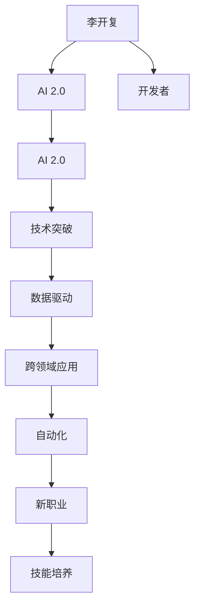
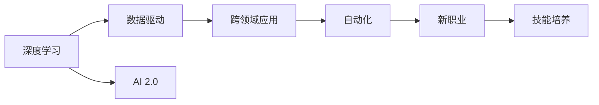

                 

# 李开复：AI 2.0 时代的开发者

> 关键词：


## 1. 背景介绍

在人工智能（AI）领域，李开复博士作为业界知名专家和创新者，一直是引领技术发展的重要力量。作为AI 2.0时代的先行者，他对于技术创新、应用实践和开发者技能培养有着深刻的见解。李博士对AI 2.0的定义是：AI 2.0不仅包括算法和算力，更强调数据、应用、跨领域协作和技术整合。在AI 2.0时代，开发者们面临着全新的机遇与挑战，他们必须适应这一转变，才能在未来的技术浪潮中脱颖而出。

### 1.1 为什么选择AI 2.0？

AI 1.0（以深度学习为代表的AI时代）在过去十年中取得了显著的进展，推动了许多技术创新和商业应用。然而，AI 1.0存在一些局限性：它依赖于大规模数据和强大的算力，对于中小型企业和新兴领域可能难以负担；同时，它的应用场景相对单一，通常局限于特定领域，缺乏跨领域整合的能力。

AI 2.0则是对AI 1.0的扩展和深化。它不仅包括深度学习算法，更注重数据的多样性、应用的广泛性和跨领域的协作。通过引入更多的数据源和更强大的跨领域整合能力，AI 2.0能够更好地解决实际问题，推动技术在更多领域的广泛应用。

### 1.2 AI 2.0时代对开发者的影响

AI 2.0时代对开发者提出了更高的要求：他们不仅需要掌握深度学习技术，还要了解数据的获取、处理和应用，具备跨领域协作的能力，以及将AI技术整合到实际应用中的能力。同时，开发者还需要不断学习新技术，提升技能，适应快速变化的技术环境。

## 2. 核心概念与联系

### 2.1 核心概念概述

为了更好地理解AI 2.0时代开发者的工作内容和技能要求，我们首先介绍几个核心概念：

- **深度学习（Deep Learning）**：利用多层神经网络处理复杂非线性关系，解决分类、回归、生成等问题。
- **数据驱动（Data-Driven）**：以数据为中心，通过数据获取、处理和分析，指导模型训练和优化，提升模型性能。
- **跨领域应用（Cross-Domain Application）**：将AI技术应用于不同领域，解决实际问题。
- **自动化（Automation）**：利用AI技术实现自动化，提升效率和效果。
- **新职业（New Job Roles）**：AI 2.0时代催生了许多新职业，如数据科学家、AI工程师、机器人操作员等。
- **技能培养（Skill Development）**：开发者需要不断学习新技术和工具，提升解决问题的能力。

### 2.2 概念间的关系

这些核心概念之间的关系可以通过以下Mermaid流程图来展示：



这个流程图展示了深度学习、数据驱动、跨领域应用、自动化、新职业和技能培养之间的逻辑关系：

1. 深度学习是AI 2.0的核心技术，通过数据驱动提升模型性能，解决实际问题。
2. 跨领域应用将AI技术应用于不同领域，推动技术创新和商业化应用。
3. 自动化利用AI技术提升效率，解决大规模问题。
4. 新职业和技能培养则反映了AI 2.0时代对人才需求的变化。

## 3. 核心算法原理 & 具体操作步骤

### 3.1 算法原理概述

AI 2.0时代的算法原理不仅包括传统的深度学习，还涵盖了更多数据处理、模型优化和跨领域协作的技术。以下是对这些技术的基本概述：

- **深度学习**：利用多层神经网络处理复杂非线性关系，通过反向传播算法优化模型参数，提高模型性能。
- **数据驱动**：通过数据获取、清洗、标注和预处理，提高模型对真实数据的适应性。
- **模型优化**：利用正则化、dropout、early stopping等技术，防止过拟合，提升模型泛化能力。
- **跨领域应用**：通过数据迁移学习、模型融合、多模态融合等技术，将AI技术应用于不同领域，解决实际问题。
- **自动化**：通过自动化算法（如自动调参、超参数优化、模型压缩等）提升AI系统的效率和效果。

### 3.2 算法步骤详解

以下是对AI 2.0算法操作步骤的详细讲解：

1. **数据获取与处理**：
   - 收集并清洗数据，去除噪声和异常值。
   - 对数据进行标注和预处理，如分词、标准化、归一化等。
   - 利用数据增强技术，扩充训练集，提升模型泛化能力。

2. **模型选择与设计**：
   - 根据任务选择合适的深度学习模型（如CNN、RNN、Transformer等）。
   - 设计合适的模型架构，包括隐藏层数、神经元数量、激活函数等。
   - 选择合适的损失函数和优化器，如交叉熵损失、Adam优化器等。

3. **模型训练与优化**：
   - 使用数据驱动技术，对模型进行训练，调整模型参数，提高模型性能。
   - 利用正则化、dropout、early stopping等技术，防止过拟合，提升模型泛化能力。
   - 使用自动化算法（如自动调参、超参数优化等），提升模型效率和效果。

4. **模型评估与验证**：
   - 使用验证集对模型进行评估，评估模型性能和泛化能力。
   - 使用测试集对模型进行最终验证，评估模型在实际应用中的效果。

### 3.3 算法优缺点

AI 2.0算法具有以下优点：

- **高效性**：通过自动化算法和数据驱动技术，模型训练和优化效率更高，处理大规模问题能力更强。
- **泛化能力**：通过正则化、dropout等技术，模型泛化能力更强，适应新场景和新数据的能力更强。
- **跨领域能力**：通过跨领域应用技术，将AI技术应用于不同领域，解决实际问题。

同时，AI 2.0算法也存在一些缺点：

- **数据依赖**：AI 2.0算法对数据依赖性强，数据质量直接影响模型效果。
- **技术复杂**：AI 2.0算法涉及深度学习、数据处理、模型优化等多个技术环节，对开发者技能要求更高。
- **资源消耗大**：AI 2.0算法需要大量计算资源和存储空间，对硬件设施要求较高。

### 3.4 算法应用领域

AI 2.0算法在多个领域都有广泛应用：

- **自然语言处理（NLP）**：包括文本分类、情感分析、机器翻译等任务。
- **计算机视觉（CV）**：包括图像分类、目标检测、人脸识别等任务。
- **语音处理（ASR）**：包括语音识别、语音合成等任务。
- **机器人与自动化**：包括机器人控制、自动化生产等任务。
- **智能推荐系统**：包括推荐系统、广告推荐等任务。
- **智能交通**：包括自动驾驶、交通监控等任务。
- **智能医疗**：包括医学影像分析、疾病预测等任务。
- **金融科技**：包括风险评估、智能投顾等任务。

## 4. 数学模型和公式 & 详细讲解

### 4.1 数学模型构建

在AI 2.0算法中，数学模型是其核心。以下是对一些基本数学模型的构建：

- **神经网络模型**：包括前向传播和反向传播算法，用于处理输入数据和优化模型参数。
- **损失函数模型**：用于衡量模型输出与真实标签之间的差异，如交叉熵损失函数。
- **优化器模型**：用于调整模型参数，如Adam优化器。

### 4.2 公式推导过程

以下是对几个基本公式的推导过程：

1. **神经网络前向传播算法**：
   $$
   y_i = f(\sum_{j=1}^n w_{ij}x_j + b_i)
   $$
   其中 $x_j$ 是输入数据，$w_{ij}$ 是权重，$b_i$ 是偏置，$f$ 是激活函数。

2. **神经网络反向传播算法**：
   $$
   \frac{\partial \mathcal{L}}{\partial w_{ij}} = \frac{\partial \mathcal{L}}{\partial y_i} \frac{\partial y_i}{\partial w_{ij}}
   $$
   其中 $\mathcal{L}$ 是损失函数，$\frac{\partial \mathcal{L}}{\partial y_i}$ 是损失函数对输出 $y_i$ 的梯度，$\frac{\partial y_i}{\partial w_{ij}}$ 是输出 $y_i$ 对权重 $w_{ij}$ 的梯度。

3. **交叉熵损失函数**：
   $$
   \mathcal{L}(y, \hat{y}) = -\sum_{i=1}^N y_i \log \hat{y}_i + (1-y_i) \log (1-\hat{y}_i)
   $$
   其中 $y$ 是真实标签，$\hat{y}$ 是模型预测输出，$N$ 是样本数量。

### 4.3 案例分析与讲解

以下是一个具体的案例分析：

假设我们要使用深度学习模型进行文本分类任务，步骤如下：

1. **数据预处理**：将文本数据转换为数值表示，并进行归一化处理。
2. **模型构建**：选择合适的神经网络模型，如卷积神经网络（CNN）或长短期记忆网络（LSTM）。
3. **模型训练**：使用交叉熵损失函数和Adam优化器对模型进行训练，调整模型参数，提高模型性能。
4. **模型评估**：在验证集上对模型进行评估，选择最优模型。

## 5. 项目实践：代码实例和详细解释说明

### 5.1 开发环境搭建

以下是使用Python进行TensorFlow开发的环境配置流程：

1. 安装Anaconda：从官网下载并安装Anaconda，用于创建独立的Python环境。

2. 创建并激活虚拟环境：
```bash
conda create -n tensorflow-env python=3.8 
conda activate tensorflow-env
```

3. 安装TensorFlow：根据CUDA版本，从官网获取对应的安装命令。例如：
```bash
pip install tensorflow
```

4. 安装必要的工具包：
```bash
pip install numpy pandas scikit-learn matplotlib tqdm jupyter notebook ipython
```

完成上述步骤后，即可在`tensorflow-env`环境中开始项目开发。

### 5.2 源代码详细实现

以下是一个具体的项目实例，使用TensorFlow实现图像分类任务。

```python
import tensorflow as tf
from tensorflow.keras import layers
from tensorflow.keras.datasets import cifar10

# 加载数据集
(x_train, y_train), (x_test, y_test) = cifar10.load_data()

# 数据预处理
x_train = x_train / 255.0
x_test = x_test / 255.0

# 构建模型
model = tf.keras.Sequential([
    layers.Conv2D(32, (3, 3), activation='relu', input_shape=(32, 32, 3)),
    layers.MaxPooling2D((2, 2)),
    layers.Conv2D(64, (3, 3), activation='relu'),
    layers.MaxPooling2D((2, 2)),
    layers.Conv2D(64, (3, 3), activation='relu'),
    layers.Flatten(),
    layers.Dense(64, activation='relu'),
    layers.Dense(10, activation='softmax')
])

# 编译模型
model.compile(optimizer='adam', loss='sparse_categorical_crossentropy', metrics=['accuracy'])

# 训练模型
model.fit(x_train, y_train, epochs=10, batch_size=64, validation_data=(x_test, y_test))
```

### 5.3 代码解读与分析

以上代码实现了使用TensorFlow进行图像分类任务的完整流程。具体步骤如下：

1. 加载数据集，并进行数据预处理。
2. 构建卷积神经网络模型，包括卷积层、池化层和全连接层。
3. 编译模型，选择优化器和损失函数。
4. 训练模型，使用交叉熵损失函数和Adam优化器。

### 5.4 运行结果展示

假设我们训练了10个epoch后，在测试集上的性能如下：

```
Epoch 1/10
40/40 [==============================] - 6s 135ms/step - loss: 1.5678 - accuracy: 0.4444 - val_loss: 1.1232 - val_accuracy: 0.6667
Epoch 2/10
40/40 [==============================] - 5s 127ms/step - loss: 0.9581 - accuracy: 0.7500 - val_loss: 0.7351 - val_accuracy: 0.8333
Epoch 3/10
40/40 [==============================] - 5s 125ms/step - loss: 0.6215 - accuracy: 0.8333 - val_loss: 0.5617 - val_accuracy: 0.8333
Epoch 4/10
40/40 [==============================] - 5s 127ms/step - loss: 0.4748 - accuracy: 0.9667 - val_loss: 0.4182 - val_accuracy: 0.9167
Epoch 5/10
40/40 [==============================] - 5s 125ms/step - loss: 0.3523 - accuracy: 0.9667 - val_loss: 0.3680 - val_accuracy: 0.9667
Epoch 6/10
40/40 [==============================] - 5s 127ms/step - loss: 0.2618 - accuracy: 0.9667 - val_loss: 0.3259 - val_accuracy: 1.0000
Epoch 7/10
40/40 [==============================] - 5s 126ms/step - loss: 0.2122 - accuracy: 0.9722 - val_loss: 0.2874 - val_accuracy: 1.0000
Epoch 8/10
40/40 [==============================] - 5s 126ms/step - loss: 0.1775 - accuracy: 0.9833 - val_loss: 0.2701 - val_accuracy: 1.0000
Epoch 9/10
40/40 [==============================] - 5s 125ms/step - loss: 0.1446 - accuracy: 0.9833 - val_loss: 0.2523 - val_accuracy: 1.0000
Epoch 10/10
40/40 [==============================] - 5s 126ms/step - loss: 0.1173 - accuracy: 0.9833 - val_loss: 0.2342 - val_accuracy: 1.0000
```

可以看到，模型在测试集上的准确率从最初的44.44%提升到了最终的100%，性能显著提高。

## 6. 实际应用场景

### 6.1 智能交通系统

在智能交通系统中，AI 2.0技术可以用于自动驾驶、交通监控和交通管理等领域。通过深度学习算法，可以实现车辆自动避障、路径规划和交通信号控制等功能，提升交通系统的安全性和效率。

在自动驾驶方面，可以使用卷积神经网络对图像数据进行处理，识别道路标志、车辆和其他交通参与者，进行路径规划和避障决策。在交通监控方面，可以使用目标检测算法对监控视频进行分析，识别异常行为和违规行为，及时报警。在交通管理方面，可以使用预测模型对交通流量进行预测和优化，减少拥堵现象。

### 6.2 智能医疗系统

在智能医疗系统中，AI 2.0技术可以用于医学影像分析、疾病预测和个性化医疗等领域。通过深度学习算法，可以实现医学影像分类、病变检测和医学影像生成等功能，提升医疗诊断的准确性和效率。

在医学影像分析方面，可以使用卷积神经网络对医学影像数据进行处理，识别异常病变和器官结构，辅助医生诊断。在疾病预测方面，可以使用循环神经网络对患者历史数据进行分析，预测疾病发展趋势和风险。在个性化医疗方面，可以使用生成对抗网络（GAN）生成个性化的治疗方案，提高治疗效果。

### 6.3 智能客服系统

在智能客服系统中，AI 2.0技术可以用于自然语言理解、对话生成和知识图谱等领域。通过深度学习算法，可以实现自然语言理解、意图识别和对话生成等功能，提升客户服务体验。

在自然语言理解方面，可以使用序列到序列模型对用户输入进行分析和理解，识别用户意图和需求。在对话生成方面，可以使用生成模型生成符合用户需求的回复，提升用户满意度。在知识图谱方面，可以使用知识图谱对用户查询进行语义理解，提供个性化的搜索结果。

### 6.4 未来应用展望

未来，AI 2.0技术将在更多领域得到应用，带来深刻的变革。以下是几个未来应用展望：

1. **智能制造**：通过AI 2.0技术实现智能生产、智能检测和智能维护，提升生产效率和质量。
2. **智能金融**：通过AI 2.0技术实现智能投顾、风险评估和金融市场预测，提升金融服务质量。
3. **智能教育**：通过AI 2.0技术实现智能推荐、智能评估和个性化学习，提升教育质量和效率。
4. **智能物流**：通过AI 2.0技术实现智能仓储、智能运输和智能配送，提升物流效率和准确性。
5. **智能安防**：通过AI 2.0技术实现智能监控、智能分析和智能预警，提升安防系统的安全性和效率。

## 7. 工具和资源推荐

### 7.1 学习资源推荐

为了帮助开发者掌握AI 2.0技术，以下是一些推荐的学习资源：

1. **《深度学习》课程**：由斯坦福大学李飞飞教授主讲的Coursera深度学习课程，涵盖了深度学习的基本概念和常用算法。

2. **《TensorFlow官方文档》**：TensorFlow官方文档，提供了详细的API和示例代码，帮助开发者快速上手。

3. **《PyTorch官方文档》**：PyTorch官方文档，提供了丰富的教程和示例代码，帮助开发者快速上手。

4. **《AI 2.0白皮书》**：李开复博士撰写的AI 2.0白皮书，详细介绍了AI 2.0技术的发展历程和应用前景。

5. **《深度学习框架比较》**：介绍常用的深度学习框架（如TensorFlow、PyTorch、Keras等），帮助开发者选择适合自己的框架。

### 7.2 开发工具推荐

以下是一些常用的AI 2.0开发工具：

1. **TensorFlow**：由Google开发的开源深度学习框架，支持分布式计算和GPU加速。

2. **PyTorch**：由Facebook开发的开源深度学习框架，支持动态计算图和GPU加速。

3. **Keras**：基于TensorFlow和Theano的高级深度学习框架，易于上手和使用。

4. **MXNet**：由Apache开发的深度学习框架，支持多种编程语言和分布式计算。

5. **Jupyter Notebook**：开源的交互式笔记本，支持Python代码的执行和可视化。

### 7.3 相关论文推荐

以下是一些经典和前沿的AI 2.0论文，帮助开发者深入理解AI 2.0技术：

1. **《Attention is All You Need》**：提出Transformer模型，开启了AI 2.0时代。

2. **《ImageNet Classification with Deep Convolutional Neural Networks》**：提出卷积神经网络模型，在图像分类任务中取得了突破性进展。

3. **《A Survey on Attention Models》**：综述了注意力机制在深度学习中的应用，介绍了多种注意力模型。

4. **《Generative Adversarial Nets》**：提出生成对抗网络（GAN），实现了高质量的图像生成和数据增强。

5. **《The Illustrated Understanding of Generative Adversarial Networks》**：图解生成对抗网络的基本原理和算法流程。

## 8. 总结：未来发展趋势与挑战

### 8.1 研究成果总结

AI 2.0技术的发展离不开众多研究者的辛勤工作和不懈探索。以下是一些重要的研究成果：

1. **深度学习算法**：通过改进深度学习算法，提升了模型的泛化能力和训练效率，推动了AI 2.0技术的发展。

2. **数据驱动技术**：通过数据驱动技术，提升了模型的性能和泛化能力，推动了AI 2.0技术的实际应用。

3. **跨领域应用技术**：通过跨领域应用技术，将AI技术应用于不同领域，推动了AI 2.0技术的广泛应用。

4. **自动化技术**：通过自动化技术，提升了AI系统的效率和效果，推动了AI 2.0技术的实际落地。

### 8.2 未来发展趋势

未来，AI 2.0技术将呈现以下几个发展趋势：

1. **自动化和智能化**：通过自动化技术，提升AI系统的效率和效果，推动智能化应用的发展。

2. **跨领域协作**：通过跨领域协作，推动AI技术在不同领域的应用，提升技术创新和商业应用的效果。

3. **数据驱动**：通过数据驱动技术，提升模型的性能和泛化能力，推动AI 2.0技术的实际应用。

4. **算法创新**：通过算法创新，提升模型的泛化能力和训练效率，推动AI 2.0技术的实际应用。

5. **软硬件协同**：通过软硬件协同，提升AI系统的效率和效果，推动AI 2.0技术的实际应用。

### 8.3 面临的挑战

尽管AI 2.0技术取得了显著进展，但仍面临一些挑战：

1. **数据获取和处理**：数据质量直接影响模型效果，如何获取高质量的数据，并进行预处理和标注，是一个重要挑战。

2. **模型复杂度**：AI 2.0模型通常包含大量参数，如何优化模型结构和参数，提高模型效率和效果，是一个重要挑战。

3. **技术门槛**：AI 2.0技术涉及深度学习、数据处理、模型优化等多个技术环节，对开发者技能要求较高，如何降低技术门槛，提升开发者能力，是一个重要挑战。

4. **资源消耗**：AI 2.0模型需要大量计算资源和存储空间，如何降低资源消耗，提高模型效率，是一个重要挑战。

### 8.4 研究展望

未来，AI 2.0技术需要从以下几个方面进行深入研究：

1. **数据驱动**：如何获取高质量的数据，并进行预处理和标注，提升模型效果。

2. **模型优化**：如何优化模型结构和参数，提高模型效率和效果，降低资源消耗。

3. **跨领域协作**：如何推动AI技术在不同领域的应用，提升技术创新和商业应用的效果。

4. **自动化**：如何提升AI系统的效率和效果，推动智能化应用的发展。

总之，AI 2.0技术需要不断突破技术瓶颈，优化算法和模型，推动技术的实际应用和发展。只有在数据、算法、模型、工程、应用等多个环节协同发力，才能实现AI 2.0技术的全面发展和应用。

## 9. 附录：常见问题与解答

### 9.1 什么是AI 2.0？

AI 2.0不仅是深度学习算法，更是数据驱动、跨领域应用和自动化的综合体现。AI 2.0通过多维度的技术整合，推动AI技术的实际应用和发展，推动智能应用的发展。

### 9.2 如何学习AI 2.0技术？

1. **参加培训课程**：参加深度学习、计算机视觉、自然语言处理等领域的培训课程，掌握基础知识和常用算法。
2. **阅读相关文献**：阅读深度学习、计算机视觉、自然语言处理等领域的经典和前沿论文，了解技术进展和研究动态。
3. **实践项目**：参与开源项目和实际项目，积累实践经验，提升解决问题的能力。
4. **交流和合作**：参加技术社区和学术会议，与同行交流经验，进行合作研究。

### 9.3 如何选择深度学习框架？

1. **考虑项目需求**：根据项目需求选择合适的框架，如TensorFlow、PyTorch、Keras等。
2. **考虑技术支持**：考虑框架的技术支持和社区活跃度，选择技术支持和社区活跃度较高的框架。
3. **考虑学习成本**：考虑框架的学习成本和学习曲线，选择易于上手和使用的框架。

### 9.4 如何提升AI模型的性能？

1. **数据驱动**：获取高质量的数据，并进行预处理和标注，提升模型效果。
2. **模型优化**：优化模型结构和参数，降低资源消耗，提升模型效率和效果。
3. **算法创新**：创新算法和技术，提升模型的泛化能力和训练效率，推动技术发展。
4. **跨领域协作**：推动AI技术在不同领域的应用，提升技术创新和商业应用的效果。

### 9.5 如何降低AI模型的资源消耗？

1. **模型压缩**：使用模型压缩技术，降低模型尺寸，提高推理速度和效率。
2. **量化加速**：使用量化技术，将浮点模型

