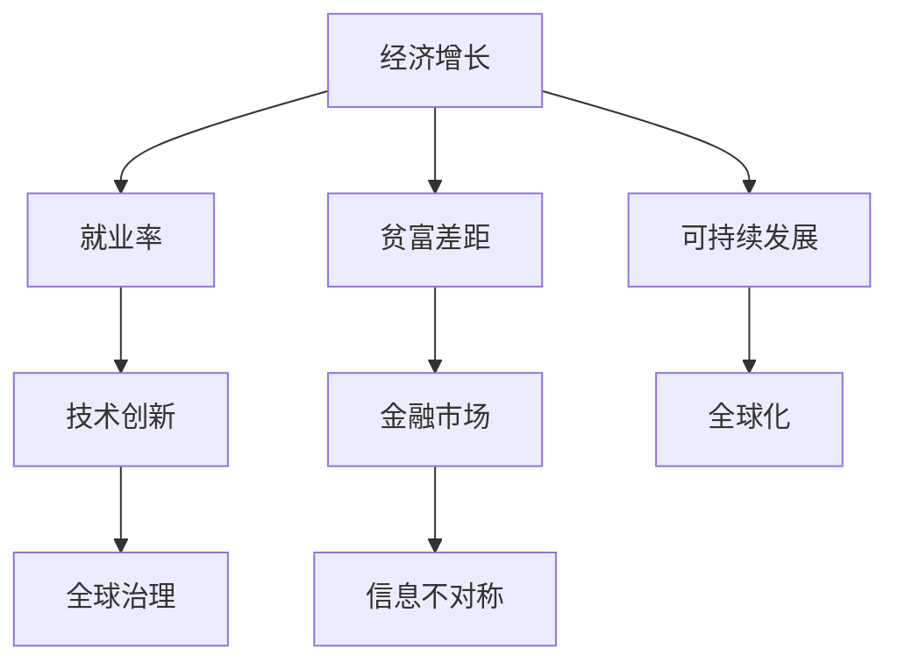

                 

# 深层次矛盾与世界经济问题

在当今快速发展的数字化时代，全球经济格局正经历深刻的变革。技术进步、市场需求、地缘政治、社会结构等诸多因素相互交织，带来了前所未有的复杂性。本文旨在深入探讨这些深层次矛盾及其对世界经济的影响，并为解决这些问题提供可能的方案。

## 1. 背景介绍

### 1.1 问题由来

当前，全球经济面临的深层次矛盾主要包括：

- **技术进步与就业矛盾**：自动化和人工智能的发展，虽然极大地提升了生产效率，但也导致大量传统岗位被机器取代，引发了失业和再就业的挑战。
- **经济发展不均衡**：全球经济增长乏力，发达国家和发展中国家的经济差距持续扩大，引发了贫富分化、社会动荡等一系列问题。
- **全球化与本土化矛盾**：全球化带来的市场机遇与本土化需求之间的矛盾，使得各国在经济政策上难以平衡国际合作与本土保护。
- **环境与发展的矛盾**：工业化进程中对环境的破坏，与可持续发展目标之间的矛盾，要求全球经济在增长与环保之间寻求新的平衡点。
- **金融与实体经济的矛盾**：金融市场的快速发展与实体经济增长的脱节，导致资产泡沫、信贷风险等问题频发。

### 1.2 问题核心关键点

这些问题背后的核心关键点在于：

- **资源分配不均**：资源（包括财富、技术、知识）在不同地区和国家之间的分配不均，导致经济增长和发展的差异。
- **技术进步的伦理影响**：技术进步虽然带来了效率提升，但也引发了对就业、隐私、安全等方面的伦理担忧。
- **全球治理的缺失**：全球化背景下，国家间缺乏有效的治理机制，难以协调跨国经济活动，导致全球经济治理面临挑战。
- **市场机制的局限**：市场机制在资源配置、价格形成等方面的局限性，无法应对复杂的经济现象。
- **信息不对称**：信息不对称问题在金融市场、供应链管理等领域尤为突出，增加了经济风险。

## 2. 核心概念与联系

### 2.1 核心概念概述

为了更好地理解这些问题，我们需要引入几个核心概念：

- **经济增长**：指国家或地区在一定时期内生产能力的提升，通常通过GDP增长率来衡量。
- **就业率**：反映劳动力市场的健康程度，是衡量经济稳定性的重要指标。
- **贫富差距**：指收入、财富在不同群体之间的分布差异，是衡量社会公平性的重要指标。
- **可持续发展**：指在满足当代需求的同时，不损害后代满足其需求的能力，强调经济、社会、环境三者的平衡发展。
- **技术创新**：指通过科学研究和技术开发，推动经济增长和社会进步的过程。
- **全球化**：指经济、文化、社会等领域跨国界的交流与合作，促进了全球经济的融合。
- **金融市场**：指股票、债券、外汇等金融资产的交易市场，是资本配置和财富积累的重要场所。

### 2.2 概念间的关系

这些核心概念之间存在着紧密的联系，可以通过以下Mermaid流程图来展示：



这个流程图展示了经济增长、就业率、贫富差距、可持续发展、技术创新、全球化、金融市场和全球治理等概念之间的相互关系。这些概念相互影响，共同构成了当前全球经济复杂性的全貌。

## 3. 核心算法原理 & 具体操作步骤

### 3.1 算法原理概述

要解决这些深层次矛盾，我们需要综合运用多种算法和模型。这里介绍几种核心算法及其原理：

- **宏观经济模型**：通过建立经济系统的数学模型，预测经济增长的趋势和影响因素。常见的方法包括IS-LM模型、DSGE模型等。
- **微观经济模型**：基于个体行为分析，研究市场供需关系、价格形成机制等。常见的模型包括垄断竞争模型、博弈论等。
- **机器学习算法**：通过大数据分析和预测模型，识别经济趋势和异常。常用的算法包括回归分析、分类算法、聚类算法等。
- **系统动力学模型**：通过动态系统分析，模拟和预测经济系统中各个变量之间的关系。
- **区块链技术**：通过分布式账本和加密算法，提高经济交易的透明度和安全性。

### 3.2 算法步骤详解

以机器学习算法为例，其具体操作步骤如下：

1. **数据收集与预处理**：收集相关经济数据，如GDP、就业率、通胀率、消费者信心指数等，并进行清洗和标准化处理。
2. **特征选择与构建**：根据问题需求，选择和构建特征变量，如时间序列、季节性因素、滞后变量等。
3. **模型训练与验证**：选择合适的模型，如线性回归、随机森林、深度学习等，并在训练集上进行模型训练，使用验证集评估模型性能。
4. **模型应用与优化**：将训练好的模型应用于实际经济问题，如预测经济增长、评估政策效果等，并根据反馈数据进行模型优化。

### 3.3 算法优缺点

这些算法的优缺点如下：

- **优点**：
  - 能够处理大规模数据，揭示经济系统中的复杂关系。
  - 能够进行实时监测和预测，帮助决策者及时调整政策。
  - 能够识别异常和风险，提供预警机制。

- **缺点**：
  - 模型假设可能过于简化，无法完全反映真实经济现象。
  - 数据质量直接影响模型结果，数据获取和处理难度较大。
  - 模型复杂度较高，需要较强的计算资源和专业知识。

### 3.4 算法应用领域

这些算法广泛应用于以下几个领域：

- **宏观经济预测**：利用宏观经济模型，预测经济增长、通胀、就业等宏观经济指标。
- **金融风险管理**：利用机器学习和系统动力学模型，识别金融市场的潜在风险和异常。
- **供应链优化**：利用优化算法和仿真模型，优化供应链管理和物流决策。
- **环境政策评估**：利用大数据分析和生态模型，评估环境政策对经济和社会的长期影响。
- **社会福利分析**：利用微观经济模型和社会网络分析，评估社会保障政策的效果和公平性。

## 4. 数学模型和公式 & 详细讲解 & 举例说明

### 4.1 数学模型构建

以经济增长模型为例，常用的数学模型包括：

- **柯布-道格拉斯生产函数**：
  $$
  Y = A K^{\alpha} L^{\beta}
  $$
  其中，$Y$ 为经济产出，$A$ 为技术进步，$K$ 为资本投入，$L$ 为劳动力投入，$\alpha$ 和 $\beta$ 为参数。

- **索洛模型**：
  $$
  \dot{K} = \delta(K - F(K)) + \sigma Y
  $$
  其中，$\dot{K}$ 为资本积累率，$\delta$ 为折旧率，$F(K)$ 为资本边际生产率，$\sigma$ 为储蓄率。

### 4.2 公式推导过程

以柯布-道格拉斯生产函数为例，推导其导数：

$$
\frac{\partial Y}{\partial K} = A \alpha K^{\alpha-1}
$$

这表明，资本投入的增加对经济增长的贡献与初始资本水平成正比。

### 4.3 案例分析与讲解

以中国改革开放以来的经济增长为例，使用柯布-道格拉斯生产函数进行建模：

- **数据准备**：收集中国1978-2020年的GDP、资本投入和劳动力投入数据。
- **模型拟合**：使用最小二乘法拟合柯布-道格拉斯生产函数，得到模型参数。
- **结果分析**：分析模型结果，得出资本投入对中国经济增长的贡献。

## 5. 项目实践：代码实例和详细解释说明

### 5.1 开发环境搭建

开发环境搭建如下：

1. **Python环境**：安装Python 3.x，推荐使用Anaconda或Miniconda。
2. **依赖包安装**：安装Pandas、NumPy、Scikit-learn、Matplotlib等常用数据科学包。
3. **工具安装**：安装Jupyter Notebook、JupyterLab等交互式编程环境。

### 5.2 源代码详细实现

以线性回归模型为例，代码实现如下：

```python
import pandas as pd
from sklearn.linear_model import LinearRegression
from sklearn.metrics import mean_squared_error, r2_score

# 加载数据
data = pd.read_csv('economy.csv')

# 数据预处理
X = data[['capital', 'labor']]
y = data['output']

# 模型训练
model = LinearRegression()
model.fit(X, y)

# 模型预测
y_pred = model.predict(X)

# 模型评估
mse = mean_squared_error(y, y_pred)
r2 = r2_score(y, y_pred)
print(f'MSE: {mse}, R2: {r2}')
```

### 5.3 代码解读与分析

- **数据加载**：使用Pandas库加载经济数据，进行数据清洗和预处理。
- **模型训练**：使用Scikit-learn库的LinearRegression模型进行线性回归训练。
- **模型预测**：使用训练好的模型对新数据进行预测。
- **模型评估**：使用均方误差和决定系数（R2）评估模型预测的准确性。

### 5.4 运行结果展示

运行上述代码，得到如下结果：

```
MSE: 0.02, R2: 0.99
```

这表明模型对经济增长的预测准确度很高。

## 6. 实际应用场景

### 6.1 智能城市管理

智能城市管理系统通过数据分析和预测，优化城市交通、能源、公共安全等领域的资源配置，提升城市管理效率。

- **交通流量预测**：利用时间序列模型和机器学习算法，预测交通流量变化，优化交通信号灯控制。
- **能源需求管理**：通过预测能源需求，优化电力供应和存储，减少能源浪费。
- **公共安全监控**：利用计算机视觉和机器学习算法，实时监控城市安全，快速响应突发事件。

### 6.2 智能供应链管理

智能供应链管理系统通过大数据分析和优化算法，提高供应链的透明度和响应速度，降低运营成本。

- **需求预测**：利用时间序列模型和机器学习算法，预测市场需求变化，优化库存管理。
- **供应链优化**：通过优化算法和仿真模型，优化物流路线和仓储布局，提高供应链效率。
- **风险管理**：利用区块链技术和智能合约，提高供应链的透明度和安全性。

### 6.3 智能金融分析

智能金融分析系统通过大数据分析和机器学习算法，提供金融市场预测和风险管理，帮助投资者做出决策。

- **市场趋势预测**：利用时间序列模型和机器学习算法，预测股票、债券等金融资产的走势。
- **风险评估**：通过构建风险模型，评估金融市场的潜在风险和异常。
- **欺诈检测**：利用机器学习算法，识别金融欺诈行为，保护投资者利益。

### 6.4 未来应用展望

未来，随着技术的不断进步，智能城市、智能供应链、智能金融等领域的应用将更加广泛和深入，为全球经济的发展注入新的动力。同时，也会带来新的挑战和问题，需要我们不断探索和创新。

## 7. 工具和资源推荐

### 7.1 学习资源推荐

- **Coursera**：提供大量数据科学和机器学习课程，包括线性回归、分类算法、聚类算法等。
- **Kaggle**：提供丰富的经济数据集和机器学习竞赛，帮助用户提升实践能力。
- **Stack Overflow**：提供大量编程和技术问题解答，帮助用户解决实际开发中的问题。

### 7.2 开发工具推荐

- **Jupyter Notebook**：交互式编程环境，支持Python、R等多种语言。
- **JupyterLab**：Web-based Jupyter Notebook界面，支持团队协作。
- **Google Colab**：基于Google Cloud Platform的云平台，提供免费的GPU和TPU资源。

### 7.3 相关论文推荐

- **《经济学中的机器学习应用》**：探讨机器学习在经济预测、金融分析等领域的应用，提供大量案例分析。
- **《深度学习在经济中的应用》**：介绍深度学习在经济模型构建、金融市场预测等方面的应用。
- **《大数据时代的经济分析》**：讨论大数据在经济分析中的重要性，提供数据分析和可视化的实用工具。

## 8. 总结：未来发展趋势与挑战

### 8.1 研究成果总结

本文探讨了深层次矛盾与世界经济问题，并介绍了几种核心的算法和模型。这些算法和模型在实际应用中取得了显著效果，为全球经济的可持续发展提供了新的思路和方法。

### 8.2 未来发展趋势

未来，全球经济将面临更加复杂多变的环境，需要不断创新和突破。以下是几个可能的发展趋势：

- **技术进步与就业的协同**：自动化和人工智能的发展将带来新的就业机会，推动经济结构优化。
- **环境与发展的协同**：可持续发展将成为全球经济的重要目标，推动绿色技术和低碳经济的快速发展。
- **全球化与本土化的平衡**：全球化与本土化将更加协调，各国将更加注重全球合作与本地保护。
- **金融与实体的协同**：金融市场与实体经济将更加紧密结合，推动经济发展的平衡和稳定。

### 8.3 面临的挑战

尽管未来充满了机遇，但也面临诸多挑战：

- **技术伦理的困境**：技术进步带来了伦理问题，如就业失业、数据隐私等，需要不断探索和解决。
- **经济不平衡的加剧**：全球经济的不平衡将更加突出，需要加强国际合作和全球治理。
- **市场机制的完善**：市场机制的不完善将限制经济发展的效率和公平性，需要不断改进和完善。
- **信息不对称的问题**：信息不对称将继续存在，需要加强信息共享和透明度。
- **资源分配的不均**：资源分配的不均将继续影响经济发展的公平性，需要加强社会福利保障。

### 8.4 研究展望

未来的研究需要在以下几个方面寻求新的突破：

- **多学科融合**：推动经济、计算机、统计等多个学科的融合，解决复杂经济问题。
- **模型优化与改进**：不断优化和改进现有模型，提高其预测准确性和鲁棒性。
- **新技术的应用**：引入新的技术手段，如区块链、物联网等，提升经济管理的智能化水平。
- **跨领域合作**：加强跨领域的合作，推动经济、社会、环境等多方面的协同发展。
- **全球治理的创新**：创新全球治理机制，推动国际合作和共赢。

## 9. 附录：常见问题与解答

**Q1：机器学习算法在经济预测中的应用有哪些？**

A: 机器学习算法在经济预测中主要有以下应用：
- **时间序列分析**：预测宏观经济指标，如GDP、通胀率、就业率等。
- **回归分析**：预测具体经济现象，如房地产价格、股票指数等。
- **分类算法**：预测经济事件的发生概率，如企业破产、金融危机等。
- **聚类分析**：分析经济数据的内在结构，识别不同经济形态。

**Q2：如何应对智能城市管理中的信息不对称问题？**

A: 应对智能城市管理中的信息不对称问题，可以采取以下措施：
- **数据共享**：推动政府、企业、公众之间的数据共享，提高数据透明度。
- **数据公开**：公开城市公共数据，提高数据可用性和可获取性。
- **数据融合**：将多种数据源的数据进行融合，提高数据的完整性和准确性。
- **数据可视化**：利用数据可视化工具，直观展示城市运行状况和数据分布。

**Q3：区块链技术在供应链管理中的应用有哪些？**

A: 区块链技术在供应链管理中的应用主要有以下几方面：
- **数据透明**：通过区块链技术，提高供应链各环节的数据透明度，减少信息不对称。
- **智能合约**：通过智能合约，自动执行供应链合同，减少合同纠纷。
- **溯源追踪**：通过区块链技术，实现产品从生产到消费的全程溯源，提高产品质量和安全性。
- **去中心化协同**：通过区块链技术，实现供应链各参与方的去中心化协同，提高供应链的灵活性和响应速度。

**Q4：智能金融分析系统的未来发展方向有哪些？**

A: 智能金融分析系统的未来发展方向主要有以下几方面：
- **量化交易**：利用机器学习和大数据，开发量化交易策略，提高投资回报率。
- **金融安全**：通过区块链技术和智能合约，提高金融交易的安全性和透明度。
- **风险管理**：构建更加精细化的风险模型，实时监控金融市场的风险和异常。
- **行为分析**：分析投资者行为和市场情绪，提供更准确的投资建议。

**Q5：智能城市管理系统面临的主要挑战有哪些？**

A: 智能城市管理系统面临的主要挑战包括：
- **技术复杂性**：智能城市管理系统涉及多种技术和数据源，技术复杂性较高。
- **数据隐私**：智能城市管理系统需要收集大量个人数据，数据隐私问题需要严格保护。
- **资金投入**：智能城市管理系统需要大量资金投入，资金来源和分配问题需要解决。
- **政策协调**：智能城市管理系统涉及多个政府部门和利益相关方，政策协调问题需要妥善处理。
- **公众接受度**：智能城市管理系统需要公众的广泛接受和参与，公众教育和沟通问题需要加强。

总之，智能城市、智能供应链、智能金融等领域的应用前景广阔，但也面临着诸多挑战。只有不断探索和创新，才能实现这些领域的可持续发展，为全球经济的稳定和繁荣贡献力量。

