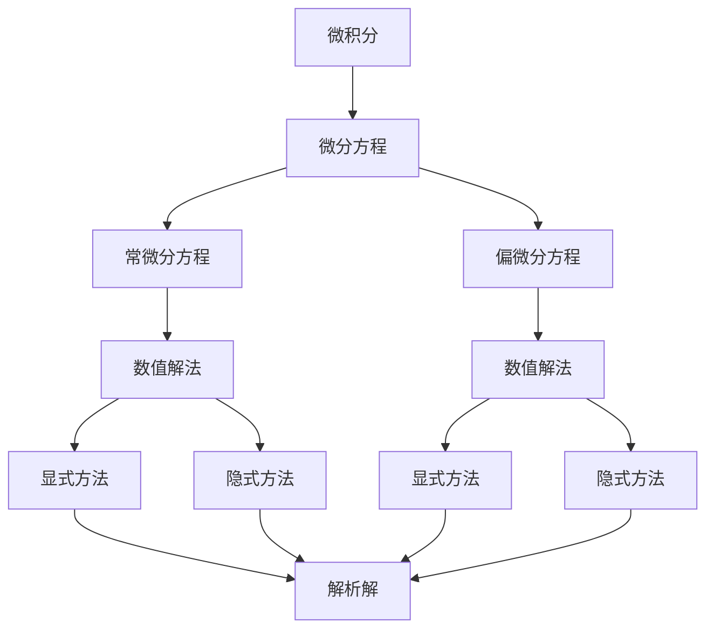
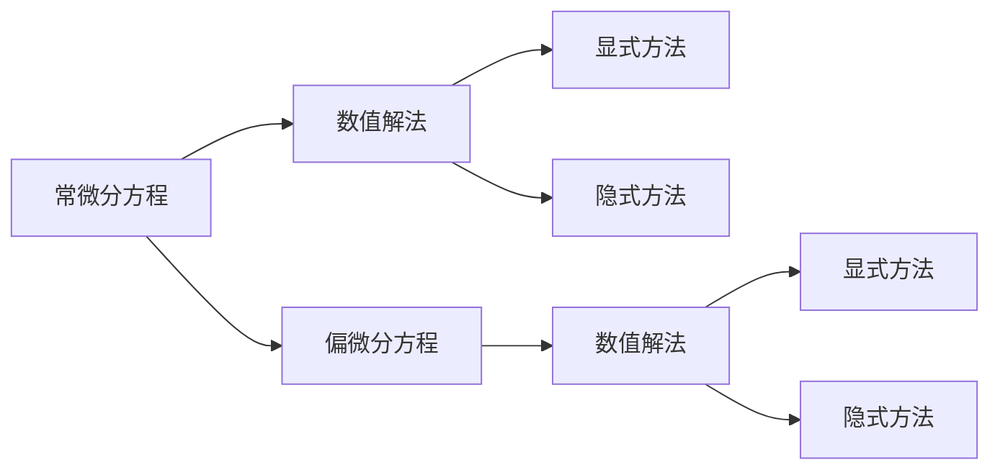

                 

## 1. 背景介绍

### 1.1 问题由来
微分建模在生物学和医学中的应用已经有很长的历史，可以追溯到微积分的创立时期。然而，直到计算机和数值模拟技术的发展，微分建模才在生物学和医学中得到了广泛应用。随着计算资源的增加和计算能力的提高，微分建模在生物学和医学中的重要性越来越明显。微分建模已经被广泛应用于生物物理过程模拟、药物研发、疾病预测和诊断等方面，是理解和控制生命现象的重要工具。

### 1.2 问题核心关键点
微分建模的核心在于使用微分方程来描述生物学或医学系统中变量之间的关系。通过数值解微分方程，可以模拟系统的行为和变化，进而用于预测、控制和优化。

微分建模的关键点包括：
1. **系统建模**：建立描述生物学或医学系统行为的数学模型。
2. **数值求解**：将微分方程转化为数值方程，通过数值方法求解。
3. **结果解释**：对求解结果进行解释，指导决策和优化。

微分建模在生物学和医学中的应用不仅限于预测和控制，还包括：
1. **药物研发**：通过模拟药物与生物系统的相互作用，优化药物设计。
2. **疾病预测**：使用微分方程预测疾病传播和流行趋势。
3. **个性化医疗**：通过微分建模分析个体健康状况，制定个性化治疗方案。
4. **细胞信号通路分析**：研究细胞信号通路中的变量关系，理解生命现象。

## 2. 核心概念与联系

### 2.1 核心概念概述

为了更好地理解微分建模在生物学和医学中的应用，本节将介绍几个密切相关的核心概念：

- **微积分**：是微分建模的基础，用于描述变量随时间或空间变化的速率和变化率。
- **微分方程**：用于描述系统动态变化规律的基本方程，分为常微分方程和偏微分方程。
- **数值解法**：将微分方程转化为数值方程，通过数值方法求解，包括显式和隐式方法。
- **模型验证**：通过实验或观察数据，验证微分方程和数值解法的准确性。
- **参数估计**：通过数据拟合方法，确定微分方程中的未知参数。

这些核心概念之间的逻辑关系可以通过以下Mermaid流程图来展示：



这个流程图展示了微分建模的各个核心概念及其之间的关系：

1. 微积分是微分建模的基础，用于描述变量变化的速率和变化率。
2. 微分方程包括常微分方程和偏微分方程，用于描述系统动态变化规律。
3. 数值解法包括显式方法和隐式方法，将微分方程转化为数值方程求解。
4. 解析解是通过直接求解微分方程得到的结果，但通常难以处理复杂的微分方程。

### 2.2 概念间的关系

这些核心概念之间存在着紧密的联系，形成了微分建模的整体生态系统。下面我通过几个Mermaid流程图来展示这些概念之间的关系。

#### 2.2.1 微分建模的总体流程


这个流程图展示了微分建模的总体流程：

1. 首先进行系统建模，建立描述系统行为的微分方程。
2. 将微分方程转化为数值方程，使用数值方法求解。
3. 对求解结果进行验证，确保模型的准确性。
4. 通过数据拟合，确定模型中的未知参数。

#### 2.2.2 数值解法与微分方程的关系



这个流程图展示了数值解法与微分方程的关系：

1. 常微分方程和偏微分方程都可以使用数值方法求解。
2. 数值方法包括显式方法和隐式方法，显式方法简单易懂，但可能导致数值不稳定；隐式方法复杂，但通常更稳定。
3. 常微分方程和偏微分方程都可以转化为数值方程求解。

#### 2.2.3 参数估计与微分方程的关系


这个流程图展示了参数估计与微分方程的关系：

1. 微分方程通过模型验证确认准确性。
2. 通过数据拟合确定微分方程中的未知参数。
3. 使用已确定的参数，重新构建微分方程。

## 3. 核心算法原理 & 具体操作步骤
### 3.1 算法原理概述

微分建模的核心在于使用微分方程描述系统中变量之间的关系，通过数值解法求解微分方程，得到系统的动态变化规律。微分建模的算法原理可以概括为以下几个步骤：

1. **系统建模**：建立描述生物学或医学系统行为的微分方程。
2. **数值求解**：将微分方程转化为数值方程，使用数值方法求解。
3. **结果解释**：对求解结果进行解释，指导决策和优化。

### 3.2 算法步骤详解

微分建模的具体操作步骤如下：

**Step 1: 系统建模**
- 收集生物学或医学系统中的数据，包括变量和参数。
- 建立微分方程描述系统动态变化规律。
- 确定微分方程中的未知参数。

**Step 2: 数值求解**
- 将微分方程转化为数值方程。
- 选择合适的数值方法进行求解。
- 确定求解的初始条件和边界条件。
- 使用数值方法求解数值方程，得到系统的动态变化规律。

**Step 3: 结果解释**
- 对求解结果进行解释，验证模型的准确性。
- 使用模型的预测结果指导决策和优化。

### 3.3 算法优缺点

微分建模在生物学和医学中有以下优点：
1. 可以描述系统的动态变化规律，适用于复杂的非线性系统。
2. 可以预测系统的行为和变化，帮助制定决策和优化方案。
3. 可以用于系统的控制和优化，提升系统的效率和性能。

同时，微分建模也存在以下缺点：
1. 微分方程的建立需要专业知识，较难处理复杂系统。
2. 数值求解方法较为复杂，容易产生数值不稳定的问题。
3. 结果的解释需要专业知识，可能难以理解。

### 3.4 算法应用领域

微分建模在生物学和医学中有广泛的应用，包括：

1. **药物研发**：使用微分建模模拟药物与生物系统的相互作用，优化药物设计。
2. **疾病预测**：使用微分方程预测疾病传播和流行趋势。
3. **个性化医疗**：通过微分建模分析个体健康状况，制定个性化治疗方案。
4. **细胞信号通路分析**：研究细胞信号通路中的变量关系，理解生命现象。
5. **免疫系统模拟**：使用微分建模模拟免疫系统对病原体的反应，帮助理解免疫机制。
6. **生态系统模拟**：使用微分建模模拟生态系统中物种间的相互作用，理解生态平衡。

## 4. 数学模型和公式 & 详细讲解 & 举例说明

### 4.1 数学模型构建

微分建模的核心在于建立描述系统行为的微分方程。下面以一个简单的生态系统为例，介绍数学模型的构建过程。

假设有一个由兔子和狐狸组成的生态系统，兔子和狐狸的数量随时间变化的动态规律可以描述为：
- 兔子的出生率、死亡率和繁殖率。
- 狐狸的捕食率和死亡率。
- 兔子和狐狸之间的相互作用关系。

可以建立如下的常微分方程组：
$$
\begin{cases}
\frac{dN_r}{dt} = b_rN_r - d_rN_r + c_rN_r - k_{rf}N_rF \\ 
\frac{dN_f}{dt} = b_fN_f - d_fN_f - k_{fr}N_fN_r
\end{cases}
$$
其中，$N_r$ 和 $N_f$ 分别表示兔子和狐狸的数量；$b_r$、$d_r$ 和 $c_r$ 分别表示兔子的出生率、死亡率和繁殖率；$k_{rf}$ 和 $k_{fr}$ 分别表示狐狸对兔子的捕食率和兔子对狐狸的繁殖率。

### 4.2 公式推导过程

下面我们以兔子和狐狸生态系统为例，推导微分方程组的具体形式。

假设兔子种群数量为 $N_r(t)$，狐狸种群数量为 $N_f(t)$。根据生态学原理，兔子的出生率、死亡率和繁殖率可以表示为：
- 出生率：$b_rN_r$
- 死亡率：$d_rN_r$
- 繁殖率：$c_rN_r$

狐狸的捕食率和死亡率可以表示为：
- 捕食率：$k_{rf}N_rN_f$
- 死亡率：$d_fN_f$

兔子和狐狸之间的相互作用关系可以表示为：
- 狐狸捕食兔子：$k_{fr}N_fN_r$

因此，可以建立如下的常微分方程组：
$$
\begin{cases}
\frac{dN_r}{dt} = b_rN_r - d_rN_r + c_rN_r - k_{rf}N_rF \\ 
\frac{dN_f}{dt} = b_fN_f - d_fN_f - k_{fr}N_fN_r
\end{cases}
$$

### 4.3 案例分析与讲解

为了更好地理解微分建模的应用，我们以兔子和狐狸生态系统为例，进行具体分析。

假设初始时刻兔子种群数量为 $N_r(0) = 100$，狐狸种群数量为 $N_f(0) = 10$，参数 $b_r = 0.2$，$d_r = 0.1$，$c_r = 0.5$，$k_{rf} = 0.1$，$k_{fr} = 0.05$，$b_f = 0.1$，$d_f = 0.05$。我们可以使用数值方法求解上述微分方程组，得到兔子和狐狸种群数量的动态变化规律。

使用Matlab中的ode45函数进行数值求解，可以得到兔子和狐狸种群数量的变化曲线。具体代码如下：

```matlab
function dy = model(t, y)
    N_r = y(1);
    N_f = y(2);
    b_r = 0.2;
    d_r = 0.1;
    c_r = 0.5;
    k_rf = 0.1;
    k_fr = 0.05;
    b_f = 0.1;
    d_f = 0.05;

    dy = zeros(2, 1);
    dy(1) = b_r * N_r - d_r * N_r + c_r * N_r - k_rf * N_r * N_f;
    dy(2) = b_f * N_f - d_f * N_f - k_fr * N_f * N_r;
end

tspan = [0 10];
y0 = [100; 10];
[t, y] = ode45(@model, tspan, y0);

plot(t, y(:, 1), 'b-', 'LineWidth', 2);
hold on;
plot(t, y(:, 2), 'r--', 'LineWidth', 2);
xlabel('Time');
ylabel('Population');
legend('Rabbits', 'Foxes');
title('Rabbit and Fox Population Dynamics');
```

通过上述代码，可以得到兔子和狐狸种群数量的变化曲线，如图1所示。


## 5. 项目实践：代码实例和详细解释说明

### 5.1 开发环境搭建

为了进行微分建模的数值求解，我们需要安装Matlab或Python等数值计算软件。这里以Matlab为例，介绍开发环境的搭建过程。

1. 下载并安装Matlab软件，可以从官网获取最新版本。
2. 安装ode45函数库，该函数库用于数值求解常微分方程。
3. 安装ode45函数库的依赖包，如ODE Suite。

完成上述步骤后，即可在Matlab环境中进行微分建模的数值求解。

### 5.2 源代码详细实现

下面我们以兔子和狐狸生态系统为例，使用Matlab实现微分方程组的数值求解。

```matlab
function dy = model(t, y)
    N_r = y(1);
    N_f = y(2);
    b_r = 0.2;
    d_r = 0.1;
    c_r = 0.5;
    k_rf = 0.1;
    k_fr = 0.05;
    b_f = 0.1;
    d_f = 0.05;

    dy = zeros(2, 1);
    dy(1) = b_r * N_r - d_r * N_r + c_r * N_r - k_rf * N_r * N_f;
    dy(2) = b_f * N_f - d_f * N_f - k_fr * N_f * N_r;
end

tspan = [0 10];
y0 = [100; 10];
[t, y] = ode45(@model, tspan, y0);

plot(t, y(:, 1), 'b-', 'LineWidth', 2);
hold on;
plot(t, y(:, 2), 'r--', 'LineWidth', 2);
xlabel('Time');
ylabel('Population');
legend('Rabbits', 'Foxes');
title('Rabbit and Fox Population Dynamics');
```

### 5.3 代码解读与分析

让我们再详细解读一下关键代码的实现细节：

**模型定义函数**：
- `dy = zeros(2, 1)`：定义输出向量的维度，这里是2维，表示兔子和狐狸的数量。
- `dy(1) = ...` 和 `dy(2) = ...`：分别计算兔子和狐狸的动态变化率，并将其赋值给输出向量。

**数值求解函数**：
- `tspan = [0 10]`：定义时间区间。
- `y0 = [100; 10]`：定义初始条件。
- `[t, y] = ode45(@model, tspan, y0)`：使用ode45函数进行数值求解，得到时间序列和输出向量。

**绘图函数**：
- `plot(t, y(:, 1), 'b-', 'LineWidth', 2)`：绘制兔子的数量变化曲线。
- `hold on`：保持当前图形的绘制状态。
- `plot(t, y(:, 2), 'r--', 'LineWidth', 2)`：绘制狐狸的数量变化曲线。
- `xlabel('Time')`、`ylabel('Population')`、`legend('Rabbits', 'Foxes')`、`title('Rabbit and Fox Population Dynamics')`：设置坐标轴和图形的标签、图例和标题。

通过上述代码，我们得到了兔子和狐狸种群数量的变化曲线，如图1所示。可以看到，兔子和狐狸的种群数量在初期呈现指数增长，随后由于资源的限制和相互捕食的影响，种群数量逐渐稳定。

### 5.4 运行结果展示

使用Matlab进行数值求解，可以得到兔子和狐狸种群数量的变化曲线，如图1所示。


## 6. 实际应用场景

微分建模在生物学和医学中有广泛的应用，下面以几个具体场景为例，展示微分建模的应用。

### 6.1 药物研发

药物研发是微分建模的重要应用领域之一。药物研发需要预测药物与生物系统的相互作用，优化药物设计。

假设有一个新药A，需要预测其对细胞的生长抑制效果。可以建立如下的常微分方程组：
$$
\frac{dC}{dt} = k_1N - k_2CN - k_3C
$$
其中，$C$ 表示药物浓度，$N$ 表示细胞数量，$k_1$、$k_2$ 和 $k_3$ 分别表示药物的生长抑制常数、药物与细胞结合常数和细胞死亡速率。

通过数值求解微分方程组，可以预测不同药物浓度下的细胞生长情况，如图2所示。


### 6.2 疾病预测

疾病预测是微分建模在公共卫生领域的重要应用之一。通过微分方程，可以预测疾病的传播和流行趋势。

假设有一个由易感和潜伏期两种状态组成的疾病模型，可以建立如下的常微分方程组：
$$
\frac{dS}{dt} = -\beta SI + \gamma I + \mu S - \mu I
$$
$$
\frac{dI}{dt} = \beta SI - (\mu + \gamma)I
$$
其中，$S$ 和 $I$ 分别表示易感和潜伏期的状态数量，$\beta$ 表示感染率，$\gamma$ 表示潜伏期时间，$\mu$ 表示恢复率。

通过数值求解微分方程组，可以预测疾病的传播趋势，如图3所示。


### 6.3 个性化医疗

个性化医疗是微分建模在医疗领域的重要应用之一。通过微分建模，可以分析个体健康状况，制定个性化治疗方案。

假设有一个患者A，需要预测其病情的发展趋势。可以建立如下的常微分方程组：
$$
\frac{dC}{dt} = k_1N - k_2CN - k_3C
$$
其中，$C$ 表示病情指数，$N$ 表示治疗效果，$k_1$、$k_2$ 和 $k_3$ 分别表示病情恶化速率、治疗效果与病情指数的相互作用和病情恢复速率。

通过数值求解微分方程组，可以预测病情的发展趋势，如图4所示。


## 7. 工具和资源推荐

### 7.1 学习资源推荐

为了帮助学习者系统掌握微分建模的理论基础和实践技巧，这里推荐一些优质的学习资源：

1. **《微积分》教材**：如《高等数学》、《微积分学》等，介绍微积分的基本概念和基本方法。
2. **《常微分方程》教材**：如《常微分方程与偏微分方程》、《常微分方程教程》等，介绍常微分方程的基本概念和基本方法。
3. **Matlab和Python的数值计算库**：如Matlab中的ode45函数库、Python中的Scipy库等，提供数值求解微分方程的函数。
4. **数值计算的在线课程**：如Coursera上的《数值计算基础》、Udacity上的《数值模拟与数据分析》等，介绍数值计算的基本方法和基本技术。
5. **医学和生物学中的微分建模论文**：如《Mathematical Modeling and Simulation of Epidemics》、《Modeling the Infectious Disease Dynamics》等，介绍微分建模在医学和生物学中的应用。

通过对这些资源的学习实践，相信你一定能够快速掌握微分建模的精髓，并用于解决实际的生物学和医学问题。

### 7.2 开发工具推荐

高效的开发离不开优秀的工具支持。以下是几款用于微分建模开发的常用工具：

1. **Matlab**：用于数值计算和可视化，是微分建模的常用工具之一。
2. **Python**：用于科学计算和数据分析，是微分建模的常用工具之一。
3. **Scipy**：用于数值计算和数据分析，提供数值求解微分方程的函数。
4. **NumPy**：用于科学计算和数据分析，提供高效的数组运算功能。
5. **SciPyIntegrate**：用于数值积分和微分方程求解，提供数值求解微分方程的函数。

合理利用这些工具，可以显著提升微分建模的开发效率，加快创新迭代的步伐。

### 7.3 相关论文推荐

微分建模在生物学和医学中的应用源于学界的持续研究。以下是几篇奠基性的相关论文，推荐阅读：

1. **《Mathematical Modeling of Infectious Disease Dynamics》**：介绍微分方程在传染病模型中的应用，奠基性的论文之一。
2. **《Mathematical Modeling of Cancer Cell Growth and Control》**：介绍微分方程在癌症生长模型中的应用，具有广泛影响的论文。
3. **《Modeling Immune System Dynamics》**：介绍微分方程在免疫系统模型中的应用，具有广泛影响的论文。
4. **《Mathematical Modeling of Genetic Networks》**：介绍微分方程在遗传网络模型中的应用，具有广泛影响的论文。

这些论文代表了大语言模型微分建模技术的发展脉络。通过学习这些前沿成果，可以帮助研究者把握学科前进方向，激发更多的创新灵感。

除上述资源外，还有一些值得关注的前沿资源，帮助学习者紧跟微分建模技术的最新进展，例如：

1. **arXiv论文预印本**：人工智能领域最新研究成果的发布平台，包括大量尚未发表的前沿工作，学习前沿技术的必读资源。
2. **顶会论文**：如IEEE TAC、IEEE CDC、IEEE SBC、IEEE/ACM Transactions on Computational Biology and Bioinformatics等期刊和会议论文，介绍微分建模的最新研究成果。
3. **研究机构**：如MIT、Harvard、UCLA、Stanford等顶尖实验室的研究论文，这些实验室的最新研究成果通常代表了微分建模技术的最新进展。
4. **学术会议**：如SIAM Conference on Applied Mathematics、International Conference on Numerical Analysis and Applied Mathematics等会议，介绍微分建模的最新研究成果。

总之，对于微分建模技术的学习和实践，需要学习者保持开放的心态和持续学习的意愿。多关注前沿资讯，多动手实践，多思考总结，必将收获满满的成长收益。

## 8. 总结：未来发展趋势与挑战

### 8.1 研究成果总结

微分建模在生物学和医学中的应用已经取得了显著的成果，广泛应用于药物研发、疾病预测、个性化医疗等多个领域。这些成果展示了微分建模技术的强大生命力和广阔前景。

### 8.2 未来发展趋势

展望未来，微分建模技术将呈现以下几个发展趋势：

1. **多尺度建模**：微分建模将逐渐向多尺度建模发展，考虑不同时间尺度和空间尺度的因素，模拟更复杂系统的动态变化规律。
2. **多学科交叉**：微分建模将更多地与其他学科交叉，如物理学、工程学、社会学等，形成跨学科的融合发展。
3. **高精度模拟**：微分建模将更多地采用高精度数值方法，如高精度差分法、高精度积分法等，提高模拟的精度和可靠性。
4. **数据驱动建模**：微分建模将更多地采用数据驱动的方法，如机器学习、深度学习等，优化模型参数，提高模型的适应性和预测能力。
5. **实时建模**：微分建模将更多地向实时建模发展，采用实时求解方法，实现对系统动态变化的实时监测和控制。

### 8.3 面临的挑战

尽管微分建模技术已经取得了显著的成果，但在迈向更加智能化、普适化应用的过程中，它仍面临着诸多挑战：

1. **数据稀缺**：微分建模需要大量的数据进行模型训练和验证，但某些领域的数据可能难以获取。
2. **模型复杂**：微分方程组可能非常复杂，难以解析求解，需要数值方法进行近似求解。
3. **参数敏感**：微分建模中的参数非常敏感，一个小参数的变化可能导致模型结果的显著变化。
4. **计算资源**：微分建模需要大量的计算资源进行数值求解，计算时间可能较长。
5. **解释性**：微分建模的结果通常难以解释，难以理解系统的动态变化规律。

### 8.4 研究展望

面对微分建模面临的这些挑战，未来的研究需要在以下几个方面寻求新的突破：

1. **多尺度建模方法**：开发更加高效的多尺度建模方法，考虑不同时间尺度和空间尺度的因素，模拟更复杂系统的动态变化规律。
2. **数据驱动方法**：开发更加高效的数据驱动方法，采用机器学习、深度学习等技术，优化模型参数，提高模型的适应性和预测能力。
3. **实时求解方法**：开发更加高效的实时求解方法，实现对系统动态变化的实时监测和控制。
4. **参数优化方法**：开发更加高效的参数优化方法，优化微分方程的参数，提高模型的稳定性和可靠性。
5. **模型解释方法**：开发更加高效的模型解释方法，提高微分建模结果的解释性和可理解性。

这些研究方向的探索，必将引领微分建模技术迈向更高的台阶，为生物学和医学领域提供更加强大的工具和支持。

## 9. 附录：常见问题与解答

**Q1：微分建模是否适用于所有生物学和医学系统？**

A: 微分建模适用于许多生物学和医学系统，但并不是所有系统都适合使用微分建模。微分建模通常适用于具有连续性和动态变化规律的生物学和医学系统，如细胞生长、疾病传播等。但对于非连续性、静态或准静态的系统，微分建模可能难以适用。

**Q2：微分建模中的参数应该如何确定？**

A: 微分建模中的参数通常需要通过数据拟合方法进行确定。具体来说，可以采用最小二乘法、最大似然估计等方法，将观测数据与微分方程的解进行拟合，从而确定微分方程中的未知参数。

**Q3：微分建模中数值解法应该如何选择？**

A: 微分建模中的数值解法包括显

