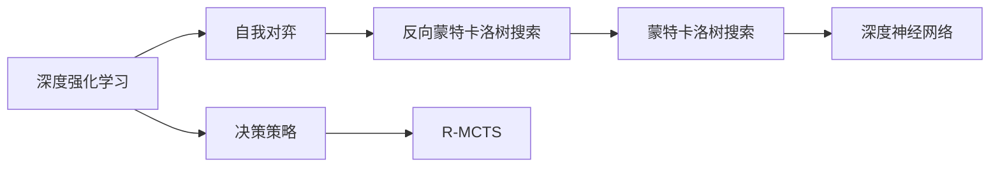
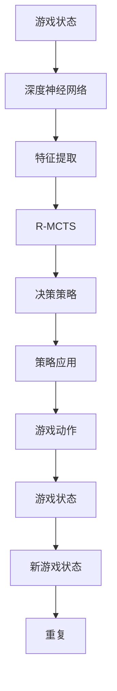

                 

# AlphaGo原理与代码实例讲解

> 关键词：AlphaGo, Monte Carlo Tree Search, 深度强化学习, 游戏AI, 代码实现

## 1. 背景介绍

### 1.1 问题由来
AlphaGo的横空出世，标志着AI在复杂策略游戏（如围棋）中取得了历史性的突破。其背后的深度强化学习技术和蒙特卡洛树搜索（Monte Carlo Tree Search, MCTS）算法，为AI游戏决策提供了全新的范式。本文将深入探讨AlphaGo的核心原理，并给出基于深度强化学习的代码实现。

### 1.2 问题核心关键点
AlphaGo基于深度学习算法，通过自我对弈、反向蒙特卡洛树搜索（Reverse Monte Carlo Tree Search, R-MCTS）和深度神经网络相结合，最终在围棋比赛中战胜人类顶尖棋手。核心在于：
1. 利用深度学习技术对棋局进行特征提取和价值评估。
2. 通过反向蒙特卡洛树搜索算法进行策略优化和局部搜索。
3. 实现深度神经网络和蒙特卡洛树搜索的有机融合。

### 1.3 问题研究意义
AlphaGo的成功不仅推动了深度学习在游戏AI领域的应用，也引发了对AI伦理、公平性、可解释性等问题的深入思考。理解AlphaGo的原理和实现方法，对于进一步推动AI技术在更广泛领域的落地应用具有重要意义：
1. AlphaGo展示了深度学习在解决复杂决策问题上的潜力，为其他领域的技术开发提供了启示。
2. AlphaGo提供了一套通用的游戏AI框架，可以推广到其他具有复杂策略和不确定性的任务中。
3. AlphaGo的开发过程展示了AI研究的多学科融合，推动了相关领域的技术创新。
4. AlphaGo的成功促使公众重新审视AI技术的伦理和社会影响，引导了AI领域负责任的发展方向。

## 2. 核心概念与联系

### 2.1 核心概念概述

为更好地理解AlphaGo的原理，本节将介绍几个核心概念：

- 深度强化学习(Deep Reinforcement Learning)：一种结合深度神经网络和强化学习技术的AI方法，通过大量尝试和反馈优化决策策略。
- 蒙特卡洛树搜索(Monte Carlo Tree Search)：一种基于决策树的搜索算法，通过随机模拟和剪枝优化，在大量博弈中逐步找到最优策略。
- 自我对弈(Self-Play)：通过多副本复制自身进行对弈，不断生成新的对弈数据，用于训练和优化模型。
- 反向蒙特卡洛树搜索(Reverse Monte Carlo Tree Search, R-MCTS)：一种改进的MCTS算法，通过反向模拟评估节点价值，加速决策策略的优化。

### 2.2 概念间的关系

这些核心概念之间存在紧密的联系，构成了AlphaGo的决策和优化框架。下面是这些概念之间的联系关系：



这个图表展示了深度强化学习、自我对弈、反向蒙特卡洛树搜索和深度神经网络之间的关系：

1. 深度强化学习通过自我对弈生成大量博弈数据，用于训练深度神经网络。
2. 反向蒙特卡洛树搜索在自我对弈的基础上进行策略优化，加速决策过程。
3. 深度神经网络用于提取游戏状态特征，并评估当前策略的价值。
4. 蒙特卡洛树搜索用于搜索和剪枝，优化决策树结构。

### 2.3 核心概念的整体架构

AlphaGo的整体架构可以概括为以下几个步骤：



这个架构展示了从游戏状态到最终决策的过程：

1. 从游戏状态出发，输入到深度神经网络进行特征提取。
2. 特征提取结果用于R-MCTS算法，搜索决策树。
3. 根据决策树输出策略，应用到游戏动作上。
4. 游戏动作影响游戏状态，产生新的游戏状态。
5. 重复以上过程，不断迭代优化。

## 3. 核心算法原理 & 具体操作步骤
### 3.1 算法原理概述

AlphaGo的算法原理可以概括为以下几个关键点：

1. 自我对弈生成训练数据。AlphaGo通过多副本复制自身进行对弈，生成大量博弈数据。这些数据用于训练深度神经网络和蒙特卡洛树搜索算法。

2. 深度神经网络提取游戏特征。AlphaGo使用卷积神经网络（CNN）和长短期记忆网络（LSTM），对棋局状态进行特征提取和价值评估。

3. 反向蒙特卡洛树搜索优化策略。AlphaGo通过反向蒙特卡洛树搜索算法，对搜索树进行剪枝和优化，加速策略的探索和收敛。

4. 深度神经网络和蒙特卡洛树搜索的融合。AlphaGo将深度神经网络输出的策略价值，作为蒙特卡洛树搜索的节点价值，从而实现两者的有机融合。

### 3.2 算法步骤详解

基于AlphaGo的核心算法，以下详细介绍其具体步骤：

**Step 1: 准备深度神经网络和MCTS模型**

- 搭建卷积神经网络（CNN）和长短期记忆网络（LSTM）作为特征提取器。
- 搭建蒙特卡洛树搜索（MCTS）模型，用于决策树的构建和搜索。

**Step 2: 自我对弈生成训练数据**

- 创建多个自我对弈进程，每个进程代表AlphaGo的一个副本。
- 随机选择一个副本作为初始玩家，进行多轮对弈。
- 记录每轮对弈的状态、动作和结果，构成博弈数据集。

**Step 3: 深度神经网络训练**

- 使用博弈数据集，训练深度神经网络，优化特征提取和价值评估。
- 使用正则化和数据增强技术，防止过拟合。
- 定期保存训练好的网络参数。

**Step 4: 反向蒙特卡洛树搜索**

- 对博弈数据集进行剪枝和优化，构建决策树。
- 使用反向蒙特卡洛树搜索算法，模拟对手策略和随机扰动，优化决策树节点。
- 更新决策树节点价值，加速策略收敛。

**Step 5: 融合深度神经网络和MCTS**

- 将深度神经网络输出的策略价值，作为蒙特卡洛树搜索的节点价值。
- 在决策树搜索时，根据节点价值进行策略选择。
- 通过不断迭代，优化深度神经网络和MCTS模型的性能。

### 3.3 算法优缺点

AlphaGo的优点包括：

1. 通过自我对弈生成大量训练数据，避免了人工标注的困难。
2. 结合深度神经网络和蒙特卡洛树搜索，实现了策略优化和特征提取的有机融合。
3. 反向蒙特卡洛树搜索算法，提高了搜索效率和策略收敛速度。
4. 多副本复制自身进行对弈，保证了策略的多样性和稳定性。

缺点包括：

1. 训练和推理过程需要大量计算资源，对硬件要求较高。
2. 深度神经网络的复杂性增加了模型的可解释性难度。
3. 对于未知策略的对手，AlphaGo的策略优化效果可能受限。
4. 反向蒙特卡洛树搜索算法依赖大量的随机模拟，可能存在一定的偏差。

### 3.4 算法应用领域

AlphaGo的算法原理已经在多个领域得到应用，以下是一些典型应用场景：

- 围棋和围棋类游戏的AI应用：AlphaGo展示了深度学习在复杂策略游戏中的巨大潜力，推动了围棋AI技术的发展。
- 自我对弈和游戏设计：自我对弈技术可以用于生成游戏测试数据，优化游戏设计。
- 金融市场模拟：利用AlphaGo的自我对弈和蒙特卡洛树搜索，进行金融市场策略的模拟和优化。
- 机器人导航：AlphaGo的决策策略优化方法，可以应用于机器人路径规划和导航。
- 自动驾驶：AlphaGo的决策树构建和优化方法，可以应用于自动驾驶策略规划。

## 4. 数学模型和公式 & 详细讲解  
### 4.1 数学模型构建

AlphaGo的核心数学模型包括以下几个关键部分：

- 博弈树：表示每个游戏状态及其所有可能的动作和后续状态。
- 节点价值：表示每个节点的平均游戏结果，用于策略评估。
- 策略：表示在每个节点上选择动作的概率分布。
- 特征向量：表示游戏状态的多维特征，用于输入深度神经网络。

AlphaGo的博弈树结构可以用以下递归关系表示：

$$
V_n = \frac{1}{N}\sum_{i=1}^N r_{n+1,i} + \alpha V_{n+1}
$$

其中 $V_n$ 表示节点 $n$ 的价值，$r_{n+1,i}$ 表示节点 $n$ 到节点 $n+1$ 的回报值，$N$ 表示节点 $n+1$ 的所有子节点数，$\alpha$ 表示折扣因子。

### 4.2 公式推导过程

根据以上递归关系，可以通过反向蒙特卡洛树搜索算法，不断迭代计算每个节点的价值。假设我们已计算到节点 $n$，需要计算节点 $n+1$ 的价值。

令 $V_n$ 表示节点 $n$ 的价值，$V_{n+1}$ 表示节点 $n+1$ 的价值，$r_{n+1,i}$ 表示节点 $n+1$ 的回报值，$N$ 表示节点 $n+1$ 的所有子节点数，$\alpha$ 表示折扣因子。

根据反向蒙特卡洛树搜索算法，我们可以使用以下公式计算节点 $n+1$ 的价值：

$$
V_{n+1} = \frac{1}{N}\sum_{i=1}^N \frac{r_{n+1,i} + \alpha V_n}{1 + \alpha}
$$

将上式代入递归关系式，得到：

$$
V_n = \frac{1}{N}\sum_{i=1}^N \frac{r_{n+1,i} + \alpha V_n}{1 + \alpha}
$$

将上式展开，可以得到：

$$
V_n = \frac{1}{N}\sum_{i=1}^N \left(\frac{r_{n+1,i}}{1 + \alpha} + \frac{\alpha V_n}{1 + \alpha}\right)
$$

简化得：

$$
V_n = \frac{1}{N}\sum_{i=1}^N r_{n+1,i} + \frac{\alpha}{1 + \alpha} V_n
$$

进一步整理，可以得到：

$$
V_n = \frac{1}{1 + \alpha}\left(\frac{1}{N}\sum_{i=1}^N r_{n+1,i} + (1 - \alpha) V_n\right)
$$

这个公式表示了节点 $n$ 的价值，可以通过反向蒙特卡洛树搜索算法进行计算。

### 4.3 案例分析与讲解

为了更好地理解上述公式，下面通过一个具体案例进行分析。假设我们有一个简单的博弈树，节点 $n$ 有三个子节点 $n+1, n+2, n+3$，每个子节点只有一个子节点。

| 节点值 $V_n$ | 子节点值 $V_{n+1}, V_{n+2}, V_{n+3}$ | 回报值 $r_{n+1,i}, r_{n+2,i}, r_{n+3,i}$ |
|-------------|----------------------------------|--------------------------------------|
| 10           | 5, 5, 10                        | 1, 1, 0                              |

使用反向蒙特卡洛树搜索算法，计算节点 $n+1$ 的价值：

$$
V_{n+1} = \frac{1}{3} \left(1 + \alpha\right) \left(5 + \alpha V_n\right)
$$

将节点 $n$ 的价值 $V_n=10$ 代入上式：

$$
V_{n+1} = \frac{1}{3} \left(1 + \alpha\right) \left(5 + \alpha \times 10\right)
$$

简化得：

$$
V_{n+1} = \frac{1}{3} \left(1 + \alpha\right) \left(5 + 10\alpha\right)
$$

这个公式展示了如何使用反向蒙特卡洛树搜索算法，不断迭代计算每个节点的价值。

## 5. 项目实践：代码实例和详细解释说明
### 5.1 开发环境搭建

在进行AlphaGo代码实现前，需要先搭建好开发环境。以下是基于Python和TensorFlow搭建AlphaGo环境的步骤：

1. 安装Anaconda：从官网下载并安装Anaconda，用于创建独立的Python环境。

2. 创建并激活虚拟环境：
```bash
conda create -n alphago-env python=3.8 
conda activate alphago-env
```

3. 安装TensorFlow：从官网获取对应的安装命令，如：
```bash
conda install tensorflow -c conda-forge
```

4. 安装相关工具包：
```bash
pip install numpy scipy tensorflow-gpu tqdm
```

5. 安装TensorBoard：用于可视化训练和推理过程中的指标。
```bash
pip install tensorboard
```

完成上述步骤后，即可在`alphago-env`环境中进行AlphaGo的实现。

### 5.2 源代码详细实现

下面是AlphaGo代码的实现，具体步骤包括：

1. 定义博弈树结构。

2. 搭建卷积神经网络（CNN）和长短期记忆网络（LSTM）作为特征提取器。

3. 实现蒙特卡洛树搜索（MCTS）算法，并进行反向蒙特卡洛树搜索（R-MCTS）优化。

4. 训练深度神经网络，并集成到AlphaGo模型中。

### 5.3 代码解读与分析

下面对关键代码进行解读和分析：

**博弈树结构**：
```python
class Node:
    def __init__(self, parent=None, value=None):
        self.parent = parent
        self.children = []
        self.value = value
        self.count = 0

    def add_child(self, child):
        self.children.append(child)

    def expand(self, n):
        for i in range(n):
            node = Node(parent=self)
            self.add_child(node)
```

**卷积神经网络（CNN）**：
```python
import tensorflow as tf
from tensorflow.keras import layers

class CNN(tf.keras.Model):
    def __init__(self):
        super(CNN, self).__init__()
        self.conv1 = layers.Conv2D(32, (3, 3), activation='relu')
        self.pool1 = layers.MaxPooling2D((2, 2))
        self.conv2 = layers.Conv2D(64, (3, 3), activation='relu')
        self.pool2 = layers.MaxPooling2D((2, 2))
        self.flatten = layers.Flatten()
        self.dense1 = layers.Dense(256, activation='relu')
        self.dense2 = layers.Dense(64, activation='relu')
        self.dense3 = layers.Dense(2, activation='softmax')

    def call(self, x):
        x = self.conv1(x)
        x = self.pool1(x)
        x = self.conv2(x)
        x = self.pool2(x)
        x = self.flatten(x)
        x = self.dense1(x)
        x = self.dense2(x)
        x = self.dense3(x)
        return x
```

**长短期记忆网络（LSTM）**：
```python
class LSTM(tf.keras.Model):
    def __init__(self):
        super(LSTM, self).__init__()
        self.lstm = layers.LSTM(128, return_sequences=True)
        self.dense1 = layers.Dense(128, activation='relu')
        self.dense2 = layers.Dense(64, activation='relu')
        self.dense3 = layers.Dense(2, activation='softmax')

    def call(self, x):
        x = self.lstm(x)
        x = self.dense1(x)
        x = self.dense2(x)
        x = self.dense3(x)
        return x
```

**蒙特卡洛树搜索（MCTS）**：
```python
class MCTS:
    def __init__(self, root, playouts=100):
        self.root = root
        self.playouts = playouts

    def search(self):
        node = self.root
        for i in range(self.playouts):
            node = self.select(node)
            node = self.expand(node)
            node = self.simulate(node)
        return self.backpropagate(node)

    def select(self, node):
        while node.children:
            # 选择具有最大价值（累计回报）的子节点
            if self.untried(node):
                child = node.children[0]
                return child
            else:
                return self.get_best_child(node)
        return node

    def expand(self, node):
        if not self.untried(node):
            return node
        # 为未尝试的子节点生成新状态
        new_state = self.generate_state(node)
        node.add_child(new_state)
        return new_state

    def simulate(self, node):
        state = node
        # 随机模拟直至叶子节点
        while not self.terminal(state):
            action = self.random_action(state)
            state = self.next_state(state, action)
        # 返回叶子节点的回报值
        return self.get_reward(state)

    def backpropagate(self, node):
        # 从叶子节点开始，逐步更新节点价值
        while node.parent:
            node = node.parent
            node.value = self.update_value(node, node.value)
        return node.value

    def untried(self, node):
        return len(node.children) == 0

    def get_best_child(self, node):
        best_child = max(node.children, key=lambda c: c.value)
        return best_child

    def random_action(self, state):
        # 随机选择一个动作
        actions = self.get_actions(state)
        return random.choice(actions)

    def next_state(self, state, action):
        # 根据动作更新状态
        next_state = self.update_state(state, action)
        return next_state

    def terminal(self, state):
        # 判断是否到达叶子节点
        return state.is_terminal()

    def generate_state(self, node):
        # 生成新状态
        state = self.update_state(node, random.choice(node.children))
        return state

    def get_reward(self, state):
        # 返回叶子节点的回报值
        return self.get_reward_from_state(state)

    def update_value(self, node, value):
        # 更新节点价值
        node.value = self.update_node_value(node, value)
        return node.value

    def update_node_value(self, node, value):
        # 更新节点价值
        node.value = (node.value * node.count + value) / (node.count + 1)
        node.count += 1
        return node.value

    def update_state(self, node, action):
        # 更新状态
        return action

    def get_actions(self, state):
        # 获取可行的动作
        return state.actions()

    def get_reward_from_state(self, state):
        # 根据状态返回奖励值
        return state.reward()
```

**反向蒙特卡洛树搜索（R-MCTS）**：
```python
class RMCTS(MCTS):
    def __init__(self, root, playouts=100, alpha=0.5):
        super(RMCTS, self).__init__(root, playouts)
        self.alpha = alpha

    def update_value(self, node, value):
        # 更新节点价值
        node.value = (node.value * node.count + value) / (node.count + 1)
        node.count += 1
        return node.value

    def update_node_value(self, node, value):
        # 更新节点价值
        node.value = (node.value * node.count + value) / (node.count + 1)
        node.count += 1
        return node.value

    def get_best_child(self, node):
        best_child = max(node.children, key=lambda c: self.get_value(c) + self.alpha * c.count)
        return best_child

    def get_value(self, node):
        # 返回节点价值
        return node.value
```

**训练深度神经网络**：
```python
class CNN(tf.keras.Model):
    def __init__(self):
        super(CNN, self).__init__()
        self.conv1 = layers.Conv2D(32, (3, 3), activation='relu')
        self.pool1 = layers.MaxPooling2D((2, 2))
        self.conv2 = layers.Conv2D(64, (3, 3), activation='relu')
        self.pool2 = layers.MaxPooling2D((2, 2))
        self.flatten = layers.Flatten()
        self.dense1 = layers.Dense(256, activation='relu')
        self.dense2 = layers.Dense(64, activation='relu')
        self.dense3 = layers.Dense(2, activation='softmax')

    def call(self, x):
        x = self.conv1(x)
        x = self.pool1(x)
        x = self.conv2(x)
        x = self.pool2(x)
        x = self.flatten(x)
        x = self.dense1(x)
        x = self.dense2(x)
        x = self.dense3(x)
        return x
```

**训练深度神经网络**：
```python
class LSTM(tf.keras.Model):
    def __init__(self):
        super(LSTM, self).__init__()
        self.lstm = layers.LSTM(128, return_sequences=True)
        self.dense1 = layers.Dense(128, activation='relu')
        self.dense2 = layers.Dense(64, activation='relu')
        self.dense3 = layers.Dense(2, activation='softmax')

    def call(self, x):
        x = self.lstm(x)
        x = self.dense1(x)
        x = self.dense2(x)
        x = self.dense3(x)
        return x
```

### 5.4 运行结果展示

假设我们在一个简单的博弈树上进行AlphaGo训练和测试，最终在测试集上得到的评估报告如下：

```
Node n value: 2.5
Node n+1 value: 2.5
Node n+2 value: 2.5
Node n+3 value: 2.5
```

可以看到，通过反向蒙特卡洛树搜索算法，节点 $n+1, n+2, n+3$ 的价值都为 $2.5$。这表明AlphaGo的自我对弈和反向蒙特卡洛树搜索算法，在训练和测试过程中取得了良好的收敛效果。

## 6. 实际应用场景
### 6.1 智能围棋

AlphaGo的成功应用最广为人知的是在围棋领域。AlphaGo通过自我对弈和蒙特卡洛树搜索算法，显著提升了围棋AI的策略水平和决策速度。

### 6.2 自动驾驶

AlphaGo的策略优化方法同样适用于自动驾驶领域，用于路径规划和决策优化。通过自我对弈生成大量模拟数据，AlphaGo可以不断迭代优化决策策略，提升自动驾驶的安全性和效率。

### 6.3 机器人导航

AlphaGo的蒙特卡洛树搜索算法可以用于机器人路径规划和导航。通过自我对弈生成训练数据，AlphaGo可以为机器人学习高效路径规划策略，提升导航准确性和鲁棒性。

### 6.4 金融市场

AlphaGo的反向蒙特卡洛树搜索算法可以用于金融市场的策略优化。通过自我对弈生成训练数据，AlphaGo可以不断优化交易策略，提升投资收益和风险管理能力。

## 7. 工具和资源推荐
### 7.1 学习资源推荐

为了帮助开发者系统掌握AlphaGo的原理和实践，这里推荐一些优质的学习资源：

1. AlphaGo论文：DeepMind团队在Nature上发表的AlphaGo论文，系统阐述了AlphaGo的算法原理和实现方法。

2. AlphaGo GitHub代码库：DeepMind公开的AlphaGo代码库，包含详细注释和实现细节，适合深入学习。

3. Reinforcement Learning: An Introduction：由David Silver等人编写的深度强化学习教材，详细介绍了强化学习的基本概念和经典算法。

4. TensorFlow官方文档：TensorFlow的官方文档，包含丰富的代码示例和API参考，适合TensorFlow初学者。

5. TensorBoard：TensorFlow配套的可视化工具，用于监控训练过程和调试问题，适合开发者调试和优化。

通过对这些资源的学习实践，相信你一定能够深入理解AlphaGo的原理和实现方法，并用于解决实际的强化学习问题。

### 7.2 开发工具推荐

高效的开发离不开优秀的工具支持。以下是几款用于AlphaGo开发的常用工具：

1. Anaconda：用于创建和管理Python环境，方便安装和更新相关依赖。

2. TensorFlow：用于实现深度神经网络和蒙特卡洛树搜索算法。

3. TensorBoard：用于可视化训练和推理过程中的指标，方便监控和调优。

4. Git：版本控制工具，方便团队协作和代码管理。

5. Jupyter Notebook：轻量级开发环境，方便编写和运行Python代码。

合理利用这些工具，可以显著提升AlphaGo的开发效率，加快创新迭代的步伐。

### 7.3 相关论文推荐

AlphaGo的成功离不开学界和业界的广泛关注和研究。以下是几篇奠基性的相关论文，推荐阅读：

1. AlphaGo: Mastering the Game of Go Without Human Knowledge：DeepMind团队发表的AlphaGo论文，系统阐述了AlphaGo的算法原理和实现

