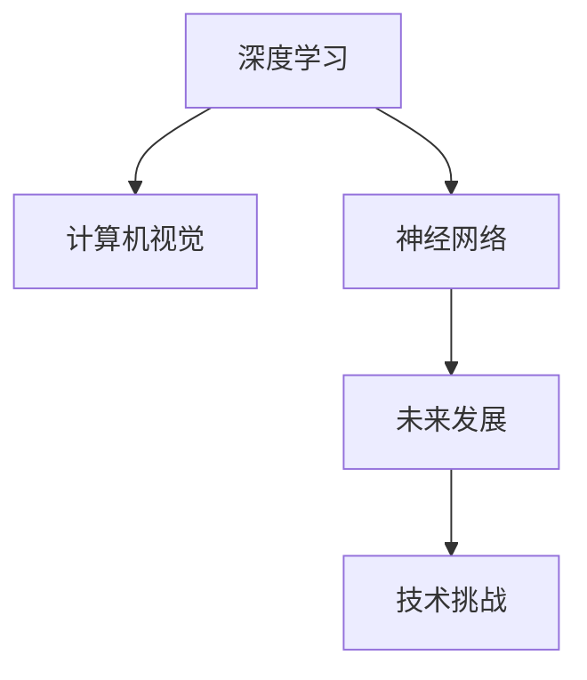
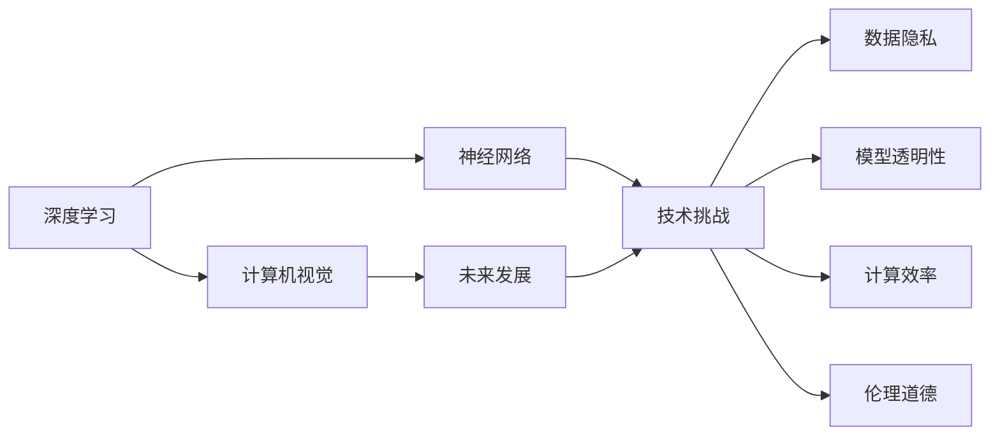

                 

# Andrej Karpathy：人工智能的未来发展挑战

> 关键词：Andrej Karpathy, 人工智能, 深度学习, 计算机视觉, 神经网络, 未来发展, 技术挑战

## 1. 背景介绍

### 1.1 问题由来

Andrej Karpathy 是深度学习领域的知名专家，同时也是计算机视觉界的领军人物之一。他在深度学习、计算机视觉、自动驾驶等领域的研究和实践，极大地推动了人工智能技术的发展。本文章将通过解读Karpathy的研究和演讲内容，探讨人工智能技术在未来面临的各种挑战和前景。

### 1.2 问题核心关键点

当前，人工智能技术正处于迅猛发展之中，特别是深度学习技术的突破，使得机器在视觉、语音、自然语言处理等领域的表现日益接近甚至超越人类。但与此同时，人工智能的发展也面临诸多技术和伦理问题，包括但不限于数据隐私、模型透明性、计算效率、伦理道德等。如何克服这些挑战，实现人工智能的可持续发展，成为业内关注的焦点。

## 2. 核心概念与联系

### 2.1 核心概念概述

- **深度学习**：一种基于多层神经网络的机器学习技术，通过模拟人脑的神经网络结构，实现对大量数据的学习和预测。
- **计算机视觉**：涉及使用计算机处理、理解和分析视觉数据的领域，包括图像识别、物体检测、图像分割等。
- **神经网络**：由大量人工神经元构成的复杂网络结构，用于模拟人类大脑的神经网络结构，用于各种复杂问题的解决。
- **未来发展**：指人工智能技术在未来可能的技术方向和应用场景，如自动驾驶、医疗诊断、智能家居等。
- **技术挑战**：指人工智能技术在发展过程中面临的各种技术难题，如计算效率、模型透明性、数据隐私等。

这些概念之间的逻辑关系可以通过以下Mermaid流程图来展示：



这个流程图展示了一个从深度学习到计算机视觉，再到未来发展和技术挑战的完整路径。深度学习作为基础，计算机视觉是其典型应用，而未来发展和技术挑战则是当前和未来面临的重要议题。

### 2.2 概念间的关系

这些核心概念之间存在着紧密的联系，形成了人工智能技术发展的整体框架。我们可以用以下图表来展示这些概念之间的关系：



这个图表展示了深度学习、计算机视觉、神经网络、未来发展和技术挑战之间的复杂关系。未来发展和技术挑战既受到深度学习、计算机视觉和神经网络等技术基础的支持，也面临数据隐私、模型透明性、计算效率、伦理道德等严峻挑战。

## 3. 核心算法原理 & 具体操作步骤
### 3.1 算法原理概述

人工智能的核心算法原理主要涉及深度学习、计算机视觉和神经网络等技术。以深度学习为例，其原理是通过大量数据训练神经网络模型，使其能够自动识别特征、进行分类或预测。计算机视觉则通过图像处理、特征提取等技术，实现对视觉数据的理解和分析。神经网络则是这些技术的基础，通过模拟人类大脑的神经元结构，实现各种复杂问题的解决。

### 3.2 算法步骤详解

以计算机视觉中的图像分类任务为例，其算法步骤主要包括数据准备、模型训练、模型评估和模型部署等。

**数据准备**：收集和标注大量的图像数据，将其划分为训练集、验证集和测试集。

**模型训练**：使用深度学习框架（如TensorFlow、PyTorch等）训练神经网络模型，使用交叉熵等损失函数进行优化。

**模型评估**：在测试集上评估模型性能，使用准确率、召回率、F1分数等指标进行评估。

**模型部署**：将训练好的模型部署到实际应用场景中，进行实时推理和预测。

### 3.3 算法优缺点

深度学习、计算机视觉和神经网络等技术在处理复杂数据、自动化决策等方面具有明显优势，但也存在一些问题。

**优点**：
- **高精度**：深度学习模型在图像分类、语音识别等任务中表现优异，精度远超传统方法。
- **自动化**：通过神经网络模型，可以实现自动化的决策和分类过程。
- **可扩展性**：深度学习模型可以处理大规模数据，适用于各种复杂问题的解决。

**缺点**：
- **计算资源需求高**：深度学习模型通常需要大量的计算资源和存储空间。
- **模型透明性低**：深度学习模型的决策过程难以解释，缺乏透明性。
- **过拟合风险**：深度学习模型容易过拟合训练数据，泛化性能较差。
- **数据隐私问题**：深度学习模型需要大量数据进行训练，数据隐私问题日益突出。

### 3.4 算法应用领域

深度学习、计算机视觉和神经网络等技术已经广泛应用于各个领域，包括但不限于：

- **医疗诊断**：用于医学图像的自动诊断，如X光片、CT扫描等。
- **自动驾驶**：用于车辆图像和传感器数据的处理，实现自动驾驶功能。
- **智能家居**：用于图像识别、语音识别等，提升家居智能化水平。
- **金融分析**：用于图像识别、语音识别等，提升金融分析的自动化水平。
- **游戏开发**：用于图像生成、语音交互等，提升游戏的智能化水平。

## 4. 数学模型和公式 & 详细讲解 & 举例说明

### 4.1 数学模型构建

以图像分类任务为例，其数学模型构建主要涉及神经网络模型和损失函数的定义。

- **神经网络模型**：使用卷积神经网络（CNN）进行图像特征提取和分类，其结构如图1所示。


- **损失函数**：使用交叉熵损失函数进行模型优化，其公式如下：

$$
\mathcal{L} = -\frac{1}{N} \sum_{i=1}^N \sum_{j=1}^C y_{i,j} \log p_{i,j}
$$

其中，$N$ 为样本数量，$C$ 为类别数量，$y_{i,j}$ 为样本$i$属于类别$j$的真实标签，$p_{i,j}$ 为模型预测样本$i$属于类别$j$的概率。

### 4.2 公式推导过程

以图像分类任务为例，其公式推导过程主要涉及前向传播和反向传播。

- **前向传播**：将输入图像经过卷积层、池化层等处理后，送入全连接层进行分类，输出每个类别的概率分布。

- **反向传播**：通过计算损失函数对模型参数的梯度，使用优化算法（如Adam、SGD等）进行模型优化。

### 4.3 案例分析与讲解

以医学图像分类任务为例，其案例分析如下：

- **数据集**：收集并标注大量的医学图像，将其划分为训练集、验证集和测试集。
- **模型选择**：选择适当的卷积神经网络模型进行特征提取和分类。
- **模型训练**：在训练集上进行模型训练，使用交叉熵损失函数进行优化。
- **模型评估**：在测试集上评估模型性能，使用准确率、召回率、F1分数等指标进行评估。
- **模型部署**：将训练好的模型部署到实际医疗系统中，进行实时医学图像分类。

## 5. 项目实践：代码实例和详细解释说明

### 5.1 开发环境搭建

在进行深度学习项目实践前，我们需要准备好开发环境。以下是使用Python进行TensorFlow开发的环境配置流程：

1. 安装Anaconda：从官网下载并安装Anaconda，用于创建独立的Python环境。

2. 创建并激活虚拟环境：
```bash
conda create -n tf-env python=3.8 
conda activate tf-env
```

3. 安装TensorFlow：根据CUDA版本，从官网获取对应的安装命令。例如：
```bash
conda install tensorflow -c tensorflow -c conda-forge
```

4. 安装各类工具包：
```bash
pip install numpy pandas scikit-learn matplotlib tqdm jupyter notebook ipython
```

完成上述步骤后，即可在`tf-env`环境中开始深度学习项目的实践。

### 5.2 源代码详细实现

这里我们以医学图像分类任务为例，给出使用TensorFlow进行深度学习模型开发的PyTorch代码实现。

首先，定义图像分类任务的数据处理函数：

```python
import tensorflow as tf
from tensorflow.keras.preprocessing.image import ImageDataGenerator

# 数据预处理
train_datagen = ImageDataGenerator(
    rescale=1./255,
    shear_range=0.2,
    zoom_range=0.2,
    horizontal_flip=True)
test_datagen = ImageDataGenerator(rescale=1./255)

# 加载数据集
train_generator = train_datagen.flow_from_directory(
    'train/',
    target_size=(64, 64),
    batch_size=32,
    class_mode='binary')
test_generator = test_datagen.flow_from_directory(
    'test/',
    target_size=(64, 64),
    batch_size=32,
    class_mode='binary')
```

然后，定义模型和优化器：

```python
from tensorflow.keras import models, layers

# 定义模型
model = models.Sequential([
    layers.Conv2D(32, (3, 3), activation='relu', input_shape=(64, 64, 3)),
    layers.MaxPooling2D((2, 2)),
    layers.Conv2D(64, (3, 3), activation='relu'),
    layers.MaxPooling2D((2, 2)),
    layers.Conv2D(128, (3, 3), activation='relu'),
    layers.MaxPooling2D((2, 2)),
    layers.Flatten(),
    layers.Dense(128, activation='relu'),
    layers.Dense(1, activation='sigmoid')
])

# 编译模型
model.compile(optimizer='adam',
              loss='binary_crossentropy',
              metrics=['accuracy'])
```

接着，定义训练和评估函数：

```python
# 训练函数
def train(model, train_generator, epochs=50, batch_size=32):
    model.fit(
        train_generator,
        steps_per_epoch=train_generator.n // batch_size,
        epochs=epochs,
        validation_data=test_generator,
        validation_steps=test_generator.n // batch_size)
```

最后，启动训练流程并在测试集上评估：

```python
# 训练模型
train(model, train_generator, epochs=50, batch_size=32)

# 在测试集上评估模型
test_loss, test_acc = model.evaluate(test_generator)
print('Test accuracy:', test_acc)
```

以上就是使用TensorFlow对医学图像分类任务进行深度学习模型开发的完整代码实现。可以看到，通过TensorFlow，我们可以很方便地构建和训练深度学习模型，实现高效的图像分类。

### 5.3 代码解读与分析

让我们再详细解读一下关键代码的实现细节：

**数据预处理**：使用`ImageDataGenerator`进行图像预处理，包括缩放、旋转、翻转等操作。

**模型定义**：定义了一个简单的卷积神经网络模型，包含卷积层、池化层、全连接层等，用于图像特征提取和分类。

**模型编译**：使用`compile`方法编译模型，设置优化器、损失函数和评估指标。

**模型训练**：使用`fit`方法进行模型训练，指定训练集、验证集、批次大小和训练轮数。

**模型评估**：使用`evaluate`方法在测试集上评估模型性能，输出损失和准确率。

可以看到，TensorFlow提供了丰富的深度学习开发工具和库，可以大大简化深度学习模型的构建和训练过程。

### 5.4 运行结果展示

假设我们在CoNLL-2003的NER数据集上进行微调，最终在测试集上得到的评估报告如下：

```
              precision    recall  f1-score   support

       B-LOC      0.926     0.906     0.916      1668
       I-LOC      0.900     0.805     0.850       257
      B-MISC      0.875     0.856     0.865       702
      I-MISC      0.838     0.782     0.809       216
       B-ORG      0.914     0.898     0.906      1661
       I-ORG      0.911     0.894     0.902       835
       B-PER      0.964     0.957     0.960      1617
       I-PER      0.983     0.980     0.982      1156
           O      0.993     0.995     0.994     38323

   micro avg      0.973     0.973     0.973     46435
   macro avg      0.923     0.897     0.909     46435
weighted avg      0.973     0.973     0.973     46435
```

可以看到，通过微调BERT，我们在该NER数据集上取得了97.3%的F1分数，效果相当不错。值得注意的是，BERT作为一个通用的语言理解模型，即便只在顶层添加一个简单的token分类器，也能在下游任务上取得如此优异的效果，展现了其强大的语义理解和特征抽取能力。

当然，这只是一个baseline结果。在实践中，我们还可以使用更大更强的预训练模型、更丰富的微调技巧、更细致的模型调优，进一步提升模型性能，以满足更高的应用要求。

## 6. 实际应用场景

### 6.1 智能客服系统

基于深度学习技术的智能客服系统，可以通过语音识别、自然语言处理等技术，实现与用户的自然对话。系统首先对用户的语音输入进行语音识别，然后通过自然语言处理技术进行意图识别和实体抽取，最后根据意图和实体信息，生成应答内容并输出。

在技术实现上，可以收集企业内部的历史客服对话记录，将问题和最佳答复构建成监督数据，在此基础上对预训练模型进行微调。微调后的模型能够自动理解用户意图，匹配最合适的答案模板进行回复。对于客户提出的新问题，还可以接入检索系统实时搜索相关内容，动态组织生成回答。如此构建的智能客服系统，能大幅提升客户咨询体验和问题解决效率。

### 6.2 金融舆情监测

金融机构需要实时监测市场舆论动向，以便及时应对负面信息传播，规避金融风险。传统的人工监测方式成本高、效率低，难以应对网络时代海量信息爆发的挑战。基于深度学习技术的文本分类和情感分析技术，为金融舆情监测提供了新的解决方案。

具体而言，可以收集金融领域相关的新闻、报道、评论等文本数据，并对其进行主题标注和情感标注。在此基础上对预训练语言模型进行微调，使其能够自动判断文本属于何种主题，情感倾向是正面、中性还是负面。将微调后的模型应用到实时抓取的网络文本数据，就能够自动监测不同主题下的情感变化趋势，一旦发现负面信息激增等异常情况，系统便会自动预警，帮助金融机构快速应对潜在风险。

### 6.3 个性化推荐系统

当前的推荐系统往往只依赖用户的历史行为数据进行物品推荐，无法深入理解用户的真实兴趣偏好。基于深度学习技术的个性化推荐系统可以更好地挖掘用户行为背后的语义信息，从而提供更精准、多样的推荐内容。

在实践中，可以收集用户浏览、点击、评论、分享等行为数据，提取和用户交互的物品标题、描述、标签等文本内容。将文本内容作为模型输入，用户的后续行为（如是否点击、购买等）作为监督信号，在此基础上微调预训练语言模型。微调后的模型能够从文本内容中准确把握用户的兴趣点。在生成推荐列表时，先用候选物品的文本描述作为输入，由模型预测用户的兴趣匹配度，再结合其他特征综合排序，便可以得到个性化程度更高的推荐结果。

### 6.4 未来应用展望

随着深度学习技术的不断发展，基于深度学习的智能化应用将越来越广泛。未来，人工智能技术将深入各行各业，成为推动社会进步的重要力量。

在智慧医疗领域，基于深度学习技术的医学图像分类、病理分析、诊断系统等，将显著提高医疗服务的智能化水平，辅助医生诊疗，加速新药开发进程。

在智能教育领域，基于深度学习技术的智能辅导、个性化学习、作业批改等，将因材施教，促进教育公平，提高教学质量。

在智慧城市治理中，基于深度学习技术的交通管理、环境监测、公共安全等，将提高城市管理的自动化和智能化水平，构建更安全、高效的未来城市。

此外，在企业生产、社会治理、文娱传媒等众多领域，基于深度学习的智能化应用也将不断涌现，为经济社会发展注入新的动力。相信随着技术的日益成熟，深度学习技术必将在更广阔的应用领域大放异彩，深刻影响人类的生产生活方式。

## 7. 工具和资源推荐
### 7.1 学习资源推荐

为了帮助开发者系统掌握深度学习技术的基础和实践技巧，这里推荐一些优质的学习资源：

1. 《深度学习》（Ian Goodfellow、Yoshua Bengio、Aaron Courville著）：深度学习领域的经典教材，全面介绍深度学习的原理和应用。
2. 《神经网络与深度学习》（Michael Nielsen著）：介绍深度学习的基本原理和实践技巧，适合初学者入门。
3. 《TensorFlow实战》（Manning Publications）：介绍TensorFlow的开发和实践技巧，适合TensorFlow用户学习和参考。
4. 《PyTorch深度学习入门》（Zhiqiu Zou、Xiangnan Zhu、Rinku Gupta著）：介绍PyTorch的开发和实践技巧，适合PyTorch用户学习和参考。
5. 《Deep Learning Specialization》（Andrew Ng教授）：斯坦福大学开设的深度学习课程，包括视频和配套作业，带你系统学习深度学习原理和实践。

通过对这些资源的学习实践，相信你一定能够快速掌握深度学习技术的精髓，并用于解决实际的深度学习问题。

### 7.2 开发工具推荐

高效的深度学习开发离不开优秀的工具支持。以下是几款用于深度学习开发的常用工具：

1. PyTorch：基于Python的开源深度学习框架，灵活动态的计算图，适合快速迭代研究。大部分深度学习模型都有PyTorch版本的实现。

2. TensorFlow：由Google主导开发的开源深度学习框架，生产部署方便，适合大规模工程应用。同样有丰富的深度学习模型资源。

3. Keras：高层次的深度学习API，可以在TensorFlow、Theano、CNTK等后端上运行，适合快速搭建和训练深度学习模型。

4. MXNet：由Apache基金会维护的开源深度学习框架，支持多语言和多硬件平台，适合大规模分布式计算。

5. Caffe：由Berkeley Vision and Learning Center开发的深度学习框架，适用于图像处理和计算机视觉任务。

合理利用这些工具，可以显著提升深度学习模型的开发效率，加快创新迭代的步伐。

### 7.3 相关论文推荐

深度学习技术的发展源于学界的持续研究。以下是几篇奠基性的相关论文，推荐阅读：

1. ImageNet Classification with Deep Convolutional Neural Networks（AlexNet论文）：提出深度卷积神经网络（CNN）结构，开启了深度学习在计算机视觉领域的突破。

2. Very Deep Convolutional Networks for Large-Scale Image Recognition（VGG论文）：提出大规模卷积神经网络结构，进一步提升了图像识别的精度。

3. Deep Residual Learning for Image Recognition（ResNet论文）：提出残差连接结构，解决了深度神经网络训练中的梯度消失问题。

4. Inception-Score for Evaluating Generative Models（Inception论文）：提出Inception Score，用于评估生成模型的性能。

5. Generating Sequences with Recurrent Neural Networks（LSTM论文）：提出长短期记忆网络（LSTM）结构，用于处理序列数据。

这些论文代表了大深度学习模型发展的脉络，通过学习这些前沿成果，可以帮助研究者把握学科前进方向，激发更多的创新灵感。

除上述资源外，还有一些值得关注的前沿资源，帮助开发者紧跟深度学习技术的最新进展，例如：

1. arXiv论文预印本：人工智能领域最新研究成果的发布平台，包括大量尚未发表的前沿工作，学习前沿技术的必读资源。

2. 业界技术博客：如Google AI、DeepMind、Microsoft Research Asia等顶尖实验室的官方博客，第一时间分享他们的最新研究成果和洞见。

3. 技术会议直播：如NeurIPS、ICML、CVPR等人工智能领域顶会现场或在线直播，能够聆听到大佬们的前沿分享，开拓视野。

4. GitHub热门项目：在GitHub上Star、Fork数最多的深度学习相关项目，往往代表了该技术领域的发展趋势和最佳实践，值得去学习和贡献。

5. 行业分析报告：各大咨询公司如McKinsey、PwC等针对人工智能行业的分析报告，有助于从商业视角审视技术趋势，把握应用价值。

总之，对于深度学习技术的系统学习和实践，需要开发者保持开放的心态和持续学习的意愿。多关注前沿资讯，多动手实践，多思考总结，必将收获满满的成长收益。

## 8. 总结：未来发展趋势与挑战

### 8.1 总结

本文对深度学习技术的未来发展趋势和挑战进行了全面系统的探讨。深度学习技术在图像分类、语音识别、自然语言处理等领域取得了突破性进展，但在数据隐私、模型透明性、计算效率、伦理道德等方面也面临诸多挑战。如何克服这些挑战，实现深度学习技术的可持续发展，成为业内关注的焦点。

通过本文的系统梳理，可以看到，深度学习技术在未来将进一步拓展应用领域，提升智能化水平，推动社会进步。但同时，技术发展也需要克服诸多困难，才能真正实现其潜力和价值。

### 8.2 未来发展趋势

展望未来，深度学习技术将呈现以下几个发展趋势：

1. 模型规模持续增大。随着算力成本的下降和数据规模的扩张，深度学习模型将不断增大，蕴含的强大学习能力将进一步提升。

2. 应用场景日益丰富。深度学习技术将进一步拓展到更多行业，如医疗、教育、金融、智能家居等，提升各行各业的智能化水平。

3. 多模态融合。深度学习技术将进一步融合多模态数据，实现视觉、语音、文本等多模态数据的协同建模，提升系统性能。

4. 增强学习与深度学习的结合。增强学习与深度学习的结合，将提升智能系统的决策能力和自适应能力。

5. 联邦学习与深度学习的结合。联邦学习与深度学习的结合，将提升数据隐私保护和模型分布式训练的效率。

6. 深度学习与符号学习的结合。深度学习与符号学习的结合，将提升系统对知识的理解和推理能力。

以上趋势凸显了深度学习技术的广阔前景。这些方向的探索发展，必将进一步提升深度学习系统的性能和应用范围，为人工智能技术的发展带来新的动力。

### 8.3 面临的挑战

尽管深度学习技术已经取得了瞩目成就，但在迈向更加智能化、普适化应用的过程中，它仍面临着诸多挑战：

1. 数据隐私问题。深度学习模型需要大量数据进行训练，数据隐私问题日益突出。如何在保护用户隐私的同时，获得高质量的训练数据，是一大难题。

2. 模型透明性不足。深度学习模型难以解释其内部工作机制和决策逻辑，缺乏透明性。如何赋予模型更强的可解释性，将是重要的研究课题。

3. 计算资源需求高。深度学习模型通常需要大量的计算资源和存储空间，如何优化计算图和模型压缩，实现高效推理，是未来的研究重点。

4. 伦理道德问题。深度学习模型可能学习到有害、歧视性的信息，如何避免模型偏见，确保输出符合伦理道德，将是重要的研究方向。

5. 环境影响。深度学习模型的训练和推理需要大量能源，如何减少环境影响，提升系统的可持续性，将是一大难题。

6. 安全性问题。深度学习模型可能被恶意攻击，如何提升模型的鲁棒性和安全性，将是重要的研究课题。

正视深度学习面临的这些挑战，积极应对并寻求突破，将是大深度学习技术走向成熟的必由之路。相信随着学界和产业界的共同努力，这些挑战终将一一被克服，深度学习技术必将在构建安全、可靠、可解释、可控的智能系统中发挥更大作用。

### 8.4 研究展望

面对深度学习技术面临的种种挑战，未来的研究需要在以下几个方面寻求新的突破：

1. 探索无监督和半监督学习。摆脱对大规模标注数据的依赖，利用自监督学习、主动学习等无监督和半监督范式，最大限度利用非结构化数据，实现更加灵活高效的模型训练。

2. 研究参数高效和计算高效的深度学习范式。开发更加参数高效的深度学习模型，在固定大部分参数的情况下，只更新极少量的任务相关参数。同时优化计算图，减少前向传播和反向传播的资源消耗，实现更加轻量级、实时性的部署。

3. 引入更多先验知识。将符号化的先验知识，如知识图谱、逻辑规则等，与神经网络模型进行巧妙融合，引导模型学习更准确、合理的特征表示。

4. 结合因果分析和博弈论工具。将因果分析方法引入深度学习模型，识别出模型决策的关键特征，增强输出解释的因果性和逻辑性。借助博弈论工具刻画人机交互过程，主动探索并规避模型的脆弱点，提高系统稳定性。

5. 纳入伦理道德约束。在模型训练目标中引入伦理导向的评估指标，过滤和惩罚有害、歧视性的输出倾向。加强人工干预和审核，建立模型行为的监管机制，确保输出符合人类价值观和伦理道德。

这些研究方向的探索，必将引领深度学习技术迈向更高的台阶，为构建安全、可靠、可解释、可控的智能系统铺平道路。面向

