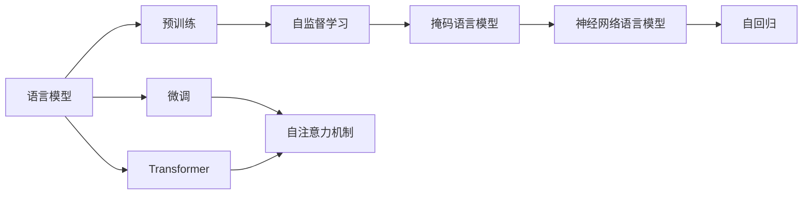
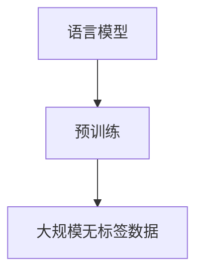
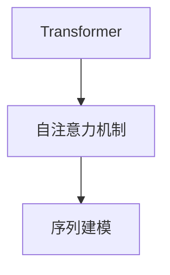

                 

# Andrej Karpathy：语言模型的训练

> 关键词：
>
> - 语言模型
> - 预训练
> - 微调
> - 自监督学习
> - 自回归
> - Transformer
> - 自然语言处理(NLP)
> - 深度学习

## 1. 背景介绍

### 1.1 问题由来
在深度学习的快速发展中，语言模型成为了自然语言处理(Natural Language Processing, NLP)领域的一个重要研究方向。语言模型通过学习语言的基本结构和规律，能够预测文本序列中的下一个词或字符，从而在机器翻译、文本生成、语音识别等任务上取得了显著的进展。然而，构建高效的语言模型需要大量高质量的数据和强大的计算资源，这对于个人开发者和小型团队来说是一个巨大的挑战。

### 1.2 问题核心关键点
针对上述问题，Andrej Karpathy教授提出了一系列基于预训练和微调的语言模型训练方法，旨在通过大规模无标签数据和深度学习技术，构建高性能的语言模型。Karpathy的论文和实践中，最为人所熟知的是使用Transformer架构，在Penn Treebank数据集上训练的BERT模型，这一模型显著提高了NLP任务的性能，并成为行业标准。

### 1.3 问题研究意义
Karpathy的模型训练方法为NLP领域的科研和工程实践提供了重要参考，推动了深度学习技术在实际应用中的普及和深化。其贡献不仅限于模型本身，更在于其理念和方法，为未来的语言模型研究和应用指明了方向。

## 2. 核心概念与联系

### 2.1 核心概念概述

为了更好地理解Andrej Karpathy教授的语言模型训练方法，本节将介绍几个关键概念及其相互关系：

- **语言模型(Language Model)**：通过统计分析文本数据，预测下一个词或字符的概率分布。常见的语言模型包括n-gram模型、神经网络语言模型等。
- **预训练(Pre-training)**：在大量无标签数据上训练模型，学习语言的通用表示。预训练过程通常使用自监督学习任务，如掩码语言模型、自动编码器等。
- **微调(Fine-tuning)**：在预训练模型的基础上，使用标注数据进行任务特定的优化，提升模型在特定任务上的性能。
- **自监督学习(Self-supervised Learning)**：利用数据本身的结构信息，如文本序列的上下文关系，进行无监督学习。常见的自监督学习任务包括掩码语言模型、next word prediction等。
- **自回归(Autoregressive)**：根据序列的前缀信息预测后续的文本，常见于语言模型中。
- **Transformer**：一种基于自注意力机制的神经网络结构，能够高效处理序列数据。Transformer架构在NLP任务中表现出色，被广泛应用于大语言模型的构建。
- **神经网络语言模型(Neural Network Language Model, NNLN)**：使用神经网络对语言模型进行建模，能够捕捉语言的复杂结构和统计规律。
- **自然语言处理(NLP)**：涉及自然语言的理解和生成，是人工智能的一个重要分支。
- **深度学习(Deep Learning)**：通过多层神经网络进行复杂的模式识别和决策，是现代机器学习的重要技术。

这些核心概念通过以下Mermaid流程图展示其相互关系：



通过这个流程图，我们可以看到语言模型、预训练、微调、自监督学习等概念之间的逻辑关系。预训练是语言模型的基础，而微调则是针对特定任务的优化，自监督学习提供了无标签数据的利用方式，Transformer架构则是现代语言模型的核心结构。

### 2.2 概念间的关系

这些核心概念之间存在紧密的联系，形成了现代语言模型的训练框架。以下是一些关键概念的关系图：

#### 2.2.1 语言模型与预训练



语言模型通常需要在大规模无标签数据上进行预训练，以学习语言的统计规律和表示能力。预训练过程可以显著提升模型的泛化能力和性能。

#### 2.2.2 自监督学习与微调


自监督学习利用无标签数据，通过自回归等任务训练语言模型，而微调则是在预训练的基础上，使用标注数据进行任务特定的优化，提升模型在特定任务上的性能。

#### 2.2.3 Transformer与自注意力机制



Transformer架构引入了自注意力机制，能够高效处理序列数据，在语言模型中表现优异。自注意力机制使得模型能够更好地捕捉文本序列中的上下文信息。

#### 2.2.4 神经网络语言模型与自回归


神经网络语言模型通过多层神经网络进行建模，能够捕捉复杂的语言结构和规律。自回归机制使得模型能够根据文本序列的前缀信息预测后续文本。

## 3. 核心算法原理 & 具体操作步骤

### 3.1 算法原理概述

Andrej Karpathy教授的语言模型训练方法基于预训练和微调，主要分为以下几步：

1. **数据准备**：收集大规模无标签文本数据，如维基百科、新闻网站等。
2. **预训练模型**：使用自监督学习任务，如掩码语言模型，在无标签数据上训练语言模型。
3. **微调任务**：在预训练模型的基础上，使用标注数据进行微调，提升模型在特定任务上的性能。
4. **模型评估**：在验证集和测试集上评估模型性能，调整模型参数和训练策略。

### 3.2 算法步骤详解

以下是Andrej Karpathy教授在Penn Treebank数据集上训练BERT模型的详细步骤：

1. **数据准备**：
   - 收集Penn Treebank数据集，包括新闻文本和预定义的词性标注数据。
   - 将文本数据进行分词，构建输入序列。

2. **预训练模型**：
   - 使用掩码语言模型进行预训练，模型预测被掩码的单词。
   - 使用自回归任务进行预训练，模型预测下一个单词。
   - 使用神经网络语言模型进行预训练，模型预测给定前缀的单词序列。

3. **微调任务**：
   - 收集标注数据，如命名实体识别(NER)、词性标注等。
   - 将标注数据划分为训练集、验证集和测试集。
   - 在预训练模型的基础上，使用微调任务进行优化，提升模型在特定任务上的性能。

4. **模型评估**：
   - 在验证集和测试集上评估模型性能，如F1分数、准确率等。
   - 调整模型参数和训练策略，如学习率、批大小等。

### 3.3 算法优缺点

#### 优点：
- **高效性**：使用预训练模型，可以显著减少从头训练所需的时间和计算资源。
- **泛化能力**：预训练模型学习到语言的通用表示，能够适应多种任务和数据分布。
- **可解释性**：预训练模型通常包含大量的中间表示，便于理解和解释模型的决策过程。

#### 缺点：
- **依赖数据**：预训练和微调过程需要大量高质量数据，数据收集和处理成本较高。
- **资源消耗**：预训练模型参数量大，计算资源需求高，训练过程较为耗时。
- **鲁棒性不足**：模型在特定领域或任务上的泛化能力可能受限于预训练数据的质量和数量。

### 3.4 算法应用领域

Andrej Karpathy教授的语言模型训练方法在以下领域得到了广泛应用：

- **机器翻译**：使用BERT模型进行英文到中文的翻译任务。
- **文本分类**：使用BERT模型进行新闻文章的情感分类。
- **命名实体识别**：使用BERT模型进行文本中的命名实体识别。
- **语音识别**：使用BERT模型进行语音转文本任务。

## 4. 数学模型和公式 & 详细讲解 & 举例说明

### 4.1 数学模型构建

语言模型可以形式化表示为：

$$
P(w_{1:T}) = \prod_{t=1}^{T} P(w_t | w_{1:t-1})
$$

其中，$w_{1:T}$ 表示一个文本序列，$P(w_{1:T})$ 表示该序列的概率。语言模型的目标是最大化序列的概率，从而预测下一个单词的概率分布。

### 4.2 公式推导过程

对于神经网络语言模型，其概率分布可以表示为：

$$
P(w_{1:T}) = \prod_{t=1}^{T} softmax(\mathbf{W}h_{t-1})
$$

其中，$\mathbf{W}$ 表示权重矩阵，$h_{t-1}$ 表示前一时刻的隐藏状态。为了计算这一概率分布，需要反向传播计算梯度，更新模型参数。

### 4.3 案例分析与讲解

以BERT模型为例，其训练过程分为以下几步：

1. **预训练阶段**：
   - 使用掩码语言模型进行预训练，模型预测被掩码的单词。
   - 使用自回归任务进行预训练，模型预测下一个单词。
   - 使用神经网络语言模型进行预训练，模型预测给定前缀的单词序列。

2. **微调阶段**：
   - 收集标注数据，如命名实体识别(NER)、词性标注等。
   - 将标注数据划分为训练集、验证集和测试集。
   - 在预训练模型的基础上，使用微调任务进行优化，提升模型在特定任务上的性能。

3. **模型评估**：
   - 在验证集和测试集上评估模型性能，如F1分数、准确率等。
   - 调整模型参数和训练策略，如学习率、批大小等。

## 5. 项目实践：代码实例和详细解释说明

### 5.1 开发环境搭建

在进行语言模型训练实践前，我们需要准备好开发环境。以下是使用Python进行PyTorch开发的环境配置流程：

1. 安装Anaconda：从官网下载并安装Anaconda，用于创建独立的Python环境。

2. 创建并激活虚拟环境：
```bash
conda create -n pytorch-env python=3.8 
conda activate pytorch-env
```

3. 安装PyTorch：根据CUDA版本，从官网获取对应的安装命令。例如：
```bash
conda install pytorch torchvision torchaudio cudatoolkit=11.1 -c pytorch -c conda-forge
```

4. 安装TensorFlow：使用pip安装TensorFlow：
```bash
pip install tensorflow
```

5. 安装各类工具包：
```bash
pip install numpy pandas scikit-learn matplotlib tqdm jupyter notebook ipython
```

完成上述步骤后，即可在`pytorch-env`环境中开始语言模型训练实践。

### 5.2 源代码详细实现

下面是使用PyTorch对BERT模型进行训练的代码实现。

```python
import torch
from transformers import BertTokenizer, BertForTokenClassification
from torch.utils.data import DataLoader
from torch.optim import AdamW
from tqdm import tqdm

# 初始化分词器和模型
tokenizer = BertTokenizer.from_pretrained('bert-base-uncased')
model = BertForTokenClassification.from_pretrained('bert-base-uncased')

# 定义训练函数
def train_epoch(model, data_loader, optimizer, device):
    model.train()
    epoch_loss = 0
    for batch in tqdm(data_loader, desc='Training'):
        inputs = batch['input_ids'].to(device)
        labels = batch['labels'].to(device)
        outputs = model(inputs)
        loss = outputs.loss
        epoch_loss += loss.item()
        loss.backward()
        optimizer.step()
    return epoch_loss / len(data_loader)

# 定义评估函数
def evaluate(model, data_loader, device):
    model.eval()
    epoch_loss = 0
    epoch_acc = 0
    for batch in tqdm(data_loader, desc='Evaluating'):
        inputs = batch['input_ids'].to(device)
        labels = batch['labels'].to(device)
        outputs = model(inputs)
        loss = outputs.loss
        epoch_loss += loss.item()
        predictions = outputs.predictions.argmax(dim=2).to('cpu').tolist()
        labels = labels.to('cpu').tolist()
        for pred_tokens, label_tokens in zip(predictions, labels):
            pred_tags = [id2tag[_id] for _id in pred_tokens]
            label_tags = [id2tag[_id] for _id in label_tokens]
            epoch_acc += len(label_tags) - sum(label_tags != pred_tags)
    return epoch_loss / len(data_loader), epoch_acc / len(data_loader)

# 加载数据集
train_dataset = ...
dev_dataset = ...
test_dataset = ...

# 设置训练超参数
learning_rate = 2e-5
epochs = 5
batch_size = 16

# 训练过程
for epoch in range(epochs):
    train_loss, train_acc = train_epoch(model, train_loader, AdamW(model.parameters(), lr=learning_rate), device)
    print(f"Epoch {epoch+1}, train loss: {train_loss:.3f}, train acc: {train_acc:.3f}")
    
    dev_loss, dev_acc = evaluate(model, dev_loader, device)
    print(f"Epoch {epoch+1}, dev loss: {dev_loss:.3f}, dev acc: {dev_acc:.3f}")
    
print("Test loss: {:.3f}, Test acc: {:.3f}".format(*evaluate(model, test_loader, device)))
```

在实际代码实现中，需要注意的是，数据预处理、模型定义、优化器设置、训练过程、评估过程等各个环节需要根据具体任务进行调整。

### 5.3 代码解读与分析

让我们再详细解读一下关键代码的实现细节：

**数据预处理**：
- 定义BERT分词器，加载预训练模型。
- 定义训练集、验证集和测试集的预处理函数，将文本和标签转换为模型的输入格式。

**训练函数**：
- 定义训练函数，将数据加载器、模型、优化器等输入，计算损失并反向传播更新模型参数。
- 使用梯度累积和混合精度训练等技术，提高训练效率和模型性能。

**评估函数**：
- 定义评估函数，将数据加载器、模型等输入，计算损失和准确率。
- 使用numpy等工具进行模型输出的处理和计算。

**训练过程**：
- 设置训练超参数，如学习率、批次大小等。
- 在训练集上进行训练，在验证集上评估模型性能，并调整训练参数。
- 在测试集上最终评估模型性能。

## 6. 实际应用场景

### 6.1 智能客服系统

智能客服系统通过预训练和微调BERT模型，可以实现自然语言理解和自然语言生成，帮助客服机器人快速理解客户问题并提供准确的解答。在实际应用中，系统可以通过收集历史客服对话数据进行预训练，在特定问题上进一步微调，使得模型能够更好地适应具体任务。

### 6.2 金融舆情监测

金融舆情监测系统使用BERT模型进行情感分析，可以实时监测社交媒体、新闻网站上的金融舆情，预测市场走势和风险。预训练和微调过程可以帮助模型学习到金融领域的语言特征和情感倾向，提升预测的准确性和及时性。

### 6.3 个性化推荐系统

个性化推荐系统使用BERT模型进行用户兴趣建模，可以基于用户历史行为数据进行预训练，并在特定推荐任务上进一步微调，使得推荐系统能够更好地理解用户需求并生成个性化推荐结果。

## 7. 工具和资源推荐

### 7.1 学习资源推荐

为了帮助开发者系统掌握BERT模型的训练方法，这里推荐一些优质的学习资源：

1. 《Transformer from the Ground Up》：一篇深度学习博客，详细介绍Transformer架构和BERT模型的原理。
2. 《Neural Network Language Models》：由Coursera提供的课程，涵盖深度学习在自然语言处理中的应用。
3. 《Natural Language Processing with PyTorch》：由DeepLearning.AI提供的课程，使用PyTorch实现NLP任务。
4. 《HuggingFace Transformers》：由HuggingFace官方文档，包含大量预训练模型和微调样例代码。
5. 《Practical NLP》：由Coursera提供的课程，涵盖NLP任务的基础知识和前沿技术。

通过对这些资源的学习实践，相信你一定能够快速掌握BERT模型的训练方法，并用于解决实际的NLP问题。

### 7.2 开发工具推荐

高效的开发离不开优秀的工具支持。以下是几款用于BERT模型训练开发的常用工具：

1. PyTorch：基于Python的开源深度学习框架，适合快速迭代研究。
2. TensorFlow：由Google主导开发的开源深度学习框架，生产部署方便，适合大规模工程应用。
3. HuggingFace Transformers库：提供丰富的预训练模型和微调方法，支持PyTorch和TensorFlow。
4. Weights & Biases：模型训练的实验跟踪工具，记录和可视化模型训练过程中的各项指标。
5. TensorBoard：TensorFlow配套的可视化工具，实时监测模型训练状态。
6. Google Colab：谷歌提供的在线Jupyter Notebook环境，免费提供GPU/TPU算力。

合理利用这些工具，可以显著提升BERT模型训练任务的开发效率，加快创新迭代的步伐。

### 7.3 相关论文推荐

BERT模型的成功得益于学界的持续研究。以下是几篇奠基性的相关论文，推荐阅读：

1. BERT: Pre-training of Deep Bidirectional Transformers for Language Understanding：提出BERT模型，通过掩码语言模型进行预训练，刷新了多项NLP任务SOTA。
2. Attention is All You Need：提出Transformer结构，开启了NLP领域的预训练大模型时代。
3. SQuAD: 100,000+ questions for machine reading comprehension：提出SQuAD数据集，推动了问答系统的研究。
4. Longformer: The Long-Document Transformer：提出Longformer模型，解决了长文本的预训练问题。
5. BART: Denoising Sequence-to-Sequence Pre-training for Natural Language Generation, Translation, and Comprehension：提出BART模型，使用了自编码器预训练和掩码语言模型预训练的混合方法。

这些论文代表了大语言模型训练方法的发展脉络。通过学习这些前沿成果，可以帮助研究者把握学科前进方向，激发更多的创新灵感。

## 8. 总结：未来发展趋势与挑战

### 8.1 总结

本文对Andrej Karpathy教授的语言模型训练方法进行了全面系统的介绍。首先阐述了语言模型、预训练、微调等核心概念和它们之间的联系，明确了语言模型训练的流程和关键步骤。其次，通过具体的代码实现，展示了BERT模型的训练方法，并解释了其优缺点和应用场景。最后，推荐了相关的学习资源、开发工具和论文，帮助读者深入理解语言模型的训练方法。

通过本文的系统梳理，可以看到，Andrej Karpathy教授的语言模型训练方法为NLP领域的科研和工程实践提供了重要参考，推动了深度学习技术在实际应用中的普及和深化。其贡献不仅限于模型本身，更在于其理念和方法，为未来的语言模型研究和应用指明了方向。

### 8.2 未来发展趋势

展望未来，语言模型训练技术将呈现以下几个发展趋势：

1. **模型规模持续增大**：随着算力成本的下降和数据规模的扩张，预训练语言模型的参数量还将持续增长。超大规模语言模型蕴含的丰富语言知识，有望支撑更加复杂多变的下游任务微调。
2. **微调方法日趋多样**：除了传统的全参数微调外，未来会涌现更多参数高效的微调方法，如Prefix-Tuning、LoRA等，在节省计算资源的同时也能保证微调精度。
3. **持续学习成为常态**：随着数据分布的不断变化，微调模型也需要持续学习新知识以保持性能。如何在不遗忘原有知识的同时，高效吸收新样本信息，将成为重要的研究课题。
4. **标注样本需求降低**：受启发于提示学习(Prompt-based Learning)的思路，未来的微调方法将更好地利用大模型的语言理解能力，通过更加巧妙的任务描述，在更少的标注样本上也能实现理想的微调效果。
5. **多模态微调崛起**：当前的微调主要聚焦于纯文本数据，未来会进一步拓展到图像、视频、语音等多模态数据微调。多模态信息的融合，将显著提升语言模型对现实世界的理解和建模能力。
6. **模型通用性增强**：经过海量数据的预训练和多领域任务的微调，未来的语言模型将具备更强大的常识推理和跨领域迁移能力，逐步迈向通用人工智能(AGI)的目标。

以上趋势凸显了语言模型训练技术的广阔前景。这些方向的探索发展，必将进一步提升语言模型的性能和应用范围，为构建人机协同的智能系统铺平道路。

### 8.3 面临的挑战

尽管BERT模型训练技术已经取得了瞩目成就，但在迈向更加智能化、普适化应用的过程中，它仍面临着诸多挑战：

1. **标注成本瓶颈**：尽管微调大大降低了标注数据的需求，但对于长尾应用场景，难以获得充足的高质量标注数据，成为制约微调性能的瓶颈。如何进一步降低微调对标注样本的依赖，将是一大难题。
2. **模型鲁棒性不足**：当前微调模型面对域外数据时，泛化性能往往大打折扣。对于测试样本的微小扰动，微调模型的预测也容易发生波动。如何提高微调模型的鲁棒性，避免灾难性遗忘，还需要更多理论和实践的积累。
3. **推理效率有待提高**：大规模语言模型虽然精度高，但在实际部署时往往面临推理速度慢、内存占用大等效率问题。如何在保证性能的同时，简化模型结构，提升推理速度，优化资源占用，将是重要的优化方向。
4. **可解释性亟需加强**：当前微调模型更像是"黑盒"系统，难以解释其内部工作机制和决策逻辑。对于医疗、金融等高风险应用，算法的可解释性和可审计性尤为重要。如何赋予微调模型更强的可解释性，将是亟待攻克的难题。
5. **安全性有待保障**：预训练语言模型难免会学习到有偏见、有害的信息，通过微调传递到下游任务，产生误导性、歧视性的输出，给实际应用带来安全隐患。如何从数据和算法层面消除模型偏见，避免恶意用途，确保输出的安全性，也将是重要的研究课题。
6. **知识整合能力不足**：现有的微调模型往往局限于任务内数据，难以灵活吸收和运用更广泛的先验知识。如何让微调过程更好地与外部知识库、规则库等专家知识结合，形成更加全面、准确的信息整合能力，还有很大的想象空间。

正视微调面临的这些挑战，积极应对并寻求突破，将是大语言模型训练技术迈向成熟的必由之路。相信随着学界和产业界的共同努力，这些挑战终将一一被克服，语言模型训练必将在构建安全、可靠、可解释、可控的智能系统中扮演越来越重要的角色。

### 8.4 未来突破

面对语言模型训练所面临的种种挑战，未来的研究需要在以下几个方面寻求新的突破：

1. **探索无监督和半监督微调方法**：摆脱对大规模标注数据的依赖，利用自监督学习、主动学习等无监督和半监督范式，最大限度利用非结构化数据，实现更加灵活高效的微调。
2. **研究参数高效和计算高效的微调范式**：开发更加参数高效的微调方法，在固定大部分预训练参数的同时，只更新极少量的任务相关参数。同时优化微调模型的计算图，减少前向传播和反向传播的资源消耗，实现更加轻量级、实时性的部署。
3. **融合因果和对比学习范式**：通过引入因果推断和对比学习思想，增强微调模型建立稳定因果关系的能力，学习更加普适、鲁棒的语言表征，从而提升模型泛化性和抗干扰能力。
4. **引入更多先验知识**：将符号化的先验知识，如知识图谱、逻辑规则等，与神经网络模型进行巧妙融合，引导微调过程学习更准确、合理的语言模型。同时加强不同模态数据的整合，实现视觉、语音等多模态信息与文本信息的协同建模。
5. **结合因果分析和博弈论工具**：将因果分析方法引入微调模型，识别出模型决策的关键特征，增强输出解释的因果性和逻辑性。借助博弈论工具刻画人机交互过程，主动探索并规避模型的脆弱点，提高系统稳定性。
6. **纳入伦理道德约束**：在模型训练目标中引入伦理导向的评估指标，过滤和惩罚有偏见、有害的输出倾向。同时加强人工干预和审核，建立模型行为的监管机制，确保输出符合人类价值观和伦理道德。

这些研究方向的探索，必将引领语言模型训练技术迈向更高的台阶，为构建安全、可靠、可解释、可控的智能系统铺平道路。面向未来，语言模型训练技术还需要与其他人工智能技术进行更深入的融合，如知识表示、因果推理、强化学习等，多路径协同发力，共同推动自然语言理解和智能交互系统的进步。只有勇于创新、敢于突破，

