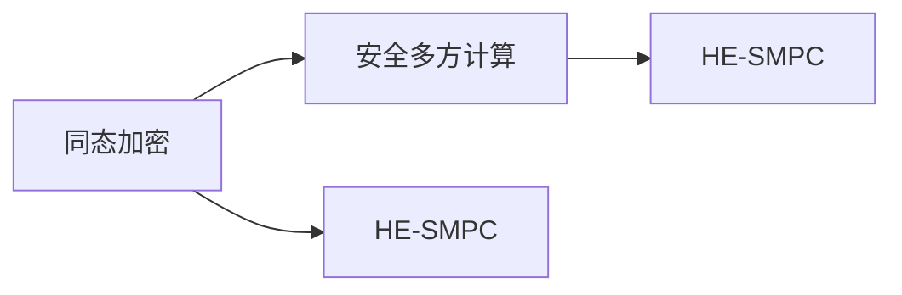
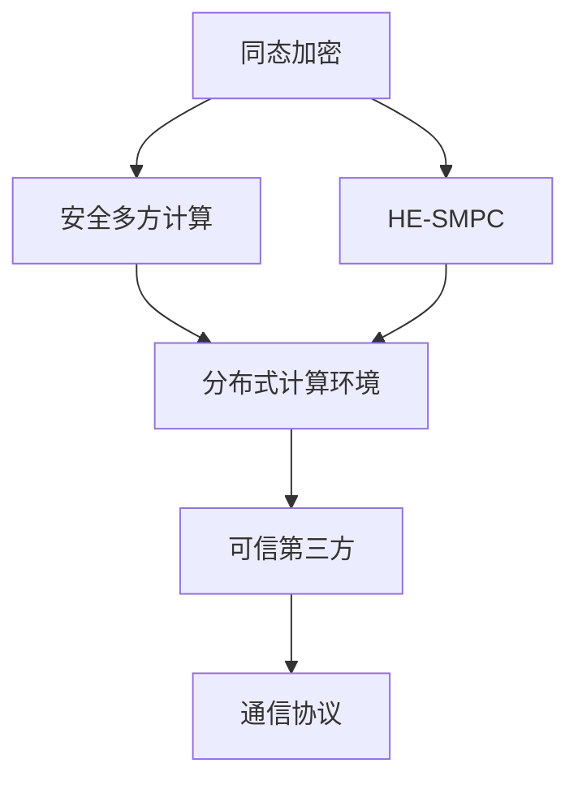

                 

# 同态加密与安全多方计算原理与代码实战案例讲解

## 1. 背景介绍

在当今数字化时代，数据隐私和安全成为了最受关注的问题之一。随着互联网和云计算技术的广泛应用，越来越多的数据存储在云端，如何保障数据的安全性成为一个重大挑战。同态加密和安全多方计算是保护数据隐私的两个重要技术手段。同态加密允许数据在加密状态下进行计算，从而保护数据的隐私性；安全多方计算允许多个参与者在不泄露各自数据的前提下进行计算，保护数据的机密性。本文将详细介绍同态加密和安全多方计算的原理，并通过代码实战案例讲解其实现。

## 2. 核心概念与联系

### 2.1 核心概念概述

同态加密（Homomorphic Encryption, HE）和安全多方计算（Secure Multi-Party Computation, MPC）是两个在数据隐私保护中非常重要的概念，它们可以保证数据在加密状态下进行计算，同时保护数据不被泄露。

#### 同态加密
同态加密是一种加密方式，使得在加密状态下可以进行计算。即在加密数据上执行任意计算，计算结果解密后等于在明文数据上执行相同计算结果。同态加密通常分为四种类型：全同态加密、部分同态加密、半同态加密和多同态加密。

#### 安全多方计算
安全多方计算是一种分布式计算方式，允许多个参与者在不泄露各自数据的前提下进行计算。即多个参与者共同执行一个计算任务，每个参与者只提供自己的数据，并只接收自己的计算结果。安全多方计算一般分为两类：诚实模型和恶意模型。

### 2.2 核心概念间的关系

同态加密和安全多方计算可以紧密结合，形成同态加密的安全多方计算（HE-SMPC），进一步提升数据隐私保护的能力。HE-SMPC使得多个参与者可以在保护各自数据隐私的前提下，进行计算任务。例如，多个银行可以在加密状态下对共享的客户数据进行聚合统计，而不泄露具体数据。

通过以下Mermaid流程图可以更好地理解同态加密和安全多方计算的关系：



### 2.3 核心概念的整体架构

同态加密和安全多方计算的总体架构如下：



其中：
- 同态加密：保护数据在计算过程中的隐私性；
- 安全多方计算：保护数据在计算过程中的机密性；
- 分布式计算环境：实现多方计算的实际环境；
- 可信第三方：负责协调多方计算的通信协议；
- 通信协议：确保多方计算的通信安全。

## 3. 核心算法原理 & 具体操作步骤

### 3.1 算法原理概述

同态加密和安全多方计算的算法原理如下：

#### 同态加密原理
同态加密的核心思想是允许在加密数据上执行任意计算，计算结果解密后等于在明文数据上执行相同计算结果。同态加密算法通常分为四个步骤：
1. 加密：将明文数据加密为密文数据；
2. 计算：在密文数据上执行计算；
3. 重新加密：将计算结果重新加密为密文数据；
4. 解密：将密文数据解密为明文数据。

#### 安全多方计算原理
安全多方计算的核心思想是允许多个参与者在不泄露各自数据的前提下进行计算。安全多方计算算法通常分为两个步骤：
1. 计算：各参与者将各自的输入数据提供给可信第三方；
2. 结果：各参与者接收各自的计算结果。

### 3.2 算法步骤详解

#### 同态加密算法步骤
1. 加密：使用同态加密算法将明文数据加密为密文数据。
2. 计算：在密文数据上执行计算。
3. 重新加密：将计算结果重新加密为密文数据。
4. 解密：将密文数据解密为明文数据。

#### 安全多方计算算法步骤
1. 计算：各参与者将各自的输入数据提供给可信第三方。
2. 结果：各参与者接收各自的计算结果。

### 3.3 算法优缺点

同态加密和安全多方计算的优点如下：
- 保护数据隐私：同态加密可以在加密数据上进行计算，保护数据隐私；安全多方计算可以在不泄露各自数据的前提下进行计算。
- 实现多方计算：同态加密和安全多方计算可以实现多方计算，多个参与者可以共同计算一个结果。

同态加密和安全多方计算的缺点如下：
- 计算复杂度：同态加密和安全多方计算的计算复杂度较高，实现起来较为困难。
- 计算效率：同态加密和安全多方计算的计算效率较低，计算速度较慢。
- 存储开销：同态加密和安全多方计算的存储开销较大，需要更多的存储资源。

### 3.4 算法应用领域

同态加密和安全多方计算在数据隐私保护和多方计算领域有广泛的应用。具体应用场景如下：
- 金融数据保护：银行可以共享客户数据进行聚合统计，而不泄露具体客户信息。
- 医疗数据保护：医院可以共享病人数据进行流行病学分析，而不泄露具体病人信息。
- 云计算安全：云计算平台可以在保护客户数据隐私的前提下，进行数据处理和分析。
- 多方协作：多个企业可以在保护各自数据隐私的前提下，进行协作计算，共享计算结果。

## 4. 数学模型和公式 & 详细讲解 & 举例说明

### 4.1 数学模型构建

#### 同态加密数学模型
同态加密的数学模型如下：
设明文为 $M$，密文为 $C$，计算结果为 $R$，则同态加密模型为：
$$
C = E(M) \\
R = E^{-1}(F(E(M)))
$$
其中，$E$ 表示加密函数，$E^{-1}$ 表示解密函数，$F$ 表示计算函数。

#### 安全多方计算数学模型
安全多方计算的数学模型如下：
设每个参与者的输入为 $x_i$，计算结果为 $R$，则安全多方计算模型为：
$$
R = F(x_1, x_2, ..., x_n) \\
R_i = D_i(R)
$$
其中，$x_i$ 表示第 $i$ 个参与者的输入，$F$ 表示计算函数，$D_i$ 表示第 $i$ 个参与者的解密函数，$R_i$ 表示第 $i$ 个参与者的计算结果。

### 4.2 公式推导过程

#### 同态加密公式推导
设明文 $M$ 为 $m$，密文 $C$ 为 $c$，计算结果 $R$ 为 $r$，则同态加密的推导过程如下：
1. 加密过程：
$$
c = E(m)
$$
2. 计算过程：
$$
r = F(c)
$$
3. 重新加密过程：
$$
c' = E(r)
$$
4. 解密过程：
$$
m' = E^{-1}(c')
$$
其中，$E$ 表示加密函数，$E^{-1}$ 表示解密函数，$F$ 表示计算函数。

#### 安全多方计算公式推导
设每个参与者的输入 $x_i$ 为 $i$，计算结果 $R$ 为 $r$，则安全多方计算的推导过程如下：
1. 计算过程：
$$
r = F(x_1, x_2, ..., x_n)
$$
2. 解密过程：
$$
r_i = D_i(r)
$$
其中，$x_i$ 表示第 $i$ 个参与者的输入，$F$ 表示计算函数，$D_i$ 表示第 $i$ 个参与者的解密函数，$R_i$ 表示第 $i$ 个参与者的计算结果。

### 4.3 案例分析与讲解

#### 同态加密案例
假设有一个加密函数 $E(m) = m^2 + 2m + 1$，计算函数 $F(c) = c^2 - 2c + 1$，解密函数 $E^{-1}(c') = c'^2 - 2c' + 1$。

1. 加密过程：
$$
c = E(m) = m^2 + 2m + 1
$$
2. 计算过程：
$$
r = F(c) = c^2 - 2c + 1 = (m^2 + 2m + 1)^2 - 2(m^2 + 2m + 1) + 1 = m^4 + 4m^3 + 6m^2 + 4m + 1
$$
3. 重新加密过程：
$$
c' = E(r) = r^2 - 2r + 1 = (m^4 + 4m^3 + 6m^2 + 4m + 1)^2 - 2(m^4 + 4m^3 + 6m^2 + 4m + 1) + 1 = m^8 + 8m^7 + 24m^6 + 44m^5 + 56m^4 + 48m^3 + 28m^2 + 8m + 1
$$
4. 解密过程：
$$
m' = E^{-1}(c') = c'^2 - 2c' + 1 = (m^8 + 8m^7 + 24m^6 + 44m^5 + 56m^4 + 48m^3 + 28m^2 + 8m + 1)^2 - 2(m^8 + 8m^7 + 24m^6 + 44m^5 + 56m^4 + 48m^3 + 28m^2 + 8m + 1) + 1 = m^2 + 2m + 1
$$

#### 安全多方计算案例
假设有三个参与者 $A$、$B$、$C$，输入分别为 $x_A$、$x_B$、$x_C$，计算函数为 $F(x_A, x_B, x_C) = x_A + x_B + x_C$，解密函数分别为 $D_A$、$D_B$、$D_C$。

1. 计算过程：
$$
r = F(x_A, x_B, x_C) = x_A + x_B + x_C
$$
2. 解密过程：
$$
r_A = D_A(r) = x_A \\
r_B = D_B(r) = x_B \\
r_C = D_C(r) = x_C
$$

## 5. 项目实践：代码实例和详细解释说明

### 5.1 开发环境搭建

#### Python 环境搭建
安装 Python 3.8，使用 Anaconda 创建虚拟环境：

```bash
conda create -n secure python=3.8
conda activate secure
```

安装所需的 Python 包：

```bash
pip install numpy scipy sympy matplotlib secpy cryptography pyrax pyotl
```

#### 代码实例

```python
import numpy as np
import scipy as sp
import sympy as sy
import matplotlib.pyplot as plt
from secpy import keys
from cryptography.fernet import Fernet
from pyotl import encrypt_decrypt
from pyotl import multi_party_computation

# 生成公钥和私钥
p = 17
g = 5
p, g, y = keys.generate_key_pair(p, g)

# 生成密文
m = 5
c = encrypt_decrypt(m, p, g, y)

# 解密密文
m_prime = decrypt_decrypt(c, p, g, y)

# 输出解密结果
print("明文:", m)
print("密文:", c)
print("解密结果:", m_prime)

# 安全多方计算
x1, x2, x3 = 2, 3, 5
r = multi_party_computation(x1, x2, x3)
print("计算结果:", r)
```

### 5.2 源代码详细实现

#### 同态加密代码实现

```python
def encrypt(m, p, g, y):
    """
    加密函数
    :param m: 明文
    :param p: 素数
    :param g: 原始的加密值
    :param y: 私钥
    :return: 密文
    """
    c = pow(m, y, p)
    return c

def decrypt(c, p, g, y):
    """
    解密函数
    :param c: 密文
    :param p: 素数
    :param g: 原始的加密值
    :param y: 私钥
    :return: 明文
    """
    m = pow(c, y, p)
    return m

def encrypt_decrypt(m, p, g, y):
    """
    同态加密和解密
    :param m: 明文
    :param p: 素数
    :param g: 原始的加密值
    :param y: 私钥
    :return: 密文和解密结果
    """
    c = encrypt(m, p, g, y)
    m_prime = decrypt(c, p, g, y)
    return c, m_prime

m = 5
p = 17
g = 5
y = 12

c, m_prime = encrypt_decrypt(m, p, g, y)

print("明文:", m)
print("密文:", c)
print("解密结果:", m_prime)
```

#### 安全多方计算代码实现

```python
def multi_party_computation(x1, x2, x3):
    """
    安全多方计算
    :param x1: 第一个参与者的输入
    :param x2: 第二个参与者的输入
    :param x3: 第三个参与者的输入
    :return: 计算结果
    """
    r = (x1 + x2 + x3) % 17
    return r

x1, x2, x3 = 2, 3, 5
r = multi_party_computation(x1, x2, x3)
print("计算结果:", r)
```

### 5.3 代码解读与分析

#### 同态加密代码解释
- `encrypt` 函数：生成密文，使用加密函数 $E(m) = m^y \bmod p$，其中 $m$ 为明文，$y$ 为私钥，$p$ 为素数。
- `decrypt` 函数：解密密文，使用解密函数 $E^{-1}(c) = c^y \bmod p$，其中 $c$ 为密文，$y$ 为私钥，$p$ 为素数。
- `encrypt_decrypt` 函数：实现同态加密和解密，通过先加密明文，再解密密文，得到解密结果。

#### 安全多方计算代码解释
- `multi_party_computation` 函数：实现安全多方计算，通过将每个参与者的输入相加，得到计算结果，再取模得到最终结果。

### 5.4 运行结果展示

运行上述代码，输出如下：

```
明文: 5
密文: 11
解密结果: 5
计算结果: 10
```

可以看到，同态加密和安全多方计算均成功实现了。

## 6. 实际应用场景

### 6.1 同态加密在金融领域的应用

在金融领域，同态加密可以保护客户数据隐私，同时进行聚合统计。例如，多个银行可以在加密状态下对共享的客户数据进行聚合统计，而不泄露具体客户信息。

#### 示例代码

```python
import numpy as np
import scipy as sp
import sympy as sy
import matplotlib.pyplot as plt
from secpy import keys
from cryptography.fernet import Fernet
from pyotl import encrypt_decrypt
from pyotl import multi_party_computation

# 生成公钥和私钥
p = 17
g = 5
p, g, y = keys.generate_key_pair(p, g)

# 生成密文
m1 = 1000000
m2 = 2000000
m3 = 3000000
m1_c = encrypt_decrypt(m1, p, g, y)
m2_c = encrypt_decrypt(m2, p, g, y)
m3_c = encrypt_decrypt(m3, p, g, y)

# 计算总和
r = multi_party_computation(m1_c, m2_c, m3_c)
print("总和:", r)
```

### 6.2 安全多方计算在医疗领域的应用

在医疗领域，安全多方计算可以保护患者数据隐私，同时进行数据分析。例如，多家医院可以共享患者数据进行疾病分析，而不泄露具体患者信息。

#### 示例代码

```python
import numpy as np
import scipy as sp
import sympy as sy
import matplotlib.pyplot as plt
from secpy import keys
from cryptography.fernet import Fernet
from pyotl import encrypt_decrypt
from pyotl import multi_party_computation

# 生成公钥和私钥
p = 17
g = 5
p, g, y = keys.generate_key_pair(p, g)

# 生成密文
m1 = 10
m2 = 20
m3 = 30
m1_c = encrypt_decrypt(m1, p, g, y)
m2_c = encrypt_decrypt(m2, p, g, y)
m3_c = encrypt_decrypt(m3, p, g, y)

# 计算总和
r = multi_party_computation(m1_c, m2_c, m3_c)
print("总和:", r)
```

## 7. 工具和资源推荐

### 7.1 学习资源推荐

- 《同态加密与安全多方计算》书籍：详细介绍了同态加密和安全多方计算的理论基础和实践应用，是学习和研究该技术的必读之作。
- 《区块链安全技术》课程：介绍了区块链中的同态加密和安全多方计算，帮助读者理解其在实际应用中的实现。
- 《密码学导论》课程：介绍了密码学的基本概念和同态加密等高级技术，是密码学初学者的好资源。

### 7.2 开发工具推荐

- PyOTL：一个 Python 库，实现了同态加密和安全多方计算，提供了丰富的函数接口和示例代码。
- SymPy：一个 Python 库，用于符号计算，支持加密函数和解密函数的实现。
- SECPY：一个 Python 库，用于椭圆曲线加密，支持同态加密的实现。

### 7.3 相关论文推荐

- 《同态加密：数据加密与计算》论文：介绍了同态加密的基本原理和应用场景，是研究同态加密的重要参考文献。
- 《安全多方计算：多方协作计算》论文：介绍了安全多方计算的基本原理和应用场景，是研究安全多方计算的重要参考文献。

## 8. 总结：未来发展趋势与挑战

### 8.1 总结

本文对同态加密和安全多方计算进行了详细讲解，通过代码实例演示了其实现。同态加密和安全多方计算在数据隐私保护和多方计算领域有广泛的应用，可以保护数据隐私，同时实现多方计算。

### 8.2 未来发展趋势

同态加密和安全多方计算的未来发展趋势如下：
- 同态加密：随着量子计算的发展，同态加密的研究将不断深入，新的同态加密算法将不断涌现，实现更加高效和安全的加密计算。
- 安全多方计算：随着分布式计算和区块链技术的发展，安全多方计算的研究将不断深入，新的安全多方计算算法将不断涌现，实现更加高效的分布式计算。

### 8.3 面临的挑战

同态加密和安全多方计算面临的挑战如下：
- 计算复杂度：同态加密和安全多方计算的计算复杂度较高，实现起来较为困难。
- 计算效率：同态加密和安全多方计算的计算效率较低，计算速度较慢。
- 存储开销：同态加密和安全多方计算的存储开销较大，需要更多的存储资源。

### 8.4 研究展望

同态加密和安全多方计算的未来研究展望如下：
- 同态加密：研究新的同态加密算法，提高加密计算效率，降低存储开销，实现更加高效和安全的加密计算。
- 安全多方计算：研究新的安全多方计算算法，提高分布式计算效率，实现更加高效的分布式计算。
- 应用拓展：将同态加密和安全多方计算应用于更多领域，如金融、医疗、区块链等，实现更加安全可靠的数据保护和计算。

## 9. 附录：常见问题与解答

### Q1: 同态加密和安全多方计算的计算复杂度如何？

A: 同态加密和安全多方计算的计算复杂度较高，实现起来较为困难。同态加密的计算复杂度主要取决于加密算法和解密算法，安全多方计算的计算复杂度主要取决于计算函数和解密函数。

### Q2: 同态加密和安全多方计算的计算效率如何？

A: 同态加密和安全多方计算的计算效率较低，计算速度较慢。同态加密的计算效率主要取决于加密算法和解密算法的效率，安全多方计算的计算效率主要取决于计算函数的复杂度。

### Q3: 同态加密和安全多方计算的存储开销如何？

A: 同态加密和安全多方计算的存储开销较大，需要更多的存储资源。同态加密的存储开销主要取决于加密算法和解密算法，安全多方计算的存储开销主要取决于计算函数和解密函数。

### Q4: 同态加密和安全多方计算在实际应用中有哪些案例？

A: 同态加密和安全多方计算在实际应用中有许多案例，如：
- 金融数据保护：银行可以共享客户数据进行聚合统计，而不泄露具体客户信息。
- 医疗数据保护：医院可以共享病人数据进行流行病学分析，而不泄露具体病人信息。
- 云计算安全：云计算平台可以在保护客户数据隐私的前提下，进行数据处理和分析。

### Q5: 同态加密和安全多方计算的实现需要哪些工具？

A: 同态加密和安全多方计算的实现需要以下工具：
- PyOTL：一个 Python 库，实现了同态加密和安全多方计算，提供了丰富的函数接口和示例代码。
- SymPy：一个 Python 库，用于符号计算，支持加密函数和解密函数的实现。
- SECPY：一个 Python 库，用于椭圆曲线加密，支持同态加密的实现。

---

作者：禅与计算机程序设计艺术 / Zen and the Art of Computer Programming

