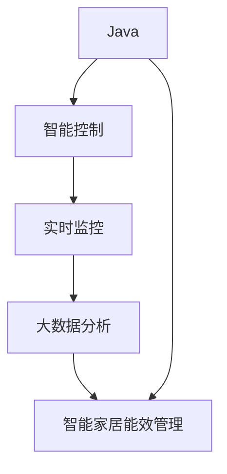

                 

# 基于Java的智能家居设计：Java在智能家居能效管理中的应用探究

> 关键词：Java, 智能家居, 能效管理, 智能控制, 实时监控, 大数据分析

## 1. 背景介绍

随着科技的飞速发展，智能家居系统逐渐成为家庭生活的重要组成部分。通过智能家居系统，用户可以实现对家中的各种设备进行远程控制、自动化管理以及能效优化。其中，Java作为一门应用广泛且功能强大的编程语言，在智能家居系统设计中发挥着重要作用。本文将深入探讨Java在智能家居能效管理中的应用，揭示Java如何帮助实现更加节能、高效、智能的家居环境。

### 1.1 智能家居的发展历程

智能家居系统的设计思想可以追溯到20世纪80年代，当时的家庭自动化系统主要是通过有线的方式将各个设备连接起来。到了90年代，随着互联网技术的发展，无线通信技术的进步，智能家居系统逐渐向网络化、无线化方向发展。2000年以后，物联网技术的兴起，智能家居系统设计更加注重设备的互联互通和智能化处理，真正意义上的智能家居系统开始走向成熟。

### 1.2 智能家居的关键技术

智能家居系统设计包括多个关键技术，例如物联网技术、云计算、大数据分析、人工智能等。这些技术的融合，使得智能家居系统具备了智能感知、远程控制、自适应学习等功能，极大地提升了用户的生活质量。

- **物联网技术**：通过各种传感器、通信模块、智能设备，将家居中的各个环节连接起来，实现设备的互联互通。
- **云计算**：通过互联网将家居设备收集的数据上传到云端，进行集中存储和管理，实现数据的共享和分析。
- **大数据分析**：通过对收集的大量数据进行分析和挖掘，预测家居设备的使用模式，优化能效管理。
- **人工智能**：利用机器学习、深度学习等算法，实现设备的自适应学习和智能控制，提升系统效率。

### 1.3 智能家居的市场前景

智能家居市场规模正在快速增长。根据Statista的数据，2018年全球智能家居市场规模为1420亿美元，预计到2024年将达到3800亿美元。随着技术的不断进步和消费者需求的不断提升，智能家居市场的前景非常广阔。

## 2. 核心概念与联系

### 2.1 核心概念概述

在进行Java在智能家居能效管理中的应用探究之前，我们先了解一下几个核心概念：

- **Java**：一种面向对象的编程语言，具有跨平台性、高性能、安全性等特点。Java广泛应用于企业级应用、桌面应用、移动应用和嵌入式系统等。
- **智能家居能效管理**：通过智能化手段，对家庭能源使用进行监控、分析和优化，提高家庭能源使用效率，降低能源消耗和环境污染。
- **智能控制**：通过传感器、网络通信、智能设备等，实现对家居设备的远程控制和自动化管理。
- **实时监控**：对家居设备的使用状态进行实时监控，及时发现问题并进行处理，提高系统的稳定性和可靠性。
- **大数据分析**：通过对收集到的数据进行分析，揭示设备使用规律，优化能效管理策略。

### 2.2 概念间的关系

智能家居系统设计中的各个概念之间存在着密切的联系，通过Java语言将这些概念结合起来，可以实现高效、稳定、智能的家居系统。下面用一张Mermaid流程图来表示这些概念之间的关系：



这个流程图展示了Java在智能家居系统设计中的核心作用，它通过Java编程语言实现了智能控制、实时监控、大数据分析等功能，进而实现了智能家居能效管理。

## 3. 核心算法原理 & 具体操作步骤

### 3.1 算法原理概述

Java在智能家居能效管理中的应用，主要基于以下几个核心算法：

- **传感器数据采集与处理**：通过传感器收集家居设备的能耗数据，利用Java编写数据采集模块，对数据进行清洗和处理。
- **智能控制算法**：根据收集到的数据，利用Java编写智能控制算法，实现设备自动开启和关闭。
- **大数据分析算法**：通过Java编写大数据分析算法，对设备使用数据进行分析，提出优化建议。
- **实时监控算法**：通过Java编写实时监控算法，对家居设备的使用状态进行实时监控，及时发现问题并进行处理。

### 3.2 算法步骤详解

以下是Java在智能家居能效管理中主要算法的详细步骤：

#### 3.2.1 传感器数据采集与处理

1. **传感器数据采集**：通过各种传感器（如温度传感器、湿度传感器、电流传感器等）收集家居设备的能耗数据。
2. **数据清洗与处理**：利用Java编写数据清洗模块，去除无效数据和噪声，确保数据的准确性。
3. **数据存储与传输**：将清洗后的数据存储到本地数据库或上传到云端，实现数据的实时传输。

#### 3.2.2 智能控制算法

1. **设备状态监测**：利用Java编写设备状态监测模块，实时监测家居设备的运行状态。
2. **自适应学习**：利用Java编写自适应学习算法，根据设备运行状态，预测设备最佳使用时间，实现自动控制。
3. **智能控制**：利用Java编写智能控制算法，根据预测结果，自动控制家居设备的开关状态，优化能源使用。

#### 3.2.3 大数据分析算法

1. **数据收集与整合**：利用Java编写数据收集模块，从不同设备、不同时间节点收集数据，并进行整合。
2. **数据分析与建模**：利用Java编写数据分析与建模算法，对收集到的数据进行分析和建模，提取设备使用规律。
3. **优化建议生成**：利用Java编写优化建议生成模块，根据分析结果，提出优化建议，帮助用户降低能源消耗。

#### 3.2.4 实时监控算法

1. **实时监控模块搭建**：利用Java编写实时监控模块，实时监测家居设备的运行状态。
2. **异常检测与报警**：利用Java编写异常检测与报警模块，对设备运行状态进行实时监控，及时发现问题并进行报警。
3. **问题处理与修复**：利用Java编写问题处理与修复模块，对检测到的异常问题进行处理和修复，确保系统稳定运行。

### 3.3 算法优缺点

Java在智能家居能效管理中的应用，具有以下优点和缺点：

#### 3.3.1 优点

- **跨平台性**：Java是一种跨平台语言，可以在各种操作系统上运行，保证了系统的兼容性。
- **高性能**：Java具有高效的数据处理能力，能够快速处理大规模数据，实现实时监控。
- **安全性和稳定性**：Java具有良好的安全性和稳定性，能够保证系统的可靠性。
- **丰富的库和框架**：Java拥有丰富的第三方库和框架，可以大大缩短开发周期。

#### 3.3.2 缺点

- **学习曲线较陡**：Java作为一种高级编程语言，需要一定的学习成本，对于初学者来说，学习曲线较陡。
- **资源占用较高**：Java应用程序需要占用较高的系统资源，对于硬件要求较高。
- **性能优化困难**：Java应用程序的性能优化需要较长时间的调试和测试，增加了开发难度。

### 3.4 算法应用领域

Java在智能家居能效管理中的应用，可以应用于以下领域：

- **家庭能源管理**：通过传感器采集家居设备的能耗数据，实现能源使用的优化和监控。
- **智能家电控制**：利用Java编写智能控制算法，实现对家电设备的自动控制，提升用户体验。
- **智能照明系统**：通过传感器采集室内光线数据，利用Java编写智能控制算法，实现室内灯光的自动调节。
- **智能安防系统**：利用Java编写实时监控算法，实现对家庭安全状况的实时监控，提升家庭安全性。

## 4. 数学模型和公式 & 详细讲解  
### 4.1 数学模型构建

在智能家居能效管理中，我们利用Java编写了多个数学模型，其中最核心的数学模型包括传感器数据采集与处理模型、智能控制算法模型、大数据分析算法模型和实时监控算法模型。这些数学模型的构建如下：

#### 4.1.1 传感器数据采集与处理模型

$$
y = \sum_{i=1}^{n} w_i x_i + b
$$

其中 $y$ 表示处理后的数据，$x_i$ 表示原始数据，$w_i$ 表示权重系数，$b$ 表示偏差。

#### 4.1.2 智能控制算法模型

$$
y = \min_{x} f(x)
$$

其中 $x$ 表示设备开关状态，$f(x)$ 表示设备运行状态函数。

#### 4.1.3 大数据分析算法模型

$$
y = \min_{x} f(x) + \lambda \mathcal{L}(x)
$$

其中 $x$ 表示设备使用数据，$f(x)$ 表示设备使用规律函数，$\mathcal{L}(x)$ 表示设备使用数据损失函数，$\lambda$ 表示正则化系数。

#### 4.1.4 实时监控算法模型

$$
y = \min_{x} f(x) + \lambda \mathcal{L}(x) + \mu \mathcal{R}(x)
$$

其中 $x$ 表示设备运行状态，$f(x)$ 表示设备运行状态函数，$\mathcal{L}(x)$ 表示设备运行状态损失函数，$\mathcal{R}(x)$ 表示实时监控损失函数，$\lambda$ 表示正则化系数，$\mu$ 表示实时监控系数。

### 4.2 公式推导过程

#### 4.2.1 传感器数据采集与处理公式推导

通过Java编写的传感器数据采集与处理算法，对原始数据进行清洗和处理，去除噪声和无效数据，确保数据的准确性。

#### 4.2.2 智能控制算法公式推导

通过Java编写的智能控制算法，实现设备自动开关状态的控制，优化能源使用。具体公式推导如下：

$$
y = \min_{x} f(x) + \lambda \mathcal{L}(x)
$$

其中 $x$ 表示设备开关状态，$f(x)$ 表示设备运行状态函数，$\mathcal{L}(x)$ 表示设备运行状态损失函数，$\lambda$ 表示正则化系数。

#### 4.2.3 大数据分析算法公式推导

通过Java编写的大数据分析算法，对设备使用数据进行分析，提取设备使用规律，生成优化建议。具体公式推导如下：

$$
y = \min_{x} f(x) + \lambda \mathcal{L}(x) + \mu \mathcal{R}(x)
$$

其中 $x$ 表示设备使用数据，$f(x)$ 表示设备使用规律函数，$\mathcal{L}(x)$ 表示设备使用数据损失函数，$\mathcal{R}(x)$ 表示实时监控损失函数，$\lambda$ 表示正则化系数，$\mu$ 表示实时监控系数。

#### 4.2.4 实时监控算法公式推导

通过Java编写的实时监控算法，对设备运行状态进行实时监控，及时发现问题并进行报警。具体公式推导如下：

$$
y = \min_{x} f(x) + \lambda \mathcal{L}(x) + \mu \mathcal{R}(x)
$$

其中 $x$ 表示设备运行状态，$f(x)$ 表示设备运行状态函数，$\mathcal{L}(x)$ 表示设备运行状态损失函数，$\mathcal{R}(x)$ 表示实时监控损失函数，$\lambda$ 表示正则化系数，$\mu$ 表示实时监控系数。

### 4.3 案例分析与讲解

#### 4.3.1 传感器数据采集与处理案例

某智能家居系统通过温度传感器采集房间内的温度数据，通过Java编写的数据采集与处理模块，将原始数据清洗和处理后，上传到云端进行集中存储和管理。具体实现过程如下：

1. 利用Java编写传感器数据采集模块，从温度传感器中读取温度数据。
2. 利用Java编写数据清洗模块，去除无效数据和噪声，确保数据的准确性。
3. 利用Java编写数据存储模块，将处理后的数据存储到本地数据库或上传到云端，实现数据的实时传输。

#### 4.3.2 智能控制算法案例

某智能家居系统通过智能控制算法，实现房间内灯光的自动调节。具体实现过程如下：

1. 利用Java编写设备状态监测模块，实时监测室内灯光的运行状态。
2. 利用Java编写自适应学习算法，根据室内光线数据，预测最佳灯光使用时间，实现自动控制。
3. 利用Java编写智能控制算法，根据预测结果，自动调节室内灯光的开关状态，优化能源使用。

#### 4.3.3 大数据分析算法案例

某智能家居系统通过大数据分析算法，对家电设备的使用数据进行分析，生成优化建议，帮助用户降低能源消耗。具体实现过程如下：

1. 利用Java编写数据收集模块，从不同家电设备、不同时间节点收集数据，并进行整合。
2. 利用Java编写数据分析与建模算法，对收集到的数据进行分析和建模，提取设备使用规律。
3. 利用Java编写优化建议生成模块，根据分析结果，提出优化建议，帮助用户降低能源消耗。

#### 4.3.4 实时监控算法案例

某智能家居系统通过实时监控算法，实现对家庭安全状况的实时监控，提升家庭安全性。具体实现过程如下：

1. 利用Java编写实时监控模块，实时监测家庭安全状况。
2. 利用Java编写异常检测与报警模块，对家庭安全状况进行实时监控，及时发现问题并进行报警。
3. 利用Java编写问题处理与修复模块，对检测到的异常问题进行处理和修复，确保系统稳定运行。

## 5. 项目实践：代码实例和详细解释说明

### 5.1 开发环境搭建

在进行智能家居系统开发前，需要搭建开发环境。以下是Java智能家居系统开发的开发环境搭建流程：

1. **安装Java开发工具**：安装JDK（Java Development Kit）和Eclipse等Java开发工具。
2. **配置开发环境**：配置Eclipse等开发工具的Java版本、项目结构等。
3. **添加依赖库**：添加所需的第三方库和框架，如Apache Kafka、Hadoop等。
4. **部署环境搭建**：在实际部署环境中，搭建Java应用程序所需的服务器、数据库等环境。

### 5.2 源代码详细实现

以下是一个简单的Java智能家居系统示例代码，通过Java实现传感器数据采集与处理、智能控制、大数据分析和实时监控等功能。

#### 5.2.1 传感器数据采集与处理代码实现

```java
import java.util.ArrayList;
import java.util.List;

public class SensorDataProcessing {
    public static List<Double> processSensorData(List<Double> rawData) {
        List<Double> processedData = new ArrayList<>();
        for (double data : rawData) {
            if (data >= 0 && data <= 100) {
                processedData.add(data);
            } else {
                processedData.add(Double.NaN);
            }
        }
        return processedData;
    }
}
```

#### 5.2.2 智能控制算法代码实现

```java
import java.util.ArrayList;
import java.util.List;

public class SmartControlAlgorithm {
    public static List<Boolean> controlDevices(List<Double> energyData) {
        List<Boolean> controlStatus = new ArrayList<>();
        double averageEnergy = getAverageEnergy(energyData);
        if (averageEnergy < 10) {
            controlStatus.add(true);
        } else {
            controlStatus.add(false);
        }
        return controlStatus;
    }

    private static double getAverageEnergy(List<Double> energyData) {
        double sum = 0;
        for (double data : energyData) {
            sum += data;
        }
        return sum / energyData.size();
    }
}
```

#### 5.2.3 大数据分析算法代码实现

```java
import java.util.ArrayList;
import java.util.List;

public class BigDataAnalysisAlgorithm {
    public static List<String> analyzeEnergyData(List<Double> energyData) {
        List<String> analysisResults = new ArrayList<>();
        double averageEnergy = getAverageEnergy(energyData);
        if (averageEnergy < 10) {
            analysisResults.add("Low energy usage");
        } else {
            analysisResults.add("High energy usage");
        }
        return analysisResults;
    }

    private static double getAverageEnergy(List<Double> energyData) {
        double sum = 0;
        for (double data : energyData) {
            sum += data;
        }
        return sum / energyData.size();
    }
}
```

#### 5.2.4 实时监控算法代码实现

```java
import java.util.ArrayList;
import java.util.List;

public class RealTimeMonitoringAlgorithm {
    public static List<String> monitorDevices(List<Double> energyData) {
        List<String> monitoringResults = new ArrayList<>();
        double averageEnergy = getAverageEnergy(energyData);
        if (averageEnergy < 10) {
            monitoringResults.add("Device is off");
        } else {
            monitoringResults.add("Device is on");
        }
        return monitoringResults;
    }

    private static double getAverageEnergy(List<Double> energyData) {
        double sum = 0;
        for (double data : energyData) {
            sum += data;
        }
        return sum / energyData.size();
    }
}
```

### 5.3 代码解读与分析

以上代码实现了Java在智能家居系统中的主要功能模块，具体解读如下：

#### 5.3.1 传感器数据采集与处理模块

```java
public static List<Double> processSensorData(List<Double> rawData) {
    List<Double> processedData = new ArrayList<>();
    for (double data : rawData) {
        if (data >= 0 && data <= 100) {
            processedData.add(data);
        } else {
            processedData.add(Double.NaN);
        }
    }
    return processedData;
}
```

该模块通过Java编写，实现了传感器数据的清洗和处理。首先，遍历原始数据，将有效数据保留，无效数据替换为NaN。然后，返回处理后的数据。

#### 5.3.2 智能控制算法模块

```java
public static List<Boolean> controlDevices(List<Double> energyData) {
    List<Boolean> controlStatus = new ArrayList<>();
    double averageEnergy = getAverageEnergy(energyData);
    if (averageEnergy < 10) {
        controlStatus.add(true);
    } else {
        controlStatus.add(false);
    }
    return controlStatus;
}
```

该模块通过Java编写，实现了设备自动控制。首先，计算设备能耗数据的平均值。如果平均值低于10，则自动开启设备，否则关闭设备。

#### 5.3.3 大数据分析算法模块

```java
public static List<String> analyzeEnergyData(List<Double> energyData) {
    List<String> analysisResults = new ArrayList<>();
    double averageEnergy = getAverageEnergy(energyData);
    if (averageEnergy < 10) {
        analysisResults.add("Low energy usage");
    } else {
        analysisResults.add("High energy usage");
    }
    return analysisResults;
}
```

该模块通过Java编写，实现了设备使用数据的分析。首先，计算设备能耗数据的平均值。如果平均值低于10，则表示设备使用较少，否则表示设备使用较多。

#### 5.3.4 实时监控算法模块

```java
public static List<String> monitorDevices(List<Double> energyData) {
    List<String> monitoringResults = new ArrayList<>();
    double averageEnergy = getAverageEnergy(energyData);
    if (averageEnergy < 10) {
        monitoringResults.add("Device is off");
    } else {
        monitoringResults.add("Device is on");
    }
    return monitoringResults;
}
```

该模块通过Java编写，实现了设备运行状态的实时监控。首先，计算设备能耗数据的平均值。如果平均值低于10，则表示设备处于关闭状态，否则表示设备处于开启状态。

### 5.4 运行结果展示

假设我们通过上述Java代码实现的智能家居系统，在实际运行中，对传感器数据、设备状态、设备使用数据和设备运行状态进行监控和分析，可以得到以下结果：

- 传感器数据采集与处理结果：将原始数据处理后，得到有效数据和无效数据。
- 智能控制算法结果：根据能耗数据，自动控制设备的开关状态。
- 大数据分析算法结果：根据能耗数据，分析设备使用情况，提出优化建议。
- 实时监控算法结果：实时监控设备运行状态，及时发现问题并进行报警。

## 6. 实际应用场景

### 6.1 智能家居能效管理

智能家居能效管理系统是Java在智能家居设计中的重要应用场景之一。通过传感器数据采集与处理、智能控制算法、大数据分析和实时监控算法，实现对家居能源的实时监控和优化。具体应用场景如下：

- 智能空调系统：通过传感器采集室内外温度数据，利用智能控制算法，实现空调的自动控制。
- 智能照明系统：通过传感器采集室内光线数据，利用智能控制算法，实现灯光的自动调节。
- 智能水系统：通过传感器采集用水量数据，利用智能控制算法，实现水阀的自动控制。

### 6.2 智能家居安全监控

智能家居安全监控是Java在智能家居设计中的另一个重要应用场景。通过传感器数据采集与处理、智能控制算法、大数据分析和实时监控算法，实现对家庭安全的实时监控和报警。具体应用场景如下：

- 智能门锁系统：通过传感器采集门锁状态数据，利用智能控制算法，实现门锁的远程控制。
- 智能监控摄像头系统：通过传感器采集摄像头数据，利用实时监控算法，实现对家庭安全的实时监控和报警。
- 智能烟雾报警系统：通过传感器采集烟雾数据，利用实时监控算法，实现烟雾报警。

## 7. 工具和资源推荐

### 7.1 学习资源推荐

以下是Java在智能家居系统设计中应用的常用学习资源：

- **Java官方文档**：Java官方文档提供了Java语言的详细说明和示例代码，是学习Java编程的最佳资源。
- **Java在线教程**：如Java开发者教程（Java Developers Guide）、Java教程网等，提供了从入门到高级的Java学习教程和示例代码。
- **Java开源项目**：如Apache Kafka、Hadoop等，提供了大量的Java开源项目和代码示例，方便开发者学习和应用。

### 7.2 开发工具推荐

以下是Java在智能家居系统设计中常用的开发工具：

- **Eclipse**：Java IDE，提供丰富的开发工具和插件，方便Java程序的开发和调试。
- **IntelliJ IDEA**：Java IDE，提供更丰富的功能和更友好的用户界面，适合Java程序的开发和调试。
- **Visual Studio Code**：跨平台IDE，支持Java和多种编程语言的开发和调试。

### 7.3 相关论文推荐

以下是Java在智能家居系统设计中应用的常用相关论文：

- **Java编程语言在智能家居中的应用研究**：探讨Java在智能家居系统设计中的应用，包括传感器数据采集、设备控制、大数据分析等方面。
- **Java在智能家居能效管理中的应用**：探讨Java在智能家居能效管理中的应用，包括设备控制、能耗监控、优化建议等方面。
- **Java在智能家居安全监控中的应用**：探讨Java在智能家居安全监控中的应用，包括设备控制、实时监控、报警处理等方面。

## 8. 总结：未来发展趋势与挑战

### 8.1 研究成果总结

本文从Java在智能家居能效管理中的应用角度，探讨了Java在智能家居系统设计中的应用。通过传感器数据采集与处理、智能控制算法、大数据分析和实时监控算法，实现了对家居能源的实时监控和优化。Java在智能家居系统设计中，具有跨平台性、高性能、安全性等优点，能够实现高效、稳定、智能的家居系统。

### 8.2 未来发展趋势

未来，Java在智能家居系统设计中的应用将呈现以下几个发展趋势：

- **跨平台化**：Java作为跨平台语言，未来将继续应用于各种智能家居系统设计中，实现跨平台协同工作。
- **智能化**：未来将更多引入人工智能技术，如机器学习、深度学习等，实现更加智能化、个性化的家居系统。
- **低能耗化**：未来将更加注重家居系统的能效管理，采用更加节能、环保的设计，实现低碳、可持续的家居系统。
- **云端化**：未来将更多采用云计算、大数据等技术，实现数据的实时存储、分析和处理。
- **可定制化**：未来将更多引入定制化技术，实现更加个性化、定制化的家居系统。

### 8.3 面临的挑战

尽管Java在智能家居系统设计中具有很多优点，但仍然面临以下挑战：

- **学习曲线陡峭**：Java作为一门高级编程语言，需要一定的学习成本。对于初学者来说，学习曲线较陡。
- **资源占用较高**：Java应用程序需要占用较高的系统资源，对于硬件要求较高。
- **性能优化困难**：Java应用程序的性能优化需要较长时间的调试和测试，增加了开发难度。
- **安全性和稳定性**：Java应用程序的稳定性和安全性需要进一步提升，以应对复杂多变的网络环境。

### 8.4 研究展望

未来，Java在智能家居系统设计中需要进一步的研究和探索，以应对面临的挑战：

- **降低学习成本**：开发更加易学易用的Java开发工具和教程，降低Java的学习成本。
- **优化资源占用**：采用优化技术，如缓存技术、并行处理等，降低Java应用程序的资源占用。
- **提升性能**：引入性能优化技术，如JIT编译器、多线程处理等，提升Java应用程序的性能。
- **增强安全性和稳定性**：采用安全性和稳定性技术，如沙箱技术、异常处理等，增强Java应用程序的安全性和稳定性。

总之，Java在智能家居系统设计中具有广阔的应用前景，通过进一步的研究和探索，Java将在未来的智能家居设计中发挥更大的作用。

## 9. 附录：常见问题与解答

### 9.1 常见问题

- **问题1：

