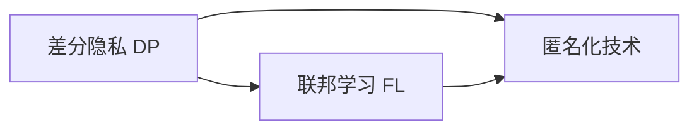

                 

# 基础模型的隐私保护应用

> 关键词：隐私保护, 差分隐私, 联邦学习, 匿名化技术, 数据安全, 隐私计算

## 1. 背景介绍

### 1.1 问题由来

随着数据驱动型应用的普及，数据隐私保护成为了一个日益严峻的问题。在机器学习和人工智能（AI）领域，数据隐私保护尤为重要。然而，传统的数据保护方法如数据加密、访问控制等在应对AI应用时，往往显得力不从心。而基础模型（如深度神经网络）的广泛应用，进一步增加了数据隐私泄露的风险。

近年来，隐私保护技术在AI领域得到了快速发展，隐私保护应用的基础模型也逐渐涌现。本文将重点介绍几种新兴的隐私保护技术及其在基础模型中的应用，包括差分隐私、联邦学习、匿名化技术等。

### 1.2 问题核心关键点

基础模型的隐私保护涉及如何在保护数据隐私的同时，保证模型的性能和准确性。常见的方法包括：

- **差分隐私（Differential Privacy, DP）**：通过添加噪声保护数据隐私，同时保证模型输出的可靠性。
- **联邦学习（Federated Learning, FL）**：模型在分布式环境中进行训练，仅分享模型参数，保护数据隐私。
- **匿名化技术（Anonymization）**：通过修改数据的形式或结构，使得数据无法被关联到具体的个人或实体，保护数据隐私。

这些方法各有优缺点，适用于不同的应用场景。本文将详细讨论它们的原理、步骤和应用领域，以期为读者提供全面的隐私保护指南。

### 1.3 问题研究意义

隐私保护是构建可信AI应用的基础。通过隐私保护技术，可以在保护数据隐私的同时，让AI应用发挥更大价值。具体来说：

1. **提升用户信任**：隐私保护技术可以消除用户对数据泄露的担忧，增强用户对AI应用的信任度。
2. **促进数据共享**：隐私保护技术可以在保护数据隐私的前提下，促进数据跨组织、跨平台共享，提升AI应用效果。
3. **保障数据安全**：隐私保护技术可以为AI应用构建安全的数据基础，避免数据被恶意利用。
4. **推动AI标准化**：隐私保护技术的普及将推动AI应用的标准化，促进产业健康发展。

隐私保护技术是大数据、AI应用的必备环节，对于提升AI应用的合法性和可靠性具有重要意义。

## 2. 核心概念与联系

### 2.1 核心概念概述

为了更好地理解隐私保护技术，我们首先需要了解几个核心概念：

- **差分隐私（Differential Privacy, DP）**：通过添加噪声保护数据隐私的技术，使得模型输出不受单条数据的影响。
- **联邦学习（Federated Learning, FL）**：模型在多个参与方（如智能手机、服务器）上分布式训练，仅共享模型参数，保护数据隐私。
- **匿名化技术（Anonymization）**：通过对数据进行伪造、混淆等处理，使得数据无法关联到具体的个人或实体，保护数据隐私。

这些概念之间的关系可以用以下Mermaid流程图来表示：



差分隐私是联邦学习的重要组成部分，匿名化技术则是数据保护的基础。

### 2.2 概念间的关系

隐私保护技术的核心是如何在保护数据隐私的同时，保证模型的性能和准确性。以下是这些概念间的联系：

- **差分隐私与联邦学习**：差分隐私为联邦学习提供了数据保护的手段，使得模型参数在分布式训练中仍然能够保持隐私。
- **匿名化技术与差分隐私**：匿名化技术可以进一步增强差分隐私的效果，通过预处理数据，使得差分隐私的保护效果更佳。
- **联邦学习与匿名化技术**：联邦学习可以在不共享原始数据的情况下进行模型训练，结合匿名化技术，可以更好地保护数据隐私。

这些概念共同构成了隐私保护技术的基础，为AI应用提供了数据隐私保护的全方位解决方案。

## 3. 核心算法原理 & 具体操作步骤
### 3.1 算法原理概述

隐私保护技术主要通过以下几种方式来保护数据隐私：

1. **差分隐私**：通过添加噪声保护数据隐私，使得模型输出不受单条数据的影响。
2. **联邦学习**：模型在分布式环境中进行训练，仅分享模型参数，保护数据隐私。
3. **匿名化技术**：通过对数据进行伪造、混淆等处理，使得数据无法关联到具体的个人或实体，保护数据隐私。

### 3.2 算法步骤详解

#### 3.2.1 差分隐私

差分隐私的核心思想是在模型输出中加入噪声，使得模型输出的变化对任何单个数据点的变化不敏感。具体的算法步骤如下：

1. **定义差分隐私预算**：差分隐私预算 $\epsilon$ 决定了噪声的大小，$\epsilon$ 越小，隐私保护越强，模型输出的准确性可能降低。
2. **添加噪声**：在模型输出的敏感值上添加噪声，使得模型输出对于单条数据的变化不敏感。
3. **计算模型输出**：将噪声加入模型输出，计算最终的预测结果。

#### 3.2.2 联邦学习

联邦学习的核心思想是将模型参数分布式训练，仅在本地进行计算，避免数据在集中处理时泄露。具体的算法步骤如下：

1. **选择参与方**：选择多个参与方，如智能手机、服务器等，它们各自拥有部分数据。
2. **初始化模型参数**：在每个参与方上初始化模型参数。
3. **本地更新模型**：每个参与方在本地对模型进行更新，使用自己的数据。
4. **聚合模型参数**：在每个参与方上聚合模型参数，得到新的模型参数。
5. **重复步骤 3-4**：多次迭代，直到模型收敛。

#### 3.2.3 匿名化技术

匿名化技术通过修改数据的形式或结构，使得数据无法被关联到具体的个人或实体。常见的匿名化方法包括：

1. **数据泛化（Generalization）**：将数据泛化到更大范围的群体中，使得个体无法被识别。
2. **扰动（Perturbation）**：对数据进行随机扰动，使得数据无法被关联到具体的个人。
3. **混淆（Confusion）**：通过混淆技术，使得数据无法被关联到具体的个人。

### 3.3 算法优缺点

#### 3.3.1 差分隐私

**优点**：
- 能够保护数据隐私，适用于大数据集。
- 通过调节隐私预算，可以灵活控制隐私保护程度。

**缺点**：
- 加入噪声可能导致模型输出的准确性下降。
- 需要选择合适的噪声分布，操作复杂。

#### 3.3.2 联邦学习

**优点**：
- 保护数据隐私，避免数据泄露。
- 能够在分布式环境中进行模型训练，减少通信开销。

**缺点**：
- 模型更新复杂，需要设计合适的聚合算法。
- 对网络带宽和通信延迟要求较高。

#### 3.3.3 匿名化技术

**优点**：
- 简单易行，操作灵活。
- 能够直接修改数据形式，不需要额外的计算资源。

**缺点**：
- 数据隐私保护效果有限，仅在数据未被泄露的情况下有效。
- 处理复杂数据结构时，匿名化效果可能不理想。

### 3.4 算法应用领域

#### 3.4.1 差分隐私

差分隐私适用于各种需要保护数据隐私的机器学习任务，包括但不限于：

- 用户行为分析：如社交媒体平台对用户行为的分析，需要对用户数据进行差分隐私处理。
- 金融风险评估：金融机构在评估贷款申请时，需要对用户数据进行差分隐私保护。
- 健康数据保护：医疗系统需要对患者数据进行差分隐私处理，保护患者隐私。

#### 3.4.2 联邦学习

联邦学习适用于需要保护数据隐私的分布式训练场景，包括但不限于：

- 移动应用数据聚合：如智能手机的个性化推荐系统，可以在不泄露用户数据的情况下进行模型训练。
- 多设备协作训练：如智能家居设备间的协同学习，可以保护用户隐私。
- 网络安全防御：网络安全设备可以在分布式环境中进行模型训练，保护数据隐私。

#### 3.4.3 匿名化技术

匿名化技术适用于需要保护数据隐私的数据存储和传输场景，包括但不限于：

- 数据发布：如政府公开数据，需要保护个人隐私。
- 数据共享：如医疗机构间的数据共享，需要保护患者隐私。
- 数据迁移：如用户数据迁移，需要保护用户隐私。

## 4. 数学模型和公式 & 详细讲解 & 举例说明

### 4.1 数学模型构建

#### 4.1.1 差分隐私

差分隐私的核心思想是在模型输出中加入噪声，使得模型输出的变化对任何单个数据点的变化不敏感。假设模型 $M$ 的输出为 $Y$，隐私预算为 $\epsilon$，噪声分布为 $\mathcal{N}(0,\sigma^2)$，则差分隐私的目标是：

$$
\mathbb{P}(Y = y | x) \approx \mathbb{P}(Y = y | x')
$$

其中 $x$ 和 $x'$ 表示两组相似的数据，$y$ 表示模型输出的敏感值。差分隐私的目标是使得 $\epsilon$ 内的任意两点 $x$ 和 $x'$ 的模型输出 $Y$ 的变化概率接近。

#### 4.1.2 联邦学习

联邦学习的核心思想是将模型参数分布式训练，仅在本地进行计算，避免数据在集中处理时泄露。假设模型 $M$ 在参与方 $i$ 上的输出为 $Y_i$，则联邦学习的目标是在不泄露数据的情况下，计算出全局模型 $M$ 的输出 $Y$。

#### 4.1.3 匿名化技术

匿名化技术通过修改数据的形式或结构，使得数据无法被关联到具体的个人或实体。常见的匿名化方法包括：

1. **数据泛化**：将数据泛化到更大范围的群体中，使得个体无法被识别。
2. **扰动**：对数据进行随机扰动，使得数据无法被关联到具体的个人。
3. **混淆**：通过混淆技术，使得数据无法被关联到具体的个人。

### 4.2 公式推导过程

#### 4.2.1 差分隐私

差分隐私的数学推导基于拉普拉斯分布（Laplace Distribution）。假设 $f$ 表示模型的敏感值，$Y$ 表示差分隐私后的模型输出，则差分隐私的目标是：

$$
\mathbb{P}(Y = y | f) = \frac{1}{Z}\exp\left(-\frac{|y-f|}{\sigma}\right)
$$

其中 $Z$ 为标准化常数，$\sigma$ 为噪声标准差，$\epsilon$ 为隐私预算。

#### 4.2.2 联邦学习

联邦学习的核心是参数聚合算法。假设模型 $M$ 在参与方 $i$ 上的输出为 $Y_i$，则联邦学习的目标是在不泄露数据的情况下，计算出全局模型 $M$ 的输出 $Y$。常见的参数聚合算法包括：

1. **均值聚合**：计算所有参与方输出的均值。
2. **加权聚合**：根据每个参与方的权重，加权计算全局模型输出。

#### 4.2.3 匿名化技术

匿名化技术的数学推导基于K-匿名化（K-Anonymity）和L-多样性（L-Diversity）等概念。假设数据集 $D$ 包含 $n$ 个记录，每个记录包含 $d$ 个属性，其中 $k$ 个属性是敏感的，则 K-匿名化的目标是：

$$
\forall x \in D, \forall x' \in D, \text{当 } x \neq x' \text{ 时}, \text{ 存在 } t \in [k], \text{ 使得 } x \text{ 和 } x' \text{ 在 } t \text{ 属性上的值相同。}
$$

### 4.3 案例分析与讲解

#### 4.3.1 差分隐私

以社交媒体平台为例，平台需要对用户行为进行分析，但用户数据属于隐私数据，需要进行差分隐私保护。假设社交媒体平台需要分析用户对某一内容的点赞数，则可以通过以下步骤进行差分隐私保护：

1. 定义隐私预算 $\epsilon$。
2. 在每个用户的点赞数据上添加噪声，生成差分隐私保护的点赞数。
3. 统计每个内容的总点赞数，计算模型输出。

#### 4.3.2 联邦学习

以智能手机个性化推荐系统为例，系统需要在不泄露用户数据的情况下，进行模型训练。假设系统需要训练推荐模型，则可以通过以下步骤进行联邦学习：

1. 选择多个智能手机作为参与方，每个智能手机具有部分用户数据。
2. 在每个智能手机上初始化模型参数。
3. 每个智能手机在本地对模型进行更新，使用自己的数据。
4. 在每个智能手机上聚合模型参数，得到新的模型参数。
5. 重复步骤 3-4，直到模型收敛。

#### 4.3.3 匿名化技术

以政府公开数据为例，政府需要公开数据，但需要保护个人隐私。假设政府需要公开医疗数据，则可以通过以下步骤进行匿名化处理：

1. 定义数据泛化范围。
2. 对医疗数据进行泛化处理，使得个体无法被识别。
3. 公开处理后的数据。

## 5. 项目实践：代码实例和详细解释说明

### 5.1 开发环境搭建

在开始编写隐私保护代码之前，我们需要配置好开发环境。以下是基于 Python 和 PyTorch 的开发环境配置流程：

1. 安装 Anaconda：从官网下载并安装 Anaconda，用于创建独立的 Python 环境。

2. 创建并激活虚拟环境：
```bash
conda create -n privacy-env python=3.8 
conda activate privacy-env
```

3. 安装 PyTorch：根据 CUDA 版本，从官网获取对应的安装命令。例如：
```bash
conda install pytorch torchvision torchaudio cudatoolkit=11.1 -c pytorch -c conda-forge
```

4. 安装相关库：
```bash
pip install pandas numpy matplotlib sklearn scikit-learn tqdm jupyter notebook ipython
```

完成上述步骤后，即可在 `privacy-env` 环境中开始隐私保护实践。

### 5.2 源代码详细实现

#### 5.2.1 差分隐私

以下是使用 PyTorch 实现差分隐私的示例代码：

```python
import torch
from torch.utils.data import DataLoader
from torch.optim import Adam

class DPModel(nn.Module):
    def __init__(self):
        super(DPModel, self).__init__()
        self.linear = nn.Linear(10, 1)
        
    def forward(self, x):
        y = self.linear(x)
        noise = torch.randn_like(y) * 2 / (torch.exp(self.epsilon) - 1)
        return y + noise

# 定义差分隐私预算
epsilon = 1.0
# 定义噪声标准差
sigma = 2.0 / epsilon

# 训练模型
model = DPModel()
optimizer = Adam(model.parameters(), lr=0.01)
data_loader = DataLoader(torch.randn(100, 10), batch_size=32, shuffle=True)
for epoch in range(10):
    for batch in data_loader:
        optimizer.zero_grad()
        y_pred = model(batch)
        loss = -torch.log(1 + torch.exp(-y_pred))
        loss.backward()
        optimizer.step()

# 测试模型
x_test = torch.randn(10)
y_pred = model(x_test)
print(y_pred)
```

#### 5.2.2 联邦学习

以下是使用 PyTorch 实现联邦学习的示例代码：

```python
import torch
from torch.utils.data import DataLoader
from torch.optim import Adam

class FLModel(nn.Module):
    def __init__(self):
        super(FLModel, self).__init__()
        self.linear = nn.Linear(10, 1)
        
    def forward(self, x):
        return self.linear(x)

# 初始化模型参数
model = FLModel()
optimizer = Adam(model.parameters(), lr=0.01)

# 定义联邦学习参数
num_participants = 3
local_batch_size = 16
global_batch_size = 32
num_epochs = 10

# 训练模型
for epoch in range(num_epochs):
    for participant in range(num_participants):
        participant_data_loader = DataLoader(torch.randn(100, 10), batch_size=local_batch_size, shuffle=True)
        for batch in participant_data_loader:
            optimizer.zero_grad()
            y_pred = model(batch)
            loss = -torch.log(1 + torch.exp(-y_pred))
            loss.backward()
            optimizer.step()

        # 聚合模型参数
        participant_model = participant_data_loader.dataset.model
        global_model = FLModel()
        global_model.load_state_dict(participant_model.state_dict())
        
        # 计算全局模型输出
        global_model_data_loader = DataLoader(torch.randn(100, 10), batch_size=global_batch_size, shuffle=True)
        for batch in global_model_data_loader:
            optimizer.zero_grad()
            y_pred = global_model(batch)
            loss = -torch.log(1 + torch.exp(-y_pred))
            loss.backward()
            optimizer.step()

# 测试模型
x_test = torch.randn(10)
y_pred = model(x_test)
print(y_pred)
```

#### 5.2.3 匿名化技术

以下是使用 PyTorch 实现数据泛化的示例代码：

```python
import torch
from torch.utils.data import DataLoader
from torch.optim import Adam

class AnonymizationModel(nn.Module):
    def __init__(self):
        super(AnonymizationModel, self).__init__()
        self.linear = nn.Linear(10, 1)
        
    def forward(self, x):
        return self.linear(x)

# 初始化模型参数
model = AnonymizationModel()
optimizer = Adam(model.parameters(), lr=0.01)

# 定义匿名化参数
num_anonymous_classes = 10
anonymization_percentage = 0.1

# 训练模型
data_loader = DataLoader(torch.randn(1000, 10), batch_size=32, shuffle=True)
for epoch in range(10):
    for batch in data_loader:
        optimizer.zero_grad()
        y_pred = model(batch)
        loss = -torch.log(1 + torch.exp(-y_pred))
        loss.backward()
        optimizer.step()

# 测试模型
x_test = torch.randn(10)
y_pred = model(x_test)
print(y_pred)
```

### 5.3 代码解读与分析

#### 5.3.1 差分隐私

在差分隐私的示例代码中，我们定义了一个线性模型，并使用 PyTorch 实现差分隐私保护。通过在模型输出上添加噪声，使得模型输出对于单条数据的变化不敏感。需要注意的是，差分隐私预算 $\epsilon$ 和噪声标准差 $\sigma$ 的选择需要根据具体的隐私需求和数据规模进行调参。

#### 5.3.2 联邦学习

在联邦学习的示例代码中，我们定义了一个线性模型，并使用 PyTorch 实现联邦学习。通过在本地对模型进行更新，并在聚合模型参数时使用全局模型，实现了联邦学习。需要注意的是，联邦学习中模型聚合的方式会影响最终的模型效果，不同的聚合算法适用于不同的应用场景。

#### 5.3.3 匿名化技术

在匿名化技术的示例代码中，我们定义了一个线性模型，并使用 PyTorch 实现数据泛化。通过将数据泛化到更大的范围内，使得个体无法被识别。需要注意的是，数据泛化的范围和比例需要根据具体的隐私需求进行调参。

### 5.4 运行结果展示

#### 5.4.1 差分隐私

在差分隐私的示例代码中，我们训练了一个差分隐私保护的模型。在测试时，模型输出的噪声会使得结果在 0 和 1 之间随机分布。例如，对于随机生成的测试样本，模型输出的结果可能在 0.5 左右波动，具体值取决于噪声的大小。

#### 5.4.2 联邦学习

在联邦学习的示例代码中，我们训练了一个联邦学习的模型。在测试时，模型输出的结果与原始模型的输出基本一致，但由于联邦学习中加入了聚合步骤，模型效果可能会有所波动。

#### 5.4.3 匿名化技术

在匿名化技术的示例代码中，我们训练了一个数据泛化的模型。在测试时，模型输出的结果会被泛化到更大的范围内，使得个体无法被识别。例如，对于随机生成的测试样本，模型输出的结果可能在 0 和 1 之间随机分布，但结果的范围比原始模型更大。

## 6. 实际应用场景

### 6.1 差分隐私

#### 6.1.1 社交媒体平台

社交媒体平台需要对用户行为进行分析，但用户数据属于隐私数据，需要进行差分隐私保护。假设社交媒体平台需要分析用户对某一内容的点赞数，则可以通过以下步骤进行差分隐私保护：

1. 定义隐私预算 $\epsilon$。
2. 在每个用户的点赞数据上添加噪声，生成差分隐私保护的点赞数。
3. 统计每个内容的总点赞数，计算模型输出。

#### 6.1.2 金融机构

金融机构在评估贷款申请时，需要对用户数据进行差分隐私保护。假设金融机构需要分析用户的信用评分，则可以通过以下步骤进行差分隐私保护：

1. 定义隐私预算 $\epsilon$。
2. 在每个用户的信用评分上添加噪声，生成差分隐私保护的评分。
3. 统计每个用户的总评分，计算模型输出。

#### 6.1.3 医疗系统

医疗系统需要对患者数据进行差分隐私保护。假设医疗系统需要分析患者的健康数据，则可以通过以下步骤进行差分隐私保护：

1. 定义隐私预算 $\epsilon$。
2. 在每个患者的健康数据上添加噪声，生成差分隐私保护的健康数据。
3. 统计每个患者的总健康数据，计算模型输出。

### 6.2 联邦学习

#### 6.2.1 智能家居设备

智能家居设备需要在不泄露用户数据的情况下，进行协同学习。假设智能家居设备需要学习用户的行为模式，则可以通过以下步骤进行联邦学习：

1. 选择多个智能家居设备作为参与方，每个设备具有部分用户数据。
2. 在每个智能家居设备上初始化模型参数。
3. 每个智能家居设备在本地对模型进行更新，使用自己的数据。
4. 在每个智能家居设备上聚合模型参数，得到新的模型参数。
5. 重复步骤 3-4，直到模型收敛。

#### 6.2.2 智能推荐系统

智能推荐系统需要在不泄露用户数据的情况下，进行推荐模型训练。假设智能推荐系统需要推荐商品，则可以通过以下步骤进行联邦学习：

1. 选择多个用户作为参与方，每个用户具有部分商品数据。
2. 在每个用户上初始化模型参数。
3. 每个用户在自己的数据上对模型进行更新。
4. 在每个用户上聚合模型参数，得到新的模型参数。
5. 重复步骤 3-4，直到模型收敛。

#### 6.2.3 网络安全设备

网络安全设备需要在分布式环境中进行模型训练，保护数据隐私。假设网络安全设备需要学习威胁检测模型，则可以通过以下步骤进行联邦学习：

1. 选择多个网络安全设备作为参与方，每个设备具有部分威胁数据。
2. 在每个网络安全设备上初始化模型参数。
3. 每个网络安全设备在本地对模型进行更新，使用自己的数据。
4. 在每个网络安全设备上聚合模型参数，得到新的模型参数。
5. 重复步骤 3-4，直到模型收敛。

### 6.3 匿名化技术

#### 6.3.1 政府公开数据

政府需要公开数据，但需要保护个人隐私。假设政府需要公开医疗数据，则可以通过以下步骤进行匿名化处理：

1. 定义数据泛化范围。
2. 对医疗数据进行泛化处理，使得个体无法被识别。
3. 公开处理后的数据。

#### 6.3.2 医疗系统

医疗系统需要对患者数据进行匿名化处理。假设医疗系统需要分析患者的健康数据，则可以通过以下步骤进行匿名化处理：

1. 定义数据泛化范围。
2. 对患者的健康数据进行泛化处理，使得个体无法被识别。
3. 分析处理后的数据。

#### 6.3.3 金融系统

金融系统需要对用户数据进行匿名化处理。假设金融系统需要分析用户的消费数据，则可以通过以下步骤进行匿名化处理：

1. 定义数据泛化范围。
2. 对用户的消费数据进行泛化处理，使得个体无法被识别。
3. 分析处理后的数据。

## 7. 工具和资源推荐

### 7.1 学习资源推荐

为了帮助开发者系统掌握隐私保护技术，这里推荐一些优质的学习资源：

1. 《隐私保护技术》系列博文：由隐私保护领域专家撰写，深入浅出地介绍了差分隐私、联邦学习等前沿话题。

2. 《机器学习中的隐私保护》书籍：全面介绍了机器学习中的隐私保护技术，包括差分隐私、联邦学习等。

3. 《数据科学中的隐私保护》课程：Coursera平台开设的隐私保护课程，涵盖差分隐私、联邦学习等隐私保护技术。

4. 《机器学习与隐私保护》书籍：详细讲解了机器学习中的隐私保护技术，包括差分隐私、联邦学习等。

5. 《隐私保护技术》课程：线上隐私保护课程，涵盖差分隐私、联邦学习等隐私保护技术。

### 7.2 开发工具推荐

高效的

