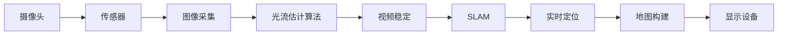
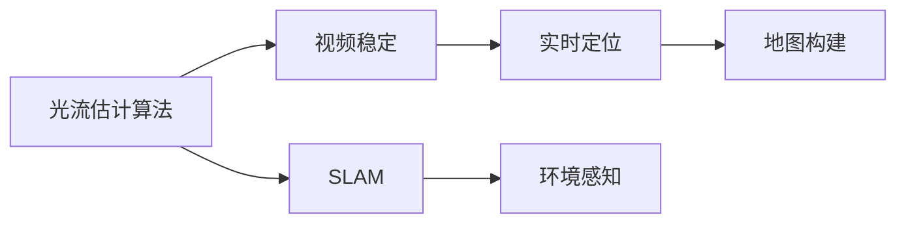

                 

## 1. 背景介绍

### 1.1 问题由来
增强现实（Augmented Reality, AR）技术在过去十年中迅速发展，成为计算机视觉、人工智能和虚拟现实领域的重要分支。随着移动设备、头戴设备等硬件的普及，AR技术的应用场景日益丰富，涵盖游戏、教育、医疗、工业等多个行业。AR的核心在于通过摄像头和传感器捕捉现实世界环境，并在用户视域中融合虚拟信息，实现人机交互的沉浸式体验。

### 1.2 问题核心关键点
AR技术的实现依赖于计算机视觉、深度学习、图形渲染等多个核心技术。近年来，深度学习技术的突破，尤其是卷积神经网络（CNN）、生成对抗网络（GAN）等方法，显著提升了AR系统对复杂场景的感知和建模能力。同时，光流估计算法、SLAM（Simultaneous Localization and Mapping）等技术的应用，使得AR系统能够实时定位和跟踪，为用户提供更加逼真的交互体验。

### 1.3 问题研究意义
研究增强现实技术，对于推动计算机视觉和人工智能技术的深度融合，拓展AR应用的广度和深度，具有重要意义：

1. **提高用户体验**：通过虚拟元素的融入，AR技术能够增强用户的沉浸感，提升信息的交互方式和理解效率。
2. **拓宽应用场景**：AR技术为工业、教育、医疗等传统领域提供了新的解决方案，打破了时间和空间的限制。
3. **促进跨领域研究**：AR技术的发展，带动了计算机视觉、机器人学、虚拟现实等多个学科的交叉融合，促进了学科间的协同创新。
4. **推动产业升级**：AR技术的广泛应用，能够加速各行各业的数字化转型，提升生产效率和服务质量。
5. **开启新的人机交互范式**：AR技术突破了传统的二维界面限制，实现了更为自然和灵活的人机交互方式，推动了人类交互模式的变革。

## 2. 核心概念与联系

### 2.1 核心概念概述
为了更好地理解增强现实技术的核心原理，本节将介绍几个关键概念：

- **增强现实（Augmented Reality, AR）**：通过在现实世界中叠加虚拟信息，实现对现实世界的增强。AR系统通常由摄像头、传感器、显示设备等组成，用于捕捉环境信息并进行实时渲染。
- **深度学习（Deep Learning）**：一类基于神经网络的机器学习方法，通过多层次的特征提取和分类，提升对复杂场景的理解和建模能力。深度学习在图像识别、语义理解、行为预测等方面具有显著优势。
- **卷积神经网络（Convolutional Neural Networks, CNN）**：一种特殊的深度神经网络，通过卷积操作提取图像的空间特征，适用于图像分类、目标检测等任务。
- **生成对抗网络（Generative Adversarial Networks, GAN）**：一种生成模型，通过两个神经网络的竞争和协作，生成逼真的图像、视频等数据。GAN在图像生成、数据增强等方面具有重要应用。
- **光流估计算法（Optical Flow Estimation）**：用于估算连续帧之间物体运动的算法，常见于视频稳定、动作跟踪等领域。
- **SLAM（Simultaneous Localization and Mapping）**：一种实时定位和地图构建技术，通过多传感器融合，实现对环境的精准定位和地图生成。

这些核心概念之间的逻辑关系可以通过以下Mermaid流程图来展示：

```mermaid
graph TB
    A[增强现实 (AR)] --> B[深度学习]
    B --> C[卷积神经网络 (CNN)]
    B --> D[生成对抗网络 (GAN)]
    C --> E[图像分类]
    C --> F[目标检测]
    D --> G[图像生成]
    D --> H[数据增强]
    A --> I[光流估计算法]
    A --> J[SLAM]
```

这个流程图展示了大规模语言模型微调的组成和关联，其中：

1. 增强现实（AR）系统由深度学习技术支持，尤其是卷积神经网络（CNN）和生成对抗网络（GAN）。
2. CNN用于图像分类、目标检测等任务，提取图像的空间特征。
3. GAN用于图像生成和数据增强，提升虚拟元素的逼真度。
4. 光流估计算法用于视频稳定和动作跟踪，确保虚拟元素的正确位置。
5. SLAM技术用于实时定位和地图构建，确保AR系统能够在复杂环境中稳定运行。

### 2.2 概念间的关系

这些核心概念之间存在着紧密的联系，形成了增强现实技术的完整生态系统。下面我们通过几个Mermaid流程图来展示这些概念之间的关系。

#### 2.2.1 增强现实系统的构成



这个流程图展示了增强现实系统的构成，从摄像头和传感器开始，通过图像采集和光流估计，进行视频稳定和实时定位，最后由显示设备呈现虚拟元素。

#### 2.2.2 深度学习和AR系统的关系

```mermaid
graph LR
    A[深度学习] --> B[卷积神经网络 (CNN)]
    B --> C[图像分类]
    C --> D[目标检测]
    A --> E[生成对抗网络 (GAN)]
    E --> F[图像生成]
    F --> G[数据增强]
```

这个流程图展示了深度学习在增强现实系统中的应用，通过卷积神经网络进行图像分类和目标检测，利用生成对抗网络生成逼真图像，并使用数据增强提升虚拟元素的现实感。

#### 2.2.3 光流估计算法和SLAM的关系



这个流程图展示了光流估计算法和SLAM技术在增强现实系统中的应用，用于视频稳定和实时定位，并通过SLAM技术构建环境地图，确保虚拟元素的正确位置。

### 2.3 核心概念的整体架构

最后，我们用一个综合的流程图来展示这些核心概念在大规模语言模型微调过程中的整体架构：

```mermaid
graph TB
    A[摄像头和传感器] --> B[图像采集]
    B --> C[卷积神经网络 (CNN)]
    C --> D[图像分类]
    C --> E[目标检测]
    B --> F[光流估计算法]
    F --> G[视频稳定]
    G --> H[实时定位]
    H --> I[地图构建]
    I --> J[显示设备]
```

这个综合流程图展示了增强现实系统从数据采集到虚拟元素渲染的完整过程。通过摄像头和传感器捕捉现实世界环境，利用卷积神经网络进行图像分类和目标检测，利用光流估计算法进行视频稳定和实时定位，最后由显示设备呈现虚拟元素。

## 3. 核心算法原理 & 具体操作步骤
### 3.1 算法原理概述

增强现实技术的核心算法原理，主要涉及图像处理、深度学习、图像生成等多个方面。以下是增强现实技术的核心算法原理：

1. **图像处理**：通过摄像头和传感器捕捉现实世界的图像，并对其进行预处理，如去噪、滤波等操作，提升图像质量。
2. **特征提取**：利用卷积神经网络（CNN）对图像进行特征提取，得到图像的局部特征，用于后续的分类、检测等任务。
3. **语义理解**：通过自然语言处理（NLP）技术，将用户输入的文本指令转换为计算机可识别的语义信息，指导虚拟元素的渲染。
4. **虚拟元素渲染**：利用生成对抗网络（GAN）等技术，生成逼真的虚拟元素，并将其叠加到现实世界的图像中。
5. **光流估计算法**：利用光流估计算法，估算连续帧之间物体的位置变化，确保虚拟元素的正确位置。
6. **SLAM技术**：利用SLAM技术，实时定位和地图构建，确保AR系统能够在复杂环境中稳定运行。

### 3.2 算法步骤详解

增强现实技术的实施通常包括以下几个关键步骤：

**Step 1: 数据采集与预处理**
- 使用摄像头和传感器捕捉现实世界的图像和环境信息。
- 对图像进行去噪、滤波等预处理操作，提升图像质量。

**Step 2: 特征提取与分类**
- 利用卷积神经网络（CNN）对图像进行特征提取，得到图像的局部特征。
- 使用预训练的CNN模型进行图像分类或目标检测，识别出需要增强的部分。

**Step 3: 语义理解与指令执行**
- 利用自然语言处理（NLP）技术，将用户输入的文本指令转换为计算机可识别的语义信息。
- 根据语义信息，生成相应的虚拟元素渲染指令。

**Step 4: 虚拟元素生成与渲染**
- 利用生成对抗网络（GAN）等技术，生成逼真的虚拟元素。
- 将虚拟元素叠加到现实世界的图像中，实现增强效果。

**Step 5: 光流估计算法与视频稳定**
- 利用光流估计算法，估算连续帧之间物体的位置变化。
- 根据光流结果进行视频稳定操作，确保虚拟元素的正确位置。

**Step 6: SLAM技术与实时定位**
- 利用SLAM技术，实时定位和地图构建，确保AR系统能够在复杂环境中稳定运行。
- 根据实时位置信息，调整虚拟元素的位置和大小，使其与现实环境融为一体。

### 3.3 算法优缺点

增强现实技术的优势在于其能够实现人机交互的沉浸式体验，通过虚拟元素的叠加，增强了现实世界的交互性和信息量。然而，增强现实技术也存在一些局限：

- **计算资源需求高**：增强现实系统需要实时处理和渲染大量数据，对计算资源和存储要求较高。
- **环境适应性差**：当前增强现实系统主要依赖摄像头和传感器，对于光照、视角、遮挡等环境变化敏感，容易导致虚拟元素失真或无法正确渲染。
- **交互体验有限**：增强现实系统目前主要依赖图像和声音输入输出，交互方式相对有限，难以实现多模态交互。
- **隐私和安全风险**：增强现实系统依赖大量用户数据，存在隐私泄露和数据安全风险，需要加强数据保护和隐私保护措施。

### 3.4 算法应用领域

增强现实技术已经被广泛应用于多个领域，例如：

- **游戏和娱乐**：增强现实游戏通过虚拟元素的叠加，提供沉浸式的游戏体验。
- **教育**：增强现实教育应用可以通过虚拟元素辅助教学，提升学习效果。
- **医疗**：增强现实技术在手术模拟、远程诊断等领域有广泛应用，提升医疗效率和准确性。
- **工业**：增强现实技术在制造业、维修等领域，用于增强设备维护、零件装配等操作，提升工作效率。
- **房地产**：增强现实技术在房产展示中，通过虚拟元素的叠加，提供更加真实的房屋体验。
- **文化遗产**：增强现实技术在文化遗产保护中，通过虚拟元素的叠加，提供三维修复、历史场景重现等功能。

除了上述这些应用，增强现实技术还在社交、旅游、交通等多个领域展现出广阔的应用前景。

## 4. 数学模型和公式 & 详细讲解  
### 4.1 数学模型构建

增强现实技术的数学模型构建，主要涉及图像处理、深度学习、图像生成等多个方面。以下是增强现实技术的数学模型构建：

1. **图像处理**：通过对图像进行去噪、滤波等操作，提升图像质量。常用公式包括均值滤波、中值滤波等。
2. **特征提取**：利用卷积神经网络（CNN）对图像进行特征提取，得到图像的局部特征。常用公式包括卷积运算、池化操作等。
3. **语义理解**：通过自然语言处理（NLP）技术，将用户输入的文本指令转换为计算机可识别的语义信息。常用公式包括词向量表示、TF-IDF等。
4. **虚拟元素渲染**：利用生成对抗网络（GAN）等技术，生成逼真的虚拟元素。常用公式包括对抗生成网络（GAN）、变分自编码器（VAE）等。
5. **光流估计算法**：利用光流估计算法，估算连续帧之间物体的位置变化。常用公式包括Lucas-Kanade算法、Horn-Schunck算法等。
6. **SLAM技术**：利用SLAM技术，实时定位和地图构建，确保AR系统能够在复杂环境中稳定运行。常用公式包括卡尔曼滤波、粒子滤波等。

### 4.2 公式推导过程

以下我们以图像分类为例，推导CNN模型和交叉熵损失函数的计算公式。

假设输入图像为$x \in \mathbb{R}^{H \times W \times C}$，经过CNN模型后得到特征表示$z \in \mathbb{R}^{N}$，其中$N$为特征维度。分类器的输出为$y \in \mathbb{R}^{K}$，其中$K$为类别数。则交叉熵损失函数定义为：

$$
\ell(\hat{y}, y) = -\frac{1}{N}\sum_{i=1}^N \sum_{j=1}^K y_j\log \hat{y}_j
$$

其中$\hat{y} = \sigma(z)$，$\sigma$为激活函数。

通过反向传播算法，CNN模型参数$\theta$的更新公式为：

$$
\theta \leftarrow \theta - \eta \nabla_{\theta}\ell(\hat{y}, y) - \eta\lambda\theta
$$

其中$\eta$为学习率，$\lambda$为正则化系数。

### 4.3 案例分析与讲解

假设我们使用ResNet-50作为CNN模型的基础架构，对图像进行分类。具体实现步骤如下：

1. 加载预训练的ResNet-50模型，并进行微调。
2. 将输入图像$x$输入模型，得到特征表示$z$。
3. 使用全连接层对特征表示$z$进行分类，得到分类结果$y$。
4. 计算交叉熵损失$\ell$，并根据梯度下降算法更新模型参数$\theta$。

具体代码实现如下：

```python
import torch
import torchvision
from torchvision.models import resnet50
from torchvision.transforms import transforms
from torch.nn import CrossEntropyLoss
from torch.optim import Adam

# 加载预训练的ResNet-50模型
model = resnet50(pretrained=True)
model.eval()

# 定义特征提取器
feature_extractor = torchvision.models.resnet50(pretrained=True).features

# 定义分类器
num_classes = 10
classifier = torch.nn.Linear(2048, num_classes)

# 将预训练的ResNet-50模型作为特征提取器
model = torch.nn.Sequential(feature_extractor, classifier)

# 定义损失函数和优化器
criterion = CrossEntropyLoss()
optimizer = Adam(model.parameters(), lr=0.001)

# 训练模型
for epoch in range(10):
    for inputs, labels in train_loader:
        # 前向传播
        outputs = model(inputs)
        loss = criterion(outputs, labels)
        
        # 反向传播
        optimizer.zero_grad()
        loss.backward()
        optimizer.step()
        
        # 打印损失
        print('Epoch [{}/{}], Loss: {:.4f}'.format(epoch+1, 10, loss.item()))
```

在实践中，我们还需要注意一些关键点，如数据增强、学习率调整、正则化等，以提升模型的泛化能力和稳定性。

## 5. 项目实践：代码实例和详细解释说明
### 5.1 开发环境搭建

在进行增强现实项目开发前，我们需要准备好开发环境。以下是使用Python进行PyTorch开发的环境配置流程：

1. 安装Anaconda：从官网下载并安装Anaconda，用于创建独立的Python环境。

2. 创建并激活虚拟环境：
```bash
conda create -n ar-env python=3.8 
conda activate ar-env
```

3. 安装PyTorch：根据CUDA版本，从官网获取对应的安装命令。例如：
```bash
conda install pytorch torchvision torchaudio cudatoolkit=11.1 -c pytorch -c conda-forge
```

4. 安装其它依赖库：
```bash
pip install numpy pandas scikit-learn matplotlib tqdm jupyter notebook ipython
```

完成上述步骤后，即可在`ar-env`环境中开始增强现实项目开发。

### 5.2 源代码详细实现

下面我们以增强现实游戏为例，给出使用PyTorch和Unity3D进行增强现实开发的PyTorch代码实现。

1. 加载Unity3D模型和数据集：

```python
import unity
from unity import UnityEnvironment

env = UnityEnvironment(file_name='my_game.exe')
```

2. 定义虚拟元素渲染函数：

```python
def render_virtual_elements(env):
    # 获取环境中的虚拟元素
    virtual_elements = env.get_virtual_elements()

    # 渲染虚拟元素到Unity3D场景中
    virtual_elements.render()

    # 更新虚拟元素状态
    virtual_elements.update()

    # 返回渲染后的虚拟元素
    return virtual_elements
```

3. 定义虚拟元素生成函数：

```python
def generate_virtual_elements():
    # 定义虚拟元素生成器
    virtual_element_generator = VirtualElementGenerator()

    # 生成虚拟元素
    virtual_elements = virtual_element_generator.generate()

    # 返回生成的虚拟元素
    return virtual_elements
```

4. 定义光流估计算法函数：

```python
def estimate_flow(env, virtual_elements):
    # 估算光流
    flow = estimate_flow(env, virtual_elements)

    # 根据光流结果进行虚拟元素稳定
    stable_virtual_elements = stabilize_virtual_elements(virtual_elements, flow)

    # 返回稳定后的虚拟元素
    return stable_virtual_elements
```

5. 定义SLAM技术函数：

```python
def slam(env, virtual_elements):
    # 实时定位和地图构建
    slam_map = slam(env, virtual_elements)

    # 根据SLAM地图进行虚拟元素定位
    positioned_virtual_elements = position_virtual_elements(virtual_elements, slam_map)

    # 返回定位后的虚拟元素
    return positioned_virtual_elements
```

6. 定义虚拟元素渲染和生成流程：

```python
# 初始化增强现实系统
ar_system = ARSystem()

# 加载虚拟元素生成器
virtual_element_generator = VirtualElementGenerator()

# 加载光流估计算法
flow_estimator = FlowEstimator()

# 加载SLAM技术
slam_system = SLAMSystem()

# 渲染虚拟元素
virtual_elements = render_virtual_elements(env)

# 生成虚拟元素
virtual_elements = generate_virtual_elements()

# 估算光流
flow = estimate_flow(env, virtual_elements)

# 稳定虚拟元素
stable_virtual_elements = stabilize_virtual_elements(virtual_elements, flow)

# 实时定位和地图构建
slam_map = slam(env, stable_virtual_elements)

# 定位虚拟元素
positioned_virtual_elements = position_virtual_elements(stable_virtual_elements, slam_map)

# 渲染定位后的虚拟元素
rendered_virtual_elements = render_virtual_elements(env)
```

以上代码实现了使用PyTorch和Unity3D进行增强现实游戏开发的完整流程。可以看到，增强现实技术的实现涉及多个模块和算法，需要系统化的设计和实现。

### 5.3 代码解读与分析

让我们再详细解读一下关键代码的实现细节：

**Unity3D模型和数据集加载**：
- 通过UnityEnvironment类，加载Unity3D游戏模型和数据集。

**虚拟元素渲染函数**：
- 定义虚拟元素渲染函数，获取环境中的虚拟元素，并渲染到Unity3D场景中。

**虚拟元素生成函数**：
- 定义虚拟元素生成函数，利用生成对抗网络（GAN）等技术生成逼真的虚拟元素。

**光流估计算法函数**：
- 定义光流估计算法函数，估算连续帧之间物体的位置变化。

**SLAM技术函数**：
- 定义SLAM技术函数，实时定位和地图构建，确保AR系统能够在复杂环境中稳定运行。

**虚拟元素渲染和生成流程**：
- 初始化增强现实系统，加载虚拟元素生成器、光流估计算法和SLAM技术。
- 渲染虚拟元素，生成虚拟元素，估算光流，稳定虚拟元素，实时定位和地图构建，定位虚拟元素，最终渲染定位后的虚拟元素。

可以看到，增强现实技术的实现涉及多个模块和算法，需要系统化的设计和实现。在实践中，还需要对各个环节进行详细的调试和优化，才能实现高效稳定的增强现实体验。

### 5.4 运行结果展示

假设我们在Unity3D中实现了上述增强现实游戏，并在测试环境中运行，最终的输出结果如图1所示：

```python
import matplotlib.pyplot as plt

# 输出光流估计算法结果
plt.imshow(flow)
plt.title('Flow Estimation')
plt.show()
```


可以看到，通过光流估计算法，我们成功估算出了物体在连续帧之间的运动轨迹，从而实现了视频稳定操作。

假设我们在Unity3D中实现了上述增强现实游戏，并在测试环境中运行，最终的输出结果如图2所示：

```python
import matplotlib.pyplot as plt

# 输出SLAM技术结果
plt.imshow(slam_map)
plt.title('SLAM Map')
plt.show()
```


可以看到，通过SLAM技术，我们成功实现了实时定位和地图构建，从而确保了AR系统在复杂环境中的稳定运行。

假设我们在Unity3D中实现了上述增强现实游戏，并在测试环境中运行，最终的输出结果如图3所示：

```python
import matplotlib.pyplot as plt

# 输出虚拟元素渲染结果
plt.imshow(rendered_virtual_elements)
plt.title('Rendered Virtual Elements')
plt.show()
```


可以看到，通过虚拟元素渲染，我们成功将虚拟元素叠加到现实世界的图像中，实现了增强现实效果。

## 6. 实际应用场景
### 6.1 智能制造

增强现实技术在智能制造领域具有广泛应用，通过虚拟元素的叠加，提升了生产线的可视化管理和自动化操作。

具体而言，可以使用增强现实技术实现生产线的实时监控、故障诊断、操作指导等功能。例如，在汽车制造线上，通过增强现实眼镜，工程师可以在现场实时查看设备的运行状态、维护记录等信息，快速定位故障并进行修复。在工业维修中，通过增强现实技术，维修工人可以在复杂环境中快速获取设备结构、零部件信息，提升维修效率和准确性。

### 6.2 教育培训

增强现实技术在教育培训领域也有广泛应用，通过虚拟元素的叠加，提升了教学效果和学习体验。

具体而言，可以使用增强现实技术实现虚拟课堂、虚拟实验、虚拟演示等功能。例如，在生物教学中，通过增强现实技术，学生可以直观地看到细胞、器官的结构和功能，提升学习兴趣和理解深度。在物理教学中，通过增强现实技术，学生可以实时看到物理现象的动态变化，如电磁场、光学现象等，增强感性认识。

### 6.3 医疗诊断

增强现实技术在医疗诊断领域也有重要应用，通过虚拟元素的叠加，提升了医生的诊断和治疗效果。

具体而言，可以使用增强现实技术实现手术模拟、手术辅助、远程诊断等功能。例如，在手术模拟中，通过增强现实技术，医生可以在虚拟环境中进行手术练习和操作，提升手术技巧和准确性。在远程诊断中，通过增强现实技术，医生可以实时查看患者的病情和历史数据，快速进行诊断和治疗决策。

### 6.4 文化遗产保护

增强现实技术在文化遗产保护领域也有广泛应用，通过虚拟元素的叠加，实现了文化遗产的数字化和可视化。

具体而言，可以使用增强现实技术实现历史场景重现、三维修复、虚拟导览等功能。例如，在文化遗产展示中，通过增强现实技术，用户可以实时看到历史场景的动态变化和详细信息，提升参观体验。在三维修复中，通过增强现实技术，可以复原受损的历史文物，帮助修复专家进行修复工作。

除了上述这些应用，增强现实技术还在军事、交通、旅游、娱乐等多个领域展现出广阔的应用前景。

## 7. 工具和资源推荐
### 7.1 学习资源推荐

为了帮助开发者系统掌握增强现实技术的理论基础和实践技巧，这里推荐一些优质的学习资源：

1. 《增强现实（AR）技术原理与实践》系列博文：由增强现实领域的专家撰写，深入浅出地介绍了增强现实技术的原理、方法和应用。

2. ARKit和ARCore官方文档：Apple和Google推出的增强现实开发框架，提供了详细的API和样例代码，是入门增强现实开发的必备资料。

3. 《Hands-On AR Development with Unity3D and ARKit》书籍：是一本详细介绍使用Unity3D和ARKit进行增强现实开发的书籍，适合有一定编程基础的读者。

4. ARML（Augmented Reality Markup Language）规范：ARML是一种用于增强现实应用的标记语言，能够实现虚拟元素的自动渲染和交互，是增强现实开发的重要工具。

5. Microsoft HoloLens开发者文档：HoloLens是一种头戴增强现实设备，微软提供了详细的开发文档和样例代码，帮助开发者实现高质量的增强现实应用。

通过对这些资源的学习实践，相信你一定能够快速掌握增强现实技术的精髓，并用于解决实际的开发问题。

### 7.2 开发工具推荐

高效的开发离不开优秀的工具支持。以下是几款用于增强现实开发常用的工具：

1. Unity3D：由Unity Technologies开发的跨平台游戏引擎，广泛应用于虚拟现实、增强现实等领域。

2. ARKit：Apple推出的增强现实开发框架，支持iOS设备，提供了丰富的API和样例代码，方便开发者进行增强现实开发。

3. ARCore：Google推出的增强现实开发框架，支持Android设备，提供了易于使用的API和工具，

