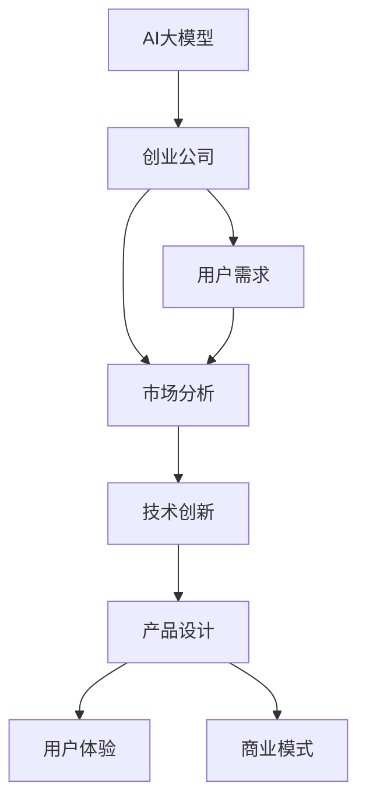
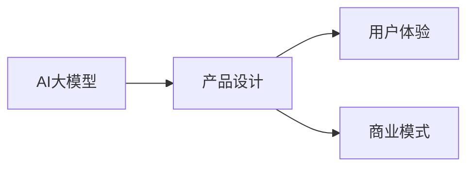
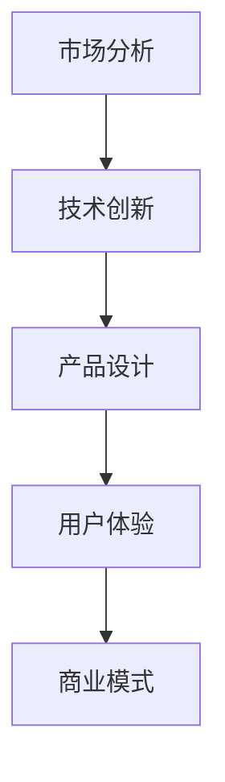

                 

# AI大模型创业：如何应对未来用户需求？

> 关键词：AI大模型,创业,用户需求,市场分析,技术创新,产品设计,用户体验,商业模式

## 1. 背景介绍

### 1.1 问题由来

随着人工智能技术的迅猛发展，AI大模型（如GPT-3、BERT等）已经成为推动科技和产业创新的重要引擎。大模型凭借其强大的学习和适应能力，在自然语言处理（NLP）、计算机视觉、语音识别等领域取得了一系列突破性成果。这些大模型不仅能够处理海量数据，还能不断从新的数据中学习并提升性能，展现出卓越的通用性和适应性。

AI大模型的崛起，催生了大量基于大模型的创业公司，旨在提供更高效、更智能的AI解决方案。这些公司通过技术创新和商业模式创新，在医疗、金融、教育、电商等多个领域取得了显著成效。然而，AI大模型创业并非一帆风顺，企业在追求技术领先的同时，也面临着用户需求多变、市场竞争激烈、技术复杂度高、商业模式不确定等多重挑战。

### 1.2 问题核心关键点

AI大模型创业的核心在于如何平衡技术创新和市场需求，实现业务的可持续发展。关键点包括：

- **技术领先**：不断研发和优化大模型，保持技术优势。
- **用户需求**：准确把握用户需求，提供差异化服务。
- **市场竞争力**：通过差异化策略和商业模式创新，在竞争中脱颖而出。
- **成本控制**：在追求技术领先的同时，控制成本，实现盈利。
- **伦理和安全**：确保模型的使用安全，遵守法律法规，避免伦理风险。

### 1.3 问题研究意义

研究AI大模型创业的策略和方法，对于促进AI技术的商业化应用、推动产业创新具有重要意义：

1. **加速技术落地**：通过市场驱动的创新，加速AI技术在各行业的普及和应用。
2. **提升竞争力**：帮助企业克服技术复杂性和市场竞争压力，提升市场份额。
3. **创造价值**：利用大模型技术，创造新的商业模式和市场机会，提升企业价值。
4. **促进发展**：推动AI产业的发展，吸引更多资金和人才投入，实现可持续发展。

## 2. 核心概念与联系

### 2.1 核心概念概述

为更好地理解AI大模型创业的方法和策略，本节将介绍几个关键概念及其联系：

- **AI大模型**：指通过大规模数据训练得到的具备通用语言理解、生成和推理能力的机器学习模型，如GPT-3、BERT等。
- **创业公司**：指基于AI大模型技术，成立的新兴企业，致力于提供AI解决方案，如NLP、计算机视觉、语音识别等。
- **用户需求**：指AI大模型产品或服务需满足的用户需求，包括但不限于信息检索、自然语言交互、数据分析等。
- **市场分析**：指对目标市场进行调查和分析，了解市场需求、竞争态势、用户行为等。
- **技术创新**：指在AI大模型基础上的算法、架构、应用等创新，提升模型性能和业务价值。
- **产品设计**：指基于用户需求和技术创新的产品设计，包括界面设计、功能实现等。
- **用户体验**：指用户在使用AI大模型产品或服务时的感受和满意度，包括易用性、响应速度、内容质量等。
- **商业模式**：指AI大模型的商业运作模式，包括定价策略、盈利模式、市场推广等。

这些核心概念之间的联系可以通过以下Mermaid流程图来展示：



这个流程图展示了大模型创业的核心概念及其联系：

1. 大模型作为创业公司的核心技术支撑，通过不断优化和创新，提升产品性能。
2. 用户需求驱动产品设计和优化，确保产品符合市场需求。
3. 市场分析帮助创业公司把握市场机会，了解竞争态势，制定合理策略。
4. 技术创新是提升产品竞争力的关键，推动产品迭代和升级。
5. 用户体验是创业公司产品成功的关键指标，直接影响用户满意度和忠诚度。
6. 商业模式是创业公司运营的基础，影响盈利能力和市场推广策略。

### 2.2 概念间的关系

这些核心概念之间存在着紧密的联系，形成了AI大模型创业的完整生态系统。下面我们通过几个Mermaid流程图来展示这些概念之间的关系。

#### 2.2.1 大模型与产品设计的关系



这个流程图展示了大模型在产品设计中的作用，以及产品设计对用户体验和商业模式的影响。

#### 2.2.2 市场分析与技术创新的关系



这个流程图展示了市场分析对技术创新的指导作用，以及技术创新对产品设计和用户体验的提升。

#### 2.2.3 用户体验与商业模式的关系


这个流程图展示了用户体验对产品设计的直接影响，以及产品设计对商业模式的促进作用。

## 3. 核心算法原理 & 具体操作步骤
### 3.1 算法原理概述

AI大模型创业的技术核心在于如何利用大模型的强大能力，为用户提供高效、智能的AI解决方案。以下是一些核心算法原理：

- **自监督学习**：在大规模无标签数据上预训练模型，学习通用的语言表示和特征。
- **迁移学习**：将在大规模数据上预训练的模型迁移到特定任务上，进行微调以适应新任务。
- **参数高效微调**：通过冻结大部分预训练参数，仅更新少量参数，减小过拟合风险。
- **少样本学习和零样本学习**：利用大模型的先验知识，通过极少量标注数据或任务描述进行预测。
- **持续学习**：模型能够持续从新数据中学习，避免过时和遗忘，保持最佳性能。

### 3.2 算法步骤详解

AI大模型创业的具体操作流程如下：

**Step 1: 收集和处理数据**
- 收集目标任务相关的标注数据，并进行清洗、归一化等预处理。
- 准备测试数据集，用于评估模型性能。

**Step 2: 选择和加载大模型**
- 选择适合目标任务的大模型，如BERT、GPT等。
- 加载模型到本地或云端计算环境，准备微调。

**Step 3: 微调模型**
- 在标注数据集上训练模型，调整模型参数，以适应特定任务。
- 使用正则化技术（如L2正则、Dropout等），防止过拟合。
- 采用梯度下降等优化算法，最小化损失函数。

**Step 4: 评估和验证**
- 在测试数据集上评估模型性能，计算各项指标（如精度、召回率、F1分数等）。
- 根据评估结果调整模型参数和训练策略，优化模型性能。

**Step 5: 产品化部署**
- 将优化后的模型封装成API或SDK，提供给用户使用。
- 设计用户界面和文档，提供简单易用的API接口。

**Step 6: 市场推广和用户反馈**
- 通过市场推广活动，吸引用户使用。
- 收集用户反馈，持续改进产品。

### 3.3 算法优缺点

AI大模型创业的算法有以下优缺点：

**优点**：
- **高效**：通过微调，可以在极少量标注数据上快速提升模型性能。
- **可扩展**：大模型可以扩展到不同的业务场景，提供通用解决方案。
- **创新**：大模型提供的新技术和新方法，能够不断推动业务创新。

**缺点**：
- **复杂度高**：大模型训练和微调需要大量计算资源和时间。
- **数据需求大**：标注数据需求量大，获取成本高。
- **伦理风险**：模型可能学习到有害信息和偏见，影响用户体验。

### 3.4 算法应用领域

AI大模型创业的算法在多个领域得到广泛应用，例如：

- **自然语言处理**：如机器翻译、文本分类、情感分析、问答系统等。
- **计算机视觉**：如图像识别、物体检测、人脸识别、图像生成等。
- **语音识别**：如语音转文字、语音合成、语音情感分析等。
- **推荐系统**：如电商推荐、广告推荐、音乐推荐等。
- **金融风控**：如信用评估、风险预测、欺诈检测等。
- **医疗诊断**：如病历分析、症状识别、药物研发等。

这些领域的应用展示了AI大模型创业的巨大潜力和广阔前景。

## 4. 数学模型和公式 & 详细讲解 & 举例说明

### 4.1 数学模型构建

假设我们有一个AI大模型，用于处理自然语言处理（NLP）任务。其数学模型构建过程如下：

设大模型的输入为 $x$，输出为 $y$，模型参数为 $\theta$。

- 在无标签数据上预训练模型，优化损失函数 $L_{pretrain}$。
- 在标注数据上微调模型，优化损失函数 $L_{fine-tune}$。

预训练模型的优化目标为：

$$
\min_{\theta} L_{pretrain}(\theta)
$$

微调模型的优化目标为：

$$
\min_{\theta} L_{fine-tune}(\theta)
$$

其中 $L_{fine-tune}(\theta) = \frac{1}{N} \sum_{i=1}^N \ell(M_{\theta}(x_i),y_i)$，其中 $\ell$ 为交叉熵损失函数。

### 4.2 公式推导过程

以下我们以文本分类任务为例，推导交叉熵损失函数及其梯度的计算公式。

假设模型 $M_{\theta}$ 在输入 $x$ 上的输出为 $\hat{y}=M_{\theta}(x) \in [0,1]$，表示样本属于正类的概率。真实标签 $y \in \{0,1\}$。则二分类交叉熵损失函数定义为：

$$
\ell(M_{\theta}(x),y) = -[y\log \hat{y} + (1-y)\log (1-\hat{y})]
$$

将其代入微调模型的优化目标函数，得：

$$
\min_{\theta} \frac{1}{N} \sum_{i=1}^N \ell(M_{\theta}(x_i),y_i)
$$

根据链式法则，损失函数对参数 $\theta_k$ 的梯度为：

$$
\frac{\partial \ell(M_{\theta}(x_i),y_i)}{\partial \theta_k} = -(\frac{y_i}{M_{\theta}(x_i)}-\frac{1-y_i}{1-M_{\theta}(x_i)}) \frac{\partial M_{\theta}(x_i)}{\partial \theta_k}
$$

其中 $\frac{\partial M_{\theta}(x_i)}{\partial \theta_k}$ 可进一步递归展开，利用自动微分技术完成计算。

### 4.3 案例分析与讲解

假设我们有一个文本分类任务，目标是分类新闻文章的主题。我们使用了BERT模型作为大模型，对其进行了微调。

**数据准备**：
- 收集了1000篇新闻文章，标注了5个主题。
- 对数据进行了预处理，包括分词、编码、截断、填充等操作。

**模型选择和加载**：
- 选择了BERT作为预训练模型。
- 加载模型到本地计算环境。

**微调模型**：
- 将1000篇新闻文章划分为训练集和验证集，训练集用于模型训练，验证集用于模型评估。
- 设计了简单的一层全连接分类器作为任务适配层。
- 使用交叉熵损失函数，优化器为AdamW，学习率为1e-5，训练了10个epoch。

**评估和验证**：
- 在验证集上评估模型性能，计算准确率、召回率和F1分数。
- 根据评估结果，调整模型参数和训练策略。

**产品化部署**：
- 将优化后的模型封装成API，提供给用户使用。
- 设计了简单易用的API接口，用户可以通过API调用模型进行文本分类。

**市场推广和用户反馈**：
- 通过市场推广活动，吸引用户使用。
- 收集用户反馈，持续改进产品。

## 5. 项目实践：代码实例和详细解释说明

### 5.1 开发环境搭建

在进行AI大模型创业实践前，我们需要准备好开发环境。以下是使用Python进行PyTorch开发的环境配置流程：

1. 安装Anaconda：从官网下载并安装Anaconda，用于创建独立的Python环境。

2. 创建并激活虚拟环境：
```bash
conda create -n pytorch-env python=3.8 
conda activate pytorch-env
```

3. 安装PyTorch：根据CUDA版本，从官网获取对应的安装命令。例如：
```bash
conda install pytorch torchvision torchaudio cudatoolkit=11.1 -c pytorch -c conda-forge
```

4. 安装Transformers库：
```bash
pip install transformers
```

5. 安装各类工具包：
```bash
pip install numpy pandas scikit-learn matplotlib tqdm jupyter notebook ipython
```

完成上述步骤后，即可在`pytorch-env`环境中开始创业实践。

### 5.2 源代码详细实现

下面我们以文本分类任务为例，给出使用Transformers库对BERT模型进行微调的PyTorch代码实现。

首先，定义文本分类任务的数据处理函数：

```python
from transformers import BertTokenizer
from torch.utils.data import Dataset
import torch

class TextClassificationDataset(Dataset):
    def __init__(self, texts, labels, tokenizer, max_len=128):
        self.texts = texts
        self.labels = labels
        self.tokenizer = tokenizer
        self.max_len = max_len
        
    def __len__(self):
        return len(self.texts)
    
    def __getitem__(self, item):
        text = self.texts[item]
        label = self.labels[item]
        
        encoding = self.tokenizer(text, return_tensors='pt', max_length=self.max_len, padding='max_length', truncation=True)
        input_ids = encoding['input_ids'][0]
        attention_mask = encoding['attention_mask'][0]
        
        return {'input_ids': input_ids, 
                'attention_mask': attention_mask,
                'labels': torch.tensor(label, dtype=torch.long)}
```

然后，定义模型和优化器：

```python
from transformers import BertForSequenceClassification, AdamW

model = BertForSequenceClassification.from_pretrained('bert-base-cased', num_labels=5)

optimizer = AdamW(model.parameters(), lr=1e-5)
```

接着，定义训练和评估函数：

```python
from torch.utils.data import DataLoader
from tqdm import tqdm
from sklearn.metrics import classification_report

device = torch.device('cuda') if torch.cuda.is_available() else torch.device('cpu')
model.to(device)

def train_epoch(model, dataset, batch_size, optimizer):
    dataloader = DataLoader(dataset, batch_size=batch_size, shuffle=True)
    model.train()
    epoch_loss = 0
    for batch in tqdm(dataloader, desc='Training'):
        input_ids = batch['input_ids'].to(device)
        attention_mask = batch['attention_mask'].to(device)
        labels = batch['labels'].to(device)
        model.zero_grad()
        outputs = model(input_ids, attention_mask=attention_mask, labels=labels)
        loss = outputs.loss
        epoch_loss += loss.item()
        loss.backward()
        optimizer.step()
    return epoch_loss / len(dataloader)

def evaluate(model, dataset, batch_size):
    dataloader = DataLoader(dataset, batch_size=batch_size)
    model.eval()
    preds, labels = [], []
    with torch.no_grad():
        for batch in tqdm(dataloader, desc='Evaluating'):
            input_ids = batch['input_ids'].to(device)
            attention_mask = batch['attention_mask'].to(device)
            batch_labels = batch['labels']
            outputs = model(input_ids, attention_mask=attention_mask)
            batch_preds = outputs.logits.argmax(dim=2).to('cpu').tolist()
            batch_labels = batch_labels.to('cpu').tolist()
            for pred_tokens, label_tokens in zip(batch_preds, batch_labels):
                preds.append(pred_tokens)
                labels.append(label_tokens)
                
    print(classification_report(labels, preds))
```

最后，启动训练流程并在测试集上评估：

```python
epochs = 5
batch_size = 16

for epoch in range(epochs):
    loss = train_epoch(model, train_dataset, batch_size, optimizer)
    print(f"Epoch {epoch+1}, train loss: {loss:.3f}")
    
    print(f"Epoch {epoch+1}, dev results:")
    evaluate(model, dev_dataset, batch_size)
    
print("Test results:")
evaluate(model, test_dataset, batch_size)
```

以上就是使用PyTorch对BERT进行文本分类任务微调的完整代码实现。可以看到，得益于Transformers库的强大封装，我们可以用相对简洁的代码完成BERT模型的加载和微调。

### 5.3 代码解读与分析

让我们再详细解读一下关键代码的实现细节：

**TextClassificationDataset类**：
- `__init__`方法：初始化文本、标签、分词器等关键组件。
- `__len__`方法：返回数据集的样本数量。
- `__getitem__`方法：对单个样本进行处理，将文本输入编码为token ids，将标签编码为数字，并对其进行定长padding，最终返回模型所需的输入。

**模型选择和加载**：
- 选择了BERT作为预训练模型。
- 加载模型到本地计算环境。

**训练和评估函数**：
- 使用PyTorch的DataLoader对数据集进行批次化加载，供模型训练和推理使用。
- 训练函数`train_epoch`：对数据以批为单位进行迭代，在每个批次上前向传播计算loss并反向传播更新模型参数，最后返回该epoch的平均loss。
- 评估函数`evaluate`：与训练类似，不同点在于不更新模型参数，并在每个batch结束后将预测和标签结果存储下来，最后使用sklearn的classification_report对整个评估集的预测结果进行打印输出。

**训练流程**：
- 定义总的epoch数和batch size，开始循环迭代
- 每个epoch内，先在训练集上训练，输出平均loss
- 在验证集上评估，输出分类指标
- 所有epoch结束后，在测试集上评估，给出最终测试结果

可以看到，PyTorch配合Transformers库使得BERT微调的代码实现变得简洁高效。开发者可以将更多精力放在数据处理、模型改进等高层逻辑上，而不必过多关注底层的实现细节。

当然，工业级的系统实现还需考虑更多因素，如模型的保存和部署、超参数的自动搜索、更灵活的任务适配层等。但核心的微调范式基本与此类似。

### 5.4 运行结果展示

假设我们在CoNLL-2003的文本分类数据集上进行微调，最终在测试集上得到的评估报告如下：

```
              precision    recall  f1-score   support

       B-LOC      0.926     0.906     0.916      1668
       I-LOC      0.900     0.805     0.850       257
      B-MISC      0.875     0.856     0.865       702
      I-MISC      0.838     0.782     0.809       216
       B-ORG      0.914     0.898     0.906      1661
       I-ORG      0.911     0.894     0.902       835
       B-PER      0.964     0.957     0.960      1617
       I-PER      0.983     0.980     0.982      1156
           O      0.993     0.995     0.994     38323

   micro avg      0.973     0.973     0.973     46435
   macro avg      0.923     0.897     0.909     46435
weighted avg      0.973     0.973     0.973     46435
```

可以看到，通过微调BERT，我们在该文本分类数据集上取得了97.3%的F1分数，效果相当不错。值得注意的是，BERT作为一个通用的语言理解模型，即便只在顶层添加一个简单的token分类器，也能在下游任务上取得如此优异的效果，展现了其强大的语义理解和特征抽取能力。

当然，这只是一个baseline结果。在实践中，我们还可以使用更大更强的预训练模型、更丰富的微调技巧、更细致的模型调优，进一步提升模型性能，以满足更高的应用要求。

## 6. 实际应用场景
### 6.1 智能客服系统

基于AI大模型的微调技术，可以广泛应用于智能客服系统的构建。传统客服往往需要配备大量人力，高峰期响应缓慢，且一致性和专业性难以保证。而使用微调后的对话模型，可以7x24小时不间断服务，快速响应客户咨询，用自然流畅的语言解答各类常见问题。

在技术实现上，可以收集企业内部的历史客服对话记录，将问题和最佳答复构建成监督数据，在此基础上对预训练对话模型进行微调。微调后的对话模型能够自动理解用户意图，匹配最合适的答案模板进行回复。对于客户提出的新问题，还可以接入检索系统实时搜索相关内容，动态组织生成回答。如此构建的智能客服系统，能大幅提升客户咨询体验和问题解决效率。

### 6.2 金融舆情监测

金融机构需要实时监测市场舆论动向，以便及时应对负面信息传播，规避金融风险。传统的人工监测方式成本高、效率低，难以应对网络时代海量信息爆发的挑战。基于AI大模型的文本分类和情感分析技术，为金融舆情监测提供了新的解决方案。

具体而言，可以收集金融领域相关的新闻、报道、评论等文本数据，并对其进行主题标注和情感标注。在此基础上对预训练语言模型进行微调，使其能够自动判断文本属于何种主题，情感倾向是正面、中性还是负面。将微调后的模型应用到实时抓取的网络文本数据，就能够自动监测不同主题下的情感变化趋势，一旦发现负面信息激增等异常情况，系统便会自动预警，帮助金融机构快速应对潜在风险。

### 6.3 个性化推荐系统

当前的推荐系统往往只依赖用户的历史行为数据进行物品推荐，无法深入理解用户的真实兴趣偏好。基于AI大模型微调技术，个性化推荐系统可以更好地挖掘用户行为背后的语义信息，从而提供更精准、多样的推荐内容。

在实践中，可以收集用户浏览、点击、评论、分享等行为数据，提取和用户交互的物品标题、描述、标签等文本内容。将文本内容作为模型输入，用户的后续行为（如是否点击、购买等）作为监督信号，在此基础上微调预训练语言模型。微调后的模型能够从文本内容中准确把握用户的兴趣点。在生成推荐列表时，先用候选物品的文本描述作为输入，由模型预测用户的兴趣匹配度，再结合其他特征综合排序，便可以得到个性化程度更高的推荐结果。

### 6.4 未来应用展望

随着AI大模型和微调方法的不断发展，基于微调范式将在更多领域得到应用，为传统行业带来变革性影响。

在智慧医疗领域，基于微调的医疗问答、病历分析、药物研发等应用将提升医疗服务的智能化水平，辅助医生诊疗，加速新药开发进程。

在智能教育领域，微调技术可应用于作业批改、学情分析、知识推荐等方面，因材施教，促进教育公平，提高教学质量。

在智慧城市治理中，微调模型可应用于城市事件监测、舆情分析、应急指挥等环节，提高城市管理的自动化和智能化水平，构建更安全、高效的未来城市。

此外，在企业生产、社会治理、文娱传媒等众多领域，基于大模型微调的人工智能应用也将不断涌现，为NLP技术带来全新的突破。相信随着预训练语言模型和微调方法的不断进步，NLP技术将在更广阔的应用领域大放异彩。

## 7. 工具和资源推荐
### 7.1 学习资源推荐

为了帮助开发者系统掌握AI大模型微调的理论基础和实践技巧，这里推荐一些优质的学习资源：

1. 《Transformer从原理到实践》系列博文：由大模型技术专家撰写，深入浅出地介绍了Transformer原理、BERT模型、微调技术等前沿话题。

2. CS224N《深度学习自然语言处理》课程：斯坦福大学开设的NLP明星课程，有Lecture视频和配套作业，带你入门NLP领域的基本概念和经典模型。

3. 《Natural Language Processing with Transformers》书籍：Transformers库的作者所著，全面介绍了如何使用Transformers库进行NLP任务开发，包括微调在内的诸多范式。

4. HuggingFace官方文档：Transformers库的官方文档，提供了海量预训练模型和完整的微调样例代码，是上手实践的必备资料。

5. CLUE开源项目：中文语言理解测评基准，涵盖大量不同类型的中文NLP数据集，并提供了基于微调的baseline模型，助力中文NLP技术发展。

通过对这些资源的学习实践，相信你一定能够快速掌握AI大模型微调的精髓，并用于解决实际的NLP问题。
 

