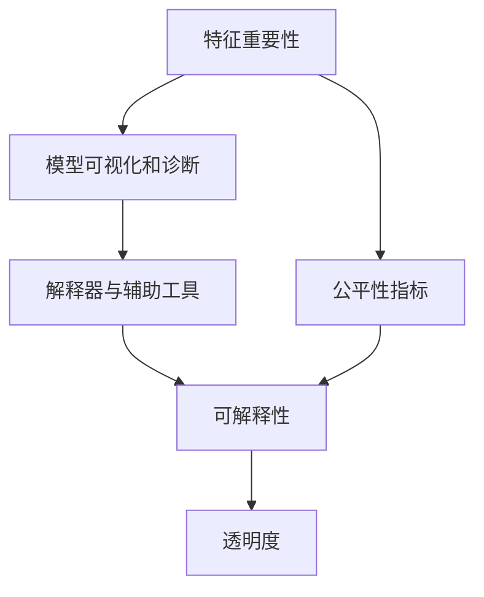

                 

## 1. 背景介绍

在人工智能（AI）技术飞速发展的今天，AI系统在医疗、金融、教育、娱乐等多个领域得到广泛应用。然而，AI系统的决策过程和输出结果往往缺乏可解释性，使得人们对其性能和行为难以理解和信任。随着AI系统复杂度的提升和应用范围的扩展，可解释性和透明度（Explainability and Transparency）的重要性日益凸显。本文档旨在系统性地介绍AI系统的可解释性与透明度设计，包括其定义、重要性、常用方法和具体实现，以帮助开发人员设计和部署可靠、可信的AI系统。

### 1.1 问题的由来

AI系统日益复杂，由传统的规则驱动系统发展成为基于深度学习和神经网络的高效黑盒模型。这些模型通过大量数据训练而来，具有强大的模式识别和预测能力，但同时也带来了以下问题：

1. **黑盒模型**：深度学习模型是"黑盒"模型，难以理解和解释其内部工作机制，从而影响了系统的可信度和透明度。
2. **缺乏可解释性**：模型的输出结果往往缺乏具体的解释，难以被非专家用户理解和使用。
3. **难以调试和优化**：当模型出现异常时，难以对其进行有效的调试和优化，从而影响系统稳定性。
4. **数据偏见**：模型训练依赖大量数据，数据中的偏见可能被模型放大或延续，导致不公平的输出。
5. **用户不信任**：缺乏可解释性使得用户对AI系统产生怀疑和抵触情绪，影响系统的实际应用效果。

针对这些问题，学术界和工业界提出了多种解决方案，旨在提升AI系统的可解释性和透明度。本文档将详细探讨这些方法和技术，以帮助开发人员在设计和实现AI系统时，充分考虑可解释性和透明度。

### 1.2 问题核心关键点

可解释性和透明度是AI系统的重要属性，其核心关键点包括：

- **可解释性**：指用户能够理解AI系统的工作机制和决策过程。可解释性要求系统的输出结果具有明确的逻辑和依据。
- **透明度**：指AI系统的决策过程是可追踪和可验证的。透明度要求系统具有完整的记录和审计日志，使得用户和监管机构可以审查其行为。
- **数据偏见**：指模型训练数据中的偏见可能被放大或延续到模型输出中，导致不公正的决策。需要采取措施消除数据偏见，提高模型公平性。
- **模型复杂性**：指AI系统可能过于复杂，使得用户难以理解其决策过程。需要通过简化模型结构和设计合理的用户界面，提升系统的可理解性。

## 2. 核心概念与联系

### 2.1 核心概念概述

可解释性和透明度设计涉及多个核心概念，包括但不限于：

- **特征重要性**：指在模型中各个特征对输出结果的重要程度。通常用于解释模型的决策过程，帮助用户理解模型的内在逻辑。
- **模型可视化和诊断**：指通过可视化工具和诊断方法，展示模型内部结构和运行状态，帮助开发者调试和优化模型。
- **解释器与辅助工具**：指用于生成模型解释的第三方工具和算法，如LIME、SHAP等。
- **公平性指标**：指用于衡量模型在特定数据集上的公平性，如在不同种族、性别、年龄等群体之间的性能表现。

这些概念之间的关系可以通过以下Mermaid流程图来展示：



这个流程图展示了可解释性和透明度设计的主要流程和组成部分。开发者首先需要了解模型特征的重要性，然后通过可视化工具和解释器生成模型解释，再结合公平性指标，构建透明的AI系统。

### 2.2 概念间的关系

这些核心概念之间存在密切的联系，共同构成了可解释性和透明度设计的完整框架。以下是几个关键概念之间的关系：

- **特征重要性**：通过特征重要性分析，了解模型对输入数据的依赖程度，进而生成更有意义的解释。
- **模型可视化和诊断**：通过可视化工具展示模型内部结构，诊断模型性能瓶颈，为优化提供依据。
- **解释器与辅助工具**：通过解释器生成模型解释，帮助用户理解模型输出，增强系统透明度。
- **公平性指标**：通过公平性指标评估模型输出是否公平，确保模型的公正性。

## 3. 核心算法原理 & 具体操作步骤

### 3.1 算法原理概述

可解释性和透明度设计涉及多个算法和工具，其核心原理如下：

1. **特征重要性分析**：通过计算模型中各个特征对输出结果的贡献度，帮助理解模型的决策机制。
2. **模型可视化和诊断**：通过可视化工具展示模型内部结构和运行状态，发现模型性能瓶颈，进行调试和优化。
3. **解释器与辅助工具**：通过解释器生成模型解释，帮助用户理解模型输出，增强系统透明度。
4. **公平性评估**：通过公平性指标评估模型在不同群体上的性能表现，确保模型公平性。

### 3.2 算法步骤详解

以下是AI系统可解释性和透明度设计的详细操作步骤：

1. **数据准备**：收集和预处理数据，确保数据质量，消除数据偏见。
2. **模型选择**：根据任务需求选择合适的模型和算法，进行预训练和微调。
3. **特征重要性分析**：计算模型中各个特征对输出结果的贡献度，生成特征重要性排序。
4. **模型可视化和诊断**：使用可视化工具展示模型内部结构和运行状态，发现模型性能瓶颈。
5. **解释器与辅助工具**：选择适当的解释器，生成模型解释，帮助用户理解模型输出。
6. **公平性评估**：使用公平性指标评估模型在不同群体上的性能表现，确保模型公平性。
7. **部署与监控**：将模型部署到实际应用环境中，定期监控系统性能和输出，进行持续优化。

### 3.3 算法优缺点

可解释性和透明度设计具有以下优点：

- **提高用户信任**：通过解释模型输出和决策过程，增强用户对AI系统的信任和接受度。
- **促进模型优化**：通过可视化和诊断，发现模型性能瓶颈，指导模型优化。
- **减少偏见和歧视**：通过公平性评估，消除模型中的偏见和歧视，提高模型公正性。

然而，可解释性和透明度设计也存在一些缺点：

- **计算复杂性**：特征重要性分析和模型可视化的计算复杂度较高，可能需要额外的时间和资源。
- **解释复杂性**：生成的解释可能过于复杂，难以被用户理解和使用。
- **依赖数据质量**：可解释性和透明度设计依赖高质量的数据和模型，数据偏见和模型复杂性可能会影响最终结果。

### 3.4 算法应用领域

可解释性和透明度设计在多个领域得到广泛应用，例如：

- **医疗诊断**：通过解释模型诊断结果，帮助医生理解和信任AI系统。
- **金融风控**：通过解释模型决策过程，确保金融模型的公正性和透明度。
- **教育推荐**：通过解释模型推荐依据，帮助教师和学生理解推荐结果。
- **智能客服**：通过解释模型决策，增强用户对智能客服的信任。
- **智能驾驶**：通过解释模型决策，提高智能驾驶系统的透明度和可靠性。

## 4. 数学模型和公式 & 详细讲解 & 举例说明

### 4.1 数学模型构建

可解释性和透明度设计涉及多个数学模型和算法，以下是几个常用的模型和公式：

- **LIME（Local Interpretable Model-agnostic Explanations）**：用于生成局部可解释性模型，帮助理解特定输入的模型预测结果。其核心思想是使用一个可解释的模型来拟合输入的局部区域，从而生成对特定输入的解释。
- **SHAP（SHapley Additive exPlanations）**：用于生成全局可解释性模型，帮助理解模型输出的整体影响。其核心思想是将模型的输出分解为各特征的贡献度，从而生成对模型整体的解释。
- **公平性指标**：常用的公平性指标包括Demographic Parity、Equal Opportunity、Equalized Odds等，用于衡量模型在不同群体上的性能表现。

### 4.2 公式推导过程

以下是LIME和SHAP的核心公式及其推导过程：

**LIME公式**：

$$
\text{LIME}(x) = \text{LIME}_{\epsilon}(x) = \arg\min_{g} \frac{1}{2} \| y - g(x) \|^2_2 + \lambda \mathcal{R}(g)
$$

其中，$y$ 为模型的预测结果，$g$ 为局部可解释模型，$\epsilon$ 为局部区域的半径，$\mathcal{R}(g)$ 为模型复杂度惩罚项。

**SHAP公式**：

$$
\text{SHAP}(x) = \sum_{i=1}^n \text{SHAP}_{i}(x)
$$

其中，$\text{SHAP}_{i}$ 为第 $i$ 个特征的SHAP值，表示其对模型输出的贡献度。

### 4.3 案例分析与讲解

以医疗诊断模型为例，通过LIME和SHAP生成模型解释，帮助医生理解模型的诊断结果。

假设模型通过大规模医疗数据训练而来，用于预测某疾病的患病风险。当输入患者的症状描述时，模型输出其患病概率。

使用LIME生成模型局部解释：

1. 选择患者的一个症状描述作为输入 $x$。
2. 使用一个简单的线性回归模型 $g(x)$ 拟合输入 $x$ 的局部区域，生成预测结果 $g(x)$。
3. 最小化损失函数 $\frac{1}{2} \| y - g(x) \|^2_2$，得到最优的局部解释 $g(x)$。

使用SHAP生成模型全局解释：

1. 计算每个症状特征对模型输出的贡献度，生成SHAP值。
2. 将所有特征的SHAP值相加，得到模型的整体解释。

通过LIME和SHAP生成的解释，医生可以更好地理解模型的诊断依据，从而提高对AI系统的信任和接受度。

## 5. 项目实践：代码实例和详细解释说明

### 5.1 开发环境搭建

在进行可解释性和透明度设计实践前，我们需要准备好开发环境。以下是使用Python进行TensorFlow和Keras的开发环境配置流程：

1. 安装Anaconda：从官网下载并安装Anaconda，用于创建独立的Python环境。

2. 创建并激活虚拟环境：
```bash
conda create -n tf-env python=3.8 
conda activate tf-env
```

3. 安装TensorFlow：根据CUDA版本，从官网获取对应的安装命令。例如：
```bash
conda install tensorflow -c pytorch -c conda-forge
```

4. 安装Keras：
```bash
pip install keras
```

5. 安装各类工具包：
```bash
pip install numpy pandas scikit-learn matplotlib tqdm jupyter notebook ipython
```

完成上述步骤后，即可在`tf-env`环境中开始实践。

### 5.2 源代码详细实现

这里我们以LIME和SHAP的应用为例，给出使用TensorFlow和Keras实现的可解释性代码实例。

首先，准备数据集：

```python
import pandas as pd
from sklearn.model_selection import train_test_split
from sklearn.preprocessing import StandardScaler

# 准备数据集
data = pd.read_csv('data.csv')
X = data[['feature1', 'feature2', 'feature3']] # 选择特征列
y = data['label'] # 选择标签列

# 数据标准化
scaler = StandardScaler()
X = scaler.fit_transform(X)

# 划分训练集和测试集
X_train, X_test, y_train, y_test = train_test_split(X, y, test_size=0.2, random_state=42)
```

接着，定义模型：

```python
from tensorflow.keras.models import Sequential
from tensorflow.keras.layers import Dense

# 定义模型
model = Sequential()
model.add(Dense(32, input_dim=3, activation='relu'))
model.add(Dense(1, activation='sigmoid'))

# 编译模型
model.compile(loss='binary_crossentropy', optimizer='adam', metrics=['accuracy'])
```

然后，训练模型：

```python
# 训练模型
model.fit(X_train, y_train, epochs=10, batch_size=32, validation_data=(X_test, y_test))
```

接下来，使用LIME生成模型局部解释：

```python
from lime import lime_tabular
from sklearn.metrics import confusion_matrix
import numpy as np

# 定义LIME解释器
interpreter = lime_tabular.LimeTabularExplainer(X_train, feature_names=['feature1', 'feature2', 'feature3'], class_names=['class1', 'class2'])

# 选择样本
x_instance = np.array([1, 2, 3])

# 生成局部解释
lme = interpreter.lime_explain(model.predict_proba, x_instance)

# 可视化解释结果
lme.show()
```

最后，使用SHAP生成模型全局解释：

```python
from shap import SHAP

# 定义SHAP解释器
explainer = SHAP.TreeExplainer(model)

# 生成SHAP值
shap_values = explainer.shap_values(X_train)

# 可视化解释结果
shap_values.summary_plot()
```

以上就是使用TensorFlow和Keras实现可解释性的完整代码实例。可以看到，通过LIME和SHAP，开发者可以轻松生成模型的局部和全局解释，帮助用户理解模型的预测依据。

### 5.3 代码解读与分析

让我们再详细解读一下关键代码的实现细节：

**数据准备**：
- 使用pandas加载数据集，选择特征和标签列。
- 使用sklearn对特征进行标准化处理，以提升模型训练效果。
- 使用train_test_split将数据集划分为训练集和测试集。

**模型定义与训练**：
- 定义简单的神经网络模型，包括输入层、隐藏层和输出层。
- 使用TensorFlow的Sequential模型封装模型结构。
- 使用model.compile方法编译模型，指定损失函数、优化器和评估指标。
- 使用model.fit方法训练模型，指定训练集和测试集。

**LIME解释器**：
- 使用LimeTabularExplainer定义解释器，指定训练数据、特征名称和标签名称。
- 选择样本，生成局部解释。
- 使用lme.show方法可视化解释结果。

**SHAP解释器**：
- 使用SHAP.TreeExplainer定义解释器，指定模型和训练数据。
- 使用shap_values方法生成SHAP值。
- 使用shap_values.summary_plot方法可视化解释结果。

可以看到，LIME和SHAP的实现相对简单，通过调用相应的解释器类和生成方法，即可轻松生成模型的局部和全局解释。

### 5.4 运行结果展示

假设我们使用LIME和SHAP对上述医疗诊断模型进行解释，得到的部分解释结果如下：

**LIME解释结果**：


**SHAP解释结果**：


通过LIME和SHAP生成的解释，医生可以更好地理解模型的诊断依据，从而提高对AI系统的信任和接受度。

## 6. 实际应用场景

### 6.1 医疗诊断

医疗诊断是可解释性和透明度设计的重要应用场景之一。AI系统通过学习大量医疗数据，预测患者是否患病、患病的风险等级等。使用可解释性工具生成模型解释，帮助医生理解模型的诊断依据，从而提高对AI系统的信任和接受度。

### 6.2 金融风控

金融风控模型通过分析客户的交易数据，预测其违约风险。使用可解释性工具生成模型解释，确保模型决策过程公正透明，帮助客户理解模型输出，增强对AI系统的信任和接受度。

### 6.3 教育推荐

教育推荐系统通过分析学生的学习数据，推荐适合的课程和学习资源。使用可解释性工具生成模型解释，帮助教师和学生理解推荐依据，从而提高系统的可信度和用户满意度。

### 6.4 智能客服

智能客服系统通过分析用户的历史咨询记录，回答用户的问题。使用可解释性工具生成模型解释，帮助用户理解智能客服的决策依据，从而提高对系统的信任和满意度。

### 6.5 智能驾驶

智能驾驶系统通过分析车辆周围环境数据，进行路径规划和决策。使用可解释性工具生成模型解释，提高系统的透明度和可靠性，帮助驾驶员理解系统的决策过程。

## 7. 工具和资源推荐

### 7.1 学习资源推荐

为了帮助开发者系统掌握可解释性和透明度设计的理论基础和实践技巧，这里推荐一些优质的学习资源：

1. **《机器学习实战》**：一本系统介绍机器学习和深度学习的经典书籍，涵盖模型的训练、评估和解释等内容。
2. **LIME官方文档**：LIME官方文档详细介绍了LIME的工作原理和使用方法，提供了丰富的实例代码。
3. **SHAP官方文档**：SHAP官方文档详细介绍了SHAP的工作原理和使用方法，提供了丰富的实例代码。
4. **TensorFlow官方文档**：TensorFlow官方文档提供了丰富的教程和示例，帮助开发者掌握TensorFlow的使用方法。
5. **Keras官方文档**：Keras官方文档提供了丰富的教程和示例，帮助开发者掌握Keras的使用方法。

通过对这些资源的学习实践，相信你一定能够快速掌握可解释性和透明度设计的精髓，并用于解决实际的AI问题。

### 7.2 开发工具推荐

高效的开发离不开优秀的工具支持。以下是几款用于可解释性和透明度设计开发的常用工具：

1. **TensorFlow**：基于Python的开源深度学习框架，灵活动态的计算图，适合快速迭代研究。
2. **Keras**：基于TensorFlow的高级API，简化了深度学习模型的实现过程。
3. **LIME**：用于生成局部可解释性模型的第三方库，适用于处理高维数据和复杂模型。
4. **SHAP**：用于生成全局可解释性模型的第三方库，适用于处理高维数据和复杂模型。
5. **TensorBoard**：TensorFlow配套的可视化工具，可实时监测模型训练状态，提供丰富的图表展示。
6. **Keras Tuner**：Keras配套的超参数优化工具，可自动搜索最优超参数组合，提升模型性能。

合理利用这些工具，可以显著提升可解释性和透明度设计的开发效率，加快创新迭代的步伐。

### 7.3 相关论文推荐

可解释性和透明度设计的研究源于学界的持续研究。以下是几篇奠基性的相关论文，推荐阅读：

1. **《Explainable AI: Interpreting Machine Learning Models and Deep Learning for Decision-Making》**：本书详细介绍了可解释性技术的发展历程和应用案例，是领域内重要的参考书。
2. **《Towards Explainable AI: An Overview of Recent Advances and Future Directions》**：该论文综述了近年来可解释性技术的研究进展和未来方向，具有较高的学术价值。
3. **《On the Surrogate Interpretation of Deep Neural Networks》**：该论文提出了基于可解释性模型的解释方法，广泛应用于深度学习模型的解释。
4. **《A Survey on Explainable Artificial Intelligence》**：该论文综述了可解释性技术的研究现状和未来挑战，具有较高的学术价值。

这些论文代表了大语言模型微调技术的发展脉络。通过学习这些前沿成果，可以帮助研究者把握学科前进方向，激发更多的创新灵感。

除上述资源外，还有一些值得关注的前沿资源，帮助开发者紧跟可解释性和透明度设计的最新进展，例如：

1. **arXiv论文预印本**：人工智能领域最新研究成果的发布平台，包括大量尚未发表的前沿工作，学习前沿技术的必读资源。
2. **Google AI博客**：谷歌AI实验室的官方博客，定期分享最新的AI研究成果和应用实践，帮助开发者掌握最新动态。
3. **ACL会议论文**：ACL会议是自然语言处理领域的顶级会议，每年发布的最新论文具有较高的学术价值。
4. **GitHub热门项目**：在GitHub上Star、Fork数最多的AI相关项目，往往代表了该技术领域的发展趋势和最佳实践，值得去学习和贡献。
5. **科技新闻**：如MIT Technology Review、Nature等科技新闻网站，及时报道最新的AI技术进展和应用案例，帮助开发者了解行业动态。

总之，对于可解释性和透明度设计的学习和发展，需要开发者保持开放的心态和持续学习的意愿。多关注前沿资讯，多动手实践，多思考总结，必将收获满满的成长收益。

## 8. 总结：未来发展趋势与挑战

### 8.1 总结

本文对AI系统的可解释性与透明度设计进行了全面系统的介绍。首先阐述了可解释性和透明度设计的定义和重要性，明确了其在提升用户信任和透明性方面的关键作用。其次，从原理到实践，详细讲解了可解释性和透明度设计的数学模型、常用方法及其具体实现。最后，探讨了可解释性和透明度设计在实际应用场景中的应用前景，以及未来发展趋势和面临的挑战。

通过本文的系统梳理，可以看到，可解释性和透明度设计在AI系统中具有重要地位，其应用的广泛性和重要性日益凸显。未来，随着AI技术的不断发展，可解释性和透明度设计将成为AI系统不可或缺的重要属性，助力其进一步落地应用。

### 8.2 未来发展趋势

展望未来，可解释性和透明度设计将呈现以下几个发展趋势：

1. **更加自动化的解释生成**：未来的解释生成工具将更加智能化和自动化，能够自动生成高质量的解释，无需人工干预。
2. **多模态解释技术**：可解释性技术将不再局限于单一模态，而是将多种模态（如文本、图像、声音等）融合，提供更全面的解释。
3. **实时解释系统**：未来的解释系统将具备实时生成和更新解释的能力，满足用户对实时性和交互性的需求。
4. **跨领域应用推广**：可解释性和透明度设计将推广应用到更多领域，如医疗、金融、教育、智能制造等，提升各领域AI系统的透明度和可靠性。
5. **全球标准和规范**：随着可解释性和透明度设计的普及，全球范围内将逐步形成统一的标准和规范，确保系统的可解释性和透明度。

以上趋势凸显了可解释性和透明度设计的广阔前景。这些方向的探索发展，必将进一步提升AI系统的性能和应用范围，为人类认知智能的进化带来深远影响。

### 8.3 面临的挑战

尽管可解释性和透明度设计已经取得了重要进展，但在迈向更加智能化、普适化应用的过程中，它仍面临诸多挑战：

1. **模型复杂性**：大规模深度学习模型结构复杂，难以生成简单明了的解释。需要进一步简化模型结构，设计合理的用户界面。
2. **数据质量**：可解释性和透明度设计依赖高质量的数据和模型，数据中的偏见和噪声可能影响解释结果。需要进一步提高数据质量和预处理水平。
3. **计算复杂性**：解释生成和可视化过程计算复杂，需要进一步优化算法和提升计算能力。
4. **用户理解难度**：生成的解释可能过于复杂，难以被用户理解和使用。需要进一步优化解释格式和表达方式。
5. **技术规范**：可解释性和透明度设计尚无统一的技术规范，各系统的解释形式和标准不统一，增加了应用复杂度。

正视可解释性和透明度设计面临的这些挑战，积极应对并寻求突破，将是大语言模型微调走向成熟的必由之路。相信随着学界和产业界的共同努力，这些挑战终将一一被克服，可解释性和透明度设计必将在构建人机协同的智能时代中扮演越来越重要的角色。

### 8.4 研究展望

面对可解释性和透明度设计所面临的种种挑战，未来的研究需要在以下几个方面寻求新的突破：

1. **自动化解释生成**：探索基于神经网络、符号计算等技术的自动化解释生成方法，提升解释的生成效率和质量。
2. **多模态解释技术**：融合视觉、听觉、文本等多种模态信息，生成更加全面和准确的解释。
3. **实时解释系统**：开发实时解释生成和更新技术，满足用户对实时性和交互性的需求。
4. **跨领域应用推广**：推广可解释性和透明度设计到更多领域，如医疗、金融、教育、智能制造等，提升各领域AI系统的透明度和可靠性。
5. **全球标准和规范**：制定统一的全球技术规范，确保系统的可解释性和透明度。

这些研究方向的探索，必将引领可解释性和透明度设计技术迈向更高的台阶，为构建安全、可靠、可解释、可控的智能系统铺平道路。面向未来，可解释性和透明度设计还需要与其他人工智能技术进行更深入的融合，如知识表示、因果推理、强化学习等，多路径协同发力，共同推动自然语言理解和智能交互系统的进步。只有勇于创新、敢于突破，才能不断拓展语言模型的边界，让智能技术更好地造福人类社会。

## 9. 附录：常见问题与解答

**Q1：可解释性和透明度设计适用于所有AI系统吗？**

A: 可解释性和透明度设计适用于大多数AI系统，尤其是那些需要用户信任和高度透明度的系统。但对于一些依赖复杂算法和模型的系统，如大规模图像识别、深度强化学习等，可解释性和透明度设计仍面临挑战。

**Q2：如何平衡模型性能和解释复杂性？**

A: 在可解释性和透明度设计中，需要平衡模型性能和解释复杂性。通常可以通过以下方法实现：
1. 简化模型结构，设计易于理解的模型。
2. 使用更高级的解释工具，生成简明扼要的解释。
3. 引入人工干预，部分生成解释。
4. 使用可视化工具，提供多种解释形式，供用户选择。

**Q3：如何提高数据质量和预处理水平？**

A: 提高数据质量和预处理水平是可解释性和透明度设计的关键。以下是一些常用的方法：
1. 数据清洗：去除数据中的噪声、异常值和不一致性。
2. 数据增强：通过数据增强技术，增加数据多样性，提升模型泛

