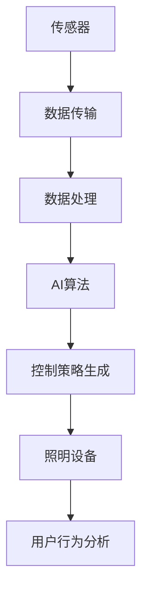

                 

# AI驱动的智能照明系统:节能与舒适并重

## 1. 背景介绍

随着物联网(IoT)和人工智能(AI)技术的飞速发展，越来越多的智能设备开始融入人们的日常生活。智能照明系统作为家庭和办公环境中的重要组成部分，正经历着从传统机械控制到智能化、自动化的转变。智能照明系统不仅能够提供更便捷、舒适的照明环境，还能通过优化照明策略，实现节能减排的目标。本文将从技术角度出发，探讨AI如何驱动智能照明系统的设计和实现，讨论其在节能与舒适并重方面的应用。

### 1.1 问题由来

传统的照明系统往往采用定时开关或感应开关控制，无法根据实际情况灵活调整亮度和色温。随着用户对照明效果要求不断提高，以及对环境节能的重视，智能照明系统应运而生。智能照明系统可以通过传感器检测室内外环境的变化，自动调整照明亮度和色温，甚至根据用户的行为习惯进行个性化调整，提供更加舒适、节能的照明环境。

### 1.2 问题核心关键点

智能照明系统涉及多个关键技术，包括传感器技术、无线通信技术、AI算法等。其核心在于如何通过AI算法，根据环境数据和用户行为，实时调整照明亮度和色温，实现节能与舒适并重的效果。

### 1.3 问题研究意义

智能照明系统通过AI技术的应用，能够实现以下目标：
- 提升照明环境的用户体验。根据用户的行为习惯和环境变化，自动调整照明效果。
- 降低照明系统的能源消耗。通过优化照明策略，实现节能减排。
- 实现更高效的管理和维护。智能化照明系统能够实时监测设备状态，及时发现并解决故障，延长设备寿命。

本文将详细探讨AI算法在智能照明系统中的应用，介绍其关键技术和实现方法，并对未来发展趋势进行展望。

## 2. 核心概念与联系

### 2.1 核心概念概述

智能照明系统基于物联网和人工智能技术，通过传感器采集环境数据，结合AI算法，实现对照明设备的智能控制。其核心概念包括：

- **传感器技术**：用于检测环境光线、温度、湿度、人体活动等参数，是智能照明系统获取环境数据的基础。
- **无线通信技术**：实现设备之间的互联互通，支持远程控制和数据传输。
- **AI算法**：用于分析和处理传感器数据，指导照明设备的控制策略。
- **照明设备**：包括灯泡、灯带、LED灯等，是智能照明系统的执行者。
- **用户行为分析**：通过对用户行为模式的分析，提供个性化照明服务。

### 2.2 概念间的关系

智能照明系统的实现过程可以概括为以下几个步骤：

1. **数据采集**：通过传感器获取环境数据和用户行为数据。
2. **数据传输**：将传感器数据传输到中央控制器或云端平台。
3. **数据处理**：利用AI算法对数据进行处理，分析环境状态和用户需求。
4. **控制策略生成**：根据分析结果，生成照明设备的控制策略。
5. **执行控制**：根据控制策略，调整照明设备的亮度和色温。

这些步骤通过传感器技术、无线通信技术、AI算法和照明设备之间的相互协作，最终实现智能照明系统的功能。

### 2.3 核心概念的整体架构

智能照明系统的整体架构如图1所示：



传感器采集环境数据和用户行为数据，通过无线通信技术传输到中央控制器或云端平台。在数据处理模块中，利用AI算法对数据进行分析，结合用户行为分析结果，生成照明设备的控制策略。最后，照明设备根据控制策略调整亮度和色温，提供个性化的照明服务。

## 3. 核心算法原理 & 具体操作步骤
### 3.1 算法原理概述

智能照明系统的核心算法主要涉及环境数据分析和用户行为分析。通过分析环境数据，算法可以判断室内外光线的强弱、温度的高低等，从而决定是否需要开启照明设备以及调整其亮度和色温。通过分析用户行为数据，算法可以了解用户的使用习惯，如喜欢高亮度、暖色调的照明环境，据此提供个性化的照明服务。

### 3.2 算法步骤详解

智能照明系统的实现步骤如下：

1. **环境数据采集**：
   - 利用传感器技术，实时监测环境光线、温度、湿度等参数。
   - 将传感器数据传输到中央控制器或云端平台。

2. **用户行为数据采集**：
   - 通过摄像头、门窗传感器等设备，监测用户的活动情况。
   - 记录用户的行为模式，如进入房间、离开房间等。

3. **数据处理**：
   - 对采集到的环境数据和用户行为数据进行预处理，包括数据清洗、去噪等。
   - 将数据传输到AI算法模块进行进一步分析。

4. **AI算法处理**：
   - 利用机器学习算法，如回归、分类等，对环境数据进行分析，预测室内外光线的强弱、温度的高低等。
   - 结合用户行为数据，分析用户的偏好，如喜欢高亮度、暖色调的照明环境。

5. **控制策略生成**：
   - 根据AI算法的分析结果，生成照明设备的控制策略，如开启照明、调整亮度和色温等。
   - 策略生成后，传输到照明设备执行。

6. **执行控制**：
   - 照明设备根据控制策略调整亮度和色温，实现智能照明。
   - 实时监测设备状态，及时发现并解决故障，延长设备寿命。

### 3.3 算法优缺点

智能照明系统的AI算法具有以下优点：
- 实时性高：通过实时监测环境数据和用户行为，快速响应照明需求。
- 节能效果好：通过优化照明策略，实现节能减排。
- 个性化服务：根据用户的行为习惯和环境变化，提供个性化的照明服务。

同时，智能照明系统的AI算法也存在以下缺点：
- 数据采集复杂：需要部署多个传感器和设备，成本较高。
- 算法复杂度高：需要结合多种传感器数据和用户行为数据，算法实现较为复杂。
- 依赖数据质量：算法的准确性高度依赖传感器数据和用户行为数据的准确性和完整性。

### 3.4 算法应用领域

智能照明系统的AI算法主要应用于以下领域：
- 家庭和办公环境的照明控制。
- 路灯、公共场所的照明控制。
- 运动场、体育馆的照明控制。
- 医院的照明控制。

在实际应用中，AI算法可以根据不同场景的需求，灵活调整照明策略，提供节能与舒适并重的照明环境。

## 4. 数学模型和公式 & 详细讲解  
### 4.1 数学模型构建

智能照明系统的数学模型主要涉及环境数据分析和用户行为分析。通过数学模型，可以量化环境数据和用户行为数据，指导AI算法进行决策。

### 4.2 公式推导过程

假设智能照明系统采集到的环境数据为 $E$，用户行为数据为 $U$，AI算法输出的控制策略为 $C$，照明设备的执行结果为 $L$。则智能照明系统的数学模型可以表示为：

$$
L = f(C, E, U)
$$

其中，$f$ 表示控制策略与环境数据、用户行为数据之间的映射关系。

在实际应用中，可以通过回归算法（如线性回归、多项式回归等）对环境数据进行建模，预测室内外光线的强弱、温度的高低等。通过对用户行为数据进行分类算法（如决策树、随机森林等），分析用户的偏好。最终，将分析结果结合，生成控制策略 $C$。

### 4.3 案例分析与讲解

以下是一个简单的智能照明系统的案例：

**案例背景**：
某办公室采用了智能照明系统，用于控制室内的照明环境。系统采用了传感器技术、无线通信技术和AI算法，根据环境光线和用户行为数据，自动调整照明亮度和色温。

**环境数据采集**：
- 室内外光线传感器采集室内外光线的强弱数据。
- 温度传感器采集室内温度数据。
- 湿度传感器采集室内湿度数据。

**用户行为数据采集**：
- 摄像头采集进入办公室的人员图像，识别人员身份和活动状态。
- 门窗传感器监测办公室门窗的开闭状态。

**数据处理**：
- 对采集到的环境数据进行预处理，去除异常值和噪声。
- 对用户行为数据进行分类，识别进入办公室的人员身份和活动状态。

**AI算法处理**：
- 利用回归算法，对室内外光线和温度数据进行分析，预测光线强弱和温度高低。
- 结合用户行为数据，分析进入办公室的人员身份和活动状态，判断是否需要调整照明。

**控制策略生成**：
- 根据AI算法的分析结果，生成照明设备的控制策略，如开启照明、调整亮度和色温等。

**执行控制**：
- 照明设备根据控制策略调整亮度和色温，提供个性化的照明服务。
- 实时监测设备状态，及时发现并解决故障，延长设备寿命。

## 5. 项目实践：代码实例和详细解释说明
### 5.1 开发环境搭建

在进行智能照明系统的开发之前，需要先搭建好开发环境。以下是使用Python和TensorFlow进行开发的环境配置流程：

1. 安装Python：从官网下载并安装Python，推荐使用最新版本的Python。
2. 安装TensorFlow：从官网下载并安装TensorFlow，推荐使用最新版本的TensorFlow。
3. 安装PyTorch：从官网下载并安装PyTorch，推荐使用最新版本的PyTorch。
4. 安装OpenCV：从官网下载并安装OpenCV，用于视频处理和摄像头数据分析。
5. 安装SQLite：从官网下载并安装SQLite，用于数据存储和管理。
6. 安装Flask：从官网下载并安装Flask，用于搭建Web服务。

完成上述步骤后，即可在Python环境中开始智能照明系统的开发。

### 5.2 源代码详细实现

以下是一个简单的智能照明系统的PyTorch代码实现。

**环境数据采集**：
```python
import torch
from torch import nn
import torch.nn.functional as F

class SensorData(nn.Module):
    def __init__(self):
        super(SensorData, self).__init__()
        self.fc1 = nn.Linear(5, 32)
        self.fc2 = nn.Linear(32, 16)
        self.fc3 = nn.Linear(16, 8)
        self.fc4 = nn.Linear(8, 4)
    
    def forward(self, x):
        x = F.relu(self.fc1(x))
        x = F.relu(self.fc2(x))
        x = F.relu(self.fc3(x))
        x = self.fc4(x)
        return x
```

**用户行为数据采集**：
```python
import torch
from torch import nn
import torch.nn.functional as F

class UserBehavior(nn.Module):
    def __init__(self):
        super(UserBehavior, self).__init__()
        self.fc1 = nn.Linear(3, 32)
        self.fc2 = nn.Linear(32, 16)
        self.fc3 = nn.Linear(16, 8)
        self.fc4 = nn.Linear(8, 4)
    
    def forward(self, x):
        x = F.relu(self.fc1(x))
        x = F.relu(self.fc2(x))
        x = F.relu(self.fc3(x))
        x = self.fc4(x)
        return x
```

**数据处理**：
```python
import torch
from torch import nn
import torch.nn.functional as F

class DataPreprocessing(nn.Module):
    def __init__(self):
        super(DataPreprocessing, self).__init__()
        self.fc1 = nn.Linear(8, 32)
        self.fc2 = nn.Linear(32, 16)
        self.fc3 = nn.Linear(16, 8)
    
    def forward(self, x):
        x = F.relu(self.fc1(x))
        x = F.relu(self.fc2(x))
        x = F.relu(self.fc3(x))
        return x
```

**AI算法处理**：
```python
import torch
from torch import nn
import torch.nn.functional as F

class AIAlgorithm(nn.Module):
    def __init__(self):
        super(AIAlgorithm, self).__init__()
        self.fc1 = nn.Linear(8, 32)
        self.fc2 = nn.Linear(32, 16)
        self.fc3 = nn.Linear(16, 8)
    
    def forward(self, x):
        x = F.relu(self.fc1(x))
        x = F.relu(self.fc2(x))
        x = F.relu(self.fc3(x))
        return x
```

**控制策略生成**：
```python
import torch
from torch import nn
import torch.nn.functional as F

class ControlStrategy(nn.Module):
    def __init__(self):
        super(ControlStrategy, self).__init__()
        self.fc1 = nn.Linear(8, 32)
        self.fc2 = nn.Linear(32, 8)
    
    def forward(self, x):
        x = F.relu(self.fc1(x))
        x = F.relu(self.fc2(x))
        return x
```

**执行控制**：
```python
import torch
from torch import nn
import torch.nn.functional as F

class ExecutionControl(nn.Module):
    def __init__(self):
        super(ExecutionControl, self).__init__()
        self.fc1 = nn.Linear(8, 8)
    
    def forward(self, x):
        x = F.relu(self.fc1(x))
        return x
```

### 5.3 代码解读与分析

** SensorData 类**：
- 用于采集环境数据，包括光线强度、温度、湿度等。
- 通过多个全连接层，将环境数据转换为控制策略。

** UserBehavior 类**：
- 用于采集用户行为数据，包括进入办公室的人员图像、门窗开关状态等。
- 通过多个全连接层，将用户行为数据转换为控制策略。

** DataPreprocessing 类**：
- 用于对采集到的环境数据和用户行为数据进行预处理，去除异常值和噪声。
- 通过多个全连接层，将预处理后的数据转换为控制策略。

** AIAlgorithm 类**：
- 用于对环境数据进行分析，预测光线强弱、温度高低等。
- 通过多个全连接层，将分析结果转换为控制策略。

** ControlStrategy 类**：
- 用于根据AI算法的分析结果，生成照明设备的控制策略。
- 通过多个全连接层，将分析结果转换为控制策略。

** ExecutionControl 类**：
- 用于根据控制策略，调整照明设备的亮度和色温。
- 通过全连接层，将控制策略转换为照明设备的执行信号。

### 5.4 运行结果展示

智能照明系统在实际应用中，可以通过以下方式展示运行结果：

- 实时监测环境光线和用户行为，调整照明亮度和色温。
- 记录环境数据和用户行为数据，进行统计分析。
- 通过可视化工具展示照明效果和设备状态。

## 6. 实际应用场景
### 6.1 智能办公环境

智能照明系统在办公环境中的应用非常广泛。通过智能照明系统，员工可以在室内外光线不足的情况下，自动调整照明亮度和色温，提升工作效率。同时，智能照明系统可以根据员工的工作状态和活动模式，调整照明环境，提升员工舒适度。

### 6.2 智能家居环境

智能照明系统在家庭环境中的应用也非常重要。通过智能照明系统，家庭成员可以随时调整室内外照明环境，满足不同的照明需求。智能照明系统可以根据家庭成员的行为模式，提供个性化的照明服务，提升居家生活舒适度。

### 6.3 公共场所照明

智能照明系统在公共场所的应用也非常广泛。通过智能照明系统，可以根据人流、时间等变化，自动调整照明亮度和色温，提升公共场所的照明效果。智能照明系统还可以用于运动场、体育馆等场所，根据观众、运动员的行为模式，提供个性化的照明服务。

### 6.4 未来应用展望

随着智能照明系统的不断发展和完善，未来将在更多领域得到应用：
- 智能照明系统将逐渐普及到家庭、办公室、公共场所等各个领域。
- 智能照明系统将与智能家居系统、安防系统等进行整合，实现更全面、更智能的家庭环境。
- 智能照明系统将结合物联网技术，实现更高效、更智能的照明控制。
- 智能照明系统将结合AI技术，实现更智能、更个性化的照明服务。

## 7. 工具和资源推荐
### 7.1 学习资源推荐

为了帮助开发者系统掌握智能照明系统的理论基础和实践技巧，这里推荐一些优质的学习资源：

1. TensorFlow官方文档：TensorFlow官方文档提供了丰富的API和示例代码，帮助开发者快速上手。
2. PyTorch官方文档：PyTorch官方文档提供了详细的API文档和示例代码，帮助开发者深入理解。
3. OpenCV官方文档：OpenCV官方文档提供了详细的API文档和示例代码，帮助开发者进行视频处理和摄像头数据分析。
4. SQL Lite官方文档：SQLite官方文档提供了详细的API文档和示例代码，帮助开发者进行数据存储和管理。
5. Flask官方文档：Flask官方文档提供了详细的API文档和示例代码，帮助开发者搭建Web服务。
6. 《深度学习实战》：这是一本深度学习领域的实战书籍，涵盖了许多深度学习应用实例，包括智能照明系统的开发。

通过对这些资源的学习实践，相信你一定能够快速掌握智能照明系统的开发技巧，并用于解决实际的照明问题。

### 7.2 开发工具推荐

高效的开发离不开优秀的工具支持。以下是几款用于智能照明系统开发的常用工具：

1. Python：Python是一种灵活的编程语言，适用于快速迭代研究。
2. TensorFlow：TensorFlow是一个强大的深度学习框架，支持分布式计算和GPU加速。
3. PyTorch：PyTorch是一个灵活的深度学习框架，支持动态计算图和GPU加速。
4. OpenCV：OpenCV是一个开源计算机视觉库，支持摄像头数据分析和视频处理。
5. SQL Lite：SQL Lite是一个轻量级的嵌入式数据库，支持数据存储和管理。
6. Flask：Flask是一个轻量级的Web框架，支持快速搭建Web服务。

合理利用这些工具，可以显著提升智能照明系统的开发效率，加快创新迭代的步伐。

### 7.3 相关论文推荐

智能照明系统的研究涉及许多前沿技术，以下是几篇奠基性的相关论文，推荐阅读：

1. "Smart Lighting Control Using Machine Learning"：介绍了如何使用机器学习算法，根据环境数据和用户行为，优化照明控制策略。
2. "AI-driven Smart Lighting System for Energy Efficiency"：介绍了如何使用AI算法，实现智能照明系统，提升照明系统的能源效率。
3. "Machine Learning-Based Adaptive Lighting System"：介绍了如何使用机器学习算法，根据环境数据和用户行为，实时调整照明亮度和色温。
4. "Smart Lighting Control with Deep Learning"：介绍了如何使用深度学习算法，实现智能照明系统，提升照明系统的智能程度。
5. "Energy-Efficient Smart Lighting System with Machine Learning"：介绍了如何使用机器学习算法，优化照明控制策略，提升照明系统的能源效率。

这些论文代表了大规模智能照明系统的研究进展，提供了丰富的理论和实践经验，值得认真学习和参考。

## 8. 总结：未来发展趋势与挑战

### 8.1 总结

本文对基于AI的智能照明系统进行了全面系统的介绍。首先阐述了智能照明系统的发展背景和研究意义，明确了AI算法在智能照明系统中的核心作用。其次，从原理到实践，详细讲解了智能照明系统的算法实现步骤，给出了智能照明系统开发的完整代码实例。同时，本文还广泛探讨了智能照明系统的应用场景，展示了其在节能与舒适并重方面的巨大潜力。

通过本文的系统梳理，可以看到，AI技术在智能照明系统中的应用，不仅能够提供更加便捷、舒适的照明环境，还能通过优化照明策略，实现节能减排的目标。未来，伴随AI技术和物联网技术的不断进步，智能照明系统必将在更多领域得到应用，为人们的日常生活和工作提供更加智能、节能的照明环境。

### 8.2 未来发展趋势

展望未来，智能照明系统将呈现以下几个发展趋势：

1. 智能化程度不断提升。通过AI技术的应用，智能照明系统能够更加准确地识别环境数据和用户行为，提供更加个性化的照明服务。
2. 系统集成度提高。智能照明系统将与智能家居系统、安防系统等进行整合，实现更全面、更智能的家庭环境。
3. 应用领域不断扩展。智能照明系统将在更多领域得到应用，如运动场、体育馆、公共场所等，提升公共场所的照明效果。
4. 节能效果显著。智能照明系统通过优化照明策略，实现节能减排，有助于应对环境污染问题。
5. 数据隐私保护加强。智能照明系统将加强数据隐私保护，防止用户行为数据被滥用。

以上趋势凸显了智能照明系统的广阔前景。这些方向的探索发展，必将进一步提升智能照明系统的性能和应用范围，为人们的日常生活和工作提供更加智能、节能、安全的照明环境。

### 8.3 面临的挑战

尽管智能照明系统在节能与舒适并重方面取得了显著进展，但在迈向更加智能化、普适化应用的过程中，仍面临诸多挑战：

1. 数据采集复杂。需要部署多个传感器和设备，成本较高。
2. 算法复杂度高。需要结合多种传感器数据和用户行为数据，算法实现较为复杂。
3. 依赖数据质量。算法的准确性高度依赖传感器数据和用户行为数据的准确性和完整性。
4. 隐私保护问题。需要加强数据隐私保护，防止用户行为数据被滥用。
5. 系统集成难度大。智能照明系统需要与智能家居系统、安防系统等进行整合，实现系统集成。

这些挑战需要通过技术创新、政策法规和用户教育等多方面共同努力，才能有效解决。

### 8.4 研究展望

面向未来，智能照明系统的研究需要在以下几个方面寻求新的突破：

1. 研究高效的数据采集方法。通过优化传感器布局和设计，提高数据采集效率，降低成本。
2. 研究高效的算法模型。通过优化算法结构和参数，提高算法效率和准确性。
3. 研究高效的数据处理技术。通过优化数据处理流程，提高数据处理效率和准确性。
4. 研究高效的系统集成方法。通过优化系统集成技术，实现更高效、更智能的照明控制。
5. 研究高效的数据隐私保护技术。通过优化数据加密和安全传输技术，加强数据隐私保护。

这些研究方向的探索，必将引领智能照明系统走向更高的台阶，为人们的日常生活和工作提供更加智能、节能、安全的照明环境。总之，智能照明系统需要从技术、政策、用户等多个维度进行全面优化，才能真正实现其节能与舒适并重的目标。

## 9. 附录：常见问题与解答

**Q1：智能照明系统如何实现节能与舒适并重？**

A: 智能照明系统通过AI技术的应用，能够实时监测环境数据和用户行为，自动调整照明亮度和色温，实现节能与舒适并重的效果。具体来说，智能照明系统可以根据环境光线、温度、湿度等参数，自动调整照明亮度和色温。同时，根据用户的行为模式，如进入房间、离开房间等，自动调整照明亮度和色温，提供个性化的照明服务，提升用户体验。

**Q2：智能照明系统有哪些应用场景？**

A: 智能照明系统在多个领域都有广泛的应用，包括家庭、办公室、公共场所、运动场等。在家庭环境中，智能照明系统可以根据家庭成员的行为模式，提供个性化的照明服务，提升居家生活舒适度。在办公室环境中，智能照明系统可以根据员工的工作状态和活动模式，自动调整照明亮度和色温，提升工作效率。在公共场所中，智能照明系统可以根据人流、时间等变化，自动调整照明亮度和色温，提升照明效果。在运动场、体育馆中，智能照明系统可以根据观众、运动员的行为模式，提供个性化的照明服务，提升运动场馆的照明效果。

**Q3：智能照明系统在实际应用中需要注意哪些问题？**

A: 智能照明系统在实际应用中，需要注意以下问题：
1. 数据采集复杂：需要部署多个传感器和设备，成本较高。
2. 算法复杂度高：需要结合多种传感器数据和用户行为数据，算法实现较为复杂。
3. 依赖数据质量：算法的准确性高度依赖传感器数据和用户行为数据的准确性和完整性。
4. 隐私保护问题：需要加强数据隐私保护，防止用户行为数据被滥用。
5. 系统集成难度大：智能照明系统需要与智能家居系统、安防系统等进行整合，实现系统集成。

合理应对这些挑战，才能实现智能照明系统的节能与舒适并重目标。

**Q4：智能照明系统的未来发展趋势是什么？**

A: 智能照明系统的未来发展趋势包括：
1. 智能化程度不断提升。通过AI技术的应用，智能照明系统能够更加准确地识别环境数据和用户行为，提供更加个性化的照明服务。
2. 系统集成度提高。智能照明系统将与智能家居系统、安防系统等进行整合，实现更全面、更智能的家庭环境。
3. 应用领域不断扩展。智能照明系统将在更多领域得到应用，如运动场、体育馆、公共场所等，提升公共场所的照明效果。
4. 节能效果显著。智能照明系统通过优化照明策略，实现节能减排，有助于应对环境污染问题。
5. 数据隐私保护加强。智能照明系统将加强数据隐私保护，防止用户行为数据被滥用。

这些趋势凸显了智能照明系统的广阔前景，为人们的日常生活和工作提供更加智能、节能、安全的照明环境。

**Q5：智能照明系统在实现过程中需要哪些关键技术？**

A: 智能照明系统在实现过程中需要以下关键技术：
1. 传感器技术：用于检测环境光线、温度、湿度等参数。
2. 无线通信技术：实现设备之间的互联互通，支持远程控制和数据传输。
3. AI算法：用于分析和处理传感器数据，指导照明设备的控制策略。
4. 照明设备：包括灯泡、灯带、LED灯

