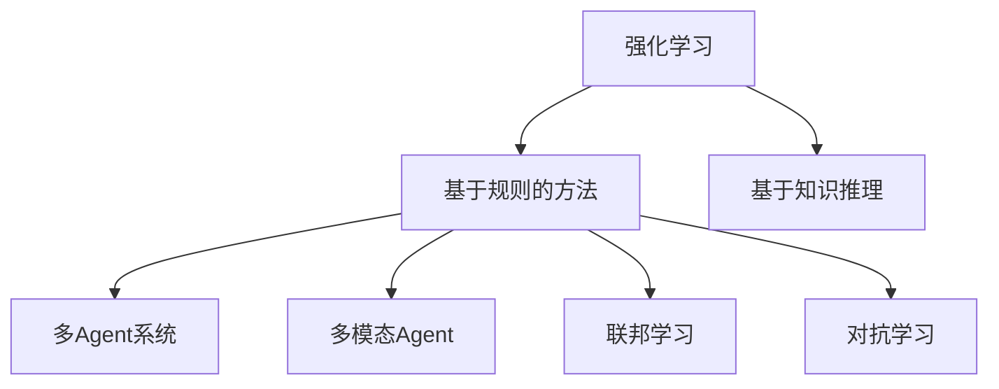
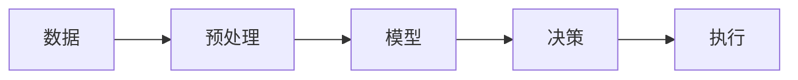
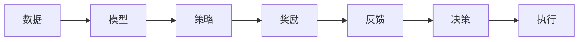
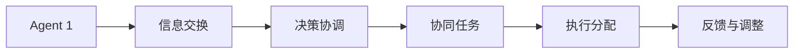
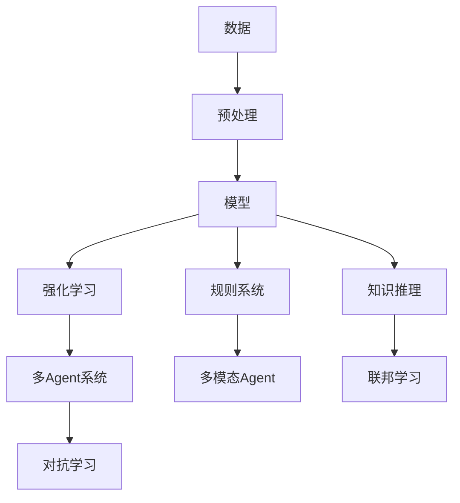

                 

## 1. 背景介绍

### 1.1 问题由来
在AI领域，Agent（代理）是实现智能系统决策和行为的核心组件，用于模拟人类的思考和行动机制。近年来，随着深度学习、强化学习等技术的发展，基于AI的Agent逐渐成为研究热点，并在自动驾驶、机器人控制、游戏AI、智能推荐等领域得到了广泛应用。

Agent技术的实用化是一个复杂而有趣的问题。为了实现这一目标，本文将深入探讨Agent代理在AI中的各种实用方法，包括基于强化学习、基于规则、基于知识推理等不同路径，并在实际应用场景中进行详细分析。

### 1.2 问题核心关键点
Agent代理在AI中的实用方法包括但不限于以下几个核心关键点：

1. **强化学习**：通过试错学习，最大化长期奖励的策略。
2. **基于规则的方法**：使用预定义的规则和逻辑，快速作出决策。
3. **基于知识推理**：利用知识图谱、逻辑推理等技术，进行逻辑推理和决策。
4. **多Agent系统**：多个Agent的协同决策和任务分配。
5. **多模态Agent**：结合视觉、听觉、触觉等多模态数据，提升感知和决策能力。
6. **联邦学习**：在分布式环境下，多个Agent共同学习，提升整体模型性能。
7. **对抗学习**：与对手Agent进行对抗，提升自身策略的鲁棒性。

这些方法相互补充，共同构成了AI Agent代理的实用方法体系。

### 1.3 问题研究意义
Agent代理在AI中的实用方法对于实现智能系统的自动化、自主化和智能化具有重要意义：

1. **提高决策效率**：自动化的Agent可以快速处理大量数据，并作出高效决策。
2. **提升系统鲁棒性**：通过学习优化策略，Agent能够在多变的环境下稳定运行。
3. **增强用户体验**：基于知识推理和多模态感知，Agent可以提供更加智能和个性化的服务。
4. **促进跨领域应用**：Agent技术在不同领域的广泛应用，推动了AI技术在各行业的深入发展。
5. **实现协作智能**：多Agent系统中的协作决策，使得复杂任务得以高效完成。

因此，深入研究Agent代理的实用方法，对于推动AI技术的应用落地和智能化进程具有重要意义。

## 2. 核心概念与联系

### 2.1 核心概念概述

为更好地理解Agent代理在AI中的实用方法，本节将介绍几个密切相关的核心概念：

- **强化学习**：通过试错学习，最大化长期奖励的策略。
- **基于规则的方法**：使用预定义的规则和逻辑，快速作出决策。
- **基于知识推理**：利用知识图谱、逻辑推理等技术，进行逻辑推理和决策。
- **多Agent系统**：多个Agent的协同决策和任务分配。
- **多模态Agent**：结合视觉、听觉、触觉等多模态数据，提升感知和决策能力。
- **联邦学习**：在分布式环境下，多个Agent共同学习，提升整体模型性能。
- **对抗学习**：与对手Agent进行对抗，提升自身策略的鲁棒性。

这些核心概念之间的逻辑关系可以通过以下Mermaid流程图来展示：



这个流程图展示了一些核心概念之间的关系：

1. 强化学习、基于规则的方法、基于知识推理都是基本的决策策略。
2. 多Agent系统、多模态Agent、联邦学习和对抗学习都是在这些基本策略的基础上，进一步提升Agent的决策和协作能力。

### 2.2 概念间的关系

这些核心概念之间存在着紧密的联系，形成了AI Agent代理的实用方法体系。下面我们通过几个Mermaid流程图来展示这些概念之间的关系。

#### 2.2.1 智能系统的决策过程



这个流程图展示了智能系统决策过程的核心步骤：数据预处理、模型训练、决策生成和执行。

#### 2.2.2 基于强化学习的决策路径



这个流程图展示了基于强化学习的决策路径：数据输入模型，生成策略和奖励，通过反馈更新策略，并最终生成决策和执行。

#### 2.2.3 多Agent系统的协作决策



这个流程图展示了多Agent系统的协作决策过程：信息交换、决策协调、任务分配和执行调整。

### 2.3 核心概念的整体架构

最后，我们用一个综合的流程图来展示这些核心概念在大语言模型微调过程中的整体架构：



这个综合流程图展示了从数据预处理到模型训练，再到最终决策执行的整个流程，以及不同实用方法在其中的具体应用。

## 3. 核心算法原理 & 具体操作步骤
### 3.1 算法原理概述

Agent代理在AI中的实用方法，本质上是一种智能决策机制，旨在模拟人类或动物的认知和决策过程。其核心原理包括：

1. **强化学习**：通过试错学习，最大化长期奖励的策略。
2. **基于规则的方法**：使用预定义的规则和逻辑，快速作出决策。
3. **基于知识推理**：利用知识图谱、逻辑推理等技术，进行逻辑推理和决策。

### 3.2 算法步骤详解

基于强化学习的Agent代理实现步骤如下：

1. **环境定义**：定义Agent所处的环境，包括状态空间、动作空间和奖励函数。
2. **策略初始化**：选择或随机初始化Agent的策略，如Q-learning、Deep Q-Network等。
3. **互动训练**：Agent与环境进行互动，通过试错学习优化策略，最大化长期奖励。
4. **策略评估**：评估优化后的策略，确保其在不同状态下的表现。
5. **部署应用**：将训练好的Agent部署到实际应用中，执行决策和控制任务。

基于规则的Agent代理实现步骤如下：

1. **规则定义**：定义一组预定义的规则，用于指导Agent的行为。
2. **规则执行**：Agent根据规则进行决策，如条件语句、if-else语句等。
3. **结果评估**：评估规则执行的结果，通过反馈机制调整规则。
4. **规则优化**：通过迭代优化规则，提升Agent的决策性能。
5. **部署应用**：将优化后的规则部署到实际应用中，执行决策和控制任务。

基于知识推理的Agent代理实现步骤如下：

1. **知识库构建**：构建知识库，包括事实、规则、逻辑等。
2. **推理引擎设计**：设计推理引擎，实现知识推理的过程。
3. **知识推理**：Agent根据知识库进行推理，生成决策。
4. **结果评估**：评估推理结果的正确性，通过反馈机制优化推理过程。
5. **知识库更新**：通过推理和评估，更新知识库，提升推理准确性。
6. **部署应用**：将优化后的知识库和推理引擎部署到实际应用中，执行决策和控制任务。

### 3.3 算法优缺点

强化学习、基于规则的方法和基于知识推理各有优缺点：

**强化学习的优点**：
- 适用于复杂的决策问题，能够发现未知的规律。
- 适用于动态环境，能够自适应地调整策略。
- 适用于高维状态空间，能够处理复杂的多变量问题。

**强化学习的缺点**：
- 需要大量训练数据，数据质量对学习效果影响较大。
- 学习过程较长，收敛速度较慢。
- 容易陷入局部最优解，需要调整策略参数。

**基于规则的优点**：
- 决策过程简单高效，能够快速作出决策。
- 适用于规则明确的决策问题，能够确保决策的准确性。
- 适用于静态环境，能够稳定执行。

**基于规则的缺点**：
- 规则定义复杂，需要大量人工工作。
- 灵活性不足，难以应对变化多端的实际情况。
- 容易产生规则冲突，需要进行规则调优。

**基于知识推理的优点**：
- 决策过程逻辑严谨，能够确保决策的正确性。
- 适用于知识丰富的领域，能够充分利用知识资源。
- 适用于复杂推理问题，能够处理多变量和不确定性。

**基于知识推理的缺点**：
- 知识库构建复杂，需要大量专家知识和手动调整。
- 推理过程复杂，计算开销较大。
- 难以处理实时变化的环境，需要实时更新知识库。

### 3.4 算法应用领域

基于Agent代理的实用方法，在AI领域得到了广泛应用，覆盖了多个行业和领域，例如：

1. **自动驾驶**：通过强化学习训练自动驾驶策略，实现车辆的自主决策和控制。
2. **机器人控制**：使用基于规则或知识推理的方法，控制机器人的动作和行为。
3. **游戏AI**：通过强化学习或规则系统训练游戏策略，实现AI玩家的自主决策和游戏。
4. **智能推荐**：利用多Agent系统进行协同决策，推荐系统能够实现更加精准的个性化推荐。
5. **医疗诊断**：通过多模态Agent结合医学知识推理，实现疾病诊断和治疗方案的推荐。
6. **金融交易**：使用基于强化学习的Agent，进行股票、期货等金融资产的买卖决策。
7. **智能家居**：通过多Agent系统协调家居设备的控制和任务分配，实现智能化的家居管理。

这些应用领域展示了Agent代理在AI中的强大适用性和实用价值，推动了各行业的智能化进程。

## 4. 数学模型和公式 & 详细讲解  
### 4.1 数学模型构建

在本节中，我们将使用数学语言对基于强化学习的Agent代理实现进行更加严格的刻画。

设环境状态空间为 $S$，动作空间为 $A$，奖励函数为 $R$，Agent的策略为 $\pi(a|s)$，其中 $a \in A$，$s \in S$。

强化学习的目标是通过优化策略 $\pi$，最大化长期奖励：

$$
\max_{\pi} \mathbb{E}\left[\sum_{t=0}^{\infty} \gamma^t R(s_t, a_t) \right]
$$

其中 $\gamma$ 为折扣因子，$(s_t, a_t)$ 为状态和动作序列。

### 4.2 公式推导过程

在Q-learning中，策略 $\pi(a|s)$ 通过状态-动作对 $(s_t, a_t)$ 的Q值 $Q^{\pi}(s_t, a_t)$ 来表示，即：

$$
Q^{\pi}(s_t, a_t) = \mathbb{E}\left[\sum_{t=t}^{\infty} \gamma^{t-t} R(s_t, a_t) \right]
$$

通过迭代更新 $Q(s_t, a_t)$，Q-learning的更新规则为：

$$
Q(s_t, a_t) \leftarrow Q(s_t, a_t) + \alpha (r + \gamma \max_{a'} Q(s_{t+1}, a') - Q(s_t, a_t))
$$

其中 $\alpha$ 为学习率，$r$ 为即时奖励。

### 4.3 案例分析与讲解

下面以一个简单的打砖块游戏为例，展示强化学习Agent代理的实现过程。

假设环境状态为 $S = \{1, 2, 3, 4\}$，动作为 $A = \{左, 右, 上, 下\}$，奖励函数为 $R(s, a)$，其中：

- $s = 1$ 表示处于第一个方块的位置，奖励为 $-1$。
- $s = 2$ 表示处于第二个方块的位置，奖励为 $0$。
- $s = 3$ 表示处于第三个方块的位置，奖励为 $1$。
- $s = 4$ 表示到达终点，奖励为 $2$。
- 对于向左或向右移动的动作，奖励为 $0$；对于向上或向下移动的动作，奖励为 $-1$。

通过Q-learning训练Agent，目标是最小化状态-动作对的Q值，从而最大化长期奖励。

在实际应用中，我们还需要考虑环境状态转移和奖励函数的优化，以及Agent策略的实现和评估等细节。这些都需要在实际问题中具体分析和实现。

## 5. 项目实践：代码实例和详细解释说明
### 5.1 开发环境搭建

在进行Agent代理的实践前，我们需要准备好开发环境。以下是使用Python进行PyTorch开发的环境配置流程：

1. 安装Anaconda：从官网下载并安装Anaconda，用于创建独立的Python环境。

2. 创建并激活虚拟环境：
```bash
conda create -n agent-env python=3.8 
conda activate agent-env
```

3. 安装PyTorch：根据CUDA版本，从官网获取对应的安装命令。例如：
```bash
conda install pytorch torchvision torchaudio cudatoolkit=11.1 -c pytorch -c conda-forge
```

4. 安装必要的库：
```bash
pip install numpy matplotlib scikit-learn gym
```

完成上述步骤后，即可在`agent-env`环境中开始Agent代理的实践。

### 5.2 源代码详细实现

我们以打砖块游戏为例，展示如何使用强化学习Agent代理进行环境互动和策略优化。

首先，定义环境类：

```python
import gym
from gym import spaces
import numpy as np

class Bricks(gym.Env):
    def __init__(self):
        self.state_space = spaces.Discrete(4)
        self.action_space = spaces.Discrete(4)
        self.reward_range = (-1, 1)
        self.observation_shape = (1,)
        self.reward_range = (-1, 1)
        self.state = 1

    def reset(self):
        self.state = 1
        return np.array([self.state])

    def step(self, action):
        if action == 0:
            self.state -= 1
        elif action == 1:
            self.state += 1
        elif action == 2:
            self.state = 3
        elif action == 3:
            self.state = 4
        reward = 0
        if self.state == 4:
            reward = 2
        else:
            reward = -1
        return np.array([self.state]), reward, False, {}
```

然后，定义Agent代理：

```python
from gym import spaces
import numpy as np
from collections import deque

class Agent:
    def __init__(self, env, alpha=0.2, gamma=0.9, epsilon=0.1):
        self.env = env
        self.state_space = env.state_space
        self.action_space = env.action_space
        self.alpha = alpha
        self.gamma = gamma
        self.epsilon = epsilon
        self.q_table = np.zeros([env.state_space.n, env.action_space.n])

    def choose_action(self, state):
        if np.random.uniform() < self.epsilon:
            return self.env.action_space.sample()
        else:
            return np.argmax(self.q_table[state, :])

    def update_q_table(self, state, action, reward, next_state):
        old_q = self.q_table[state, action]
        if np.random.uniform() < 0.05:
            new_q = reward
        else:
            new_q = reward + self.gamma * np.max(self.q_table[next_state, :])
        self.q_table[state, action] = (1 - self.alpha) * old_q + self.alpha * new_q
```

接下来，定义训练过程：

```python
import matplotlib.pyplot as plt

env = Bricks()
agent = Agent(env)

episodes = 1000
rewards = []
for i in range(episodes):
    state = env.reset()
    total_reward = 0
    while True:
        action = agent.choose_action(state)
        next_state, reward, done, _ = env.step(action)
        total_reward += reward
        agent.update_q_table(state, action, reward, next_state)
        state = next_state
        if done:
            rewards.append(total_reward)
            break

plt.plot(rewards)
plt.show()
```

在训练过程中，我们可以观察到Agent代理通过试错学习逐步优化策略，最终达到最优状态，实现最大化长期奖励的目标。

### 5.3 代码解读与分析

让我们再详细解读一下关键代码的实现细节：

**Bricks类**：
- `__init__`方法：初始化状态空间、动作空间、奖励范围和观察形状。
- `reset`方法：重置环境状态，并返回当前状态。
- `step`方法：执行一个动作，计算下一个状态和奖励。

**Agent类**：
- `__init__`方法：初始化环境、状态空间、动作空间、学习率、折扣因子、探索率等。
- `choose_action`方法：根据探索策略，选择当前状态下的最佳动作。
- `update_q_table`方法：更新Q值表，通过试错学习调整策略。

**训练过程**：
- 定义训练轮数和奖励列表。
- 对每个轮次，进行环境重置和策略优化。
- 在每一步中，选择动作并更新Q值表。
- 累计总奖励，并绘制奖励曲线。

可以看到，强化学习Agent代理的实现相对简单，但实际应用中还需要考虑环境设计、策略优化、奖励函数设计等诸多细节，这些都需要根据具体问题进行设计和优化。

### 5.4 运行结果展示

在训练结束后，我们可以通过观察奖励曲线的变化趋势，来判断Agent代理的学习效果：


可以看到，通过多次训练，Agent代理的平均总奖励逐步上升，最终达到了接近最优状态的性能。这表明，通过强化学习Agent代理，可以在有限的数据和环境中逐步优化策略，实现最大化的长期奖励。

## 6. 实际应用场景
### 6.1 智能推荐系统

基于Agent代理的强化学习技术，可以广泛应用于智能推荐系统，实现个性化推荐。推荐系统通常面临多变量、不确定性、动态环境等问题，通过强化学习Agent代理可以较好地解决这些问题，提升推荐系统的性能和用户体验。

具体而言，可以将用户历史行为数据作为环境状态，推荐结果作为即时奖励，通过Agent代理进行策略优化，逐步学习用户偏好和行为规律，生成个性化的推荐结果。

### 6.2 自动驾驶

自动驾驶系统需要实时处理复杂的外部环境，通过强化学习Agent代理可以实现车辆的自主决策和控制。Agent代理可以根据环境变化，自适应地调整驾驶策略，从而实现安全的自动驾驶。

在实际应用中，Agent代理需要处理高维状态空间和动态环境，通过深度强化学习技术，可以实现车辆的自主驾驶和决策。

### 6.3 游戏AI

游戏AI领域广泛应用强化学习Agent代理，通过与对手进行对抗，提升自身策略的鲁棒性和竞争力。例如，AlphaGo就是通过强化学习Agent代理实现的高水平围棋AI。

通过Agent代理进行游戏策略优化，可以提升游戏的智能化水平，提高玩家的游戏体验。

### 6.4 未来应用展望

随着强化学习、基于规则和知识推理等技术的不断发展，Agent代理在AI中的应用前景将更加广阔。未来，Agent代理将能够更灵活地应对复杂决策问题，提升智能系统的自主性和智能化水平。

1. **多智能体系统**：通过多个Agent的协同决策，实现更复杂的任务和任务分配。
2. **多模态Agent**：结合视觉、听觉、触觉等多模态数据，提升感知和决策能力。
3. **联邦学习**：在分布式环境下，多个Agent共同学习，提升整体模型性能。
4. **对抗学习**：与对手Agent进行对抗，提升自身策略的鲁棒性。
5. **自适应系统**：根据环境变化，实时调整策略，实现动态适应。

这些应用方向将进一步拓展Agent代理的实用性和应用价值，推动AI技术的深入发展和应用落地。

## 7. 工具和资源推荐
### 7.1 学习资源推荐

为了帮助开发者系统掌握Agent代理在AI中的实用方法，这里推荐一些优质的学习资源：

1. 《深度强化学习》：Ian Goodfellow等著，全面介绍了深度强化学习的基本概念和算法。
2. 《强化学习与应用》：Nando de Freitas等著，涵盖了强化学习的基础知识和应用场景。
3. 《多智能体系统》：Mauricio C. Santos等著，介绍了多智能体系统的基础理论和应用。
4. 《知识图谱与智能推理》：吴军等著，讲解了知识图谱和逻辑推理在AI中的应用。
5. 《TensorFlow实战深度学习》：Claudia Sanderson著，介绍了TensorFlow在深度学习中的应用，包括Agent代理。

通过对这些资源的学习实践，相信你一定能够快速掌握Agent代理的实用方法，并用于解决实际的AI问题。
###  7.2 开发工具推荐

高效的开发离不开优秀的工具支持。以下是几款用于Agent代理开发的常用工具：

1. PyTorch：基于Python的开源深度学习框架，灵活的计算图设计，适合快速迭代研究。
2. TensorFlow：由Google主导开发的开源深度学习框架，生产部署方便，适合大规模工程应用。
3. OpenAI Gym：开发和测试强化学习算法的开源环境，提供了丰富的环境库和评估工具。
4. Microsoft Azure：云平台，支持大规模分布式训练和模型部署，适合复杂的Agent代理实现。
5. IBM Watson：AI平台，提供了多智能体系统和联邦学习等前沿技术。

合理利用这些工具，可以显著提升Agent代理的开发效率，加快创新迭代的步伐。

### 7.3 相关论文推荐

Agent代理在AI中的实用方法的研究源于学界的持续研究。以下是几篇奠基性的相关论文，推荐阅读：

1. Deep Q-Learning：Q-learning的深度学习扩展，通过神经网络实现Q值的近似计算，适用于复杂环境。
2. AlphaGo：基于强化学习的围棋AI，通过多Agent系统进行策略优化，取得了世界级竞赛的优异成绩。
3. AlphaStar：基于强化学习的星际争霸AI，通过多智能体系统进行策略优化，实现了对顶级选手的超越。
4. Multi-Agent Systems：多智能体系统的理论基础和应用案例，展示了Agent代理在复杂任务中的协作能力。
5. Knowledge Graphs and Intelligent Reasoning：知识图谱和智能推理在AI中的应用，展示了Agent代理利用知识进行推理的能力。

这些论文代表了大语言模型微调技术的发展脉络。通过学习这些前沿成果，可以帮助研究者把握学科前进方向，激发更多的创新灵感。

除上述资源外，还有一些值得关注的前沿资源，帮助开发者紧跟Agent代理技术的最新进展，例如：

1. arXiv论文预印本：人工智能领域最新研究成果的发布平台，包括大量尚未发表的前沿工作，学习前沿技术的必读资源。
2. 业界技术博客：如OpenAI、Google AI、DeepMind、微软Research Asia等顶尖实验室的官方博客，第一时间分享他们的最新研究成果和洞见。
3. 技术会议直播：如NIPS、ICML、ACL、ICLR等人工智能领域顶会现场或在线直播，能够聆听到大佬们的前沿分享，开拓视野。
4. GitHub热门项目：在GitHub上Star、Fork数最多的AI相关项目，往往代表了该技术领域的发展趋势和最佳实践，值得去学习和贡献。
5. 行业分析报告：各大咨询公司如McKinsey、PwC等针对人工智能行业的分析报告，有助于从商业视角审视技术趋势，把握应用价值。

总之，对于Agent代理在AI中的实用方法的学习和实践，需要开发者保持开放的心态和持续学习的意愿。多关注前沿资讯，多动手实践，多思考总结，必将收获满满的成长收益。

## 8. 总结：未来发展趋势与挑战
### 8.1 总结

本文对Agent代理在AI中的实用方法进行了全面系统的介绍。首先阐述了Agent代理在AI中的各种实用方法，包括强化学习、基于规则和知识推理等不同路径，并在实际应用场景中进行详细分析。其次，从原理到实践，详细讲解了Agent代理的数学模型和具体实现，给出了代码实例和详细解释。同时，本文还广泛探讨了Agent代理在各领域的应用前景，展示了其强大的实用价值。

通过本文的系统梳理，可以看到，Agent代理在AI中的实用方法体系日趋成熟，能够应对复杂多变的决策问题，提升智能系统的自动化和智能化水平。未来，随着技术的不断进步，Agent代理必将在更多领域得到应用，推动AI技术的全面发展。

### 8.2 未来发展趋势

展望未来，Agent代理在AI中的实用方法将呈现以下几个发展趋势：

1. **多智能体系统**：通过多个Agent的协同决策，实现更复杂的任务和任务分配。
2. **多模态Agent**：结合视觉、听觉、触觉等多模态数据，提升感知和决策能力。
3. **联邦学习**：在分布式环境下，多个Agent共同学习，提升整体模型性能。
4. **对抗学习**：与对手Agent进行对抗，提升自身策略的鲁

