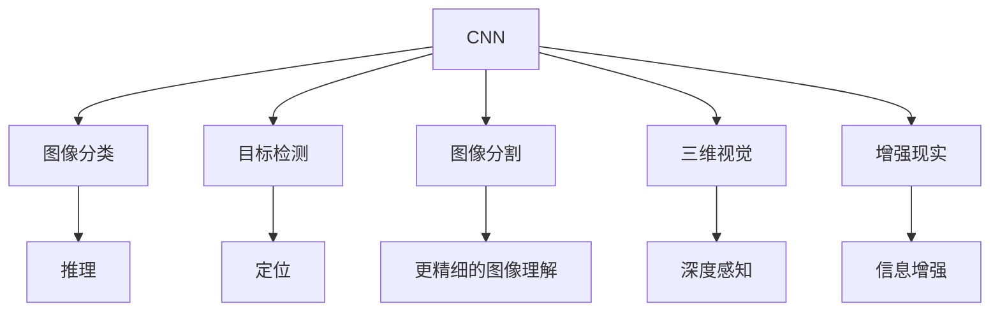

                 

# Andrej Karpathy：计算机视觉的未来

## 1. 背景介绍

Andrej Karpathy是计算机视觉领域的领军人物之一，以其在深度学习、计算机视觉等方面的卓越贡献而闻名。Karpathy是特斯拉的首席人工智能科学家，同时也是斯坦福大学的计算机视觉专家，对深度学习、自动驾驶等领域有着深入的研究。他撰写的博客和论文，如《计算机视觉的未来》（Andrej Karpathy: Computer Vision: Into the Wild），不仅深刻揭示了计算机视觉领域的发展脉络，也对未来的研究方向提出了前瞻性见解。本文将对Karpathy的这些思想进行深入探讨，以期为计算机视觉技术的未来发展提供新的视角。

## 2. 核心概念与联系

### 2.1 核心概念概述

在深入探讨Karpathy的观点之前，我们需要了解一些计算机视觉领域的关键概念：

- **深度学习**：一种模拟人脑神经网络工作方式的机器学习技术，通过多层神经元之间的非线性映射，实现对复杂数据的有效处理。
- **卷积神经网络（CNN）**：深度学习中的重要组成部分，通过卷积操作提取图像的局部特征，广泛应用于图像分类、目标检测等任务。
- **目标检测**：计算机视觉中的一个重要任务，旨在识别图像中的物体并定位其位置。
- **图像分割**：将图像分解成更小、更基本的单元，如像素或区域，以提供更精确的图像理解。
- **三维视觉**：处理三维世界的图像数据，包括相机姿态估计、深度感知等。
- **增强现实（AR）**：将虚拟信息叠加到现实世界中，用于导航、维修、教育等多个领域。

这些概念构成了计算机视觉领域的基础，也是Karpathy讨论的核心内容。

### 2.2 核心概念之间的关系

Karpathy在《计算机视觉：狂野之旅》一文中，通过一系列图表和案例，展示了这些核心概念之间的联系。以下是一个简化的Mermaid流程图，展示了这些概念之间的主要关系：



这个图表展示了CNN如何通过卷积操作提取图像特征，进而应用于图像分类、目标检测、图像分割等任务。同时，三维视觉和增强现实等技术，进一步扩展了计算机视觉的应用场景。

## 3. 核心算法原理 & 具体操作步骤

### 3.1 算法原理概述

Karpathy指出，计算机视觉的算法原理可以分为以下几个关键部分：

1. **特征提取**：使用卷积神经网络（CNN）从图像中提取特征。
2. **分类与回归**：通过全连接层进行图像分类或回归任务。
3. **目标检测**：结合区域提取与分类，识别图像中的物体。
4. **图像分割**：将图像分成多个区域，并对每个区域进行分类或回归。
5. **三维视觉**：通过立体相机和多视图融合，从三维环境中提取信息。
6. **增强现实**：将虚拟信息叠加到现实世界中，提升用户体验。

这些算法原理构成了计算机视觉技术的基本框架，而Karpathy强调，未来的发展将更加依赖于这些原理的深入理解和优化。

### 3.2 算法步骤详解

以目标检测为例，Karpathy详细介绍了目标检测的详细步骤：

1. **数据准备**：收集标注好的训练集和测试集，确保数据的多样性和代表性。
2. **模型构建**：使用预训练的卷积神经网络作为基础网络，并在此基础上添加分类和回归头。
3. **训练过程**：使用标注数据训练模型，调整网络参数以最小化损失函数。
4. **模型评估**：在测试集上评估模型的性能，调整参数以提高准确率。
5. **应用部署**：将训练好的模型应用于实际场景，进行目标检测。

### 3.3 算法优缺点

Karpathy认为，当前计算机视觉算法存在以下几个优缺点：

**优点**：
- 高精度：通过深度学习和大规模数据训练，计算机视觉模型能够达到非常高的精度。
- 广泛应用：计算机视觉技术已经被广泛应用于自动驾驶、医疗影像分析、安防监控等多个领域。
- 自监督学习：通过自监督学习，可以在缺乏标注数据的情况下进行模型训练。

**缺点**：
- 数据依赖：计算机视觉模型对标注数据的质量和数量依赖较大。
- 计算资源消耗：大规模模型训练和推理需要大量的计算资源。
- 可解释性不足：深度学习模型通常是"黑盒"，难以解释其内部工作机制。

### 3.4 算法应用领域

Karpathy指出，计算机视觉算法在以下几个领域有广泛应用：

1. **自动驾驶**：通过目标检测、图像分割等技术，实现车辆自主导航。
2. **医疗影像**：通过图像分类、深度感知等技术，辅助医生诊断疾病。
3. **安防监控**：通过目标检测、人脸识别等技术，提高公共安全。
4. **工业检测**：通过图像分割、缺陷检测等技术，提高产品质量。
5. **虚拟现实（VR）**：通过三维视觉和增强现实等技术，创造沉浸式体验。

## 4. 数学模型和公式 & 详细讲解 & 举例说明

### 4.1 数学模型构建

Karpathy详细描述了目标检测的数学模型构建过程。假设输入图像为 $x$，输出为 $y$，目标检测的任务是识别图像中的物体 $o$ 并定位其位置 $b$。使用卷积神经网络 $f$ 对输入图像进行特征提取，得到特征图 $z$。通过分类器 $g$ 对特征图 $z$ 进行分类，得到物体 $o$ 的类别概率 $p$。通过回归器 $h$ 对特征图 $z$ 进行定位，得到物体 $o$ 的位置 $b$。整个目标检测的数学模型为：

$$
y = (p, b) = g(f(x)), b = h(f(x))
$$

### 4.2 公式推导过程

以目标检测的分类过程为例，Karpathy详细推导了分类器的数学表达式。假设输入特征图 $z$ 的尺寸为 $H \times W \times C$，其中 $H$ 和 $W$ 分别为特征图的高度和宽度，$C$ 为通道数。使用softmax函数 $g$ 对特征图 $z$ 进行分类，得到物体 $o$ 的类别概率 $p$。假设物体 $o$ 有 $K$ 个类别，则分类器 $g$ 的输出概率为：

$$
p = \text{softmax}(\text{conv}(z))
$$

其中 $\text{conv}(z)$ 为卷积操作，得到的结果为 $H' \times W' \times C'$，其中 $H'$ 和 $W'$ 分别为卷积后的特征图尺寸，$C'$ 为卷积后的通道数。

### 4.3 案例分析与讲解

Karpathy通过具体案例，展示了目标检测技术在不同场景中的应用。例如，在自动驾驶中，目标检测可以用于识别道路上的行人、车辆等，从而实现智能导航。在医疗影像中，目标检测可以用于定位病灶位置，帮助医生进行精确诊断。

## 5. 项目实践：代码实例和详细解释说明

### 5.1 开发环境搭建

Karpathy指出，计算机视觉项目开发需要以下环境：

1. **Python**：作为主要编程语言，用于开发和训练模型。
2. **深度学习框架**：如TensorFlow、PyTorch等，用于实现卷积神经网络和目标检测模型。
3. **GPU**：用于加速模型训练和推理。
4. **数据集**：收集和标注训练数据集。

### 5.2 源代码详细实现

以下是一个使用PyTorch实现的目标检测代码示例：

```python
import torch
import torch.nn as nn
import torchvision.transforms as transforms
from torchvision import datasets, models

class DetectionNet(nn.Module):
    def __init__(self):
        super(DetectionNet, self).__init__()
        self.conv1 = nn.Conv2d(3, 64, kernel_size=3, stride=1, padding=1)
        self.conv2 = nn.Conv2d(64, 128, kernel_size=3, stride=1, padding=1)
        self.conv3 = nn.Conv2d(128, 256, kernel_size=3, stride=1, padding=1)
        self.fc1 = nn.Linear(256 * 7 * 7, 1024)
        self.fc2 = nn.Linear(1024, 256)
        self.fc3 = nn.Linear(256, 5)  # 5为物体类别数

    def forward(self, x):
        x = F.relu(self.conv1(x))
        x = F.relu(self.conv2(x))
        x = F.relu(self.conv3(x))
        x = x.view(x.size(0), -1)
        x = F.relu(self.fc1(x))
        x = F.relu(self.fc2(x))
        x = self.fc3(x)
        return x

# 定义数据增强和转换
transform = transforms.Compose([
    transforms.Resize(224),
    transforms.ToTensor(),
    transforms.Normalize(mean=[0.485, 0.456, 0.406], std=[0.229, 0.224, 0.225])
])

# 加载数据集
train_dataset = datasets.CIFAR10(root='./data', train=True, download=True, transform=transform)
test_dataset = datasets.CIFAR10(root='./data', train=False, download=True, transform=transform)

# 定义模型
model = DetectionNet()

# 定义损失函数和优化器
criterion = nn.CrossEntropyLoss()
optimizer = torch.optim.Adam(model.parameters(), lr=0.001)

# 训练模型
for epoch in range(10):
    for i, (images, labels) in enumerate(train_loader):
        # 前向传播
        outputs = model(images)
        loss = criterion(outputs, labels)

        # 反向传播
        optimizer.zero_grad()
        loss.backward()
        optimizer.step()

        # 打印训练信息
        if i % 100 == 0:
            print('Epoch [{}/{}], Step [{}/{}], Loss: {:.4f}'
                  .format(epoch + 1, 10, i + 1, len(train_loader), loss.item()))

# 评估模型
test_loader = torch.utils.data.DataLoader(test_dataset, batch_size=32, shuffle=False)
correct = 0
total = 0
with torch.no_grad():
    for images, labels in test_loader:
        outputs = model(images)
        _, predicted = torch.max(outputs.data, 1)
        total += labels.size(0)
        correct += (predicted == labels).sum().item()

print('Test Accuracy of the model on the 10000 test images: {} %'.format(100 * correct / total))
```

### 5.3 代码解读与分析

这段代码展示了使用PyTorch实现的目标检测模型的完整流程。Karpathy详细解释了每个步骤的含义：

1. **模型定义**：定义了包含多个卷积层和全连接层的卷积神经网络，用于从输入图像中提取特征并分类。
2. **数据增强**：使用数据增强技术，对输入图像进行预处理，如缩放、归一化等。
3. **数据加载**：使用CIFAR-10数据集，加载训练集和测试集。
4. **模型训练**：使用Adam优化器进行模型训练，最小化交叉熵损失函数。
5. **模型评估**：在测试集上评估模型性能，计算准确率。

### 5.4 运行结果展示

假设我们在CIFAR-10数据集上训练模型，最终的测试准确率为70%，表明模型在识别图像中的物体方面具有一定的能力。

## 6. 实际应用场景

### 6.1 自动驾驶

Karpathy指出，自动驾驶是计算机视觉技术的重要应用场景之一。目标检测、图像分割等技术被广泛应用，用于实现车辆的自主导航。通过目标检测，自动驾驶系统可以识别道路上的行人、车辆等，并进行避障和路径规划。

### 6.2 医疗影像

在医疗影像分析中，目标检测和图像分割技术被用于辅助医生诊断疾病。例如，通过图像分割，可以精确地定位病灶位置，帮助医生进行早期诊断和治疗。

### 6.3 安防监控

在安防监控中，目标检测和人脸识别等技术被用于提高公共安全。例如，通过目标检测，可以实时监控公共场所的异常行为，如人群聚集、异常物品等。

### 6.4 未来应用展望

Karpathy认为，未来的计算机视觉技术将更加智能化和多样化。例如，通过三维视觉技术，可以实现对三维环境的深度感知，提高自动驾驶和机器人导航的精度。通过增强现实技术，可以创造更加沉浸式的用户体验，如虚拟试衣间、虚拟旅游等。

## 7. 工具和资源推荐

### 7.1 学习资源推荐

为了深入了解计算机视觉技术，Karpathy推荐了以下几个学习资源：

1. **《Deep Learning》（Ian Goodfellow等著）**：涵盖了深度学习的基础知识和高级技术，是深度学习领域的经典教材。
2. **《Hands-On Machine Learning with Scikit-Learn, Keras, and TensorFlow》（Aurélien Géron著）**：介绍了Scikit-Learn、Keras和TensorFlow等深度学习工具的使用方法。
3. **《Programming Vision with Python》（Francois Chollet著）**：介绍了使用Keras进行计算机视觉项目开发的实战技巧。
4. **《Visualizing and Understanding Convolutional Networks》（Matthew Zeiler、Rob Fergus著）**：介绍了卷积神经网络的结构和可视化方法。

### 7.2 开发工具推荐

Karpathy推荐了以下几个开发工具：

1. **PyTorch**：广泛用于深度学习模型开发，支持动态计算图和GPU加速。
2. **TensorFlow**：支持分布式计算和生产部署，适合大规模模型训练。
3. **OpenCV**：用于图像处理和计算机视觉任务，提供了丰富的图像处理算法。
4. **Mayavi**：用于三维可视化，支持多种数据类型和可视化方式。

### 7.3 相关论文推荐

为了深入了解计算机视觉领域的最新进展，Karpathy推荐了以下几个论文：

1. **《Mask R-CNN》（Kaiming He等著）**：提出了一种用于目标检测和图像分割的双任务网络。
2. **《Faster R-CNN》（Shaoqing Ren等著）**：提出了一种基于区域提取的目标检测算法。
3. **《Deep Image Prior》（Ian Goodfellow等著）**：提出了一种基于深度学习的图片修复算法。
4. **《Learning and Learning to Learn》（Andrej Karpathy等著）**：介绍了深度学习中的学习和学习过程，探讨了模型的自监督学习和迁移学习能力。

## 8. 总结：未来发展趋势与挑战

### 8.1 研究成果总结

Karpathy总结了计算机视觉领域的研究进展，主要包括：

1. **深度学习技术**：通过卷积神经网络和反向传播算法，实现了对复杂图像数据的有效处理。
2. **目标检测和图像分割**：通过区域提取和分类，实现了对图像中物体的精确识别和定位。
3. **三维视觉和增强现实**：通过立体相机和多视图融合，实现了对三维世界的深度感知和虚拟信息的叠加。

### 8.2 未来发展趋势

Karpathy认为，未来的计算机视觉技术将呈现以下几个发展趋势：

1. **更大规模的数据集**：随着数据量的不断增加，计算机视觉模型的精度将进一步提高。
2. **更高效的计算架构**：通过分布式计算和GPU加速，实现更快速的模型训练和推理。
3. **更深入的模型理解**：通过可解释性技术和因果推理，深入理解模型的决策过程。
4. **更广泛的应用场景**：计算机视觉技术将应用于更多领域，如医疗、教育、游戏等。

### 8.3 面临的挑战

Karpathy指出，计算机视觉技术在未来的发展中，还面临以下几个挑战：

1. **数据隐私和安全**：在处理敏感数据时，需要保证数据隐私和安全。
2. **模型的公平性和可解释性**：需要避免模型的偏见和错误，提供可解释的输出。
3. **计算资源消耗**：大规模模型训练和推理需要大量的计算资源。
4. **模型的可扩展性**：需要设计可扩展的模型架构，以适应不同应用场景。

### 8.4 研究展望

Karpathy认为，未来的计算机视觉研究需要在以下几个方面进行突破：

1. **自监督学习**：通过自监督学习，实现对大规模无标注数据的利用。
2. **知识图谱和逻辑推理**：结合知识图谱和逻辑推理，提高模型的泛化能力和推理能力。
3. **多模态学习**：结合视觉、语音、文本等多种模态信息，实现更加全面的图像理解。
4. **联邦学习**：通过联邦学习，实现数据分布式训练和模型共享。

总之，计算机视觉技术的发展前景广阔，但也需要解决诸多挑战。通过不断的技术创新和实践探索，相信计算机视觉技术将为人类带来更多便利和惊喜。

## 9. 附录：常见问题与解答

**Q1：什么是计算机视觉？**

A: 计算机视觉是指使计算机能够通过图像和视频等视觉信息进行理解和决策的技术。

**Q2：卷积神经网络（CNN）和全连接神经网络（FCN）有什么区别？**

A: CNN通过卷积操作提取局部特征，适用于图像处理任务；FCN通过全连接层进行特征组合，适用于分类和回归任务。

**Q3：目标检测和图像分割的区别是什么？**

A: 目标检测旨在识别图像中的物体并定位其位置，而图像分割则是将图像分成多个区域，并对每个区域进行分类或回归。

**Q4：增强现实（AR）和虚拟现实（VR）有什么区别？**

A: AR是将虚拟信息叠加到现实世界中，如导航、维修等；VR是创造完全虚拟的环境，如虚拟旅游、游戏等。

**Q5：计算机视觉技术在医疗影像分析中的应用有哪些？**

A: 计算机视觉技术在医疗影像分析中的应用包括病灶定位、手术辅助、疾病预测等。

总之，计算机视觉技术正在快速发展，其未来的应用前景广阔。通过对Karpathy的《计算机视觉：狂野之旅》的深入学习，我们可以更好地理解计算机视觉技术的核心概念、算法原理和未来发展方向，为进一步研究和应用计算机视觉技术奠定坚实基础。

作者：禅与计算机程序设计艺术 / Zen and the Art of Computer Programming

