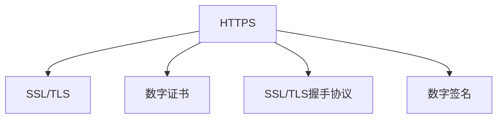

                 

# HTTPS 在 API 安全中的作用

在当今数字化时代，API（Application Programming Interface）已经成为了连接不同系统和服务的桥梁。无论是企业内部的微服务架构，还是面向公众的开放平台，API 都是不可或缺的关键组成部分。然而，随着API的普及和应用场景的扩展，API安全问题也变得愈发突出。作为最基础的互联网通信协议之一，HTTPS（HyperText Transfer Protocol Secure）在这一过程中扮演了至关重要的角色。本文将深入探讨HTTPS在API安全中的作用，以及如何通过HTTPS构建更加安全的API。

## 1. 背景介绍

### 1.1 问题由来
随着API在企业内部和外部广泛应用，API安全问题变得越来越突出。以下是一些常见的API安全威胁：

- **数据泄露**：API请求和响应中的敏感信息可能被截获和窃取。
- **拒绝服务攻击**：攻击者通过大量无效请求使API服务器过载，导致正常请求无法处理。
- **中间人攻击**：攻击者通过篡改API请求和响应数据，误导API用户。
- **认证和授权问题**：API用户身份验证不严格，授权机制不健全，容易被滥用。

这些问题不仅会严重影响企业业务运营，还可能导致重大的经济损失和声誉损害。因此，确保API安全变得尤为重要。

### 1.2 问题核心关键点
在保障API安全的多种措施中，HTTPS成为了最基本也是最有效的防护手段。以下是HTTPS在API安全中的核心关键点：

- **数据加密**：HTTPS使用SSL/TLS协议对数据进行加密传输，防止数据被截获和篡改。
- **身份验证**：HTTPS通过证书机制对请求和响应进行身份验证，确保通信双方身份的真实性。
- **防止中间人攻击**：HTTPS使用证书验证和数据加密，防止中间人攻击。
- **完整性保护**：HTTPS使用消息认证码(MAC)等技术确保数据在传输过程中的完整性。

这些核心关键点构成了HTTPS在API安全中的基石。

### 1.3 问题研究意义
通过HTTPS保障API安全，对于保护企业业务、维护用户信任、提升API使用效率具有重要意义：

1. **保护敏感信息**：HTTPS加密传输API请求和响应，防止敏感数据被窃取或篡改。
2. **增强认证和授权机制**：HTTPS通过证书验证和数字签名，确保API用户的身份和授权信息的安全。
3. **提升系统可靠性**：HTTPS防止中间人攻击和数据截改，增强了API系统的稳定性和可靠性。
4. **提高用户体验**：HTTPS保障数据传输的安全性，提升用户对API服务的信任和满意度。

综上所述，HTTPS在API安全中扮演了至关重要的角色，成为保障API安全的基础措施。

## 2. 核心概念与联系

### 2.1 核心概念概述

为更好地理解HTTPS在API安全中的作用，本节将介绍几个密切相关的核心概念：

- **HTTPS**：超文本传输安全协议，通过SSL/TLS加密传输数据，确保通信安全。
- **SSL/TLS**：安全套接层/传输层安全协议，为HTTPS提供数据加密和身份验证机制。
- **数字证书**：由可信第三方机构颁发的证书，用于验证通信双方的身份。
- **SSL/TLS握手协议**：客户端和服务器之间进行加密算法协商和密钥交换的协议。
- **数字签名**：用于验证消息完整性和身份的数字证书，防止消息被篡改。

这些核心概念之间存在着紧密的联系，形成了HTTPS在API安全中的整体架构。

### 2.2 概念间的关系

这些核心概念之间的关系可以通过以下Mermaid流程图来展示：



这个流程图展示了大语言模型微调过程中各个核心概念的关系和作用：

1. HTTPS通过SSL/TLS加密传输数据，确保通信安全。
2. SSL/TLS协议依赖数字证书进行身份验证和密钥交换。
3. 数字证书由可信第三方机构颁发，用于验证通信双方的身份。
4. SSL/TLS握手协议用于客户端和服务器之间的加密算法协商和密钥交换。
5. 数字签名用于验证消息完整性和身份，防止消息被篡改。

通过这个流程图，我们可以更清晰地理解HTTPS在API安全中的作用和机制。

## 3. 核心算法原理 & 具体操作步骤
### 3.1 算法原理概述

HTTPS的加密传输和身份验证机制主要基于SSL/TLS协议。其核心原理如下：

- **对称加密**：使用相同的密钥对数据进行加密和解密。
- **非对称加密**：使用一对公钥和私钥进行加密和解密，公钥公开，私钥保密。
- **数字证书**：包含公钥的数字证书，用于验证公钥的真实性。
- **SSL/TLS握手协议**：客户端和服务器之间通过握手协议协商加密算法和密钥。

HTTPS使用对称加密传输数据，同时通过非对称加密和数字证书机制进行身份验证。在握手协议中，客户端和服务器协商加密算法和密钥，并进行数字证书验证，确保通信双方的身份。

### 3.2 算法步骤详解

下面是HTTPS在API安全中的具体操作步骤：

**Step 1: 配置SSL/TLS证书**

- 生成服务器私钥和证书请求。
- 将证书请求发送给认证机构(CA)，获取数字证书。
- 将证书和私钥安装在服务器上。

**Step 2: 安装SSL/TLS模块**

- 在服务器上安装SSL/TLS模块，如OpenSSL。
- 配置SSL/TLS模块，设置证书路径和密码。

**Step 3: 配置API服务器**

- 在API服务器上配置SSL/TLS证书，使其能够使用HTTPS协议接收API请求。
- 配置API服务器的路由和中间件，确保所有API请求都经过HTTPS加密处理。

**Step 4: 配置客户端**

- 在客户端代码中配置HTTPS客户端，确保所有API请求使用HTTPS协议。
- 在客户端代码中设置请求头，确保API请求包含正确的用户认证信息。

**Step 5: 启动API服务**

- 启动API服务器，确保服务器能够正常接收HTTPS请求。
- 启动API客户端，确保客户端能够正常向API服务器发送HTTPS请求。

### 3.3 算法优缺点

HTTPS在API安全中的优缺点如下：

**优点**：
- **数据加密**：HTTPS使用SSL/TLS加密传输数据，确保数据在传输过程中的安全性和完整性。
- **身份验证**：HTTPS通过数字证书验证通信双方的身份，防止中间人攻击。
- **防止篡改**：HTTPS使用消息认证码(MAC)等技术确保数据在传输过程中的完整性。

**缺点**：
- **性能开销**：HTTPS需要进行SSL/TLS握手和加密解密操作，可能会影响系统性能。
- **部署复杂**：HTTPS需要配置和安装SSL/TLS证书和模块，增加了部署难度。
- **证书管理**：HTTPS依赖数字证书进行身份验证，证书管理成为系统维护中的一个重要环节。

尽管存在这些缺点，但HTTPS作为基础的安全机制，仍然是不可或缺的。

### 3.4 算法应用领域

HTTPS在API安全中的应用非常广泛，主要包括以下几个方面：

- **API接口安全**：所有API请求和响应都通过HTTPS加密传输，防止数据泄露和篡改。
- **API用户身份验证**：使用数字证书验证API用户的身份，确保用户信息的真实性和完整性。
- **API服务可用性**：通过SSL/TLS握手协议，确保API服务的稳定性和可靠性。
- **API系统的可扩展性**：HTTPS支持多域名的配置，方便API系统的扩展和维护。

## 4. 数学模型和公式 & 详细讲解 & 举例说明

### 4.1 数学模型构建

HTTPS的加密传输和身份验证机制涉及对称加密、非对称加密和数字证书等多种数学概念。以下给出这些数学模型的详细构建过程。

**对称加密模型**：

- **算法**：AES、DES等。
- **参数**：密钥K，明文M，密文C。
- **公式**：
  $$
  C = E_K(M)
  $$
  $$
  M = D_K(C)
  $$

其中，$E_K$和$D_K$分别表示对称加密和解密操作，$K$为对称加密的密钥。

**非对称加密模型**：

- **算法**：RSA、ECC等。
- **参数**：公钥$P$，私钥$S$，明文M，密文C。
- **公式**：
  $$
  C = E_P(M)
  $$
  $$
  M = D_S(C)
  $$

其中，$E_P$和$D_S$分别表示非对称加密和解密操作，$P$和$S$分别为非对称加密的公钥和私钥。

**数字证书模型**：

- **算法**：X.509、PKI等。
- **参数**：证书Cert，私钥$S$，公钥$P$。
- **公式**：
  $$
  Cert = \text{Sign}(S, \{P\})
  $$

其中，$\text{Sign}$表示数字签名操作，$Cert$为数字证书，$S$和$P$分别为私钥和公钥。

### 4.2 公式推导过程

以下以RSA算法为例，推导数字证书的生成和验证过程。

**数字证书生成**：

1. 生成RSA公钥$P$和私钥$S$。
2. 将公钥$P$和数字证书Cert写入服务器。
3. 服务器生成随机数$N$，计算数字证书Cert的哈希值$H$。
4. 服务器使用私钥$S$对哈希值$H$进行数字签名，生成数字签名$Sign$。
5. 服务器将数字证书Cert和数字签名$Sign$发送给客户端。

**数字证书验证**：

1. 客户端接收到数字证书Cert和数字签名$Sign$。
2. 客户端计算数字证书Cert的哈希值$H'$。
3. 客户端使用公钥$P$对数字签名$Sign$进行解密，得到哈希值$H''$。
4. 客户端比较$H'$和$H''$，如果相等，则认为数字证书Cert是有效的，否则认为数字证书Cert无效。

### 4.3 案例分析与讲解

以一个真实的API接口为例，说明HTTPS在API安全中的应用。

假设我们有一个电商API，允许用户通过API接口查询商品信息。为了确保API的安全性，我们采用HTTPS进行加密传输和身份验证。

**API接口请求**：

```
GET /api/items?id=1 HTTP/1.1
Host: api.example.com
X-Api-Key: abcdef123456
```

**API接口响应**：

```
HTTP/1.1 200 OK
Content-Type: application/json

{
  "id": 1,
  "name": "iPhone 14",
  "price": 10000,
  "description": "2021年最新款iPhone"
}
```

在HTTPS加密传输和身份验证机制下，API请求和响应都被加密，无法被截获和篡改。API接口请求中包含了用户的API密钥，用于身份验证和授权。

## 5. 项目实践：代码实例和详细解释说明

### 5.1 开发环境搭建

在进行HTTPS在API安全中的实践前，我们需要准备好开发环境。以下是使用Python进行OpenSSL和Flask框架开发的环境配置流程：

1. 安装Anaconda：从官网下载并安装Anaconda，用于创建独立的Python环境。

2. 创建并激活虚拟环境：
```bash
conda create -n https-dev python=3.8 
conda activate https-dev
```

3. 安装OpenSSL：
```bash
conda install openssl
```

4. 安装Flask：
```bash
pip install flask
```

5. 安装Flask-HTTPS：
```bash
pip install flask-https
```

6. 安装Flask-RESTful：
```bash
pip install flask-restful
```

7. 安装Flask-CORS：
```bash
pip install flask-cors
```

完成上述步骤后，即可在`https-dev`环境中开始开发。

### 5.2 源代码详细实现

下面是使用Flask框架实现API接口的代码：

```python
from flask import Flask, jsonify, request
from flask_https import FlaskHTTPS
from flask_restful import Resource, Api
from flask_cors import CORS
import ssl

app = Flask(__name__)
api = Api(app)
CORS(app)

# SSL/TLS配置
ssl_context = ssl.SSLContext(ssl.PROTOCOL_TLSv1_2)
ssl_context.load_cert_chain('path/to/cert.pem', 'path/to/key.pem')
app.wsgi_app = FlaskHTTPS(app, ssl_context)

class Item(Resource):
    def get(self, id):
        items = {
            1: {
                "name": "iPhone 14",
                "price": 10000,
                "description": "2021年最新款iPhone"
            }
        }
        return jsonify(items[id]), 200

api.add_resource(Item, '/api/items/<int:id>')

if __name__ == '__main__':
    app.run(debug=True)
```

### 5.3 代码解读与分析

让我们再详细解读一下关键代码的实现细节：

**Flask和Flask-HTTPS**：
- Flask：轻量级Web框架，易于搭建API接口。
- Flask-HTTPS：基于OpenSSL的HTTPS中间件，提供自动化的HTTPS配置。

**SSL/TLS配置**：
- 使用`ssl.SSLContext`创建SSL上下文，指定TLSv1.2协议。
- 通过`load_cert_chain`加载证书和私钥文件，配置HTTPS。

**API接口**：
- 使用Flask-RESTful定义API接口，支持HTTPS请求。
- 使用`request`对象获取API请求参数，进行数据验证和处理。
- 返回JSON格式的API响应。

**启动API服务**：
- 使用`app.run()`启动Flask应用，设置`debug=True`开启调试模式。
- 使用`FlaskHTTPS`中间件，自动配置HTTPS请求处理。

### 5.4 运行结果展示

假设我们在本地启动API服务，使用curl工具发送HTTPS请求：

```bash
curl https://localhost:5000/api/items/1
```

预期结果为：

```json
{
  "id": 1,
  "name": "iPhone 14",
  "price": 10000,
  "description": "2021年最新款iPhone"
}
```

如果API接口正确配置了HTTPS，应该能够接收到正确的API响应。

## 6. 实际应用场景

### 6.1 智能合约平台

在智能合约平台上，API接口是连接不同区块链节点和应用程序的桥梁。采用HTTPS加密传输和身份验证机制，可以确保API接口的安全性，防止数据泄露和篡改，保障智能合约系统的稳定性和可靠性。

### 6.2 云服务提供商

云服务提供商通常会提供大量的API接口，供开发者和用户使用。采用HTTPS加密传输和身份验证机制，可以确保API接口的安全性，防止数据泄露和篡改，保障云服务系统的稳定性和可靠性。

### 6.3 社交媒体平台

社交媒体平台通常会提供各种API接口，供开发者和用户使用。采用HTTPS加密传输和身份验证机制，可以确保API接口的安全性，防止数据泄露和篡改，保障社交媒体系统的稳定性和可靠性。

## 7. 工具和资源推荐

### 7.1 学习资源推荐

为了帮助开发者系统掌握HTTPS在API安全中的理论基础和实践技巧，这里推荐一些优质的学习资源：

1. **《SSL/TLS协议详解》**：深入浅出地介绍了SSL/TLS协议的原理、实现和应用，是学习HTTPS加密传输和身份验证机制的必备书籍。

2. **《API安全指南》**：介绍了API安全的基础概念、常见威胁和防护措施，提供了丰富的案例分析。

3. **《HTTPS权威指南》**：详细讲解了HTTPS协议的实现原理、配置和调试，是学习HTTPS配置和部署的权威参考资料。

4. **《Web安全攻防》**：介绍了Web安全的基础知识和常见攻击方式，提供了丰富的防护策略和示例代码。

5. **《Flask Web开发实战》**：通过实战项目，展示了如何使用Flask框架搭建Web应用，并使用Flask-HTTPS实现HTTPS加密传输和身份验证。

通过对这些资源的学习实践，相信你一定能够快速掌握HTTPS在API安全中的应用，并用于解决实际的API安全问题。

### 7.2 开发工具推荐

高效的开发离不开优秀的工具支持。以下是几款用于HTTPS在API安全中开发的常用工具：

1. **OpenSSL**：开源的安全套接层/传输层安全协议库，用于生成和配置SSL/TLS证书和密钥。

2. **Flask**：轻量级Web框架，易于搭建API接口，支持HTTPS加密传输和身份验证。

3. **Flask-HTTPS**：基于OpenSSL的HTTPS中间件，提供自动化的HTTPS配置和处理。

4. **Flask-RESTful**：基于Flask的RESTful API开发框架，支持HTTPS请求处理和JSON数据解析。

5. **Flask-CORS**：跨域资源共享中间件，支持API接口的跨域访问。

6. **curl**：命令行工具，用于测试API接口的HTTPS加密传输和身份验证。

7. **HTTPS调试工具**：如Wireshark、Fiddler等，用于监测API接口的HTTPS流量和状态。

合理利用这些工具，可以显著提升HTTPS在API安全中的开发效率，加快创新迭代的步伐。

### 7.3 相关论文推荐

HTTPS在API安全中的应用源于学界的持续研究。以下是几篇奠基性的相关论文，推荐阅读：

1. **《HTTPS安全协议分析与设计》**：分析了HTTPS协议的设计原理和安全性，提出了一些改进建议。

2. **《API安全防护技术研究》**：介绍了API安全的基础概念、常见威胁和防护措施，提供了丰富的案例分析。

3. **《SSL/TLS协议安全性研究》**：研究了SSL/TLS协议的安全性和缺陷，提出了一些改进建议。

4. **《智能合约平台的安全设计》**：介绍了智能合约平台的安全设计思路和实现方法，提供了一些实际案例。

5. **《云服务API安全防护研究》**：介绍了云服务API的安全防护思路和实现方法，提供了一些实际案例。

这些论文代表了大语言模型微调技术的发展脉络。通过学习这些前沿成果，可以帮助研究者把握学科前进方向，激发更多的创新灵感。

除上述资源外，还有一些值得关注的前沿资源，帮助开发者紧跟HTTPS在API安全中的最新进展，例如：

1. **arXiv论文预印本**：人工智能领域最新研究成果的发布平台，包括大量尚未发表的前沿工作，学习前沿技术的必读资源。

2. **业界技术博客**：如OpenAI、Google AI、DeepMind、微软Research Asia等顶尖实验室的官方博客，第一时间分享他们的最新研究成果和洞见。

3. **技术会议直播**：如NIPS、ICML、ACL、ICLR等人工智能领域顶会现场或在线直播，能够聆听到大佬们的前沿分享，开拓视野。

4. **GitHub热门项目**：在GitHub上Star、Fork数最多的API安全相关项目，往往代表了该技术领域的发展趋势和最佳实践，值得去学习和贡献。

5. **行业分析报告**：各大咨询公司如McKinsey、PwC等针对API安全行业的分析报告，有助于从商业视角审视技术趋势，把握应用价值。

总之，对于HTTPS在API安全中的应用的学习和实践，需要开发者保持开放的心态和持续学习的意愿。多关注前沿资讯，多动手实践，多思考总结，必将收获满满的成长收益。

## 8. 总结：未来发展趋势与挑战

### 8.1 总结

本文对HTTPS在API安全中的作用进行了全面系统的介绍。首先阐述了API安全问题及其核心关键点，明确了HTTPS在API安全中的基石地位。其次，从原理到实践，详细讲解了HTTPS的加密传输和身份验证机制，给出了API接口开发的完整代码实例。同时，本文还广泛探讨了HTTPS在智能合约、云服务、社交媒体等多个行业领域的应用前景，展示了HTTPS范式的广泛适用性。此外，本文精选了HTTPS学习的各类资源，力求为读者提供全方位的技术指引。

通过本文的系统梳理，可以看到，HTTPS作为基础的安全机制，在保障API安全中扮演了至关重要的角色，成为构建安全、可靠、高效API服务的重要保障。

### 8.2 未来发展趋势

展望未来，HTTPS在API安全中的应用将呈现以下几个发展趋势：

1. **高性能HTTPS协议**：随着硬件性能的提升和算法优化，HTTPS协议的加密解密效率将进一步提高，降低系统性能开销。

2. **智能HTTPS证书管理**：采用区块链、分布式系统等技术，实现自动化的证书管理和更新，降低证书管理难度。

3. **跨平台HTTPS集成**：通过API网关和微服务架构，实现跨平台、跨地域的HTTPS集成和统一管理。

4. **实时HTTPS流量监控**：通过网络监控和日志分析工具，实时监测API接口的HTTPS流量和状态，及时发现和解决问题。

5. **自动化HTTPS配置**：通过自动化脚本和配置工具，简化HTTPS的部署和配置，降低人工干预成本。

这些趋势凸显了HTTPS在API安全中的广阔前景，为API接口的优化和安全性保障提供了新的方向。

### 8.3 面临的挑战

尽管HTTPS在API安全中已经取得了显著成效，但在迈向更加智能化、普适化应用的过程中，它仍面临诸多挑战：

1. **性能开销**：HTTPS需要进行SSL/TLS握手和加密解密操作，可能会影响系统性能。如何进一步优化HTTPS协议，降低性能开销，仍是研究的重要方向。

2. **证书管理**：HTTPS依赖数字证书进行身份验证，证书管理成为系统维护中的一个重要环节。如何实现自动化的证书管理，减少人工干预和错误，需要进一步研究。

3. **跨域访问**：HTTPS协议默认不兼容跨域访问，需要额外的配置和措施才能实现跨域请求。如何高效实现跨域访问，同时确保安全性，仍需深入研究。

4. **新兴威胁**：随着技术的发展，新的安全威胁和攻击手段层出不穷。如何及时更新和优化HTTPS协议，应对新兴威胁，保障API接口的安全性，需要持续关注和研究。

5. **用户教育**：用户对HTTPS的认知和使用可能不够深入，需要进一步普及HTTPS的基本知识和使用方法，提升用户安全意识。

这些挑战表明，虽然HTTPS在API安全中具有重要作用，但仍然需要不断改进和优化，才能满足日益增长的安全需求。

### 8.4 研究展望

面对HTTPS在API安全中面临的挑战，未来的研究需要在以下几个方面寻求新的突破：

1. **高效HTTPS协议**：通过算法优化和硬件加速，提高HTTPS协议的加密解密效率，降低性能开销。

2. **智能证书管理**：采用区块链、分布式系统等技术，实现自动化的证书管理和更新，简化证书配置和管理。

3. **跨域访问机制**：研究高效、安全的跨域访问机制，支持API接口的跨域请求和调用。

4. **实时流量监控**：通过网络监控和日志分析工具，实时监测API接口的HTTPS流量和状态，及时发现和解决问题。

5. **自动化配置工具**：开发自动化脚本和配置工具，简化HTTPS的部署和配置，降低人工干预成本。

6. **新兴威胁防护**：研究和应对新兴的安全威胁和攻击手段，确保API接口的安全性。

7. **用户安全教育**：加强用户对HTTPS的基本知识和使用方法的普及和教育，提升用户安全意识。

这些研究方向的探索，必将引领HTTPS在API安全中的应用迈向更高的台阶，为API接口的优化和安全性保障提供新的方向。面向未来，HTTPS技术还需要与其他安全技术进行更深入的融合，如TLSv1.3、OCSP、DHE等，多路径协同发力，共同推动API接口的安全性和可靠性。只有勇于创新、敢于突破，才能不断拓展API接口的边界，让API接口更加安全、高效、可靠。

## 9. 附录：常见问题与解答

**Q1：HTTPS是否影响API接口的性能？**

A: HTTPS确实会对API接口的性能产生一定的影响，主要是由于SSL/TLS握手和加密解密操作的开销。然而，通过优化HTTPS协议和硬件加速，可以有效降低性能开销，确保API接口的高效性。

**Q2：HTTPS在API接口中如何实现跨域访问？**

A: HTTPS默认不兼容跨域访问，需要通过CORS（跨域资源共享）机制实现。在API接口中，需要配置CORS中间件，确保API接口支持跨域请求。

**Q3：如何保证HTTPS证书的安全性？**

A: 保证HTTPS证书的安全性需要选择合适的认证机构（CA），定期更新证书，并采用合适的密钥长度和加密算法。同时，需要对证书进行定期检查和监控，防止证书被篡改。

**Q4：如何实现API接口的HTTPS配置自动化？**

A: 实现API接口的HTTPS配置自动化需要编写自动化脚本和配置工具，使用API网关和微服务架构，实现跨平台、跨地域的HTTPS配置和统一管理。

**Q5：HTTPS在API接口中如何防止中间人攻击？**


