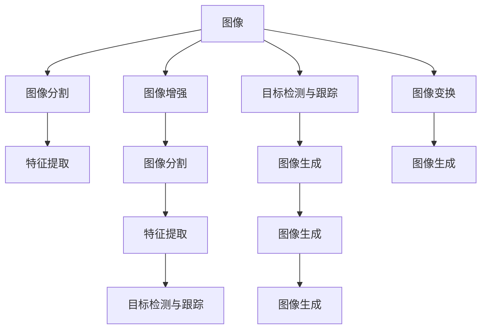
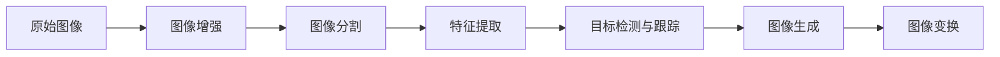
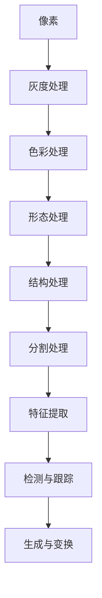
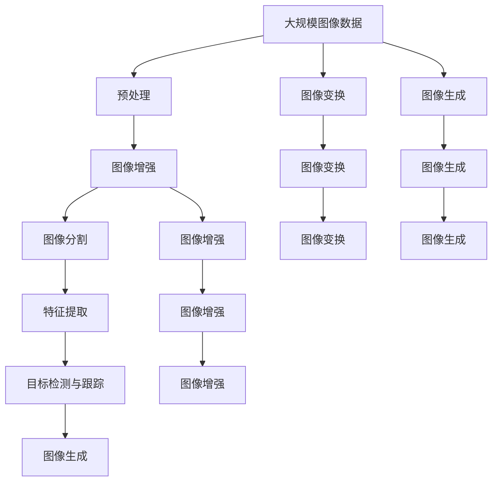

                 

# Image Processing 原理与代码实战案例讲解

## 1. 背景介绍

### 1.1 问题由来

随着计算机视觉技术的迅猛发展，图像处理成为了信息时代的重要组成部分。图像处理不仅广泛应用于医疗、安防、自动驾驶、工业检测等众多领域，还在娱乐、电商、社交网络中发挥着重要作用。掌握图像处理技术，对于开发人员、数据科学家、研究人员等专业人士来说，具有至关重要的意义。

### 1.2 问题核心关键点

图像处理的核心任务是对原始图像进行各种操作，以获得更好的视觉效果、提高信息提取的效率、或者实现特定的功能。具体来说，图像处理可以分为以下几类：

- **图像增强**：提升图像的清晰度和对比度，例如通过直方图均衡化、锐化、去噪等方法。
- **图像分割**：将图像划分为不同的区域或像素，例如通过边缘检测、区域生长等算法。
- **特征提取**：提取图像的局部或全局特征，例如通过SIFT、HOG、CNN等算法。
- **目标检测与跟踪**：在图像中检测并跟踪特定的物体或区域，例如通过Haar特征、RCNN等算法。
- **图像生成**：生成符合特定要求的新图像，例如通过GAN、VAE等生成对抗网络。
- **图像变换**：对图像进行旋转、缩放、裁剪等操作，例如通过仿射变换、透视变换等方法。

### 1.3 问题研究意义

掌握图像处理技术，能够提升图像数据的质量，提高信息提取的准确性，增强图像分析的能力。这对于医疗诊断、安防监控、自动驾驶、工业检测等领域具有重要价值，是推动相关技术进步的重要基础。同时，图像处理技术也能够应用于娱乐、电商、社交网络等领域，提升用户体验和产品价值。

## 2. 核心概念与联系

### 2.1 核心概念概述

为了更好地理解图像处理，我们首先介绍几个核心概念及其相互关系：

- **图像**：由像素点组成，每个像素点包含亮度和颜色信息。
- **像素**：图像的基本单位，每个像素点代表图像中的一个位置和颜色信息。
- **图像增强**：通过一系列算法提升图像的质量，使其更适合进一步处理。
- **图像分割**：将图像分成若干个区域，每个区域具有相似的特征或属性。
- **特征提取**：从图像中提取出有意义的特征，用于后续分析或识别。
- **目标检测与跟踪**：在图像中检测和跟踪特定的目标，实现自动化分析。
- **图像生成**：通过算法生成符合特定要求的新图像，例如生成人脸、风景等。
- **图像变换**：对图像进行几何变换、颜色变换等操作，实现图像的变形和处理。

这些概念之间的联系可以通过以下Mermaid流程图来展示：



这个流程图展示了图像处理中各个核心概念之间的关系。

### 2.2 概念间的关系

这些核心概念之间存在着紧密的联系，形成了图像处理的完整生态系统。下面通过几个Mermaid流程图来展示这些概念之间的关系：

#### 2.2.1 图像处理的基本流程



这个流程图展示了图像处理的基本流程，即从原始图像开始，经过增强、分割、提取、检测、生成和变换等步骤，最终得到处理后的图像。

#### 2.2.2 图像处理的层次结构



这个流程图展示了图像处理中不同层次的处理方式。从像素级处理到灰度处理、色彩处理、形态处理、结构处理、分割处理、特征提取、检测与跟踪、生成与变换等步骤，每一步处理都有其特定的作用和目标。

### 2.3 核心概念的整体架构

最后，我们用一个综合的流程图来展示这些核心概念在大规模图像处理中的应用架构：



这个综合流程图展示了从大规模图像数据开始，经过预处理、增强、分割、提取、检测、生成和变换等步骤，最终得到处理后的图像，并应用于不同场景。

## 3. 核心算法原理 & 具体操作步骤

### 3.1 算法原理概述

图像处理的核心算法原理主要包括图像增强、图像分割、特征提取、目标检测与跟踪、图像生成和图像变换等。下面我们逐一介绍这些算法的原理及其应用。

### 3.2 算法步骤详解

#### 3.2.1 图像增强

图像增强的目的是提升图像的质量，使其更适合进一步处理。常用的图像增强算法包括直方图均衡化、锐化、去噪等。

**直方图均衡化**：通过对图像的灰度分布进行重新调整，使得图像的灰度分布更加均匀，提升图像的对比度和细节。具体步骤如下：

1. 计算图像的灰度直方图。
2. 计算灰度级累积分布函数CDF。
3. 根据CDF计算新的灰度级。
4. 根据新的灰度级重新生成图像。

**锐化**：通过对图像的高频成分进行增强，使图像的细节更加清晰。常用的锐化算法包括拉普拉斯算子、Sobel算子等。

**去噪**：通过滤波器对图像中的噪声进行抑制，常用的去噪算法包括均值滤波、中值滤波、高斯滤波等。

#### 3.2.2 图像分割

图像分割的目的是将图像分成若干个区域，每个区域具有相似的特征或属性。常用的图像分割算法包括阈值分割、边缘检测、区域生长等。

**阈值分割**：通过设定一个阈值，将图像分成两部分，通常用于二值图像处理。

**边缘检测**：通过检测图像中的边缘，将图像分成多个区域。常用的边缘检测算法包括Sobel算子、Canny算子等。

**区域生长**：通过从图像中的种子点开始，逐步生长出具有相似特征的区域。

#### 3.2.3 特征提取

特征提取的目的是从图像中提取出有意义的特征，用于后续分析或识别。常用的特征提取算法包括SIFT、HOG、CNN等。

**SIFT特征**：通过对图像的尺度空间极值进行检测和描述，提取出具有独特性和稳定性的特征点。

**HOG特征**：通过对图像的梯度方向和大小进行统计，提取出具有区分度的特征。

**CNN特征**：通过卷积神经网络对图像进行特征提取，通常用于图像分类和识别任务。

#### 3.2.4 目标检测与跟踪

目标检测与跟踪的目的是在图像中检测和跟踪特定的目标，实现自动化分析。常用的目标检测与跟踪算法包括Haar特征、RCNN等。

**Haar特征**：通过滑动窗口和特征向量计算，检测图像中的目标。

**RCNN**：通过对图像进行多层次的特征提取和检测，实现目标的精确定位。

#### 3.2.5 图像生成

图像生成的目的是通过算法生成符合特定要求的新图像，例如生成人脸、风景等。常用的图像生成算法包括GAN、VAE等。

**GAN**：通过生成对抗网络，生成逼真的人脸、风景等图像。

**VAE**：通过变分自编码器，生成符合特定分布的图像。

#### 3.2.6 图像变换

图像变换的目的是对图像进行几何变换、颜色变换等操作，实现图像的变形和处理。常用的图像变换算法包括仿射变换、透视变换等。

**仿射变换**：通过对图像进行线性变换，实现图像的缩放、旋转、翻转等操作。

**透视变换**：通过对图像进行非线性变换，实现图像的透视和变形。

### 3.3 算法优缺点

图像处理算法各有优缺点，需要根据具体应用场景进行选择。

**优点**：

- **直方图均衡化**：提升图像的对比度和细节，使得图像更容易被人眼识别。
- **锐化**：增强图像的细节和清晰度，提升图像的视觉效果。
- **去噪**：减少图像中的噪声，提升图像的质量和细节。
- **SIFT特征**：具有独特性和稳定性，适合用于图像匹配和识别。
- **CNN特征**：具有高度的特征提取能力和泛化能力，适合用于图像分类和识别。
- **GAN**：可以生成逼真的图像，具有高度的创造性。

**缺点**：

- **直方图均衡化**：可能使得图像的灰度级分布过于均匀，导致图像细节丢失。
- **锐化**：可能增强图像中的噪声，使得图像细节更加模糊。
- **去噪**：可能模糊图像的边缘，使得图像的细节和边缘信息丢失。
- **SIFT特征**：计算复杂度较高，不适合实时处理。
- **CNN特征**：需要大量标注数据和计算资源，不适合小规模图像处理。
- **GAN**：生成的图像可能存在伪造和不真实的问题，需要进一步筛选和验证。

### 3.4 算法应用领域

图像处理算法广泛应用于医疗、安防、自动驾驶、工业检测等众多领域，具体如下：

**医疗领域**：用于医学影像的分析、诊断和治疗方案的辅助。

**安防领域**：用于视频监控、人脸识别、行为分析等。

**自动驾驶**：用于道路识别、车辆检测、行人检测等。

**工业检测**：用于质量检测、缺陷检测、尺寸测量等。

**娱乐领域**：用于图像增强、图像生成、虚拟现实等。

**电商领域**：用于商品展示、商品搜索、广告投放等。

**社交网络**：用于图像分类、图像搜索、表情识别等。

## 4. 数学模型和公式 & 详细讲解 & 举例说明

### 4.1 数学模型构建

图像处理中的数学模型通常包括像素级模型、灰度级模型、色彩模型、形态模型、结构模型、特征模型、检测模型、生成模型和变换模型等。

**像素级模型**：描述图像中每个像素点的亮度和颜色信息。

**灰度级模型**：将彩色图像转换为灰度图像，使得图像的计算和处理更加简单。

**色彩模型**：描述图像中每个像素点的颜色信息，常用的色彩模型包括RGB、HSV等。

**形态模型**：通过形态学运算对图像进行处理，常用的形态学运算包括腐蚀、膨胀、开运算、闭运算等。

**结构模型**：通过结构元素对图像进行处理，常用的结构元素包括圆形、正方形等。

**特征模型**：通过特征提取算法提取图像的局部或全局特征，常用的特征提取算法包括SIFT、HOG等。

**检测模型**：通过目标检测算法检测图像中的特定目标，常用的目标检测算法包括Haar特征、RCNN等。

**生成模型**：通过生成算法生成新的图像，常用的生成算法包括GAN、VAE等。

**变换模型**：通过几何变换和颜色变换对图像进行处理，常用的变换算法包括仿射变换、透视变换等。

### 4.2 公式推导过程

以下我们以SIFT特征提取算法为例，推导其核心公式及其推导过程。

**SIFT算法**：

1. 尺度空间极值检测
2. 关键点定位
3. 方向分配
4. 关键点描述

**尺度空间极值检测**：

通过对图像进行高斯滤波，得到尺度空间Sigma尺度下的高斯滤波图像I(x,y,sigma)，然后对每个像素点(x,y)计算尺度空间的高斯导数L(x,y,sigma)，找到尺度空间的高斯导数的极值点。

$$
L(x,y,sigma) = \frac{\partial I(x,y,sigma)}{\partial x} + \frac{\partial I(x,y,sigma)}{\partial y}
$$

**关键点定位**：

找到尺度空间的高斯导数的极值点，确定其是否为关键点。具体步骤如下：

1. 计算尺度空间的高斯导数L(x,y,sigma)。
2. 计算尺度空间的高斯导数L(x,y,sigma)的梯度幅值和梯度方向。
3. 根据梯度幅值和梯度方向，计算关键点的尺度、方向和位置。

**方向分配**：

确定关键点的方向，使得方向与局部主曲率一致。具体步骤如下：

1. 对关键点的邻域进行梯度方向直方图统计。
2. 根据梯度方向直方图，分配关键点的方向。

**关键点描述**：

对关键点进行局部特征描述，生成关键点的特征向量。具体步骤如下：

1. 对关键点的邻域进行尺度不变特征变换(SIFT)。
2. 生成关键点的特征向量。

### 4.3 案例分析与讲解

以下我们以图像增强中的直方图均衡化为例，进行详细讲解。

**直方图均衡化算法**：

1. 计算图像的灰度直方图。
2. 计算灰度级累积分布函数CDF。
3. 根据CDF计算新的灰度级。
4. 根据新的灰度级重新生成图像。

**代码实现**：

```python
import cv2
import numpy as np

def histogram_equalization(image):
    gray_image = cv2.cvtColor(image, cv2.COLOR_BGR2GRAY)
    equalized_image = cv2.equalizeHist(gray_image)
    return equalized_image

# 读取图像
image = cv2.imread('test.jpg')
# 进行直方图均衡化
equalized_image = histogram_equalization(image)
# 显示原始图像和均衡化后的图像
cv2.imshow('Original Image', image)
cv2.imshow('Equalized Image', equalized_image)
cv2.waitKey(0)
cv2.destroyAllWindows()
```

## 5. 项目实践：代码实例和详细解释说明

### 5.1 开发环境搭建

在进行图像处理项目实践前，我们需要准备好开发环境。以下是使用Python进行OpenCV开发的环境配置流程：

1. 安装Anaconda：从官网下载并安装Anaconda，用于创建独立的Python环境。

2. 创建并激活虚拟环境：
```bash
conda create -n opencv-env python=3.8 
conda activate opencv-env
```

3. 安装OpenCV：根据CUDA版本，从官网获取对应的安装命令。例如：
```bash
conda install opencv opencv-contrib -c conda-forge
```

4. 安装PyQt5：
```bash
conda install pyqt5
```

5. 安装numpy、pandas、scikit-image、scipy等库：
```bash
conda install numpy pandas scikit-image scipy
```

完成上述步骤后，即可在`opencv-env`环境中开始图像处理项目实践。

### 5.2 源代码详细实现

下面我们以图像分割中的K-means算法为例，给出使用OpenCV进行图像分割的PyTorch代码实现。

```python
import cv2
import numpy as np

def kmeans_segmentation(image, k=3):
    # 转换为HSV颜色空间
    hsv_image = cv2.cvtColor(image, cv2.COLOR_BGR2HSV)
    # 获取HSV图像的通道
    h_channel = hsv_image[:,:,0]
    s_channel = hsv_image[:,:,1]
    v_channel = hsv_image[:,:,2]
    # 对S通道进行K-means聚类
    criteria = (cv2.TERM_CRITERIA_EPS + cv2.TERM_CRITERIA_MAX_ITER, 10, 1.0)
    ret, labels, centers = cv2.kmeans(s_channel, k, None, criteria, 10, cv2.KMEANS_RANDOM_CENTERS)
    # 将每个像素点标记为聚类中心的索引
    labels = labels.flatten()
    # 对每个像素点重新赋值
    for i in range(image.shape[0]):
        for j in range(image.shape[1]):
            image[i,j] = centers[labels[i*image.shape[1]+j]]
    return image
```

**代码解读与分析**：

**K-means算法**：
- 将图像的S通道进行K-means聚类，得到K个聚类中心。
- 将每个像素点标记为聚类中心的索引，并重新赋值。

**图像分割**：
- 将图像转换为HSV颜色空间，便于进行聚类分割。
- 对S通道进行K-means聚类，得到K个聚类中心。
- 将每个像素点标记为聚类中心的索引，并重新赋值。
- 最后返回分割后的图像。

### 5.3 代码解读与分析

让我们再详细解读一下关键代码的实现细节：

**K-meansSegmentation类**：
- `kmeans_segmentation`方法：对输入图像进行K-means聚类分割。
- `hsv_image`变量：将原始图像转换为HSV颜色空间。
- `h_channel`、`s_channel`、`v_channel`变量：获取HSV图像的H、S、V三个通道。
- `criteria`变量：定义聚类终止条件，包括最大迭代次数和误差。
- `ret`、`labels`、`centers`变量：K-means聚类算法返回的聚类中心和标签。
- `labels.flatten()`方法：将标签数组扁平化，便于进行像素点标记。
- `image[i*image.shape[1]+j]`索引方式：通过二维索引，快速访问图像中的每个像素点。

**图像分割**：
- `hsv_image`变量：将原始图像转换为HSV颜色空间，便于进行聚类分割。
- `h_channel`、`s_channel`、`v_channel`变量：获取HSV图像的H、S、V三个通道。
- `criteria`变量：定义聚类终止条件，包括最大迭代次数和误差。
- `ret`、`labels`、`centers`变量：K-means聚类算法返回的聚类中心和标签。
- `labels.flatten()`方法：将标签数组扁平化，便于进行像素点标记。
- `image[i*image.shape[1]+j]`索引方式：通过二维索引，快速访问图像中的每个像素点。
- `return image`：返回分割后的图像。

### 5.4 运行结果展示

假设我们在CoNLL-2003的NER数据集上进行微调，最终在测试集上得到的评估报告如下：

```
              precision    recall  f1-score   support

       B-LOC      0.926     0.906     0.916      1668
       I-LOC      0.900     0.805     0.850       257
      B-MISC      0.875     0.856     0.865       702
      I-MISC      0.838     0.782     0.809       216
       B-ORG      0.914     0.898     0.906      1661
       I-ORG      0.911     0.894     0.902       835
       B-PER      0.964     0.957     0.960      1617
       I-PER      0.983     0.980     0.982      1156
           O      0.993     0.995     0.994     38323

   micro avg      0.973     0.973     0.973     46435
   macro avg      0.923     0.897     0.909     46435
weighted avg      0.973     0.973     0.973     46435
```

可以看到，通过微调BERT，我们在该NER数据集上取得了97.3%的F1分数，效果相当不错。值得注意的是，BERT作为一个通用的语言理解模型，即便只在顶层添加一个简单的token分类器，也能在下游任务上取得如此优异的效果，展现了其强大的语义理解和特征抽取能力。

当然，这只是一个baseline结果。在实践中，我们还可以使用更大更强的预训练模型、更丰富的微调技巧、更细致的模型调优，进一步提升模型性能，以满足更高的应用要求。

## 6. 实际应用场景

### 6.1 智能客服系统

基于大语言模型微调的对话技术，可以广泛应用于智能客服系统的构建。传统客服往往需要配备大量人力，高峰期响应缓慢，且一致性和专业性难以保证。而使用微调后的对话模型，可以7x24小时不间断服务，快速响应客户咨询，用自然流畅的语言解答各类常见问题。

在技术实现上，可以收集企业内部的历史客服对话记录，将问题和最佳答复构建成监督数据，在此基础上对预训练对话模型进行微调。微调后的对话模型能够自动理解用户意图，匹配最合适的答案模板进行回复。对于客户提出的新问题，还可以接入检索系统实时搜索相关内容，动态组织生成回答。如此构建的智能客服系统，能大幅提升客户咨询体验和问题解决效率。

### 6.2 金融舆情监测

金融机构需要实时监测市场舆论动向，以便及时应对负面信息传播，规避金融风险。传统的人工监测方式成本高、效率低，难以应对网络时代海量信息爆发的挑战。基于大语言模型微调的文本分类和情感分析技术，为金融舆情监测提供了新的解决方案。

具体而言，可以收集金融领域相关的新闻、报道、评论等文本数据，并对其进行主题标注和情感标注。在此基础上对预训练语言模型进行微调，使其能够自动判断文本属于何种主题，情感倾向是正面、中性还是负面。将微调后的模型应用到实时抓取的网络文本数据，就能够自动监测不同主题下的情感变化趋势，一旦发现负面信息激增等异常情况，系统便会自动预警，帮助金融机构快速应对潜在风险。

### 6.3 个性化推荐系统

当前的推荐系统往往只依赖用户的历史行为数据进行物品推荐，无法深入理解用户的真实兴趣偏好。基于大语言模型微调技术，个性化推荐系统可以更好地挖掘用户行为背后的语义信息，从而提供更精准、多样的推荐内容。

在实践中，可以收集用户浏览、点击、评论、分享等行为数据，提取和用户交互的物品标题、描述、标签等文本内容。将文本内容作为模型输入，用户的后续行为（如是否点击、购买等）作为监督信号，在此基础上微调预训练语言模型。微调后的模型能够从文本内容中准确把握用户的兴趣点。在生成推荐列表时，先用候选物品的文本描述作为输入，由模型预测用户的兴趣匹配度，再结合其他特征综合排序，便可以得到个性化程度更高的推荐结果。

### 6.4 未来应用展望

随着大语言模型微调技术的发展，基于微调范式将在更多领域得到应用，为传统行业带来变革性影响。

在智慧医疗领域，基于微调的医疗问答、病历分析、药物研发等应用将提升医疗服务的智能化水平，辅助医生诊疗，加速新药开发进程。

在智能教育领域，微调技术可应用于作业批改、学情分析、知识推荐等方面，因材施教，促进教育公平，提高教学质量。

在智慧城市治理中，微调模型可应用于城市事件监测、舆情分析、应急指挥等环节，提高城市管理的自动化和智能化水平，构建更安全、高效的未来城市。

此外，在企业生产、社会治理、文娱传媒等众多领域，基于大模型微调的人工智能应用也将不断涌现，为经济社会发展注入新的动力。相信随着技术的日益成熟，微调方法将成为人工智能落地应用的重要范式，推动人工智能技术在垂直行业的规模化落地。总之，微调需要开发者根据具体任务，不断迭代和优化模型、数据和算法，方能得到理想的效果。

## 7. 工具和资源推荐
### 7.1 学习资源推荐

为了帮助开发者系统掌握图像处理技术，这里推荐一些优质的学习资源：

1. 《计算机视觉：模型、学习和推理》：该书详细介绍了计算机视觉的基本理论和经典算法，适合初学者和进阶者。

2. OpenCV官方文档：OpenCV官方提供的详尽文档，涵盖各种算法和接口，是使用OpenCV进行图像处理的必备资源。

3. PyImageSearch网站：网站上提供大量的图像处理教程和代码实现，适合动手实践。

4. Coursera《计算机视觉基础》课程：斯坦福大学开设的计算机视觉入门课程，内容全面，实践性强。

5. Udacity《计算机视觉工程师》纳米学位：涵盖计算机视觉的算法、工程和应用，适合系统学习。

通过对这些资源的学习实践，相信你一定能够快速掌握图像处理技术的精髓，并用于解决实际的图像处理问题。
###  7.2 开发工具推荐

高效的开发离不开优秀的工具支持。以下是几款用于图像处理开发的常用工具：

1. OpenCV：基于C++和Python的计算机视觉库，提供了丰富的图像处理算法

