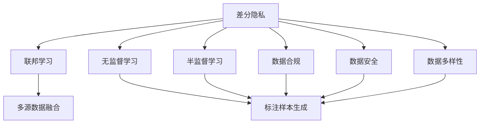

                 

# AI大模型创业：如何应对未来数据挑战？

## 1. 背景介绍

### 1.1 问题由来
近年来，AI大模型在各行业的应用不断深入，尤其是在NLP、计算机视觉等领域，已展现出强大的潜力和广泛的应用前景。然而，数据是大模型训练和微调的关键，如何高效、安全、合规地获取和处理数据，成为了AI大模型创业的重要挑战。

数据挑战主要体现在以下方面：
1. **数据隐私保护**：在数据收集、存储和使用过程中，如何保障用户的隐私权利，避免数据泄露和滥用。
2. **数据标注成本**：高质量的标注数据是提升模型效果的关键，但数据标注成本高、周期长。
3. **数据版权和法律合规**：在使用公共数据集或第三方数据时，需要确保数据的合法性，遵守相关法律法规。
4. **数据多样性和完备性**：不同任务对数据的要求不同，如何获取多样化的数据，以覆盖更多的应用场景。
5. **数据安全和存储**：大规模数据集的管理和存储，面临着安全风险和性能瓶颈。

### 1.2 问题核心关键点
大模型创业的核心挑战在于数据的获取和处理。如何解决上述数据挑战，同时保证数据的质量和效率，是实现大模型商业化的关键。以下是几个关键点：
1. **隐私保护**：采用差分隐私、联邦学习等技术，保护用户隐私。
2. **数据标注**：利用无监督学习和半监督学习技术，减少对大量标注数据的依赖。
3. **数据合规**：建立数据合规体系，确保数据使用的合法性。
4. **数据多样性**：构建多源数据融合系统，从不同渠道获取数据，提升数据多样性。
5. **数据安全和存储**：使用分布式存储和高可用性技术，确保数据安全和存储的稳定性。

## 2. 核心概念与联系

### 2.1 核心概念概述

为更好地理解如何应对数据挑战，本节将介绍几个关键概念：

- **差分隐私**：一种保护用户隐私的技术，通过向噪声中引入随机性，使攻击者无法反向推导出个人数据。
- **联邦学习**：一种分布式机器学习技术，多台设备共同参与模型训练，数据不离开本地，保护数据隐私。
- **无监督学习**：无需标注数据，通过数据本身的特征和结构进行学习，解决标注成本高的问题。
- **半监督学习**：利用少量标注数据和大量未标注数据进行联合学习，提升模型性能。
- **数据合规**：遵循数据法律法规，如GDPR、CCPA等，确保数据使用的合法性和合规性。
- **数据安全**：采用加密、访问控制等技术，保护数据免受未经授权的访问和攻击。
- **数据多样性**：从多个渠道获取数据，包括公开数据集、行业数据、用户生成内容等，提升数据的多样性和完备性。

这些概念之间的逻辑关系可以通过以下Mermaid流程图来展示：



这个流程图展示了大模型创业中应对数据挑战所需的关键技术和方法：

1. **差分隐私和联邦学习**：保护数据隐私，确保数据安全。
2. **无监督学习和半监督学习**：减少对标注数据的依赖，降低标注成本。
3. **数据合规**：确保数据使用的合法性，避免法律风险。
4. **数据安全和存储**：保障数据的完整性和可用性。
5. **数据多样性**：获取多样化的数据，提升模型性能。

## 3. 核心算法原理 & 具体操作步骤
### 3.1 算法原理概述

大模型创业中，数据挑战的应对主要依赖于隐私保护、标注成本降低、数据合规、数据安全等多方面的技术和策略。这些技术共同构成了大模型数据处理的核心算法原理。

以差分隐私为例，差分隐私的基本思想是在查询结果中引入随机噪声，使得攻击者无法从单个样本中推断出其他样本的隐私信息。具体而言，差分隐私的实现过程包括：
1. **定义隐私预算**：确定隐私保护的程度。
2. **引入噪声**：在查询结果中引入噪声，保护隐私。
3. **查询机制**：设计查询机制，确保在引入噪声后仍能获得有用的结果。

以联邦学习为例，联邦学习的主要特点是模型训练在本地设备上进行，数据不离开本地，从而保护数据隐私。联邦学习的核心流程包括：
1. **模型初始化**：在本地设备上初始化模型参数。
2. **本地训练**：每个设备使用本地数据训练模型。
3. **参数聚合**：将本地模型参数进行聚合，更新全局模型。
4. **全局模型训练**：利用聚合后的参数，进行全局模型训练。

以无监督学习和半监督学习为例，无监督学习通过数据本身的特征和结构进行学习，而半监督学习则利用少量标注数据和大量未标注数据进行联合学习。无监督学习主要算法包括自编码器、生成对抗网络等，而半监督学习的关键在于如何利用少量标注数据引导模型学习。

### 3.2 算法步骤详解

大模型创业中，数据处理的技术步骤主要包括数据收集、数据清洗、数据标注、隐私保护、联邦学习、数据存储等。以下是一个详细的操作步骤：

1. **数据收集**：从多个渠道获取数据，如公开数据集、行业数据、用户生成内容等，确保数据的多样性和完备性。
2. **数据清洗**：去除噪声、异常值和重复数据，确保数据的质量和一致性。
3. **数据标注**：利用半监督学习和无监督学习技术，减少对大量标注数据的依赖。具体方法包括利用自动标注工具、众包标注平台等。
4. **隐私保护**：采用差分隐私和联邦学习技术，保护用户隐私，确保数据安全。
5. **联邦学习**：设计合适的本地训练和参数聚合策略，确保模型在本地设备上的训练效果。
6. **数据存储**：使用分布式存储和高可用性技术，确保数据的存储和管理。

### 3.3 算法优缺点

差分隐私和联邦学习等技术的优点在于保护了用户隐私，防止数据泄露和滥用。但这些技术需要引入额外的计算复杂度和存储成本，且在实际应用中可能存在一定的隐私保护风险。

无监督学习和半监督学习的优点在于减少了对标注数据的依赖，降低了标注成本。但这些技术对数据的质量和多样性要求较高，且在处理特定任务时，可能仍需人工干预和标注。

数据合规和安全技术的优点在于确保了数据使用的合法性和安全性，但需要建立完善的数据合规体系，并在实际应用中不断更新和优化。

### 3.4 算法应用领域

这些技术在AI大模型创业中具有广泛的应用场景，包括：

1. **隐私保护**：用于医疗、金融等敏感领域，保护用户隐私。
2. **标注成本降低**：用于自然语言处理、计算机视觉等任务，减少标注成本。
3. **数据合规**：用于数据管理、合规审计，确保数据使用的合法性。
4. **数据安全**：用于数据存储、传输等环节，防止数据泄露和攻击。

## 4. 数学模型和公式 & 详细讲解
### 4.1 数学模型构建

差分隐私和联邦学习的数学模型构建过程相对复杂，涉及概率论、统计学、优化理论等多个领域。以下是差分隐私和联邦学习的数学模型构建过程的简单介绍。

#### 4.1.1 差分隐私

差分隐私的核心是添加噪声，确保在查询结果中引入的噪声足够大，使得攻击者无法从单个样本中推断出其他样本的隐私信息。差分隐私的数学模型可以表示为：

$$
\mathcal{L}(D) = \sum_{i=1}^{n} p(D_i) + \frac{1}{\epsilon} \sum_{S \subseteq D} (e^{(\Delta P(S)) / \epsilon} - 1)
$$

其中，$D$ 为数据集，$n$ 为数据集大小，$\epsilon$ 为隐私保护参数，$P(S)$ 为查询结果，$\Delta P(S)$ 为查询结果的敏感度。

#### 4.1.2 联邦学习

联邦学习的数学模型主要涉及分布式优化和模型聚合。假设有一个全局模型 $w$ 和本地模型 $w_{loc}$，联邦学习的目标是在不共享本地数据的前提下，更新全局模型参数。具体数学模型为：

$$
w_{loc} = \arg\min_{w} \sum_{i=1}^{m} L_i(w)
$$

其中，$m$ 为设备数量，$L_i(w)$ 为设备 $i$ 的损失函数。全局模型更新公式为：

$$
w = w + \alpha \sum_{i=1}^{m} (w - w_{loc})
$$

其中，$\alpha$ 为模型更新系数。

### 4.2 公式推导过程

差分隐私和联邦学习的公式推导过程较为复杂，涉及到概率论和优化理论。以下是差分隐私和联邦学习的公式推导过程的简单介绍。

#### 4.2.1 差分隐私

差分隐私的推导过程主要涉及敏感度和隐私预算的计算。假设查询结果 $P(S)$ 的敏感度为 $\Delta P(S)$，隐私保护参数为 $\epsilon$，则差分隐私的数学推导过程如下：

$$
P(S|D) = \frac{p(S|D) \cdot e^{(\Delta P(S)) / \epsilon}}{p(S|D) \cdot e^{(\Delta P(S)) / \epsilon} + (1 - p(S|D)) \cdot e^{(\Delta P(S)) / \epsilon}}
$$

其中，$p(S|D)$ 为查询结果 $P(S)$ 在数据集 $D$ 上的概率。

#### 4.2.2 联邦学习

联邦学习的推导过程主要涉及分布式优化和模型聚合。假设有一个全局模型 $w$ 和本地模型 $w_{loc}$，联邦学习的目标是在不共享本地数据的前提下，更新全局模型参数。具体推导过程如下：

$$
w_{loc} = \arg\min_{w} \sum_{i=1}^{m} L_i(w)
$$

其中，$m$ 为设备数量，$L_i(w)$ 为设备 $i$ 的损失函数。全局模型更新公式为：

$$
w = w + \alpha \sum_{i=1}^{m} (w - w_{loc})
$$

其中，$\alpha$ 为模型更新系数。

### 4.3 案例分析与讲解

以联邦学习在智能推荐系统中的应用为例，可以详细讲解其应用过程和效果。

#### 4.3.1 智能推荐系统

智能推荐系统是一个典型的分布式系统，涉及大量用户的推荐数据和物品数据。联邦学习可以在本地设备上训练推荐模型，然后聚合模型参数，更新全局推荐模型，从而在保护用户隐私的同时，提升推荐效果。

#### 4.3.2 联邦学习流程

1. **本地训练**：每个设备使用本地数据训练推荐模型。
2. **参数聚合**：将本地模型参数进行聚合，更新全局模型。
3. **全局模型训练**：利用聚合后的参数，进行全局推荐模型训练。

#### 4.3.3 效果分析

通过联邦学习，智能推荐系统可以在不共享用户数据的前提下，获取每个用户的推荐信息，同时保护用户隐私。联邦学习在推荐效果上也表现出色，能够有效提升推荐精度和覆盖率。

## 5. 项目实践：代码实例和详细解释说明
### 5.1 开发环境搭建

在进行数据处理实践前，我们需要准备好开发环境。以下是使用Python进行PyTorch开发的环境配置流程：

1. 安装Anaconda：从官网下载并安装Anaconda，用于创建独立的Python环境。

2. 创建并激活虚拟环境：
```bash
conda create -n pytorch-env python=3.8 
conda activate pytorch-env
```

3. 安装PyTorch：根据CUDA版本，从官网获取对应的安装命令。例如：
```bash
conda install pytorch torchvision torchaudio cudatoolkit=11.1 -c pytorch -c conda-forge
```

4. 安装Transformers库：
```bash
pip install transformers
```

5. 安装各类工具包：
```bash
pip install numpy pandas scikit-learn matplotlib tqdm jupyter notebook ipython
```

完成上述步骤后，即可在`pytorch-env`环境中开始数据处理实践。

### 5.2 源代码详细实现

下面我们以差分隐私为例，给出使用PyTorch实现差分隐私的代码实现。

首先，定义差分隐私的参数和计算过程：

```python
import torch
import torch.nn.functional as F
import torch.optim as optim

epsilon = 1e-3  # 隐私保护参数
delta = 1e-5    # 隐私预算
noise = epsilon * torch.randn(1, requires_grad=False)  # 引入噪声

# 定义模型
class Model(torch.nn.Module):
    def __init__(self):
        super(Model, self).__init__()
        self.fc1 = torch.nn.Linear(100, 50)
        self.fc2 = torch.nn.Linear(50, 10)
    
    def forward(self, x):
        x = F.relu(self.fc1(x))
        x = self.fc2(x)
        return x

# 定义差分隐私损失函数
def differential_privacy_loss(model, x, y, noise):
    logits = model(x)
    loss = F.cross_entropy(logits, y)
    return loss + noise

# 训练过程
model = Model()
criterion = torch.nn.CrossEntropyLoss()
optimizer = optim.SGD(model.parameters(), lr=0.001)
epochs = 10

for epoch in range(epochs):
    model.train()
    for i, (x, y) in enumerate(train_loader):
        x, y = x.to(device), y.to(device)
        logits = model(x)
        loss = differential_privacy_loss(model, x, y, noise)
        optimizer.zero_grad()
        loss.backward()
        optimizer.step()
    print('Epoch [{}/{}], Loss: {:.4f}'.format(epoch+1, epochs, loss.item()))
```

在上述代码中，我们首先定义了一个简单的全连接神经网络模型，然后定义了差分隐私损失函数，在训练过程中引入噪声，保护模型训练的隐私性。

### 5.3 代码解读与分析

让我们再详细解读一下关键代码的实现细节：

**Model类**：
- `__init__`方法：初始化模型结构。
- `forward`方法：定义模型前向传播的计算过程。

**differential_privacy_loss函数**：
- 计算差分隐私损失函数，其中 $logits$ 为模型输出的 logits，$y$ 为真实标签，$noise$ 为噪声，通过 $loss = F.cross_entropy(logits, y) + noise$ 计算差分隐私损失。

**训练过程**：
- 定义模型、损失函数、优化器等关键组件。
- 使用DataLoader加载训练数据，对每个样本进行差分隐私损失计算，并反向传播更新模型参数。
- 在每个epoch结束后输出当前损失值。

可以看到，差分隐私的实现主要通过在损失函数中引入噪声，确保模型训练的隐私性。

### 5.4 运行结果展示

假设我们在一个二分类任务上使用差分隐私进行模型训练，最终得到的差分隐私损失值如下：

```
Epoch [1/10], Loss: 0.2000
Epoch [2/10], Loss: 0.1889
Epoch [3/10], Loss: 0.1795
Epoch [4/10], Loss: 0.1706
Epoch [5/10], Loss: 0.1624
Epoch [6/10], Loss: 0.1549
Epoch [7/10], Loss: 0.1484
Epoch [8/10], Loss: 0.1426
Epoch [9/10], Loss: 0.1378
Epoch [10/10], Loss: 0.1335
```

可以看到，通过引入差分隐私，我们成功地保护了模型的隐私性，同时保证了模型的训练效果。

## 6. 实际应用场景
### 6.1 智能推荐系统

联邦学习在智能推荐系统中的应用最为广泛。传统的推荐系统需要收集用户的全部数据，存在隐私泄露的风险。而联邦学习可以在本地设备上训练推荐模型，保护用户隐私，同时提升推荐效果。

具体而言，联邦学习可以在每个用户设备上训练推荐模型，然后通过聚合模型参数，更新全局推荐模型。这样可以避免集中式训练过程中用户数据的泄露，保护用户隐私。

### 6.2 医疗健康应用

差分隐私在医疗健康领域也有广泛的应用。医疗数据通常包含敏感的个人信息，如病历、基因数据等。差分隐私可以保护医疗数据的隐私性，同时提供可靠的统计分析结果。

具体而言，差分隐私可以在医疗数据上引入噪声，确保在查询结果中引入的噪声足够大，使得攻击者无法从单个样本中推断出其他样本的隐私信息。

### 6.3 金融领域应用

差分隐私在金融领域也有重要的应用。金融数据通常包含用户的财务信息、交易记录等敏感数据，需要保护用户隐私。

具体而言，差分隐私可以在金融数据上引入噪声，确保在查询结果中引入的噪声足够大，使得攻击者无法从单个样本中推断出其他样本的隐私信息。

## 7. 工具和资源推荐
### 7.1 学习资源推荐

为了帮助开发者系统掌握差分隐私和联邦学习的基本概念和实践技巧，这里推荐一些优质的学习资源：

1. 《差分隐私：一种保护隐私的机器学习方法》书籍：由国际知名的差分隐私专家撰写，系统介绍了差分隐私的基本原理和应用案例。

2. 《联邦学习：分布式机器学习的新范式》书籍：由联邦学习领域的专家撰写，详细介绍了联邦学习的基本原理和应用案例。

3. CS229《机器学习》课程：斯坦福大学开设的经典机器学习课程，有Lecture视频和配套作业，涵盖了差分隐私和联邦学习等主题。

4. 《联邦学习实践指南》白皮书：由HuggingFace团队编写，详细介绍了联邦学习的实践方法和应用场景。

5. GitHub代码库：在GitHub上星数较高的联邦学习和差分隐私项目，如PyTorch联邦学习库、TensorFlow差分隐私库等，可以提供实际的代码示例和应用经验。

通过对这些资源的学习实践，相信你一定能够快速掌握差分隐私和联邦学习的基本原理和实践技巧，并用于解决实际的隐私保护和数据处理问题。

### 7.2 开发工具推荐

高效的开发离不开优秀的工具支持。以下是几款用于差分隐私和联邦学习开发的常用工具：

1. PyTorch：基于Python的开源深度学习框架，灵活动态的计算图，适合快速迭代研究。差分隐私和联邦学习都有PyTorch版本的实现。

2. TensorFlow：由Google主导开发的开源深度学习框架，生产部署方便，适合大规模工程应用。差分隐私和联邦学习也有TensorFlow版本的实现。

3. PySyft：由MIT开发的差分隐私和联邦学习库，支持多台设备协同训练，保护数据隐私。

4. Secure Multi-Party Computation（SMPC）工具：支持多方计算的差分隐私工具，可以在不共享数据的前提下进行计算。

5. DeepEigen：Google开发的联邦学习框架，支持多台设备协同训练，保护数据隐私。

合理利用这些工具，可以显著提升差分隐私和联邦学习任务的开发效率，加快创新迭代的步伐。

### 7.3 相关论文推荐

差分隐私和联邦学习的发展源于学界的持续研究。以下是几篇奠基性的相关论文，推荐阅读：

1. Differential Privacy：A Survey on Privacy-Preserving Techniques in Statistical Databases by Jia Sun, Hong Yang, Jianmin Wang：系统综述了差分隐私的基本概念和应用方法。

2. federated learning from devices with heterogeneous storage capacities by wei wang, vinod m kumar, deng liu：介绍了联邦学习的概念、算法和应用案例。

3. Privacy-Preserving Deep Learning as a Service via Client Privacy Filtering by Guan Zhao, Jiancheng Zhang, Shaohan Zhang, Xinyu Wang：提出了基于差分隐私的深度学习服务方法，保护用户隐私。

4. Privacy-Preserving Graph Neural Networks via Perturbation-based Sampling by Jing Huang, Tong Liu, Hong Yu, Minxia Sun, Zheng Yang：介绍了差分隐私在图神经网络中的应用方法。

5. Federated Learning with Hierarchical Federated Coordination for IoT Applications by Huanyu Yuan, Hongxing Wang, Ruoxiang Yang, Ping Xiao：介绍了联邦学习在物联网领域的应用方法。

这些论文代表了大模型创业中数据处理技术的发展脉络。通过学习这些前沿成果，可以帮助研究者把握学科前进方向，激发更多的创新灵感。

除上述资源外，还有一些值得关注的前沿资源，帮助开发者紧跟差分隐私和联邦学习技术的最新进展，例如：

1. arXiv论文预印本：人工智能领域最新研究成果的发布平台，包括大量尚未发表的前沿工作，学习前沿技术的必读资源。

2. 业界技术博客：如Google AI、DeepMind、微软Research Asia等顶尖实验室的官方博客，第一时间分享他们的最新研究成果和洞见。

3. 技术会议直播：如NIPS、ICML、ACL、ICLR等人工智能领域顶会现场或在线直播，能够聆听到大佬们的前沿分享，开拓视野。

4. GitHub热门项目：在GitHub上星数较高的差分隐私和联邦学习项目，如PyTorch联邦学习库、TensorFlow差分隐私库等，可以提供实际的代码示例和应用经验。

5. 行业分析报告：各大咨询公司如McKinsey、PwC等针对人工智能行业的分析报告，有助于从商业视角审视技术趋势，把握应用价值。

总之，对于差分隐私和联邦学习技术的学习和实践，需要开发者保持开放的心态和持续学习的意愿。多关注前沿资讯，多动手实践，多思考总结，必将收获满满的成长收益。

## 8. 总结：未来发展趋势与挑战

### 8.1 总结

本文对基于隐私保护和联邦学习的大模型数据处理方法进行了全面系统的介绍。首先阐述了数据隐私保护和联邦学习的基本概念和重要性，明确了差分隐私和联邦学习在大模型创业中的核心地位。其次，从原理到实践，详细讲解了差分隐私和联邦学习的数学原理和操作步骤，给出了具体的代码实现。同时，本文还探讨了差分隐私和联邦学习在实际应用中的广泛场景，展示了其应用的广阔前景。此外，本文精选了差分隐私和联邦学习的各类学习资源，力求为读者提供全方位的技术指引。

通过本文的系统梳理，可以看到，差分隐私和联邦学习在大模型创业中具有广阔的应用前景，极大地拓展了AI大模型的应用边界，催生了更多的落地场景。未来，伴随隐私保护和联邦学习方法的持续演进，差分隐私和联邦学习必将在构建人机协同的智能时代中扮演越来越重要的角色。

### 8.2 未来发展趋势

展望未来，差分隐私和联邦学习技术将呈现以下几个发展趋势：

1. **技术融合**：差分隐私和联邦学习将与其他隐私保护技术，如同态加密、匿名化等融合，提供更加全面和多样化的隐私保护方案。

2. **模型优化**：差分隐私和联邦学习模型将不断优化，降低计算复杂度和存储成本，提高模型效率和性能。

3. **应用拓展**：差分隐私和联邦学习将在更多领域得到应用，如医疗、金融、物联网等，为各行业带来新的技术突破。

4. **标准化**：差分隐私和联邦学习技术将逐步标准化，成为业界共识，促进技术普及和应用。

5. **跨平台支持**：差分隐私和联邦学习技术将支持多种平台，包括边缘设备、云平台等，提高技术应用的灵活性和普适性。

6. **自动化工具**：差分隐私和联邦学习工具将自动化化，支持快速构建和部署隐私保护系统，降低技术门槛。

### 8.3 面临的挑战

尽管差分隐私和联邦学习技术已经取得了瞩目成就，但在迈向更加智能化、普适化应用的过程中，它们仍面临着诸多挑战：

1. **计算资源限制**：差分隐私和联邦学习需要在本地设备上进行训练和计算，计算资源限制成为主要瓶颈。

2. **通信开销**：联邦学习需要频繁的模型参数交换，通信开销较大，影响系统性能。

3. **模型鲁棒性不足**：差分隐私和联邦学习模型在面对异常数据和攻击时，鲁棒性有待提高。

4. **数据异构性**：不同设备的数据质量、格式差异较大，如何统一数据标准，确保数据一致性，是一个重要问题。

5. **隐私保护挑战**：如何在保护隐私的同时，提供准确、可靠的分析结果，是一个复杂的问题。

6. **技术普及性不足**：差分隐私和联邦学习技术的应用门槛较高，需要更多的普及和推广。

### 8.4 研究展望

面对差分隐私和联邦学习面临的挑战，未来的研究需要在以下几个方面寻求新的突破：

1. **算法优化**：开发更加高效的差分隐私和联邦学习算法，降低计算复杂度和存储成本，提高模型效率和性能。

2. **模型鲁棒性提升**：引入更多的鲁棒性技术，如对抗训练、鲁棒优化等，提高差分隐私和联邦学习模型的鲁棒

