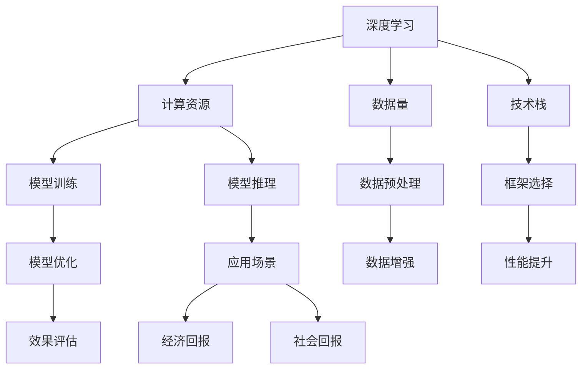
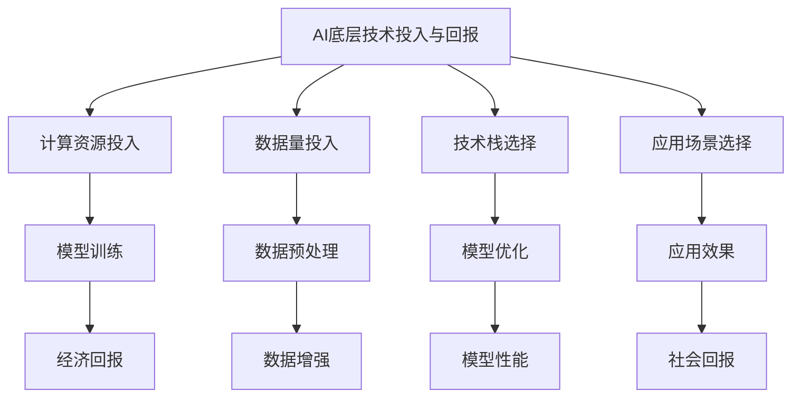

                 

# AI底层技术的投入与回报

> 关键词：人工智能, 底层技术, 投资回报, 深度学习, 计算资源, 数据量, 技术栈, 应用场景

## 1. 背景介绍

### 1.1 问题由来

近年来，人工智能（AI）技术快速发展，广泛应用于各个领域，从自动驾驶、医疗诊断到金融交易、智能客服等，AI的应用范围不断拓展，深度学习（Deep Learning, DL）作为其核心技术，日益成为热点。然而，尽管AI技术发展迅猛，其投入与回报的关系仍是一大挑战。本文旨在探讨AI底层技术的投入与回报问题，从技术、经济、社会等多个维度，全面分析其在不同领域的应用前景和效益。

### 1.2 问题核心关键点

AI底层技术的投入与回报问题涉及技术研发、计算资源、数据量、技术栈、应用场景等多个方面。其中，核心关键点包括：

- **技术投入**：涉及硬件资源（如GPU、TPU等）、软件工具（如TensorFlow、PyTorch等）、数据集的准备和标注等。
- **经济回报**：包括项目成本、收入预测、盈利模式等。
- **社会回报**：如提高效率、减少人工成本、促进就业等社会效益。
- **应用场景**：AI技术在不同行业中的应用效果和潜力。

## 2. 核心概念与联系

### 2.1 核心概念概述

在深入探讨AI底层技术的投入与回报之前，我们需要明确几个核心概念：

- **深度学习**：一种基于神经网络，通过多层非线性变换提取数据特征的机器学习技术。
- **计算资源**：指用于AI模型训练和推理的硬件设施，如GPU、TPU等。
- **数据量**：AI模型的训练和优化依赖大量数据，数据量对模型性能至关重要。
- **技术栈**：构建AI应用所需的各种软件工具和技术框架的集合。
- **应用场景**：AI技术在特定行业或领域的具体应用，如医疗、金融、智能制造等。

这些核心概念之间相互联系，共同构成了AI技术的生态系统。深度学习作为AI的核心技术，依赖大量的计算资源和数据量，通过复杂的技术栈实现。同时，AI技术在各个应用场景中展示了其强大的应用潜力，带来了显著的经济和社会回报。

### 2.2 概念间的关系

为更清晰地理解这些核心概念之间的关系，我们通过以下Mermaid流程图来展示：



这个流程图展示了深度学习与其他核心概念之间的联系。计算资源用于模型训练和推理，数据量参与数据预处理和增强，技术栈选择和优化模型性能，应用场景展示经济和社会回报。

### 2.3 核心概念的整体架构

最终，我们用一个综合的流程图来展示这些核心概念在AI底层技术投入与回报过程中的整体架构：



这个综合流程图展示了AI底层技术投入与回报的整体流程。从计算资源和数据量的投入，到技术栈的选择和应用场景的选择，再到模型训练、优化和效果的评估，最终实现经济和社会回报。

## 3. 核心算法原理 & 具体操作步骤

### 3.1 算法原理概述

AI底层技术的投入与回报，涉及多个层次的算法原理，包括但不限于深度学习模型的设计、优化和训练、计算资源的分配和使用、数据预处理和增强等。这些算法原理通过特定的操作步骤实现，具体如下：

**3.1.1 深度学习模型设计**

深度学习模型的设计是AI底层技术投入与回报的起点。模型的设计决定了其在特定应用场景中的表现。

- **神经网络架构**：选择或设计适合特定任务的神经网络架构，如卷积神经网络（CNN）、循环神经网络（RNN）、长短时记忆网络（LSTM）等。
- **激活函数**：选择合适的激活函数，如ReLU、Sigmoid、Tanh等，以提高模型的非线性表达能力。
- **损失函数**：选择合适的损失函数，如均方误差（MSE）、交叉熵（Cross-Entropy）等，以衡量模型预测与真实标签之间的差异。
- **优化算法**：选择适合的优化算法，如随机梯度下降（SGD）、Adam、RMSprop等，以最小化损失函数。

**3.1.2 计算资源分配**

计算资源的分配和使用是AI底层技术投入与回报的重要组成部分。

- **硬件选择**：选择合适的计算设备，如GPU、TPU等，以加速模型训练和推理。
- **资源调度**：合理分配计算资源，避免资源浪费和瓶颈，如使用分布式计算框架（如Spark、Hadoop等）。
- **性能优化**：采用优化技术，如模型并行、数据并行、混合精度训练等，以提高计算效率。

**3.1.3 数据预处理和增强**

数据预处理和增强是深度学习模型性能提升的关键步骤。

- **数据清洗**：去除数据中的噪声和异常值，确保数据质量。
- **数据增强**：通过旋转、翻转、裁剪等方式增加数据量，提高模型的鲁棒性和泛化能力。
- **数据划分**：将数据集划分为训练集、验证集和测试集，以评估模型性能。

### 3.2 算法步骤详解

接下来，我们将详细介绍AI底层技术投入与回报的关键操作步骤。

**3.2.1 数据准备**

数据准备是AI技术应用的基础。

- **数据收集**：从公开数据集或通过爬虫技术获取所需数据。
- **数据标注**：为数据集添加标签，如分类、回归等。
- **数据划分**：将数据集划分为训练集、验证集和测试集。

**3.2.2 模型构建**

模型构建是将算法原理转化为实际应用的重要步骤。

- **选择框架**：选择合适的深度学习框架，如TensorFlow、PyTorch等。
- **搭建模型**：根据任务需求，设计并搭建深度学习模型。
- **设置超参数**：调整学习率、批大小、迭代次数等超参数，以优化模型性能。

**3.2.3 模型训练**

模型训练是深度学习模型的核心步骤。

- **模型初始化**：对模型进行初始化，如随机初始化权重。
- **前向传播**：将输入数据输入模型，计算输出结果。
- **反向传播**：计算输出结果与真实标签之间的误差，反向传播更新权重。
- **模型评估**：在验证集上评估模型性能，如准确率、召回率等。

**3.2.4 模型优化**

模型优化是提高模型性能的重要手段。

- **正则化**：使用L1、L2正则化、Dropout等技术，避免过拟合。
- **模型调参**：通过网格搜索、随机搜索等方法，寻找最优超参数组合。
- **模型集成**：通过模型集成技术，如Bagging、Boosting等，提高模型性能。

**3.2.5 部署和应用**

模型部署和应用是将AI技术转化为实际效益的关键步骤。

- **模型导出**：将训练好的模型导出为可执行文件或API接口。
- **模型应用**：将模型应用于实际场景，如智能客服、医疗诊断等。
- **效果评估**：对模型在实际应用中的效果进行评估，收集反馈。

### 3.3 算法优缺点

AI底层技术的投入与回报方法具有以下优点：

- **灵活性高**：可以选择不同的算法、框架和技术栈，适应多种应用场景。
- **可扩展性强**：通过分布式计算和云计算，可以灵活扩展计算资源。
- **性能提升明显**：通过模型优化和数据增强，可以显著提升模型性能。

然而，这些方法也存在一些缺点：

- **数据需求量大**：深度学习模型需要大量标注数据，数据准备成本高。
- **计算资源消耗大**：高精度计算资源（如GPU、TPU等）消耗大，成本较高。
- **技术门槛高**：涉及算法、框架、工具等多个环节，技术门槛较高。
- **模型复杂度高**：模型结构和参数量庞大，调试和优化困难。

### 3.4 算法应用领域

AI底层技术的投入与回报方法已经广泛应用于多个领域，包括但不限于：

- **医疗**：通过深度学习模型，实现医疗影像诊断、病历分析、药物研发等。
- **金融**：通过深度学习模型，进行股票预测、风险评估、客户信用评分等。
- **智能制造**：通过深度学习模型，实现质量检测、异常检测、智能调度和优化等。
- **智能客服**：通过深度学习模型，实现智能问答、情感分析、智能推荐等。
- **自然语言处理**：通过深度学习模型，实现机器翻译、文本摘要、情感分析等。

## 4. 数学模型和公式 & 详细讲解 & 举例说明

### 4.1 数学模型构建

为了更好地理解AI底层技术的投入与回报，我们构建了一个数学模型。

假设我们有一个深度学习模型 $M$，在输入数据 $x$ 上的输出为 $y$，其损失函数为 $L$，目标是最小化损失函数 $L$，即：

$$
\min_{M} L(M(x), y)
$$

其中，$L$ 可以是一个交叉熵损失函数，也可以是一个均方误差损失函数。

### 4.2 公式推导过程

以交叉熵损失函数为例，我们将进行详细的公式推导。

假设模型的输出为 $y_{pred}$，真实标签为 $y_{true}$，则交叉熵损失函数 $L$ 为：

$$
L = -\frac{1}{N} \sum_{i=1}^{N} \sum_{j=1}^{C} y_{true,i,j} \log(y_{pred,i,j})
$$

其中，$N$ 为样本数，$C$ 为类别数。

我们将对模型 $M$ 进行梯度下降优化，即：

$$
\theta \leftarrow \theta - \eta \nabla_{\theta} L(M(x), y)
$$

其中，$\eta$ 为学习率，$\nabla_{\theta} L(M(x), y)$ 为损失函数 $L$ 对模型参数 $\theta$ 的梯度。

### 4.3 案例分析与讲解

下面我们以图像分类任务为例，详细讲解AI底层技术的投入与回报。

- **数据准备**：收集和标注大量图像数据，如MNIST、CIFAR等数据集。
- **模型构建**：使用卷积神经网络（CNN）模型，搭建5层卷积层和3层全连接层。
- **模型训练**：在GPU上运行模型，调整学习率、批大小、迭代次数等超参数。
- **模型优化**：使用正则化和Dropout等技术，避免过拟合。
- **模型评估**：在验证集上评估模型性能，如准确率、召回率等。

## 5. 项目实践：代码实例和详细解释说明

### 5.1 开发环境搭建

在进行AI底层技术投入与回报的实践前，我们需要准备好开发环境。以下是使用Python进行TensorFlow开发的详细步骤：

1. 安装Anaconda：从官网下载并安装Anaconda，用于创建独立的Python环境。

2. 创建并激活虚拟环境：
```bash
conda create -n tensorflow-env python=3.8 
conda activate tensorflow-env
```

3. 安装TensorFlow：从官网获取对应的安装命令。例如：
```bash
pip install tensorflow
```

4. 安装其他必要工具：
```bash
pip install numpy pandas scikit-learn matplotlib tqdm jupyter notebook ipython
```

完成上述步骤后，即可在`tensorflow-env`环境中开始实践。

### 5.2 源代码详细实现

接下来，我们将通过一个具体的项目实例，展示如何实现AI底层技术的投入与回报。

以下是一个基于TensorFlow实现图像分类的完整代码实现：

```python
import tensorflow as tf
from tensorflow.keras import layers, models
import numpy as np
import matplotlib.pyplot as plt

# 数据准备
(x_train, y_train), (x_test, y_test) = tf.keras.datasets.mnist.load_data()
x_train, x_test = x_train / 255.0, x_test / 255.0

# 模型构建
model = models.Sequential([
    layers.Conv2D(32, (3, 3), activation='relu', input_shape=(28, 28, 1)),
    layers.MaxPooling2D((2, 2)),
    layers.Conv2D(64, (3, 3), activation='relu'),
    layers.MaxPooling2D((2, 2)),
    layers.Conv2D(64, (3, 3), activation='relu'),
    layers.Flatten(),
    layers.Dense(64, activation='relu'),
    layers.Dense(10, activation='softmax')
])

# 模型训练
model.compile(optimizer='adam',
              loss='sparse_categorical_crossentropy',
              metrics=['accuracy'])
history = model.fit(x_train, y_train, epochs=10, validation_data=(x_test, y_test))

# 模型评估
test_loss, test_acc = model.evaluate(x_test, y_test)
print('Test accuracy:', test_acc)

# 可视化训练过程
plt.plot(history.history['accuracy'], label='Accuracy')
plt.plot(history.history['val_accuracy'], label='Validation accuracy')
plt.xlabel('Epoch')
plt.ylabel('Accuracy')
plt.legend()
plt.show()
```

### 5.3 代码解读与分析

让我们再详细解读一下关键代码的实现细节：

- **数据准备**：使用`tf.keras.datasets.mnist.load_data()`加载MNIST数据集，并将像素值归一化到0到1之间。
- **模型构建**：搭建一个包含卷积层、池化层、全连接层的卷积神经网络。
- **模型训练**：使用`model.fit()`函数训练模型，指定优化器、损失函数和评价指标。
- **模型评估**：使用`model.evaluate()`函数评估模型在测试集上的性能。
- **可视化训练过程**：使用`plt.plot()`函数可视化训练过程中的准确率变化。

通过这个实例，我们可以看到，使用TensorFlow进行AI底层技术的投入与回报，不仅可以方便地构建和训练模型，还可以实时评估和可视化模型的性能。

## 6. 实际应用场景

### 6.1 医疗影像诊断

在医疗领域，AI技术可以帮助医生进行影像诊断，提高诊断效率和准确性。

- **数据准备**：收集和标注大量的医学影像数据，如X光片、CT、MRI等。
- **模型构建**：使用深度学习模型，如卷积神经网络（CNN），构建影像分类模型。
- **模型训练**：在GPU上运行模型，调整学习率、批大小、迭代次数等超参数。
- **模型优化**：使用正则化和Dropout等技术，避免过拟合。
- **模型评估**：在验证集上评估模型性能，如准确率、召回率等。

### 6.2 金融股票预测

在金融领域，AI技术可以帮助分析师进行股票预测，提高投资决策的准确性。

- **数据准备**：收集和标注大量的金融数据，如股票价格、交易量、公司财务报表等。
- **模型构建**：使用深度学习模型，如循环神经网络（RNN），构建股票预测模型。
- **模型训练**：在GPU上运行模型，调整学习率、批大小、迭代次数等超参数。
- **模型优化**：使用正则化和Dropout等技术，避免过拟合。
- **模型评估**：在验证集上评估模型性能，如均方误差、平均绝对误差等。

### 6.3 智能制造质量检测

在智能制造领域，AI技术可以帮助企业进行质量检测，提高产品质量和生产效率。

- **数据准备**：收集和标注大量的制造数据，如产品图像、传感器数据等。
- **模型构建**：使用深度学习模型，如卷积神经网络（CNN），构建质量检测模型。
- **模型训练**：在GPU上运行模型，调整学习率、批大小、迭代次数等超参数。
- **模型优化**：使用正则化和Dropout等技术，避免过拟合。
- **模型评估**：在验证集上评估模型性能，如准确率、召回率等。

### 6.4 未来应用展望

随着AI技术的不断发展和应用，未来AI底层技术的投入与回报将会有更广阔的应用前景。

- **更智能的机器人**：通过AI技术，实现更智能、更灵活的机器人，用于复杂环境下的自动化作业。
- **自动驾驶**：通过AI技术，实现更智能、更安全的自动驾驶技术，提高交通安全和效率。
- **智能家居**：通过AI技术，实现更智能、更便捷的家居控制，提高生活品质。
- **个性化推荐系统**：通过AI技术，实现更智能、更精准的个性化推荐系统，提升用户体验。

## 7. 工具和资源推荐

### 7.1 学习资源推荐

为了帮助开发者系统掌握AI底层技术的投入与回报，这里推荐一些优质的学习资源：

1. **《深度学习》课程**：斯坦福大学的Coursera深度学习课程，由Andrew Ng教授主讲，系统讲解深度学习的基本概念和应用。

2. **TensorFlow官方文档**：TensorFlow的官方文档，提供详细的API文档和代码示例，帮助开发者快速上手TensorFlow。

3. **《TensorFlow实战Google深度学习框架》书籍**：吴恩达、Jeff Dean等专家所著，详细讲解TensorFlow的使用方法和最佳实践。

4. **《深度学习》书籍**：Ian Goodfellow、Yoshua Bengio、Aaron Courville等专家所著，全面介绍深度学习的基本原理和应用。

5. **Kaggle数据集**：Kaggle平台提供大量公开数据集，供开发者练习和比赛使用。

### 7.2 开发工具推荐

高效的开发离不开优秀的工具支持。以下是几款用于AI底层技术投入与回报开发的常用工具：

1. **TensorFlow**：Google开发的深度学习框架，支持GPU加速和分布式计算，是AI技术开发的主流框架。

2. **PyTorch**：Facebook开发的深度学习框架，支持动态计算图和易用性，成为研究领域的流行选择。

3. **Jupyter Notebook**：开源的交互式计算平台，支持多种编程语言和科学计算，适合快速原型开发。

4. **Anaconda**：Python环境管理工具，提供虚拟环境管理和依赖管理功能，方便科学计算和数据科学开发。

5. **Keras**：高层深度学习框架，支持TensorFlow、Theano等后端，简化深度学习模型的构建和训练。

### 7.3 相关论文推荐

AI底层技术的投入与回报涉及多个领域的研究，以下是几篇奠基性的相关论文，推荐阅读：

1. **Deep Learning**：Ian Goodfellow等专家所著，全面介绍深度学习的基本原理和应用。

2. **ImageNet Classification with Deep Convolutional Neural Networks**：Alex Krizhevsky等专家所著，介绍深度卷积神经网络在图像分类任务中的应用。

3. **Playing Atari with Deep Reinforcement Learning**：Ian Goodfellow等专家所著，介绍深度强化学习在游戏AI中的应用。

4. **Deep Architectures for Natural Language Processing**：Yoshua Bengio等专家所著，介绍深度学习在自然语言处理中的应用。

5. **TensorFlow: A System for Large-Scale Machine Learning**：Martín Abadi等专家所著，介绍TensorFlow框架的架构和应用。

这些论文代表了大AI底层技术的投入与回报的研究进展，通过学习这些前沿成果，可以帮助研究者把握学科前进方向，激发更多的创新灵感。

## 8. 总结：未来发展趋势与挑战

### 8.1 总结

本文对AI底层技术的投入与回报进行了全面系统的介绍。首先，我们从技术、经济、社会等多个维度，分析了AI底层技术投入与回报的各个环节。其次，详细讲解了深度学习模型的设计、优化和训练，计算资源的分配和使用，数据预处理和增强等关键步骤。最后，展示了AI技术在医疗、金融、智能制造等多个领域的应用前景和效益。

通过本文的系统梳理，我们可以看到，AI底层技术的投入与回报在技术上具有高灵活性、可扩展性，在应用上具有广泛性、多样性。随着技术的不断发展和应用，AI底层技术的投入与回报必将在更多的领域得到应用，为人类生产生活方式带来深刻变革。

### 8.2 未来发展趋势

展望未来，AI底层技术的投入与回报将呈现以下几个发展趋势：

1. **计算资源普惠化**：随着计算资源（如GPU、TPU）的普及和价格降低，更多机构和个人将能够享受AI技术的红利。
2. **深度学习技术演进**：深度学习模型将不断发展，性能更高、更稳定、更灵活。
3. **多模态融合**：将深度学习技术与多模态数据（如图像、语音、文本等）结合，实现更全面、更准确的信息整合能力。
4. **联邦学习**：通过联邦学习技术，实现在不共享数据的情况下，协同优化模型性能。
5. **人工智能伦理**：在AI技术发展的同时，将更多关注其伦理和社会影响，确保技术的健康发展。

这些趋势展示了AI底层技术投入与回报的广阔前景，相信随着技术的持续演进，AI技术将更好地服务于社会和经济的发展。

### 8.3 面临的挑战

尽管AI底层技术的投入与回报已经取得了显著成果，但在迈向更加智能化、普适化应用的过程中，仍面临诸多挑战：

1. **数据隐私和安全**：AI技术涉及大量敏感数据，如何在保证隐私和安全的前提下，实现数据共享和协同优化，是一个重要问题。
2. **模型复杂性**：AI模型的复杂性不断增加，调试和优化变得困难，如何简化模型结构和提高计算效率，是一个重要挑战。
3. **技术壁垒高**：AI技术的研发和应用需要高水平的技术人员和设备，如何降低技术门槛，让更多人参与AI技术的开发和应用，是一个重要任务。
4. **伦理和社会影响**：AI技术的应用可能带来伦理和社会问题，如就业替代、隐私泄露等，如何平衡技术进步与社会责任，是一个重要问题。
5. **资源消耗大**：AI技术的开发和应用需要大量计算资源和数据，如何降低资源消耗，实现可持续发展，是一个重要挑战。

面对这些挑战，需要技术、伦理、社会等多方面的协同努力，共同推动AI技术的发展和应用。

### 8.4 研究展望

面向未来，AI底层技术的投入与回报需要更多的研究突破：

1. **可解释性和透明性**：提高AI模型的可解释性和透明性，使其决策过程更加透明，便于用户理解和信任。
2. **公平性和包容性**：确保AI技术在各个领域的应用公平、包容，避免偏见和歧视。
3. **人机协同**：探索人机协同工作机制，实现人类与AI技术的和谐共生。
4. **跨领域融合**：将AI技术与更多领域的技术（如区块链、物联网等）结合，拓展AI技术的应用范围。
5. **持续学习和自适应**：使AI技术能够持续学习和自适应，不断提升模型性能，适应数据和环境的变化。

这些研究方向的探索，将引领AI底层技术投入与回报的持续发展，为构建安全、可靠、可解释、可控的智能系统铺平道路。面向未来，AI技术需要更多的创新和突破，才能更好地服务于社会和经济的发展。

## 9. 附录：常见问题与解答

**Q1：如何降低AI技术开发的成本？**

A: 降低AI技术开发的成本可以从以下几个方面入手：
1. **开源社区**：利用开源社区提供的工具和框架，减少开发时间和成本。
2. **模型压缩**：采用模型压缩技术，如剪枝、量化等，减小模型大小，减少计算资源消耗。
3. **模型优化**：采用模型优化技术，如分布式训练、模型并行等，提高计算效率。
4. **数据共享**：利用公共数据集和数据共享平台，减少数据准备成本。

**Q2：如何评估AI技术的投资回报？**

A: 评估AI技术的投资回报可以从以下几个方面入手：
1. **成本效益分析**：计算AI技术开发的成本和带来的经济效益，评估投资回报率。
2. **ROI模型**：构建投资回报率（ROI）模型，量化AI技术带来的收益。
3. **用户反馈**：通过用户反馈，评估AI技术的应用效果和用户满意度。
4. **竞争对比**：与竞争对手的技术进行对比，评估AI技术的市场竞争力。

**Q3：如何应对AI技术开发中的挑战？**

A: 应对AI技术开发中的挑战可以从以下几个方面入手：
1. **技术创新**：持续关注前沿技术和研究进展，进行技术创新和突破。
2. **团队协作**：组建跨学科团队，集思广益，共同解决技术难题。
3. **伦理考量**：在技术开发和应用过程中，始终关注伦理和法律问题，确保技术的合规性和安全性。
4. **持续学习**：不断学习和更新

