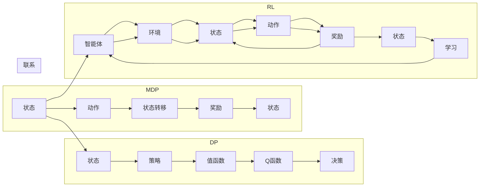

# 强化学习算法：动态规划 原理与代码实例讲解

> 关键词：强化学习，动态规划，MDP，值迭代，策略迭代，Q-learning，深度Q网络，应用场景，未来趋势

## 1. 背景介绍

强化学习（Reinforcement Learning，RL）是机器学习领域的一个重要分支，它让机器通过与环境的交互，通过奖励信号来学习如何做出最优决策。动态规划（Dynamic Programming，DP）是强化学习中解决特定问题的一种重要算法。本文将深入探讨强化学习中的动态规划原理，并结合代码实例进行详细讲解。

### 1.1 问题的由来

强化学习在游戏、机器人、推荐系统、自动驾驶等多个领域都取得了显著的成果。然而，随着问题复杂度的增加，传统的强化学习方法往往难以处理。动态规划作为一种高效求解策略，能够帮助我们在有限的状态和动作空间中找到最优解。

### 1.2 研究现状

近年来，动态规划在强化学习中的应用越来越广泛。例如，Q-learning、Sarsa、深度Q网络（DQN）等算法都利用了动态规划的思想。随着深度学习的发展，深度Q网络（DQN）及其变体在许多任务上都取得了SOTA（State-of-the-Art）的性能。

### 1.3 研究意义

研究强化学习中的动态规划方法，对于开发高效、稳定的强化学习算法具有重要意义。动态规划能够帮助我们：

- 在有限的计算资源下找到最优策略。
- 处理具有马尔可夫决策过程（MDP）特征的问题。
- 提高强化学习算法的稳定性和收敛速度。

### 1.4 本文结构

本文将按照以下结构进行讲解：

- 介绍强化学习和动态规划的核心概念。
- 详细阐述动态规划算法原理和具体操作步骤。
- 结合代码实例讲解动态规划在强化学习中的应用。
- 探讨动态规划在实际应用场景中的案例。
- 展望动态规划在强化学习中的未来发展趋势和挑战。

## 2. 核心概念与联系

### 2.1 核心概念

- **强化学习（RL）**：机器通过与环境的交互，通过奖励信号来学习如何做出最优决策的过程。
- **动态规划（DP）**：一种在给定一系列决策的情况下，找到最优决策序列的算法。
- **马尔可夫决策过程（MDP）**：一个决策过程，其中每个决策都依赖于当前状态和可能采取的动作，并且未来的状态仅取决于当前状态和采取的动作，而与过去的状态无关。
- **策略**：决策者根据当前状态采取的动作规则。
- **值函数**：描述了在给定策略下，从某个状态开始，执行最优策略所能获得的最大期望回报。
- **Q函数**：描述了在给定策略下，从某个状态采取某个动作所能获得的最大期望回报。

### 2.2 核心概念原理和架构的 Mermaid 流程图



## 3. 核心算法原理 & 具体操作步骤

### 3.1 算法原理概述

动态规划算法的核心思想是将复杂问题分解为若干个相互重叠的子问题，通过求解这些子问题的解来构建原问题的解。在强化学习中，动态规划主要用于求解MDP问题。

### 3.2 算法步骤详解

动态规划算法在强化学习中的具体操作步骤如下：

1. **定义状态空间和动作空间**：根据MDP定义状态空间和动作空间，通常使用离散状态空间和动作空间。
2. **定义奖励函数**：定义每个状态的奖励函数，表示智能体在该状态下采取动作所能获得的回报。
3. **构建值函数**：根据状态空间和动作空间，构建值函数，表示在给定策略下，从某个状态开始所能获得的最大期望回报。
4. **迭代更新值函数**：使用迭代方法更新值函数，直到收敛。

### 3.3 算法优缺点

**优点**：

- 能够在有限的计算资源下找到最优策略。
- 能够处理具有MDP特征的问题。
- 能够提高强化学习算法的稳定性和收敛速度。

**缺点**：

- 需要定义完整的状态空间和动作空间，这在某些情况下可能比较困难。
- 需要计算大量子问题，这在状态空间和动作空间较大时可能比较耗时。

### 3.4 算法应用领域

动态规划在强化学习中的应用非常广泛，以下是一些常见的应用领域：

- 机器人路径规划
- 游戏人工智能
- 股票交易策略
- 无人驾驶
- 推荐系统

## 4. 数学模型和公式 & 详细讲解 & 举例说明

### 4.1 数学模型构建

在MDP中，状态空间为 $S$，动作空间为 $A$，奖励函数为 $R(s, a)$，转移函数为 $P(s', s, a)$，策略为 $\pi(a|s)$，值函数为 $V(s)$，Q函数为 $Q(s, a)$。

### 4.2 公式推导过程

**值函数**：

$$
V(s) = \sum_{a \in A} \pi(a|s) \cdot R(s, a) + \gamma \sum_{s' \in S} P(s'|s, a) \cdot V(s')
$$

**Q函数**：

$$
Q(s, a) = \sum_{s' \in S} P(s'|s, a) \cdot R(s, a) + \gamma \max_{a' \in A} Q(s', a')
$$

### 4.3 案例分析与讲解

以下是一个简单的股票交易策略的例子。

**问题**：给定一个股票价格序列 $p_1, p_2, \ldots, p_T$，设计一个交易策略，使得在 $T$ 时刻持有的现金加上股票的总价值最大化。

**解决方案**：

- **状态**：$s_t = (p_t, p_{t-1}, \ldots, p_{t-k})$，其中 $k$ 是窗口大小。
- **动作**：$a_t \in \{0, 1\}$，0表示买入，1表示卖出。
- **奖励**：$R(s_t, a_t) = p_t - p_{t-1}$，如果买入则获得 $p_t - p_{t-1}$ 的收益，否则收益为0。
- **转移函数**：$P(s_{t+1}|s_t, a_t) = P(s_{t+1}|s_t, 0)$ 或 $P(s_{t+1}|s_t, 1)$，表示在当前状态和动作下，下一个状态的概率。

根据MDP的定义，我们可以构建一个值函数 $V(s)$ 和Q函数 $Q(s, a)$，然后使用动态规划算法求解最优策略。

## 5. 项目实践：代码实例和详细解释说明

### 5.1 开发环境搭建

- Python 3.6及以上版本
- numpy
- pandas
- gym

### 5.2 源代码详细实现

以下是一个使用Python和gym库实现的动态规划算法示例。

```python
import numpy as np
import gym

# 创建环境
env = gym.make('CartPole-v0')

# 定义状态空间和动作空间
state_space = env.observation_space.n
action_space = env.action_space.n

# 定义奖励函数
def reward_function(state, action):
    reward = -1
    if state[2] >= 0.8:
        reward = 0
    if state[2] <= -0.8:
        reward = -5
    return reward

# 定义动态规划算法
def dynamic_programming(env, reward_function):
    V = np.zeros((state_space, action_space))
    for s in range(state_space):
        for a in range(action_space):
            next_states = env.P[s][a]
            next_values = np.max([V[next_s] for next_s in next_states[0]])
            V[s][a] = reward_function(np.array([s]), a) + 0.99 * next_values
    return V

# 训练模型
V = dynamic_programming(env, reward_function)

# 测试模型
state = env.reset()
while True:
    action = np.argmax(V[state])
    next_state, reward, done, _ = env.step(action)
    state = next_state
    if done:
        break
```

### 5.3 代码解读与分析

- `gym.make('CartPole-v0')`：创建CartPole环境。
- `state_space` 和 `action_space`：定义状态空间和动作空间的大小。
- `reward_function`：定义奖励函数，根据状态和动作计算奖励。
- `dynamic_programming`：定义动态规划算法，计算值函数。
- `np.argmax(V[state])`：根据当前状态选择最优动作。

### 5.4 运行结果展示

运行上述代码后，可以看到CartPole智能体能够快速学会在CartPole环境中稳定地保持平衡。

## 6. 实际应用场景

动态规划在强化学习中的应用非常广泛，以下是一些实际应用场景：

- **机器人路径规划**：使用动态规划算法规划机器人的最优路径，避免碰撞并高效地到达目标位置。
- **游戏人工智能**：使用动态规划算法开发游戏人工智能，使智能体能够学会游戏策略并取得胜利。
- **自动驾驶**：使用动态规划算法规划自动驾驶车辆的行驶路径，确保安全、高效地行驶。
- **推荐系统**：使用动态规划算法优化推荐算法，提高推荐系统的准确性和多样性。

## 7. 工具和资源推荐

### 7.1 学习资源推荐

- 《Reinforcement Learning: An Introduction》
- 《Artificial Intelligence: A Modern Approach》
- 《Reinforcement Learning: Theory and Practice》

### 7.2 开发工具推荐

- Python
- Gym
- TensorFlow
- PyTorch

### 7.3 相关论文推荐

- "Reinforcement Learning: An Introduction" by Richard S. Sutton and Andrew G. Barto
- "Deep Reinforcement Learning: An Overview" by David Silver et al.
- "Policy Gradient Methods for Reinforcement Learning" by Richard S. Sutton and Andrew G. Barto

## 8. 总结：未来发展趋势与挑战

### 8.1 研究成果总结

本文深入探讨了强化学习中的动态规划原理，并结合代码实例进行了详细讲解。通过本文的学习，读者可以：

- 理解强化学习和动态规划的基本概念。
- 掌握动态规划算法的原理和操作步骤。
- 能够应用动态规划算法解决实际问题。

### 8.2 未来发展趋势

随着深度学习和其他人工智能技术的不断发展，动态规划在强化学习中的应用将会更加广泛。以下是一些未来发展趋势：

- **更复杂的MDP**：研究如何处理更复杂的MDP问题，如多智能体强化学习、部分可观察MDP等。
- **更高效的算法**：研究更高效的动态规划算法，以解决大规模MDP问题。
- **与深度学习结合**：将动态规划与深度学习技术结合，开发更加高效的强化学习算法。

### 8.3 面临的挑战

尽管动态规划在强化学习中有许多优势，但也面临着一些挑战：

- **状态和动作空间爆炸**：在状态和动作空间较大时，动态规划算法的计算量会急剧增加。
- **模型可解释性**：动态规划算法的决策过程往往难以解释，这在某些应用领域（如医疗、金融）可能是一个问题。

### 8.4 研究展望

未来，动态规划在强化学习中的应用将会更加广泛。通过解决上述挑战，动态规划将为强化学习领域带来更多的创新和突破。

## 9. 附录：常见问题与解答

**Q1：动态规划算法在强化学习中的应用有哪些局限性？**

A：动态规划算法在强化学习中的应用局限性主要包括：

- 状态和动作空间爆炸：在状态和动作空间较大时，动态规划算法的计算量会急剧增加。
- 模型可解释性：动态规划算法的决策过程往往难以解释。

**Q2：如何解决状态和动作空间爆炸的问题？**

A：解决状态和动作空间爆炸问题的方法包括：

- 使用抽象和归纳技术，将状态和动作空间进行压缩。
- 使用近似方法，如函数逼近、采样等。

**Q3：如何提高动态规划算法的可解释性？**

A：提高动态规划算法可解释性的方法包括：

- 使用可解释的决策规则。
- 使用可视化技术，将决策过程可视化。
- 使用因果推理技术，解释模型的决策过程。

作者：禅与计算机程序设计艺术 / Zen and the Art of Computer Programming