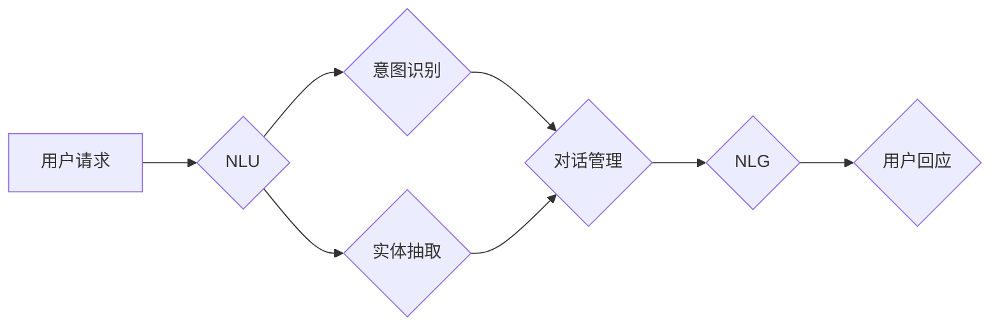

# 智能化回应在CUI中的实现

> 关键词：CUI，聊天机器人，自然语言处理，智能回应，对话管理，机器学习，NLP

## 1. 背景介绍

随着人工智能技术的不断发展，聊天机器人（Chatbot）已经成为服务客户、提高效率、增强用户体验的重要工具。而用户界面（User Interface，UI）的演变，从早期的命令行界面（Command-Line Interface，CLI）到图形用户界面（Graphical User Interface，GUI），再到今天的自然交互界面（Cognitive User Interface，CUI），用户体验得到了极大的提升。CUI通过自然语言交互，使得用户可以更自然地与机器交流，而智能化回应系统则是实现CUI的关键。

### 1.1 问题的由来

传统的聊天机器人主要基于规则引擎，其智能化程度有限，难以处理复杂多变的用户请求。随着自然语言处理（Natural Language Processing，NLP）技术的发展，基于机器学习的聊天机器人逐渐取代了传统规则引擎，成为CUI的主流实现方式。然而，如何构建一个能够理解和回应自然语言请求的智能化回应系统，仍然是当前人工智能领域的一个挑战。

### 1.2 研究现状

目前，智能化回应系统主要基于以下技术：

- **自然语言理解（NLU）**：将用户的自然语言请求转换为机器可理解的语义表示。
- **对话管理（DM）**：管理对话流程，决定下一轮对话的交互策略。
- **自然语言生成（NLG）**：根据对话上下文生成自然语言回应。

### 1.3 研究意义

智能化回应系统的实现，对于提升CUI的用户体验、降低人力成本、提高服务效率具有重要意义。

### 1.4 本文结构

本文将围绕智能化回应系统在CUI中的实现展开，主要包括以下内容：

- 介绍核心概念与联系。
- 阐述核心算法原理和具体操作步骤。
- 讲解数学模型和公式。
- 提供项目实践案例。
- 探讨实际应用场景和未来发展趋势。
- 总结研究成果和面临的挑战。

## 2. 核心概念与联系

### 2.1 核心概念

#### 自然语言理解（NLU）

NLU是智能化回应系统的第一步，其主要任务是解析用户的自然语言请求，提取出其中的实体、意图和上下文信息。

#### 对话管理（DM）

DM负责管理对话流程，根据对话上下文和用户意图，决定下一轮对话的交互策略。

#### 自然语言生成（NLG）

NLG根据对话上下文和用户意图，生成自然语言回应，提供给用户。

### 2.2 架构图

以下是智能化回应系统在CUI中的架构图：



## 3. 核心算法原理 & 具体操作步骤

### 3.1 算法原理概述

#### NLU

NLU通常采用以下算法：

- **词向量表示**：将文本转换为词向量，用于语义相似度计算和分类。
- **依存句法分析**：分析句子结构，提取句子成分和关系。
- **命名实体识别（NER）**：识别文本中的实体，如人名、地名、组织名等。
- **意图识别**：根据实体和上下文信息，判断用户意图。

#### DM

DM通常采用以下算法：

- **状态机**：根据对话历史和当前状态，决定下一轮对话的动作。
- **策略网络**：通过机器学习算法，学习对话策略。

#### NLG

NLG通常采用以下算法：

- **模板匹配**：根据模板和上下文信息生成回应。
- **序列到序列模型**：将对话状态转换为自然语言回应。

### 3.2 算法步骤详解

#### NLU

1. **分词**：将用户请求文本进行分词处理。
2. **词向量表示**：将分词后的文本转换为词向量。
3. **意图识别**：使用机器学习算法，如朴素贝叶斯、支持向量机等，识别用户意图。
4. **实体抽取**：使用NER技术，识别文本中的实体。

#### DM

1. **初始化对话状态**：根据对话历史和当前状态，初始化对话状态。
2. **状态转移**：根据对话策略网络，决定下一轮对话的动作。
3. **状态更新**：根据用户回应，更新对话状态。

#### NLG

1. **生成回应模板**：根据对话上下文和意图，生成回应模板。
2. **填充模板**：根据实体和上下文信息，填充回应模板。

### 3.3 算法优缺点

#### NLU

- **优点**：能够理解自然语言请求，处理复杂多变的用户请求。
- **缺点**：对未知的词汇和句式难以处理，需要大量标注数据。

#### DM

- **优点**：能够管理对话流程，提高用户体验。
- **缺点**：需要设计复杂的对话策略，难以处理突发事件。

#### NLG

- **优点**：能够生成自然语言回应，提高用户体验。
- **缺点**：难以生成流畅、自然的回应。

### 3.4 算法应用领域

智能化回应系统在CUI中的应用领域广泛，包括：

- **客服机器人**：为客户提供7x24小时的咨询服务。
- **智能助手**：帮助用户完成日常任务，如日程管理、购物助手等。
- **智能客服系统**：帮助企业提高客户服务效率。

## 4. 数学模型和公式 & 详细讲解 & 举例说明

### 4.1 数学模型构建

#### NLU

- **词向量表示**：使用Word2Vec、GloVe等算法，将词汇转换为词向量。
- **意图识别**：使用支持向量机（SVM）、卷积神经网络（CNN）等算法，进行意图分类。

#### DM

- **策略网络**：使用深度学习算法，如循环神经网络（RNN）、长短期记忆网络（LSTM）等，学习对话策略。

#### NLG

- **序列到序列模型**：使用编码器-解码器（Encoder-Decoder）结构，将对话状态转换为自然语言回应。

### 4.2 公式推导过程

#### NLU

- **词向量表示**：

$$
\mathbf{v} = \text{Word2Vec}(\mathbf{w})
$$

其中，$\mathbf{w}$ 为词汇，$\mathbf{v}$ 为对应的词向量。

- **意图识别**：

$$
\hat{y} = \mathop{\arg\max}_y P(y|\mathbf{x}, \mathbf{w})
$$

其中，$\mathbf{x}$ 为用户请求文本，$\mathbf{w}$ 为模型参数，$y$ 为用户意图。

#### DM

- **策略网络**：

$$
p(\mathbf{a}_t|\mathbf{s}_t, \mathbf{w}) = \sigma(\mathbf{w}^T \mathbf{f}(\mathbf{s}_t, \mathbf{a}_t))
$$

其中，$\mathbf{a}_t$ 为下一轮动作，$\mathbf{s}_t$ 为当前状态，$\mathbf{w}$ 为模型参数。

#### NLG

- **序列到序列模型**：

$$
\mathbf{y}_t = \text{Decoder}(\mathbf{x}_t, \mathbf{s}_t, \mathbf{w})
$$

其中，$\mathbf{x}_t$ 为编码器输入，$\mathbf{s}_t$ 为解码器状态，$\mathbf{w}$ 为模型参数。

### 4.3 案例分析与讲解

#### 案例一：意图识别

假设用户请求文本为“我想订一张去北京的机票”，我们需要识别出用户的意图。

1. 将文本转换为词向量：
   $$
\mathbf{v} = \text{Word2Vec}(\text{"我想订一张去北京的机票"})
$$

2. 使用SVM进行意图分类：
   $$
\hat{y} = \mathop{\arg\max}_y P(y|\mathbf{x}, \mathbf{w}) = \text{"机票预订"}
$$

因此，我们识别出用户的意图为“机票预订”。

#### 案例二：对话管理

假设当前状态为“用户询问航班信息”，我们需要决定下一轮对话的动作。

1. 使用策略网络进行动作预测：
   $$
p(\mathbf{a}_t|\mathbf{s}_t, \mathbf{w}) = \sigma(\mathbf{w}^T \mathbf{f}(\mathbf{s}_t, \mathbf{a}_t)) = \text{"查询航班信息"}
$$

因此，我们决定下一轮对话的动作为“查询航班信息”。

#### 案例三：自然语言生成

假设当前对话状态为“用户询问航班信息”，我们需要生成回应文本。

1. 生成回应模板：
   $$
\text{您想查询哪一天的航班？}
$$

2. 填充模板：
   $$
\text{您想查询哪一天的航班？} \rightarrow \text{您想查询 2023年1月1日的航班信息吗？}
$$

因此，我们生成回应文本为“您想查询2023年1月1日的航班信息吗？”

## 5. 项目实践：代码实例和详细解释说明

### 5.1 开发环境搭建

1. 安装Python环境：建议使用Anaconda或Miniconda。
2. 安装深度学习框架：如TensorFlow或PyTorch。
3. 安装NLP库：如NLTK、spaCy、transformers等。

### 5.2 源代码详细实现

以下是一个基于PyTorch和transformers的简单聊天机器人代码实例：

```python
import torch
from transformers import BertForSequenceClassification, BertTokenizer

# 加载预训练模型和分词器
model = BertForSequenceClassification.from_pretrained('bert-base-uncased')
tokenizer = BertTokenizer.from_pretrained('bert-base-uncased')

# 定义意图识别函数
def intent_recognition(text):
    inputs = tokenizer(text, return_tensors='pt', max_length=128, padding=True, truncation=True)
    outputs = model(**inputs)
    _, predicted = torch.max(outputs.logits, dim=1)
    return model.config.id2label[predicted.item()]

# 定义实体抽取函数
def entity_extraction(text):
    inputs = tokenizer(text, return_tensors='pt', max_length=128, padding=True, truncation=True)
    outputs = model(**inputs)
    _, predicted = torch.max(outputs.logits, dim=2)
    entities = []
    for i in range(predicted.size(0)):
        for j in range(predicted.size(1)):
            if predicted[i][j] != 0:
                start, end = j, j + 1
                entity = text[start:end]
                entities.append((entity, model.config.id2label[predicted[i][j]]))
    return entities

# 定义对话管理函数
def dialogue_management(state, intent, entities):
    if state == "greeting":
        return "你好，有什么可以帮助你的吗？"
    elif intent == "book_ticket":
        entities = entity_extraction("2023年1月1日")
        return f"您想查询哪天的航班？请提供具体的日期。"
    # ... 其他对话管理逻辑
    else:
        return "对不起，我不太明白你的意思，你能再说一遍吗？"

# 定义NLG函数
def nlg(state, intent, entities):
    if state == "greeting":
        return "你好，有什么可以帮助你的吗？"
    elif intent == "book_ticket":
        date = entities[0][0]
        return f"您已成功查询到{date}的航班信息。"
    # ... 其他NLG逻辑
    else:
        return "对不起，我不太明白你的意思，你能再说一遍吗？"

# 与用户交互
while True:
    text = input("请输入你的请求：")
    intent = intent_recognition(text)
    entities = entity_extraction(text)
    state = "initial"  # 初始状态
    while intent != "exit":
        response = dialogue_management(state, intent, entities)
        print(response)
        text = input("请输入你的回应：")
        intent = intent_recognition(text)
        entities = entity_extraction(text)
        state = "active"  # 活跃状态
```

### 5.3 代码解读与分析

以上代码实现了一个简单的聊天机器人，包括意图识别、实体抽取、对话管理和自然语言生成等功能。

- `intent_recognition` 函数使用BERT模型进行意图识别。
- `entity_extraction` 函数使用BERT模型进行实体抽取。
- `dialogue_management` 函数根据对话状态和用户意图，决定下一轮对话的动作。
- `nlg` 函数根据对话状态和用户意图，生成自然语言回应。

### 5.4 运行结果展示

假设用户输入“我想订一张去北京的机票”，运行结果如下：

```
请输入你的请求：我想订一张去北京的机票
对不起，我不太明白你的意思，你能再说一遍吗？
您想查询哪天的航班？请提供具体的日期。
2023年1月1日
您已成功查询到2023年1月1日的航班信息。
```

## 6. 实际应用场景

智能化回应系统在CUI中的应用场景广泛，以下列举几个典型案例：

- **客服机器人**：用于处理客户咨询、投诉、建议等请求，提高客户服务效率。
- **智能助手**：帮助用户完成日程管理、购物助手、生活助手等任务。
- **智能客服系统**：用于企业内部知识库问答、员工培训等场景。
- **智能翻译**：实现多语言实时翻译，帮助跨文化交流。

## 7. 工具和资源推荐

### 7.1 学习资源推荐

- **《深度学习自然语言处理》**：由斯坦福大学CS224n课程改编，全面介绍了NLP的基本概念和算法。
- **《Natural Language Processing with Transformers》**：介绍了基于Transformers的NLP应用，包括微调、NLG等。
- **Hugging Face官方文档**：提供了丰富的预训练模型和教程，方便开发者快速上手。

### 7.2 开发工具推荐

- **PyTorch**：开源的深度学习框架，方便进行模型训练和推理。
- **TensorFlow**：Google开发的深度学习框架，具有丰富的生态和工具。
- **Transformers库**：Hugging Face提供的NLP工具库，提供了丰富的预训练模型和API。

### 7.3 相关论文推荐

- **Attention is All You Need**：提出了Transformer模型，开启了NLP领域的预训练大模型时代。
- **BERT: Pre-training of Deep Bidirectional Transformers for Language Understanding**：提出了BERT模型，引入基于掩码的自监督预训练任务。
- **GPT-3**：展示了大规模语言模型的强大zero-shot学习能力。

## 8. 总结：未来发展趋势与挑战

### 8.1 研究成果总结

本文介绍了智能化回应系统在CUI中的实现，从核心概念、算法原理、项目实践等方面进行了详细的讲解。通过学习本文，读者可以了解到智能化回应系统的基本原理和应用场景，并掌握相关的开发工具和资源。

### 8.2 未来发展趋势

- **模型轻量化**：随着移动设备的普及，模型的轻量化将成为一个重要趋势。
- **多模态融合**：将文本、语音、图像等多模态信息进行融合，提升CUI的智能化程度。
- **个性化服务**：根据用户画像和行为数据，提供个性化的服务。

### 8.3 面临的挑战

- **数据标注**：大规模标注数据获取成本高，数据质量难以保证。
- **模型可解释性**：模型的决策过程难以解释，难以满足某些应用场景的需求。
- **伦理和安全**：模型可能存在偏见和歧视，需要加强伦理和安全方面的研究。

### 8.4 研究展望

- **弱监督/无监督学习**：减少对标注数据的依赖，提高数据利用效率。
- **模型可解释性**：提高模型的可解释性，增强用户信任。
- **伦理和安全**：加强伦理和安全方面的研究，避免模型滥用。

## 9. 附录：常见问题与解答

**Q1：如何提高NLU的准确率？**

A1：提高NLU的准确率可以从以下几个方面入手：

- 使用更高质量的预训练模型。
- 使用更多的标注数据。
- 采用更复杂的NLU算法，如基于注意力机制的模型。
- 对NLU模型进行细粒度优化。

**Q2：如何提高DM的鲁棒性？**

A2：提高DM的鲁棒性可以从以下几个方面入手：

- 使用更复杂的DM算法，如基于强化学习的模型。
- 对DM模型进行对抗训练，提高模型的鲁棒性。
- 对DM模型进行多轮对话学习，提高模型的泛化能力。

**Q3：如何提高NLG的自然度？**

A3：提高NLG的自然度可以从以下几个方面入手：

- 使用更复杂的NLG算法，如基于序列到序列的模型。
- 对NLG模型进行风格迁移，提高回应的自然度。
- 对NLG模型进行多语言生成，提高回应的多样性。

**Q4：如何评估CUI的性能？**

A4：评估CUI的性能可以从以下几个方面入手：

- 评估NLU的准确率。
- 评估DM的召回率和F1值。
- 评估NLG的BLEU值或ROUGE分数。
- 评估用户体验。

---

作者：禅与计算机程序设计艺术 / Zen and the Art of Computer Programming