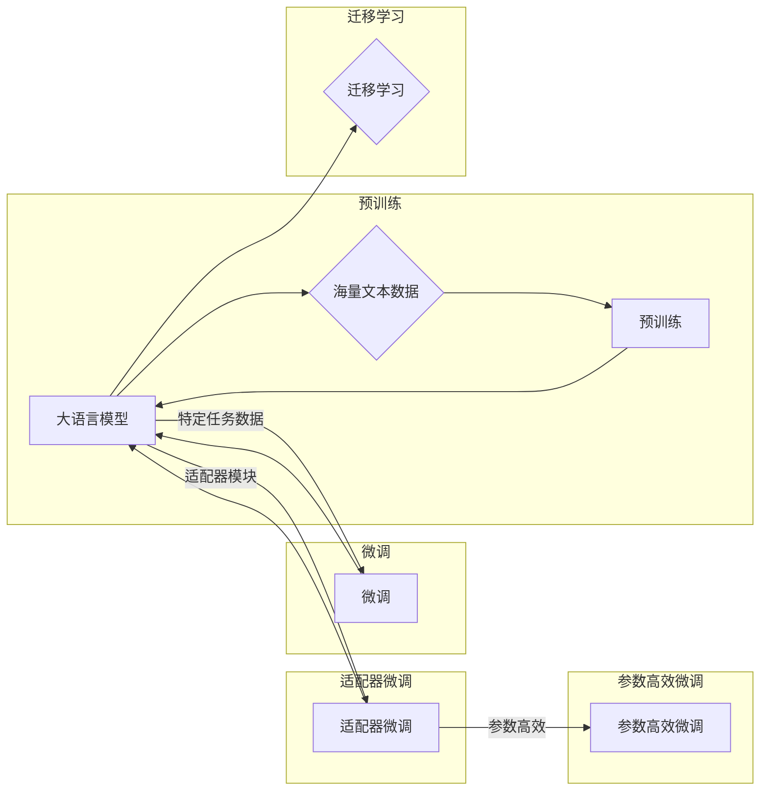

# 大语言模型原理与工程实践：适配器微调

> 关键词：大语言模型，适配器微调，Transformer，参数高效微调，迁移学习，NLP，自然语言处理

## 1. 背景介绍

随着深度学习技术的飞速发展，大语言模型（Large Language Model，LLM）在自然语言处理（Natural Language Processing，NLP）领域展现出惊人的能力。LLM通过在海量文本数据上进行预训练，学习到丰富的语言模式和知识，为各种NLP任务提供了强大的基础。然而，LLM在特定领域的应用往往需要针对具体任务进行微调（Fine-tuning），以适应特定领域的语言特征和任务需求。

近年来，适配器微调（Adapter-based Fine-tuning）作为一种高效的微调方法，受到了广泛关注。它通过引入轻量级的适配器模块，实现参数高效微调，在保证模型性能的同时，显著降低计算成本。本文将深入探讨适配器微调的原理、方法、应用场景以及未来发展趋势。

## 2. 核心概念与联系

### 2.1 核心概念

#### 2.1.1 大语言模型

大语言模型是基于深度学习的NLP模型，通过在大量文本语料上进行预训练，学习到丰富的语言模式和知识。常见的LLM包括GPT、BERT、T5等。

#### 2.1.2 微调

微调是在预训练模型的基础上，使用特定任务的数据进行训练，以优化模型在特定任务上的性能。微调是LLM在特定领域应用的关键技术。

#### 2.1.3 适配器微调

适配器微调是一种参数高效的微调方法，通过引入轻量级的适配器模块，实现模型在特定任务上的快速适应。

### 2.2 核心概念原理和架构的 Mermaid 流程图



## 3. 核心算法原理 & 具体操作步骤

### 3.1 算法原理概述

适配器微调的核心思想是将预训练模型的输出层替换为一个可学习的适配器模块，该模块负责将预训练模型的输出转化为特定任务所需的输出。适配器模块通常由几层全连接层组成，参数量远小于整个模型。

### 3.2 算法步骤详解

1. **加载预训练模型**：选择一个预训练模型作为基础模型，如BERT、GPT等。
2. **定义适配器模块**：设计一个轻量级的适配器模块，该模块由几层全连接层组成，参数量远小于基础模型。
3. **替换输出层**：将基础模型的输出层替换为适配器模块。
4. **微调**：使用特定任务的数据对模型进行微调，优化适配器模块的参数。
5. **评估**：在测试集上评估模型的性能，并与原始预训练模型进行比较。

### 3.3 算法优缺点

**优点**：

* 参数高效：适配器模块参数量小，微调速度快，计算成本低。
* 性能优异：适配器微调在保证微调速度的同时，能够获得与原始模型相当的性能。
* 易于实现：适配器模块结构简单，易于实现和部署。

**缺点**：

* 调参复杂：适配器模块的参数需要单独调参，可能需要更多的实验和经验。
* 模型复杂度受限：由于适配器模块参数量小，可能无法完全模拟原始模型的复杂度。

### 3.4 算法应用领域

适配器微调在NLP领域具有广泛的应用前景，包括：

* 文本分类：对文本进行分类，如情感分析、主题分类等。
* 命名实体识别：识别文本中的实体，如人名、地名、机构名等。
* 机器翻译：将一种语言的文本翻译成另一种语言。
* 问答系统：回答用户提出的问题。
* 文本生成：生成自然语言文本。

## 4. 数学模型和公式 & 详细讲解 & 举例说明

### 4.1 数学模型构建

假设预训练模型为 $M$，适配器模块为 $A$，则适配器微调的数学模型可以表示为：

$$
M'(x) = A(M(x))
$$

其中 $x$ 为输入数据，$M(x)$ 为预训练模型对输入数据的处理结果，$M'(x)$ 为适配器微调模型对输入数据的处理结果。

### 4.2 公式推导过程

以BERT模型为例，假设BERT模型的输出为 $[CLS, [CLS], [SEP], T_1, ..., T_n, [SEP]]$，其中 $[CLS]$ 表示分类任务中的分类标签，$[SEP]$ 表示句子分隔符，$T_1, ..., T_n$ 表示句子中的各个token。

适配器模块可以设计为一个全连接层，其参数为 $W$，则适配器微调模型的输出可以表示为：

$$
A(M(x)) = W\left(\text{[CLS], [SEP], T_1, ..., T_n, [SEP]}\right)
$$

### 4.3 案例分析与讲解

以文本分类任务为例，我们将BERT模型的输出中的 $[CLS]$ 标签作为分类标签，将其送入适配器模块进行分类。

```python
import torch
import torch.nn as nn

class Adapter(nn.Module):
    def __init__(self, input_dim, output_dim):
        super(Adapter, self).__init__()
        self.fc = nn.Linear(input_dim, output_dim)

    def forward(self, x):
        return self.fc(x)

# 加载预训练模型
model = transformers.BertModel.from_pretrained('bert-base-uncased')

# 定义适配器模块
input_dim = model.config.hidden_size
output_dim = 2  # 文本分类任务的类别数
adapter = Adapter(input_dim, output_dim)

# 假设输入文本为 "This is a great product"
input_ids = torch.tensor([tokenizer.encode("This is a great product")])
output = model(input_ids)
cls_emb = output.last_hidden_state[:, 0, :]  # 获取[CLS]标签的表示

# 使用适配器模块进行分类
logits = adapter(cls_emb)

# 计算概率
probabilities = nn.functional.softmax(logits, dim=1)

# 输出概率最高的类别
predicted_category = torch.argmax(probabilities, dim=1)

print("Predicted category:", id2label[predicted_category.item()])
```

## 5. 项目实践：代码实例和详细解释说明

### 5.1 开发环境搭建

1. 安装Python和PyTorch。
2. 安装transformers库：`pip install transformers`。

### 5.2 源代码详细实现

```python
import torch
import torch.nn as nn
import transformers

# 加载预训练模型
model = transformers.BertModel.from_pretrained('bert-base-uncased')

# 定义适配器模块
input_dim = model.config.hidden_size
output_dim = 2  # 文本分类任务的类别数
adapter = Adapter(input_dim, output_dim)

# 微调模型
optimizer = torch.optim.AdamW([adapter.fc.parameters()], lr=2e-5)
num_epochs = 3

for epoch in range(num_epochs):
    for input_ids, labels in dataloader:
        outputs = model(input_ids)
        cls_emb = outputs.last_hidden_state[:, 0, :]  # 获取[CLS]标签的表示
        logits = adapter(cls_emb)
        loss = nn.functional.cross_entropy(logits, labels)
        optimizer.zero_grad()
        loss.backward()
        optimizer.step()
    print(f"Epoch {epoch+1}, loss: {loss.item()}")

# 评估模型
test_loss, test_accuracy = evaluate(model, test_dataloader)
print(f"Test loss: {test_loss}, Test accuracy: {test_accuracy}")
```

### 5.3 代码解读与分析

上述代码实现了基于BERT的文本分类任务，并使用适配器微调模型进行训练和评估。

1. 加载预训练模型和适配器模块。
2. 定义优化器和训练轮数。
3. 循环遍历训练数据，进行模型训练和损失计算。
4. 评估模型在测试集上的性能。

## 6. 实际应用场景

适配器微调在NLP领域具有广泛的应用场景，以下列举几个例子：

* **情感分析**：对用户评论进行情感分类，判断用户评论是正面、负面还是中性。
* **文本摘要**：对长文本进行摘要，提取文本的关键信息。
* **机器翻译**：将一种语言的文本翻译成另一种语言。
* **问答系统**：回答用户提出的问题。
* **命名实体识别**：识别文本中的实体，如人名、地名、机构名等。

## 7. 工具和资源推荐

### 7.1 学习资源推荐

* 《Natural Language Processing with Transformers》：详细介绍Transformers库和基于Transformers的NLP任务开发。
* 《The Annotated Transformer》：深入解析Transformer模型的结构和原理。
* 《Deep Learning for Natural Language Processing》：全面介绍NLP领域的深度学习技术。

### 7.2 开发工具推荐

* PyTorch：开源深度学习框架，支持多种深度学习模型的训练和推理。
* Transformers库：Hugging Face提供的NLP工具库，集成了大量的预训练模型和微调工具。
* Jupyter Notebook：支持交互式编程，方便进行模型开发和实验。

### 7.3 相关论文推荐

* "A Simple and Effective Approach to Language Modeling"，by KEG Lab
* "BERT: Pre-training of Deep Bidirectional Transformers for Language Understanding"，by Google AI
* "T5: Text-to-Text Transfer Transformer"，by Google AI

## 8. 总结：未来发展趋势与挑战

### 8.1 研究成果总结

本文深入探讨了适配器微调的原理、方法、应用场景以及未来发展趋势。适配器微调作为一种参数高效的微调方法，在保证模型性能的同时，显著降低计算成本，为LLM在NLP领域的应用提供了新的思路。

### 8.2 未来发展趋势

* **模型轻量化**：进一步减小适配器模块的参数量，提高模型的推理速度。
* **模型可解释性**：增强模型的可解释性，提高模型的可信度和可靠性。
* **多模态融合**：将文本信息与其他模态信息进行融合，提升模型对现实世界的理解和建模能力。

### 8.3 面临的挑战

* **模型效率**：如何进一步提高模型的推理速度和效率。
* **模型可解释性**：如何提高模型的可解释性，增强模型的可信度和可靠性。
* **模型安全**：如何提高模型的安全性，防止模型被恶意利用。

### 8.4 研究展望

适配器微调作为一种参数高效的微调方法，在NLP领域具有广阔的应用前景。未来，随着研究的深入，相信适配器微调技术将会在更多领域发挥重要作用，推动人工智能技术的发展。

---

作者：禅与计算机程序设计艺术 / Zen and the Art of Computer Programming