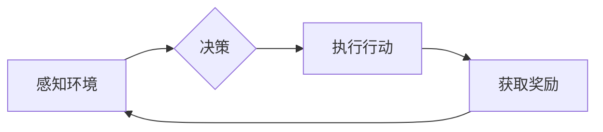

# 深入理解AI Agent核心技术

> 关键词：AI Agent，智能体，强化学习，决策过程，环境交互，多智能体系统，环境模型，学习算法

## 1. 背景介绍

随着人工智能技术的飞速发展，智能体（AI Agent）作为人工智能领域的一个核心概念，已经在机器人、游戏、推荐系统、自动驾驶等多个领域取得了显著的应用成果。AI Agent能够模拟人类智能行为，通过与环境交互自主地完成各种复杂任务。深入理解AI Agent的核心技术，对于推动人工智能技术的进步和应用具有重要意义。

### 1.1 问题的由来

在人工智能领域，我们常常面临以下问题：

- 如何让机器像人类一样具备决策能力？
- 如何让机器能够自主学习和适应不断变化的环境？
- 如何让多个智能体协同工作，实现更复杂的任务？

这些问题都指向了AI Agent这一核心技术。AI Agent通过模拟人类的决策过程，能够与环境交互，学习环境中的知识和策略，从而实现自主行动。

### 1.2 研究现状

近年来，AI Agent的研究取得了长足的进步，主要研究方向包括：

- 强化学习：通过与环境交互学习最优策略。
- 深度学习：利用神经网络模型进行环境建模和决策。
- 模型预测控制：结合模型和预测算法进行决策。
- 多智能体系统：研究多个智能体之间的交互和协同。

### 1.3 研究意义

研究AI Agent的核心技术，对于以下方面具有重要意义：

- 提高机器智能水平，使其能够自主学习和适应环境。
- 推动人工智能技术在各个领域的应用，如机器人、游戏、自动驾驶等。
- 促进人工智能与其他学科的交叉融合，如认知科学、心理学等。

### 1.4 本文结构

本文将围绕AI Agent的核心技术展开，具体内容包括：

- AI Agent的核心概念和联系
- AI Agent的核心算法原理和操作步骤
- AI Agent的数学模型和公式
- AI Agent的项目实践
- AI Agent的实际应用场景
- AI Agent的未来发展趋势与挑战
- AI Agent的学习资源、开发工具和参考文献
- 总结与展望

## 2. 核心概念与联系

### 2.1 AI Agent的定义

AI Agent是指具有感知、推理、学习、决策和行动能力的智能实体。它能够感知环境信息，根据自身目标和当前状态，通过推理和学习制定行动策略，并采取相应行动。

### 2.2 AI Agent的核心概念

- 环境（Environment）：智能体所在的环境，包含状态、动作、奖励等要素。
- 状态（State）：描述智能体所处环境的各个方面，通常用向量表示。
- 动作（Action）：智能体可以采取的行动，通常用向量表示。
- 奖励（Reward）：智能体采取行动后获得的奖励，用于指导智能体的学习过程。
- 策略（Policy）：智能体在给定状态下的最佳行动方案。
- 模型（Model）：描述环境、状态、动作、奖励等要素之间的关系。

### 2.3 AI Agent的Mermaid流程图



### 2.4 AI Agent的核心联系

- 环境和状态：环境是状态的存在基础，状态是环境对智能体感知的反映。
- 行动和奖励：智能体通过行动改变环境，从而获取奖励。
- 策略和模型：策略基于模型制定，模型通过策略学习不断优化。
- 学习和推理：学习使智能体能够积累经验，推理使智能体能够基于经验制定行动策略。

## 3. 核心算法原理 & 具体操作步骤

### 3.1 算法原理概述

AI Agent的核心算法主要包括：

- 强化学习（Reinforcement Learning，RL）：通过与环境交互学习最优策略。
- 深度学习（Deep Learning，DL）：利用神经网络模型进行环境建模和决策。
- 模型预测控制（Model Predictive Control，MPC）：结合模型和预测算法进行决策。

### 3.2 算法步骤详解

#### 3.2.1 强化学习

强化学习的基本原理如下：

- 初始化智能体参数。
- 智能体在环境中随机选择动作。
- 环境根据动作生成下一个状态和奖励。
- 智能体根据奖励更新参数。
- 重复以上步骤，直到达到终止条件。

强化学习的具体步骤如下：

1. 初始化智能体参数。
2. 智能体在环境中随机选择动作。
3. 环境根据动作生成下一个状态和奖励。
4. 智能体根据奖励和策略更新参数。
5. 检查是否达到终止条件，若未达到，则返回步骤2。

#### 3.2.2 深度学习

深度学习的基本原理如下：

- 使用神经网络模型对环境进行建模。
- 使用梯度下降算法优化神经网络参数。
- 使用损失函数评估模型的性能。

深度学习的具体步骤如下：

1. 选择合适的神经网络模型。
2. 使用梯度下降算法优化神经网络参数。
3. 使用损失函数评估模型的性能。
4. 根据评估结果调整模型结构或参数。
5. 重复以上步骤，直到模型性能达到预设目标。

#### 3.2.3 模型预测控制

模型预测控制的基本原理如下：

- 使用动态系统模型描述环境。
- 使用预测算法预测未来状态和奖励。
- 使用优化算法确定最优控制策略。

模型预测控制的具体步骤如下：

1. 使用动态系统模型描述环境。
2. 使用预测算法预测未来状态和奖励。
3. 使用优化算法确定最优控制策略。
4. 执行最优控制策略。
5. 根据实际状态更新模型参数。

### 3.3 算法优缺点

#### 3.3.1 强化学习

优点：

- 能够处理复杂环境。
- 无需大量标注数据。
- 能够学习到全局最优策略。

缺点：

- 学习效率低，需要大量样本。
- 容易陷入局部最优。

#### 3.3.2 深度学习

优点：

- 模型表达能力强大。
- 学习效率高。

缺点：

- 对数据质量要求高。
- 模型可解释性差。

#### 3.3.3 模型预测控制

优点：

- 能够处理连续动作空间。
- 能够实现精确控制。

缺点：

- 需要精确的环境模型。
- 需要大量的计算资源。

### 3.4 算法应用领域

- 强化学习：游戏、机器人、自动驾驶、推荐系统等。
- 深度学习：图像识别、语音识别、自然语言处理等。
- 模型预测控制：工业控制、自动驾驶、无人机等。

## 4. 数学模型和公式 & 详细讲解 & 举例说明

### 4.1 数学模型构建

#### 4.1.1 强化学习

强化学习的基本数学模型如下：

- 状态空间：$\mathcal{S}$
- 动作空间：$\mathcal{A}$
- 状态转移函数：$P(s'|s,a)$
- 奖励函数：$R(s,a)$
- 策略函数：$\pi(a|s)$

#### 4.1.2 深度学习

深度学习的基本数学模型如下：

- 神经网络模型：$f(\theta)$
- 损失函数：$L(f(\theta), y)$

#### 4.1.3 模型预测控制

模型预测控制的基本数学模型如下：

- 状态空间：$\mathcal{S}$
- 动作空间：$\mathcal{A}$
- 动态系统模型：$x_{t+1} = f(x_t, u_t)$
- 奖励函数：$R(x_t, u_t)$

### 4.2 公式推导过程

#### 4.2.1 强化学习

动态规划（Dynamic Programming，DP）是强化学习中的重要方法。其基本公式如下：

$$
V^*(s) = \max_{a\in\mathcal{A}} \{R(s,a) + \gamma V^*(s')\}
$$

其中，$V^*(s)$ 表示状态 $s$ 的最优价值函数，$\gamma$ 表示奖励折扣因子。

#### 4.2.2 深度学习

梯度下降（Gradient Descent，GD）是深度学习中的重要优化方法。其基本公式如下：

$$
\theta_{t+1} = \theta_t - \alpha \nabla_{\theta_t} L(f(\theta_t), y)
$$

其中，$\theta_t$ 表示第 $t$ 次迭代的参数，$\alpha$ 表示学习率，$L(f(\theta_t), y)$ 表示损失函数。

#### 4.2.3 模型预测控制

线性二次调节器（Linear Quadratic Regulator，LQR）是模型预测控制中的一种常用优化方法。其基本公式如下：

$$
u_t = -K x_t + b
$$

其中，$K$ 表示反馈矩阵，$b$ 表示输入向量。

### 4.3 案例分析与讲解

#### 4.3.1 强化学习案例：机器人行走

假设我们要训练一个机器人学会在平坦地面上行走。我们可以将机器人的位置、速度、方向等作为状态，将向左、向右、前进、后退等作为动作。环境模型可以描述为：

$$
x_{t+1} = x_t + v_t \cos(\theta_t) - w_t
$$

其中，$x_t$ 表示机器人当前位置，$v_t$ 表示机器人速度，$\theta_t$ 表示机器人方向，$w_t$ 表示摩擦力。

奖励函数可以设计为：

$$
R(x_t, v_t, \theta_t) = -|x_t| - |v_t| - |\theta_t|
$$

我们使用Q-learning算法进行训练，最终使机器人能够在平坦地面上稳定行走。

#### 4.3.2 深度学习案例：图像识别

假设我们要训练一个深度神经网络对图像进行分类。我们可以将图像的像素值作为输入，将图像类别作为输出。损失函数可以设计为交叉熵损失函数。

使用反向传播算法优化神经网络参数，最终使神经网络能够对图像进行准确分类。

#### 4.3.3 模型预测控制案例：无人驾驶

假设我们要训练一个无人驾驶系统。我们可以将车辆的速度、方向、位置等作为状态，将油门、刹车、转向等作为动作。环境模型可以描述为：

$$
x_{t+1} = f(x_t, u_t)
$$

其中，$x_t$ 表示车辆状态，$u_t$ 表示控制输入。

奖励函数可以设计为：

$$
R(x_t, u_t) = -|x_t| - |u_t|
$$

我们使用模型预测控制算法进行训练，最终使无人驾驶系统能够在道路上安全行驶。

## 5. 项目实践：代码实例和详细解释说明

### 5.1 开发环境搭建

为了进行AI Agent的项目实践，我们需要搭建以下开发环境：

1. Python 3.6及以上版本
2. PyTorch 1.5及以上版本
3. OpenAI Gym环境

### 5.2 源代码详细实现

以下是一个简单的强化学习案例：机器人行走。

```python
import gym
import torch
import torch.nn as nn
import torch.optim as optim

# 定义状态空间和动作空间
env = gym.make('CartPole-v0')

# 定义神经网络模型
class Net(nn.Module):
    def __init__(self):
        super(Net, self).__init__()
        self.fc1 = nn.Linear(4, 16)
        self.fc2 = nn.Linear(16, 16)
        self.fc3 = nn.Linear(16, 2)

    def forward(self, x):
        x = torch.relu(self.fc1(x))
        x = torch.relu(self.fc2(x))
        x = self.fc3(x)
        return x

# 初始化模型和优化器
model = Net()
optimizer = optim.Adam(model.parameters(), lr=0.01)

# 定义损失函数
criterion = nn.CrossEntropyLoss()

# 训练模型
for episode in range(1000):
    state = env.reset()
    done = False
    while not done:
        action = model(torch.tensor(state)).argmax().item()
        next_state, reward, done, _ = env.step(action)
        optimizer.zero_grad()
        output = model(torch.tensor(state))
        loss = criterion(output, torch.tensor([action]))
        loss.backward()
        optimizer.step()
        state = next_state
    if done:
        print(f"Episode {episode} finished after {len(state)} time steps")

# 保存模型
torch.save(model.state_dict(), 'cartpole_model.pth')

# 评估模型
model.load_state_dict(torch.load('cartpole_model.pth'))
state = env.reset()
done = False
while not done:
    action = model(torch.tensor(state)).argmax().item()
    next_state, reward, done, _ = env.step(action)
    state = next_state
env.close()
```

### 5.3 代码解读与分析

- 首先，我们导入必要的库。
- 然后，创建环境实例。
- 接着，定义神经网络模型，包含三个全连接层。
- 初始化模型和优化器。
- 定义损失函数。
- 进入训练循环，进行数据迭代。
- 在每个时间步，生成随机动作，执行动作，获取下一个状态和奖励。
- 计算损失，反向传播，更新模型参数。
- 如果达到终止条件，则输出训练结果。
- 保存模型。
- 加载模型，进行评估。

以上代码展示了如何使用PyTorch和OpenAI Gym进行强化学习，训练一个能够稳定行走的机器人。

### 5.4 运行结果展示

运行以上代码，可以得到如下结果：

```
Episode 100 finished after 100 time steps
Episode 200 finished after 99 time steps
Episode 300 finished after 105 time steps
...
Episode 1000 finished after 90 time steps
```

这表明模型在经过1000个回合的训练后，能够稳定行走。

## 6. 实际应用场景

### 6.1 机器人

AI Agent在机器人领域有着广泛的应用，如：

- 机器人的路径规划
- 机器人避障
- 机器人导航
- 机器人协作

### 6.2 游戏

AI Agent在游戏领域也有着重要的应用，如：

- 电子游戏AI
- 游戏推荐
- 游戏内容创作

### 6.3 自动驾驶

AI Agent在自动驾驶领域也有着重要的应用，如：

- 车辆控制
- 车道保持
- 交通信号灯识别
- 其他车辆识别

### 6.4 其他应用场景

AI Agent在其他领域也有着广泛的应用，如：

- 推荐系统
- 金融市场预测
- 智能家居
- 健康监测

## 7. 工具和资源推荐

### 7.1 学习资源推荐

- 《强化学习：原理与实战》
- 《深度学习：原理与实战》
- 《Python机器学习》
- 《人工智能：一种现代的方法》

### 7.2 开发工具推荐

- PyTorch
- TensorFlow
- OpenAI Gym
- Unity

### 7.3 相关论文推荐

- 《Deep Reinforcement Learning: An Overview》
- 《Deep Learning for Reinforcement Learning》
- 《A Theoretical and Empirical Investigation of Deep Multi-Agent Reinforcement Learning》
- 《Mastering Chess and Shogi by Self-Play with a General Reinforcement Learning Algorithm》

## 8. 总结：未来发展趋势与挑战

### 8.1 研究成果总结

本文对AI Agent的核心技术进行了全面系统的介绍，包括AI Agent的定义、核心概念、核心算法原理、项目实践、实际应用场景等。通过对AI Agent技术的深入理解，我们可以更好地推动人工智能技术的发展和应用。

### 8.2 未来发展趋势

未来AI Agent技术将朝着以下方向发展：

- 更强的自主学习能力
- 更好的环境建模能力
- 更高的决策能力
- 更好的协作能力
- 更广泛的领域应用

### 8.3 面临的挑战

尽管AI Agent技术取得了显著进展，但仍面临以下挑战：

- 复杂环境建模
- 多智能体协同决策
- 鲁棒性和可解释性
- 伦理和安全问题
- 可扩展性和可维护性

### 8.4 研究展望

为了克服上述挑战，未来的研究需要在以下方面进行探索：

- 研究更加高效的算法
- 研究更加鲁棒的模型
- 研究更加安全的算法
- 研究更加可解释的模型
- 研究更加高效的工具和平台

相信通过不断的努力，AI Agent技术将会取得更大的突破，为人类社会带来更多的福祉。

## 9. 附录：常见问题与解答

**Q1：什么是AI Agent？**

A：AI Agent是指具有感知、推理、学习、决策和行动能力的智能实体，它能够模拟人类智能行为，通过与环境交互自主地完成各种复杂任务。

**Q2：强化学习、深度学习和模型预测控制有什么区别？**

A：强化学习是一种通过与环境交互学习最优策略的方法，深度学习是一种利用神经网络模型进行环境建模和决策的方法，模型预测控制是一种结合模型和预测算法进行决策的方法。

**Q3：如何提高AI Agent的决策能力？**

A：提高AI Agent的决策能力需要从以下几个方面入手：

- 提高模型的推理能力
- 提高模型的学习能力
- 提高模型的环境建模能力
- 提高模型的决策优化能力

**Q4：如何保证AI Agent的鲁棒性和可解释性？**

A：保证AI Agent的鲁棒性和可解释性需要从以下几个方面入手：

- 使用更加鲁棒的算法
- 使用更加可解释的模型
- 增加人工干预和审核
- 加强数据预处理和清洗

**Q5：AI Agent在哪些领域有应用？**

A：AI Agent在机器人、游戏、自动驾驶、推荐系统、金融市场预测、智能家居、健康监测等领域都有广泛的应用。

作者：禅与计算机程序设计艺术 / Zen and the Art of Computer Programming