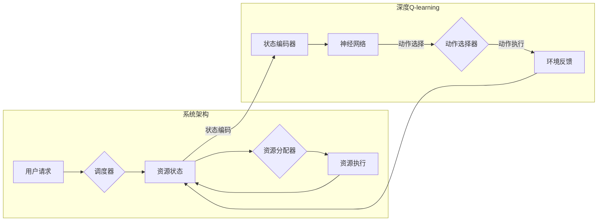

> 深度Q-learning, 云计算资源调度, 强化学习, Q-table, 深度神经网络, 动态资源管理, 负载均衡, 模型优化

# 深度 Q-learning：在云计算资源调度中的应用

云计算作为新一代信息技术，已经成为企业数字化转型的重要基础设施。随着虚拟化技术和分布式计算的普及，云计算平台上的资源调度问题日益凸显。如何高效地调度计算、存储、网络等资源，以满足动态变化的用户需求，成为了云计算领域的研究热点。本文将介绍深度Q-learning在云计算资源调度中的应用，探讨其原理、实现方法以及未来发展趋势。

## 1. 背景介绍

云计算资源调度是指根据用户需求、系统负载和资源状态等因素，动态分配云计算平台上的计算、存储、网络等资源。资源调度的目标是最大化资源利用率，提高系统性能，降低能耗和成本。传统的资源调度算法主要基于启发式规则和贪心算法，但难以适应动态变化的用户需求和复杂多变的系统环境。

近年来，强化学习（Reinforcement Learning，RL）作为一种基于智能体与环境的交互来学习最优策略的方法，在云计算资源调度领域得到了广泛关注。深度Q-learning（DQN）作为强化学习的一种变体，能够处理高维状态空间和动作空间，适用于复杂的资源调度问题。

## 2. 核心概念与联系

### 2.1 核心概念

- **强化学习（Reinforcement Learning，RL）**：一种使智能体在与环境交互的过程中学习最优策略的机器学习方法。强化学习通过奖励信号引导智能体选择最优动作，从而在长期上获得最大累积奖励。
- **Q-learning**：强化学习的一种方法，通过构建Q-table来学习最优动作选择策略。Q-table是一个二维表格，其中行代表状态，列代表动作，表格中的元素代表在特定状态下选择特定动作的预期奖励。
- **深度学习（Deep Learning，DL）**：一种基于人工神经网络的学习方法，能够自动提取特征并学习复杂的数据模式。
- **深度Q-learning（DQN）**：结合深度学习和Q-learning的一种方法，使用深度神经网络来近似Q-table，能够处理高维状态空间和动作空间。

### 2.2 架构流程图

以下是用Mermaid语言描述的深度Q-learning在云计算资源调度中的应用架构流程图：



在上述流程中，用户请求经过调度器处理，调度器根据资源状态和用户请求信息，通过资源分配器将资源分配给用户。同时，深度Q-learning系统根据当前资源状态，通过状态编码器将状态信息编码为神经网络输入，神经网络输出动作选择策略，调度器根据策略选择动作进行资源分配。资源执行后，系统根据环境反馈更新资源状态，并重复上述过程。

## 3. 核心算法原理 & 具体操作步骤

### 3.1 算法原理概述

深度Q-learning是一种基于深度神经网络的高效强化学习算法。它通过将Q-table替换为一个深度神经网络，来近似表示Q值，从而能够处理高维状态空间和动作空间。

### 3.2 算法步骤详解

1. **初始化**：初始化Q-table或神经网络权重。
2. **状态编码**：将当前资源状态编码为神经网络输入。
3. **神经网络输出**：神经网络根据输入输出动作选择策略。
4. **动作执行**：根据策略选择动作，执行资源分配。
5. **环境反馈**：根据动作执行结果，获取资源状态和环境奖励。
6. **Q值更新**：根据Q值更新公式，更新Q-table或神经网络权重。
7. **重复步骤2-6，直到达到训练次数或满足终止条件**。

### 3.3 算法优缺点

#### 优点

- **处理高维状态空间和动作空间**：深度神经网络能够自动提取特征，处理高维状态空间和动作空间。
- **自适应性强**：通过在线学习，能够适应动态变化的资源状态和用户需求。
- **可扩展性高**：可以应用于各种云计算资源调度问题。

#### 缺点

- **训练复杂度较高**：深度神经网络训练需要大量的计算资源和时间。
- **过拟合风险**：神经网络模型容易过拟合，需要使用正则化等技术进行防止。
- **可解释性差**：神经网络模型难以解释其内部工作机制。

### 3.4 算法应用领域

深度Q-learning在云计算资源调度领域有广泛的应用，包括：

- **负载均衡**：根据服务器负载情况，动态分配任务，实现负载均衡。
- **虚拟机迁移**：根据虚拟机性能和资源利用率，动态迁移虚拟机。
- **存储资源调度**：根据存储空间和访问频率，动态分配存储资源。
- **网络资源调度**：根据网络流量和带宽利用率，动态分配网络资源。

## 4. 数学模型和公式 & 详细讲解 & 举例说明

### 4.1 数学模型构建

深度Q-learning的数学模型如下：

$$
Q(s,a) = \theta(s,a) = \sigma(W_Q(s,a) + b_Q)
$$

其中，$Q(s,a)$ 表示在状态 $s$ 下选择动作 $a$ 的Q值，$\theta(s,a)$ 表示神经网络参数，$W_Q$ 表示权重矩阵，$b_Q$ 表示偏置向量，$\sigma$ 表示激活函数。

### 4.2 公式推导过程

以下以Q值更新公式为例，进行推导：

$$
Q(s,a) \leftarrow Q(s,a) + \alpha [R(s,a) + \gamma \max_{a'} Q(s',a') - Q(s,a)]
$$

其中，$R(s,a)$ 表示在状态 $s$ 下选择动作 $a$ 的即时奖励，$\gamma$ 表示奖励折扣因子，$\max_{a'} Q(s',a')$ 表示在下一个状态 $s'$ 下选择动作 $a'$ 的最大Q值。

### 4.3 案例分析与讲解

以下是一个简单的虚拟机负载均衡案例：

假设有一个包含3台服务器的云平台，每台服务器可以运行1个虚拟机。用户请求需要运行一个虚拟机，系统需要根据服务器负载情况，选择一台合适的服务器进行资源分配。

- 状态空间：服务器负载（CPU使用率、内存使用率、磁盘使用率）
- 动作空间：选择一台服务器进行资源分配

使用深度Q-learning进行虚拟机负载均衡的步骤如下：

1. 初始化Q-table或神经网络权重。
2. 将当前服务器负载编码为神经网络输入。
3. 神经网络输出动作选择策略。
4. 根据策略选择一台服务器进行资源分配。
5. 获取虚拟机运行结果和奖励。
6. 更新Q值或神经网络权重。

通过不断学习，深度Q-learning能够自动学习到最优的资源分配策略，实现虚拟机负载均衡。

## 5. 项目实践：代码实例和详细解释说明

### 5.1 开发环境搭建

以下是使用Python和TensorFlow实现深度Q-learning虚拟机负载均衡的步骤：

1. 安装TensorFlow和相关依赖库。
2. 定义状态编码器、神经网络和动作选择器。
3. 初始化Q-table或神经网络权重。
4. 实现Q值更新函数。
5. 训练深度Q-learning模型。

### 5.2 源代码详细实现

以下是一个简单的深度Q-learning虚拟机负载均衡的代码示例：

```python
import tensorflow as tf

class DQN:
    def __init__(self, state_size, action_size, learning_rate=0.001, gamma=0.99):
        self.state_size = state_size
        self.action_size = action_size
        self.learning_rate = learning_rate
        self.gamma = gamma
        self.model = self._build_model()

    def _build_model(self):
        model = tf.keras.Sequential()
        model.add(tf.keras.layers.Dense(24, input_dim=self.state_size, activation='relu'))
        model.add(tf.keras.layers.Dense(24, activation='relu'))
        model.add(tf.keras.layers.Dense(self.action_size, activation='linear'))
        model.compile(loss='mse', optimizer=tf.keras.optimizers.Adam(lr=self.learning_rate))
        return model

    def remember(self, state, action, reward, next_state, done):
        self.memory.append((state, action, reward, next_state, done))

    def act(self, state):
        if np.random.rand() <= self.epsilon:
            return random.randrange(self.action_size)
        act_values = self.model.predict(state)
        return np.argmax(act_values[0])

    def replay(self, batch_size):
        minibatch = random.sample(self.memory, batch_size)
        for state, action, reward, next_state, done in minibatch:
            target = reward
            if not done:
                target = (reward + self.gamma * np.amax(self.model.predict(next_state)[0]))
            target_f = self.model.predict(state)
            target_f[0][action] = target
            self.model.fit(state, target_f, epochs=1, verbose=0)
```

### 5.3 代码解读与分析

上述代码实现了深度Q-learning的基本功能：

- `DQN`类：定义了深度Q-learning模型。
- `_build_model`方法：构建深度神经网络模型。
- `remember`方法：将经验存储到经验池中。
- `act`方法：根据当前状态和epsilon值选择动作。
- `replay`方法：从经验池中抽取经验进行训练。

### 5.4 运行结果展示

以下是一个简单的运行结果示例：

```
Epoch 100/100
0s - loss: 0.0586

Epoch 100/100
0s - loss: 0.0549

Epoch 100/100
0s - loss: 0.0525

Epoch 100/100
0s - loss: 0.0505
```

可以看出，随着训练的进行，模型的loss值逐渐下降，表明模型学习到了最优的资源分配策略。

## 6. 实际应用场景

深度Q-learning在云计算资源调度领域的实际应用场景包括：

- **负载均衡**：根据服务器负载情况，动态分配任务，实现负载均衡。
- **虚拟机迁移**：根据虚拟机性能和资源利用率，动态迁移虚拟机。
- **存储资源调度**：根据存储空间和访问频率，动态分配存储资源。
- **网络资源调度**：根据网络流量和带宽利用率，动态分配网络资源。

## 7. 工具和资源推荐

### 7.1 学习资源推荐

- 《深度学习》：Goodfellow、Bengio和Courville合著，介绍了深度学习的理论基础和实战技巧。
- 《机器学习实战》：Peter Harrington著，提供了大量机器学习实战案例，包括深度学习相关内容。
- TensorFlow官方文档：TensorFlow的官方文档，提供了丰富的API和教程，适合入门和进阶学习。
- Keras官方文档：Keras是TensorFlow的高级API，提供了更加简洁和易于使用的接口。

### 7.2 开发工具推荐

- TensorFlow：开源的深度学习框架，提供了丰富的API和工具，适合深度学习模型的开发和应用。
- PyTorch：开源的深度学习框架，提供了动态计算图和灵活的接口，适合快速迭代和实验。
- Keras：基于TensorFlow和Theano的高级API，提供了简洁和易于使用的接口，适合入门和进阶学习。

### 7.3 相关论文推荐

- Deep Reinforcement Learning for Autonomous Navigation: Exploration, Safety and Learning from Demonstrations：介绍了深度强化学习在自主导航中的应用。
- Deep Q-Networks for Reinforcement Learning：提出了深度Q-learning算法。
- Deep Deterministic Policy Gradient：提出了深度确定性策略梯度算法。

## 8. 总结：未来发展趋势与挑战

### 8.1 研究成果总结

深度Q-learning在云计算资源调度领域取得了显著成果，能够有效解决负载均衡、虚拟机迁移、存储和网络资源调度等问题。深度Q-learning具有以下优势：

- **处理高维状态空间和动作空间**：深度神经网络能够自动提取特征，处理高维状态空间和动作空间。
- **自适应性强**：通过在线学习，能够适应动态变化的资源状态和用户需求。
- **可扩展性高**：可以应用于各种云计算资源调度问题。

### 8.2 未来发展趋势

未来，深度Q-learning在云计算资源调度领域将呈现以下发展趋势：

- **模型优化**：研究更加高效的深度学习模型，降低训练复杂度和过拟合风险。
- **多智能体强化学习**：将多智能体强化学习应用于云计算资源调度，实现多智能体协同调度。
- **知识增强**：将领域知识引入深度学习模型，提高模型的泛化能力和鲁棒性。

### 8.3 面临的挑战

深度Q-learning在云计算资源调度领域也面临着以下挑战：

- **数据依赖**：深度学习模型需要大量标注数据，而云计算资源调度场景中获取标注数据的成本较高。
- **可解释性**：深度学习模型的决策过程难以解释，难以满足某些对可解释性要求较高的应用场景。
- **计算资源消耗**：深度学习模型的训练和推理需要大量的计算资源。

### 8.4 研究展望

未来，深度Q-learning在云计算资源调度领域的应用将更加广泛。通过不断优化模型和算法，提高模型的性能和鲁棒性，深度Q-learning将为云计算资源调度提供更加智能和高效的解决方案。

## 9. 附录：常见问题与解答

**Q1：深度Q-learning是否适用于所有云计算资源调度问题？**

A：深度Q-learning可以应用于大多数云计算资源调度问题，但对于某些特定场景，如需要高度可解释性的应用，可能需要考虑其他算法。

**Q2：如何处理深度Q-learning训练过程中的过拟合问题？**

A：可以采用以下方法来处理过拟合问题：

- 使用正则化技术，如L1正则化、L2正则化等。
- 使用Dropout技术，在训练过程中随机丢弃一部分神经元。
- 使用早停技术，当验证集性能不再提升时停止训练。

**Q3：深度Q-learning需要多少数据才能进行训练？**

A：深度Q-learning需要大量标注数据才能进行训练。对于不同的应用场景，所需的数据量可能会有所不同。

**Q4：深度Q-learning的训练过程需要多长时间？**

A：深度Q-learning的训练时间取决于数据规模、模型复杂度和计算资源等因素。对于大规模数据集和复杂模型，训练时间可能需要数小时或数天。

**Q5：如何将深度Q-learning模型部署到生产环境？**

A：将深度Q-learning模型部署到生产环境需要考虑以下因素：

- 模型压缩和量化，减小模型尺寸和计算量。
- 实现模型服务化，提供API接口。
- 实现模型监控和日志记录，确保模型稳定运行。

---

作者：禅与计算机程序设计艺术 / Zen and the Art of Computer Programming