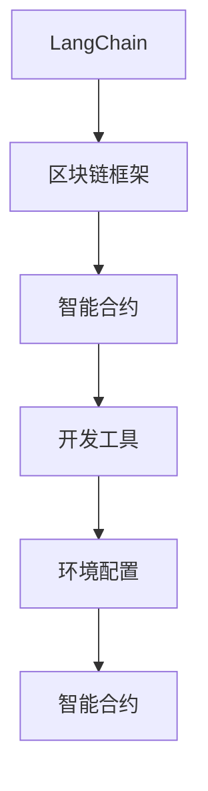
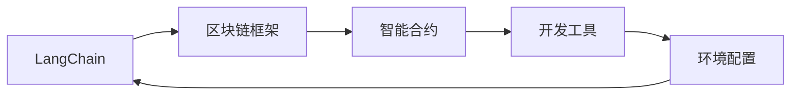
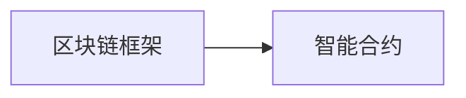
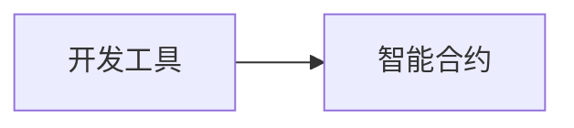
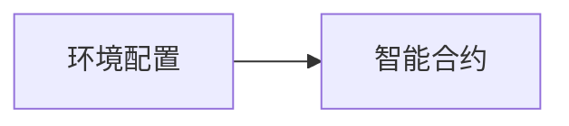

                 

# 【LangChain编程：从入门到实践】管理工具安装

> 关键词：LangChain, 管理工具, 安装, 环境配置, 开发平台, 资源推荐

## 1. 背景介绍

在智能合约编程领域，LangChain 是一个开源且高度可定制的智能合约开发平台，它集成了多种区块链框架和技术栈，提供了一系列工具和资源，帮助开发者高效地构建、测试和部署智能合约。然而，对于刚接触智能合约编程的开发者来说，如何高效地使用这些工具和资源，快速上手LangChain平台，是他们需要解决的首要问题。

本博文旨在为LangChain新手提供一个全面的管理工具安装指南，详细介绍LangChain平台中常用的开发工具和环境配置，帮助开发者从零开始，快速进入智能合约编程的实践阶段。本文将从基础知识、安装配置、项目实践和未来展望等多个方面，对LangChain平台进行深入探讨，旨在为智能合约开发者的成长提供有力支持。

## 2. 核心概念与联系

### 2.1 核心概念概述

为了更好地理解LangChain平台的工具管理和安装过程，本节将介绍几个核心概念：

- **LangChain**：一种开源的智能合约开发平台，提供了多种区块链框架和开发工具，如Solidity、Rust等，支持智能合约的构建、测试和部署。
- **智能合约**：一种基于区块链技术的自动化合约，其代码经过验证后，可以在区块链网络上自动执行，无需中介介入。
- **区块链框架**：用于开发和部署智能合约的软件框架，支持多种编程语言和开发环境。
- **开发工具**：如IDE、编译器、测试框架等，辅助开发者进行代码编写、测试和调试。
- **环境配置**：智能合约开发过程中所需的软件和硬件环境的准备和调试。

这些概念之间的关系可以通过以下Mermaid流程图来展示：



该图展示了LangChain平台的核心概念及其相互关系。LangChain作为一个平台，支持智能合约的开发，提供了多种区块链框架，同时集成了各种开发工具，并通过环境配置支持智能合约的部署。

### 2.2 概念间的关系

这些核心概念之间存在着紧密的联系，形成了LangChain平台的核心生态系统。下面我们通过几个Mermaid流程图来展示这些概念之间的关系。

#### 2.2.1 LangChain平台的核心架构



这个图展示了LangChain平台的总体架构。从智能合约到区块链框架，再到开发工具和环境配置，最终支持智能合约的构建和部署。

#### 2.2.2 区块链框架与智能合约的关系



这个图展示了区块链框架与智能合约的关系。智能合约是基于区块链框架开发的，区块链框架提供了编程接口和开发环境，支持智能合约的编写和执行。

#### 2.2.3 开发工具与智能合约的关系



这个图展示了开发工具与智能合约的关系。开发工具如IDE、编译器、测试框架等，辅助开发者编写、测试和调试智能合约代码。

#### 2.2.4 环境配置与智能合约的关系



这个图展示了环境配置与智能合约的关系。环境配置包括硬件设备和软件环境的设置，如计算机硬件配置、操作系统安装、依赖库安装等，是智能合约开发和部署的基础。

## 3. 核心算法原理 & 具体操作步骤
### 3.1 算法原理概述

LangChain平台的智能合约开发过程中，涉及到了多种算法原理和技术方法。为了更好地理解这些原理，本节将进行简要介绍。

- **代码编译与验证**：智能合约代码需要经过编译和验证才能在区块链网络上部署和执行。编译器将智能合约代码转化为字节码，验证器则确保代码符合区块链网络的安全规范。
- **合约测试与部署**：智能合约在正式部署之前，需要通过测试框架进行全面的测试，确保合约的正确性和鲁棒性。测试通过后，合约代码可以被部署到区块链网络。
- **交易模拟与交互**：通过交易模拟器，开发者可以模拟智能合约的交易操作，测试合约在实际交易场景中的表现。

### 3.2 算法步骤详解

LangChain平台的智能合约开发步骤如下：

**Step 1: 选择区块链框架和编程语言**

在开始开发之前，首先需要选择适合自己的区块链框架和编程语言。常见的区块链框架包括Solidity、Rust、C++等，每个框架都有其优缺点和适用场景。例如，Solidity是Ethereum生态系统的主流编程语言，拥有丰富的社区资源和生态系统；Rust则以其安全性和性能著称，适合高并发和资源密集型应用。

**Step 2: 安装开发工具和依赖库**

根据选择的区块链框架和编程语言，安装相应的开发工具和依赖库。例如，使用Solidity开发Ethereum合约时，需要安装Truffle框架、Solidity编译器、Remix IDE等工具。使用Rust开发WebAssembly合约时，则需要安装rustc编译器、Wasm-pack工具链、Rust IDE等。

**Step 3: 配置开发环境**

在安装完开发工具和依赖库后，需要配置开发环境。配置环境通常包括安装Python解释器、配置Node.js版本、设置虚拟环境等。例如，使用Truffle框架时，需要安装Node.js、npm包管理器，并配置truffle-config.js文件，指定项目路径、合约文件路径等。

**Step 4: 编写和测试智能合约**

在配置好开发环境后，开始编写智能合约代码。智能合约代码通常包括部署合约的代码和交互合约的函数。编写完成后，使用测试框架进行全面的测试，确保合约的正确性和鲁棒性。

**Step 5: 部署智能合约**

测试通过后，使用部署工具将智能合约部署到区块链网络。部署过程通常需要调用区块链网络的API接口，执行智能合约的部署函数。部署完成后，智能合约代码将在区块链网络上公开可见。

**Step 6: 交互和测试智能合约**

智能合约部署完成后，通过交易模拟器进行交互和测试。测试过程中，可以模拟交易操作，检查智能合约的执行结果和性能表现。

### 3.3 算法优缺点

LangChain平台在智能合约开发中提供了丰富的工具和资源，但也存在一些缺点：

- **学习曲线较陡**：LangChain平台涉及多种区块链框架和编程语言，对于初学者来说，学习曲线较陡，需要花费一定时间熟悉各种工具和概念。
- **资源需求较高**：开发智能合约需要高性能计算机和稳定的网络连接，对硬件和网络环境要求较高。
- **更新迭代较快**：智能合约技术发展迅速，需要开发者不断学习新技术、更新工具和库。
- **社区资源丰富**：LangChain平台拥有庞大的开发者社区，提供了大量的文档、教程和示例代码，便于开发者学习和交流。

### 3.4 算法应用领域

LangChain平台的智能合约开发技术，在多个领域得到了广泛应用，例如：

- **金融合约**：如智能投顾、保险理赔、资产管理等，通过智能合约实现自动化和透明化的金融操作。
- **供应链管理**：通过智能合约管理供应链各个环节，实现自动化支付和数据跟踪。
- **版权保护**：利用智能合约保护数字版权，防止非法复制和分发。
- **投票系统**：通过智能合约实现电子投票和投票结果的自动化验证。
- **去中心化自治组织(DAO)**：利用智能合约构建去中心化的自治组织，实现社区成员的自主管理。

## 4. 数学模型和公式 & 详细讲解 & 举例说明
### 4.1 数学模型构建

本节将使用数学语言对LangChain平台的智能合约开发过程进行更加严格的刻画。

记智能合约为 $M$，其代码由可执行的函数 $f_1, f_2, \ldots, f_n$ 组成，每个函数 $f_i$ 定义了合约中的一个操作。假设智能合约的目标是 $T$，即合约的功能要求。则智能合约的数学模型为：

$$
M = \{f_1, f_2, \ldots, f_n\}
$$

智能合约的测试过程可以通过测试用例 $U$ 来实现。每个测试用例 $u_j$ 包含输入 $x_j$ 和预期输出 $y_j$。则智能合约的测试过程可以表示为：

$$
U = \{u_1, u_2, \ldots, u_m\}
$$

测试过程的目标是确保智能合约在各种输入下都能正确执行，即对于每个测试用例 $u_j$，有：

$$
M(x_j) = y_j
$$

### 4.2 公式推导过程

假设智能合约 $M$ 包含两个函数 $f_1$ 和 $f_2$，其中 $f_1$ 用于读取存储的数据，$f_2$ 用于更新存储的数据。其数学模型和测试过程可以表示为：

$$
M = \{f_1, f_2\}
$$

$$
U = \{u_1, u_2\}
$$

其中 $u_1 = (x_1, y_1)$，表示读取操作，$x_1$ 是读取数据的键，$y_1$ 是预期的值；$u_2 = (x_2, y_2)$，表示更新操作，$x_2$ 是更新的键，$y_2$ 是更新的值。则测试过程的目标是确保 $f_1(x_1) = y_1$ 和 $f_2(x_2) = y_2$。

### 4.3 案例分析与讲解

假设我们编写了一个简单的智能合约，用于管理数字资产的借贷。合约代码如下：

```rust
struct Investment {
    owner: Address,
    amount: U256,
    rate: U256,
    active: bool,
}

pub function borrow(amount: U256, rate: U256) external onlyOwner {
    require(0 < amount, "Invalid amount");
    require(!investment.active, "Investment already active");

    investment.amount += amount;
    investment.rate = rate;
    investment.active = true;
}

pub function repay(amount: U256) external onlyOwner {
    require(amount > 0, "Invalid amount");
    require(investment.active, "Investment not active");

    investment.amount -= amount;
    investment.active = false;
}
```

我们使用Remix IDE进行测试。在测试界面中，我们定义了一个测试用例：

```json
{
  "deployment": "0x1234567890",
  "reads": [
    {
      "addr": "0x1234567890",
      "path": "0x0000000000000000000000000000000000000000000000000000000000000000000000000000000000000000000000000000000000000000000000000000000000000000000000000000000000000000000000000000000000000000000000000000000000000000000000000000000000000000000000000000000000000000000000000000000000000000000000000000000000000000000000000000000000000000000000000000000000000000000000000000000000000000000000000000000000000000000000000000000000000000000000000000000000000000000000000000000000000000000000000000000000000000000000000000000000000000000000000000000000000000000000000000000000000000000000000000000000000000000000000000000000000000000000000000000000000000000000000000000000000000000000000000000000000000000000000000000000000000000000000000000000000000000000000000000000000000000000000000000000000000000000000000000000000000000000000000000000000000000000000000000000000000000000000000000000000000000000000000000000000000000000000000000000000000000000000000000000000000000000000000000000000000000000000000000000000000000000000000000000000000000000000000000000000000000000000000000000000000000000000000000000000000000000000000000000000000000000000000000000000000000000000000000000000000000000000000000000000000000000000000000000000000000000000000000000000000000000000000000000000000000000000000000000000000000000000000000000000000000000000000000000000000000000000000000000000000000000000000000000000000000000000000000000000000000000000000000000000000000000000000000000000000000000000000000000000000000000000000000000000000000000000000000000000000000000000000000000000000000000000000000000000000000000000000000000000000000000000000000000000000000000000000000000000000000000000000000000000000000000000000000000000000000000000000000000000000000000000000000000000000000000000000000000000000000000000000000000000000000000000000000000000000000000000000000000000000000000000000000000000000000000000000000000000000000000000000000000000000000000000000000000000000000000000000000000000000000000000000000000000000000000000000000000000000000000000000000000000000000000000000000000000000000000000000000000000000000000000000000000000000000000000000000000000000000000000000000000000000000000000000000000000000000000000000000000000000000000000000000000000000000000000000000000000000000000000000000000000000000000000000000000000000000000000000000000000000000000000000000000000000000000000000000000000000000000000000000000000000000000000000000000000000000000000000000000000000000000000000000000000000000000000000000000000000000000000000000000000000000000000000000000000000000000000000000000000000000000000000000000000000000000000000000000000000000000000000000000000000000000000000000000000000000000000000000000000000000000000000000000000000000000000000000000000000000000000000000000000000000000000000000000000000000000000000000000000000000000000000000000000000000000000000000000000000000000000000000000000000000000000000000000000000000000000000000000000000000000000000000000000000000000000000000000000000000000000000000000000000000000000000000000000000000000000000000000000000000000000000000000000000000000000000000000000000000000000000000000000000000000000000000000000000000000000000000000000000000000000000000000000000000000000000000000000000000000000000000000000000000000000000000000000000000000000000000000000000000000000000000000000000000000000000000000000000000000000000000000000000000000000000000000000000000000000000000000000000000000000000000000000000000000000000000000000000000000000000000000000000000000000000000000000000000000000000000000000000000000000000000000000000000000000000000000000000000000000000000000000000000000000000000000000000000000000000000000000000000000000000000000000000000000000000000000000000000000000000000000000000000000000000000000000000000000000000000000000000000000000000000000000000000000000000000000000000000000000000000000000000000000000000000000000000000000000000000000000000000000000000000000000000000000000000000000000000000000000000000000000000000000000000000000000000000000000000000000000000000000000000000000000000000000000000000000000000000000000000000000000000000000000000000000000000000000000000000000000000000000000000000000000000000000000000000000000000000000000000000000000000000000000000000000000000000000000000000000000000000000000000000000000000000000000000000000000000000000000000000000000000000000000000000000000000000000000000000000000000000000000000000000000000000000000000000000000000000000000000000000000000000000000000000000000000000000000000000000000000000000000000000000000000000000000000000000000000000000000000000000000000000000000000000000000000000000000000000000000000000000000000000000000000000000000000000000000000000000000000000000000000000000000000000000000000000000000000000000000000000000000000000000000000000000000000000000000000000000000000000000000000000000000000000000000000000000000000000000000000000000000000000000000000000000000000000000000000000000000000000000000000000000000000000000000000000000000000000000000000000000000000000000000000000000000000000000000000000000000000000000000000000000000000000000000000000000000000000000000000000000000000000000000000000000000000000000000000000000000000000000000000000000000000000000000000000000000000000000000000000000000000000000000000000000000000000000000000000000000000000000000000000000000000000000000000000000000000000000000000000000000000000000000000000000000000000000000000000000000000000000000000000000000000000000000000000000000000000000000000000000000000000000000000000000000000000000000000000000000000000000000000000000000000000000000000000000000000000000000000000000000000000000000000000000000000000000000000000000000000000000000000000000000000000000000000000000000000000000000000000000000000000000000000000000000000000000000000000000000000000000000000000000000000000000000000000000000000000000000000000000000000000000000000000000000000000000000000000000000000000000000000000000000000000000000000000000000000000000000000000000000000000000000000000000000000000000000000000000000000000000000000000000000000000000000000000000000000000000000000000000000000000000000000000000000000000000000000000000000000000000000000000000000000000000000000000000000000000000000000000000000000000000000000000000000000000000000000000000000000000000000000000000000000000000000000000000000000000000000000000000000000000000000000000000000000000000000000000000000000000000000000000000000000000000000000000000000000000000000000000000000000000000000000000000000000000000000000000000000000000000000000000000000000000000000000000000000000000000000000000000000000000000000000000000000000000000000000000000000000000000000000000000000000000000000000000000000000000000000000000000000000000000000000000000000000000000000000000000000000000000000000000000

