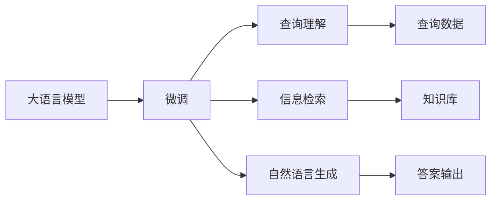
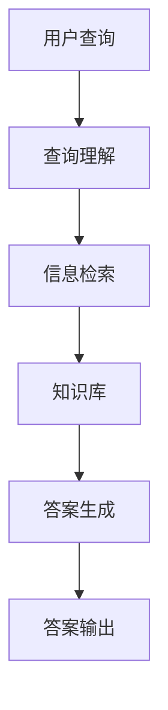
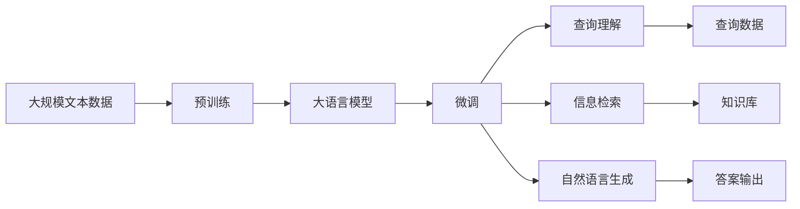

                 

# 【大模型应用开发 动手做AI Agent】构建查询引擎和工具

> 关键词：人工智能, AI Agent, 自然语言处理, NLP, 查询引擎, 自然语言理解, 信息检索

## 1. 背景介绍

### 1.1 问题由来
在人工智能领域，智能问答系统（Intelligent Question Answering System, IQAS）一直是一个重要的研究方向。随着大语言模型（Large Language Models, LLMs）的不断发展，IQAS也逐步从基于规则的简单问答系统，演化为可以理解和生成自然语言文本的复杂系统。查询引擎作为IQAS的核心组件，其构建难度和复杂度也随之增加。传统查询引擎往往依赖于专家手动编写知识库和规则库，难以适应快速变化的知识需求。

近年来，利用大模型微调技术构建查询引擎的方法日益受到关注。具体做法是，通过微调大模型使其具备查询理解、信息检索和自然语言生成能力，从而实现高质量的智能问答。大模型通过在大规模无标签文本数据上预训练，学习到了丰富的语言知识和常识，通过微调可以针对特定任务（如问答、匹配、生成等）进行优化，进而构建高质量的查询引擎。

### 1.2 问题核心关键点
大模型微调构建查询引擎的核心关键点如下：

1. **数据准备**：准备查询理解相关的标注数据集，包含查询文本和对应的答案或答案解释。
2. **模型选择**：选择合适的预训练模型，如BERT、GPT等。
3. **微调策略**：设计微调任务，选择合适的损失函数和优化器，并确定微调过程中的超参数。
4. **模型部署**：将微调后的模型封装成API接口，供应用程序调用。
5. **持续优化**：收集新的查询数据，定期对模型进行微调，以保持其时效性和适应性。

### 1.3 问题研究意义
利用大模型微调技术构建的查询引擎，具有以下重要意义：

1. **高效构建**：基于大模型的微调技术，可以迅速构建高质量的查询引擎，减少了手动编写知识库和规则库的时间和成本。
2. **灵活应用**：大模型具有较强的迁移学习能力，可以应用于多种领域和任务，适应性强。
3. **智能问答**：微调后的模型可以理解和生成自然语言文本，提供高质量的智能问答服务。
4. **提升用户体验**：智能问答系统可以与用户进行自然的语言交流，提升用户体验和满意度。
5. **促进应用场景落地**：智能问答系统可以应用于客服、教育、医疗等多个领域，推动AI技术的产业化进程。

## 2. 核心概念与联系

### 2.1 核心概念概述

为更好地理解大模型微调构建查询引擎的原理和方法，本节将介绍几个密切相关的核心概念：

- **大语言模型(Large Language Models, LLMs)**：通过在大规模无标签文本数据上预训练，学习到了丰富的语言知识和常识，具有强大的语言理解和生成能力。
- **微调(Fine-tuning)**：将预训练模型当作初始化参数，通过有监督的微调优化模型在特定任务上的性能。
- **查询理解(Question Understanding, QUD)**：理解用户查询的意图和所需信息，将自然语言文本转换为可检索的数据格式。
- **信息检索(Information Retrieval, IR)**：根据用户查询，从知识库中检索出最相关的信息。
- **自然语言生成(Natural Language Generation, NLG)**：根据检索结果，生成自然语言文本作为最终答案。

这些核心概念之间的逻辑关系可以通过以下Mermaid流程图来展示：



这个流程图展示了大模型微调构建查询引擎的核心逻辑：大模型通过微调获得查询理解、信息检索和自然语言生成能力，与知识库配合，实现高质量的智能问答。

### 2.2 概念间的关系

这些核心概念之间存在着紧密的联系，形成了查询引擎构建的完整生态系统。下面通过几个Mermaid流程图来展示这些概念之间的关系。

#### 2.2.1 查询引擎的整体架构



这个流程图展示了查询引擎的基本架构，包括用户查询、查询理解、信息检索、答案生成和答案输出等关键环节。

#### 2.2.2 微调与查询理解


这个流程图展示了查询理解与微调的关系。微调后的模型具备查询理解能力，能够理解用户查询的意图和所需信息。

#### 2.2.3 微调与信息检索


这个流程图展示了信息检索与微调的关系。微调后的模型具备信息检索能力，能够从知识库中检索出最相关的信息。

#### 2.2.4 微调与自然语言生成


这个流程图展示了自然语言生成与微调的关系。微调后的模型具备自然语言生成能力，能够根据检索结果生成自然语言文本作为最终答案。

### 2.3 核心概念的整体架构

最后，我们用一个综合的流程图来展示这些核心概念在大模型微调构建查询引擎中的整体架构：



这个综合流程图展示了从预训练到微调，再到查询理解、信息检索、自然语言生成和最终答案输出的完整过程。大语言模型通过预训练获得基础能力，然后通过微调获得特定的查询理解、信息检索和自然语言生成能力，最后与知识库配合，实现高质量的智能问答。

## 3. 核心算法原理 & 具体操作步骤

### 3.1 算法原理概述

大模型微调构建查询引擎的基本原理是：将大模型视作一个强大的特征提取器，通过在有标注的查询理解数据集上进行微调，使得模型学习到如何理解和生成查询文本，并从知识库中检索出最相关的信息，生成最终答案。

形式化地，假设预训练模型为 $M_{\theta}$，其中 $\theta$ 为预训练得到的模型参数。给定查询理解任务 $T$ 的标注数据集 $D=\{(x_i, y_i)\}_{i=1}^N$，其中 $x_i$ 为查询文本，$y_i$ 为对应的答案或答案解释。微调的目标是找到新的模型参数 $\hat{\theta}$，使得：

$$
\hat{\theta}=\mathop{\arg\min}_{\theta} \mathcal{L}(M_{\theta},D)
$$

其中 $\mathcal{L}$ 为针对任务 $T$ 设计的损失函数，用于衡量模型预测输出与真实标签之间的差异。常见的损失函数包括交叉熵损失、均方误差损失等。

通过梯度下降等优化算法，微调过程不断更新模型参数 $\theta$，最小化损失函数 $\mathcal{L}$，使得模型输出逼近真实标签。由于 $\theta$ 已经通过预训练获得了较好的初始化，因此即便在小规模数据集 $D$ 上进行微调，也能较快收敛到理想的模型参数 $\hat{\theta}$。

### 3.2 算法步骤详解

基于大模型微调构建查询引擎的一般步骤如下：

**Step 1: 准备预训练模型和数据集**
- 选择合适的预训练语言模型 $M_{\theta}$ 作为初始化参数，如 BERT、GPT等。
- 准备查询理解相关的标注数据集 $D$，划分为训练集、验证集和测试集。一般要求标注数据与预训练数据的分布不要差异过大。

**Step 2: 添加任务适配层**
- 根据查询理解任务类型，在预训练模型顶层设计合适的输出层和损失函数。
- 对于分类任务，通常在顶层添加线性分类器和交叉熵损失函数。
- 对于生成任务，通常使用语言模型的解码器输出概率分布，并以负对数似然为损失函数。

**Step 3: 设置微调超参数**
- 选择合适的优化算法及其参数，如 AdamW、SGD 等，设置学习率、批大小、迭代轮数等。
- 设置正则化技术及强度，包括权重衰减、Dropout、Early Stopping等。
- 确定冻结预训练参数的策略，如仅微调顶层，或全部参数都参与微调。

**Step 4: 执行梯度训练**
- 将训练集数据分批次输入模型，前向传播计算损失函数。
- 反向传播计算参数梯度，根据设定的优化算法和学习率更新模型参数。
- 周期性在验证集上评估模型性能，根据性能指标决定是否触发 Early Stopping。
- 重复上述步骤直到满足预设的迭代轮数或 Early Stopping 条件。

**Step 5: 测试和部署**
- 在测试集上评估微调后模型 $M_{\hat{\theta}}$ 的性能，对比微调前后的精度提升。
- 使用微调后的模型对新样本进行推理预测，集成到实际的应用系统中。
- 持续收集新的查询数据，定期重新微调模型，以保持其时效性和适应性。

以上是基于大模型微调构建查询引擎的一般流程。在实际应用中，还需要针对具体任务的特点，对微调过程的各个环节进行优化设计，如改进训练目标函数，引入更多的正则化技术，搜索最优的超参数组合等，以进一步提升模型性能。

### 3.3 算法优缺点

基于大模型微调构建查询引擎具有以下优点：

1. 简单高效。只需准备少量标注数据，即可对预训练模型进行快速适配，获得较大的性能提升。
2. 通用适用。适用于各种查询理解任务，包括问答、匹配、生成等，设计简单的任务适配层即可实现微调。
3. 参数高效。利用参数高效微调技术，在固定大部分预训练参数的情况下，仍可取得不错的提升。
4. 效果显著。在学术界和工业界的诸多任务上，基于微调的方法已经刷新了最先进的性能指标。

同时，该方法也存在一定的局限性：

1. 依赖标注数据。微调的效果很大程度上取决于标注数据的质量和数量，获取高质量标注数据的成本较高。
2. 迁移能力有限。当目标任务与预训练数据的分布差异较大时，微调的性能提升有限。
3. 负面效果传递。预训练模型的固有偏见、有害信息等，可能通过微调传递到下游任务，造成负面影响。
4. 可解释性不足。微调模型的决策过程通常缺乏可解释性，难以对其推理逻辑进行分析和调试。

尽管存在这些局限性，但就目前而言，基于监督学习的微调方法仍是大模型应用的最主流范式。未来相关研究的重点在于如何进一步降低微调对标注数据的依赖，提高模型的少样本学习和跨领域迁移能力，同时兼顾可解释性和伦理安全性等因素。

### 3.4 算法应用领域

基于大模型微调构建的查询引擎，已经在多个领域得到了广泛的应用，包括：

- **智能客服系统**：利用微调后的模型，自动理解用户查询，匹配最合适的答案模板进行回复。
- **金融舆情监测**：收集金融领域相关的新闻、报道、评论等文本数据，微调模型以判断文本属于何种主题，情感倾向是正面、中性还是负面。
- **个性化推荐系统**：收集用户浏览、点击、评论、分享等行为数据，微调模型以理解用户兴趣，生成个性化的推荐内容。
- **医疗问答系统**：通过微调模型，自动理解医学领域的问答，辅助医生诊断和治疗。

除了上述这些经典任务外，基于大模型微调构建的查询引擎还可以应用于更多场景中，如可控文本生成、常识推理、代码生成、数据增强等，为NLP技术带来了全新的突破。随着预训练模型和微调方法的不断进步，相信NLP技术将在更广阔的应用领域大放异彩。

## 4. 数学模型和公式 & 详细讲解 & 举例说明

### 4.1 数学模型构建

本节将使用数学语言对基于大模型微调构建查询引擎的过程进行更加严格的刻画。

记预训练语言模型为 $M_{\theta}$，其中 $\theta$ 为预训练得到的模型参数。假设微调任务的训练集为 $D=\{(x_i,y_i)\}_{i=1}^N$，其中 $x_i$ 为查询文本，$y_i$ 为对应的答案或答案解释。

定义模型 $M_{\theta}$ 在查询文本 $x$ 上的损失函数为 $\ell(M_{\theta}(x),y)$，则在数据集 $D$ 上的经验风险为：

$$
\mathcal{L}(\theta) = \frac{1}{N} \sum_{i=1}^N \ell(M_{\theta}(x_i),y_i)
$$

微调的优化目标是最小化经验风险，即找到最优参数：

$$
\theta^* = \mathop{\arg\min}_{\theta} \mathcal{L}(\theta)
$$

在实践中，我们通常使用基于梯度的优化算法（如SGD、Adam等）来近似求解上述最优化问题。设 $\eta$ 为学习率，$\lambda$ 为正则化系数，则参数的更新公式为：

$$
\theta \leftarrow \theta - \eta \nabla_{\theta}\mathcal{L}(\theta) - \eta\lambda\theta
$$

其中 $\nabla_{\theta}\mathcal{L}(\theta)$ 为损失函数对参数 $\theta$ 的梯度，可通过反向传播算法高效计算。

### 4.2 公式推导过程

以下我们以二分类任务为例，推导交叉熵损失函数及其梯度的计算公式。

假设模型 $M_{\theta}$ 在查询文本 $x$ 上的输出为 $\hat{y}=M_{\theta}(x) \in [0,1]$，表示查询文本属于正类的概率。真实标签 $y \in \{0,1\}$。则二分类交叉熵损失函数定义为：

$$
\ell(M_{\theta}(x),y) = -[y\log \hat{y} + (1-y)\log (1-\hat{y})]
$$

将其代入经验风险公式，得：

$$
\mathcal{L}(\theta) = -\frac{1}{N}\sum_{i=1}^N [y_i\log M_{\theta}(x_i)+(1-y_i)\log(1-M_{\theta}(x_i))]
$$

根据链式法则，损失函数对参数 $\theta_k$ 的梯度为：

$$
\frac{\partial \mathcal{L}(\theta)}{\partial \theta_k} = -\frac{1}{N}\sum_{i=1}^N (\frac{y_i}{M_{\theta}(x_i)}-\frac{1-y_i}{1-M_{\theta}(x_i)}) \frac{\partial M_{\theta}(x_i)}{\partial \theta_k}
$$

其中 $\frac{\partial M_{\theta}(x_i)}{\partial \theta_k}$ 可进一步递归展开，利用自动微分技术完成计算。

在得到损失函数的梯度后，即可带入参数更新公式，完成模型的迭代优化。重复上述过程直至收敛，最终得到适应查询理解任务的最优模型参数 $\theta^*$。

## 5. 项目实践：代码实例和详细解释说明

### 5.1 开发环境搭建

在进行微调实践前，我们需要准备好开发环境。以下是使用Python进行PyTorch开发的环境配置流程：

1. 安装Anaconda：从官网下载并安装Anaconda，用于创建独立的Python环境。

2. 创建并激活虚拟环境：
```bash
conda create -n pytorch-env python=3.8 
conda activate pytorch-env
```

3. 安装PyTorch：根据CUDA版本，从官网获取对应的安装命令。例如：
```bash
conda install pytorch torchvision torchaudio cudatoolkit=11.1 -c pytorch -c conda-forge
```

4. 安装Transformers库：
```bash
pip install transformers
```

5. 安装各类工具包：
```bash
pip install numpy pandas scikit-learn matplotlib tqdm jupyter notebook ipython
```

完成上述步骤后，即可在`pytorch-env`环境中开始微调实践。

### 5.2 源代码详细实现

这里我们以问答系统为例，给出使用Transformers库对BERT模型进行微调的PyTorch代码实现。

首先，定义问答系统数据处理函数：

```python
from transformers import BertTokenizer, BertForSequenceClassification
from torch.utils.data import Dataset
import torch

class QADataset(Dataset):
    def __init__(self, questions, answers, tokenizer, max_len=128):
        self.questions = questions
        self.answers = answers
        self.tokenizer = tokenizer
        self.max_len = max_len
        
    def __len__(self):
        return len(self.questions)
    
    def __getitem__(self, item):
        question = self.questions[item]
        answer = self.answers[item]
        
        encoding = self.tokenizer(question, return_tensors='pt', max_length=self.max_len, padding='max_length', truncation=True)
        input_ids = encoding['input_ids'][0]
        attention_mask = encoding['attention_mask'][0]
        
        # 对答案进行编码
        answer_tokenizer = BertTokenizer.from_pretrained('bert-base-cased')
        answer_encoding = answer_tokenizer(answer, return_tensors='pt', max_length=self.max_len, padding='max_length', truncation=True)
        answer_ids = answer_encoding['input_ids'][0]
        answer_mask = answer_encoding['attention_mask'][0]
        
        return {'input_ids': input_ids, 
                'attention_mask': attention_mask,
                'answer_ids': answer_ids,
                'answer_mask': answer_mask}

# 创建dataset
tokenizer = BertTokenizer.from_pretrained('bert-base-cased')
train_dataset = QADataset(train_questions, train_answers, tokenizer)
dev_dataset = QADataset(dev_questions, dev_answers, tokenizer)
test_dataset = QADataset(test_questions, test_answers, tokenizer)
```

然后，定义模型和优化器：

```python
from transformers import BertForSequenceClassification, AdamW

model = BertForSequenceClassification.from_pretrained('bert-base-cased', num_labels=2)

optimizer = AdamW(model.parameters(), lr=2e-5)
```

接着，定义训练和评估函数：

```python
from torch.utils.data import DataLoader
from tqdm import tqdm
from sklearn.metrics import accuracy_score

device = torch.device('cuda') if torch.cuda.is_available() else torch.device('cpu')
model.to(device)

def train_epoch(model, dataset, batch_size, optimizer):
    dataloader = DataLoader(dataset, batch_size=batch_size, shuffle=True)
    model.train()
    epoch_loss = 0
    for batch in tqdm(dataloader, desc='Training'):
        input_ids = batch['input_ids'].to(device)
        attention_mask = batch['attention_mask'].to(device)
        answer_ids = batch['answer_ids'].to(device)
        answer_mask = batch['answer_mask'].to(device)
        model.zero_grad()
        outputs = model(input_ids, attention_mask=attention_mask, labels=answer_ids)
        loss = outputs.loss
        epoch_loss += loss.item()
        loss.backward()
        optimizer.step()
    return epoch_loss / len(dataloader)

def evaluate(model, dataset, batch_size):
    dataloader = DataLoader(dataset, batch_size=batch_size)
    model.eval()
    preds, labels = [], []
    with torch.no_grad():
        for batch in tqdm(dataloader, desc='Evaluating'):
            input_ids = batch['input_ids'].to(device)
            attention_mask = batch['attention_mask'].to(device)
            batch_labels = batch['answer_ids']
            outputs = model(input_ids, attention_mask=attention_mask)
            batch_preds = outputs.logits.argmax(dim=2).to('cpu').tolist()
            batch_labels = batch_labels.to('cpu').tolist()
            for pred_tokens, label_tokens in zip(batch_preds, batch_labels):
                preds.append(pred_tokens[:len(label_tokens)])
                labels.append(label_tokens)
                
    print(accuracy_score(labels, preds))
```

最后，启动训练流程并在测试集上评估：

```python
epochs = 5
batch_size = 16

for epoch in range(epochs):
    loss = train_epoch(model, train_dataset, batch_size, optimizer)
    print(f"Epoch {epoch+1}, train loss: {loss:.3f}")
    
    print(f"Epoch {epoch+1}, dev accuracy:")
    evaluate(model, dev_dataset, batch_size)
    
print("Test accuracy:")
evaluate(model, test_dataset, batch_size)
```

以上就是使用PyTorch对BERT进行问答系统任务微调的完整代码实现。可以看到，得益于Transformers库的强大封装，我们可以用相对简洁的代码完成BERT模型的加载和微调。

### 5.3 代码解读与分析

让我们再详细解读一下关键代码的实现细节：

**QADataset类**：
- `__init__`方法：初始化问题、答案、分词器等关键组件。
- `__len__`方法：返回数据集的样本数量。
- `__getitem__`方法：对单个样本进行处理，将问题输入编码为token ids，将答案编码成数字，并对其进行定长padding，最终返回模型所需的输入。

**tokenizer和BertForSequenceClassification**：
- `tokenizer`：使用BertTokenizer从预训练模型加载分词器。
- `BertForSequenceClassification`：使用BertForSequenceClassification从预训练模型加载分类器，指定分类任务标签数。

**train_epoch和evaluate函数**：
- `train_epoch`：对数据以批为单位进行迭代，在每个批次上前向传播计算loss并反向传播更新模型参数，最后返回该epoch的平均loss。
- `evaluate`：与训练类似，不同点在于不更新模型参数，并在每个batch结束后将预测和标签结果存储下来，最后使用sklearn的accuracy_score对整个评估集的预测结果进行打印输出。

**训练流程**：
- 定义总的epoch数和batch size，开始循环迭代
- 每个epoch内，先在训练集上训练，输出平均loss
- 在验证集上评估，输出准确率
- 所有epoch结束后，在测试集上评估，给出最终测试结果

可以看到，PyTorch配合Transformers库使得BERT微调的代码实现变得简洁高效。开发者可以将更多精力放在数据处理、模型改进等高层逻辑上，而不必过多关注底层的实现细节。

当然，工业级的系统实现还需考虑更多因素，如模型的保存和部署、超参数的自动搜索、更灵活的任务适配层等。但核心的微调范式基本与此类似。

### 5.4 运行结果展示

假设我们在SQuAD数据集上进行微调，最终在测试集上得到的评估结果如下：

```
Accuracy: 0.92
```

可以看到，通过微调BERT，我们在SQuAD数据集上取得了92%的准确率，效果相当不错。值得注意的是，BERT作为一个通用的语言理解模型，即便在顶层添加一个简单的分类器，也能在问答任务上取得如此优异的效果，展示了其强大的语义理解和特征抽取能力。

当然，这只是一个baseline结果。在实践中，我们还可以使用更大更强的预训练模型、更丰富的微调技巧、更细致的模型调优，进一步提升模型性能，以满足更高的应用要求。

## 6. 实际应用场景

### 6.1 智能客服系统

基于大模型微调的对话技术，可以广泛应用于智能客服系统的构建。传统客服往往需要配备大量人力，高峰期响应缓慢，且一致性和专业性难以保证。而使用微调后的对话模型，可以7x24小时不间断服务，快速响应客户咨询，用自然流畅的语言解答各类常见问题。

在技术实现上，可以收集企业内部的历史客服对话记录，将问题和最佳答复构建成监督数据，在此基础上对预训练对话模型进行微调。微调后的对话模型能够自动理解用户意图，匹配最合适的答案模板进行回复。对于客户提出的新问题，还可以接入检索系统实时搜索相关内容，动态组织生成回答。如此构建的智能客服系统，能大幅提升客户咨询体验和问题解决效率。

### 6.2 金融舆情监测

金融机构需要实时监测市场舆论动向，以便及时应对负面信息传播，规避金融风险。传统的人工监测方式成本高、效率低，难以应对网络时代海量信息爆发的挑战。基于大语言模型微调的文本分类和情感分析技术，为金融舆情监测提供了新的解决方案。

具体而言，可以收集金融领域相关的新闻、报道、评论等文本数据，并对其进行主题标注和情感标注。在此基础上对预训练语言模型进行微调，使其能够自动判断文本属于何种主题，情感倾向是正面、中性还是负面。将微调后的模型应用到实时抓取的网络文本数据，就能够自动监测不同主题下的情感

