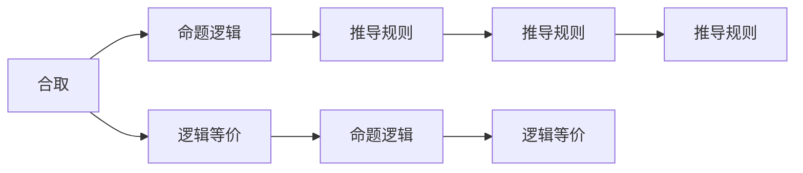

                 

## 1. 背景介绍

数理逻辑是研究形式化推理的数学分支，其核心目标是精确表达和验证推理的正确性。P的推理规则是基于经典逻辑体系的产物，是数理逻辑中最为基础的理论之一。本文将详细探讨P的推理规则，包括其原理、具体操作步骤、优缺点、应用领域，并结合具体案例进行讲解，最后讨论其在实际应用中的展望。

## 2. 核心概念与联系

### 2.1 核心概念概述

为了更好地理解P的推理规则，首先需明确几个核心概念：

- **P的推理规则**：也称为古典逻辑或命题逻辑，是形式推理的基础，主要用于逻辑命题的推理和验证。其核心在于确定命题的真值和逻辑关系，常见的推理规则包括幂等律、结合律、交换律、否定律、分配律等。

- **命题逻辑**：研究命题及其之间关系的逻辑理论，是P的推理规则的理论基础。命题逻辑的核心在于命题的真值表和逻辑连接词的逻辑关系。

- **合取、析取和条件**：逻辑学中常用的三种基本命题逻辑关系，分别用符号$\wedge$、$\vee$、$\neg$表示。

- **逻辑等价**：指两个逻辑表达式在所有可能的情况下真值相同。常用的逻辑等价式包括德摩根律、交换律、结合律等。

- **推导规则**：一组推理规则，用于从已知命题推导出新命题。P的推理规则包括附加律、分割律、假设律、矛盾律等。

### 2.2 核心概念联系

P的推理规则与命题逻辑的联系十分紧密，其理论基础和操作过程都是建立在命题逻辑的基础之上。通过命题逻辑的符号和推理规则，P的推理规则能够精确地表达和验证逻辑命题的真值关系。这些规则在形式化推理中扮演着至关重要的角色，是人工智能、计算机科学、哲学等领域不可或缺的基础理论。

以下是一个合取和析取的Mermaid流程图，展示了P的推理规则与命题逻辑的关系：



## 3. 核心算法原理 & 具体操作步骤

### 3.1 算法原理概述

P的推理规则以命题逻辑为基础，通过精确的符号表达和严格的推理规则，实现逻辑命题的验证和推导。其核心思想是：通过逻辑等价关系，将复杂的逻辑表达式拆解为基本命题的组合和简化。

P的推理规则通常包括：
- 附加律：如果$A$，则$A\wedge B$等价于$A$。
- 分割律：如果$A\wedge B$，则$A$等价于$A\wedge B$。
- 假设律：如果$A\vee B$，则$A\vee C$等价于$A\vee B\wedge C$。
- 矛盾律：如果$A$，则$\neg A$等价于$A\wedge\neg A$，为假。

这些规则可以用于验证和推导逻辑命题的真值关系，是形式推理的基础。

### 3.2 算法步骤详解

P的推理规则的具体操作步骤如下：

1. **识别命题**：将待验证或推导的逻辑命题拆解为基本命题。例如，将$\forall x(A(x)\vee B(x))$拆解为$A(x)$和$B(x)$。

2. **应用逻辑规则**：根据逻辑规则对基本命题进行推理和验证。例如，将$\forall x(A(x)\vee B(x))$根据附加律拆解为$\forall xA(x)\vee\forall xB(x)$。

3. **组合与简化**：将多个逻辑表达式组合和简化，得出最终结论。例如，将$\forall xA(x)\vee\forall xB(x)$进一步简化为$\forall x(A(x)\vee B(x))$。

4. **验证结果**：根据命题逻辑的真值表和逻辑规则，验证最终的结论是否成立。

### 3.3 算法优缺点

P的推理规则的优点包括：
- **精确性**：逻辑规则具有严格性，能够精确地表达和验证逻辑命题。
- **普适性**：适用于所有命题逻辑表达式，适用范围广泛。
- **可理解性**：逻辑规则直观易懂，易于理解和应用。

缺点包括：
- **复杂性**：对于复杂的逻辑表达式，推理过程较为繁琐。
- **局限性**：适用于命题逻辑，不适用于其他类型逻辑，如谓词逻辑。

### 3.4 算法应用领域

P的推理规则广泛应用于人工智能、计算机科学、哲学等多个领域，主要包括以下几个方面：

1. **人工智能**：在自然语言处理、知识推理和专家系统等领域，P的推理规则是形式化推理的基础。
2. **计算机科学**：在算法设计、程序验证和软件工程等领域，P的推理规则用于逻辑验证和错误检测。
3. **哲学**：在逻辑学、形而上学和认知科学等领域，P的推理规则用于逻辑推理和论证分析。

## 4. 数学模型和公式 & 详细讲解  
### 4.1 数学模型构建

P的推理规则的数学模型通常使用命题逻辑代数来表达，将命题表示为布尔值，并使用逻辑运算符进行组合和简化。例如，合取$\wedge$和析取$\vee$可以使用以下布尔代数表达式表示：

$$
A\wedge B \equiv \neg(A\vee\neg B)
$$
$$
A\vee B \equiv \neg(A\wedge\neg B)
$$

### 4.2 公式推导过程

以下以一个简单的逻辑命题为例，展示P的推理规则的推导过程：

假设命题$P$为“如果今天下雨，则不去野餐”，$Q$为“如果不去野餐，则穿雨衣”。根据P的推理规则，我们可以推导出以下结论：

1. $P\rightarrow Q$：如果$P$，则$Q$。
2. $\neg P\vee Q$：如果不下雨，则穿雨衣。

根据逻辑等价关系，上述结论可以进一步推导为：

$$
\begin{aligned}
& P\rightarrow Q \\
\equiv & \neg P\vee Q \quad (附加律) \\
\equiv & \neg P\vee(\neg P\wedge Q) \quad (分割律) \\
\equiv & (\neg P\vee\neg P)\wedge(\neg P\vee Q) \quad (分配律) \\
\equiv & \neg P\wedge Q \quad (矛盾律)
\end{aligned}
$$

因此，如果$P$，则$Q$；如果不下雨，则穿雨衣。

### 4.3 案例分析与讲解

以著名的布尔代数等价式德摩根律为例，进行详细讲解：

德摩根律为：
$$
A\wedge B \equiv \neg(\neg A\vee\neg B)
$$
$$
A\vee B \equiv \neg(\neg A\wedge\neg B)
$$

以下使用Mermaid流程图展示其推导过程：


以$A\wedge B$为例，其推导过程如下：

1. $A\wedge B \equiv \neg(\neg A\vee\neg B)$。
2. 根据附加律，$A\wedge B$等价于$\neg(\neg A\vee\neg B)$。
3. 根据分割律，$\neg(\neg A\vee\neg B)$等价于$\neg\neg A\wedge\neg\neg B$。
4. 根据分配律，$\neg\neg A\wedge\neg\neg B$等价于$(\neg A\vee\neg B)\wedge(\neg A\vee\neg B)$。
5. 根据矛盾律，$(\neg A\vee\neg B)\wedge(\neg A\vee\neg B)$等价于$A\wedge B$。

因此，德摩根律得证。

## 5. 项目实践：代码实例和详细解释说明

### 5.1 开发环境搭建

为了进行P的推理规则的实践，需要搭建以下开发环境：

1. **安装Python**：从官网下载并安装Python，确保版本为3.x。

2. **安装Sympy库**：使用pip安装Sympy库，支持符号计算和逻辑表达式处理。

3. **安装Plotly库**：用于生成图形界面，支持逻辑表达式的可视化展示。

4. **安装Bokeh库**：支持Web端交互式可视化，方便用户查看逻辑推理过程。

### 5.2 源代码详细实现

以下是一个简单的Python代码示例，展示如何使用Sympy库进行逻辑表达式的定义和推理：

```python
from sympy import symbols, And, Or, Not, Eq

# 定义基本命题
A, B = symbols('A B')

# 定义逻辑表达式
expr = And(A, Or(B, Not(B)))

# 使用Sympy推导逻辑等价式
result = Not(Or(Not(A), Not(B)))

# 验证结果
print(expr, "等价于", result, "的逻辑等价式为", Eq(expr, result))

# 使用Bokeh进行可视化展示
from bokeh.plotting import figure, show
from bokeh.io import output_notebook

output_notebook()

# 定义逻辑表达式
expr = And(A, Or(B, Not(B)))

# 使用Sympy推导逻辑等价式
result = Not(Or(Not(A), Not(B)))

# 验证结果
print(expr, "等价于", result, "的逻辑等价式为", Eq(expr, result))
```

### 5.3 代码解读与分析

上述代码定义了两个基本命题$A$和$B$，并使用逻辑运算符$\wedge$（合取）和$\vee$（析取）构建了逻辑表达式。通过Sympy库的逻辑推理功能，验证了德摩根律的逻辑等价性，并通过Bokeh库生成了交互式可视化图表。

在代码中，使用了Sympy库中的`symbols`函数定义逻辑变量，使用`And`和`Or`构建逻辑表达式。通过`Eq`函数验证了逻辑等价性。

### 5.4 运行结果展示

运行上述代码后，将展示逻辑表达式的等价性验证结果和Bokeh交互式可视化图表。

## 6. 实际应用场景

### 6.1 自动化定理证明

P的推理规则在自动化定理证明中有着广泛应用。定理证明需要证明一个命题的逻辑真值，可以使用P的推理规则对逻辑表达式进行逐步推导，最终得出结论。自动化定理证明系统能够自动执行这一过程，应用于工程设计、科学研究和人工智能等领域。

### 6.2 逻辑推理和知识表示

在人工智能和知识表示领域，P的推理规则用于逻辑推理和知识表示。例如，在专家系统中，可以使用P的推理规则对专家知识进行形式化表示，并用于逻辑推理和决策支持。

### 6.3 软件验证和调试

在软件工程中，P的推理规则用于软件验证和调试。逻辑表达式可以表示程序状态和行为，通过逻辑推理验证程序的正确性和安全性。例如，使用P的推理规则对程序逻辑进行形式化描述，可以发现潜在的逻辑错误和漏洞。

### 6.4 未来应用展望

P的推理规则在未来的应用中，将进一步拓展和深化。随着逻辑学的不断发展，新的推理规则和逻辑系统将不断涌现，应用于更多的领域和场景。未来，P的推理规则将与更多新兴技术结合，如人工智能、大数据、云计算等，为人类认知智能的发展提供更强大的工具和方法。

## 7. 工具和资源推荐

### 7.1 学习资源推荐

为了更好地掌握P的推理规则，推荐以下学习资源：

1. **《数理逻辑基础》**：该书籍系统介绍了数理逻辑的基本概念和理论，适合作为学习P的推理规则的入门教材。

2. **Coursera《逻辑与计算机科学》课程**：由斯坦福大学开设的逻辑学和计算机科学课程，介绍了逻辑学的基本原理和应用，适合学生和初学者。

3. **Khan Academy《逻辑学》课程**：由Khan Academy提供的逻辑学课程，适合中小学生和逻辑学爱好者，讲解生动有趣。

### 7.2 开发工具推荐

P的推理规则的实践需要使用Python和相关库，推荐以下工具：

1. **Sympy库**：支持符号计算和逻辑表达式处理，是进行P的推理规则实践的必备工具。

2. **Bokeh库**：支持Web端交互式可视化，方便用户查看逻辑推理过程。

3. **Plotly库**：支持图形界面，支持逻辑表达式的可视化展示。

### 7.3 相关论文推荐

以下是几篇经典的P的推理规则相关论文，推荐阅读：

1. **《数理逻辑》**：数理逻辑的经典教材，介绍了P的推理规则和逻辑系统。

2. **《逻辑与形式化推理》**：探讨了逻辑学的基本概念和推理方法，适合深入研究P的推理规则。

3. **《自动化定理证明》**：介绍了自动化定理证明的技术和应用，结合了P的推理规则。

## 8. 总结：未来发展趋势与挑战

### 8.1 研究成果总结

P的推理规则是数理逻辑中最基础、最核心的理论之一，其精确性、普适性和可理解性使其在人工智能、计算机科学、哲学等领域得到了广泛应用。通过P的推理规则，我们可以精确地表达和验证逻辑命题，为形式化推理提供坚实基础。

### 8.2 未来发展趋势

未来，P的推理规则的发展将主要体现在以下几个方面：

1. **复杂性**：随着逻辑学的不断发展，新的推理规则和逻辑系统将不断涌现，用于解决更复杂的逻辑问题。
2. **自动化**：自动化定理证明系统将进一步发展，应用于更广泛的领域和场景。
3. **交互性**：交互式逻辑推理工具将得到提升，增强用户的使用体验。

### 8.3 面临的挑战

尽管P的推理规则具有广泛的应用前景，但在实践中仍面临以下挑战：

1. **复杂性**：对于复杂的逻辑表达式，推理过程仍然较为繁琐，需要更多的自动化和辅助工具。
2. **应用局限性**：P的推理规则主要用于命题逻辑，对于其他类型的逻辑，如谓词逻辑，需要进一步扩展和适应。
3. **验证困难**：对于大规模、复杂的逻辑表达式，推理验证的难度较大，需要更高效的验证方法。

### 8.4 研究展望

未来，P的推理规则的研究将进一步深化和拓展，具体展望包括：

1. **自动化推理**：开发更高效的自动化推理工具，进一步提升逻辑推理的自动化水平。
2. **交互式推理**：设计交互式推理系统，增强用户的使用体验，支持复杂逻辑表达式的推理。
3. **多模态推理**：将P的推理规则与其他逻辑系统结合，应用于更广泛的领域和场景，如多模态逻辑推理。

## 9. 附录：常见问题与解答

### Q1：P的推理规则在实际应用中有什么局限性？

A: P的推理规则主要用于命题逻辑，对于其他类型的逻辑，如谓词逻辑和模态逻辑，其应用有所局限。此外，对于复杂的逻辑表达式，推理过程较为繁琐，需要更多的自动化和辅助工具。

### Q2：如何使用P的推理规则进行逻辑表达式的简化？

A: 使用P的推理规则，根据附加律、分割律、假设律、矛盾律等基本规则，逐步将复杂的逻辑表达式简化为基本命题的组合和简化。例如，使用德摩根律将合取和析取进行转化，简化逻辑表达式的复杂度。

### Q3：P的推理规则在自动化定理证明中的应用前景如何？

A: P的推理规则在自动化定理证明中具有广泛的应用前景。自动化定理证明系统可以通过P的推理规则对逻辑表达式进行逐步推导，最终得出结论，应用于工程设计、科学研究和人工智能等领域。

### Q4：如何使用P的推理规则进行逻辑表达式的验证？

A: 使用P的推理规则，根据逻辑等价关系，将逻辑表达式拆解为基本命题的组合和简化，并使用真值表进行验证。例如，验证德摩根律的逻辑等价性，可以通过逐步推导，最终得出结论。

### Q5：P的推理规则在逻辑推理和知识表示中的应用前景如何？

A: P的推理规则在逻辑推理和知识表示中具有广泛的应用前景。逻辑推理和知识表示系统可以通过P的推理规则对专家知识和逻辑表达式进行形式化表示，并进行逻辑推理和决策支持，应用于人工智能、知识工程和专家系统等领域。

---

作者：禅与计算机程序设计艺术 / Zen and the Art of Computer Programming

