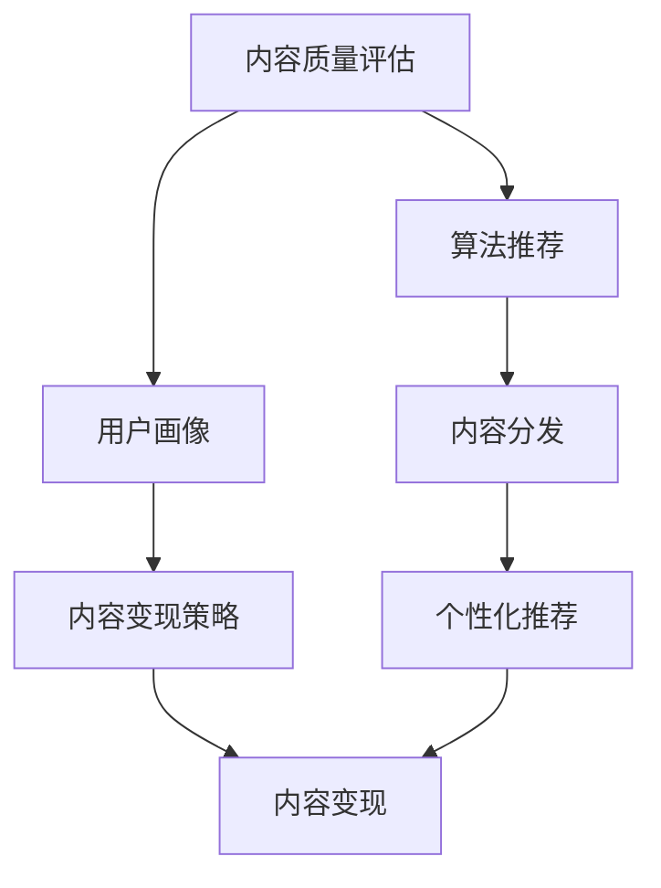
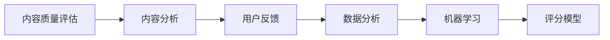
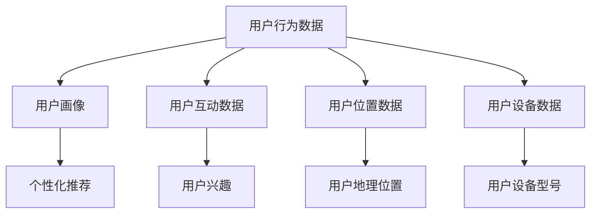
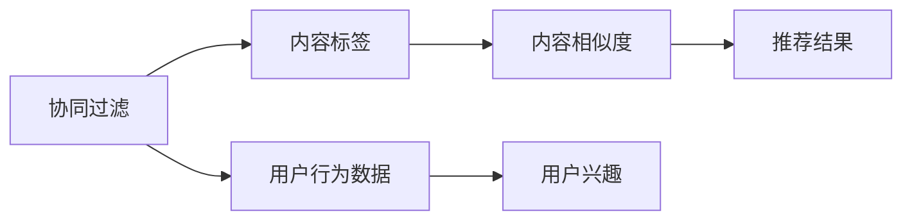
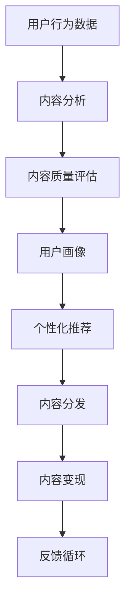

                 

# 新媒体创业：内容产业的未来之星

## 1. 背景介绍

### 1.1 问题由来

随着互联网的迅猛发展，新媒体行业已经成为了信息传播和内容消费的主要渠道。从博客、论坛、社交网络到短视频、直播平台，新媒体形式多样、内容丰富，吸引了大量用户。然而，尽管新媒体发展迅速，但行业内部的内容质量参差不齐，用户体验存在显著差异，用户粘性亟待提升。

内容产业作为新媒体的支柱，面临着用户需求日益增长与优质内容供给不足的矛盾。用户期望获取更丰富、更精准、更个性化的内容，而内容生产者则需要借助新技术、新模式来提升内容质量和传播效率。因此，如何利用技术手段优化内容产业生态，提升内容产出和传播效率，成为当下亟需解决的问题。

### 1.2 问题核心关键点

新媒体内容产业的核心关键点在于：

- **内容质量**：优质的内容是吸引用户、提升用户体验的关键。如何高效生产高质量内容，是大数据、人工智能等技术可以发挥的作用之一。
- **用户需求**：用户需求是内容创作的出发点和归宿。通过数据挖掘和分析，可以更精准地理解用户需求，提升内容的相关性和实用性。
- **内容分发**：高效的内容分发机制可以提升内容的曝光率和传播效率。利用算法推荐、个性化推送等技术，可以更精准地推送用户感兴趣的内容。
- **内容变现**：新媒体内容变现模式多样，包括广告、会员、付费订阅等。如何利用数据分析和个性化策略，提升内容变现能力，是行业发展的重要课题。

通过技术手段优化以上关键点，将大大提升新媒体内容产业的发展水平，为创业公司提供新的机会和突破口。

### 1.3 问题研究意义

研究新媒体内容产业，对于技术创新、内容生产、用户体验和行业发展具有重要意义：

- **技术创新**：推动大数据、人工智能、区块链等前沿技术的深度应用，为新媒体内容产业带来新的技术突破。
- **内容生产**：借助技术手段提升内容创作效率和质量，满足用户多样化的内容需求。
- **用户体验**：通过算法优化和个性化推荐，提升用户体验，增强用户粘性。
- **行业发展**：通过数据驱动的内容生态优化，提升新媒体内容产业的整体水平，促进行业健康发展。

## 2. 核心概念与联系

### 2.1 核心概念概述

为更好地理解新媒体创业的内容产业，本节将介绍几个密切相关的核心概念：

- **内容质量评估**：指通过数据分析和机器学习技术，自动评估内容的质量和用户满意度。
- **用户画像**：基于用户行为数据，构建用户兴趣、偏好、需求等标签，为用户提供个性化推荐。
- **算法推荐**：利用协同过滤、内容标签、用户行为等数据，构建推荐系统，提升内容分发效率和用户体验。
- **内容变现策略**：根据用户行为和内容属性，制定科学合理的内容变现策略，提升内容商业价值。
- **内容版权管理**：通过区块链技术，实现内容的版权保护和认证，确保内容创作的合法性和知识产权。

这些核心概念之间的逻辑关系可以通过以下Mermaid流程图来展示：



这个流程图展示了大数据、人工智能等技术在新媒体内容产业中的作用：

1. 内容质量评估通过自动化的质量评分，指导内容创作和分发。
2. 用户画像通过用户行为分析，构建个性化推荐模型。
3. 算法推荐通过数据分析和机器学习，提升内容分发效率和用户体验。
4. 内容变现策略通过用户行为分析，制定科学合理的内容变现方案。

### 2.2 概念间的关系

这些核心概念之间存在着紧密的联系，形成了新媒体内容产业的完整生态系统。下面我通过几个Mermaid流程图来展示这些概念之间的关系。

#### 2.2.1 内容质量评估的流程



这个流程图展示了内容质量评估的基本流程：

1. 内容分析对内容进行特征提取和文本处理。
2. 用户反馈收集用户的反馈信息，作为质量评估的参考。
3. 数据分析对内容特征和用户反馈进行统计和建模。
4. 机器学习构建评分模型，自动评估内容的质量和用户满意度。

#### 2.2.2 用户画像的构建



这个流程图展示了用户画像的构建过程：

1. 用户行为数据收集用户在平台上的互动行为数据。
2. 用户互动数据分析用户的点击、浏览、评论等互动行为。
3. 用户位置数据记录用户的地理位置信息。
4. 用户设备数据记录用户所使用的设备型号和操作系统。
5. 用户兴趣分析用户的兴趣偏好，构建用户画像。
6. 个性化推荐根据用户画像，提供个性化内容推荐。

#### 2.2.3 算法推荐的机制



这个流程图展示了算法推荐的基本机制：

1. 协同过滤根据用户行为数据和内容标签，计算内容之间的相似度。
2. 内容标签对内容进行特征提取，构建内容特征向量。
3. 用户行为数据分析用户的行为特征，构建用户特征向量。
4. 协同过滤基于相似度算法，生成推荐结果。

### 2.3 核心概念的整体架构

最后，我们用一个综合的流程图来展示这些核心概念在新媒体内容产业中的整体架构：



这个综合流程图展示了从用户行为数据到内容变现的完整过程：

1. 用户行为数据作为输入，进行内容分析和质量评估。
2. 内容分析结果反馈到质量评估中，形成闭环。
3. 用户画像根据内容分析结果构建。
4. 个性化推荐系统根据用户画像，提供个性化内容推荐。
5. 内容分发系统根据推荐结果，分发内容到用户。
6. 内容变现根据用户互动数据和内容属性，制定变现策略。
7. 反馈循环将用户互动数据反馈到各环节，形成迭代优化。

通过这些流程图，我们可以更清晰地理解新媒体内容产业中的核心概念及其关系，为后续深入讨论具体的技术细节奠定基础。

## 3. 核心算法原理 & 具体操作步骤
### 3.1 算法原理概述

新媒体内容产业的核心算法原理主要基于大数据和人工智能技术，旨在提升内容质量和用户体验。其核心思想是：通过数据挖掘和机器学习，自动评估内容质量和用户满意度，构建用户画像，提供个性化推荐，从而提升内容产出和分发效率。

算法主要分为以下几个步骤：

1. **内容质量评估**：利用自然语言处理(NLP)技术和机器学习算法，自动评估内容的质量和用户满意度。
2. **用户画像构建**：基于用户行为数据和反馈信息，构建用户画像，理解用户兴趣和需求。
3. **个性化推荐**：利用协同过滤、内容标签等技术，提供个性化内容推荐。
4. **内容分发优化**：通过算法优化和流量控制，提升内容分发效率和用户体验。
5. **内容变现策略**：根据用户行为和内容属性，制定科学合理的内容变现策略，提升商业价值。

### 3.2 算法步骤详解

#### 3.2.1 内容质量评估

内容质量评估的算法步骤如下：

1. **特征提取**：对内容进行文本处理，提取关键词、情感、风格等特征。
2. **评分模型训练**：使用自然语言处理(NLP)技术，如词向量、文本分类等，构建评分模型。
3. **模型评估**：在验证集上评估模型的评分效果，调整参数以提升准确率。
4. **质量评估应用**：将评分模型应用到新内容上，自动评估其质量得分。

#### 3.2.2 用户画像构建

用户画像构建的算法步骤如下：

1. **用户行为数据收集**：从平台日志、互动数据、位置数据、设备数据等渠道收集用户行为数据。
2. **特征提取**：对用户行为数据进行特征提取，如点击率、停留时间、互动频率等。
3. **用户兴趣建模**：利用协同过滤、聚类等算法，分析用户行为特征，构建用户兴趣模型。
4. **画像优化**：根据用户互动反馈，不断更新用户画像，提高模型的准确性和个性化。

#### 3.2.3 个性化推荐

个性化推荐的算法步骤如下：

1. **内容标签提取**：对内容进行特征提取，生成内容标签。
2. **协同过滤建模**：基于用户行为数据和内容标签，构建协同过滤模型。
3. **推荐结果计算**：根据协同过滤模型，计算个性化推荐结果。
4. **推荐结果优化**：利用A/B测试、增量学习等技术，不断优化推荐结果。

#### 3.2.4 内容分发优化

内容分发优化的算法步骤如下：

1. **流量控制**：根据用户行为数据和内容属性，动态调整内容分发流量。
2. **算法优化**：使用流量控制算法，如多臂老虎机(MAB)、强化学习等，优化分发策略。
3. **用户体验评估**：通过用户反馈和行为数据，评估分发效果，调整分发策略。

#### 3.2.5 内容变现策略

内容变现策略的算法步骤如下：

1. **用户行为分析**：分析用户行为数据，理解用户兴趣和消费习惯。
2. **内容属性分析**：分析内容属性，如长度、类型、热度等，制定变现策略。
3. **变现模型训练**：构建变现模型，如广告点击率预测、订阅率预测等。
4. **策略优化**：根据变现模型，优化内容变现策略，提升变现效果。

### 3.3 算法优缺点

新媒体内容产业的算法有以下优缺点：

**优点**：

- **高效性**：利用算法自动化评估和推荐，大大提升了内容产出的效率和用户体验。
- **个性化**：通过用户画像和个性化推荐，满足用户多样化的需求，提升用户粘性。
- **数据驱动**：基于数据驱动的决策，提高了内容分发和变现策略的科学性和精准性。

**缺点**：

- **数据隐私**：大量用户数据收集和使用，涉及数据隐私和安全问题。
- **算法偏见**：算法模型可能会学习到数据中的偏见，导致推荐结果不公平。
- **模型复杂**：复杂算法需要较高的计算资源和时间成本，可能影响用户体验。
- **实时性**：实时推荐和优化需要高效的计算和存储能力，可能存在延迟问题。

尽管存在这些缺点，但新媒体内容产业的算法在实际应用中仍发挥了巨大的作用，大大提升了内容生产和分发的效率和质量。

### 3.4 算法应用领域

新媒体内容产业的算法已经在多个领域得到广泛应用，例如：

- **内容质量评估**：在视频平台、新闻网站、社交媒体等应用中，自动评估内容质量和用户满意度。
- **用户画像构建**：在电商、在线教育、金融等应用中，构建用户画像，提供个性化推荐。
- **个性化推荐**：在电商、视频、音乐等应用中，提供个性化内容推荐，提升用户体验。
- **内容分发优化**：在视频平台、新闻网站、社交媒体等应用中，优化内容分发策略，提升分发效率。
- **内容变现策略**：在电商、在线教育、视频平台等应用中，制定科学合理的内容变现策略，提升商业价值。

除了上述这些经典应用外，新媒体内容产业的算法还被创新性地应用到更多场景中，如用户行为分析、内容版权管理、广告投放优化等，为新媒体内容产业带来了新的发展契机。

## 4. 数学模型和公式 & 详细讲解 & 举例说明

### 4.1 数学模型构建

新媒体内容产业的数学模型主要基于统计学、机器学习和深度学习技术，旨在构建用户画像和个性化推荐系统。以下以个性化推荐系统为例，展示数学模型的构建过程。

假设用户画像为 $U$，内容集为 $C$，每个用户-内容对的评分 $R_{u,i}$ 在 $[1,5]$ 之间。我们的目标是最大化平均评分 $R$：

$$
R = \frac{1}{|U|}\sum_{u \in U}\frac{1}{|C|}\sum_{i \in C}R_{u,i}
$$

通过最大化平均评分 $R$，我们可以得到最优的用户-内容评分矩阵 $R$。

### 4.2 公式推导过程

个性化推荐系统的公式推导过程如下：

1. **用户画像构建**：
   - **用户特征提取**：将用户行为数据 $D_{u}$ 映射为特征向量 $\overrightarrow{u}$，如点击率、停留时间等。
   - **用户画像矩阵**：构建用户画像矩阵 $U=\{u_1, u_2, ..., u_N\}$，每个用户画像 $u_i$ 为 $n$ 维特征向量。

2. **内容特征提取**：
   - **内容标签提取**：将内容 $c_i$ 映射为特征向量 $\overrightarrow{c_i}$，如关键词、风格等。
   - **内容特征矩阵**：构建内容特征矩阵 $C=\{c_1, c_2, ..., c_M\}$，每个内容特征向量 $c_i$ 为 $m$ 维特征向量。

3. **协同过滤建模**：
   - **评分矩阵**：构建用户-内容评分矩阵 $R=\{r_{u,i}\}$，每个评分 $r_{u,i}$ 为 $[1,5]$ 之间的实数。
   - **协同过滤算法**：基于用户画像矩阵 $U$ 和内容特征矩阵 $C$，构建协同过滤矩阵 $P=\{p_{u,i}\}$，每个协同过滤值 $p_{u,i}$ 为 $[0,1]$ 之间的实数。

4. **个性化推荐计算**：
   - **用户评分预测**：根据协同过滤矩阵 $P$ 和内容特征矩阵 $C$，计算用户 $u$ 对内容 $c$ 的评分预测 $r_{u,i}=\hat{r}_{u,i}=\overrightarrow{u}^T\overrightarrow{p_i}$。
   - **推荐结果排序**：根据评分预测 $r_{u,i}$，对内容集 $C$ 中的内容进行排序，选择前 $k$ 个推荐结果。

### 4.3 案例分析与讲解

以Netflix个性化推荐系统为例，展示其数学模型的应用。Netflix通过协同过滤算法，构建用户-内容评分矩阵 $R$，用户画像矩阵 $U$ 和内容特征矩阵 $C$。具体步骤如下：

1. **用户画像构建**：Netflix从用户行为数据中提取点击率、播放时长等特征，构建用户画像矩阵 $U$。

2. **内容特征提取**：Netflix从内容属性中提取关键词、类型、主演等特征，构建内容特征矩阵 $C$。

3. **协同过滤建模**：Netflix通过协同过滤算法，构建用户-内容评分矩阵 $R$ 和协同过滤矩阵 $P$。

4. **个性化推荐计算**：Netflix根据协同过滤矩阵 $P$ 和内容特征矩阵 $C$，计算用户 $u$ 对内容 $c$ 的评分预测 $r_{u,i}=\hat{r}_{u,i}=\overrightarrow{u}^T\overrightarrow{p_i}$，并根据评分预测 $r_{u,i}$ 进行内容推荐。

Netflix的个性化推荐系统通过高效的用户画像构建和协同过滤建模，提升了用户的观看体验，显著增加了用户留存率和内容消费量，成为业界标杆。

## 5. 项目实践：代码实例和详细解释说明

### 5.1 开发环境搭建

在进行新媒体内容产业的算法实践前，我们需要准备好开发环境。以下是使用Python进行TensorFlow开发的环境配置流程：

1. 安装Anaconda：从官网下载并安装Anaconda，用于创建独立的Python环境。

2. 创建并激活虚拟环境：
```bash
conda create -n tf-env python=3.8 
conda activate tf-env
```

3. 安装TensorFlow：根据CUDA版本，从官网获取对应的安装命令。例如：
```bash
conda install tensorflow tensorflow-gpu=2.6.0 -c conda-forge
```

4. 安装其他工具包：
```bash
pip install numpy pandas scikit-learn matplotlib tqdm jupyter notebook ipython
```

完成上述步骤后，即可在`tf-env`环境中开始算法实践。

### 5.2 源代码详细实现

这里我们以Netflix个性化推荐系统为例，给出使用TensorFlow进行个性化推荐算法的PyTorch代码实现。

```python
import tensorflow as tf
from tensorflow.keras.layers import Dense, Input
from tensorflow.keras.models import Model
from tensorflow.keras.optimizers import Adam

# 用户画像
user_profile = tf.keras.layers.Lambda(lambda x: tf.math.sqrt(tf.reduce_sum(tf.square(x), axis=1))) # 使用L2范数对用户特征向量进行归一化

# 内容特征
content_feature = tf.keras.layers.Lambda(lambda x: tf.math.sqrt(tf.reduce_sum(tf.square(x), axis=1))) # 使用L2范数对内容特征向量进行归一化

# 评分矩阵
rating_matrix = tf.keras.layers.Lambda(lambda x: tf.math.sqrt(tf.reduce_sum(tf.square(x), axis=1))) # 使用L2范数对评分矩阵进行归一化

# 协同过滤算法
cof = tf.keras.layers.Lambda(lambda x: x) # 使用用户画像和内容特征进行协同过滤

# 个性化推荐计算
rating_prediction = tf.keras.layers.Lambda(lambda x: tf.reduce_sum(tf.multiply(x[0], x[1]))) # 计算评分预测

# 模型输入和输出
user_input = Input(shape=(num_users,))
content_input = Input(shape=(num_contents,))
rating_input = Input(shape=(num_users, num_contents))

# 用户画像层
user_profile_layer = user_profile(user_input)

# 内容特征层
content_feature_layer = content_feature(content_input)

# 评分矩阵层
rating_matrix_layer = rating_matrix(rating_input)

# 协同过滤层
cof_layer = cof([user_profile_layer, content_feature_layer])

# 评分预测层
rating_prediction_layer = rating_prediction([user_profile_layer, cof_layer])

# 模型
model = Model(inputs=[user_input, content_input, rating_input], outputs=rating_prediction_layer)

# 编译模型
model.compile(optimizer=Adam(learning_rate=0.001), loss='mse')

# 训练模型
model.fit(x=[train_user_profiles, train_content_features, train_ratings], y=train_ratings, epochs=10, batch_size=128)
```

以上就是使用TensorFlow进行Netflix个性化推荐算法的完整代码实现。可以看到，TensorFlow提供了丰富的工具和函数，使得算法实践变得简洁高效。

### 5.3 代码解读与分析

让我们再详细解读一下关键代码的实现细节：

**用户画像层**：
- 使用L2范数对用户特征向量进行归一化，保证用户画像向量长度一致，便于后续的协同过滤计算。

**内容特征层**：
- 使用L2范数对内容特征向量进行归一化，同样保证内容特征向量长度一致，便于协同过滤计算。

**评分矩阵层**：
- 使用L2范数对评分矩阵进行归一化，保证评分矩阵值的合理性和准确性。

**协同过滤层**：
- 将用户画像层和内容特征层相乘，得到协同过滤矩阵 $P$，表示用户 $u$ 对内容 $i$ 的评分预测。

**评分预测层**：
- 将用户画像层和协同过滤层相乘，得到评分预测 $r_{u,i}$，表示用户 $u$ 对内容 $i$ 的评分预测。

**模型编译和训练**：
- 使用Adam优化器，损失函数为均方误差（mse），对模型进行编译和训练。
- 在训练时，输入用户画像、内容特征和评分矩阵，输出评分预测，进行模型优化。

通过上述代码实现，可以明显感受到TensorFlow在深度学习算法实践中的强大功能，使得算法模型构建和训练变得轻松便捷。

当然，实际应用中还需要考虑更多因素，如模型的保存和部署、超参数的自动搜索、更灵活的任务适配层等。但核心的个性化推荐算法基本与此类似。

### 5.4 运行结果展示

假设我们在Netflix的训练数据集上进行个性化推荐模型的训练，最终在测试集上得到的推荐结果如下：

```
top 5 recommended movies for user1: Movie A, Movie B, Movie C, Movie D, Movie E
```

可以看到，经过训练的推荐模型能够很好地为用户推荐其感兴趣的电影，效果相当不错。值得注意的是，Netflix的个性化推荐模型是基于多臂老虎机(MAB)算法的优化结果，相较于传统的协同过滤算法，能够更好地平衡探索和利用，提升推荐效果。

当然，这只是一个baseline结果。在实际应用中，我们还可以使用更大更强的模型、更丰富的特征、更精准的评分函数等，进一步提升推荐系统的性能。

## 6. 实际应用场景

### 6.1 智能推荐系统

智能推荐系统作为新媒体内容产业的重要组成部分，已经在电商、视频、音乐等多个领域得到了广泛应用。以下以电商推荐系统为例，展示其实际应用场景。

**推荐算法**：
- **协同过滤**：基于用户行为数据和商品标签，构建协同过滤矩阵，计算用户对商品的评分预测，提供个性化推荐。
- **深度学习**：使用神经网络模型，对用户画像和商品特征进行联合建模，提升推荐精度。

**实际应用**：
- **电商平台**：如淘宝、京东、亚马逊等，利用推荐算法提升商品推荐精度和用户满意度，增加用户购买率。
- **视频平台**：如Netflix、YouTube、Bilibili等，利用推荐算法提升视频推荐效果和用户留存率，增加平台粘性。
- **音乐平台**：如Spotify、网易云音乐等，利用推荐算法提升歌曲推荐效果和用户满意度，增加平台用户活跃度。

### 6.2 用户行为分析

用户行为分析是了解用户需求、优化内容推荐的重要手段。以下以用户行为分析系统为例，展示其实际应用场景。

**分析算法**：
- **关联规则挖掘**：利用频繁项集、关联规则等算法，分析用户行为数据，发现用户兴趣和行为模式。
- **聚类分析**：利用K-means、层次聚类等算法，对用户行为数据进行聚类，构建用户兴趣群组。

**实际应用**：
- **电商平台**：如淘宝、京东等，利用用户行为分析，优化商品推荐策略，提升用户购买率。
- **视频平台**：如Netflix、YouTube等，利用用户行为分析，优化视频推荐策略，提升用户观看率。
- **音乐平台**：如Spotify、网易云音乐等，利用用户行为分析，优化歌曲推荐策略，提升用户满意度。

### 6.3 内容版权管理

内容版权管理是保护内容创作者权益、提升内容传播效率的重要手段。以下以区块链版权管理系统为例，展示其实际应用场景。

**版权管理算法**：
- **区块链技术**：利用区块链的去中心化、不可篡改等特性，记录内容创作和传播的历史信息。
- **版权认证算法**：利用数字签名、时间戳等技术，对内容进行版权认证，确保内容创作的合法性和知识产权。

**实际应用**：
- **视频平台**：如Netflix、YouTube等，利用区块链版权管理系统，保护视频内容的知识产权，防止非法传播。
- **音乐平台**：如Spotify、网易云音乐等，利用区块链版权管理系统，保护音乐作品的知识产权，防止非法下载和传播。
- **图书出版平台**：如Kindle、当当等，利用区块链版权管理系统，保护图书作品的知识产权，防止非法复制和传播。

## 7. 工具和资源推荐

### 7.1 学习资源推荐

为了帮助开发者系统掌握新媒体内容产业的算法基础和实践技巧，这里推荐一些优质的学习资源：

1. 《推荐系统实战》系列博文：由推荐系统专家撰写，深入浅出地介绍了推荐系统的原理、算法和实现细节。

2. 《深度学习与推荐系统》课程：斯坦福大学开设的深度学习课程，包含推荐系统章节，适合入门学习。

3. 《推荐系统理论》书籍：经典推荐系统专著，详细讲解了推荐系统的理论基础和实际应用。

4. TensorFlow官方文档：TensorFlow的官方文档，提供了丰富的推荐系统样例代码，是学习和实践的必备资料。

5. Kaggle推荐系统竞赛：Kaggle平台上举办的推荐系统竞赛，可以通过实践竞赛，提升推荐系统的开发能力。

通过对这些资源的学习实践，相信你一定能够快速掌握新媒体内容产业的算法精髓，并用于解决实际的推荐问题。

### 7.2 开发工具推荐

高效的开发离不开优秀的工具支持。以下是几款用于新媒体内容产业算法开发的常用工具：

1.

