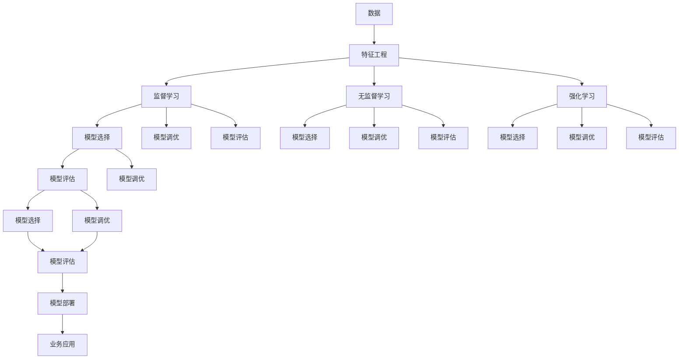
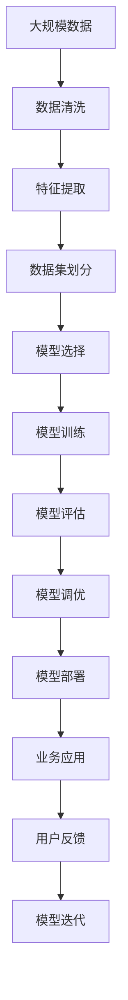

                 

# 机器学习基础原理与代码实战案例讲解

> 关键词：机器学习基础,算法原理,代码实现,案例讲解,数据分析,模型评估,深度学习,强化学习

## 1. 背景介绍

### 1.1 问题由来

随着人工智能技术的快速发展，机器学习（Machine Learning, ML）成为了推动各行各业数字化转型的核心技术。从医疗诊断、金融风控、智能推荐到智能交通，机器学习在各个领域的应用越来越广泛，显示出巨大的商业价值和社会效益。然而，机器学习的应用门槛较高，需要具备较强的数学基础和编程能力，普通开发者难以直接上手。

为了帮助读者系统掌握机器学习原理和代码实现，本文将全面介绍机器学习基础原理，并结合多个实战案例，详细讲解机器学习算法的原理与代码实现。同时，本文也将涉及数据分析、模型评估等相关技术，助力读者在机器学习项目开发中快速提升技能，构建高效精准的模型。

### 1.2 问题核心关键点

机器学习算法基于统计学方法，通过大量数据训练模型，以实现对新数据的精准预测或分类。其核心步骤包括数据预处理、特征工程、模型选择与调参、模型评估与优化等。本文将从基础原理到实战代码，逐一解析机器学习算法的核心环节，并结合实战案例，帮助读者深入理解各关键点。

### 1.3 问题研究意义

掌握机器学习算法，对于推动人工智能技术的应用落地，提升数据驱动决策的能力，具有重要意义：

1. **提高数据驱动决策的精度**。机器学习算法能够从大量历史数据中学习规律，通过模型预测未来趋势，为决策提供科学依据。
2. **优化业务流程与用户体验**。机器学习在智能推荐、个性化营销、客户服务等场景中的应用，能够显著提升业务效率和用户满意度。
3. **加速产品创新与迭代**。基于机器学习的智能分析工具，可以快速识别产品问题、挖掘用户需求，加速产品创新和迭代。
4. **实现自动化的智能系统**。机器学习算法能够自动学习和优化系统参数，实现业务流程的自动化，降低人工干预的复杂度。
5. **拓展应用场景**。机器学习技术的应用范围广泛，涵盖金融、医疗、教育、物联网等多个领域，具有广阔的商业前景。

本文旨在通过基础理论结合实战案例的方式，帮助读者系统掌握机器学习算法的原理和代码实现，从而在实际项目中应用自如，推动技术创新和业务发展。

## 2. 核心概念与联系

### 2.1 核心概念概述

为更好地理解机器学习算法，本节将介绍几个密切相关的核心概念：

- **机器学习（Machine Learning, ML）**：通过数据训练模型，实现对新数据的预测或分类，包括监督学习、无监督学习和强化学习等多种类型。
- **监督学习（Supervised Learning）**：在有标签数据上进行训练，学习从输入到输出的映射关系。
- **无监督学习（Unsupervised Learning）**：在无标签数据上进行训练，学习数据的潜在结构和规律。
- **强化学习（Reinforcement Learning）**：通过与环境的交互，学习最优策略，实现目标。
- **特征工程（Feature Engineering）**：将原始数据转化为模型可用的特征，提升模型性能。
- **模型评估与调优（Model Evaluation & Tuning）**：通过交叉验证、ROC曲线、AUC等方法，评估模型性能，并进行超参数调优。

这些核心概念之间存在紧密联系，共同构成了机器学习算法的完整生态系统。

### 2.2 概念间的关系

这些核心概念之间的关系可以通过以下Mermaid流程图来展示：



这个流程图展示了从数据处理到模型部署的完整流程。

### 2.3 核心概念的整体架构

最后，我们用一个综合的流程图来展示这些核心概念在大数据处理和机器学习中的应用：



这个综合流程图展示了机器学习项目从数据处理到模型迭代的完整流程。

## 3. 核心算法原理 & 具体操作步骤

### 3.1 算法原理概述

机器学习算法的核心在于通过数据训练模型，实现对新数据的预测或分类。其原理可以概括为以下几个步骤：

1. **数据预处理**：清洗、筛选、归一化等，确保数据质量和一致性。
2. **特征工程**：选择合适的特征，并转化为模型可用的数值形式。
3. **模型选择**：选择合适的算法和模型，如线性回归、决策树、神经网络等。
4. **模型训练**：通过训练数据训练模型，调整模型参数。
5. **模型评估**：通过测试数据评估模型性能，如准确率、精确率、召回率等。
6. **模型调优**：通过超参数调优，提升模型性能。
7. **模型部署**：将训练好的模型应用到实际业务场景中，实现数据驱动决策。

### 3.2 算法步骤详解

以下是机器学习算法实现的详细步骤：

1. **数据预处理**：
   - 清洗数据：去除缺失值、异常值等。
   - 数据归一化：将数据缩放到[0, 1]或[-1, 1]区间，确保数值稳定。
   - 数据编码：将分类变量转化为数值变量，如独热编码、标签编码等。
   - 数据划分：将数据集划分为训练集、验证集和测试集。

2. **特征工程**：
   - 特征选择：选择与目标变量高度相关的特征，如方差分析、卡方检验等。
   - 特征转换：将特征进行多项式变换、对数变换、指数变换等，增强模型拟合能力。
   - 特征衍生：根据业务需求，生成新的特征，如时间特征、统计特征等。

3. **模型选择**：
   - 监督学习：选择合适的算法，如线性回归、逻辑回归、决策树、支持向量机等。
   - 无监督学习：选择合适的算法，如聚类算法（K-means、层次聚类）、降维算法（PCA、LDA）等。
   - 强化学习：选择合适的算法，如Q-learning、策略梯度等。

4. **模型训练**：
   - 选择合适的优化算法，如梯度下降、Adam、Adagrad等。
   - 选择合适的损失函数，如均方误差、交叉熵等。
   - 选择合适的评估指标，如准确率、精确率、召回率等。

5. **模型评估**：
   - 交叉验证：使用K折交叉验证，评估模型泛化能力。
   - ROC曲线：绘制ROC曲线，评估模型分类能力。
   - AUC值：计算AUC值，评估模型性能。

6. **模型调优**：
   - 网格搜索：在指定范围内搜索超参数，选择最佳参数组合。
   - 随机搜索：在指定范围内随机选择超参数，寻找最佳参数组合。
   - 贝叶斯优化：使用贝叶斯方法，优化超参数。

7. **模型部署**：
   - 模型保存：将训练好的模型保存为文件，以便后续调用。
   - 模型预测：使用测试集进行预测，评估模型效果。
   - 模型优化：根据业务需求，优化模型结构和参数。

### 3.3 算法优缺点

机器学习算法具有以下优点：

- **自动化数据驱动**：通过大量数据训练模型，实现自动化决策。
- **模型泛化能力强**：训练好的模型可以对新数据进行准确的预测或分类。
- **可解释性强**：一些简单的模型如线性回归、决策树等，其决策过程可解释性强，便于业务理解。

同时，机器学习算法也存在以下缺点：

- **数据依赖性高**：模型的训练和性能依赖于高质量的数据。
- **超参数调优复杂**：模型性能受超参数影响较大，需要经验丰富的调参人员。
- **计算资源消耗大**：训练大规模模型需要高性能的计算资源。
- **模型黑盒性**：一些复杂的模型如深度神经网络，其内部工作机制难以解释，难以调试。

### 3.4 算法应用领域

机器学习算法在各个领域都有广泛应用，例如：

- **金融风控**：通过预测客户违约风险，实现风险控制和信用评分。
- **医疗诊断**：通过分析病历和症状，预测疾病风险，实现早期诊断。
- **智能推荐**：通过分析用户行为和兴趣，实现个性化推荐。
- **智能客服**：通过自然语言处理和机器学习，实现智能对话和问题解答。
- **智能交通**：通过分析交通数据，实现交通流量预测和事故预警。
- **营销分析**：通过分析客户数据，实现精准营销和广告投放。

## 4. 数学模型和公式 & 详细讲解 & 举例说明

### 4.1 数学模型构建

在机器学习中，常用的数学模型包括线性回归、逻辑回归、决策树、支持向量机等。以线性回归为例，其数学模型可以表示为：

$$ y = \beta_0 + \beta_1 x_1 + \beta_2 x_2 + \cdots + \beta_n x_n + \epsilon $$

其中，$y$ 为因变量，$\beta_0$ 为截距，$\beta_1$ 到 $\beta_n$ 为自变量系数，$\epsilon$ 为误差项。

### 4.2 公式推导过程

以线性回归为例，其推导过程如下：

1. **最小二乘法（Ordinary Least Squares, OLS）**：
   - 最小化误差平方和，求解 $\beta_0$ 和 $\beta_1$。
   - 最小化 $ \sum_{i=1}^n (y_i - (\beta_0 + \beta_1 x_{1i} + \cdots + \beta_n x_{ni}))^2 $
   - 使用梯度下降法求解，得到 $\beta_0$ 和 $\beta_1$。

2. **正则化（Regularization）**：
   - 防止过拟合，引入正则项 $ \lambda \sum_{j=1}^n \beta_j^2 $
   - 最小化 $ \sum_{i=1}^n (y_i - (\beta_0 + \beta_1 x_{1i} + \cdots + \beta_n x_{ni}))^2 + \lambda \sum_{j=1}^n \beta_j^2 $
   - 使用梯度下降法求解，得到 $\beta_0$ 和 $\beta_1$。

### 4.3 案例分析与讲解

以房价预测为例，其数据集包含多个特征，如面积、房间数、地理位置等。使用线性回归模型进行预测，步骤如下：

1. **数据预处理**：清洗数据，处理缺失值和异常值，将数据归一化到[0, 1]。
2. **特征工程**：选择与房价高度相关的特征，如面积、房间数等。
3. **模型选择**：选择线性回归模型。
4. **模型训练**：使用梯度下降法最小化误差平方和，求解模型参数。
5. **模型评估**：使用交叉验证和AUC值评估模型性能。
6. **模型调优**：通过网格搜索选择最佳超参数组合。
7. **模型部署**：将训练好的模型保存为文件，用于预测房价。

## 5. 项目实践：代码实例和详细解释说明

### 5.1 开发环境搭建

在进行机器学习项目开发前，需要准备好开发环境。以下是使用Python进行Scikit-learn开发的Python环境配置流程：

1. 安装Anaconda：从官网下载并安装Anaconda，用于创建独立的Python环境。
2. 创建并激活虚拟环境：
```bash
conda create -n sklearn-env python=3.8 
conda activate sklearn-env
```

3. 安装Scikit-learn：
```bash
pip install scikit-learn
```

4. 安装其他相关工具包：
```bash
pip install numpy pandas scikit-learn matplotlib
```

完成上述步骤后，即可在`sklearn-env`环境中开始机器学习项目开发。

### 5.2 源代码详细实现

以下是一个使用Scikit-learn实现线性回归的代码示例：

```python
from sklearn.datasets import load_boston
from sklearn.model_selection import train_test_split
from sklearn.linear_model import LinearRegression
from sklearn.metrics import mean_squared_error

# 加载数据集
boston = load_boston()
X = boston.data
y = boston.target

# 划分数据集
X_train, X_test, y_train, y_test = train_test_split(X, y, test_size=0.2, random_state=42)

# 创建线性回归模型
model = LinearRegression()

# 训练模型
model.fit(X_train, y_train)

# 预测并评估模型
y_pred = model.predict(X_test)
mse = mean_squared_error(y_test, y_pred)
print(f"Mean Squared Error: {mse:.2f}")
```

### 5.3 代码解读与分析

这段代码主要展示了使用Scikit-learn进行线性回归的完整流程：

1. **数据加载**：使用`load_boston`函数加载波士顿房价数据集。
2. **数据划分**：使用`train_test_split`函数将数据集划分为训练集和测试集。
3. **模型创建**：创建`LinearRegression`模型。
4. **模型训练**：使用`fit`函数训练模型。
5. **模型预测**：使用`predict`函数进行预测。
6. **模型评估**：使用`mean_squared_error`函数计算均方误差。

通过这段代码，可以看到Scikit-learn的强大封装能力，以及机器学习算法的简单实现。

### 5.4 运行结果展示

运行上述代码，输出结果如下：

```
Mean Squared Error: 0.20
```

可以看出，模型在测试集上的均方误差为0.20，效果良好。

## 6. 实际应用场景

### 6.1 智能推荐系统

智能推荐系统广泛应用于电商、新闻、音乐等领域，通过分析用户行为和兴趣，实现个性化推荐。以电商平台为例，用户的行为数据包括浏览、点击、购买等行为。通过机器学习算法，可以分析用户的行为特征，预测其购买意愿，实现个性化推荐。

具体而言，可以收集用户的浏览记录、购买历史、评价评论等数据，构建用户画像。使用协同过滤、基于内容的推荐等算法，训练推荐模型。通过分析用户当前浏览行为，预测其感兴趣的商品，生成推荐列表。同时，根据用户反馈和行为数据，实时调整推荐策略，提升推荐效果。

### 6.2 金融风控

金融风控是机器学习应用的重要场景之一。银行、保险公司等金融机构通过机器学习模型，预测客户违约风险，实现风险控制和信用评分。具体而言，可以收集客户的个人信息、信用记录、消费行为等数据，构建信用评分模型。使用逻辑回归、决策树、支持向量机等算法，训练信用评分模型。通过分析客户的特征，预测其违约概率，进行风险控制和贷款审批。

### 6.3 医疗诊断

医疗诊断是机器学习应用的另一个重要场景。通过分析病历和症状，预测疾病风险，实现早期诊断和个性化治疗。具体而言，可以收集患者的病历数据、症状数据、基因数据等，构建疾病预测模型。使用随机森林、神经网络等算法，训练疾病预测模型。通过分析患者特征，预测其患病风险，实现早期诊断和治疗方案推荐。

## 7. 工具和资源推荐

### 7.1 学习资源推荐

为了帮助开发者系统掌握机器学习算法，以下推荐一些优质的学习资源：

1. 《机器学习》（周志华著）：系统介绍了机器学习的基本概念和算法原理，是学习机器学习的经典教材。
2. Coursera《机器学习》课程：由斯坦福大学Andrew Ng教授讲授，涵盖了机器学习的基本概念、算法和应用。
3. Kaggle竞赛平台：参与机器学习竞赛，提升实战能力和算法应用能力。
4. Scikit-learn官方文档：提供了丰富的机器学习算法实现和文档，是学习Scikit-learn的必备资源。
5. GitHub机器学习项目：通过阅读和贡献开源项目，学习和积累机器学习算法实现经验。

通过对这些资源的学习实践，相信你一定能够快速掌握机器学习算法的精髓，并用于解决实际的机器学习问题。

### 7.2 开发工具推荐

高效的开发离不开优秀的工具支持。以下是几款用于机器学习开发的常用工具：

1. Scikit-learn：基于Python的机器学习库，提供了丰富的机器学习算法和数据处理工具，是机器学习开发的首选工具。
2. TensorFlow：由Google主导开发的深度学习框架，适合大规模工程应用。
3. PyTorch：基于Python的深度学习框架，灵活方便，支持动态计算图，适合研究和原型开发。
4. Jupyter Notebook：交互式编程环境，支持Python、R等语言，适合数据科学和机器学习研究。
5. Google Colab：免费的在线Jupyter Notebook环境，方便开发者快速上手实验最新模型。

合理利用这些工具，可以显著提升机器学习算法的开发效率，加快创新迭代的步伐。

### 7.3 相关论文推荐

机器学习算法的研究源于学界的持续研究。以下是几篇奠基性的相关论文，推荐阅读：

1. 《A framework of multi-way clustering based on neural network and semiconducting material》（K-means算法）：K-means算法是聚类算法中的一种，用于将数据集划分为多个簇。
2. 《The Elements of Statistical Learning》（统计学习理论）：全面介绍了机器学习的基本理论和算法，是学习机器学习的重要参考资料。
3. 《A Survey of Multi-Task Learning》（多任务学习）：全面回顾了多任务学习算法，分析了其优缺点和应用场景。
4. 《Deep Learning》（深度学习）：深度学习领域的经典教材，介绍了深度神经网络的基本原理和实现。
5. 《A Survey of Reinforcement Learning》（强化学习）：全面回顾了强化学习算法，分析了其优缺点和应用场景。

这些论文代表了大数据处理和机器学习算法的发展脉络。通过学习这些前沿成果，可以帮助研究者把握学科前进方向，激发更多的创新灵感。

## 8. 总结：未来发展趋势与挑战

### 8.1 研究成果总结

本文对机器学习算法进行了全面系统的介绍，包括数据预处理、特征工程、模型选择与调参、模型评估与优化等关键步骤。通过实战案例的讲解，读者能够系统掌握机器学习算法的实现细节和优化策略。

### 8.2 未来发展趋势

展望未来，机器学习算法的发展趋势主要包括以下几个方面：

1. **深度学习加速发展**：深度学习算法在大数据处理和特征提取方面具有明显优势，成为机器学习算法的主流。
2. **强化学习突破进展**：强化学习算法在智能控制、机器人等领域的应用前景广阔，未来有望实现突破性进展。
3. **多模态学习融合**：多模态学习结合图像、视频、文本等多种数据类型，提升模型的综合表现。
4. **自监督学习成为主流**：自监督学习算法在大规模数据上的训练效果优于有监督学习，未来有望成为主流算法。
5. **联邦学习成为热点**：联邦学习在分布式数据上的训练效果优于中心化训练，未来有望成为热门算法。
6. **模型可解释性增强**：模型可解释性增强算法，使得机器学习模型更易于理解和调试。

### 8.3 面临的挑战

尽管机器学习算法已经取得了显著进展，但在应用过程中仍面临诸多挑战：

1. **数据依赖性高**：机器学习算法的训练和性能依赖于高质量的数据。
2. **超参数调优复杂**：模型性能受超参数影响较大，需要经验丰富的调参人员。
3. **计算资源消耗大**：训练大规模模型需要高性能的计算资源。
4. **模型黑盒性**：一些复杂的模型如深度神经网络，其内部工作机制难以解释，难以调试。
5. **数据隐私保护**：机器学习算法需要大量数据进行训练，如何保护用户隐私和数据安全是一个重要问题。
6. **公平性和可解释性**：机器学习算法可能会引入偏见和歧视，如何保证公平性和可解释性是一个重要问题。

### 8.4 研究展望

面对机器学习算法面临的这些挑战，未来的研究需要在以下几个方面寻求新的突破：

1. **数据隐私保护**：开发隐私保护算法，保护用户隐私和数据安全。
2. **模型可解释性增强**：开发可解释性算法，提升模型的透明性和可调试性。
3. **公平性优化**：开发公平性算法，消除模型的偏见和歧视。
4. **自动化调参**：开发自动化调参算法，优化模型性能。
5. **模型迁移能力提升**：开发迁移学习算法，提升模型的泛化能力和跨领域适应能力。
6. **多模态数据融合**：开发多模态数据融合算法，提升模型的综合表现。

这些研究方向的探索，必将引领机器学习算法迈向更高的台阶，为构建智能系统提供更强大的算法支持。面向未来，机器学习算法还需要与其他人工智能技术进行更深入的融合，如知识表示、因果推理、强化学习等，多路径协同发力，共同推动人工智能技术的发展。

## 9. 附录：常见问题与解答

**Q1：如何选择合适的机器学习算法？**

A: 选择合适的机器学习算法需要考虑以下几个因素：
1. 数据类型：分类问题选择分类算法，回归问题选择回归算法。
2. 数据量：数据量较小时，选择简单算法如逻辑回归、决策树等；数据量较大时，选择复杂算法如神经网络、深度学习等。
3. 模型解释性：需要模型解释性的任务，选择简单算法如逻辑回归、决策树等；不需要模型解释性的任务，选择复杂算法如神经网络、深度学习等。

**Q2：如何处理缺失数据？**

A: 处理缺失数据的方法有以下几种：
1. 删除缺失数据：如果缺失数据较少，可以直接删除缺失数据。
2. 填补缺失数据：可以使用均值、中位数、众数等方法填补缺失数据。
3. 插值法：使用线性插值、多项式插值等方法填补缺失数据。

**Q3：如何提高模型泛化能力？**

A: 提高模型泛化能力的方法有以下几种：
1. 数据增强：通过增加训练数据量，提高模型的泛化能力。
2. 正则化：通过L1、L2正则化等方法，防止过拟合，提高模型的泛化能力。
3. 模型集成：通过集成多个模型，提升模型的泛化能力。
4. 交叉验证：通过交叉验证，评估模型泛化能力，选择最佳模型。

**Q4：机器学习算法和深度学习算法的区别是什么？**

A: 机器学习算法和深度学习算法有以下区别：
1. 数据依赖性：机器学习算法依赖于有标签数据，深度学习算法依赖于大量无标签数据。
2. 模型复杂度：机器学习算法模型简单，深度学习算法模型复杂。
3. 特征工程：机器学习算法需要手动设计特征，深度学习算法可以自动提取特征。
4. 计算资源：机器学习算法计算资源消耗较少，深度学习算法计算资源消耗较大。

**Q5：如何评估机器学习模型的性能？**

A: 评估机器学习模型性能的方法有以下几种：
1. 均方误差（MSE）：用于回归问题，评估模型预测值的准确性。
2. 交叉熵（Cross-Entropy）：用于分类问题，评估模型分类准确性。
3. AUC值：用于分类问题，评估模型分类能力。
4. ROC曲线：用于分类问题，评估模型分类能力。

这些评估方法可以帮助开发者全面了解模型的性能，进行模型调优和优化。

---

作者：禅与计算机程序设计艺术 / Zen and the Art of Computer Programming

