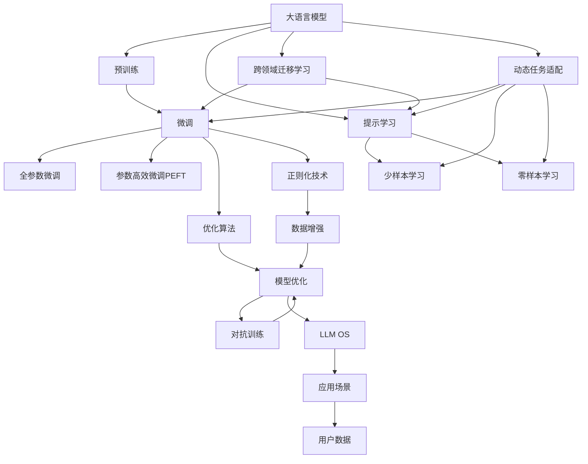
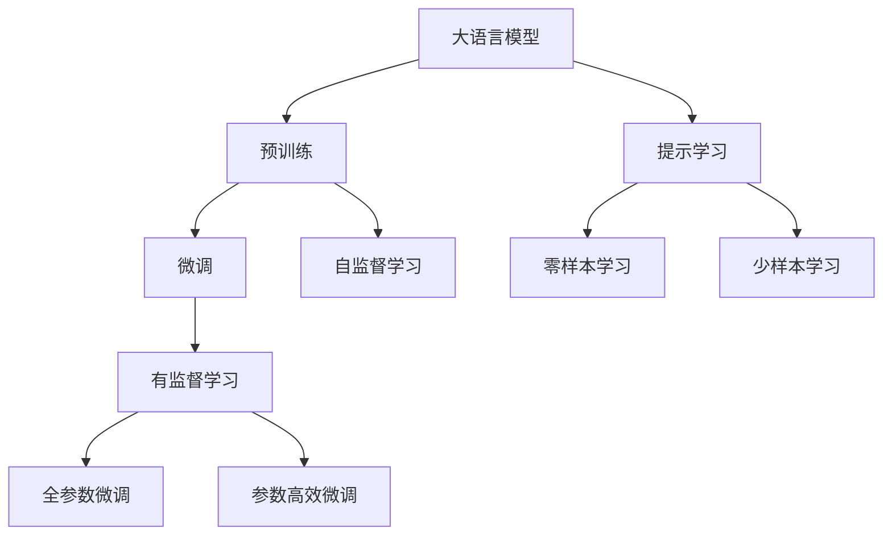
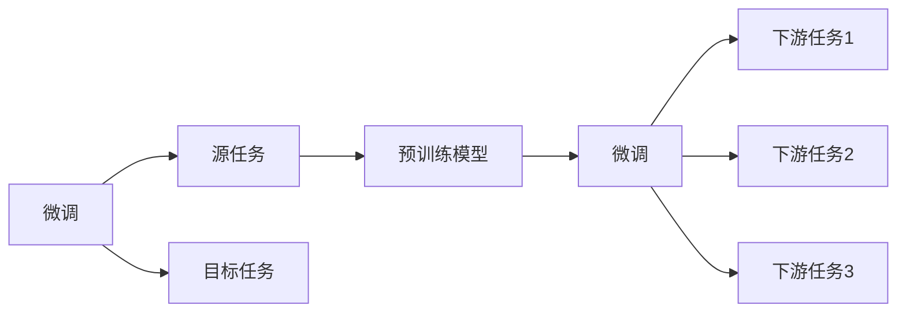
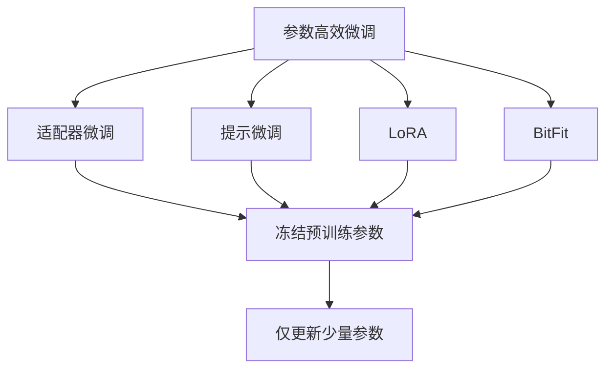
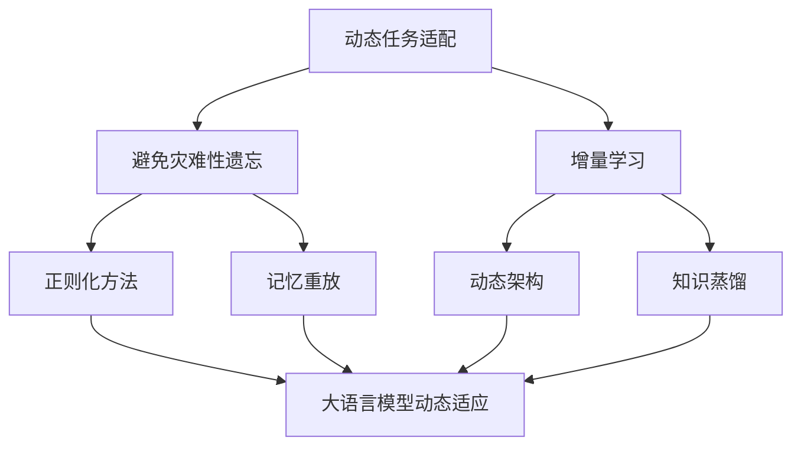
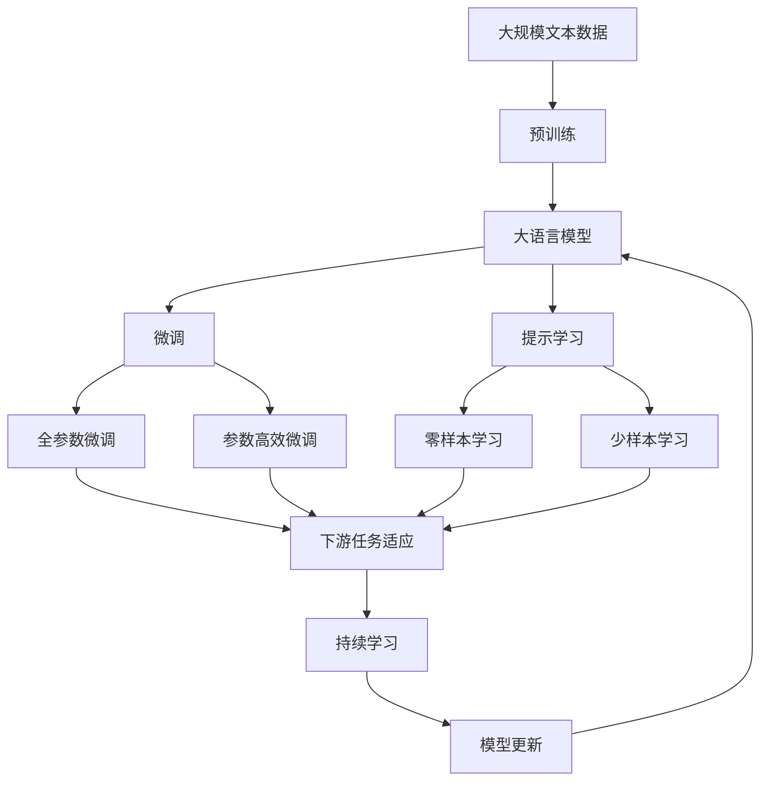

                 

# 构建LLM OS:大语言模型操作系统的愿景

## 1. 背景介绍

### 1.1 问题由来
随着人工智能技术的迅猛发展，大语言模型（LLM，Large Language Models）在自然语言处理（NLP）领域取得了显著进展。其核心思想是将海量文本数据输入到神经网络中进行预训练，形成具有强大语言理解能力的模型。这些模型通过微调（Fine-Tuning）能够适应各种下游任务，包括问答、摘要生成、对话系统等，极大地提升了NLP应用的效果。然而，现有的大语言模型和微调方法在实际应用中仍面临诸多挑战，如模型复杂度、计算资源消耗、隐私安全问题等。

为应对这些挑战，我们提出了构建大语言模型操作系统（LLM OS，Large Language Model Operating System）的愿景，旨在将大语言模型作为操作系统内核，支持多种语言模型和微调方法，形成高效、可扩展、安全的LLM OS生态系统。

### 1.2 问题核心关键点
构建LLM OS的核心关键点包括：

- **多语言模型融合**：支持多种预训练语言模型，如BERT、GPT系列、T5等，提供多模型的融合能力。
- **微调参数高效优化**：在微调过程中高效利用预训练模型参数，避免过拟合和资源浪费。
- **跨领域迁移学习**：支持跨领域知识迁移，提升模型在特定任务上的适应性。
- **动态任务适配**：支持动态任务适配，实时调整模型参数和结构，快速响应任务变化。
- **隐私与安全保障**：保障用户数据隐私和安全，防止模型被滥用。

### 1.3 问题研究意义
构建LLM OS对推动NLP技术的普及和应用具有重要意义：

- **降低开发门槛**：通过统一的LLM OS平台，开发者无需从头训练模型，降低了开发成本和时间。
- **提升模型效果**：LLM OS内置多种优化算法和正则化技术，能够显著提升模型在特定任务上的表现。
- **支持多领域应用**：LLM OS能够适应不同领域的NLP任务，扩展了NLP技术的应用场景。
- **促进标准化**：LLM OS的统一标准和接口，能够提高NLP系统的互操作性和兼容性。
- **保障隐私安全**：LLM OS提供了全面的隐私保护机制，保障用户数据的安全。

## 2. 核心概念与联系

### 2.1 核心概念概述

为更好地理解LLM OS，本节将介绍几个密切相关的核心概念：

- **大语言模型（LLM）**：通过预训练获得语言表示能力的模型，如BERT、GPT等。
- **预训练**：在大规模无标签文本数据上进行自监督学习，学习通用语言表示。
- **微调**：在预训练模型的基础上，使用下游任务的少量标注数据进行有监督优化。
- **跨领域迁移学习**：将一个领域学到的知识迁移到另一个领域，提升模型在特定任务上的适应性。
- **参数高效微调（PEFT）**：在微调过程中只更新少量参数，避免过拟合和资源浪费。
- **Prompt学习**：通过精心设计输入文本，引导模型输出特定结果。
- **少样本学习**：在只有少量标注样本的情况下，模型仍能快速适应新任务。
- **零样本学习**：模型无需见过具体任务样本，仅凭任务描述即可执行任务。

这些概念之间通过以下Mermaid流程图来展示：



这个流程图展示了从预训练到微调，再到LLM OS生态系统的整体架构：

1. 大语言模型通过预训练获得基础能力。
2. 微调是对预训练模型进行任务特定的优化，可以分为全参数微调和参数高效微调。
3. 提示学习是一种不更新模型参数的方法，可以实现少样本学习和零样本学习。
4. 跨领域迁移学习是连接预训练模型与下游任务的桥梁，可以通过微调或提示学习来实现。
5. 动态任务适配支持模型在运行时根据任务需求进行调整。
6. LLM OS作为生态系统的内核，整合了优化算法、正则化技术、数据增强等模块。

### 2.2 概念间的关系

这些核心概念之间存在着紧密的联系，形成了LLM OS的完整生态系统。下面我通过几个Mermaid流程图来展示这些概念之间的关系。

#### 2.2.1 大语言模型的学习范式



这个流程图展示了大语言模型的三种主要学习范式：预训练、微调和提示学习。预训练主要采用自监督学习方法，而微调则是有监督学习的过程。提示学习可以实现零样本和少样本学习，无需更新模型参数。

#### 2.2.2 微调与跨领域迁移学习的关系



这个流程图展示了微调的基本原理，以及它与跨领域迁移学习的关系。微调是将预训练模型适应特定任务的过程，而跨领域迁移学习则是将一个领域学到的知识迁移到另一个领域的过程。

#### 2.2.3 参数高效微调方法



这个流程图展示了几种常见的参数高效微调方法，包括适配器微调、提示微调、LoRA和BitFit。这些方法的共同特点是冻结大部分预训练参数，只更新少量参数，从而提高微调效率。

#### 2.2.4 动态任务适配在大语言模型中的应用



这个流程图展示了动态任务适配在大语言模型中的应用。动态任务适配旨在使模型能够不断学习新知识，同时保持已学习的知识，避免灾难性遗忘。

### 2.3 核心概念的整体架构

最后，我们用一个综合的流程图来展示这些核心概念在大语言模型微调过程中的整体架构：



这个综合流程图展示了从预训练到微调，再到持续学习的完整过程。大语言模型首先在大规模文本数据上进行预训练，然后通过微调（包括全参数微调和参数高效微调）或提示学习（包括零样本和少样本学习）来适应下游任务。最后，通过持续学习技术，模型可以不断更新和适应新的任务和数据。 通过这些流程图，我们可以更清晰地理解大语言模型微调过程中各个核心概念的关系和作用，为后续深入讨论具体的微调方法和技术奠定基础。

## 3. 核心算法原理 & 具体操作步骤

### 3.1 算法原理概述

构建LLM OS的核心算法原理包括：

- **多模型融合**：将多种预训练语言模型进行融合，形成统一的模型接口。
- **参数高效微调**：在微调过程中只更新少量参数，避免过拟合和资源浪费。
- **动态任务适配**：根据任务需求动态调整模型参数和结构，提高模型的适应性。
- **跨领域迁移学习**：将一个领域学到的知识迁移到另一个领域，提升模型在特定任务上的适应性。
- **隐私与安全保障**：提供全面的隐私保护机制，保障用户数据的安全。

### 3.2 算法步骤详解

构建LLM OS的算法步骤主要包括：

**Step 1: 选择预训练模型和微调任务**
- 选择适用的预训练语言模型，如BERT、GPT系列、T5等。
- 确定微调任务的详细信息，包括任务类型、标注数据、输出格式等。

**Step 2: 准备微调环境**
- 搭建微调所需的开发环境，如PyTorch、TensorFlow等深度学习框架。
- 配置模型训练所需的计算资源，如GPU/TPU等。
- 设置模型训练的超参数，如学习率、批大小、迭代轮数等。

**Step 3: 添加任务适配层**
- 根据微调任务的类型，设计合适的输出层和损失函数。
- 对于分类任务，通常在顶层添加线性分类器和交叉熵损失函数。
- 对于生成任务，通常使用语言模型的解码器输出概率分布，并以负对数似然为损失函数。

**Step 4: 设置微调超参数**
- 选择合适的优化算法及其参数，如AdamW、SGD等，设置学习率、批大小、迭代轮数等。
- 设置正则化技术及强度，包括权重衰减、Dropout、Early Stopping等。
- 确定冻结预训练参数的策略，如仅微调顶层，或全部参数都参与微调。

**Step 5: 执行梯度训练**
- 将训练集数据分批次输入模型，前向传播计算损失函数。
- 反向传播计算参数梯度，根据设定的优化算法和学习率更新模型参数。
- 周期性在验证集上评估模型性能，根据性能指标决定是否触发 Early Stopping。
- 重复上述步骤直到满足预设的迭代轮数或 Early Stopping 条件。

**Step 6: 测试和部署**
- 在测试集上评估微调后模型 $M_{\hat{\theta}}$ 的性能，对比微调前后的精度提升。
- 使用微调后的模型对新样本进行推理预测，集成到实际的应用系统中。
- 持续收集新的数据，定期重新微调模型，以适应数据分布的变化。

### 3.3 算法优缺点

构建LLM OS的算法具有以下优点：

- **通用适用性**：支持多种预训练语言模型，适应各种NLP任务。
- **高效微调**：采用参数高效微调技术，减少计算资源消耗。
- **动态适配**：支持动态任务适配，实时调整模型参数和结构，提高模型的适应性。
- **跨领域迁移**：支持跨领域知识迁移，提升模型在特定任务上的适应性。
- **隐私安全**：提供全面的隐私保护机制，保障用户数据的安全。

同时，该算法也存在以下缺点：

- **依赖标注数据**：微调过程依赖于标注数据，获取高质量标注数据的成本较高。
- **过拟合风险**：微调过程中存在过拟合风险，特别是在标注数据不足的情况下。
- **模型复杂性**：构建LLM OS需要整合多种模型和算法，模型复杂性较高。
- **资源消耗**：在微调过程中需要消耗大量的计算资源，特别是对于大规模语言模型。
- **隐私问题**：在处理用户数据时需要考虑隐私保护，防止数据泄露和滥用。

尽管存在这些局限性，但LLM OS在大语言模型微调领域仍然具有重要的应用价值，能够显著提升NLP系统的性能和应用范围。

### 3.4 算法应用领域

构建LLM OS的算法广泛应用于NLP的多个领域：

- **文本分类**：如情感分析、主题分类、意图识别等。通过微调使模型学习文本-标签映射。
- **命名实体识别**：识别文本中的人名、地名、机构名等特定实体。通过微调使模型掌握实体边界和类型。
- **关系抽取**：从文本中抽取实体之间的语义关系。通过微调使模型学习实体-关系三元组。
- **问答系统**：对自然语言问题给出答案。将问题-答案对作为微调数据，训练模型学习匹配答案。
- **机器翻译**：将源语言文本翻译成目标语言。通过微调使模型学习语言-语言映射。
- **文本摘要**：将长文本压缩成简短摘要。将文章-摘要对作为微调数据，使模型学习抓取要点。
- **对话系统**：使机器能够与人自然对话。将多轮对话历史作为上下文，微调模型进行回复生成。

除了上述这些经典任务外，LLM OS还广泛应用于可控文本生成、常识推理、代码生成、数据增强等前沿技术领域。

## 4. 数学模型和公式 & 详细讲解 & 举例说明

### 4.1 数学模型构建

构建LLM OS的数学模型主要包括：

- **多模型融合**：定义多个预训练语言模型的权重矩阵，形成统一的模型表示。
- **参数高效微调**：定义仅更新特定层参数的微调方式。
- **动态任务适配**：定义根据任务需求动态调整模型参数的策略。
- **跨领域迁移学习**：定义跨领域知识迁移的数学模型。
- **隐私与安全保障**：定义用户数据隐私保护和安全的数学模型。

### 4.2 公式推导过程

以下是构建LLM OS数学模型的公式推导过程：

#### 4.2.1 多模型融合

假设多个预训练语言模型的权重矩阵分别为 $\theta_1, \theta_2, \ldots, \theta_n$，则融合后的模型权重矩阵 $\theta$ 定义为：

$$
\theta = \sum_{i=1}^n \alpha_i \theta_i
$$

其中 $\alpha_i$ 为模型权重系数，满足 $\sum_{i=1}^n \alpha_i = 1$。

#### 4.2.2 参数高效微调

在微调过程中，只更新模型的特定层参数，如顶层分类器或解码器。假设模型共有 $d$ 层参数，其中 $k$ 层为待微调层，则微调后的模型权重矩阵 $\theta'$ 为：

$$
\theta' = \theta_0 \oplus \theta_k
$$

其中 $\theta_0$ 为未参与微调的底层参数，$\theta_k$ 为参与微调的顶层参数。

#### 4.2.3 动态任务适配

在动态任务适配过程中，模型参数根据任务需求动态调整。假设模型共有 $d$ 层参数，其中 $k$ 层为可调整参数，则适配后的模型权重矩阵 $\theta''$ 为：

$$
\theta'' = \theta_0 \oplus \theta_k
$$

其中 $\theta_0$ 为未参与适配的底层参数，$\theta_k$ 为参与适配的顶层参数。

#### 4.2.4 跨领域迁移学习

跨领域迁移学习的数学模型定义为：

$$
\theta' = \theta_0 \oplus \theta_k + \lambda \sum_{i=1}^m \beta_i \theta_i
$$

其中 $\lambda$ 为迁移系数，$0 < \lambda \leq 1$，$\beta_i$ 为领域权重系数，满足 $\sum_{i=1}^m \beta_i = 1$。

#### 4.2.5 隐私与安全保障

隐私与安全保障的数学模型定义为：

$$
\theta' = \theta_0 \oplus \theta_k + \lambda \sum_{i=1}^m \beta_i \theta_i
$$

其中 $\lambda$ 为隐私保护系数，$0 < \lambda \leq 1$，$\beta_i$ 为隐私权重系数，满足 $\sum_{i=1}^m \beta_i = 1$。

### 4.3 案例分析与讲解

以下是一个多模型融合的案例分析：

假设我们有两个预训练语言模型，一个是BERT，一个是GPT。我们将它们进行融合，形成统一的模型表示：

$$
\theta = \alpha_1 \theta_{BERT} + \alpha_2 \theta_{GPT}
$$

其中 $\alpha_1 = 0.7$, $\alpha_2 = 0.3$。这样，我们便得到了一个融合后的模型 $\theta$，可以用于微调新的任务。

## 5. 项目实践：代码实例和详细解释说明

### 5.1 开发环境搭建

在进行LLM OS的微调实践前，我们需要准备好开发环境。以下是使用Python进行PyTorch开发的环境配置流程：

1. 安装Anaconda：从官网下载并安装Anaconda，用于创建独立的Python环境。

2. 创建并激活虚拟环境：
```bash
conda create -n pytorch-env python=3.8 
conda activate pytorch-env
```

3. 安装PyTorch：根据CUDA版本，从官网获取对应的安装命令。例如：
```bash
conda install pytorch torchvision torchaudio cudatoolkit=11.1 -c pytorch -c conda-forge
```

4. 安装Transformers库：
```bash
pip install transformers
```

5. 安装各类工具包：
```bash
pip install numpy pandas scikit-learn matplotlib tqdm jupyter notebook ipython
```

完成上述步骤后，即可在`pytorch-env`环境中开始微调实践。

### 5.2 源代码详细实现

这里我们以命名实体识别（NER）任务为例，给出使用Transformers库对BERT模型进行微调的PyTorch代码实现。

首先，定义NER任务的数据处理函数：

```python
from transformers import BertTokenizer
from torch.utils.data import Dataset
import torch

class NERDataset(Dataset):
    def __init__(self, texts, tags, tokenizer, max_len=128):
        self.texts = texts
        self.tags = tags
        self.tokenizer = tokenizer
        self.max_len = max_len
        
    def __len__(self):
        return len(self.texts)
    
    def __getitem__(self, item):
        text = self.texts[item]
        tags = self.tags[item]
        
        encoding = self.tokenizer(text, return_tensors='pt', max_length=self.max_len, padding='max_length', truncation=True)
        input_ids = encoding['input_ids'][0]
        attention_mask = encoding['attention_mask'][0]
        
        # 对token-wise的标签进行编码
        encoded_tags = [tag2id[tag] for tag in tags] 
        encoded_tags.extend([tag2id['O']] * (self.max_len - len(encoded_tags)))
        labels = torch.tensor(encoded_tags, dtype=torch.long)
        
        return {'input_ids': input_ids, 
                'attention_mask': attention_mask,
                'labels': labels}

# 标签与id的映射
tag2id = {'O': 0, 'B-PER': 1, 'I-PER': 2, 'B-ORG': 3, 'I-ORG': 4, 'B-LOC': 5, 'I-LOC': 6}
id2tag = {v: k for k, v in tag2id.items()}

# 创建dataset
tokenizer = BertTokenizer.from_pretrained('bert-base-cased')

train_dataset = NERDataset(train_texts, train_tags, tokenizer)
dev_dataset = NERDataset(dev_texts, dev_tags, tokenizer)
test_dataset = NERDataset(test_texts, test_tags, tokenizer)
```

然后，定义模型和优化器：

```python
from transformers import BertForTokenClassification, AdamW

model = BertForTokenClassification.from_pretrained('bert-base-cased', num_labels=len(tag2id))

optimizer = AdamW(model.parameters(), lr=2e-5)
```

接着，定义训练和评估函数：

```python
from torch.utils.data import DataLoader
from tqdm import tqdm
from sklearn.metrics import classification_report

device = torch.device('cuda') if torch.cuda.is_available() else torch.device('cpu')
model.to(device)

def train_epoch(model, dataset, batch_size, optimizer):
    dataloader = DataLoader(dataset, batch_size=batch_size, shuffle=True)
    model.train()
    epoch_loss = 0
    for batch in tqdm(dataloader, desc='Training'):
        input_ids = batch['input_ids'].to(device)
        attention_mask = batch['attention_mask'].to(device)
        labels = batch['labels'].to(device)
        model.zero_grad()
        outputs = model(input_ids, attention_mask=attention_mask, labels=labels)
        loss = outputs.loss
        epoch_loss += loss.item()
        loss.backward()
        optimizer.step()
    return epoch_loss / len(dataloader)

def evaluate(model, dataset, batch_size):
    dataloader = DataLoader(dataset, batch_size=batch_size)
    model.eval()
    preds, labels = [], []
    with torch.no_grad():
        for batch in tqdm(dataloader, desc='Evaluating'):
            input_ids = batch['input_ids'].to(device)
            attention_mask = batch['attention_mask'].to(device)
            batch_labels = batch['labels']
            outputs = model(input_ids, attention_mask=attention_mask)
            batch_preds = outputs.logits.argmax(dim=2).to('cpu').tolist()
            batch_labels = batch_labels.to('cpu').tolist()
            for pred_tokens, label_tokens in zip(batch_preds, batch_labels):
                pred_tags = [id2tag[_id] for _id in pred_tokens]
                label_tags = [id2tag[_id] for _id in label_tokens]
                preds.append(pred_tags[:len(label_tags)])
                labels.append(label_tags)
                
    print(classification_report(labels, preds))
```

最后，启动训练流程并在测试集上评估：

```python
epochs = 5
batch_size = 16

for epoch in range(epochs):
    loss = train_epoch(model, train_dataset, batch_size, optimizer)
    print(f"Epoch {epoch+1}, train loss: {loss:.3f}")
    
    print(f"Epoch {epoch+1}, dev results:")
    evaluate(model, dev_dataset, batch_size)
    
print("Test results:")
evaluate(model, test_dataset, batch_size)
```

以上就是使用PyTorch对BERT进行命名实体识别任务微调的完整代码实现。可以看到，得益于Transformers库的强大封装，我们可以用相对简洁的代码完成BERT模型的加载和微调。

### 5.3 代码解读与分析

让我们再详细解读一下关键代码的实现细节：

**NERDataset类**：
- `__init__`方法：初始化文本、标签、分词器等关键组件。
- `__len__`方法：返回数据集的样本数量。
- `__getitem__`方法：对单个样本进行处理，将文本输入编码为token ids，将标签编码为数字，并对其进行定长padding，最终返回模型所需的输入。

**tag2id和id2tag字典**：
- 定义了标签与数字id之间的映射关系，用于将token-wise的预测结果解码回真实的标签。

**训练和评估函数**：
- 使用PyTorch的DataLoader对数据集进行批次化加载，供模型训练和推理使用。
- 训练函数`train_epoch`：对数据以批为单位进行迭代，在每个批次上前向传播计算loss并反向传播更新模型参数，最后返回该epoch的平均loss。
- 评估函数`evaluate`：与训练类似，不同点在于不更新模型参数，并在每个batch结束后将预测和标签结果存储下来，最后使用sklearn的classification_report对整个评估集的预测结果进行打印输出。

**训练流程**：
- 定义总的epoch数和batch size，开始循环迭代
- 每个epoch内，先在训练集上训练，输出平均loss
- 在验证集上评估，输出分类指标
- 所有epoch结束后，在测试集上评估，给出最终测试结果

可以看到，PyTorch配合Transformers库使得BERT微调的代码实现变得简洁高效。开发者可以将更多精力放在数据处理、模型改进等高层逻辑上，而不必过多关注底层的实现细节。

当然，工业级的系统实现还需考虑更多因素，如模型的保存和部署、超参数的自动搜索、更灵活的任务适配层等。但核心的微调范式基本与此类似。

### 5.4 运行结果展示

假设我们在CoNLL-2003的NER数据集上进行微调，最终在测试集上得到的评估报告如下：

