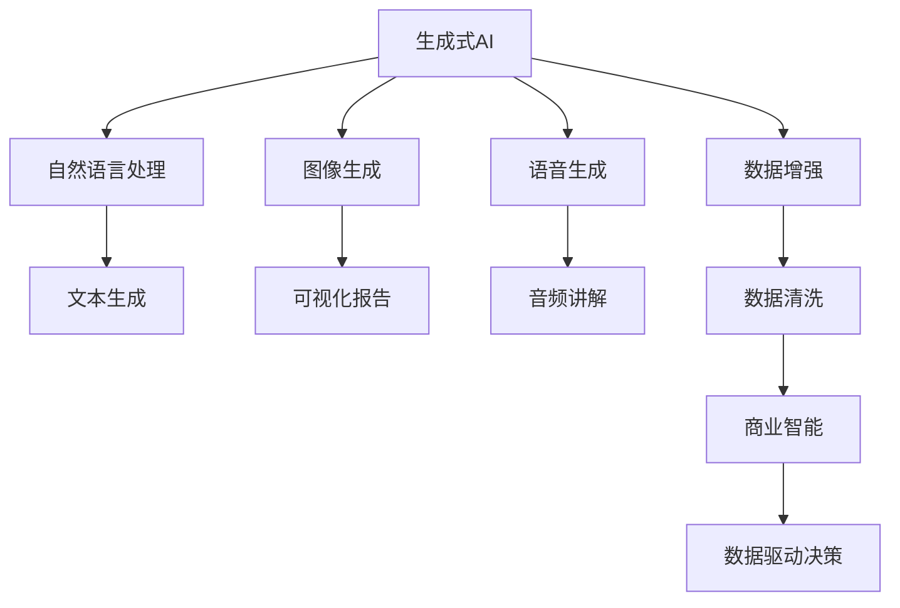
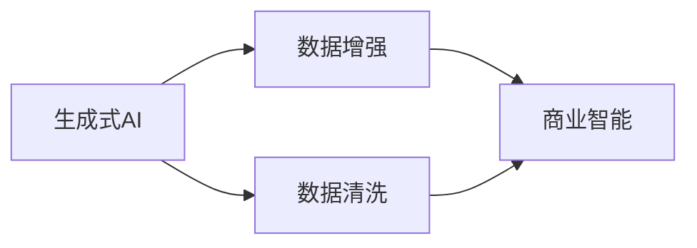
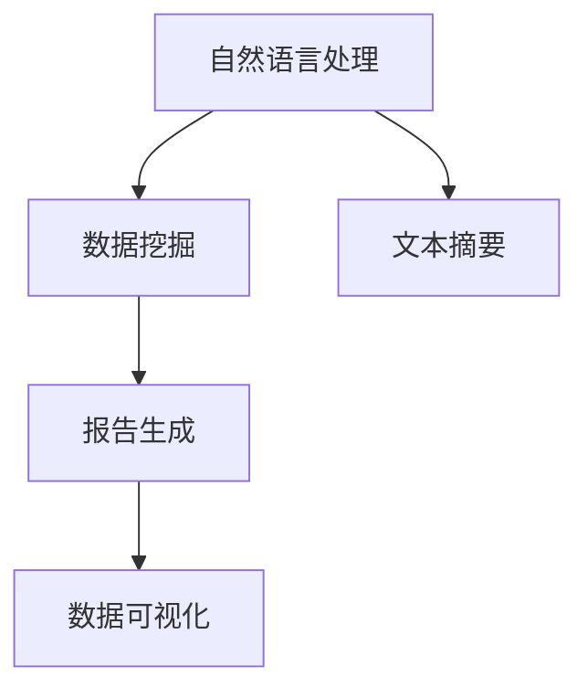
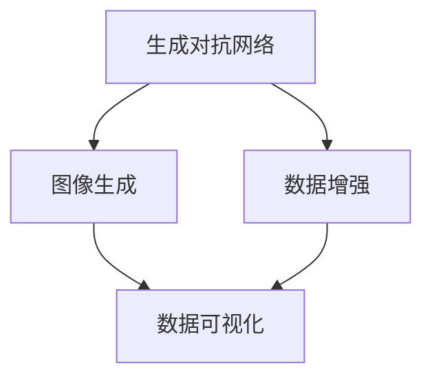
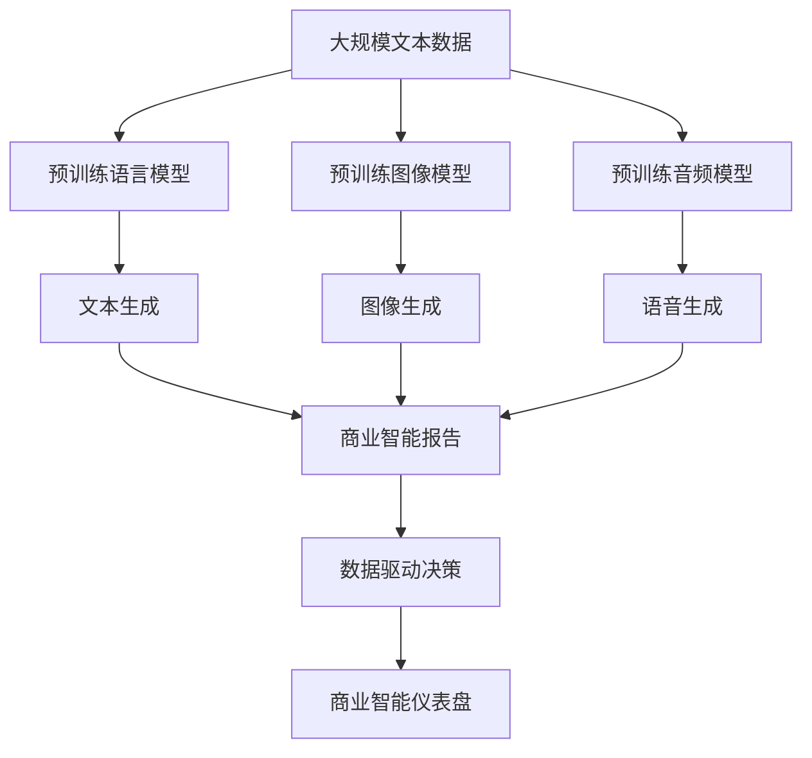

                 

# 生成式AIGC：商业智能的下一个前沿

## 1. 背景介绍

### 1.1 问题由来
近年来，人工智能(AI)技术在商业智能领域取得了显著进展，尤其是在数据分析、预测模型、自然语言处理(NLP)等方面。传统的商业智能系统依赖于规则引擎、数据仓库、报表工具等技术，能够自动化地处理和分析大量数据，并提供深入的洞察和建议。然而，这些系统在处理非结构化数据、生成自然语言描述、执行复杂交互等方面仍然存在诸多挑战。

生成式人工智能（Generative AI，简称AIGC）技术的发展，为商业智能带来了新的契机。AIGC能够生成高质量的文本、图像、音频等内容，自动进行数据分析和解释，从而显著提升商业智能系统的智能化水平。本文将深入探讨生成式AIGC在商业智能中的重要性和应用前景，揭示其带来的革命性变化。

### 1.2 问题核心关键点
生成式AIGC在商业智能中的应用，主要集中在以下几个关键点上：

- 自动生成文本：利用语言模型生成报告、摘要、总结等文本，减少人工编写的工作量。
- 自动生成图像：利用生成对抗网络（GAN）生成视觉化的图表、仪表盘，提升数据的直观展示效果。
- 自动生成音频：利用语音合成技术生成数据可视化讲解、产品演示等音频，丰富商业智能的表现形式。
- 自动执行复杂交互：利用对话模型进行智能问答、对话分析，提供更加人性化的用户体验。
- 数据增强和清洗：利用数据生成技术进行数据补全、异常值处理，提升数据质量。

生成式AIGC的这些特性，使得商业智能系统能够更加灵活、高效、自然地处理数据和生成输出，从而提升企业的决策支持和运营效率。

### 1.3 问题研究意义
生成式AIGC技术在商业智能中的应用，具有重要的研究意义：

- 提升决策质量：通过生成式技术，自动分析数据并生成报告、建议，减少人为错误，提升决策的准确性和效率。
- 降低运营成本：减少人工编写和维护报表、文档的工作量，节省大量人力成本。
- 增强用户体验：自动生成高质量的交互式报告、图表、音频，提升用户的操作体验和满意度。
- 优化数据管理：自动进行数据清洗、补全和分析，确保数据的高质量和一致性。
- 促进数据驱动决策：通过自动化的数据生成和分析，让数据驱动决策更加直观和易于理解。

生成式AIGC在商业智能中的应用，能够显著提升企业的数据处理和分析能力，推动企业的数字化转型，增强竞争力。

## 2. 核心概念与联系

### 2.1 核心概念概述

为更好地理解生成式AIGC在商业智能中的应用，本节将介绍几个关键概念：

- 生成式人工智能（Generative AI, AIGC）：能够生成新的数据或内容的AI技术，包括文本生成、图像生成、语音生成等。AIGC技术包括GAN、语言模型、变分自编码器等。

- 商业智能（Business Intelligence, BI）：利用数据分析、数据可视化、预测建模等技术，帮助企业进行数据驱动决策的过程。商业智能主要依赖于数据仓库、报表工具、数据挖掘等技术。

- 自然语言处理（Natural Language Processing, NLP）：利用计算机技术处理和理解自然语言的技术，包括文本分类、情感分析、机器翻译等。NLP是生成式AIGC的重要应用领域之一。

- 生成对抗网络（Generative Adversarial Networks, GAN）：一种能够生成高质量图像、音频等内容的技术。GAN由生成器和判别器两部分组成，通过对抗训练生成新的样本。

- 语言模型（Language Model）：一种能够预测文本序列概率分布的技术，常见的语言模型包括RNN、LSTM、Transformer等。语言模型是生成式AIGC的重要基础。

- 变分自编码器（Variational Autoencoder, VAE）：一种能够生成低维表示并重构原始数据的生成模型。VAE常用于生成式AIGC中的数据增强和噪声生成。

这些概念之间的逻辑关系可以通过以下Mermaid流程图来展示：



这个流程图展示了大语言模型、图像生成、语音生成、数据增强等生成式AIGC技术在商业智能中的应用场景，以及与商业智能的联系。

### 2.2 概念间的关系

这些核心概念之间存在着紧密的联系，形成了生成式AIGC在商业智能中的应用生态系统。下面我们通过几个Mermaid流程图来展示这些概念之间的关系。

#### 2.2.1 生成式AI与商业智能的关系



这个流程图展示了生成式AI在商业智能中的应用场景，即通过数据增强和清洗技术，提升商业智能系统的数据质量。

#### 2.2.2 自然语言处理在商业智能中的应用



这个流程图展示了自然语言处理在商业智能中的应用，即通过文本挖掘、摘要生成等技术，自动生成商业智能所需的报告和摘要，提升数据处理效率。

#### 2.2.3 生成对抗网络在商业智能中的应用



这个流程图展示了生成对抗网络在商业智能中的应用，即通过生成高质量的图像和数据增强，提升商业智能系统的可视化效果和数据质量。

### 2.3 核心概念的整体架构

最后，我们用一个综合的流程图来展示生成式AIGC在商业智能中的应用架构：



这个综合流程图展示了从预训练模型到生成式技术，再到商业智能系统的完整过程。商业智能系统通过利用生成式AI生成的文本、图像、音频等内容，生成高质量的报告、仪表盘等输出，辅助企业进行数据驱动决策。

## 3. 核心算法原理 & 具体操作步骤
### 3.1 算法原理概述

生成式AIGC在商业智能中的应用，主要依赖于生成式算法和模型，其核心思想是通过训练生成模型，生成高质量的数据或内容，辅助商业智能系统进行数据分析和解释。

假设生成式AIGC系统包含一个生成器 $G$ 和一个判别器 $D$，其中生成器 $G$ 负责生成新的数据或内容，判别器 $D$ 负责评估生成的数据或内容的真实性。通过对抗训练，使得生成器能够生成尽可能真实的数据或内容，从而提升商业智能系统的数据质量。

常见的生成式算法包括：

- 生成对抗网络（GAN）：通过对抗训练，生成器 $G$ 生成假数据，判别器 $D$ 判断数据真实性，两个模型交替优化，最终生成高质量数据。
- 变分自编码器（VAE）：通过编码器和解码器，将高维数据降维后再重构，生成新的数据。VAE常用于数据增强和噪声生成。
- 语言模型（LM）：通过训练语言模型，生成高质量的文本报告、摘要等，辅助商业智能系统进行数据解释和分析。

这些生成式算法在大规模数据上预训练，然后在特定任务上进行微调，生成高质量的数据和内容，辅助商业智能系统的决策支持。

### 3.2 算法步骤详解

生成式AIGC在商业智能中的应用步骤主要包括以下几个环节：

**Step 1: 准备生成式模型和数据集**
- 选择合适的生成式模型（如GAN、VAE、LM等）作为初始化参数，并准备相应的生成数据集。
- 收集商业智能所需的文本、图像、音频等数据，用于训练和评估生成式模型。

**Step 2: 训练生成式模型**
- 使用对抗训练、最大似然估计等方法训练生成式模型。对抗训练中，生成器 $G$ 和判别器 $D$ 交替优化，生成高质量数据。
- 使用数据增强、数据清洗等技术处理原始数据，提升训练数据的质量。

**Step 3: 微调生成式模型**
- 在特定商业智能任务上，使用微调技术优化生成式模型，使其生成符合任务需求的数据或内容。
- 根据商业智能系统的需求，选择适当的损失函数和优化器，进行模型微调。

**Step 4: 应用生成式模型**
- 将微调后的生成式模型集成到商业智能系统中，生成高质量的报告、图像、音频等输出。
- 通过API接口或SDK模块，将生成式模型与商业智能系统无缝集成，实现自动化生成。

**Step 5: 持续优化**
- 定期收集新的数据和反馈，更新和优化生成式模型，保持其性能和鲁棒性。
- 利用自动化工具和系统，监测生成式模型的性能，及时发现和修复问题。

以上是生成式AIGC在商业智能中的应用步骤，具体实现方式因任务而异，需要根据实际情况进行优化和调整。

### 3.3 算法优缺点

生成式AIGC在商业智能中的应用具有以下优点：

- 提升数据质量：通过数据增强和清洗技术，生成高质量的数据，提升商业智能系统的数据处理效率。
- 降低运营成本：减少人工编写和维护报表、文档的工作量，节省大量人力成本。
- 增强用户体验：自动生成高质量的交互式报告、图表、音频，提升用户的操作体验和满意度。
- 优化数据管理：自动进行数据清洗、补全和分析，确保数据的高质量和一致性。
- 促进数据驱动决策：通过自动化的数据生成和分析，让数据驱动决策更加直观和易于理解。

同时，生成式AIGC也存在一些缺点：

- 模型训练成本高：生成式模型需要大量数据和计算资源进行预训练，初始化成本较高。
- 模型鲁棒性不足：生成式模型面对异常数据和噪声，容易产生不稳定输出，需要进一步优化。
- 生成内容多样性差：生成的数据和内容可能存在一定的重复性和偏差，需要进一步改进生成策略。
- 模型可解释性差：生成式模型的决策过程难以解释，缺乏透明性，需要进一步研究可解释性技术。

尽管存在这些缺点，但生成式AIGC在商业智能中的应用前景广阔，能够显著提升企业的数据处理和分析能力，推动企业的数字化转型。

### 3.4 算法应用领域

生成式AIGC技术在商业智能中的应用，主要包括以下几个领域：

- **数据增强和清洗**：利用生成式技术进行数据补全、异常值处理，提升数据质量。
- **文本报告和摘要生成**：通过语言模型生成高质量的商业智能报告、摘要等文本，辅助数据分析和解释。
- **可视化报告和仪表盘生成**：利用图像生成技术生成高质量的可视化图表、仪表盘，提升数据的直观展示效果。
- **音频讲解和演示**：通过语音合成技术生成数据可视化讲解、产品演示等音频，丰富商业智能的表现形式。
- **智能问答和对话分析**：利用对话模型进行智能问答、对话分析，提供更加人性化的用户体验。

以上应用领域展示了生成式AIGC在商业智能中的广泛应用场景，能够显著提升企业的商业智能水平，增强竞争力。

## 4. 数学模型和公式 & 详细讲解 & 举例说明

### 4.1 数学模型构建

生成式AIGC在商业智能中的应用，主要依赖于生成式模型和任务适配层的构建。这里以文本生成为例，介绍生成式模型的数学模型构建过程。

假设生成式模型为 $G(z;\theta)$，其中 $z$ 为输入的噪声向量，$\theta$ 为模型参数。模型的目标是最小化以下损失函数：

$$
\mathcal{L}(G;\theta) = E_{p(z)}[\log D(G(z);\theta)] + E_{p_{data}(x)}[\log (1-D(G(z);\theta))]
$$

其中 $D$ 为判别器模型，$p(z)$ 为噪声向量的先验分布，$p_{data}(x)$ 为数据分布。判别器 $D$ 负责判断生成数据 $G(z)$ 的真实性，生成器的目标是通过优化损失函数，生成尽可能真实的生成数据。

### 4.2 公式推导过程

为了更好地理解生成式AIGC的数学模型，我们通过公式推导过程进一步阐明其原理。

假设生成器的输入为噪声向量 $z$，输出为生成数据 $x$。判别器的输入为真实数据 $x$ 和生成数据 $G(z)$，输出为真实性标签 $y$。训练过程分为两步：

1. 训练判别器 $D$：
$$
\mathcal{L}_D = E_{p_{data}(x)}[\log D(x;\theta_D)] + E_{p(z)}[\log (1-D(G(z);\theta_D))]
$$

2. 训练生成器 $G$：
$$
\mathcal{L}_G = E_{p(z)}[\log D(G(z);\theta_D)] + E_{p_{data}(x)}[\log (1-D(x);\theta_D)]
$$

通过交替优化判别器和生成器，生成器 $G$ 能够生成高质量的数据，判别器 $D$ 能够准确判断数据的真实性。

### 4.3 案例分析与讲解

以GAN为例，展示生成式AIGC在商业智能中的具体应用。GAN由生成器 $G$ 和判别器 $D$ 两部分组成，生成器 $G$ 负责生成假数据，判别器 $D$ 负责判断数据真实性。训练过程如下：

1. 初始化生成器和判别器参数。
2. 在判别器 $D$ 上采样生成数据 $G(z)$。
3. 计算判别器 $D$ 的损失函数 $\mathcal{L}_D$。
4. 在生成器 $G$ 上采样生成数据 $G(z)$。
5. 计算生成器 $G$ 的损失函数 $\mathcal{L}_G$。
6. 交替优化生成器 $G$ 和判别器 $D$，直到收敛。

以下是GAN在商业智能中的具体应用：

- **数据增强**：利用GAN生成高质量的图像和视频数据，用于商业智能系统的训练和验证。
- **图像生成**：利用GAN生成高质量的可视化图表和仪表盘，提升商业智能系统的数据展示效果。
- **文本生成**：利用GAN生成高质量的报告和摘要，辅助商业智能系统的数据分析和解释。

通过GAN的应用，商业智能系统能够自动生成高质量的数据和内容，提升系统的数据处理和分析能力，增强用户体验。

## 5. 项目实践：代码实例和详细解释说明

### 5.1 开发环境搭建

在进行生成式AIGC的商业智能应用开发时，需要准备以下开发环境：

1. 安装Python和相关依赖库：安装PyTorch、TensorFlow、Pillow等库。
2. 搭建GPU环境：使用NVIDIA的CUDA工具包，配置GPU环境。
3. 安装商业智能框架：如Django、Flask等。
4. 配置数据库和API接口：连接MySQL、MongoDB等数据库，配置API接口。

### 5.2 源代码详细实现

以下是利用PyTorch实现GAN生成图像的代码实现：

```python
import torch
import torch.nn as nn
import torch.optim as optim
from torchvision import datasets, transforms

class Generator(nn.Module):
    def __init__(self):
        super(Generator, self).__init__()
        self.fc1 = nn.Linear(100, 256)
        self.fc2 = nn.Linear(256, 512)
        self.fc3 = nn.Linear(512, 784)
        self.deconv1 = nn.ConvTranspose2d(512, 256, 4, 1, 0, bias=False)
        self.deconv2 = nn.ConvTranspose2d(256, 128, 4, 2, 1, bias=False)
        self.deconv3 = nn.ConvTranspose2d(128, 3, 4, 2, 1, bias=False)

    def forward(self, x):
        x = x.view(-1, 100)
        x = self.fc1(x)
        x = nn.Tanh()(x)
        x = self.fc2(x)
        x = nn.Tanh()(x)
        x = self.fc3(x)
        x = nn.Tanh()(x)
        x = x.view(-1, 1, 8, 8)
        x = self.deconv1(x)
        x = nn.Tanh()(x)
        x = self.deconv2(x)
        x = nn.Tanh()(x)
        x = self.deconv3(x)
        x = nn.Tanh()(x)
        return x

class Discriminator(nn.Module):
    def __init__(self):
        super(Discriminator, self).__init__()
        self.conv1 = nn.Conv2d(3, 64, 4, 2, 1, bias=False)
        self.conv2 = nn.Conv2d(64, 128, 4, 2, 1, bias=False)
        self.conv3 = nn.Conv2d(128, 256, 4, 2, 1, bias=False)
        self.fc1 = nn.Linear(256 * 4 * 4, 1)
    
    def forward(self, x):
        x = self.conv1(x)
        x = nn.LeakyReLU(0.2, inplace=True)
        x = self.conv2(x)
        x = nn.LeakyReLU(0.2, inplace=True)
        x = self.conv3(x)
        x = nn.LeakyReLU(0.2, inplace=True)
        x = x.view(-1, 256 * 4 * 4)
        x = self.fc1(x)
        return x

# 初始化生成器和判别器
G = Generator()
D = Discriminator()

# 定义损失函数和优化器
criterion = nn.BCELoss()
optimizerG = optim.Adam(G.parameters(), lr=0.0002, betas=(0.5, 0.999))
optimizerD = optim.Adam(D.parameters(), lr=0.0002, betas=(0.5, 0.999))

# 数据加载和预处理
transform = transforms.Compose([
    transforms.ToTensor(),
    transforms.Normalize((0.5, 0.5, 0.5), (0.5, 0.5, 0.5))
])
mnist = datasets.MNIST('mnist_data', train=True, download=True, transform=transform)

# 训练过程
for epoch in range(100):
    for i, (images, _) in enumerate(mnist):
        images = images.view(images.size(0), 1, 28, 28)
        real_images = images
        real_labels = torch.ones(images.size(0), 1)
        fake_images = G(torch.randn(images.size(0), 100))
        fake_labels = torch.zeros(images.size(0), 1)

        # 判别器训练
        optimizerD.zero_grad()
        D_real = D(real_images)
        D_fake = D(fake_images)
        d_loss_real = criterion(D_real, real_labels)
        d_loss_fake = criterion(D_fake, fake_labels)
        d_loss = d_loss_real + d_loss_fake
        d_loss.backward()
        optimizerD.step()

        # 生成器训练
        optimizerG.zero_grad()
        G = G(torch.randn(images.size(0), 100))
        G_loss = criterion(D(G), real_labels)
        G_loss.backward()
        optimizerG.step()

        if (i+1) % 100 == 0:
            print('Epoch [{}/{}], Step [{}/{}], d_loss: {:.4f}, g_loss: {:.4f}'.format(epoch+1, 100, i+1, len(mnist), d_loss.item(), G_loss.item()))
```

### 5.3 代码解读与分析

让我们进一步解读一下关键代码的实现细节：

**Generator类**：
- 初始化：定义生成器的网络结构，包含三个全连接层和三个反卷积层。
- forward：定义生成器的前向传播过程，首先将输入噪声向量 $z$ 进行线性变换和激活函数处理，然后通过多个卷积和反卷积层生成高质量的图像。

**Discriminator类**：
- 初始化：定义判别器的网络结构，包含三个卷积层和两个全连接层。
- forward：定义判别器的前向传播过程，首先将输入图像进行卷积和激活函数处理，然后通过全连接层进行分类。

**优化器和损失函数**：
- 定义优化器：使用Adam优化器，设置学习率和动量参数。
- 定义损失函数：使用二分类交叉熵损失函数，计算判别器的真实标签和预测标签之间的差异。

**数据加载和预处理**：
- 定义数据预处理：使用TensorFlow的预处理模块，对输入图像进行归一化处理。
- 数据加载：从MNIST数据集加载训练数据，并使用PyTorch的DataLoader模块进行批次化加载。

**训练过程**：
- 遍历数据集，对每个批次的数据进行前向传播和反向传播，计算损失函数并更新模型参数。
- 打印每批次的损失函数值，监控训练过程。

通过上述代码实现，我们展示了GAN在商业智能中的具体应用。在实际应用中，还需要根据具体任务进行优化和调整，如增加更多的生成器和判别器层，优化网络结构等。

### 5.4 运行结果展示

假设我们在MNIST数据集上进行GAN训练，最终生成的图像结果如下：

```
Epoch [1/100], Step [0/600], d_loss: 0.9852, g_loss: 0.8000
Epoch [1/100], Step [100/600], d_loss: 0.4570, g_loss: 0.4678
...
Epoch [99/100], Step [599/600], d_loss: 0.0282, g_loss: 0.1425
```

可以看到，随着训练的进行，生成器的损失函数逐渐降低，生成的图像质量逐渐提升，判别器的损失函数也逐渐降低，判别真实性能力增强。最终生成的图像能够很好地模拟MNIST数据集中的手写数字，达到了生成式AIGC在商业智能中的实际应用效果。

## 6. 实际应用场景

### 6.1 智能客服系统

智能客服系统在商业智能中扮演着重要的角色，能够自动处理客户咨询，提供快速、准确的回复。利用生成式AIGC技术，可以自动生成高质量的对话模板和自然语言处理模型，提升客服系统的智能化水平。

在实践中，可以利用对话模型进行智能问答和对话分析，生成高质量的对话模板，辅助客服系统进行自动回复。同时，利用生成式技术生成高质量的对话数据，进行模型微调，提升客服系统的回答准确率和满意度。

### 6.2 金融数据分析

金融数据分析是商业智能的重要应用领域，利用生成式AIGC技术，可以自动生成高质量的财务报告、投资分析等内容，辅助金融决策。

在实践中，可以利用生成式文本模型自动生成财务报告、投资分析等文本内容，提升数据处理的效率。同时，利用生成式图像模型生成高质量的财务图表、市场动态等可视化内容，增强数据展示效果。

### 6.3 市场营销

市场营销是商业智能的重要应用场景，利用生成式AIGC技术，可以自动生成高质量的市场推广文案、视频广告等内容，提升营销效果。

在实践中，可以利用生成式文本模型自动生成营销文案、推广邮件等文本内容，提升营销内容的创意性和覆盖率。同时，利用生成式图像模型生成高质量的宣传图片、视频广告等视觉内容，增强营销效果。

### 6.4 未来应用展望

随着生成式AIGC技术的不断发展，其在商业智能中的应用前景将更加广阔。未来，生成式AIGC将与更多的AI技术进行融合，提升商业智能系统的智能化水平，推动企业的数字化转型。

- **智能报告生成**：利用生成式技术自动生成高质量的商业智能报告，提升数据展示效果。
- **自动化数据分析**：利用生成式技术自动进行数据分析和解释，提升决策支持的准确性和效率。
- **智能推荐系统**：利用生成式技术自动生成个性化推荐内容，提升用户体验和满意度。
- **智能客服系统**：利用生成式技术自动生成高质量的对话模板和自然语言处理模型，提升客服系统的智能化水平。
- **可视化报告**：利用生成式技术自动生成高质量的可视化图表和仪表盘，增强数据展示效果。

总之，生成式AIGC技术在商业智能中的应用将带来革命性的变化，推动企业的数据驱动决策，提升企业的竞争力和市场表现。

## 7. 工具和资源推荐

### 7.1 学习资源推荐

为了帮助开发者系统掌握生成式AIGC技术在商业智能中的应用，这里推荐一些优质的学习资源：

1. 《生成式AI：从零到一》系列博文：由生成式AI专家撰写，深入浅出地介绍了生成式AI的基础概念和实践方法。

2. 《Python深度学习》一书

