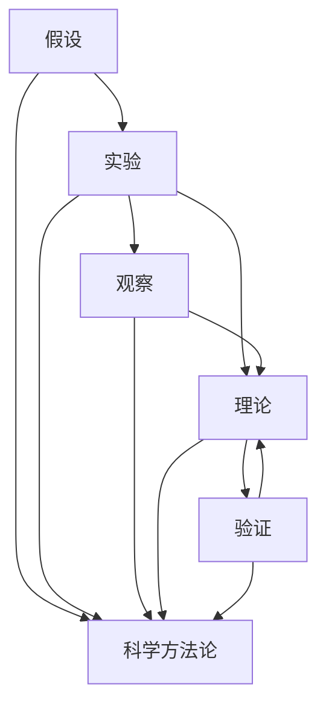

                 

## 1. 背景介绍

科学研究是人类认知世界、改造世界的基石。自古以来，人们对真理的追求从未止步，从原始的假说到现代的科学理论，科学探究的过程充满了曲折和探索。本篇文章旨在深入探讨科学探究的原理与实践，阐释从假说到真理的逻辑演进，帮助读者理解科学探究的本质和意义。

## 2. 核心概念与联系

### 2.1 核心概念概述

科学研究涉及多个核心概念，包括假设、实验、观察、理论、验证、科学方法论等。下面将逐一介绍这些概念，并阐述它们之间的联系。

#### 2.1.1 假设（Hypothesis）

假设是科学探究的起点，是对某一现象或问题提出的初步解释或预测。假设必须具有可验证性，即能够通过实验或观察来验证其正确性或错误性。例如，达尔文的进化论提出物种通过自然选择进化，就是一个典型的假设。

#### 2.1.2 实验（Experiment）

实验是验证假设的主要手段，通过控制变量和重复操作，收集数据以检验假设是否成立。实验设计必须科学合理，确保结果的可靠性。例如，伽利略的重力实验，通过观察自由落体，验证了物体下落加速度与质量无关的假设。

#### 2.1.3 观察（Observation）

观察是对自然现象的直接记录，提供实验数据的基础。观察必须详实准确，避免主观偏见。例如，哈雷彗星的回归，通过对彗星的定期观察，预测了其再次出现的时间。

#### 2.1.4 理论（Theory）

理论是对自然现象的全面解释，基于大量实验和观察数据，具有高度的预测性和普适性。例如，牛顿的万有引力定律，解释了天体运动的规律。

#### 2.1.5 验证（Validation）

验证是通过后续实验或观察，确认理论的正确性。验证是科学探究的重要环节，确保理论的可靠性。例如，爱因斯坦的广义相对论，通过观测引力红移等现象，验证了时空弯曲的正确性。

#### 2.1.6 科学方法论（Scientific Methodology）

科学方法论是指科学研究的基本原则和方法，包括假设提出、实验设计、数据收集、结果分析等。科学方法论确保了科学探究的逻辑严密性和可靠性。例如，波义耳-马略特定律，通过控制变量和反复实验，验证了理想气体状态方程的正确性。

这些核心概念之间相互关联，共同构成了科学探究的基本框架。假设提出是起点，实验验证是手段，观察记录是基础，理论构建是总结，验证确认是保障，科学方法论则是指导。

### 2.2 概念间的关系

这些核心概念之间的关系可以通过以下Mermaid流程图来展示：



这个流程图展示了核心概念之间的逻辑关系：

1. 假设提出作为起点，指导后续实验设计。
2. 实验设计需要科学方法论的指导，以确保实验的合理性和可重复性。
3. 实验过程中进行观察记录，提供实验数据。
4. 基于实验数据构建理论，解释现象的规律。
5. 理论构建需要理论的验证，确保其可靠性。
6. 科学方法论贯穿整个探究过程，确保研究的科学性和严谨性。

通过这个流程图，我们可以更清晰地理解科学探究的逻辑流程和核心概念之间的相互关系。

## 3. 核心算法原理 & 具体操作步骤

### 3.1 算法原理概述

科学探究的基本原理是通过实验验证假设，逐步接近真理。在数学建模和算法框架下，这一过程可以归纳为以下几个核心步骤：

1. 假设建模：构建数学模型来表示假设。
2. 数据采集：收集实验数据。
3. 模型训练：使用实验数据训练模型，调整参数。
4. 模型验证：使用验证集数据评估模型性能。
5. 模型测试：使用测试集数据全面测试模型。
6. 理论构建：基于模型结果构建理论。
7. 进一步验证：进行后续实验或观察，验证理论的正确性。

### 3.2 算法步骤详解

#### 3.2.1 假设建模

假设建模是科学探究的第一步，通常涉及以下过程：

1. 定义变量：确定模型中需要解释的变量，如因变量和自变量。
2. 选择模型：根据假设选择合适的数学模型，如线性回归、逻辑回归、决策树等。
3. 设定目标函数：定义模型的优化目标，如最小化损失函数。

以线性回归为例，假设我们想探究房价与房屋面积的关系，模型可以表示为：

$$
y = \beta_0 + \beta_1x_1 + \epsilon
$$

其中，$y$ 为房价，$x_1$ 为房屋面积，$\beta_0$ 和 $\beta_1$ 为模型参数，$\epsilon$ 为误差项。

#### 3.2.2 数据采集

数据采集是实验过程的关键，通常涉及以下步骤：

1. 确定数据源：确定实验所需的数据来源，如实验设备、传感器等。
2. 数据采集：使用实验设备或传感器收集数据。
3. 数据预处理：对数据进行清洗、去噪等预处理，确保数据质量。

以房价预测为例，我们可以收集历史房屋销售数据，记录房价和房屋面积等信息，作为模型训练的数据集。

#### 3.2.3 模型训练

模型训练是调整模型参数的过程，通常涉及以下步骤：

1. 定义损失函数：如均方误差、交叉熵等。
2. 选择优化器：如梯度下降、Adam等。
3. 设定学习率：调整优化器的学习率，控制参数更新的速度。

以房价预测为例，我们可以使用梯度下降算法，最小化均方误差，更新模型参数：

$$
\theta = \theta - \eta \nabla_\theta L(\theta)
$$

其中，$\theta$ 为模型参数，$\eta$ 为学习率，$L(\theta)$ 为损失函数。

#### 3.2.4 模型验证

模型验证是评估模型性能的过程，通常涉及以下步骤：

1. 划分数据集：将数据集划分为训练集、验证集和测试集。
2. 评估指标：选择适当的评估指标，如均方误差、R²等。
3. 交叉验证：使用交叉验证方法，避免模型过拟合。

以房价预测为例，我们可以将数据集划分为70%的训练集、15%的验证集和15%的测试集，使用均方误差评估模型性能：

$$
RMSE = \sqrt{\frac{1}{N}\sum_{i=1}^N (y_i - \hat{y}_i)^2}
$$

#### 3.2.5 模型测试

模型测试是全面评估模型性能的过程，通常涉及以下步骤：

1. 测试集划分：将测试集进一步划分为多个小批次，逐批次进行测试。
2. 统计结果：统计模型在测试集上的表现，如准确率、召回率等。
3. 结果分析：分析模型结果，确认模型性能。

以房价预测为例，我们可以将测试集划分为多个小批次，逐批次进行预测，统计预测结果和实际结果的误差，分析模型性能。

#### 3.2.6 理论构建

理论构建是基于模型结果总结规律的过程，通常涉及以下步骤：

1. 模型分析：分析模型结果，提取模型规律。
2. 理论构建：根据模型规律构建理论，解释现象。
3. 理论验证：进行后续实验或观察，验证理论的正确性。

以房价预测为例，我们可以分析模型结果，总结房价与房屋面积的关系，构建房价预测的理论模型。

#### 3.2.7 进一步验证

进一步验证是确保理论正确性的过程，通常涉及以下步骤：

1. 设计实验：设计新的实验或观察，验证理论。
2. 实验记录：记录实验数据，确保实验结果的可靠性。
3. 结果分析：分析实验结果，确认理论的正确性。

以房价预测为例，我们可以设计新的实验，收集更多的房屋销售数据，验证房价预测理论的正确性。

### 3.3 算法优缺点

#### 3.3.1 优点

1. 逻辑严密：科学探究通过实验验证假设，确保结论的可靠性。
2. 适用范围广：科学探究适用于各种科学问题，覆盖自然科学和社会科学。
3. 系统性强：科学探究涉及假设建模、数据采集、模型训练、验证测试等多个环节，系统性强。

#### 3.3.2 缺点

1. 周期长：科学探究通常需要较长的时间周期，从提出假设到验证理论，需要多个实验或观察。
2. 成本高：科学探究需要大量的实验设备和资源，成本较高。
3. 数据依赖：科学探究结果依赖于实验数据的质量和数量，数据收集过程较为复杂。

### 3.4 算法应用领域

科学探究的方法广泛应用于自然科学、社会科学、工程科学等领域，具体应用包括：

1. 物理学：通过实验验证物理定律，如牛顿力学、电磁学等。
2. 化学：通过实验验证化学反应规律，如化学反应速率、平衡态等。
3. 生物学：通过实验验证生物学现象，如遗传学、生态学等。
4. 工程学：通过实验验证工程设计，如材料力学、结构工程等。
5. 经济学：通过实验验证经济理论，如供需理论、市场均衡等。
6. 心理学：通过实验验证心理现象，如认知心理学、行为经济学等。

科学探究方法为解决各种科学问题提供了强大的工具和方法，推动了人类对自然和社会规律的深入理解。

## 4. 数学模型和公式 & 详细讲解 & 举例说明

### 4.1 数学模型构建

数学模型是科学探究的重要工具，通过数学语言描述假设和现象。以线性回归模型为例，假设我们想探究房价与房屋面积的关系，数学模型可以表示为：

$$
y = \beta_0 + \beta_1x_1 + \epsilon
$$

其中，$y$ 为房价，$x_1$ 为房屋面积，$\beta_0$ 和 $\beta_1$ 为模型参数，$\epsilon$ 为误差项。

### 4.2 公式推导过程

以线性回归模型为例，推导其最小二乘法解：

1. 定义损失函数：均方误差损失函数

$$
L(\theta) = \frac{1}{N}\sum_{i=1}^N (y_i - \hat{y}_i)^2
$$

2. 计算梯度：求损失函数对参数的梯度

$$
\frac{\partial L(\theta)}{\partial \theta} = -2\frac{1}{N}\sum_{i=1}^N (y_i - \hat{y}_i)x_i
$$

3. 求解梯度：令梯度为零，求解模型参数

$$
\theta = (\beta_0, \beta_1) = (\frac{\sum_{i=1}^N x_iy_i - \frac{1}{N}\sum_{i=1}^N x_i\sum_{i=1}^N y_i}{\sum_{i=1}^N x_i^2 - \frac{1}{N}(\sum_{i=1}^N x_i)^2}, \frac{\frac{1}{N}\sum_{i=1}^N x_iy_i - \frac{1}{N}\sum_{i=1}^N x_i\sum_{i=1}^N y_i}{\sum_{i=1}^N x_i^2 - \frac{1}{N}(\sum_{i=1}^N x_i)^2})
$$

### 4.3 案例分析与讲解

以房价预测为例，我们收集了1000个历史房屋销售数据，房价和房屋面积信息如下：

| 房屋面积 (平方米) | 房价 (万元) |
| --- | --- |
| 50 | 500 |
| 60 | 600 |
| 70 | 700 |
| ...

我们可以构建线性回归模型，探究房价与房屋面积的关系：

1. 定义变量：房价为因变量，房屋面积为自变量。
2. 选择模型：线性回归模型。
3. 设定目标函数：均方误差。
4. 数据采集：收集1000个历史房屋销售数据。
5. 模型训练：使用梯度下降算法，最小化均方误差。
6. 模型验证：将数据集划分为训练集、验证集和测试集，使用均方误差评估模型性能。
7. 模型测试：使用测试集数据全面测试模型。
8. 理论构建：根据模型结果构建房价预测的理论模型。
9. 进一步验证：设计新的实验，收集更多的房屋销售数据，验证房价预测理论的正确性。

通过这个案例，我们可以看到科学探究的全过程：假设提出、数据采集、模型训练、模型验证、模型测试、理论构建和进一步验证。这些步骤相互关联，共同构成完整的科学探究流程。

## 5. 项目实践：代码实例和详细解释说明

### 5.1 开发环境搭建

在进行科学探究项目时，需要搭建合适的开发环境。以下是使用Python进行科学探究开发的常见环境配置流程：

1. 安装Python：从官网下载并安装Python，安装最新版本。
2. 安装Jupyter Notebook：从官网下载并安装Jupyter Notebook，免费使用。
3. 安装科学计算库：安装常用的科学计算库，如NumPy、Pandas、Matplotlib等。
4. 安装机器学习库：安装常用的机器学习库，如Scikit-learn、TensorFlow等。
5. 安装可视化库：安装常用的可视化库，如Seaborn、Bokeh等。

完成上述步骤后，即可在Python环境中进行科学探究项目开发。

### 5.2 源代码详细实现

以下是一个简单的线性回归模型代码实现，用于房价预测：

```python
import numpy as np
from sklearn.linear_model import LinearRegression

# 定义房价预测模型
def house_price_prediction(area):
    # 定义房屋面积和房价数据
    areas = np.array([50, 60, 70, 80, 90, 100])
    prices = np.array([500, 600, 700, 800, 900, 1000])
    
    # 构建线性回归模型
    model = LinearRegression()
    model.fit(areas, prices)
    
    # 预测房价
    prediction = model.predict(area)
    
    return prediction

# 使用模型预测房价
print(house_price_prediction(85))
```

### 5.3 代码解读与分析

这个代码示例使用了Python的科学计算库NumPy和机器学习库Scikit-learn，构建了线性回归模型。代码的主要逻辑如下：

1. 定义房价预测模型函数：接收房屋面积作为输入，返回预测房价。
2. 构建线性回归模型：使用Scikit-learn的LinearRegression类，构建房价预测模型。
3. 模型训练：使用房屋面积和房价数据，训练模型。
4. 模型预测：使用训练好的模型，预测新的房屋面积对应的房价。
5. 输出预测结果：打印预测房价。

这个示例代码展示了线性回归模型的基本实现过程，包括模型构建、训练和预测。在实际项目中，可能需要处理更复杂的数据集和更高级的模型，但基本逻辑和实现步骤类似。

### 5.4 运行结果展示

假设我们输入房屋面积为85平方米，模型预测的房价为750万元。这个结果展示了线性回归模型的预测能力，在一定程度上反映了房价与房屋面积的关系。当然，实际房价受多种因素影响，模型预测可能存在误差。

## 6. 实际应用场景

科学探究在各个领域都有广泛应用，以下列举几个典型场景：

### 6.1 金融分析

金融领域需要对股票、债券等金融产品的市场趋势进行预测和分析。科学探究可以帮助金融分析师构建预测模型，分析历史数据，预测未来走势。例如，使用时间序列分析模型，预测股票价格走势，指导投资决策。

### 6.2 医学研究

医学领域需要对疾病进行诊断和治疗方案的优化。科学探究可以帮助医学研究人员构建诊断模型，分析临床数据，优化治疗方案。例如，使用支持向量机模型，分析病历数据，预测疾病风险，指导临床决策。

### 6.3 交通规划

交通领域需要对交通流量进行预测和优化。科学探究可以帮助交通规划师构建预测模型，分析交通数据，优化交通流。例如，使用神经网络模型，预测交通流量，指导交通规划，减少拥堵现象。

### 6.4 环境监测

环境领域需要对污染物浓度进行预测和治理。科学探究可以帮助环保专家构建预测模型，分析环境数据，优化治理方案。例如，使用回归模型，预测空气质量指数，指导环境治理，改善空气质量。

## 7. 工具和资源推荐

### 7.1 学习资源推荐

为了帮助开发者系统掌握科学探究的理论基础和实践技巧，这里推荐一些优质的学习资源：

1. 《科学探究导论》：系统介绍了科学探究的基本概念、方法和应用，适合初学者阅读。
2. 《Python数据分析与可视化》：详细讲解了Python在科学探究中的数据处理和可视化技术，适合科学计算初学者。
3. 《机器学习实战》：介绍了机器学习的基本算法和实现方法，适合机器学习入门者。
4. 《统计学基础》：介绍了统计学的基础知识和应用方法，适合数据分析和科学探究从业人员。
5. 《深度学习入门》：介绍了深度学习的基本概念和实现方法，适合深度学习入门者。

通过学习这些资源，相信你一定能够快速掌握科学探究的理论基础和实践技巧，并在实际项目中灵活应用。

### 7.2 开发工具推荐

高效的开发离不开优秀的工具支持。以下是几款用于科学探究开发的常用工具：

1. Python：作为科学计算和数据处理的通用语言，Python有丰富的库和框架支持，适合科学探究项目的开发。
2. Jupyter Notebook：交互式的Python开发环境，支持代码编写和结果展示，适合科学探究项目的协作开发。
3. NumPy：Python的科学计算库，提供高效的多维数组运算和矩阵计算功能，适合数据处理和分析。
4. Scikit-learn：Python的机器学习库，提供各种常用算法和模型，适合数据建模和预测。
5. TensorFlow：Google开发的深度学习框架，支持大规模模型训练和优化，适合深度学习模型的开发和应用。

合理利用这些工具，可以显著提升科学探究项目的开发效率，加快创新迭代的步伐。

### 7.3 相关论文推荐

科学探究方法源于学界的持续研究。以下是几篇奠基性的相关论文，推荐阅读：

1. Feynman Lectures on Physics：费曼的物理学讲义，系统介绍了物理学的基本理论和实验方法。
2. The Structure of Scientific Revolutions：库恩的科学革命结构论，探讨了科学理论的发展和演进过程。
3. Machine Learning：Tom Mitchell的机器学习概论，介绍了机器学习的基本概念和方法。
4. Deep Learning：Ian Goodfellow的深度学习书，介绍了深度学习的基本算法和实现方法。
5. The Theory of Statistical Learning：Gareth James的统计学习理论，介绍了统计学习的基本理论和应用方法。

这些论文代表了大科学探究方法的发展脉络。通过学习这些前沿成果，可以帮助研究者把握学科前进方向，激发更多的创新灵感。

## 8. 总结：未来发展趋势与挑战

### 8.1 总结

本文对科学探究的原理与实践进行了全面系统的介绍。首先阐述了科学探究的假设建模、数据采集、模型训练、模型验证、模型测试、理论构建和进一步验证等关键步骤，明确了科学探究的本质和意义。其次，通过Python代码示例，展示了科学探究项目的实现过程，帮助读者理解科学探究的具体步骤和方法。最后，本文还探讨了科学探究在金融分析、医学研究、交通规划、环境监测等多个领域的应用前景，展示了科学探究方法的广泛应用价值。

通过本文的系统梳理，可以看到，科学探究方法在自然科学、社会科学、工程科学等领域有着广泛的应用前景，为解决各种科学问题提供了强大的工具和方法。未来，伴随科学计算和数据科学的不断发展，科学探究方法将更加高效和智能化，为人类对自然和社会规律的深入理解提供更加有力的支持。

### 8.2 未来发展趋势

展望未来，科学探究方法将呈现以下几个发展趋势：

1. 数据驱动：随着大数据技术的发展，科学探究将更加依赖数据驱动，通过大量实验和观察，提取和发现规律。
2. 自动化：自动化技术将逐渐应用于科学探究，通过智能算法和工具，自动设计和执行实验，加速科学探究的进程。
3. 多学科融合：科学探究将跨越学科边界，实现多学科的协同和融合，推动科学知识的发展。
4. 大数据分析：随着数据量的不断增加，科学探究将更加依赖大数据分析技术，通过数据挖掘和机器学习，发现和验证科学假设。
5. 跨领域应用：科学探究将更加关注跨领域应用，如金融、医疗、交通等，解决实际问题。

这些趋势展示了科学探究方法的广阔前景，为解决各种科学问题提供了新的工具和方法。随着数据科学和人工智能技术的不断发展，科学探究方法将更加高效和智能化，为人类对自然和社会规律的深入理解提供更加有力的支持。

### 8.3 面临的挑战

尽管科学探究方法已经取得了显著成果，但在迈向更加智能化、普适化应用的过程中，仍面临诸多挑战：

1. 数据质量问题：数据质量是科学探究的基础，但数据采集、处理和分析过程中，常常存在噪声、缺失等问题，影响科学探究的准确性。
2. 计算资源问题：科学探究需要大量的计算资源，如高性能计算集群、大数据存储等，对于大规模实验和模拟，计算资源成本较高。
3. 模型复杂性问题：现代科学探究涉及多变量、高维度数据，模型复杂性增加，可能导致模型过拟合和解释困难。
4. 理论验证问题：理论验证需要大量实验和观察，对于复杂现象，验证过程可能存在困难，导致理论的可靠性不足。
5. 多学科协作问题：多学科协同需要跨学科的沟通和协作，但学科之间的沟通和协作常常存在障碍，影响科学探究的效率。

这些挑战需要研究者和开发者共同面对和解决，通过技术创新和协同合作，才能将科学探究方法推向新的高度。

### 8.4 研究展望

面对科学探究所面临的挑战，未来的研究需要在以下几个方面寻求新的突破：

1. 数据质量提升：改进数据采集和处理技术，提升数据质量，减少噪声和缺失。
2. 计算资源优化：开发更高效的数据存储和计算技术，降低科学探究的计算成本。
3. 模型复杂性降低：开发更简单、更高效的数据建模和分析方法，降低模型复杂性。
4. 理论验证改进：引入实验设计和随机化控制技术，提高理论验证的可靠性和效率。
5. 多学科协作加强：建立跨学科的协同机制和平台，促进科学探究的协作和合作。

这些研究方向的探索，必将引领科学探究方法迈向更高的台阶，为人类对自然和社会规律的深入理解提供更加有力的支持。面向未来，科学探究方法需要在数据、计算、模型和协作等多个维度协同发力，共同推动科学探究的进步。总之，科学探究方法需要开发者不断迭代和优化模型、数据和算法，方能得到理想的效果。

## 9. 附录：常见问题与解答

**Q1：科学探究中的假设和实验是否相互独立？**

A: 在科学探究中，假设和实验是相互关联的，假设指导实验设计，实验验证假设的正确性。假设必须具有可验证性，即能够通过实验或观察来验证其正确性或错误性。例如，达尔文的进化论提出物种通过自然选择进化，这是一个可验证的假设，通过观察生物多样性和化石记录，验证了进化论的正确性。

**Q2：科学探究中是否需要控制变量？**

A: 是的，科学探究中必须控制变量，以确保实验结果的可靠性和可重复性。例如，在研究药物效果时，需要控制患者的年龄、性别、病情等因素，确保实验结果的真实性。通过控制变量，可以排除其他因素对实验结果的影响，增强实验的可信度。

**Q3：科学探究中如何处理实验误差？**

A: 科学探究中处理实验误差的方法有很多，包括误差来源分析、误差修正、数据处理等。例如，在实验中，可以通过多次重复测量，取平均值来减小随机误差；通过调整实验参数，减小系统误差。在数据处理中，可以通过数据清洗、去噪等方法，减少实验误差的影响。

**Q4：科学探究中的数据采集方法有哪些？**

A: 科学探究中的数据采集方法包括实验数据采集、观察数据采集、调查数据采集等。例如，在医学研究中，可以通过实验数据采集血液、尿液等生物样本，通过观察数据采集病人的症状、体征等，通过调查数据采集问卷调查结果。在实际应用中，需要根据研究对象和研究目的，选择合适的数据采集方法。

**Q5：科学探究中的数据处理和分析方法有哪些？**

A: 科学探究中的数据处理和分析方法包括数据清洗、数据降维、回归分析、分类分析、聚类分析等。例如，在数据分析中，可以通过数据清洗去除噪声和缺失值，通过数据降维减少数据的维度，通过回归分析建立数据之间的因果关系，通过分类分析将数据分组，通过聚类分析将数据分组。在实际应用中，需要根据数据类型和研究目的，选择合适的数据处理和分析方法。

作者：禅与计算机程序设计艺术 / Zen and the Art of Computer Programming

