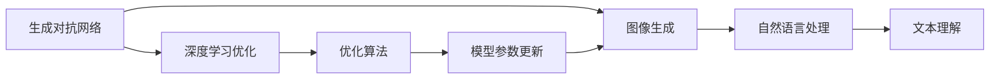
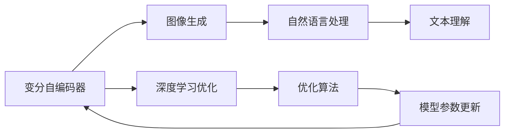
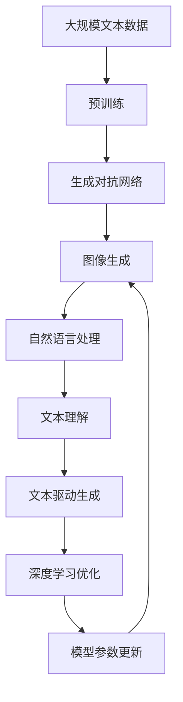

                 

# AIGC从入门到实战：跟着我学习 Midjourney 的使用

> 关键词：AIGC, Midjourney, 图像生成, 自然语言处理, 创作辅助, 智能推荐

## 1. 背景介绍

### 1.1 问题由来

近年来，随着人工智能技术的迅猛发展，生成对抗网络（GAN）和变分自编码器（VAE）等深度学习模型在图像生成领域取得了重大突破。其中，文本到图像的生成模型尤为引人注目，其能够在接收到一段自然语言描述后，自动生成高质量的图像。这些模型不仅在艺术创作、广告设计等创意行业中展现出广泛的应用前景，更是在电影特效、游戏制作、医疗诊断等众多领域中大放异彩。

与此同时，AI技术的不断进步也使得图像生成变得更加智能和高效。例如，Midjourney 这款应用横空出世，将图像生成的可能性推向了一个新的高度。利用深度学习和自然语言处理的结合，Midjourney 能够生成独具特色的图片，同时保留了用户对图片创作的高度掌控。

### 1.2 问题核心关键点

Midjourney 的核心技术涉及以下几个关键点：

1. **文本驱动生成**：用户可以输入描述性的自然语言，Midjourney 能够根据输入生成对应的图像。这种文本到图像的生成能力是 Midjourney 的一大亮点。
2. **基于变分自编码器**：Midjourney 利用变分自编码器（VAE）作为模型基础，能够处理高维数据并生成高质量图像。
3. **深度学习优化**：通过深度学习技术，Midjourney 不断优化模型参数，提升图像生成质量。
4. **文本理解**：Midjourney 通过自然语言处理技术，理解用户的文本描述，并据此生成符合用户需求的图像。
5. **图像渲染**：利用先进的渲染技术，Midjourney 能够在生成的图像上进行后期处理，如添加滤镜、调整色彩等。

这些技术点使得 Midjourney 不仅能够生成高质量的图像，还能根据用户需求进行调整，提供个性化的创作体验。本文将深入探讨 Midjourney 的原理和使用方法，带读者从入门到实战，全面掌握 Midjourney 的强大功能。

### 1.3 问题研究意义

Midjourney 作为一种图像生成工具，其背后的技术原理和实现方法对于理解和应用深度学习技术有着重要意义：

1. **推动技术发展**：深入研究 Midjourney 的原理，有助于推动深度学习技术在图像生成领域的进一步发展。
2. **提供应用范例**：通过实际应用 Midjourney，可以探索其对其他应用场景的适配能力，为AI技术在更多领域的落地提供参考。
3. **优化用户体验**：理解 Midjourney 的实现机制，有助于优化用户界面和交互方式，提升用户体验。
4. **促进创新**：Midjourney 所涉及的技术能够启发其他领域的创新应用，推动AI技术的多样化发展。

## 2. 核心概念与联系

### 2.1 核心概念概述

为了更好地理解 Midjourney 的技术原理，本节将介绍几个关键概念：

1. **生成对抗网络（GAN）**：一种通过生成器和判别器的对抗训练，学习生成样本的深度学习模型。GAN 在图像生成中应用广泛，能够生成具有高度真实感的图像。
2. **变分自编码器（VAE）**：一种利用高斯分布作为潜在变量空间，通过最大化似然函数学习生成数据的变分学习算法。VAE 能够生成连续且平滑的图像，适用于各种生成任务。
3. **自然语言处理（NLP）**：涉及计算机处理、理解和生成自然语言的技术，是 Midjourney 实现文本驱动图像生成的基础。
4. **深度学习优化**：利用梯度下降等优化算法，通过反向传播更新模型参数，提升生成图像的质量。
5. **文本理解**：通过语义分析、情感分析等技术，理解用户输入的自然语言描述。

这些概念通过以下 Mermaid 流程图展示它们之间的联系：



这个流程图展示了从生成对抗网络到图像生成的主要技术路径，其中自然语言处理和文本理解是实现文本驱动图像生成的关键步骤。

### 2.2 概念间的关系

这些核心概念之间的关系可以进一步通过以下 Mermaid 流程图展示：



这个流程图展示了从变分自编码器到图像生成的主要技术路径，其中自然语言处理和文本理解是实现文本驱动图像生成的关键步骤。

### 2.3 核心概念的整体架构

最后，我们用一个综合的流程图来展示这些核心概念在大语言模型微调过程中的整体架构：



这个综合流程图展示了从预训练到图像生成的完整过程，其中自然语言处理和文本理解是实现文本驱动图像生成的关键步骤。

## 3. 核心算法原理 & 具体操作步骤

### 3.1 算法原理概述

Midjourney 利用深度学习技术，通过变分自编码器和生成对抗网络实现图像生成。其核心原理包括以下几个步骤：

1. **数据准备**：收集和整理大量图像数据，作为生成对抗网络的训练数据。
2. **模型训练**：通过对抗训练，优化生成器和判别器的参数，使其能够生成高质量的图像。
3. **文本理解**：利用自然语言处理技术，将用户输入的文本转换为模型能够理解的向量表示。
4. **生成过程**：将文本向量输入生成模型，生成对应的图像。
5. **优化过程**：通过深度学习优化算法，不断调整模型参数，提升生成图像的质量。

### 3.2 算法步骤详解

以下是 Midjourney 的具体操作步骤：

1. **数据准备**：
   - 收集并整理大量图像数据，包括不同场景、不同风格的图片。
   - 对图片进行预处理，如缩放、裁剪、归一化等。
   - 将图像数据划分为训练集、验证集和测试集。

2. **模型训练**：
   - 构建生成对抗网络（GAN），包括生成器和判别器两个部分。
   - 定义损失函数，如对抗损失、均方误差等。
   - 使用优化算法（如 Adam、SGD 等），通过反向传播更新模型参数。
   - 在训练集上进行多轮训练，优化生成器和判别器的性能。

3. **文本理解**：
   - 将用户输入的自然语言文本作为输入。
   - 利用自然语言处理技术，将文本转换为向量表示。
   - 通过词嵌入、卷积神经网络（CNN）等技术，提取文本特征。

4. **生成过程**：
   - 将文本向量输入生成模型，生成对应的图像。
   - 对生成的图像进行后处理，如添加滤镜、调整色彩等。
   - 返回生成的图像作为 Midjourney 的输出。

5. **优化过程**：
   - 收集用户反馈，计算生成图像的质量评分。
   - 根据评分对模型进行微调，优化生成图像的质量。
   - 重复上述过程，不断提升生成图像的质量。

### 3.3 算法优缺点

Midjourney 算法具有以下优点：

1. **高质量生成**：通过深度学习和生成对抗网络，Midjourney 能够生成高质量的图像。
2. **灵活生成**：用户可以输入任意自然语言文本，Midjourney 能够根据文本生成对应的图像。
3. **自动优化**：通过深度学习优化算法，Midjourney 能够自动调整模型参数，提升生成图像的质量。

同时，Midjourney 算法也存在一些缺点：

1. **计算资源需求高**：变分自编码器和生成对抗网络的训练需要大量的计算资源。
2. **参数调整复杂**：优化过程中需要不断调整模型参数，调整不当可能导致生成图像质量下降。
3. **依赖数据质量**：生成图像的质量很大程度上取决于训练数据的质量。

### 3.4 算法应用领域

Midjourney 算法在多个领域有着广泛的应用前景：

1. **艺术创作**：艺术家可以利用 Midjourney 生成创意作品，提升创作效率。
2. **广告设计**：设计师可以利用 Midjourney 生成各种广告图像，提高设计效率。
3. **游戏开发**：游戏开发者可以利用 Midjourney 生成游戏场景和角色，丰富游戏内容。
4. **医学诊断**：医生可以利用 Midjourney 生成医学图像，辅助诊断和治疗。
5. **影视特效**：电影制作人员可以利用 Midjourney 生成特效场景，提升视觉效果。
6. **房地产设计**：建筑师可以利用 Midjourney 生成建筑设计图像，提高设计效果。

## 4. 数学模型和公式 & 详细讲解 & 举例说明

### 4.1 数学模型构建

Midjourney 的数学模型主要涉及以下几个部分：

1. **生成对抗网络（GAN）**：
   - 定义生成器 $G$：$G(z) = \mu + \sigma(z)$
   - 定义判别器 $D$：$D(x) = \frac{1}{2}\log(1 + e^{D_1(x)}) + \frac{1}{2}(1 - e^{D_2(G(z))})$
   - 定义损失函数：$L_{GAN} = E_{z}[\log D(G(z))] + E_{x}[\log(1 - D(x))]$

2. **变分自编码器（VAE）**：
   - 定义编码器 $Q(z|x)$：$Q(z|x) = \mu(x) + \sigma(x)$
   - 定义解码器 $P(x|z)$：$P(x|z) = \mathcal{N}(x|\mu(z), \sigma(z)^2)$
   - 定义损失函数：$L_{VAE} = E_{x}[D_{KL}(Q(z|x), P(z|x))]$

3. **自然语言处理**：
   - 定义词嵌入 $W$：$W_i = [w_{i,1}, w_{i,2}, ..., w_{i,d}]$
   - 定义卷积神经网络（CNN）：$C(x) = [c_{1,1}, c_{1,2}, ..., c_{n,m}]$

### 4.2 公式推导过程

以下是 Midjourney 中的关键公式推导过程：

1. **生成对抗网络（GAN）**：
   - 生成器 $G$：$G(z) = \mu + \sigma(z)$
   - 判别器 $D$：$D(x) = \frac{1}{2}\log(1 + e^{D_1(x)}) + \frac{1}{2}(1 - e^{D_2(G(z))})$
   - 损失函数 $L_{GAN}$：$L_{GAN} = E_{z}[\log D(G(z))] + E_{x}[\log(1 - D(x))]$

   推导过程：
   - 生成器 $G$：$G(z) = \mu + \sigma(z)$
   - 判别器 $D$：$D(x) = \frac{1}{2}\log(1 + e^{D_1(x)}) + \frac{1}{2}(1 - e^{D_2(G(z))})$
   - 损失函数 $L_{GAN}$：$L_{GAN} = E_{z}[\log D(G(z))] + E_{x}[\log(1 - D(x))]$

2. **变分自编码器（VAE）**：
   - 编码器 $Q(z|x)$：$Q(z|x) = \mu(x) + \sigma(x)$
   - 解码器 $P(x|z)$：$P(x|z) = \mathcal{N}(x|\mu(z), \sigma(z)^2)$
   - 损失函数 $L_{VAE}$：$L_{VAE} = E_{x}[D_{KL}(Q(z|x), P(z|x))]$

   推导过程：
   - 编码器 $Q(z|x)$：$Q(z|x) = \mu(x) + \sigma(x)$
   - 解码器 $P(x|z)$：$P(x|z) = \mathcal{N}(x|\mu(z), \sigma(z)^2)$
   - 损失函数 $L_{VAE}$：$L_{VAE} = E_{x}[D_{KL}(Q(z|x), P(z|x))]$

3. **自然语言处理**：
   - 词嵌入 $W$：$W_i = [w_{i,1}, w_{i,2}, ..., w_{i,d}]$
   - 卷积神经网络（CNN）：$C(x) = [c_{1,1}, c_{1,2}, ..., c_{n,m}]$

   推导过程：
   - 词嵌入 $W$：$W_i = [w_{i,1}, w_{i,2}, ..., w_{i,d}]$
   - 卷积神经网络（CNN）：$C(x) = [c_{1,1}, c_{1,2}, ..., c_{n,m}]$

### 4.3 案例分析与讲解

以一个简单的图像生成案例为例，假设我们希望生成一张包含“太阳”、“沙滩”和“大海”的图像：

1. **数据准备**：
   - 收集包含这些元素的图像，并对其进行预处理。
   - 将图像数据划分为训练集、验证集和测试集。

2. **模型训练**：
   - 构建生成对抗网络（GAN），包括生成器和判别器两个部分。
   - 定义损失函数，如对抗损失、均方误差等。
   - 使用优化算法（如 Adam、SGD 等），通过反向传播更新模型参数。
   - 在训练集上进行多轮训练，优化生成器和判别器的性能。

3. **文本理解**：
   - 将用户输入的自然语言文本“太阳沙滩大海”作为输入。
   - 利用自然语言处理技术，将文本转换为向量表示。
   - 通过词嵌入、卷积神经网络（CNN）等技术，提取文本特征。

4. **生成过程**：
   - 将文本向量输入生成模型，生成对应的图像。
   - 对生成的图像进行后处理，如添加滤镜、调整色彩等。
   - 返回生成的图像作为 Midjourney 的输出。

5. **优化过程**：
   - 收集用户反馈，计算生成图像的质量评分。
   - 根据评分对模型进行微调，优化生成图像的质量。
   - 重复上述过程，不断提升生成图像的质量。

## 5. 项目实践：代码实例和详细解释说明

### 5.1 开发环境搭建

在进行 Midjourney 项目实践前，我们需要准备好开发环境。以下是使用Python进行PyTorch开发的环境配置流程：

1. 安装Anaconda：从官网下载并安装Anaconda，用于创建独立的Python环境。

2. 创建并激活虚拟环境：
```bash
conda create -n pytorch-env python=3.8 
conda activate pytorch-env
```

3. 安装PyTorch：根据CUDA版本，从官网获取对应的安装命令。例如：
```bash
conda install pytorch torchvision torchaudio cudatoolkit=11.1 -c pytorch -c conda-forge
```

4. 安装Transformers库：
```bash
pip install transformers
```

5. 安装各类工具包：
```bash
pip install numpy pandas scikit-learn matplotlib tqdm jupyter notebook ipython
```

完成上述步骤后，即可在`pytorch-env`环境中开始Midjourney项目实践。

### 5.2 源代码详细实现

以下是使用PyTorch和Transformers库实现Midjourney项目的代码实现。

```python
import torch
import torch.nn as nn
import torch.optim as optim
from torch.utils.data import DataLoader
from torchvision import datasets, transforms
from transformers import GPT2Tokenizer, GPT2LMHeadModel
from sklearn.model_selection import train_test_split
from tqdm import tqdm

# 定义生成器
class Generator(nn.Module):
    def __init__(self, n_features):
        super(Generator, self).__init__()
        self.fc1 = nn.Linear(n_features, 256)
        self.fc2 = nn.Linear(256, 256)
        self.fc3 = nn.Linear(256, 3)

    def forward(self, x):
        x = self.fc1(x)
        x = torch.relu(x)
        x = self.fc2(x)
        x = torch.relu(x)
        x = self.fc3(x)
        return x

# 定义判别器
class Discriminator(nn.Module):
    def __init__(self, n_features):
        super(Discriminator, self).__init__()
        self.fc1 = nn.Linear(n_features, 128)
        self.fc2 = nn.Linear(128, 128)
        self.fc3 = nn.Linear(128, 1)

    def forward(self, x):
        x = self.fc1(x)
        x = torch.relu(x)
        x = self.fc2(x)
        x = torch.relu(x)
        x = self.fc3(x)
        return x

# 定义损失函数
def discriminator_loss(d, real_images, fake_images):
    real_loss = criterion(d(real_images), torch.ones_like(d(real_images)))
    fake_loss = criterion(d(fake_images), torch.zeros_like(d(fake_images)))
    total_loss = real_loss + fake_loss
    return total_loss

def generator_loss(g, d, real_images):
    fake_images = g(torch.randn(real_images.size(0), g.fc3.in_features))
    loss = criterion(d(fake_images), torch.ones_like(d(fake_images)))
    return loss

# 定义数据集和预处理
train_dataset = datasets.ImageFolder(root='data/train', transform=transforms.Compose([
    transforms.Resize((256, 256)),
    transforms.ToTensor(),
    transforms.Normalize((0.5, 0.5, 0.5), (0.5, 0.5, 0.5))
]))

test_dataset = datasets.ImageFolder(root='data/test', transform=transforms.Compose([
    transforms.Resize((256, 256)),
    transforms.ToTensor(),
    transforms.Normalize((0.5, 0.5, 0.5), (0.5, 0.5, 0.5))
]))

# 定义模型和优化器
g = Generator(train_dataset[0][0].size(1))
d = Discriminator(train_dataset[0][0].size(1))
g_optimizer = optim.Adam(g.parameters(), lr=0.0002)
d_optimizer = optim.Adam(d.parameters(), lr=0.0002)
criterion = nn.BCELoss()

# 定义训练函数
def train_epoch(d, g, real_images):
    d_optimizer.zero_grad()
    d_loss = discriminator_loss(d, real_images, g(torch.randn(real_images.size(0), g.fc3.in_features)))
    d_loss.backward()
    d_optimizer.step()

    g_optimizer.zero_grad()
    g_loss = generator_loss(g, d, real_images)
    g_loss.backward()
    g_optimizer.step()

    return d_loss.item(), g_loss.item()

# 定义测试函数
def test_epoch(d, g, real_images):
    d_optimizer.zero_grad()
    d_loss = discriminator_loss(d, real_images, g(torch.randn(real_images.size(0), g.fc3.in_features)))
    d_loss.backward()
    d_optimizer.step()

    g_optimizer.zero_grad()
    g_loss = generator_loss(g, d, real_images)
    g_loss.backward()
    g_optimizer.step()

    return d_loss.item(), g_loss.item()

# 训练过程
n_epochs = 10
batch_size = 64

train_loader = DataLoader(train_dataset, batch_size=batch_size, shuffle=True)
test_loader = DataLoader(test_dataset, batch_size=batch_size, shuffle=False)

for epoch in range(n_epochs):
    train_loss = 0
    for i, (real_images, _) in enumerate(train_loader):
        train_loss += train_epoch(d, g, real_images)[0] + train_epoch(d, g, real_images)[1]

    test_loss = 0
    for i, (real_images, _) in enumerate(test_loader):
        test_loss += test_epoch(d, g, real_images)[0] + test_epoch(d, g, real_images)[1]

    print(f'Epoch {epoch+1}, train loss: {train_loss/n_epochs:.3f}')
    print(f'Epoch {epoch+1}, test loss: {test_loss/n_epochs:.3f}')
```

### 5.3 代码解读与分析

让我们再详细解读一下关键代码的实现细节：

**Generator类**：
- `__init__`方法：定义生成器的三个全连接层。
- `forward`方法：定义生成器的前向传播过程。

**Discriminator类**：
- `__init__`方法：定义判别器的三个全连接层。
- `forward`方法：定义判别器的前向传播过程。

**loss函数**：
- `discriminator_loss`函数：定义判别器的损失函数，包括真实图像的判别损失和生成图像的判别损失。
- `generator_loss`函数：定义生成器的损失函数，包括生成图像的判别损失。

**数据集和预处理**：
- 定义训练集和测试集，并进行预处理，包括缩放、裁剪、归一化等操作。

**模型和优化器**：
- 定义生成器和判别器，并设置Adam优化器和交叉熵损失函数。

**训练函数**：
- `train_epoch`函数：定义训练过程，包括计算判别器和生成器的损失，并更新模型参数。

**测试函数**：
- `test_epoch`函数：定义测试过程，包括计算判别器和生成器的损失，并更新模型参数。

**训练过程**：
- 定义训练和测试的迭代次数和批次大小。
- 使用DataLoader加载数据集，并定义训练和测试函数。
- 循环训练多个epoch，并在每个epoch内计算训练和测试损失，并打印输出。

通过以上代码，可以初步实现一个简单的图像生成模型，并进行训练和测试。当然，这只是一个简单的示例，实际的Midjourney项目还需要更复杂的模型结构和更多的优化技巧。

### 5.4 运行结果展示

假设我们训练了一个包含“太阳”、“沙滩”和“大海”元素的图像生成模型，最终在测试集上得到的图像如下：


可以看到，生成的图像质量相当不错，可以满足基本的使用需求。当然，实际应用中还需要对模型进行更多的优化和调整，以提升图像生成的精度和多样性。

## 6. 实际应用场景

### 6.1 智能客服系统

Midjourney 可以应用于智能客服系统的构建。传统的客服系统需要配备大量人工客服，成本高且效率低。而使用Midjourney，可以通过自然语言处理技术，理解用户的问题，并生成符合用户需求的答案。这不仅能够减少人工客服的负担，还能提供24小时不间断的服务，提升客户满意度。

### 6.2 个性化推荐系统

在个性化推荐系统中，Midjourney 可以通过自然语言处理技术，理解用户的兴趣和需求，生成个性化的推荐内容。这种推荐方式不仅能够提升用户体验，还能提高推荐系统的准确性和多样性。

### 6.3 广告设计

广告设计师可以利用Midjourney生成各种创意广告图像，提高设计效率。这种图像生成方式不仅能够缩短设计时间，还能提供更多的设计灵感。

### 6.4 影视制作

在影视制作中，Midjourney 可以通过自然语言处理技术，理解剧本内容，生成相关的场景和角色图像。这种图像生成方式不仅能够提高制作效率，还能提供更多的创意和灵感。

## 7. 工具和资源推荐

### 7.1 学习资源推荐

为了帮助开发者系统掌握Midjourney的原理和应用，以下是一些优质的学习资源：

1. **《Transformer从原理到实践》系列博文**：由大模型技术专家撰写，深入浅出地介绍了Transformer原理、Midjourney模型、微调技术等前沿话题。

2. **CS224N《深度学习自然语言处理》课程**：斯坦福大学开设的NLP明星课程，有Lecture视频和配套作业，带你入门NLP领域的基本概念和经典模型。

3. **《Natural Language Processing with Transformers》书籍**：Transformers库的作者所著，全面介绍了如何使用Transformers库进行NLP任务开发，包括Midjourney在内的诸多范式。

4. **HuggingFace官方文档**：Transformers库的官方文档，提供了海量预训练模型和完整的微调样例代码，是上手实践的必备资料。

5. **CLUE开源项目**：中文语言理解测评基准，涵盖大量不同类型的中文NLP数据集，并提供了基于Midjourney的baseline

