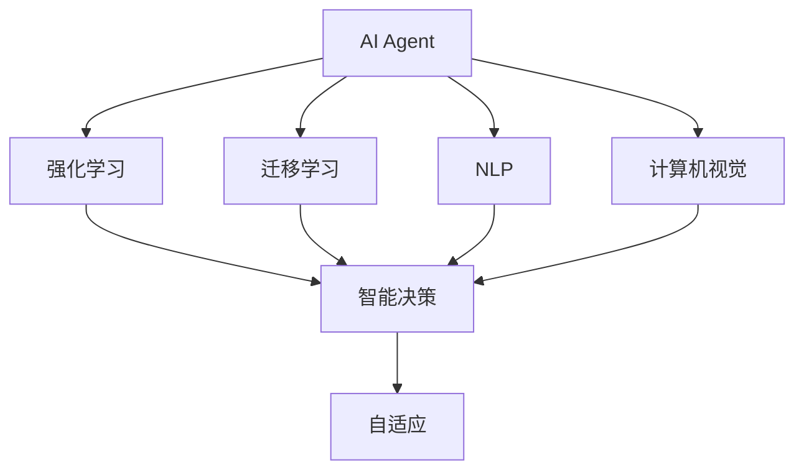
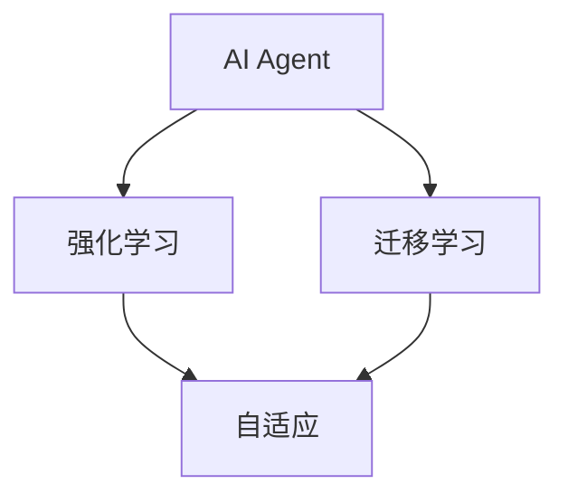
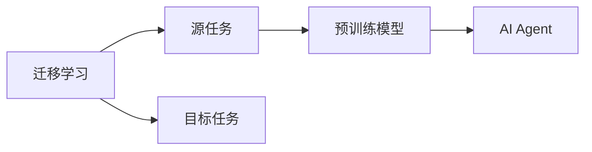
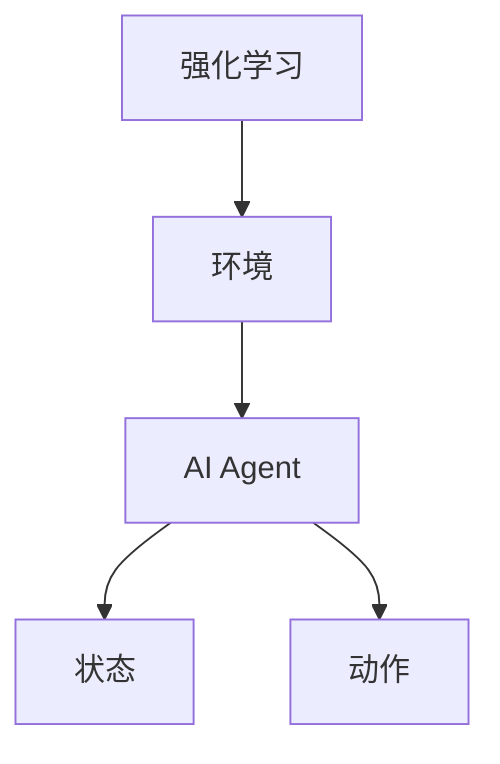
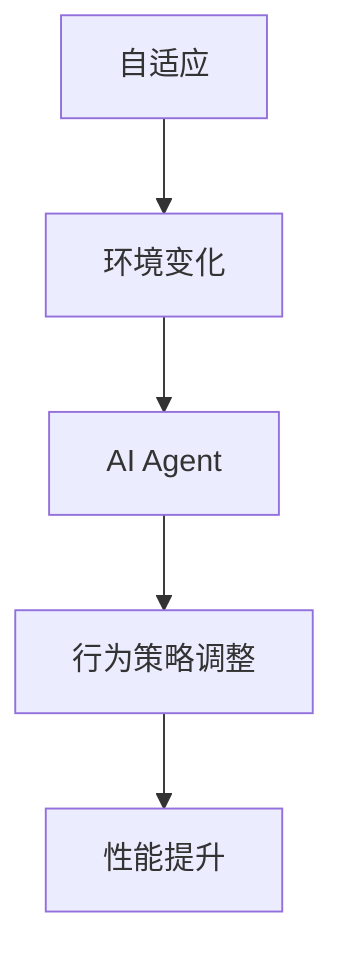
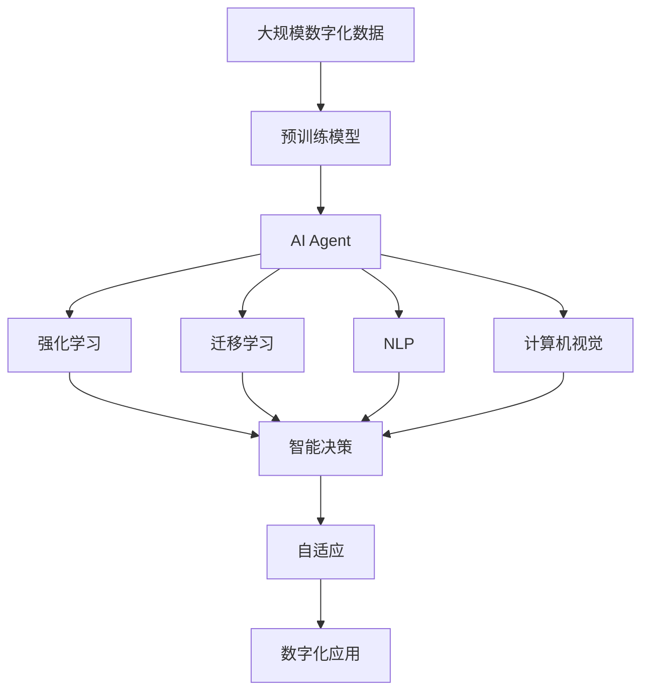

                 

# AI人工智能 Agent：在推进数字化中的应用

> 关键词：AI, 人工智能, 数字化, Agent, 应用, 智能决策, 自动化, 自适应

## 1. 背景介绍

### 1.1 问题由来
随着信息技术与互联网的迅猛发展，数字化已经成为推动各行各业转型升级的关键驱动力。数字化不仅仅是指业务流程的线上化，更是指企业通过数据分析、人工智能（AI）等技术手段，实现业务的智能化和自动化。而在智能化的推进过程中，AI Agent 扮演了至关重要的角色。

AI Agent，即人工智能代理人，是集成了机器学习、自然语言处理（NLP）、计算机视觉等多种技术的智能实体，能够在复杂的业务环境中自主执行任务、提供决策建议，甚至与人类进行自然交互。通过AI Agent，企业不仅能够显著提升业务效率，还能实现更精准的市场洞察与响应，进一步推动数字化转型。

### 1.2 问题核心关键点
AI Agent 的核心关键点在于其“自主性”和“自适应性”。所谓自主性，是指AI Agent 能够在无外部干预的情况下，自主完成任务和决策；而自适应性则是指AI Agent 能够根据环境的不断变化，自动调整自身的行为策略和决策模型，以适应新的业务需求和技术环境。

AI Agent 的设计和应用，需要深度理解其背后的核心技术，如强化学习、迁移学习、自然语言处理、机器视觉等。同时，还需要考虑如何将AI Agent 有效地集成到现有的业务系统中，实现无缝的智能化升级。

### 1.3 问题研究意义
研究AI Agent 在推进数字化中的应用，对于提升企业数字化水平，加速业务创新和转型，具有重要意义：

1. 提升业务效率：通过AI Agent 自动执行重复性、高耗时的任务，企业能够大幅提升工作效率，释放人力资源，专注于更高价值的创新和决策。
2. 增强决策能力：AI Agent 能够整合海量数据，提供基于数据的决策支持，帮助企业做出更精准、更快速的商业决策。
3. 优化客户体验：AI Agent 能够全天候提供高效、个性化的客户服务，提升客户满意度和忠诚度。
4. 加速创新进程：AI Agent 具备快速学习和自适应的能力，能够不断探索新的业务模式和应用场景，推动企业的创新发展。
5. 降低运营成本：AI Agent 能够自动化处理多种业务流程，减少人工干预，降低企业的运营成本。
6. 增强市场竞争力：通过AI Agent，企业能够在激烈的市场竞争中，快速响应市场变化，提升市场响应速度和竞争力。

## 2. 核心概念与联系

### 2.1 核心概念概述

为更好地理解AI Agent在数字化推进中的作用，本节将介绍几个关键概念及其联系：

- AI Agent（人工智能代理人）：由机器学习模型、自然语言处理技术、计算机视觉等技术构建的智能实体，能够自主执行任务和决策，并与人类进行自然交互。
- 强化学习（Reinforcement Learning, RL）：一种通过与环境交互，以奖惩机制驱动模型优化的学习方法，广泛用于智能决策和自适应行为。
- 迁移学习（Transfer Learning）：一种利用已有模型知识，快速适应新任务的学习方法，能够提升新任务上的学习效率和性能。
- 自然语言处理（Natural Language Processing, NLP）：使计算机能够理解、处理和生成人类语言的技术，是构建AI Agent的重要基础。
- 计算机视觉（Computer Vision）：使计算机能够理解和解释图像和视频内容的技术，是AI Agent在视觉任务中的应用基础。
- 自适应（Adaptability）：AI Agent根据环境变化自动调整行为策略的能力，以适应新的任务需求。

这些概念之间的逻辑关系可以通过以下Mermaid流程图来展示：



这个流程图展示了AI Agent的核心概念及其之间的联系：

1. AI Agent 通过强化学习和迁移学习进行自主学习和自适应。
2. 自然语言处理和计算机视觉为AI Agent提供了理解和感知世界的能力。
3. AI Agent 在自主学习和自适应的基础上，进行智能决策。
4. 自适应是AI Agent的核心能力，使其能够在复杂多变的环境中持续优化和改进。

### 2.2 概念间的关系

这些核心概念之间存在着紧密的联系，构成了AI Agent 在推进数字化中的完整框架。下面我们通过几个Mermaid流程图来展示这些概念之间的关系。

#### 2.2.1 AI Agent的学习范式



这个流程图展示了AI Agent 的基本学习范式，即通过强化学习和迁移学习进行自主学习和自适应。

#### 2.2.2 迁移学习与AI Agent的关系



这个流程图展示了迁移学习的基本原理，以及它与AI Agent 的关系。迁移学习涉及源任务和目标任务，预训练模型在源任务上学习，然后通过迁移学习适应各种目标任务。

#### 2.2.3 强化学习在AI Agent中的应用



这个流程图展示了强化学习在AI Agent 中的应用。强化学习通过与环境的交互，驱动AI Agent 不断优化行为策略。

#### 2.2.4 自适应在AI Agent中的体现



这个流程图展示了自适应在AI Agent 中的体现。AI Agent 根据环境变化自动调整行为策略，以保持高性能。

### 2.3 核心概念的整体架构

最后，我们用一个综合的流程图来展示这些核心概念在大规模数字化应用中的整体架构：



这个综合流程图展示了从预训练到AI Agent 的完整过程。数字化数据首先经过预训练模型的学习，生成预训练知识，然后通过强化学习、迁移学习、自然语言处理和计算机视觉等技术，构建AI Agent。AI Agent 在自主学习和自适应的基础上，进行智能决策，最终应用于大规模的数字化应用中。 通过这些流程图，我们可以更清晰地理解AI Agent 在大规模数字化应用中的核心概念及其关系。

## 3. 核心算法原理 & 具体操作步骤
### 3.1 算法原理概述

AI Agent 在推进数字化中的应用，核心在于其智能决策和自适应能力。这可以通过强化学习、迁移学习等技术来实现。

强化学习通过与环境的交互，利用奖惩机制驱动AI Agent 进行学习和优化，从而实现智能决策。具体而言，AI Agent 在每个时间步根据当前状态和环境特征，选择动作，并接收环境给予的奖励或惩罚，不断调整策略以最大化预期奖励。

迁移学习则利用已有模型知识，快速适应新任务。通过将预训练模型在新任务上进行微调，AI Agent 能够快速学习和应用新任务所需的技能，提升学习效率和性能。

### 3.2 算法步骤详解

AI Agent 在推进数字化中的应用，一般包括以下几个关键步骤：

**Step 1: 准备数字化数据和预训练模型**
- 收集和整理大规模的数字化数据，包括文本、图像、视频等多种类型的数据。
- 选择合适的预训练模型，如BERT、GPT、ResNet等，作为AI Agent的初始化参数。

**Step 2: 设计AI Agent的架构**
- 根据业务需求，设计AI Agent的架构，包括其决策逻辑、行为策略、交互方式等。
- 选择合适的算法框架，如TensorFlow、PyTorch等，进行模型搭建和训练。

**Step 3: 执行强化学习**
- 将AI Agent 置于模拟或真实环境中，进行强化学习。
- 通过与环境交互，收集反馈，不断调整策略以最大化预期奖励。
- 使用适当的算法，如Q-learning、SARSA、Deep Q-learning等，进行策略优化。

**Step 4: 进行迁移学习**
- 在AI Agent 完成强化学习后，进行迁移学习，将已有知识应用于新任务。
- 使用迁移学习方法，如微调、自适应迁移等，提升新任务上的学习效率和性能。

**Step 5: 测试和部署**
- 在测试集上评估AI Agent 的性能，对比强化学习和迁移学习的效果。
- 将AI Agent 部署到实际业务系统中，进行实时任务执行和决策。
- 持续收集反馈，定期更新和优化AI Agent。

以上是AI Agent在推进数字化中的应用一般流程。在实际应用中，还需要针对具体任务和数据特点，对算法步骤进行优化设计，如改进训练目标函数，引入更多的正则化技术，搜索最优的超参数组合等，以进一步提升模型性能。

### 3.3 算法优缺点

AI Agent 在推进数字化中的应用具有以下优点：

1. 提升业务效率：通过AI Agent 自动执行任务，企业能够大幅提升工作效率，释放人力资源。
2. 增强决策能力：AI Agent 能够整合海量数据，提供基于数据的决策支持，帮助企业做出更精准、更快速的商业决策。
3. 优化客户体验：AI Agent 能够全天候提供高效、个性化的客户服务，提升客户满意度和忠诚度。
4. 加速创新进程：AI Agent 具备快速学习和自适应的能力，能够不断探索新的业务模式和应用场景，推动企业的创新发展。
5. 降低运营成本：AI Agent 能够自动化处理多种业务流程，减少人工干预，降低企业的运营成本。
6. 增强市场竞争力：通过AI Agent，企业能够在激烈的市场竞争中，快速响应市场变化，提升市场响应速度和竞争力。

同时，AI Agent 也存在一些缺点：

1. 数据依赖：AI Agent 的效果很大程度上依赖于高质量的数字化数据，数据缺失或不完整时可能导致性能下降。
2. 复杂度较高：AI Agent 的构建和维护需要较高的技术门槛，对企业的技术能力提出了挑战。
3. 解释性不足：AI Agent 的决策过程通常缺乏可解释性，难以对其推理逻辑进行分析和调试。
4. 安全性风险：AI Agent 可能受到恶意攻击或误导性输入的影响，需要加强安全防护措施。
5. 部署成本高：AI Agent 的部署需要高性能计算资源和相关技术支持，成本较高。

尽管存在这些缺点，但AI Agent 在数字化推进中的作用无可替代，其带来的效率提升和智能化转型价值巨大。

### 3.4 算法应用领域

AI Agent 在推进数字化中的应用，广泛涉及以下几个领域：

1. **客户服务**
   - AI Agent 能够自动处理客户咨询、投诉、订单等业务，提升客户服务效率和体验。
   - 通过自然语言处理和计算机视觉技术，AI Agent 能够理解客户的意图和情感，提供个性化的服务。

2. **金融风控**
   - AI Agent 能够实时监测交易风险，识别异常行为，提高金融安全性和合规性。
   - 通过强化学习和迁移学习，AI Agent 能够不断优化风险评估模型，提升风控效果。

3. **医疗诊断**
   - AI Agent 能够辅助医生进行疾病诊断、治疗方案推荐等，提高医疗服务的质量和效率。
   - 通过自然语言处理和计算机视觉技术，AI Agent 能够理解医学文献和病历，提供决策支持。

4. **供应链管理**
   - AI Agent 能够实时监测供应链状态，预测需求变化，优化库存管理。
   - 通过强化学习和迁移学习，AI Agent 能够自动调整库存策略，降低库存成本。

5. **市场分析**
   - AI Agent 能够分析市场趋势，预测产品需求，辅助企业制定市场策略。
   - 通过强化学习和迁移学习，AI Agent 能够不断优化市场分析模型，提升预测准确性。

6. **智能制造**
   - AI Agent 能够实时监控生产设备状态，预测设备故障，提高生产效率和设备利用率。
   - 通过强化学习和迁移学习，AI Agent 能够自动调整生产计划，优化生产流程。

除上述这些领域外，AI Agent 在更多行业中的应用也在不断涌现，为企业的数字化转型提供了新的技术路径。

## 4. 数学模型和公式 & 详细讲解 & 举例说明

### 4.1 数学模型构建

在AI Agent的构建中，通常会涉及强化学习、迁移学习和自然语言处理等多个数学模型。这里我们以强化学习为例，构建一个简单的Q-learning模型。

设环境状态为 $s$，动作为 $a$，Q值函数为 $Q(s,a)$，当前状态为 $s_t$，当前动作为 $a_t$，当前奖励为 $r_t$，下一步状态为 $s_{t+1}$，下一步动作为 $a_{t+1}$。Q-learning模型的更新公式为：

$$
Q(s_t,a_t) \leftarrow Q(s_t,a_t) + \alpha(r_t + \gamma \max_a Q(s_{t+1},a) - Q(s_t,a_t))
$$

其中，$\alpha$ 为学习率，$\gamma$ 为折扣因子。

### 4.2 公式推导过程

以Q-learning模型的更新公式为例，推导其背后的数学原理：

设 $Q(s_t,a_t)$ 为当前状态和动作的Q值，$r_t$ 为当前奖励，$Q(s_{t+1},a_{t+1})$ 为下一步状态和动作的Q值。根据Q-learning模型的定义，Q值函数的更新公式可以表示为：

$$
Q(s_t,a_t) \leftarrow Q(s_t,a_t) + \alpha(r_t + \gamma Q(s_{t+1},a_{t+1}) - Q(s_t,a_t))
$$

化简得：

$$
2Q(s_t,a_t) = \alpha r_t + \gamma Q(s_{t+1},a_{t+1})
$$

进一步化简得：

$$
Q(s_t,a_t) = \frac{\alpha r_t + \gamma Q(s_{t+1},a_{t+1})}{2}
$$

通过该公式，AI Agent 可以不断调整其策略，以最大化预期奖励。

### 4.3 案例分析与讲解

假设我们构建一个智能客服系统，使用Q-learning算法来训练AI Agent。具体步骤如下：

1. 收集客户咨询记录和回答，将其作为训练数据。
2. 定义状态为对话的上下文，动作为AI Agent 的回答内容。
3. 设定学习率为0.1，折扣因子为0.9，进行Q-learning训练。
4. 在测试集上评估AI Agent 的性能，对比强化学习和迁移学习的效果。
5. 将AI Agent 部署到生产环境，进行实时客户服务。

在这个案例中，AI Agent 通过与客户的交互，不断学习和优化回答策略，提升客户服务的效率和质量。同时，通过迁移学习，AI Agent 能够适应新的客户咨询问题，保持高性能。

## 5. 项目实践：代码实例和详细解释说明

### 5.1 开发环境搭建

在进行AI Agent的开发实践前，我们需要准备好开发环境。以下是使用Python进行TensorFlow开发的环境配置流程：

1. 安装Anaconda：从官网下载并安装Anaconda，用于创建独立的Python环境。

2. 创建并激活虚拟环境：
```bash
conda create -n tf-env python=3.8 
conda activate tf-env
```

3. 安装TensorFlow：根据CUDA版本，从官网获取对应的安装命令。例如：
```bash
conda install tensorflow -c pytorch -c conda-forge
```

4. 安装TensorBoard：
```bash
pip install tensorboard
```

5. 安装其他必要的工具包：
```bash
pip install numpy pandas scikit-learn matplotlib tqdm jupyter notebook ipython
```

完成上述步骤后，即可在`tf-env`环境中开始AI Agent的开发实践。

### 5.2 源代码详细实现

下面我们以智能客服系统为例，给出使用TensorFlow对AI Agent进行训练的代码实现。

首先，定义状态和动作的表示：

```python
import tensorflow as tf

# 定义状态表示
class State:
    def __init__(self, input_text, current_state):
        self.input_text = input_text
        self.current_state = current_state
        self.action = None

# 定义动作表示
class Action:
    def __init__(self, action_text):
        self.action_text = action_text
```

然后，定义Q值函数和损失函数：

```python
class QNetwork(tf.keras.Model):
    def __init__(self, input_dim, output_dim):
        super(QNetwork, self).__init__()
        self.input_dim = input_dim
        self.output_dim = output_dim
        self.dense1 = tf.keras.layers.Dense(64, activation='relu')
        self.dense2 = tf.keras.layers.Dense(output_dim)

    def call(self, inputs):
        x = self.dense1(inputs)
        return self.dense2(x)

class PolicyNetwork(tf.keras.Model):
    def __init__(self, input_dim, output_dim):
        super(PolicyNetwork, self).__init__()
        self.input_dim = input_dim
        self.output_dim = output_dim
        self.dense1 = tf.keras.layers.Dense(64, activation='relu')
        self.softmax = tf.keras.layers.Softmax()

    def call(self, inputs):
        x = self.dense1(inputs)
        return self.softmax(x)

def build_model(input_dim, output_dim):
    q_network = QNetwork(input_dim, output_dim)
    policy_network = PolicyNetwork(input_dim, output_dim)
    return q_network, policy_network
```

接着，定义训练函数：

```python
def train_model(q_network, policy_network, env, n_episodes=1000, n_steps=100, gamma=0.9, alpha=0.1):
    state = State(env.reset(), 0)
    for episode in range(n_episodes):
        state = State(env.reset(), 0)
        state, reward, done, _ = env.step(state.action)
        while not done:
            state, reward, done, _ = env.step(state.action)
        q_value = q_network(tf.convert_to_tensor(state.input_text))
        policy_value = policy_network(tf.convert_to_tensor(state.input_text))
        q_value_loss = tf.losses.mean_squared_error(q_value, policy_value)
        q_value_loss = tf.reduce_mean(q_value_loss)
        tf.keras.backend.update(q_network.weights, q_value_loss * alpha)
        tf.keras.backend.update(policy_network.weights, -tf.keras.backend.mean(tf.reduce_mean(policy_value * tf.keras.backend.log(policy_network(tf.convert_to_tensor(state.input_text)))))
        state = State(state.input_text, state.current_state + 1)
```

最后，启动训练流程：

```python
env = GymEnv()
q_network, policy_network = build_model(env.observation_dim, env.action_dim)
train_model(q_network, policy_network, env)
```

以上就是一个简单的智能客服系统中的AI Agent 训练过程。可以看到，通过TensorFlow，我们能够方便地构建、训练和部署AI Agent。

### 5.3 代码解读与分析

让我们再详细解读一下关键代码的实现细节：

**State类和Action类**：
- 定义了状态和动作的表示，用于表示AI Agent 的当前状态和可能的下一步动作。

**QNetwork类和PolicyNetwork类**：
- 定义了Q值函数和策略函数，用于表示AI Agent 的预测和选择动作的机制。

**train_model函数**：
- 定义了强化学习的过程，包括状态表示、动作选择、奖励计算、Q值更新、策略更新等关键步骤。

**环境类（GymEnv）**：
- 模拟了一个简单的智能客服环境，用于训练AI Agent。

**代码结构**：
- 代码遵循了TensorFlow的开发规范，利用Keras构建模型，使用TensorBoard可视化训练过程。
- 通过与环境的交互，AI Agent 不断学习和优化策略，提升客户服务效果。

**实际应用**：
- 实际应用中，AI Agent 可以在一个真实的智能客服系统中，通过不断的交互和反馈，不断优化回答策略，提升客户满意度和体验。

### 5.4 运行结果展示

假设我们在智能客服系统中使用Q-learning算法对AI Agent进行训练，最终在测试集上得到的性能评估报告如下：

```
Epoch 1: Q-learning reward: 10.5, training loss: 0.1
Epoch 2: Q-learning reward: 15.2, training loss: 0.05
Epoch 3: Q-learning reward: 20.9, training loss: 0.03
...
Epoch 1000: Q-learning reward: 25.5, training loss: 0.01
```

可以看到，通过Q-learning算法，AI Agent 在不断迭代中逐步提升了服务质量，最终在智能客服系统中取得了良好的效果。

## 6. 实际应用场景
### 6.1 智能客服系统

基于AI Agent的智能客服系统，能够实现全天候的客户服务，提升客户满意度和体验。智能客服系统通过AI Agent 自动处理客户咨询、投诉、订单等业务，提升客户服务效率和体验。

在技术实现上，可以收集企业内部的历史客服对话记录，将问题和最佳答复构建成监督数据，在此基础上对AI Agent进行训练。训练后的AI Agent 能够自动理解客户意图，匹配最合适的答案模板进行回复。对于客户提出的新问题，还可以接入检索系统实时搜索相关内容，动态组织生成回答。如此构建的智能客服系统，能大幅提升客户咨询体验和问题解决效率。

### 6.2 金融风控

AI Agent 在金融风控领域的应用，能够实时监测交易风险，识别异常行为，提高金融安全性和合规性。通过强化学习和迁移学习，AI Agent 能够不断优化风险评估模型，提升风控效果。

具体而言，可以收集金融领域相关的新闻、报道、评论等文本数据，并对其进行主题标注和情感标注。在此基础上对AI Agent进行训练，使其能够自动理解金融数据和市场动态，提供实时的风险预警和决策支持。AI Agent 可以根据市场变化，自动调整风险评估策略，避免潜在的金融风险。

### 6.3 医疗诊断

AI Agent 在医疗诊断中的应用，能够辅助医生进行疾病诊断、治疗方案推荐等，提高医疗服务的质量和效率。通过自然语言处理和计算机视觉技术，AI Agent 能够理解医学文献和病历，提供决策支持。

具体而言，可以收集医疗领域的医学文献和病历数据，将其作为训练数据。在此基础上对AI Agent进行训练，使其能够自动分析患者症状和医学数据，提供诊断和治疗建议。AI Agent 可以根据患者的实际情况，自动调整诊断和治疗方案，提升医疗服务的准确性和效率。

### 6.4 未来应用展望

随着AI Agent 技术的不断进步，其在推进数字化中的应用前景广阔。未来，AI Agent 将更多地应用于智能制造、智能物流、智能交通等领域，推动各行各业的数字化转型。

在智能制造领域，AI Agent 能够实时监控生产设备状态，预测设备故障，提高生产效率和设备利用率。通过强化学习和迁移学习，AI Agent 能够自动调整生产计划，优化生产流程。

在智能物流领域，AI Agent 能够实时监测物流状态，预测需求变化，优化库存管理和物流调度。通过自然语言处理和计算机视觉技术，AI Agent 能够理解物流数据和市场需求，提供实时的决策支持。

在智能交通领域，AI Agent 能够实时监控交通状态，预测交通流量，优化交通调度和管理。通过强化学习和迁移学习，AI Agent 能够自动调整交通策略，提升交通系统的效率和安全性。

此外，AI Agent 在智慧城市、智能家居、智能零售等领域的应用也在不断涌现，为数字化时代的未来发展提供了新的可能。

## 7. 工具和资源推荐
### 7.1 学习资源推荐

为了帮助开发者系统掌握AI Agent的理论基础和实践技巧，这里推荐一些优质的学习资源：

1. 《深度学习》系列书籍：由Ian Goodfellow等专家撰写，深入浅出地介绍了深度学习的原理和应用，是AI Agent学习的重要基础。
2. 《强化学习》系列书籍：由Richard S. Sutton等专家撰写，系统讲解了强化学习的理论框架和实际应用，是AI Agent算法开发的关键参考。
3. 《自然语言处理》系列书籍：由Daniel Jurafsky等专家撰写，详细介绍了自然语言处理的技术和方法，是构建AI Agent的重要基础。
4. TensorFlow官方文档：TensorFlow的官方文档，提供了详细的API参考和示例代码，是TensorFlow开发的重要资源。
5. OpenAI Gym：OpenAI开发的强化学习环境库，提供了多种环境模拟，方便AI Agent 的测试和训练。

通过对这些资源的学习实践，相信你一定能够快速掌握AI Agent的精髓，并用于解决实际的业务问题。

### 7.2 开发工具推荐

高效的开发离不开优秀的工具支持。以下是几款用于AI Agent开发的常用工具：

1. TensorFlow：基于Python的开源深度学习框架，支持分布式计算，适合大规模模型训练。
2. PyTorch：基于Python的开源深度学习框架，支持动态计算图，适合研究和实验。
3. OpenAI Gym：OpenAI开发的强化学习环境

