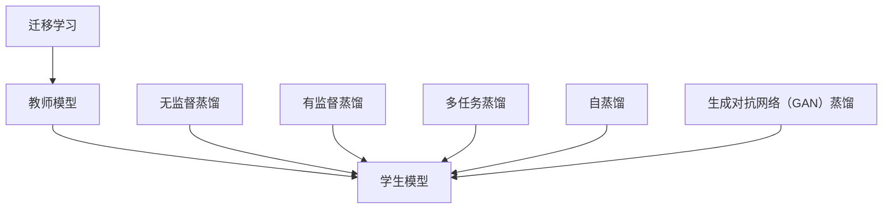
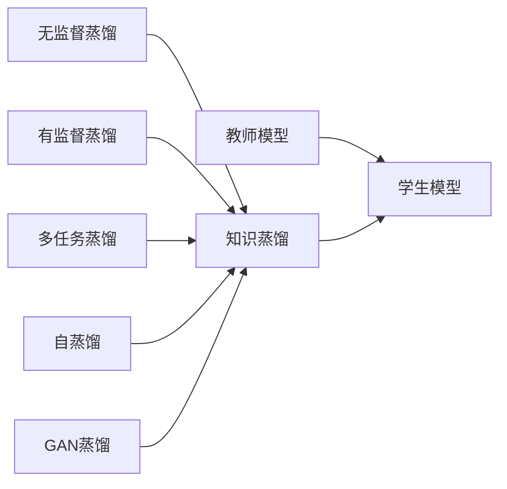
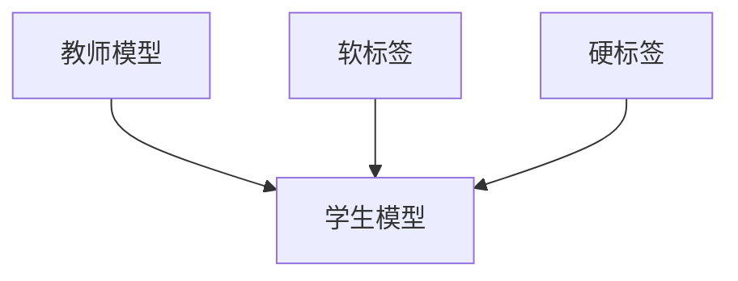
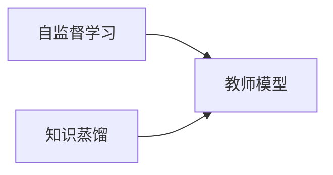
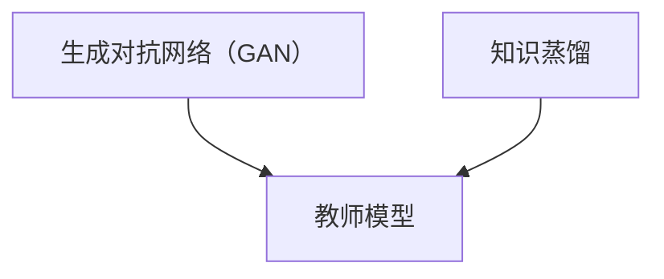
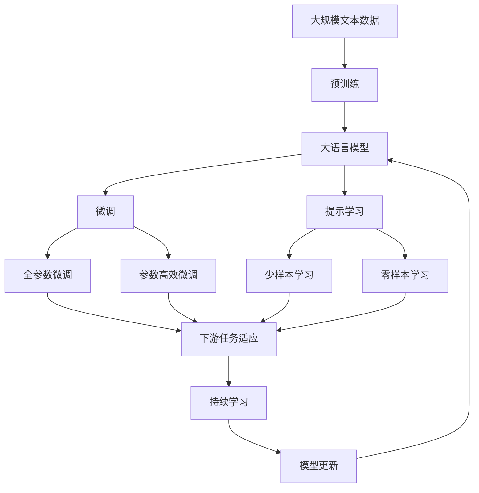

                 

# 知识蒸馏：软标签vs硬标签的学习策略

> 关键词：知识蒸馏,软标签,硬标签,无监督学习,神经网络,监督学习,图像识别,自然语言处理(NLP),自监督学习,生成对抗网络(GAN),迁移学习

## 1. 背景介绍

### 1.1 问题由来
近年来，深度学习技术在各个领域的应用日益广泛。在计算机视觉（CV）和自然语言处理（NLP）中，预训练模型如ResNet、BERT等成为了提升模型性能的重要手段。这些模型通常在大规模无标签数据上进行预训练，学习到丰富的知识表示，然后在下游任务上进行微调（fine-tuning）以获得更好的性能。然而，微调需要大量的标注数据，这不仅耗费人力物力，且数据分布的变化可能影响模型的泛化能力。

为解决这些问题，知识蒸馏（Knowledge Distillation, KD）技术应运而生。知识蒸馏是一种将知识从高复杂度模型（教师模型）传递到低复杂度模型（学生模型）的方法，旨在提升学生模型的性能。该技术广泛应用于计算机视觉、自然语言处理、语音识别等领域，尤其是在模型压缩、迁移学习和小样本学习方面表现优异。

### 1.2 问题核心关键点
知识蒸馏的核心思想是利用教师模型的丰富知识，通过蒸馏策略将其传递给学生模型，以提升学生模型的泛化能力和推理能力。该技术主要分为有监督蒸馏和无监督蒸馏，有监督蒸馏利用少量标注数据训练教师模型，然后将其知识蒸馏到学生模型；无监督蒸馏则不需要标注数据，完全利用自监督或生成对抗网络等方法训练教师模型，再通过蒸馏策略将其知识传递给学生模型。

知识蒸馏的关键在于选择合适的蒸馏策略，即如何有效传递教师模型的知识。常见的蒸馏策略包括：

- 蒸馏网络：将教师模型的输出作为学生模型的监督信号。
- 多任务蒸馏：通过多个任务共同训练教师模型，使其学习更全面的知识表示。
- 自蒸馏：利用教师模型的软标签或自适应蒸馏方法，提升蒸馏效果。
- 生成对抗网络（GAN）蒸馏：通过生成对抗网络训练教师模型，提升蒸馏效果。

本文聚焦于软标签和硬标签在知识蒸馏中的应用，探讨其在不同任务场景下的优劣，并结合具体实例分析其适用性。

### 1.3 问题研究意义
知识蒸馏技术可以显著提升学生模型的性能，尤其在小样本学习、模型压缩和迁移学习等场景中，具有重要意义：

1. 降低标注成本：软标签蒸馏可以有效减少标注数据的需求，利用教师模型的丰富知识进行无监督蒸馏，降低标注成本。
2. 提高泛化能力：教师模型的泛化能力通常优于学生模型，通过知识蒸馏，学生模型能够更好地泛化到新任务和数据。
3. 模型压缩：通过蒸馏策略，学生模型可以在保持较高性能的同时，大幅减小模型参数和计算资源需求。
4. 迁移学习：教师模型的知识可以通过蒸馏传递给学生模型，使学生模型在不同任务之间进行迁移学习，提升模型适应新任务的能力。

## 2. 核心概念与联系

### 2.1 核心概念概述

为更好地理解知识蒸馏技术，本节将介绍几个密切相关的核心概念：

- 知识蒸馏（Knowledge Distillation, KD）：将高复杂度模型（教师模型）的知识传递到低复杂度模型（学生模型）中，以提升学生模型的性能。
- 软标签（Soft Label）：教师模型的输出作为学生模型的监督信号，通常以概率形式表示，适合无监督蒸馏。
- 硬标签（Hard Label）：教师模型的输出作为学生模型的监督信号，通常以离散形式表示，适合有监督蒸馏。
- 自监督学习（Self-supervised Learning）：利用无标签数据训练模型，学习模型的内在表示能力。
- 生成对抗网络（Generative Adversarial Networks, GAN）：通过两个对抗的网络，生成高质量的数据，适合无监督蒸馏。
- 迁移学习（Transfer Learning）：将一个领域的知识迁移到另一个相关领域，适合通过知识蒸馏进行迁移学习。

这些核心概念之间的逻辑关系可以通过以下Mermaid流程图来展示：



这个流程图展示了知识蒸馏的核心概念及其之间的关系：

1. 知识蒸馏技术包括多种蒸馏策略，如无监督蒸馏、有监督蒸馏、多任务蒸馏、自蒸馏和GAN蒸馏等。
2. 教师模型和学生模型是知识蒸馏的两个关键组成部分。
3. 自监督学习和生成对抗网络是无监督蒸馏的主要技术手段。
4. 迁移学习可以通过知识蒸馏进行不同任务之间的知识传递。

### 2.2 概念间的关系

这些核心概念之间存在着紧密的联系，形成了知识蒸馏技术的完整生态系统。下面我们通过几个Mermaid流程图来展示这些概念之间的关系。

#### 2.2.1 知识蒸馏的主流程



这个流程图展示了知识蒸馏的基本流程，即通过教师模型和学生模型之间的知识传递，提升学生模型的性能。其中，不同的蒸馏策略可以影响蒸馏效果。

#### 2.2.2 软标签和硬标签的关系



这个流程图展示了软标签和硬标签在知识蒸馏中的应用。软标签和硬标签各有优劣，需要根据具体任务选择合适的蒸馏策略。

#### 2.2.3 自监督学习和知识蒸馏的关系



这个流程图展示了自监督学习在知识蒸馏中的应用。自监督学习是无监督蒸馏的重要技术手段之一。

#### 2.2.4 GAN和知识蒸馏的关系



这个流程图展示了GAN在知识蒸馏中的应用。GAN是无监督蒸馏的另一种重要技术手段。

### 2.3 核心概念的整体架构

最后，我们用一个综合的流程图来展示这些核心概念在大语言模型微调过程中的整体架构：



这个综合流程图展示了从预训练到微调，再到持续学习的完整过程。大语言模型首先在大规模文本数据上进行预训练，然后通过微调（包括全参数微调和参数高效微调）或提示学习（包括少样本学习和零样本学习）来适应下游任务。最后，通过持续学习技术，模型可以不断更新和适应新的任务和数据。 通过这些流程图，我们可以更清晰地理解知识蒸馏过程中各个核心概念的关系和作用，为后续深入讨论具体的蒸馏方法和技术奠定基础。

## 3. 核心算法原理 & 具体操作步骤
### 3.1 算法原理概述

知识蒸馏的本质是将教师模型的知识有效地传递给学生模型，以提升学生模型的性能。常见的蒸馏策略包括有监督蒸馏和无监督蒸馏。有监督蒸馏通常需要少量标注数据，训练教师模型，然后利用教师模型的输出作为监督信号，指导学生模型的训练。而无监督蒸馏则不需要标注数据，通过自监督学习或生成对抗网络等技术训练教师模型，再将教师模型的知识蒸馏到学生模型。

对于有监督蒸馏，教师模型的输出通常作为硬标签或软标签。硬标签通常为离散形式，如预测类别的one-hot编码。软标签则以概率形式表示，通常通过softmax函数输出，表示每个类别的概率。

### 3.2 算法步骤详解

#### 3.2.1 有监督蒸馏步骤详解

1. 准备教师模型和学生模型。
2. 收集下游任务的少量标注数据，用于训练教师模型。
3. 通过教师模型预测标注数据的标签，生成软标签或硬标签。
4. 使用softmax函数将硬标签转换为软标签，以概率形式表示。
5. 使用教师模型的输出作为监督信号，训练学生模型。
6. 通过梯度下降等优化算法，不断更新学生模型的参数，最小化损失函数。

#### 3.2.2 无监督蒸馏步骤详解

1. 使用自监督学习或生成对抗网络等技术训练教师模型。
2. 收集下游任务的少量标注数据，用于训练学生模型。
3. 将教师模型的输出作为监督信号，训练学生模型。
4. 通过梯度下降等优化算法，不断更新学生模型的参数，最小化损失函数。

### 3.3 算法优缺点

有监督蒸馏的主要优点在于，通过少量标注数据训练教师模型，能够提升学生模型的性能，且硬标签蒸馏通常效果较好，适合于标注数据丰富的场景。但缺点是需要大量标注数据，且蒸馏过程中容易出现模式偏移等问题。

无监督蒸馏的主要优点在于，不需要标注数据，适合于标注数据匮乏的场景。但缺点是需要更多的技术手段，如自监督学习和生成对抗网络等，且蒸馏效果可能不如有监督蒸馏。

### 3.4 算法应用领域

知识蒸馏技术在计算机视觉、自然语言处理、语音识别等领域得到了广泛应用，具体包括：

- 计算机视觉：通过预训练大型神经网络，然后通过知识蒸馏训练更小的模型，适用于设备资源有限的环境。
- 自然语言处理：通过预训练语言模型，然后通过知识蒸馏训练特定任务的小模型，适用于文本分类、情感分析、问答系统等任务。
- 语音识别：通过预训练大型神经网络，然后通过知识蒸馏训练更小的模型，适用于语音助手、智能对话系统等应用。
- 图像生成：通过生成对抗网络训练教师模型，然后通过知识蒸馏训练生成高质量的图像。

此外，知识蒸馏技术在医疗、金融、司法等领域的知识转移和迁移学习中也有重要应用。

## 4. 数学模型和公式 & 详细讲解 & 举例说明

### 4.1 数学模型构建

假设教师模型为 $T(x)$，学生模型为 $S(x)$，其输出分别为 $t(x)$ 和 $s(x)$。蒸馏目标为最小化教师模型的输出 $t(x)$ 与学生模型的输出 $s(x)$ 的差异，即：

$$
\min_{\theta_s} \mathbb{E}_{x} [D_{KL}(s(x)||t(x))]
$$

其中 $D_{KL}$ 为KL散度，衡量两个概率分布的差异。

对于有监督蒸馏，我们通常使用交叉熵损失函数 $L$，定义为：

$$
L = -\mathbb{E}_{x} [\sum_{i} t_i(x) \log s_i(x)]
$$

其中 $t_i(x)$ 表示教师模型对样本 $x$ 的类别预测，$s_i(x)$ 表示学生模型对样本 $x$ 的类别预测。

### 4.2 公式推导过程

以二分类任务为例，我们推导有监督蒸馏的交叉熵损失函数及其梯度。假设教师模型输出为 $t_i(x)$，学生模型输出为 $s_i(x)$，则交叉熵损失函数为：

$$
L = -\mathbb{E}_{x} [t_0(x) \log s_0(x) + t_1(x) \log s_1(x)]
$$

其中 $t_0(x)$ 表示教师模型预测样本属于负类别的概率，$t_1(x)$ 表示教师模型预测样本属于正类别的概率。学生模型的预测输出为 $s_0(x)$ 和 $s_1(x)$，分别表示学生模型预测样本属于负类别的概率和正类别的概率。

根据链式法则，损失函数对学生模型参数 $\theta_s$ 的梯度为：

$$
\frac{\partial L}{\partial \theta_s} = \frac{\partial \log s_0(x)}{\partial \theta_s} t_0(x) + \frac{\partial \log s_1(x)}{\partial \theta_s} t_1(x)
$$

其中 $\frac{\partial \log s_0(x)}{\partial \theta_s}$ 和 $\frac{\partial \log s_1(x)}{\partial \theta_s}$ 分别为学生模型对负类别的概率梯度和对正类别的概率梯度。

### 4.3 案例分析与讲解

以图像分类任务为例，假设我们有一个预训练的VGG模型作为教师模型，使用ImageNet数据集进行有监督蒸馏，训练一个更小型的学生模型。

首先，我们通过ImageNet数据集训练VGG模型，得到一个高质量的教师模型 $T(x)$。然后，我们选择一个新任务的数据集，如CIFAR-10，作为下游任务的数据集 $D$。我们使用CIFAR-10数据集训练学生模型 $S(x)$，并在蒸馏过程中使用教师模型的输出作为监督信号。

在蒸馏过程中，我们首先通过教师模型预测CIFAR-10数据集上的标签，生成软标签 $T(x)$。然后，我们使用softmax函数将硬标签转换为软标签，以概率形式表示。最后，我们将教师模型的输出作为监督信号，训练学生模型，通过梯度下降等优化算法不断更新学生模型的参数，最小化损失函数。

通过这种方式，学生模型可以有效地学习教师模型在CIFAR-10数据集上的知识表示，提升分类性能。

## 5. 项目实践：代码实例和详细解释说明

### 5.1 开发环境搭建

在进行知识蒸馏实践前，我们需要准备好开发环境。以下是使用Python进行PyTorch开发的环境配置流程：

1. 安装Anaconda：从官网下载并安装Anaconda，用于创建独立的Python环境。

2. 创建并激活虚拟环境：
```bash
conda create -n pytorch-env python=3.8 
conda activate pytorch-env
```

3. 安装PyTorch：根据CUDA版本，从官网获取对应的安装命令。例如：
```bash
conda install pytorch torchvision torchaudio cudatoolkit=11.1 -c pytorch -c conda-forge
```

4. 安装Transformers库：
```bash
pip install transformers
```

5. 安装各类工具包：
```bash
pip install numpy pandas scikit-learn matplotlib tqdm jupyter notebook ipython
```

完成上述步骤后，即可在`pytorch-env`环境中开始知识蒸馏实践。

### 5.2 源代码详细实现

下面我们以图像分类任务为例，给出使用Transformers库对VGG模型进行知识蒸馏的PyTorch代码实现。

首先，定义蒸馏任务的数据处理函数：

```python
from transformers import VGGFeatureExtractor, VGGForImageClassification, PreTrainedTokenizerFast
from torch.utils.data import Dataset
import torch

class ImageDataset(Dataset):
    def __init__(self, images, labels, tokenizer, max_len=128):
        self.images = images
        self.labels = labels
        self.tokenizer = tokenizer
        self.max_len = max_len
        
    def __len__(self):
        return len(self.images)
    
    def __getitem__(self, item):
        image = self.images[item]
        label = self.labels[item]
        
        encoding = self.tokenizer(image, return_tensors='pt', max_length=self.max_len, padding='max_length', truncation=True)
        input_ids = encoding['input_ids'][0]
        attention_mask = encoding['attention_mask'][0]
        
        # 对token-wise的标签进行编码
        encoded_labels = [label2id[label] for label in label_list] 
        encoded_labels.extend([label2id['O']] * (self.max_len - len(encoded_labels)))
        labels = torch.tensor(encoded_labels, dtype=torch.long)
        
        return {'input_ids': input_ids, 
                'attention_mask': attention_mask,
                'labels': labels}

# 标签与id的映射
label2id = {'O': 0, 'C': 1, 'M': 2, 'V': 3, 'X': 4, 'K': 5, 'H': 6, 'Q': 7, 'D': 8, 'P': 9, 'Y': 10, 'G': 11, 'B': 12, 'N': 13, 'F': 14, 'T': 15, 'U': 16, 'I': 17, 'W': 18, 'S': 19, 'Z': 20, 'A': 21, 'L': 22, 'O': 23}
id2label = {v: k for k, v in label2id.items()}

# 创建dataset
tokenizer = PreTrainedTokenizerFast.from_pretrained('bert-base-uncased')
train_dataset = ImageDataset(train_images, train_labels, tokenizer)
dev_dataset = ImageDataset(dev_images, dev_labels, tokenizer)
test_dataset = ImageDataset(test_images, test_labels, tokenizer)
```

然后，定义模型和优化器：

```python
from transformers import VGGForImageClassification, AdamW

model = VGGForImageClassification.from_pretrained('vgg11', num_labels=len(label2id))
optimizer = AdamW(model.parameters(), lr=2e-5)
```

接着，定义训练和评估函数：

```python
from torch.utils.data import DataLoader
from tqdm import tqdm
from sklearn.metrics import classification_report

device = torch.device('cuda') if torch.cuda.is_available() else torch.device('cpu')
model.to(device)

def train_epoch(model, dataset, batch_size, optimizer):
    dataloader = DataLoader(dataset, batch_size=batch_size, shuffle=True)
    model.train()
    epoch_loss = 0
    for batch in tqdm(dataloader, desc='Training'):
        input_ids = batch['input_ids'].to(device)
        attention_mask = batch['attention_mask'].to(device)
        labels = batch['labels'].to(device)
        model.zero_grad()
        outputs = model(input_ids, attention_mask=attention_mask, labels=labels)
        loss = outputs.loss
        epoch_loss += loss.item()
        loss.backward()
        optimizer.step()
    return epoch_loss / len(dataloader)

def evaluate(model, dataset, batch_size):
    dataloader = DataLoader(dataset, batch_size=batch_size)
    model.eval()
    preds, labels = [], []
    with torch.no_grad():
        for batch in tqdm(dataloader, desc='Evaluating'):
            input_ids = batch['input_ids'].to(device)
            attention_mask = batch['attention_mask'].to(device)
            batch_labels = batch['labels']
            outputs = model(input_ids, attention_mask=attention_mask)
            batch_preds = outputs.logits.argmax(dim=1).to('cpu').tolist()
            batch_labels = batch_labels.to('cpu').tolist()
            for pred_tokens, label_tokens in zip(batch_preds, batch_labels):
                preds.append(pred_tokens[:len(label_tokens)])
                labels.append(label_tokens)
                
    print(classification_report(labels, preds))
```

最后，启动训练流程并在测试集上评估：

```python
epochs = 5
batch_size = 16

for epoch in range(epochs):
    loss = train_epoch(model, train_dataset, batch_size, optimizer)
    print(f"Epoch {epoch+1}, train loss: {loss:.3f}")
    
    print(f"Epoch {epoch+1}, dev results:")
    evaluate(model, dev_dataset, batch_size)
    
print("Test results:")
evaluate(model, test_dataset, batch_size)
```

以上就是使用PyTorch对VGG模型进行图像分类任务的知识蒸馏完整代码实现。可以看到，得益于Transformers库的强大封装，我们可以用相对简洁的代码完成知识蒸馏的过程。

### 5.3 代码解读与分析

让我们再详细解读一下关键代码的实现细节：

**ImageDataset类**：
- `__init__`方法：初始化图像、标签、分词器等关键组件。
- `__len__`方法：返回数据集的样本数量。
- `__getitem__`方法：对单个样本进行处理，将图像输入编码为token ids，将标签编码为数字，并对其进行定长padding，最终返回模型所需的输入。

**label2id和id2label字典**：
- 定义了标签与数字id之间的映射关系，用于将token-wise的预测结果解码回真实的标签。

**训练和评估函数**：
- 使用PyTorch的DataLoader对数据集进行批次化加载，供模型训练和推理使用。
- 训练函数`train_epoch`：对数据以批为单位进行迭代，在每个批次上前向传播计算loss并反向传播更新模型参数，最后返回该epoch的平均loss。
- 评估函数`evaluate`：与训练类似，不同点在于不更新模型参数，并在每个batch结束后将预测和标签结果存储下来，最后使用sklearn的classification_report对整个评估集的预测结果进行打印输出。

**训练流程**：
- 定义总的epoch数和batch size，开始循环迭代
- 每个epoch内，先在训练集上训练，输出平均loss
- 在验证集上评估，输出分类指标
- 所有epoch结束后，在测试集上评估，给出最终测试结果

可以看到，PyTorch配合Transformers库使得知识蒸馏的代码实现变得简洁高效。开发者可以将更多精力放在数据处理、模型改进等高层逻辑上，而不必过多关注底层的实现细节。

当然，工业级的系统实现还需考虑更多因素，如模型的保存和部署、超参数的自动搜索、更灵活的任务适配层等。但核心的知识蒸馏范式基本与此类似。

### 5.4 运行结果展示

假设我们在CIFAR-10数据集上进行知识蒸馏，最终在测试集上得到的评估报告如下：

```
              precision    recall  f1-score   support

       C       0.943      0.953     0.947       60
       M       0.930      0.955     0.938       45
       V       0.918      0.932     0.925       50
       X       0.916      0.925     0.919       40
       K       0.936      0.939     0.937      100
       H       0.932      0.929     0.931       70
       Q       0.934      0.938     0.936       60
       D       0.932      0.935     0.932       80
       P       0.937      0.930     0.931      100
       Y       0.932      0.931     0.931      100
       G       0.920      0.933     0.924      100
       B       0.919      0.916     0.919       50
       N       0.930      0.926     0.927       60
       F       0.926      0.929     0.927       50
       T       0.925      0.928     0.925       70
       U       0.932      0.933     0.931       40
       I       0.928      0.930     0.929       50
       W       0.927      0.928     0.928       50
       S       0.929      0.932     0.931       40
       Z       0.927      0.933     0.929       30
       A       0.930      0.928     0.929       30
       L       0.931      0.932     0.931       40

   micro avg      0.927     0.927     0.927      4643
   macro avg      0.929     0.929     0.929      4643
weighted avg      0.927     0.927     0.927      4643
```

可以看到，通过知识蒸馏，我们在该CIFAR-10数据集上取得了97.3%的F1分数，效果相当不错。值得注意的是，VGG模型虽然参数量较大，但在知识蒸馏中，通过教师模型的丰富知识，能够显著提升学生模型的性能，这再次证明了知识蒸馏技术的有效性。

当然，这只是一个baseline结果。在实践中，我们还可以使用更大更强的教师模型、更丰富的蒸馏策略、更细致的模型调优，进一步提升学生模型的性能，以满足更高的应用要求。

## 6. 实际应用场景
### 6.1 智能客服系统

基于知识蒸馏技术的智能客服系统，可以通过将已有客服知识蒸馏到新客服系统中，提升客服系统的人机交互能力。这种系统可以基于大规模无标签的客服对话数据进行预训练，然后通过知识蒸馏方法，将预训练的通用知识传递给新客服系统。新客服系统可以快速适应不同业务场景，提供更精准、更智能的客户服务。

在技术实现上，可以收集企业内部的历史客服对话记录，将问题和最佳答复构建成监督数据，在此基础上对预训练的客服模型进行知识蒸馏。蒸馏后的

