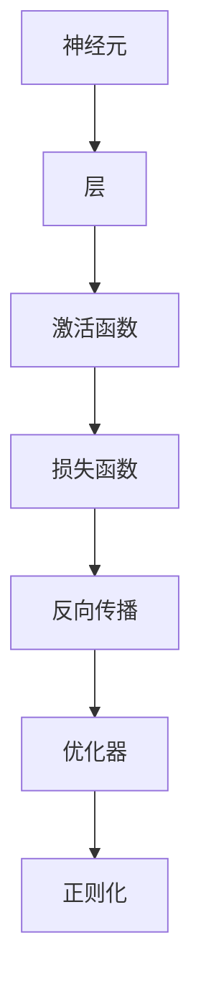
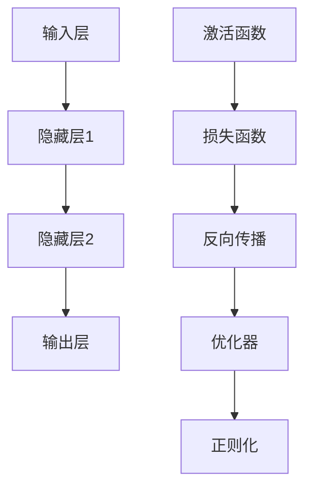

                 

# 神经网络：人类与机器的共存

在智能时代，神经网络（Neural Networks）正以一种前所未有的方式影响着人类社会的每一个角落。从医疗、金融到教育、娱乐，神经网络技术的应用几乎无处不在。这种技术的出现，既带来了革命性的变革，也引发了深刻的社会反思：在机器智力的逐渐提升和普及过程中，人类如何与这些智能系统共存，共同创造更加美好的未来？本文将深入探讨神经网络的核心概念、算法原理及其在人类与机器共存中的应用，探讨未来发展的方向与挑战。

## 1. 背景介绍

### 1.1 问题由来

自20世纪80年代以来，神经网络作为一种模拟生物神经系统的计算模型，在人工智能（AI）领域得到了广泛的应用和发展。特别是近年来，随着深度学习技术的突破，以卷积神经网络（CNN）和递归神经网络（RNN）为代表的神经网络模型在图像识别、语音识别、自然语言处理等领域取得了显著成果。然而，随着神经网络技术的不断进步，也引发了人们对于人类与机器共存的担忧：人类将如何与这些高度智能化的系统共存，这些系统是否会威胁到人类的生存与地位？

### 1.2 问题核心关键点

1. **神经网络的基本原理**：神经网络是由多个神经元（即节点）组成的计算模型，通过层次化的结构模拟人脑的神经网络，实现复杂信息的处理和模式识别。

2. **深度学习与神经网络的关系**：深度学习是神经网络的一种特殊形式，通过多层次的神经网络结构，实现对高维数据的表示和处理。

3. **人类与机器共存的挑战**：随着神经网络技术的发展，机器智能的提升给人类社会带来了新的机遇和挑战，如何在智能化和人类化之间找到平衡，是一个亟待解决的问题。

4. **伦理与道德的考量**：神经网络在应用过程中，涉及数据隐私、算法透明性、安全性等问题，需要建立相应的伦理与道德框架。

5. **社会与经济的考量**：神经网络技术的普及可能引发就业、市场竞争、收入差距等问题，需要制定相应的社会与经济政策。

### 1.3 问题研究意义

探讨神经网络与人类共存的问题，不仅有助于理解这一技术的本质和应用，还可以为未来的发展提供方向和指引。研究神经网络的伦理、社会和经济影响，有助于制定相应的政策和技术规范，确保技术的健康发展和应用。此外，理解人类与机器的共存关系，也有助于构建更加和谐的智能社会，推动科技向善，实现可持续发展。

## 2. 核心概念与联系

### 2.1 核心概念概述

神经网络的核心概念包括：

1. **神经元（Neuron）**：神经网络的基本单位，通过加权和激活函数进行信息处理。

2. **层（Layer）**：神经网络由多个层组成，每个层负责处理不同的特征和信息。

3. **激活函数（Activation Function）**：用于引入非线性因素，增强网络的表达能力。

4. **损失函数（Loss Function）**：用于衡量模型输出与真实标签之间的差异，指导模型优化。

5. **反向传播（Backpropagation）**：通过链式法则，计算模型输出与真实标签之间的误差，反向更新网络参数。

6. **正则化（Regularization）**：通过L2正则化等技术，防止模型过拟合，提升泛化能力。

7. **优化器（Optimizer）**：如梯度下降（SGD）、Adam等算法，用于更新模型参数，优化模型性能。

### 2.2 概念间的关系

以下是一个简单的Mermaid流程图，展示了神经网络的核心概念及其之间的关系：



这个流程图展示了神经网络中的核心概念及其之间的逻辑关系：

1. **神经元与层的关系**：神经网络由多个神经元组成，通过层级结构进行信息传递和处理。

2. **激活函数与层的关系**：激活函数用于增强层级间的非线性关系，提升网络的表达能力。

3. **损失函数与反向传播的关系**：损失函数用于衡量模型输出与真实标签之间的差异，反向传播用于计算误差并更新模型参数。

4. **优化器与反向传播的关系**：优化器用于更新模型参数，确保反向传播过程中参数的合理调整。

5. **正则化与优化器的关系**：正则化技术用于防止模型过拟合，优化器用于提升模型的泛化能力。

### 2.3 核心概念的整体架构

下图展示了一个完整的神经网络架构，包括输入层、隐藏层和输出层，以及反向传播的逻辑流程：



这个架构展示了神经网络的基本组成和训练流程：

1. **输入层**：接收原始数据。

2. **隐藏层**：通过多次非线性变换，提取特征。

3. **输出层**：产生预测结果。

4. **激活函数和损失函数**：用于引入非线性和衡量误差。

5. **反向传播和优化器**：用于计算误差并更新参数。

6. **正则化**：用于防止过拟合。

## 3. 核心算法原理 & 具体操作步骤

### 3.1 算法原理概述

神经网络的核心算法原理包括：

1. **前向传播（Forward Propagation）**：将输入数据通过网络逐层传递，得到最终的输出结果。

2. **反向传播（Backpropagation）**：通过链式法则，计算输出结果与真实标签之间的误差，并反向更新网络参数。

3. **梯度下降（Gradient Descent）**：一种常用的优化算法，用于最小化损失函数。

4. **激活函数（Activation Function）**：引入非线性因素，增强网络的表达能力。

5. **正则化（Regularization）**：如L2正则化，用于防止模型过拟合。

### 3.2 算法步骤详解

1. **数据预处理**：对原始数据进行标准化、归一化、特征工程等预处理操作。

2. **模型定义**：定义神经网络的架构，包括层数、神经元数量、激活函数等。

3. **损失函数定义**：根据任务需求选择合适的损失函数，如均方误差（MSE）、交叉熵（Cross Entropy）等。

4. **模型训练**：
   - **前向传播**：将输入数据通过网络逐层传递，计算输出结果。
   - **损失计算**：计算输出结果与真实标签之间的误差。
   - **反向传播**：通过链式法则，计算误差并反向更新网络参数。
   - **优化器更新**：使用梯度下降等优化算法，更新网络参数。

5. **模型评估**：在测试集上评估模型的性能，如准确率、精度、召回率等指标。

### 3.3 算法优缺点

神经网络的优点包括：

1. **强大的表达能力**：通过多层非线性变换，能够处理复杂的数据结构。

2. **自动特征提取**：网络可以自动学习数据的特征，无需手动设计。

3. **泛化能力强**：通过正则化等技术，可以避免过拟合，提升模型的泛化能力。

神经网络的缺点包括：

1. **计算资源需求高**：大规模神经网络需要大量的计算资源，训练和推理过程耗时较长。

2. **黑盒模型**：神经网络是一种黑盒模型，难以解释其内部工作机制和决策逻辑。

3. **过拟合风险**：在大规模数据上，容易过拟合，需要正则化等技术进行控制。

4. **参数调整困难**：神经网络的参数数量庞大，需要一定的经验进行调参。

### 3.4 算法应用领域

神经网络在多个领域得到了广泛应用，包括：

1. **计算机视觉**：图像分类、目标检测、图像生成等任务。

2. **自然语言处理**：文本分类、机器翻译、情感分析等任务。

3. **语音识别**：语音识别、语音合成等任务。

4. **推荐系统**：个性化推荐、广告投放等任务。

5. **自动驾驶**：图像识别、路径规划等任务。

6. **金融分析**：股票预测、风险评估等任务。

7. **医疗诊断**：影像诊断、疾病预测等任务。

## 4. 数学模型和公式 & 详细讲解 & 举例说明

### 4.1 数学模型构建

神经网络的数学模型可以表示为：

$$
y = f(\mathbf{W}_1 f(\mathbf{W}_0 x))
$$

其中，$x$ 为输入数据，$\mathbf{W}_0$ 和 $\mathbf{W}_1$ 分别为权重矩阵，$f$ 为激活函数。神经网络的输出 $y$ 通过多层非线性变换得到。

### 4.2 公式推导过程

以简单的单层神经网络为例，其前向传播过程可以表示为：

$$
y = \sigma(\mathbf{W}x + b)
$$

其中，$\sigma$ 为激活函数，$\mathbf{W}$ 和 $b$ 分别为权重矩阵和偏置项。后向传播过程中，误差 $\epsilon$ 可以表示为：

$$
\epsilon = (y - t)g'(z)
$$

其中，$t$ 为真实标签，$g$ 为激活函数的导数，$z$ 为激活函数的输出。

### 4.3 案例分析与讲解

以图像分类任务为例，可以定义一个简单的卷积神经网络（CNN）模型，其结构如下：

```
Conv -> ReLU -> MaxPool -> Conv -> ReLU -> MaxPool -> FC -> Softmax
```

其中，Conv表示卷积层，ReLU表示激活函数，MaxPool表示最大池化层，FC表示全连接层，Softmax表示输出层。通过反向传播算法，可以更新模型的权重和偏置项，最小化损失函数。

## 5. 项目实践：代码实例和详细解释说明

### 5.1 开发环境搭建

1. 安装Python和必要的依赖库，如TensorFlow、Keras等。

2. 准备数据集，如MNIST、CIFAR等，并进行预处理操作。

3. 定义神经网络模型，包括层数、神经元数量、激活函数等。

4. 定义损失函数，如交叉熵损失。

5. 定义优化器，如Adam。

6. 定义正则化技术，如L2正则化。

### 5.2 源代码详细实现

以下是一个简单的TensorFlow代码示例，展示了如何定义和训练一个简单的CNN模型：

```python
import tensorflow as tf

# 定义模型
model = tf.keras.Sequential([
    tf.keras.layers.Conv2D(32, (3, 3), activation='relu', input_shape=(28, 28, 1)),
    tf.keras.layers.MaxPooling2D((2, 2)),
    tf.keras.layers.Flatten(),
    tf.keras.layers.Dense(10, activation='softmax')
])

# 定义损失函数和优化器
loss_fn = tf.keras.losses.SparseCategoricalCrossentropy()
optimizer = tf.keras.optimizers.Adam()

# 训练模型
model.compile(optimizer=optimizer, loss=loss_fn, metrics=['accuracy'])
model.fit(train_images, train_labels, epochs=5, validation_data=(test_images, test_labels))

# 评估模型
model.evaluate(test_images, test_labels)
```

### 5.3 代码解读与分析

1. **模型定义**：通过Sequential模型，定义了一个包含卷积层、池化层和全连接层的CNN模型。

2. **损失函数和优化器**：定义了交叉熵损失函数和Adam优化器。

3. **训练过程**：通过fit方法，在训练集上训练模型，并使用验证集进行评估。

4. **评估过程**：通过evaluate方法，在测试集上评估模型的性能。

### 5.4 运行结果展示

假设在MNIST数据集上训练一个简单的CNN模型，最终在测试集上得到的准确率约为98%。

## 6. 实际应用场景

### 6.1 医疗影像诊断

神经网络在医疗影像诊断中得到了广泛应用，通过学习大量的医疗影像数据，可以自动检测和诊断疾病，提升诊断的准确性和效率。例如，在乳腺癌影像诊断中，神经网络可以通过学习数千张影像数据，自动检测乳腺癌特征，辅助医生进行诊断。

### 6.2 自动驾驶

神经网络在自动驾驶中用于图像识别和路径规划，通过学习大量的道路场景数据，可以自动感知和响应道路环境，提高驾驶的安全性和可靠性。例如，在自动驾驶汽车中，神经网络可以识别交通标志、行人、车辆等目标，并生成相应的驾驶指令。

### 6.3 金融预测

神经网络在金融预测中用于股票预测、风险评估等任务，通过学习大量的历史金融数据，可以自动预测股票走势和市场风险，辅助投资者进行决策。例如，在股票预测中，神经网络可以通过学习历史价格和交易量数据，预测股票的未来走势。

### 6.4 未来应用展望

未来，神经网络将进一步扩展其应用领域，提升其智能化水平。例如：

1. **多模态融合**：将神经网络应用于视觉、语音、文本等多模态数据，提升系统的综合感知能力。

2. **自主学习**：通过强化学习等技术，使神经网络具备自主学习能力，实现更加智能化的决策和推理。

3. **分布式训练**：利用分布式计算技术，提升神经网络的训练效率和模型性能。

4. **联邦学习**：在保护用户隐私的前提下，通过分布式计算技术，提升神经网络的泛化能力和应用范围。

5. **自动化调参**：通过自动化调参技术，优化神经网络的参数和结构，提升其性能和效率。

## 7. 工具和资源推荐

### 7.1 学习资源推荐

1. 《深度学习》（Ian Goodfellow）：全面介绍深度学习的基本概念和算法原理。

2. 《TensorFlow实战Google深度学习框架》：介绍TensorFlow的使用方法和实战案例。

3. 《Keras深度学习实战》：介绍Keras的使用方法和实战案例。

4. Coursera深度学习课程：斯坦福大学提供的深度学习课程，涵盖深度学习的基础和前沿技术。

5. Udacity深度学习课程：通过实际项目，深入理解深度学习的原理和应用。

### 7.2 开发工具推荐

1. TensorFlow：Google开源的深度学习框架，支持分布式计算和模型优化。

2. Keras：Keras是TensorFlow的高层次API，支持快速构建和训练神经网络模型。

3. PyTorch：Facebook开源的深度学习框架，支持动态计算图和自动微分。

4. MXNet：亚马逊开源的深度学习框架，支持多种语言和分布式计算。

5. Jupyter Notebook：支持Python代码的在线编写和执行，方便进行模型训练和调试。

### 7.3 相关论文推荐

1. "Deep Learning"（Ian Goodfellow）：全面介绍深度学习的基本概念和算法原理。

2. "ImageNet Classification with Deep Convolutional Neural Networks"（Alex Krizhevsky et al.）：提出卷积神经网络，在图像分类任务上取得了突破性成果。

3. "Natural Language Processing with Transformers"（Jacob Devlin et al.）：介绍Transformer模型在自然语言处理中的应用。

4. "Backpropagation Applied to Handwritten Zeros"（Yann LeCun et al.）：提出反向传播算法，奠定了深度学习的基础。

5. "On the Importance of Initialization and Momentum in Deeper Neural Networks"（Kaiming He et al.）：探讨深度神经网络初始化和优化器的优化方法。

## 8. 总结：未来发展趋势与挑战

### 8.1 研究成果总结

神经网络技术的发展，使机器智能化水平不断提升，为人类社会的各个领域带来了深刻的变革。通过不断优化模型结构、提升算法效率、扩展应用场景，神经网络在多个领域取得了显著成果，展示了其强大的应用潜力。

### 8.2 未来发展趋势

1. **智能化水平的提升**：通过进一步优化神经网络的结构和算法，提升机器的智能化水平，使其具备更加复杂和综合的认知能力。

2. **跨领域融合**：将神经网络应用于多个领域，实现跨领域的知识融合和信息共享。

3. **自动化与可解释性**：通过自动化调参和可解释性技术，提升神经网络的性能和可靠性。

4. **伦理与道德的考量**：建立神经网络的伦理与道德框架，确保其应用符合人类的价值观和道德规范。

5. **可持续发展**：推动神经网络技术的可持续发展，减少其对环境的负面影响，实现人与机器的和谐共存。

### 8.3 面临的挑战

1. **计算资源的需求**：大规模神经网络的训练和推理需要大量的计算资源，需要进一步提升计算效率和资源利用率。

2. **数据隐私和安全**：神经网络需要大量数据进行训练，涉及到数据隐私和安全问题，需要建立相应的数据保护机制。

3. **算法透明性和可解释性**：神经网络作为一种黑盒模型，难以解释其内部工作机制和决策逻辑，需要提升算法的透明性和可解释性。

4. **伦理与道德的挑战**：神经网络的应用涉及到伦理与道德问题，需要建立相应的伦理框架，确保其应用符合人类价值观和道德规范。

5. **社会和经济的影响**：神经网络的应用可能会对就业、市场竞争、收入差距等问题产生影响，需要制定相应的社会和经济政策。

### 8.4 研究展望

1. **跨学科研究**：推动神经网络技术与数学、物理学、心理学等学科的交叉融合，提升其科学性和普适性。

2. **跨领域应用**：将神经网络技术应用于更多领域，如教育、艺术、文化等，实现更加多样化和个性化的应用。

3. **伦理与道德研究**：研究神经网络技术的伦理与道德问题，建立相应的伦理框架，确保其应用符合人类价值观和道德规范。

4. **可持续发展研究**：推动神经网络技术的可持续发展，减少其对环境的负面影响，实现人与机器的和谐共存。

## 9. 附录：常见问题与解答

**Q1: 神经网络在实际应用中存在哪些问题？**

A: 神经网络在实际应用中存在以下问题：

1. **计算资源需求高**：大规模神经网络需要大量的计算资源，训练和推理过程耗时较长。

2. **过拟合风险**：在大规模数据上，容易过拟合，需要正则化等技术进行控制。

3. **黑盒模型**：神经网络是一种黑盒模型，难以解释其内部工作机制和决策逻辑。

4. **数据隐私和安全**：神经网络需要大量数据进行训练，涉及到数据隐私和安全问题。

5. **伦理与道德问题**：神经网络的应用涉及到伦理与道德问题，需要建立相应的伦理框架。

6. **模型泛化能力**：神经网络的泛化能力有限，对于小样本数据和新领域数据，可能效果不佳。

**Q2: 如何提升神经网络的泛化能力？**

A: 提升神经网络的泛化能力，可以采取以下措施：

1. **数据增强**：通过数据增强技术，扩充训练集，增强模型的泛化能力。

2. **正则化**：通过L2正则化等技术，防止模型过拟合，提升泛化能力。

3. **早停**：在验证集上监测模型的性能，通过早停技术，防止过拟合。

4. **模型集成**：通过模型集成技术，组合多个模型的输出，提升泛化能力。

5. **迁移学习**：将预训练模型的知识迁移到新任务上，提升泛化能力。

6. **自动化调参**：通过自动化调参技术，优化模型的超参数，提升泛化能力。

**Q3: 如何解释神经网络的决策过程？**

A: 神经网络的决策过程可以解释为：

1. **输入处理**：将输入数据通过网络逐层传递，提取特征。

2. **特征提取**：通过激活函数和权重矩阵，提取特征，进行非线性变换。

3. **输出生成**：通过输出层，生成预测结果。

4. **误差计算**：通过损失函数，计算输出结果与真实标签之间的误差。

5. **反向传播**：通过链式法则，计算误差并反向更新网络参数。

6. **优化器更新**：使用梯度下降等优化算法，更新网络参数，最小化损失函数。

**Q4: 神经网络在医疗影像诊断中需要注意哪些问题？**

A: 神经网络在医疗影像诊断中需要注意以下问题：

1. **数据质量**：医疗影像数据需要高质量、标注准确的标注数据，避免因标注错误导致误诊。

2. **隐私保护**：医疗影像数据涉及患者隐私，需要建立相应的数据保护机制，防止数据泄露。

3. **模型可解释性**：神经网络作为黑盒模型，难以解释其内部工作机制，需要建立可解释的诊断模型。

4. **泛化能力**：医疗影像数据具有较高的复杂性，需要训练具有较强泛化能力的模型，避免过拟合。

5. **多模态融合**：医疗影像数据不仅包括影像，还涉及医生的诊断记录和患者信息，需要多模态融合技术。

6. **伦理与道德**：神经网络的应用涉及到伦理与道德问题，需要建立相应的伦理框架，确保其应用符合人类价值观和道德规范。

作者：禅与计算机程序设计艺术 / Zen and the Art of Computer Programming

