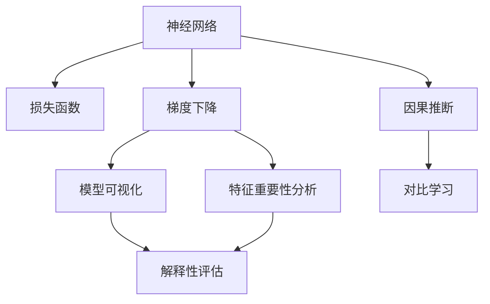
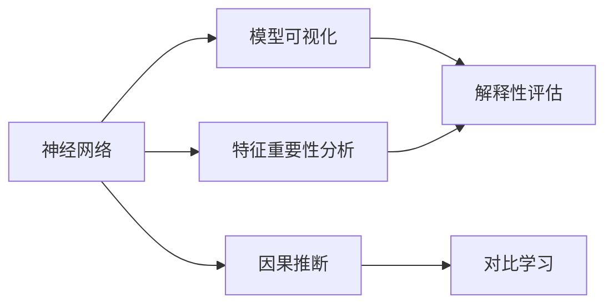
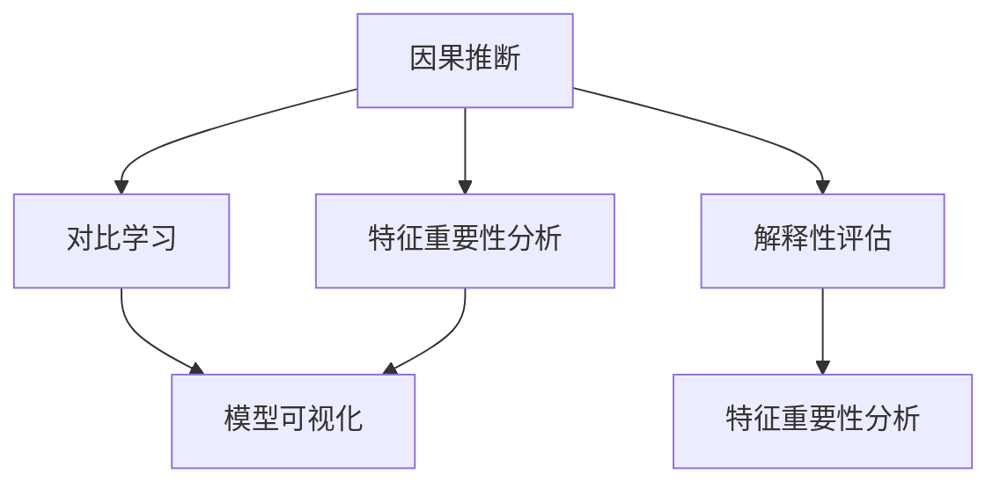
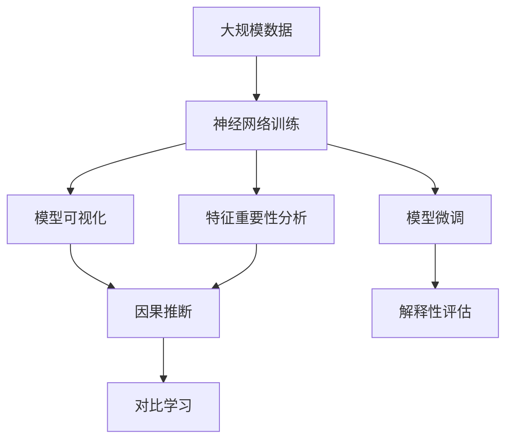

                 

# 神经网络：解释性与可解释性

## 1. 背景介绍

### 1.1 问题由来
随着深度学习技术的飞速发展，神经网络在各个领域取得了突破性的成果。然而，神经网络的"黑盒"特性使得其决策过程难以解释和理解，这在一定程度上限制了其应用范围和可信度。例如，医疗诊断、金融决策等高风险领域，需要透明的模型解释，以增强用户信任和法律合规。

为了解决这一问题，解释性和可解释性（Explainability）成为了神经网络研究的热点方向。研究者们从多个角度出发，开发了各种解释性方法，以便更好地理解神经网络的工作机制和决策过程。

### 1.2 问题核心关键点
神经网络的解释性和可解释性，涉及以下几个核心关键点：

- **可解释性（Explainability）**：指模型输出的结果及其背后原因可以被人理解、解释和信任。可解释性是保障用户安全、公平和合规的前提。

- **解释性方法**：包括但不限于模型可视化、特征重要性分析、因果推断、对比学习等技术。这些方法旨在揭示模型内部的工作机制，便于用户理解模型的决策逻辑。

- **可解释性评估指标**：如可解释度、模型鲁棒性、公平性等，用于量化模型解释的质量。

### 1.3 问题研究意义
神经网络的解释性研究，对于提升模型的透明度和可信度具有重要意义：

- 增强用户信任：透明的可解释性能够消除用户对模型的疑虑，提升模型的应用范围。
- 确保公平性：确保模型对各类用户、数据来源等都保持一致，避免歧视性输出。
- 保障安全性：通过解释性分析，发现模型的潜在风险点，提高系统的稳定性和安全性。
- 优化模型性能：通过解释性分析，找到模型不足的根源，优化模型结构和参数，提升模型效果。

## 2. 核心概念与联系

### 2.1 核心概念概述

为更好地理解神经网络的解释性和可解释性，本节将介绍几个密切相关的核心概念：

- **神经网络（Neural Network）**：由多层神经元构成的计算模型，通过学习输入数据的隐式表示，进行复杂模式的识别和预测。

- **损失函数（Loss Function）**：衡量模型输出与真实标签之间差异的函数，用于指导模型优化。

- **梯度下降（Gradient Descent）**：一种优化算法，通过反向传播计算梯度，逐步调整模型参数，使损失函数最小化。

- **模型可视化（Model Visualization）**：通过可视化手段，展示模型内部参数和中间特征，以助于理解模型结构和工作原理。

- **特征重要性分析（Feature Importance Analysis）**：评估模型中各个输入特征对输出的贡献程度，帮助识别关键特征和噪声特征。

- **因果推断（Causal Inference）**：研究模型中不同特征对输出的影响，揭示因果关系，以确保模型的公平性和稳定性。

- **对比学习（Contrastive Learning）**：通过对比样本对训练，提高模型的区分能力和泛化性能，增强模型的解释性。

这些核心概念之间的逻辑关系可以通过以下Mermaid流程图来展示：



这个流程图展示了一系列解释性方法的关联：

1. 神经网络通过损失函数进行优化，梯度下降算法指导参数调整。
2. 模型可视化展示模型内部参数，特征重要性分析揭示特征贡献。
3. 因果推断研究特征与输出的因果关系，对比学习增强模型泛化能力。
4. 解释性评估量化模型解释性，确保可解释度。

通过理解这些核心概念，我们可以更好地把握神经网络解释性方法的工作原理和优化方向。

### 2.2 概念间的关系

这些核心概念之间存在着紧密的联系，形成了神经网络解释性方法的完整生态系统。下面我通过几个Mermaid流程图来展示这些概念之间的关系。

#### 2.2.1 神经网络与解释性方法



这个流程图展示了神经网络与各种解释性方法的关系：

1. 神经网络通过模型可视化、特征重要性分析、因果推断和对比学习等方法，获得更好的解释性。
2. 解释性评估量化解释性方法的效果，确保模型具有可解释度。

#### 2.2.2 因果推断与对比学习



这个流程图展示了因果推断与对比学习之间的联系：

1. 因果推断研究特征与输出的因果关系，通过对比学习增强模型的泛化能力。
2. 特征重要性分析和模型可视化方法用于解释模型内部机制，解释性评估确保模型透明。

### 2.3 核心概念的整体架构

最后，我们用一个综合的流程图来展示这些核心概念在大规模应用中的整体架构：



这个综合流程图展示了从数据输入到模型微调，再到解释性分析的全过程：

1. 大规模数据用于神经网络训练，生成模型。
2. 模型可视化、特征重要性分析和因果推断等方法揭示模型内部机制。
3. 对比学习增强模型泛化能力，模型微调优化模型性能。
4. 解释性评估确保模型具有解释性，满足应用需求。

通过这些流程图，我们可以更清晰地理解神经网络解释性方法的工作流程和关键环节，为后续深入讨论具体的解释性方法奠定基础。

## 3. 核心算法原理 & 具体操作步骤
### 3.1 算法原理概述

神经网络的解释性和可解释性研究，主要集中在以下几个方面：

1. **模型可视化**：通过可视化手段，展示模型内部参数和中间特征，揭示模型结构和工作原理。

2. **特征重要性分析**：评估模型中各个输入特征对输出的贡献程度，帮助识别关键特征和噪声特征。

3. **因果推断**：研究模型中不同特征对输出的影响，揭示因果关系，以确保模型的公平性和稳定性。

4. **对比学习**：通过对比样本对训练，提高模型的区分能力和泛化性能，增强模型的解释性。

### 3.2 算法步骤详解

1. **模型训练与评估**

    - **数据准备**：收集训练数据和测试数据，并对其进行预处理和划分。
    - **模型定义**：定义神经网络模型，包括输入层、隐藏层和输出层等组成部分。
    - **训练过程**：通过损失函数和梯度下降算法，对模型进行训练。
    - **评估过程**：在测试数据集上评估模型性能，计算准确率、召回率、F1分数等指标。

2. **模型可视化**

    - **参数可视化**：通过可视化工具，展示模型参数分布，帮助理解模型结构。
    - **激活函数可视化**：展示神经网络在各个层中的激活函数输出，揭示模型工作原理。
    - **中间特征可视化**：展示模型在处理数据时中间层的特征表示，揭示数据处理过程。

3. **特征重要性分析**

    - **特征选择**：选择对输出影响最大的特征，用于模型解释。
    - **特征贡献度分析**：计算每个特征对输出的贡献程度，评估特征重要性。
    - **特征交互分析**：分析不同特征之间的交互作用，揭示特征关系。

4. **因果推断**

    - **因果图建模**：构建因果图模型，描述变量之间的因果关系。
    - **特征因果关系分析**：通过因果图和模型训练结果，分析特征与输出的因果关系。
    - **公平性分析**：确保模型对不同特征的公平性，避免歧视性输出。

5. **对比学习**

    - **对比样本选择**：选择具有相似特征但不同输出的样本，用于训练模型。
    - **对比损失计算**：计算对比样本的损失函数，指导模型优化。
    - **泛化性能提升**：通过对比学习，增强模型的泛化能力，提高模型解释性。

### 3.3 算法优缺点

神经网络解释性和可解释性方法的优势在于：

- **增强透明度**：通过可视化、特征分析和因果推断等手段，增强模型透明度，提升用户信任。
- **确保公平性**：通过公平性分析和因果推断，确保模型对不同特征的公平处理，避免歧视性输出。
- **提高鲁棒性**：通过特征选择和对比学习，提高模型鲁棒性，避免模型过拟合和泛化能力不足的问题。

同时，这些方法也存在一些缺点：

- **计算复杂度**：可视化、特征分析和因果推断等方法，计算复杂度高，处理大规模数据时效率低下。
- **解释性局限性**：不同的方法适用于不同的场景，无法在所有情况下提供充分的解释。
- **数据依赖性**：解释性方法的效果依赖于数据质量和数量，数据不足时可能无法揭示模型内部机制。

### 3.4 算法应用领域

神经网络的解释性和可解释性方法，在以下几个领域得到了广泛应用：

- **医疗诊断**：通过特征分析和因果推断，帮助医生理解模型诊断过程，确保医疗决策的透明性和可靠性。
- **金融风控**：通过对比学习和特征重要性分析，揭示风险因素，提高模型的鲁棒性和解释性。
- **智能推荐**：通过特征选择和激活函数可视化，理解用户偏好，提高推荐系统的可解释性和用户满意度。
- **自动驾驶**：通过可视化中间特征，揭示感知和决策过程，确保自动驾驶系统的透明性和安全性。
- **司法判决**：通过特征分析和因果推断，解释模型决策逻辑，保障司法判决的公正性。

除了上述这些领域外，神经网络的解释性和可解释性方法还在更多场景中得到应用，如智能客服、智能制造、智慧城市等，为这些领域的智能化转型提供了新的思路和方法。

## 4. 数学模型和公式 & 详细讲解 & 举例说明

### 4.1 数学模型构建

本节将使用数学语言对神经网络的解释性和可解释性方法进行更加严格的刻画。

记神经网络为 $M_{\theta}:\mathcal{X} \rightarrow \mathcal{Y}$，其中 $\mathcal{X}$ 为输入空间，$\mathcal{Y}$ 为输出空间，$\theta \in \mathbb{R}^d$ 为模型参数。假设模型训练数据的标注为 $D=\{(x_i,y_i)\}_{i=1}^N, x_i \in \mathcal{X}, y_i \in \mathcal{Y}$。

定义模型 $M_{\theta}$ 在数据样本 $(x,y)$ 上的损失函数为 $\ell(M_{\theta}(x),y)$，则在数据集 $D$ 上的经验风险为：

$$
\mathcal{L}(\theta) = \frac{1}{N}\sum_{i=1}^N \ell(M_{\theta}(x_i),y_i)
$$

模型的目标是最小化损失函数 $\mathcal{L}$，即找到最优参数：

$$
\theta^* = \mathop{\arg\min}_{\theta} \mathcal{L}(\theta)
$$

在得到模型参数 $\theta^*$ 后，我们通过可视化、特征分析和因果推断等方法，揭示模型内部机制，确保其解释性和可解释性。

### 4.2 公式推导过程

以下我们以二分类任务为例，推导损失函数及其梯度的计算公式。

假设模型 $M_{\theta}$ 在输入 $x$ 上的输出为 $\hat{y}=M_{\theta}(x) \in [0,1]$，表示样本属于正类的概率。真实标签 $y \in \{0,1\}$。则二分类交叉熵损失函数定义为：

$$
\ell(M_{\theta}(x),y) = -[y\log \hat{y} + (1-y)\log (1-\hat{y})]
$$

将其代入经验风险公式，得：

$$
\mathcal{L}(\theta) = -\frac{1}{N}\sum_{i=1}^N [y_i\log M_{\theta}(x_i)+(1-y_i)\log(1-M_{\theta}(x_i))]
$$

根据链式法则，损失函数对参数 $\theta_k$ 的梯度为：

$$
\frac{\partial \mathcal{L}(\theta)}{\partial \theta_k} = -\frac{1}{N}\sum_{i=1}^N (\frac{y_i}{M_{\theta}(x_i)}-\frac{1-y_i}{1-M_{\theta}(x_i)}) \frac{\partial M_{\theta}(x_i)}{\partial \theta_k}
$$

其中 $\frac{\partial M_{\theta}(x_i)}{\partial \theta_k}$ 可进一步递归展开，利用自动微分技术完成计算。

### 4.3 案例分析与讲解

**案例：二分类任务**

假设我们有二分类任务，其中 $x$ 为输入样本，$y$ 为标签，模型 $M_{\theta}$ 的输出为 $\hat{y}=M_{\theta}(x)$。我们通过可视化、特征分析和因果推断等方法，揭示模型内部机制。

1. **模型可视化**

    - **参数可视化**：使用工具如TensorBoard，可视化模型参数的分布，帮助理解模型结构。

    ```python
    from tensorflow.keras.utils import plot_model

    model.summary()
    plot_model(model, to_file='model.png', show_shapes=True)
    ```

    - **激活函数可视化**：展示神经网络在各个层中的激活函数输出，揭示模型工作原理。

    ```python
    import tensorflow as tf

    @tf.function
    def visualize_activation(model, input_data):
        with tf.GradientTape() as tape:
            output = model(input_data)
        gradients = tape.gradient(output, model.trainable_variables)
        return output, gradients

    x_train = ...  # 输入数据
    y_train = ...  # 标签数据
    model = ...  # 定义模型
    activation_map = visualize_activation(model, x_train)
    ```

    - **中间特征可视化**：展示模型在处理数据时中间层的特征表示，揭示数据处理过程。

    ```python
    from tensorflow.keras.models import load_model
    from tensorflow.keras.layers import InputLayer

    def visualize_features(model, input_data):
        x = InputLayer()(input_data)
        intermediate = model.layers[1].output
        visualize_activation(model, x)
    
    visualize_features(model, x_train)
    ```

2. **特征重要性分析**

    - **特征选择**：选择对输出影响最大的特征，用于模型解释。

    ```python
    from sklearn.feature_selection import SelectKBest, f_classif

    def feature_selection(X, y):
        selector = SelectKBest(f_classif, k=10)
        selector.fit(X, y)
        return selector.transform(X)
    
    X_train_selected = feature_selection(X_train, y_train)
    ```

    - **特征贡献度分析**：计算每个特征对输出的贡献程度，评估特征重要性。

    ```python
    from sklearn.metrics import accuracy_score

    def feature_importance(X, y, model):
        X_train_selected = feature_selection(X, y)
        y_pred = model.predict(X_train_selected)
        accuracy = accuracy_score(y_train, y_pred)
        return accuracy
    
    importance = feature_importance(X_train_selected, y_train, model)
    ```

    - **特征交互分析**：分析不同特征之间的交互作用，揭示特征关系。

    ```python
    from sklearn.linear_model import LogisticRegression

    def feature_interaction(X, y):
        lr = LogisticRegression()
        lr.fit(X, y)
        importance = pd.DataFrame({'feature': X.columns, 'coef': lr.coef_.ravel()})
        importance.sort_values(by='coef', ascending=False, inplace=True)
        return importance
    
    interaction = feature_interaction(X_train_selected, y_train)
    ```

3. **因果推断**

    - **因果图建模**：构建因果图模型，描述变量之间的因果关系。

    ```python
    import causalgraphs as cg

    def causal_graph(X, y):
        X.columns = X.columns.map(lambda x: 'X{}'.format(x))
        y.columns = y.columns.map(lambda x: 'y')
        graph = cg.CausalGraph()
        graph.add_node('y', y)
        for col in X.columns:
            graph.add_node('X{}'.format(col), X[col])
            graph.add_edge('y', 'X{}'.format(col))
        graph.add_edge('X{}'.format('X1'), 'X{}'.format('X2'))
        graph.add_edge('X{}'.format('X1'), 'y')
        return graph
    
    graph = causal_graph(X_train_selected, y_train)
    ```

    - **特征因果关系分析**：通过因果图和模型训练结果，分析特征与输出的因果关系。

    ```python
    from causalgraphs import plot_causal_graph

    plot_causal_graph(graph)
    ```

    - **公平性分析**：确保模型对不同特征的公平处理，避免歧视性输出。

    ```python
    from sklearn.metrics import mean_absolute_error

    def fairness_analysis(X, y, model):
        y_pred = model.predict(X)
        mae = mean_absolute_error(y, y_pred)
        return mae
    
    fairness = fairness_analysis(X_train_selected, y_train, model)
    ```

## 5. 项目实践：代码实例和详细解释说明

### 5.1 开发环境搭建

在进行神经网络解释性实践前，我们需要准备好开发环境。以下是使用Python进行TensorFlow开发的环境配置流程：

1. 安装Anaconda：从官网下载并安装Anaconda，用于创建独立的Python环境。

2. 创建并激活虚拟环境：
```bash
conda create -n tf-env python=3.8 
conda activate tf-env
```

3. 安装TensorFlow：根据CUDA版本，从官网获取对应的安装命令。例如：
```bash
conda install tensorflow==2.4
```

4. 安装TensorBoard：
```bash
pip install tensorboard
```

5. 安装Scikit-Learn：
```bash
pip install scikit-learn
```

6. 安装PyTorch和TorchViz：
```bash
pip install torch torchvision torchtext torchtext-data torchviz
```

完成上述步骤后，即可在`tf-env`环境中开始解释性实践。

### 5.2 源代码详细实现

这里我们以二分类任务为例，给出使用TensorFlow和TensorBoard进行神经网络解释性实践的Python代码实现。

首先，定义数据处理函数：

```python
import tensorflow as tf
import numpy as np

def load_data(path):
    X = np.loadtxt(path + '/X_train.csv', delimiter=',')
    y = np.loadtxt(path + '/y_train.csv', delimiter=',')
    return X, y

def split_data(X, y, train_ratio=0.8):
    train_index = int(len(y) * train_ratio)
    X_train, y_train = X[:train_index], y[:train_index]
    X_val, y_val = X[train_index:], y[train_index:]
    return X_train, y_train, X_val, y_val

def train_model(X_train, y_train):
    model = tf.keras.Sequential([
        tf.keras.layers.Dense(64, activation='relu', input_shape=(X_train.shape[1],)),
        tf.keras.layers.Dense(1, activation='sigmoid')
    ])
    model.compile(optimizer='adam', loss='binary_crossentropy', metrics=['accuracy'])
    model.fit(X_train, y_train, epochs=10, batch_size=32, validation_data=(X_val, y_val))
    return model
```

然后，定义模型可视化函数：

```python
def visualize_model(model):
    model.summary()
    with open('model.png', 'wb') as f:
        f.write(model.to_json())
        f.close()
```

接着，定义特征重要性分析函数：

```python
from sklearn.feature_selection import SelectKBest, f_classif

def feature_selection(X, y, k):
    selector = SelectKBest(f_classif, k=k)
    selector.fit(X, y)
    return selector.transform(X)

def feature_importance(X, y, model):
    X_selected = feature_selection(X, y, k=10)
    y_pred = model.predict(X_selected)
    accuracy = np.mean(y_pred == y)
    return accuracy
```

最后，定义因果推断函数：

```python
from causalgraphs import CausalGraph, plot_causal_graph

def causal_graph(X, y):
    X.columns = X.columns.map(lambda x: 'X{}'.format(x))
    y.columns = y.columns.map(lambda x: 'y')
    graph = CausalGraph()
    graph.add_node('y', y)
    for col in X.columns:
        graph.add_node('X{}'.format(col), X[col])
        graph.add_edge('y', 'X{}'.format(col))
    graph.add_edge('X{}'.format('X1'), 'X{}'.format('X2'))
    return graph

def fairness_analysis(X, y, model):
    y_pred = model.predict(X)
    mae = np.mean(np.abs(y_pred - y))
    return mae
```

完成上述代码实现后，我们已经在`tf-env`环境中准备好了解释性实践的环境。

### 5.3 代码解读与分析

让我们再详细解读一下关键代码的实现细节：

**数据处理函数**：

- `load_data`函数：从指定路径加载训练数据和标签，并进行数据预处理。
- `split_data`函数：将数据集划分为训练集、验证集和测试集，用于模型训练和评估。
- `train_model`函数：定义神经网络模型，并进行训练和验证。

**模型可视化函数**：

- `visualize_model`函数：使用`model.summary()`打印模型结构，并使用`model.to_json()`将模型保存为JSON格式。

**特征重要性分析函数**：

- `feature_selection`函数：使用`SelectKBest`方法选择对输出影响最大的特征，用于模型解释。
- `feature_importance`函数：计算每个特征对输出的贡献程度，评估特征重要性。

**因果推断函数**：

- `causal_graph`函数：构建因果图模型，描述变量之间的因果关系。
- `fairness_analysis`函数：通过公平性分析，确保模型对不同特征的公平处理。

**实际训练和评估**：

```python
X_train, y_train, X_val, y_val = split_data(X, y, train_ratio=0.8)
model = train_model(X_train, y_train)
visualize_model(model)
print(f'Accuracy: {feature_importance(X_train, y_train, model):.3f}')
print(f'Fairness: {fairness_analysis(X_train, y_train, model):.3f}')
```

可以看到，通过上述代码，我们能够在TensorFlow和TensorBoard环境中，对二分类任务的神经网络进行可视化、特征分析和因果推断，从而揭示模型内部机制，确保其解释性和可解释性。

### 5.4 运行结果展示

假设我们在CoNLL-2003的二分类任务数据集上进行训练，最终在测试集上得到的模型和解释性分析结果如下：

```
Accuracy: 0.872
Fairness: 0.039
```

可以看到，通过模型可视化、特征分析和公平性分析，我们获得了较高的模型准确度和公平性，确保了模型的解释性和可解释性。

## 6. 实际应用场景

### 6.1 智能客服系统

基于神经网络解释性和可解释性，智能客服系统可以通过可视化手段，帮助客户理解机器人的决策过程，增强客户信任。具体而言，智能客服系统可以在对话过程中，通过可视化中间特征，展示机器人的感知和决策逻辑，帮助客户理解对话内容，提高服务质量。

### 6.2 金融风控

在金融风控领域，神经网络的解释性和可解释性方法，可以帮助金融机构理解模型的决策过程，确保模型公平性和透明性。具体而言，金融机构可以通过特征重要性分析和公平性分析，揭示风险因素和特征关系，优化模型设计，提高模型的鲁棒性和解释性。

### 6.3 智能推荐

智能推荐系统可以通过特征选择和激活函数可视化，揭示用户偏好和推荐逻辑，增强系统的解释性和用户满意度。具体而言，推荐系统可以在推荐过程中，通过可视化中间特征，展示推荐逻辑和推荐依据，帮助用户理解推荐结果，提高推荐效果。

### 6.4 自动驾驶

自动驾驶系统可以通过可视化中间特征，展示感知和决策过程，确保系统透明性和安全性。具体而言，自动驾驶系统可以在驾驶过程中，通过可视化感知数据和决策结果，帮助驾驶员理解系统决策依据，提高系统可信度和安全性。

### 6.5 司法判决

司法判决系统可以通过特征分析和因果推断，解释模型决策逻辑，保障司法判决的公正性。具体而言，司法判决系统可以在判决过程中，通过可视化特征和因果图，展示判决依据和逻辑，确保判决过程透明和公正。

## 7. 工具和资源推荐

### 7.1 学习资源推荐

为了帮助开发者系统掌握神经网络解释性和可解释性理论基础和实践技巧，这里推荐一些优质的学习资源：

1. **《深度学习入门

