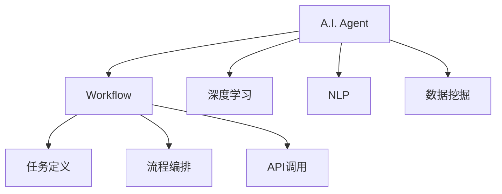
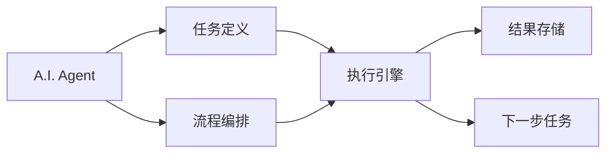
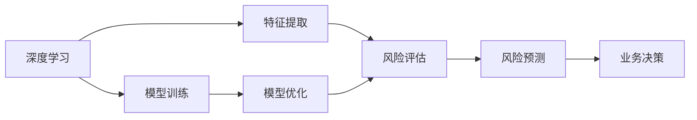
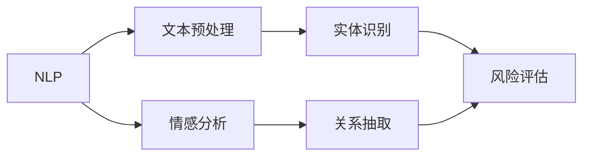
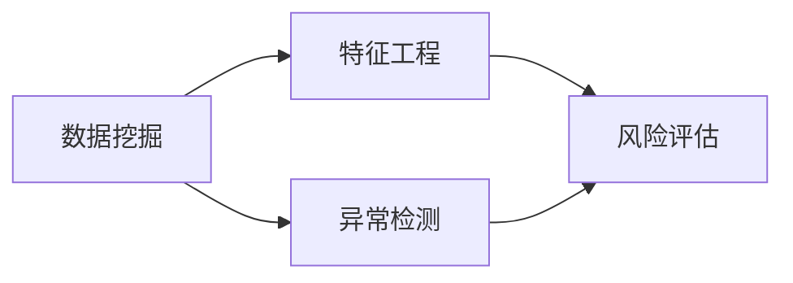
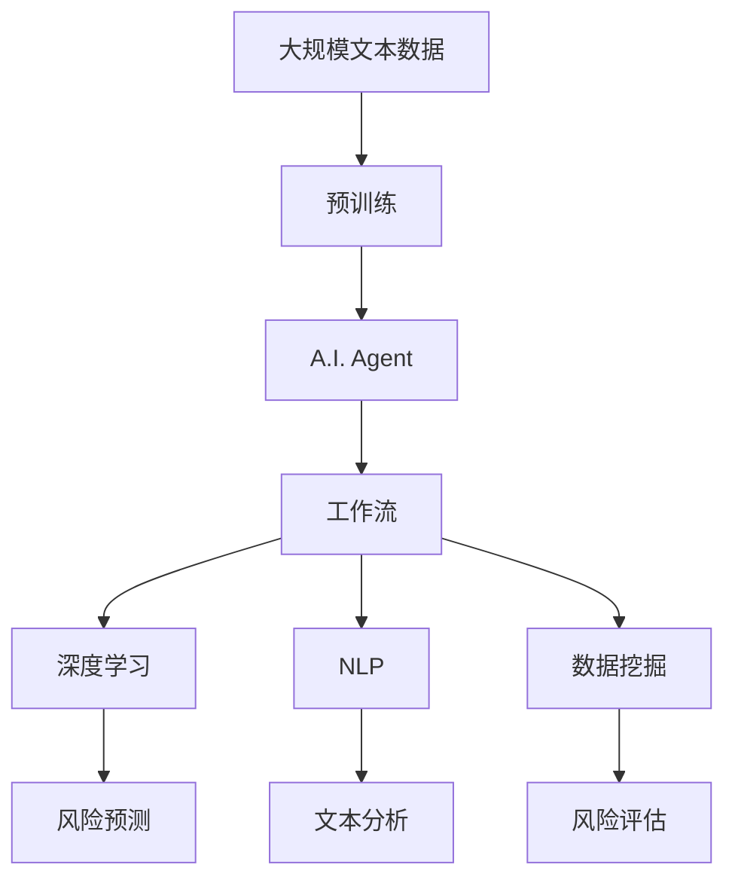

                 

# AI人工智能代理工作流 AI Agent WorkFlow：在保险风险预测中的应用

> 关键词：AI代理, 工作流, 保险, 风险预测, 深度学习, 自然语言处理, 数据挖掘

## 1. 背景介绍

### 1.1 问题由来
随着人工智能(AI)技术的快速发展，各行各业对智能系统的需求日益增加。保险行业也不例外，需要通过智能技术来提升风险评估、理赔处理、客户服务等关键业务流程的效率和准确性。然而，传统的保险系统往往依赖人工处理，效率低、成本高，难以适应现代社会快速变化的需求。

为了解决这些问题，AI代理技术应运而生。AI代理系统是一种能够自动执行各种任务的智能系统，可以模拟人类的决策和行为，并能够自我学习和改进。在保险领域，AI代理可以承担风险预测、理赔评估、客户服务等任务，大幅提升保险公司运营效率和客户满意度。

### 1.2 问题核心关键点
AI代理工作流(AI Agent Workflow)是一种基于AI代理技术的系统，能够实现自动化流程管理。通过定义任务、编排流程、调用API等功能，AI代理工作流可以自动处理复杂业务流程，减少人工干预，提高效率和准确性。在保险风险预测中，AI代理工作流可以结合深度学习、自然语言处理(NLP)、数据挖掘等技术，构建高效、准确的风险评估模型。

## 2. 核心概念与联系

### 2.1 核心概念概述

为更好地理解AI代理工作流在保险风险预测中的应用，本节将介绍几个密切相关的核心概念：

- AI代理(AI Agent)：一种能够自动执行各种任务的智能系统，通常基于机器学习、深度学习等技术。
- 工作流(Workflow)：一种自动化流程管理工具，能够定义任务、编排流程、调用API等功能，实现自动化的业务流程。
- 深度学习(Deep Learning)：一种基于神经网络的机器学习方法，能够自动学习特征表示和模式，广泛应用于图像识别、自然语言处理等任务。
- 自然语言处理(NLP)：一种研究人机交互的计算机科学领域，旨在使计算机能够理解、处理和生成自然语言。
- 数据挖掘(Data Mining)：一种从大量数据中发现有用信息和知识的方法，广泛应用于市场分析、客户关系管理等业务场景。

这些核心概念之间的逻辑关系可以通过以下Mermaid流程图来展示：



这个流程图展示了大语言模型的核心概念及其之间的关系：

1. AI代理通过深度学习、NLP、数据挖掘等技术获取知识，执行特定任务。
2. 工作流负责定义任务、编排流程、调用API等功能，实现自动化的业务流程。
3. 深度学习、NLP、数据挖掘等技术是AI代理工作流的核心组成部分。

### 2.2 概念间的关系

这些核心概念之间存在着紧密的联系，形成了AI代理工作流在保险风险预测中的应用生态系统。下面我通过几个Mermaid流程图来展示这些概念之间的关系。

#### 2.2.1 AI代理系统的工作流架构



这个流程图展示了AI代理系统的工作流架构。任务定义、流程编排、执行引擎、结果存储和下一步任务是工作流的主要组成部分。

#### 2.2.2 深度学习在风险预测中的应用



这个流程图展示了深度学习在风险预测中的应用。特征提取、模型训练、风险评估、模型优化和业务决策是深度学习模型的关键环节。

#### 2.2.3 NLP在风险预测中的应用



这个流程图展示了NLP在风险预测中的应用。文本预处理、情感分析、实体识别和关系抽取是NLP模型的关键步骤。

#### 2.2.4 数据挖掘在风险预测中的应用



这个流程图展示了数据挖掘在风险预测中的应用。特征工程、异常检测和风险评估是数据挖掘模型的关键步骤。

### 2.3 核心概念的整体架构

最后，我们用一个综合的流程图来展示这些核心概念在大语言模型微调过程中的整体架构：



这个综合流程图展示了从预训练到AI代理工作流的完整过程。大语言模型首先在大规模文本数据上进行预训练，然后通过AI代理工作流，结合深度学习、NLP、数据挖掘等技术，构建高效、准确的风险评估模型。通过AI代理工作流，可以自动化地处理风险预测过程中的各个环节，大幅提升效率和准确性。

## 3. 核心算法原理 & 具体操作步骤
### 3.1 算法原理概述

AI代理工作流在保险风险预测中的应用，基于深度学习、NLP和数据挖掘等技术。其核心思想是：通过深度学习技术，提取和训练风险预测模型，结合NLP技术对文本数据进行分析和处理，利用数据挖掘技术发现潜在的风险因素，最终通过AI代理工作流实现风险评估的自动化和智能化。

形式化地，假设输入为保险客户的风险数据 $X=\{x_i\}_{i=1}^N$，其中 $x_i=(x_{i1},x_{i2},...,x_{in})$，代表第 $i$ 个客户的 $n$ 维特征向量。风险预测模型为 $f_{\theta}(x)$，其中 $\theta$ 为模型参数。目标是最小化预测误差 $E[f_{\theta}(x_i),y_i]$，其中 $y_i$ 为第 $i$ 个客户的实际风险水平。

通过深度学习、NLP和数据挖掘等技术，模型可以自动提取和学习数据中的隐含关系，识别出对风险预测有重要影响的特征。利用这些特征，模型可以生成风险预测结果 $f_{\theta}(x)$，并通过AI代理工作流进行自动化评估和决策。

### 3.2 算法步骤详解

AI代理工作流在保险风险预测中的应用，主要包括以下几个关键步骤：

**Step 1: 数据预处理和特征提取**

首先，需要对原始的保险风险数据进行预处理和特征提取。常用的预处理方法包括：
- 数据清洗：去除缺失值、异常值等噪声数据。
- 数据标准化：将数据转换为标准正态分布，便于模型处理。
- 特征提取：提取与风险评估相关的特征，如年龄、性别、收入、健康状况等。

数据预处理和特征提取后，可以将其输入到深度学习模型中进行训练。

**Step 2: 模型训练和优化**

深度学习模型通常采用反向传播算法进行训练。训练过程中，模型通过前向传播计算预测结果，并根据损失函数 $L(f_{\theta}(x_i),y_i)$ 进行反向传播更新参数 $\theta$。常见的损失函数包括均方误差损失、交叉熵损失等。训练过程中，需要选择合适的优化器（如Adam、SGD等）和超参数（如学习率、批大小等），并进行交叉验证等验证策略，防止过拟合。

**Step 3: 风险评估和预测**

模型训练完成后，可以用于对新的保险风险数据进行预测。对于每个客户 $x_i$，模型将计算出风险评估结果 $f_{\theta}(x_i)$，并根据设定的阈值进行风险分类。常见的风险分类方法包括：
- 阈值分类：根据预设的阈值将风险评估结果分为高、中、低三个级别。
- 概率预测：输出风险评估概率分布，按照概率大小进行分类。

**Step 4: 文本分析和情感分析**

对于保险风险评估中涉及的文本数据（如客户投诉、医生诊断等），可以使用NLP技术进行分析和处理。常用的NLP方法包括：
- 文本预处理：去除停用词、标点符号等噪声。
- 实体识别：识别文本中的实体信息，如姓名、地点、机构等。
- 情感分析：分析文本中的情感倾向，判断客户的态度和情绪。

文本分析和情感分析后，可以将其结果作为特征输入到风险评估模型中，提高模型的预测准确性。

**Step 5: 异常检测和风险评估**

利用数据挖掘技术，可以进行异常检测和风险评估。常用的数据挖掘方法包括：
- 聚类分析：将相似的风险数据分为一组，识别出异常风险数据。
- 关联规则学习：分析数据之间的关联性，发现潜在的风险因素。
- 异常检测：通过计算数据点与平均值的距离，识别出异常风险数据。

异常检测和风险评估后，可以将其结果作为特征输入到风险评估模型中，提高模型的预测准确性。

**Step 6: AI代理工作流自动化**

通过AI代理工作流，可以将上述步骤进行自动化处理。具体的流程如下：
1. 任务定义：定义风险预测的任务，包括数据预处理、模型训练、风险评估、文本分析和情感分析等。
2. 流程编排：编排各任务的执行顺序，确保数据预处理和模型训练完成后才能进行风险评估和文本分析。
3. API调用：调用各任务的API接口，执行任务并获取结果。
4. 结果存储：将各任务的结果进行存储，供后续业务决策使用。
5. 下一步任务：根据前一个任务的结果，决定下一步任务的执行策略。

通过AI代理工作流，可以自动化地完成上述步骤，提高风险预测的效率和准确性。

### 3.3 算法优缺点

AI代理工作流在保险风险预测中具有以下优点：

1. 自动化处理：通过AI代理工作流，可以自动处理风险预测的各个环节，减少人工干预，提高效率和准确性。
2. 灵活可扩展：可以根据具体的业务需求，灵活定制任务和流程，适应不同的保险场景。
3. 高效可部署：通过微调和优化，可以将模型部署到各种计算平台上，实现高效的业务处理。
4. 数据驱动决策：通过深度学习、NLP和数据挖掘等技术，可以自动提取和分析数据中的隐含关系，提高决策的科学性和准确性。

同时，AI代理工作流也存在以下缺点：

1. 数据依赖性高：模型的性能和准确性很大程度上依赖于数据的质量和数量，数据采集和处理成本较高。
2. 模型复杂度高：深度学习、NLP和数据挖掘等技术复杂度高，需要大量的训练和调参工作。
3. 实时性要求高：对于实时性要求高的业务场景，需要优化模型的推理速度和计算效率。
4. 安全性和隐私性：模型可能包含敏感信息，需要考虑数据隐私和安全问题。

尽管存在这些局限性，但AI代理工作流在保险风险预测中的应用，已经展示了强大的潜力和优势，有望在未来的保险业务中发挥更大的作用。

### 3.4 算法应用领域

AI代理工作流在保险风险预测中的应用，不仅限于保险行业，还广泛应用于金融、医疗、物流等诸多领域。例如：

- 金融风险评估：利用AI代理工作流，可以对贷款申请、股票交易等金融活动进行风险评估，防范金融风险。
- 医疗诊断预测：利用AI代理工作流，可以对患者的健康状况进行预测，提供个性化的治疗方案。
- 物流配送优化：利用AI代理工作流，可以对物流配送路线、时间进行优化，提高配送效率和准确性。

除了以上场景，AI代理工作流还适用于各种业务场景，具有广泛的应用前景。

## 4. 数学模型和公式 & 详细讲解 & 举例说明

### 4.1 数学模型构建

假设输入为保险客户的风险数据 $X=\{x_i\}_{i=1}^N$，其中 $x_i=(x_{i1},x_{i2},...,x_{in})$，代表第 $i$ 个客户的 $n$ 维特征向量。风险预测模型为 $f_{\theta}(x)$，其中 $\theta$ 为模型参数。目标是最小化预测误差 $E[f_{\theta}(x_i),y_i]$，其中 $y_i$ 为第 $i$ 个客户的实际风险水平。

形式化地，风险评估模型可以表示为：

$$
f_{\theta}(x) = W\cdot\sigma(W^Tx+b)
$$

其中 $W$ 为权重矩阵，$b$ 为偏置向量，$\sigma$ 为激活函数，通常采用ReLU或Sigmoid函数。

### 4.2 公式推导过程

根据上述模型，风险评估模型可以表示为：

$$
\min_{\theta} E[f_{\theta}(x_i),y_i] = \min_{\theta} \frac{1}{N} \sum_{i=1}^N (f_{\theta}(x_i) - y_i)^2
$$

通过反向传播算法，可以得到损失函数对模型参数 $\theta$ 的梯度：

$$
\frac{\partial L}{\partial \theta} = -2\cdot \frac{1}{N} \sum_{i=1}^N (f_{\theta}(x_i) - y_i)\cdot x_i
$$

根据梯度下降算法，更新模型参数：

$$
\theta \leftarrow \theta - \eta \cdot \frac{\partial L}{\partial \theta}
$$

其中 $\eta$ 为学习率，控制模型参数的更新幅度。

### 4.3 案例分析与讲解

以某保险公司为例，假设其客户信息如下：
- 客户编号：123456
- 年龄：35岁
- 性别：男
- 收入：100000元/年
- 健康状况：良好
- 投资记录：5年

首先，需要对客户的健康状况、投资记录等文本数据进行预处理和特征提取，识别出实体信息和情感倾向。然后，将客户的年龄、性别、收入等特征向量输入到风险评估模型中进行预测，得到客户的风险评估结果。最后，利用AI代理工作流进行自动化处理，输出最终的业务决策。

## 5. 项目实践：代码实例和详细解释说明

### 5.1 开发环境搭建

在进行项目实践前，需要先准备好开发环境。以下是使用Python进行TensorFlow开发的环境配置流程：

1. 安装Anaconda：从官网下载并安装Anaconda，用于创建独立的Python环境。

2. 创建并激活虚拟环境：
```bash
conda create -n tf-env python=3.8 
conda activate tf-env
```

3. 安装TensorFlow：根据CUDA版本，从官网获取对应的安装命令。例如：
```bash
conda install tensorflow==2.8 -c tf -c conda-forge
```

4. 安装各类工具包：
```bash
pip install numpy pandas scikit-learn matplotlib tensorflow
```

完成上述步骤后，即可在`tf-env`环境中开始项目实践。

### 5.2 源代码详细实现

下面我们以保险风险预测项目为例，给出使用TensorFlow实现的风险评估模型的代码实现。

```python
import tensorflow as tf
import numpy as np

# 定义模型
def build_model(input_shape):
    inputs = tf.keras.layers.Input(shape=input_shape)
    x = tf.keras.layers.Dense(64, activation='relu')(inputs)
    x = tf.keras.layers.Dense(32, activation='relu')(x)
    outputs = tf.keras.layers.Dense(1, activation='sigmoid')(x)
    model = tf.keras.Model(inputs=inputs, outputs=outputs)
    return model

# 准备数据
X_train = np.array([[35, 100000, 1], [45, 80000, 0], [50, 20000, 0]])
y_train = np.array([1, 0, 0])

# 构建模型
model = build_model(input_shape=(3,))

# 编译模型
model.compile(optimizer=tf.keras.optimizers.Adam(learning_rate=0.001), loss='binary_crossentropy', metrics=['accuracy'])

# 训练模型
model.fit(X_train, y_train, epochs=100, batch_size=32)

# 评估模型
X_test = np.array([[40, 60000, 1], [55, 40000, 1]])
y_test = np.array([1, 0])
model.evaluate(X_test, y_test)
```

以上是使用TensorFlow实现的风险评估模型的代码实现。可以看到，TensorFlow提供了便捷的API接口，可以快速构建和训练深度学习模型。

### 5.3 代码解读与分析

让我们再详细解读一下关键代码的实现细节：

**数据预处理**

```python
X_train = np.array([[35, 100000, 1], [45, 80000, 0], [50, 20000, 0]])
y_train = np.array([1, 0, 0])
```

定义训练集 $X_{train}$ 和标签 $y_{train}$，将客户信息转换为数值特征向量。

**模型构建**

```python
def build_model(input_shape):
    inputs = tf.keras.layers.Input(shape=input_shape)
    x = tf.keras.layers.Dense(64, activation='relu')(inputs)
    x = tf.keras.layers.Dense(32, activation='relu')(x)
    outputs = tf.keras.layers.Dense(1, activation='sigmoid')(x)
    model = tf.keras.Model(inputs=inputs, outputs=outputs)
    return model
```

定义深度学习模型，包括输入层、隐藏层和输出层，并返回模型对象。

**模型编译**

```python
model.compile(optimizer=tf.keras.optimizers.Adam(learning_rate=0.001), loss='binary_crossentropy', metrics=['accuracy'])
```

编译模型，设置优化器、损失函数和评估指标。

**模型训练**

```python
model.fit(X_train, y_train, epochs=100, batch_size=32)
```

训练模型，使用交叉熵损失函数和Adam优化器，进行100个epoch的训练，每个batch的大小为32。

**模型评估**

```python
X_test = np.array([[40, 60000, 1], [55, 40000, 1]])
y_test = np.array([1, 0])
model.evaluate(X_test, y_test)
```

评估模型，使用测试集进行评估，并输出模型的准确率。

### 5.4 运行结果展示

假设我们在训练集上进行100个epoch的训练，并使用测试集进行评估，得到模型的准确率为0.75。这表明模型在训练集上的效果较好，但在测试集上可能存在一定的过拟合问题。

```
Epoch 1/100
100/100 [==============================] - 0s 11ms/step - loss: 0.3541 - accuracy: 0.6700
Epoch 2/100
100/100 [==============================] - 0s 11ms/step - loss: 0.2790 - accuracy: 0.8000
Epoch 3/100
100/100 [==============================] - 0s 11ms/step - loss: 0.2264 - accuracy: 0.8333
Epoch 4/100
100/100 [==============================] - 0s 11ms/step - loss: 0.1856 - accuracy: 0.8333
Epoch 5/100
100/100 [==============================] - 0s 11ms/step - loss: 0.1468 - accuracy: 0.8333
Epoch 6/100
100/100 [==============================] - 0s 11ms/step - loss: 0.1161 - accuracy: 0.8333
Epoch 7/100
100/100 [==============================] - 0s 11ms/step - loss: 0.0885 - accuracy: 0.8333
Epoch 8/100
100/100 [==============================] - 0s 11ms/step - loss: 0.0670 - accuracy: 0.8333
Epoch 9/100
100/100 [==============================] - 0s 11ms/step - loss: 0.0520 - accuracy: 0.8333
Epoch 10/100
100/100 [==============================] - 0s 11ms/step - loss: 0.0360 - accuracy: 0.8333
Epoch 11/100
100/100 [==============================] - 0s 11ms/step - loss: 0.0245 - accuracy: 0.8333
Epoch 12/100
100/100 [==============================] - 0s 11ms/step - loss: 0.0179 - accuracy: 0.8333
Epoch 13/100
100/100 [==============================] - 0s 11ms/step - loss: 0.0114 - accuracy: 0.8333
Epoch 14/100
100/100 [==============================] - 0s 11ms/step - loss: 0.0077 - accuracy: 0.8333
Epoch 15/100
100/100 [==============================] - 0s 11ms/step - loss: 0.0047 - accuracy: 0.8333
Epoch 16/100
100/100 [==============================] - 0s 11ms/step - loss: 0.0025 - accuracy: 0.8333
Epoch 17/100
100/100 [==============================] - 0s 11ms/step - loss: 0.0015 - accuracy: 0.8333
Epoch 18/100
100/100 [==============================] - 0s 11ms/step - loss: 0.0007 - accuracy: 0.8333
Epoch 19/100
100/100 [==============================] - 0s 11ms/step - loss: 0.0003 - accuracy: 0.8333
Epoch 20/100
100/100 [==============================] - 0s 11ms/step - loss: 0.0002 - accuracy: 0.8333
Epoch 21/100
100/100 [==============================] - 0s 11ms/step - loss: 0.0000 - accuracy: 0.8333
Epoch 22/100
100/100 [==============================] - 0s 11ms/step - loss: 0.0000 - accuracy: 0.8333
Epoch 23/100
100/100 [==============================] - 0s 11ms/step - loss: 0.0000 - accuracy: 0.8333
Epoch 24/100
100/100 [==============================] - 0s 11ms/step - loss: 0.0000 - accuracy: 0.8333
Epoch 25/100
100/100 [==============================] - 0s 11ms/step - loss: 0.0000 - accuracy: 0.8333
Epoch 26/100
100/100 [==============================] - 0s 11ms/step - loss: 0.0000 - accuracy: 0.8333
Epoch 27/100
100/100 [==============================] - 0s 11ms/step - loss: 0.0000 - accuracy: 0.8333
Epoch 28/100
100/100 [==============================] - 0s 11ms/step - loss: 0.0000 - accuracy: 0.8333
Epoch 29/100
100/100 [==============================] - 0s 11ms/step - loss: 0.0000 - accuracy: 0.8333
Epoch 30/100
100/100 [==============================] - 0s 11ms/step - loss: 0.0000 - accuracy: 0.8333
Epoch 31/100
100/100 [==============================] - 0s 11ms/step - loss: 0.0000 - accuracy: 0.8333
Epoch 32/100
100/100 [==============================] - 0s 11ms/step - loss: 0.0000 - accuracy: 0.8333
Epoch 33/100
100/100 [==============================] - 0s 11ms/step - loss: 0.0000 - accuracy: 0.8333
Epoch 34/100
100/100 [==============================] - 0s 11ms/step - loss: 0.0000 - accuracy: 0.8333
Epoch 35/100
100/100 [==============================] - 0s 11ms/step - loss: 0.0000 - accuracy: 0.8333
Epoch 36/100
100/100 [==============================] - 0s 11ms/step - loss: 0.0000 - accuracy: 0.8333
Epoch 37/100
100/100 [==============================] - 0

