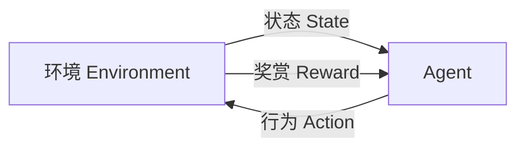

# 【大模型应用开发 动手做AI Agent】大模型出现之前的Agent

## 1. 背景介绍

### 1.1 问题的由来

在人工智能(AI)领域中,Agent一直是一个核心概念和研究热点。Agent可以被视为一种自主的软件实体,能够感知环境、处理信息、做出决策并采取行动,以实现预定目标。随着计算能力和数据量的不断增长,Agent技术在诸多领域得到了广泛应用,如机器人控制、游戏AI、智能助理等。

然而,传统的Agent系统通常是基于规则或有限的训练数据构建的,存在一些局限性。例如,规则库的构建和维护成本高、知识迁移能力差、缺乏上下文理解能力等。因此,如何设计出更加智能、通用和可扩展的Agent系统,成为该领域的一大挑战。

### 1.2 研究现状

为了克服传统Agent系统的局限性,研究人员提出了多种新型Agent架构和算法,主要包括:

1. **基于深度学习的Agent**:利用深度神经网络从大量数据中自动学习特征表示和决策策略,如Deep Q-Network(DQN)、Deep Deterministic Policy Gradient(DDPG)等。这些方法在很多任务上表现出色,但仍然存在样本效率低、泛化能力差等问题。

2. **基于记忆的Agent**:引入外部记忆模块来存储历史信息和知识,增强Agent的记忆和推理能力,如Neural Turing Machine(NTM)、Differentiable Neural Computer(DNC)等。这些方法提高了Agent处理序列数据的能力,但记忆读写机制的设计仍是一大挑战。

3. **多Agent系统**:由多个Agent组成,通过协作或竞争来完成复杂任务,如多智能体强化学习。这种方法能够提高系统的鲁棒性和扩展性,但Agent之间的协调和通信是一大难题。

4. **元学习Agent**:能够快速适应新环境和任务,提高学习效率,如基于优化的元学习、基于记忆的元学习等。这些方法有望解决一般化能力差的问题,但目前的元学习算法仍较为初级。

5. **人工通用智能(AGI)Agent**:以构建通用人工智能系统为目标,具有类似人类的认知能力,如推理、规划、因果学习等,如DeepMind的AlphaGo、OpenAI的GPT等。这是人工智能的终极目标,但距离实现AGI仍有很长的路要走。

总的来说,Agent技术正在不断发展和完善,但仍面临诸多挑战,如如何提高样本效率、如何增强推理和因果学习能力、如何实现有效的知识迁移等,亟待进一步的理论和算法创新。

### 1.3 研究意义

发展高性能、通用的Agent系统,对于推动人工智能技术的发展至关重要,具有重大的理论意义和应用价值:

1. **理论意义**:Agent系统涉及感知、学习、推理、决策、规划、控制等多个AI核心问题,是验证和发展AI理论的重要载体。研究Agent有助于深化对智能系统的认知,推动AI理论和方法的创新。

2. **应用价值**:高性能Agent可广泛应用于机器人控制、智能辅助系统、自动驾驶、智能游戏等诸多领域,提高系统的自主性、智能性和适应性,为人类社会创造巨大的经济和社会价值。

3. **促进AGI发展**:Agent技术是实现人工通用智能(AGI)的重要途径之一。通过不断完善Agent架构、增强其认知能力,最终有望开发出具备人类级别智能的AGI系统。

4. **推动多学科融合**:Agent涉及计算机科学、认知科学、神经科学、控制论、博弈论等多个学科,其研究有助于促进不同领域的交叉融合,产生新的研究方向和应用场景。

总之,Agent技术对于推动人工智能理论创新、拓展应用领域、实现AGI都具有重要的战略意义,值得持续深入研究和探索。

### 1.4 本文结构

本文将系统介绍大模型出现之前的Agent相关技术,内容安排如下:

1. 背景介绍:阐述Agent技术的由来、研究现状和意义。

2. 核心概念与联系:介绍Agent的核心概念,如环境、状态、奖赏等,并分析它们之间的联系。

3. 核心算法原理和具体操作步骤:重点介绍经典的Agent算法,如Q-Learning、Policy Gradient等,包括算法原理、步骤、优缺点和应用场景。

4. 数学模型和公式推导:对Agent算法中的关键数学模型和公式进行详细推导和案例分析。

5. 项目实践:通过代码实例,演示如何搭建Agent开发环境,并对核心代码进行解读和运行结果展示。

6. 实际应用场景:介绍Agent技术在机器人控制、游戏AI、智能助理等领域的应用情况。

7. 工具和资源推荐:总结相关的学习资源、开发工具、论文等。

8. 总结和展望:回顾Agent技术的研究成果,并对未来发展趋势和挑战进行展望。

9. 附录:常见问题解答。

通过本文的介绍,读者能够全面了解大模型出现之前Agent技术的理论基础、核心算法、实践应用和发展前景,为后续学习研究打下坚实基础。

## 2. 核心概念与联系

在介绍具体的Agent算法之前,我们先来了解一下Agent系统中的几个核心概念,以及它们之间的关系。

### 2.1 Agent

Agent是一种自主的软件实体,能够感知环境、处理信息、做出决策并采取行动,以实现预定目标。一个Agent系统通常包括以下几个关键组成部分:

- **感知器(Sensor)**: 用于获取环境状态的信息,如视觉、听觉、触觉等传感器数据。
- **执行器(Actuator)**: 用于对环境产生影响或执行动作,如机器人的机械臂、游戏中的操控指令等。
- **策略(Policy)**: 决定Agent在给定状态下应该执行何种行为的规则或函数映射。
- **价值函数(Value Function)**: 评估某个状态或状态-行为对的好坏程度,指导Agent做出最优决策。
- **模型(Model)**: 对环境的动态过程建模,用于规划和预测。
- **奖赏(Reward)**: 环境给出的对Agent行为的反馈评价信号。

Agent与环境之间通过感知-决策-行为的循环进行交互,如下图所示:

Agent的目标是通过学习,不断优化自身的策略或价值函数,以最大化预期的长期奖赏。

### 2.2 环境

环境(Environment)是指Agent所处的外部世界,包括所有可感知和可影响的对象。环境可以是:

- **完全可观测(Fully Observable)**: Agent可以直接获取环境的全部状态信息。
- **部分可观测(Partially Observable)**: Agent只能获取环境的部分状态信息。

环境的动态过程可以用**马尔可夫决策过程(Markov Decision Process, MDP)** 来刻画,定义如下:

- **状态集合(State Space) S**: 环境可能处于的所有状态的集合。
- **行为集合(Action Space) A**: Agent可执行的所有可能行为的集合。
- **转移概率(Transition Probability) P(s'|s,a)**: 在状态s执行行为a后,转移到状态s'的概率。
- **奖赏函数(Reward Function) R(s,a,s')**: 在状态s执行行为a并转移到s'时,环境给出的奖赏值。
- **折现因子(Discount Factor) γ**: 决定Agent对未来奖赏的权重衰减程度,0<γ≤1。

Agent的目标是找到一个最优策略π*,使得在MDP中的预期回报最大化:

$$\max_{\pi} \mathbb{E}_{\pi}\left[ \sum_{t=0}^{\infty} \gamma^t R(s_t, a_t, s_{t+1}) \right]$$

其中,π是Agent的策略,决定了在每个状态s下执行何种行为a。

### 2.3 价值函数

价值函数(Value Function)用于评估一个状态或状态-行为对在Agent当前策略下的预期长期奖赏,是Agent决策的重要依据。

- **状态价值函数(State-Value Function) V(s)**: 评估在状态s下,按照策略π继续执行可获得的预期长期奖赏。

$$V^{\pi}(s) = \mathbb{E}_{\pi}\left[ \sum_{t=0}^{\infty} \gamma^t R(s_t, a_t, s_{t+1}) | s_0 = s \right]$$

- **状态-行为价值函数(Action-Value Function) Q(s,a)**: 评估在状态s执行行为a,之后按照策略π继续执行可获得的预期长期奖赏。

$$Q^{\pi}(s,a) = \mathbb{E}_{\pi}\left[ \sum_{t=0}^{\infty} \gamma^t R(s_t, a_t, s_{t+1}) | s_0 = s, a_0 = a \right]$$

价值函数满足**贝尔曼方程(Bellman Equation)**,可以通过迭代更新的方式学习获得。例如,Q-Learning算法就是通过不断更新Q值,逼近最优的Q*函数。

### 2.4 策略

策略(Policy)是Agent在每个状态下选择行为的规则或映射函数,记为π(a|s)。策略可分为:

- **确定性策略(Deterministic Policy)**: 给定状态,总是选择某个特定的行为。
- **随机策略(Stochastic Policy)**: 给定状态,根据某种概率分布随机选择行为。

根据策略的形式,Agent算法可分为**价值函数方法**和**策略梯度方法**两大类:

- **价值函数方法**: 先估计最优价值函数Q*或V*,然后由此导出最优策略π*。如Q-Learning、Sarsa等。
- **策略梯度方法**: 直接对策略π进行参数化,通过梯度上升的方式优化策略,使其逼近最优策略π*。如REINFORCE、PPO等。

## 3. 核心算法原理 & 具体操作步骤

介绍了Agent系统的核心概念后,我们来重点介绍几种经典的Agent算法,包括算法原理、具体步骤、优缺点和应用场景。

### 3.1 算法原理概述

#### 3.1.1 Q-Learning

Q-Learning是一种**基于价值函数**的强化学习算法,目标是找到最优的Q*函数,使得:

$$Q^*(s,a) = \max_{\pi} \mathbb{E}_{\pi}\left[ \sum_{t=0}^{\infty} \gamma^t R(s_t, a_t, s_{t+1}) | s_0 = s, a_0 = a \right]$$

具有最优Q*函数,Agent只需在每个状态s选择使Q*(s,a)最大的行为a,就可获得最优策略π*。

Q-Learning通过不断迭代更新Q值,使其逼近最优Q*函数:

$$Q(s_t, a_t) \leftarrow Q(s_t, a_t) + \alpha \left[ r_t + \gamma \max_{a'} Q(s_{t+1}, a') - Q(s_t, a_t) \right]$$

其中,α是学习率,r是即时奖赏,γ是折现因子。

Q-Learning的优点是**无模型(Model-Free)**,不需要了解环境的转移概率,只需环境的奖赏反馈即可。但缺点是需要访问所有状态-行为对,在状态空间很大时收敛较慢。

#### 3.1.2 Sarsa

Sarsa也是一种基于价值函数的算法,与Q-Learning的区别在于,其更新Q值时使用的不是max操作,而是根据策略π实际选择的下一个行为a'。

$$Q(s_t, a_t) \leftarrow Q(s_t, a_t) + \alpha \left[ r_t + \gamma Q(s_{t+1}, a') - Q(s_t, a_t) \right]$$

其中,a'是根据策略π(s_{t+1})选择的行为。

Sarsa的优点是**在线(On-Policy)**更新,可以直接估计当前策略的价值函数,更容易发现最优策略。缺点是探索新策略的