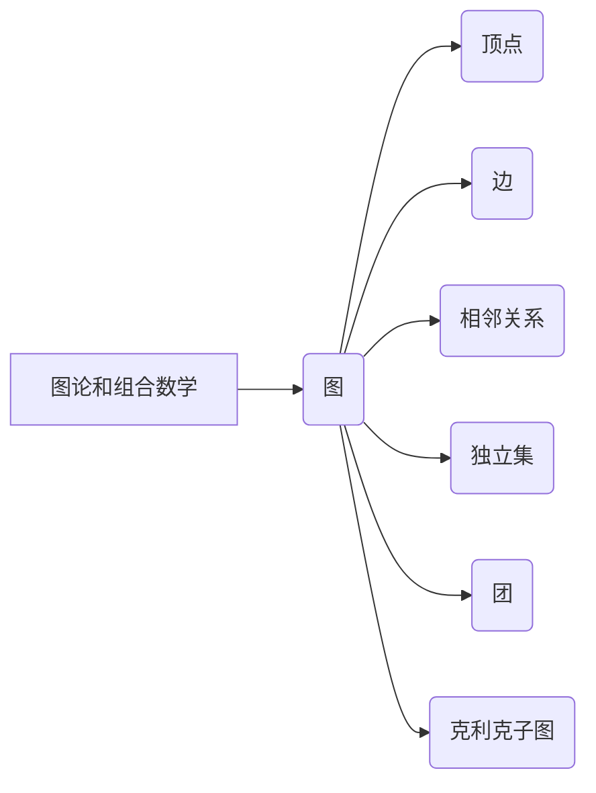
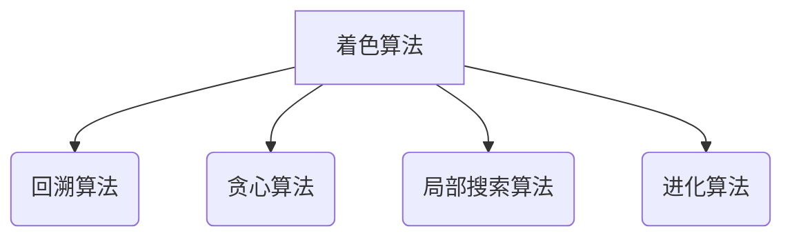
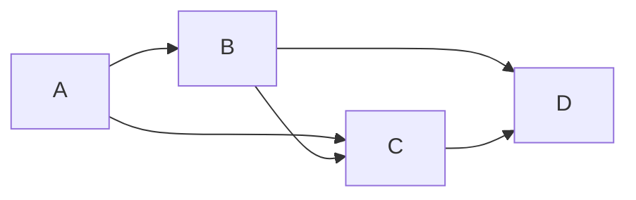

# 像数学家一样思考：着色原理

## 1. 背景介绍

### 1.1 问题的由来

着色问题是图论和组合数学中的一个经典问题。它起源于 18 世纪,当时的数学家试图用尽可能少的颜色为地图上相邻的区域着色,使得相邻区域不会有相同的颜色。这个看似简单的问题引发了数学家们对图着色理论的深入研究,并衍生出许多有趣且具有挑战性的问题。

### 1.2 研究现状

图着色理论在过去几个世纪中取得了长足的进步。数学家们已经证明了一些重要的结果,例如四色定理、五色定理和布鲁克斯定理等。然而,仍然存在许多未解决的难题,例如确定一个特定图的最小着色数是 NP 完全问题。着色问题在许多实际应用中也扮演着重要角色,例如编译器寄存器分配、时间表安排和电路设计等。

### 1.3 研究意义

着色问题不仅在理论上具有重要意义,而且在实际应用中也有广泛的用途。通过研究着色问题,我们可以深入理解图论和组合数学的基本概念,并开发出高效的算法来解决实际问题。此外,着色问题也为我们提供了一种独特的思考方式,培养我们像数学家一样思考和解决问题的能力。

### 1.4 本文结构

本文将从以下几个方面深入探讨着色原理:

1. 核心概念与联系
2. 核心算法原理和具体操作步骤
3. 数学模型和公式详细讲解及案例分析
4. 项目实践:代码实例和详细解释
5. 实际应用场景
6. 工具和资源推荐
7. 总结:未来发展趋势与挑战
8. 附录:常见问题与解答

## 2. 核心概念与联系

着色问题涉及到图论和组合数学中的许多核心概念,包括图、顶点、边、相邻关系、独立集、团和克利克子图等。这些概念之间存在着紧密的联系,理解它们对于掌握着色原理至关重要。

### 2.1 图

图是一种由顶点和边组成的数学结构。顶点表示对象或实体,而边表示顶点之间的关系或连接。根据边是否有方向,图可以分为无向图和有向图。着色问题通常研究无向图。

### 2.2 顶点和边

顶点是图中的基本单元,用于表示对象或实体。边则表示顶点之间的关系或连接。在着色问题中,我们需要为每个顶点分配一种颜色,使得相邻的顶点不会有相同的颜色。

### 2.3 相邻关系

两个顶点之间存在边相连时,我们称它们是相邻的。在着色问题中,相邻的顶点不能使用相同的颜色。这个约束条件是着色问题的核心。

### 2.4 独立集

独立集是指一组互不相邻的顶点的集合。在着色问题中,独立集可以使用相同的颜色,因为它们之间没有相邻关系。

### 2.5 团和克利克子图

团是一种完全相连的子图,其中任意两个顶点都是相邻的。克利克子图则是一种不包含任何团的子图。这两个概念在研究着色问题的算法和理论中扮演着重要角色。

通过掌握这些核心概念及其联系,我们可以更好地理解和解决着色问题。下一节将介绍着色问题的核心算法原理和具体操作步骤。

## 3. 核心算法原理和具体操作步骤

### 3.1 算法原理概述

着色问题的核心算法原理是通过有效的搜索策略和剪枝技术,尽可能减少需要探索的颜色组合数,从而找到最优解或近似最优解。常见的算法包括回溯算法、贪心算法、局部搜索算法和进化算法等。

### 3.2 算法步骤详解

#### 3.2.1 回溯算法

回溯算法是解决着色问题的一种常用算法。它通过系统地构建候选解,并在发现候选解不可行时回溯到上一步,继续尝试其他可能的解。算法步骤如下:

1. 初始化一个空的颜色分配列表。
2. 选择一个未着色的顶点。
3. 尝试为该顶点分配一种颜色,使得它与相邻的已着色顶点不同色。
4. 如果可以合法地分配颜色,则继续处理下一个未着色的顶点。
5. 如果不能合法地分配颜色,则回溯到上一步,尝试其他颜色组合。
6. 重复步骤 2-5,直到所有顶点都被合法着色或者探索完所有可能的颜色组合。

#### 3.2.2 贪心算法

贪心算法是一种启发式算法,它在每一步都选择当前看起来最优的选择。对于着色问题,贪心算法的步骤如下:

1. 初始化一个空的颜色分配列表。
2. 选择一个未着色的顶点,优先选择度数最大的顶点。
3. 为该顶点分配一种与其相邻顶点不同的最小可用颜色。
4. 重复步骤 2-3,直到所有顶点都被着色。

虽然贪心算法通常无法找到最优解,但它具有简单高效的优点,并且在许多实际应用中可以获得较好的近似解。

#### 3.2.3 局部搜索算法

局部搜索算法是一种启发式算法,它从一个初始解出发,通过局部扰动来改进当前解,直到达到某个停止条件。对于着色问题,局部搜索算法的步骤如下:

1. 生成一个初始着色解。
2. 定义一个邻域结构,用于生成当前解的邻居解。
3. 在当前解的邻域中搜索更好的解。
4. 如果找到更好的解,则将其作为新的当前解。
5. 重复步骤 3-4,直到达到停止条件。

常见的邻域结构包括交换两个顶点的颜色、改变一个顶点的颜色等。停止条件可以是达到最大迭代次数、在一定时间内未能找到更好的解等。

#### 3.2.4 进化算法

进化算法是一种基于种群的优化算法,它模拟自然进化过程中的选择、交叉和变异操作,逐渐进化出更优的解。对于着色问题,进化算法的步骤如下:

1. 初始化一个包含多个着色解的种群。
2. 评估每个个体的适应度,即着色解的质量。
3. 根据适应度选择优秀的个体进行交叉和变异操作,产生新的个体。
4. 将新产生的个体加入种群,替换掉一些旧的个体。
5. 重复步骤 2-4,直到达到停止条件。

常见的交叉操作包括部分映射交叉、顺序交叉等,变异操作包括交换颜色、改变颜色等。停止条件可以是达到最大迭代次数、种群收敛等。

### 3.3 算法优缺点

每种算法都有其优缺点,需要根据具体问题和场景进行权衡选择。

- 回溯算法能够找到最优解,但计算复杂度较高,对于大规模问题可能会耗费大量时间。
- 贪心算法计算速度快,但无法保证找到最优解,只能获得近似解。
- 局部搜索算法通常能够找到较好的近似解,但容易陷入局部最优,且收敛速度取决于初始解和邻域结构的选择。
- 进化算法具有全局搜索能力,能够找到较优的解,但计算效率较低,需要调整多个参数。

### 3.4 算法应用领域

着色算法在许多实际应用领域都有应用,例如:

- 编译器寄存器分配
- 时间表安排
- 频率分配
- 电路设计
- 图像分割
- 数据压缩
- 网络规划
- 机器学习特征选择

通过合理选择和优化着色算法,我们可以解决这些领域中的实际问题,提高系统的效率和性能。

## 4. 数学模型和公式详细讲解及案例分析

### 4.1 数学模型构建

为了更好地研究和解决着色问题,我们需要构建数学模型。一种常见的数学模型是将着色问题转化为整数线性规划问题。

设 $G = (V, E)$ 是一个无向图,其中 $V$ 是顶点集合,$ E$ 是边集合。我们引入两个变量:

- $x_{iv}$ 表示顶点 $v$ 被着色为颜色 $i$ 的情况,取值为 0 或 1。
- $y_i$ 表示使用了颜色 $i$ 的情况,取值为 0 或 1。

则着色问题可以表示为如下整数线性规划模型:

$$
\begin{align}
\min \quad & \sum_{i=1}^{|V|} y_i \
\text{s.t.} \quad & \sum_{i=1}^{|V|} x_{iv} = 1, \quad \forall v \in V \
& x_{iu} + x_{iv} \leq 1 + y_i, \quad \forall (u, v) \in E, \forall i \
& x_{iv} \in \{0, 1\}, \quad \forall v \in V, \forall i \
& y_i \in \{0, 1\}, \quad \forall i
\end{align}
$$

目标函数是最小化使用的颜色数量。第二个约束条件保证每个顶点被着色一次。第三个约束条件保证相邻顶点不会使用相同的颜色。最后两个约束条件确保变量取值为 0 或 1。

### 4.2 公式推导过程

我们可以通过数学推导来证明上述整数线性规划模型的正确性。

首先,我们定义一个新的变量 $z_{uvi}$,表示顶点 $u$ 和 $v$ 都被着色为颜色 $i$ 的情况。则有:

$$
z_{uvi} = x_{iu} x_{iv}, \quad \forall (u, v) \in E, \forall i
$$

由于相邻顶点不能使用相同的颜色,因此对于任意边 $(u, v) \in E$,我们有:

$$
\sum_{i=1}^{|V|} z_{uvi} = 0
$$

将 $z_{uvi}$ 代入上式,我们得到:

$$
\sum_{i=1}^{|V|} x_{iu} x_{iv} = 0, \quad \forall (u, v) \in E
$$

等价于:

$$
x_{iu} + x_{iv} \leq 1, \quad \forall (u, v) \in E, \forall i
$$

进一步引入变量 $y_i$,我们可以得到第三个约束条件:

$$
x_{iu} + x_{iv} \leq 1 + y_i, \quad \forall (u, v) \in E, \forall i
$$

当 $y_i = 0$ 时,上式等价于 $x_{iu} + x_{iv} \leq 1$,即相邻顶点不能使用颜色 $i$。当 $y_i = 1$ 时,上式总是成立,因为 $x_{iu}$ 和 $x_{iv}$ 的取值为 0 或 1。

通过上述推导,我们证明了整数线性规划模型的正确性。该模型可以用于求解着色问题的最优解或近似解。

### 4.3 案例分析与讲解

让我们通过一个具体的案例来分析和讲解上述数学模型。

考虑如下无向图 $G$:

我们的目标是使用最少的颜色为该图着色,使得相邻顶点不会有相同的颜色。

首先,我们构建整数线性