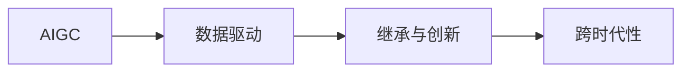

                 

# AIGC本质上是连接过去、现在和未来的软件，拥有数据的人就拥有了机会

> 关键词：
> - AI Generative Coding, AIGC
> - 数据驱动，数据鸿沟
> - 知识继承与创新
> - 技术协同与融合
> - 未来应用展望

## 1. 背景介绍

### 1.1 问题由来

人工智能技术（AI）正迅速改变着各行各业的运行方式，特别是生成型人工智能（Generative AI）领域，已展现出前所未有的潜力和机遇。AIGC，即人工智能生成内容（Artificial Intelligence Generated Content），代表了新一代AI技术的高度成熟与实践应用。

AIGC并非凭空产生，而是基于大量过去数据构建的模型，运用当今先进的算法与技术进行创新，面向未来生成有价值的内容。简言之，AIGC连接了过去、现在和未来，是AI技术发展的产物，也是信息时代知识传承与创新的重要工具。

### 1.2 问题核心关键点

AIGC的核心关键点包括：
- 数据驱动：依赖大量高质量的数据进行训练。
- 继承与创新：继承以往知识，通过算法改进进行创新。
- 跨时代性：基于过去的积累，面向未来生成高质量内容。
- 应用场景广泛：涉及文字、图像、音频、视频等多种类型。
- 数据鸿沟：高质量数据稀缺，限制了AIGC的发展。

这些关键点决定了AIGC在当今信息技术领域的重要性，同时也揭示了其在实际应用中可能面临的挑战。

### 1.3 问题研究意义

AIGC的研究意义在于：
- 推动信息社会进步：通过生成有价值的内容，AIGC能够促进知识的传递与分享。
- 提升产业效率：自动化生成报告、分析、设计等内容，提高工作效率。
- 创新技术应用：不断探索新技术和新模式，推动AI技术的深度应用。
- 解决实际问题：通过模型优化和数据处理，有效解决行业痛点。
- 知识传承与创新：运用数据驱动的方式，实现对现有知识的创新与重构。

理解AIGC的本质，对于探索其未来应用和潜在价值具有重要意义。

## 2. 核心概念与联系

### 2.1 核心概念概述

要深入理解AIGC，首先要了解其核心概念：
- AIGC：指通过AI技术生成内容，具有高度的自动化、智能化特点。
- 数据驱动：依赖大量数据进行训练，使模型具备强大的泛化能力。
- 继承与创新：基于历史数据生成新内容，通过改进算法实现创新。
- 跨时代性：跨越过去、现在和未来，实现内容的生成与应用。

这些概念通过以下Mermaid流程图（图1）展示了它们之间的联系：



图1: AIGC核心概念的联系

### 2.2 概念间的关系

图1展示了AIGC核心概念之间的关系：
- AIGC的实现依赖于数据驱动。
- 数据驱动通过继承历史知识实现创新。
- 继承与创新具有跨时代的特性，面向未来生成新内容。

AIGC的核心理念是“数据+算法”，其中数据是基础，算法是关键。通过数据驱动和继承与创新，实现面向未来的内容生成。

## 3. 核心算法原理 & 具体操作步骤

### 3.1 算法原理概述

AIGC算法原理主要包括：
- 自回归模型（Auto-Regressive Model）：通过已有数据预测未来。
- 生成对抗网络（Generative Adversarial Network, GAN）：生成与优化数据的过程。
- 变分自编码器（Variational Autoencoder, VAE）：通过学习数据的潜在分布生成新内容。
- 条件生成模型（Conditional Generative Model）：基于特定条件生成内容。

这些算法通过不同的方法，实现了对内容的自动生成。AIGC的生成过程包括数据收集、模型训练和内容生成三个阶段。

### 3.2 算法步骤详解

AIGC的具体操作步骤如下：
1. **数据收集**：收集高质量的训练数据，包括文本、图像、音频、视频等。
2. **模型训练**：构建AIGC模型，并通过训练数据进行迭代优化。
3. **内容生成**：在模型生成器上输入特定条件，生成符合要求的内容。

每个步骤都需要细致的实现，下面以生成文本为例，详细说明。

#### 数据收集

数据收集是AIGC的第一步，需从公开数据集、商业数据集或自身业务数据中获取数据。假设要生成小说，数据来源可以包括：
- 小说网站：如Netflix、Kindle等。
- 出版商：通过API获取数据。
- 图书扫描：使用光学字符识别（OCR）技术将纸质书转换为文本。

#### 模型训练

模型训练主要分为两个阶段：预训练和微调。预训练使用大规模无标签数据，微调使用具体任务的数据。以生成小说为例，步骤包括：
1. **预训练**：使用大规模小说数据进行预训练。
2. **微调**：使用特定的小说数据进行微调。

#### 内容生成

内容生成是通过已训练的模型，根据特定条件生成新的文本。以小说生成为例，步骤包括：
1. **输入条件**：根据用户提供的情节、角色等条件。
2. **生成文本**：模型基于输入条件生成小说段落。
3. **反馈优化**：用户反馈优化生成内容，使其更符合预期。

### 3.3 算法优缺点

AIGC的优点包括：
- 高效生成：自动生成内容，节省大量人力。
- 创新性高：生成多样化的内容，实现创新。
- 跨领域应用：适用于多种类型的生成任务。

缺点包括：
- 数据依赖：依赖高质量的数据，数据稀缺时难以生成。
- 泛化能力有限：模型可能对特定领域的内容生成效果较好，泛化能力有限。
- 可解释性差：黑盒生成过程，难以解释生成结果。

### 3.4 算法应用领域

AIGC已广泛应用于多个领域，具体包括：
- **内容创作**：生成新闻报道、文章、小说、博客等。
- **广告设计**：自动生成广告文案、图像和视频。
- **游戏开发**：生成角色对话、故事线等。
- **教育培训**：自动生成教学材料、练习题等。
- **数据分析**：自动生成报告、分析结果等。

AIGC的应用领域不断拓展，未来有望更多地渗透到各行各业，改变人们的生活和工作方式。

## 4. 数学模型和公式 & 详细讲解

### 4.1 数学模型构建

AIGC的数学模型主要基于统计模型和深度学习模型。以生成文本为例，常见的模型包括：
- 循环神经网络（RNN）
- 长短期记忆网络（LSTM）
- 变分自编码器（VAE）
- 生成对抗网络（GAN）

以RNN为例，数学模型构建过程如下：
- 输入序列：$x_1, x_2, \ldots, x_T$，长度为T。
- 隐藏状态：$h_1, h_2, \ldots, h_T$。
- 输出序列：$y_1, y_2, \ldots, y_T$。

RNN的预测概率为：
$$
p(y_t|y_1, \ldots, y_{t-1}, x_1, \ldots, x_t; \theta)
$$
其中，$\theta$ 为模型参数。

### 4.2 公式推导过程

RNN的推导过程基于以下公式：
$$
h_t = f(h_{t-1}, x_t; \theta)
$$
$$
y_t = g(h_t; \theta)
$$
其中，$f$ 为隐藏状态的更新函数，$g$ 为输出序列的生成函数。

以文本生成为例，假设$x_t$为下一个字符，$y_t$为当前字符，则生成过程可以表示为：
$$
y_t = \text{softmax}(W_{out}h_t + b_{out})
$$
其中，$W_{out}$ 和 $b_{out}$ 为输出层的权重和偏置。

### 4.3 案例分析与讲解

假设要生成一段小说段落，可以按以下步骤进行：
1. **定义模型**：构建RNN模型，设置隐藏层大小和输出层大小。
2. **数据准备**：准备小说文本数据，进行预处理。
3. **训练模型**：在预训练数据上训练模型。
4. **微调模型**：在具体任务数据上微调模型。
5. **生成文本**：输入情节、角色等条件，生成小说段落。

以GPT-3为例，GPT-3基于Transformer架构，其生成过程涉及注意力机制和多头自注意力机制，生成文本的公式如下：
$$
p(y_{1:T}|x_1, \ldots, x_{t-1}; \theta) = \prod_{t=1}^T p(y_t|y_{1:t-1}, x_{1:(t-1)}; \theta)
$$
其中，$y_{1:T}$ 为生成序列，$x_{1:(t-1)}$ 为已生成文本，$\theta$ 为模型参数。

## 5. 项目实践：代码实例和详细解释说明

### 5.1 开发环境搭建

开发环境搭建需要以下步骤：
1. **安装Python**：确保Python 3.8或更高版本已安装。
2. **安装PyTorch**：使用pip安装PyTorch，并进行GPU/TPU配置。
3. **安装Transformers库**：使用pip安装Transformers库。
4. **安装其他依赖库**：如nltk、pandas、numpy等。

### 5.2 源代码详细实现

以生成文本为例，以下是使用PyTorch和Transformers库实现RNN模型的代码：

```python
import torch
import torch.nn as nn
import torch.optim as optim
from torchtext.datasets import text
from torchtext.data import Field, BucketIterator

class RNN(nn.Module):
    def __init__(self, input_size, hidden_size, output_size):
        super(RNN, self).__init__()
        self.hidden_size = hidden_size
        self.rnn = nn.RNN(input_size, hidden_size, batch_first=True)
        self.fc = nn.Linear(hidden_size, output_size)
        self.softmax = nn.Softmax(dim=1)

    def forward(self, input, hidden):
        output, hidden = self.rnn(input, hidden)
        output = self.fc(output[:, -1, :])
        output = self.softmax(output)
        return output, hidden

# 数据准备
train_data, test_data = text()
train_data = train_data.split()
text_field = Field(tokenize='spacy', lower=True, include_lengths=True)
train_data = [(train_data[0], train_data[1])]
train_data = text_field.build_vocab(train_data)
train_iterator = BucketIterator(train_data, batch_size=64, device='cuda')

# 模型构建
model = RNN(input_size=train_data.vocab.stoi['<s>'], hidden_size=128, output_size=train_data.vocab.stoi['<e>'])

# 损失函数和优化器
criterion = nn.CrossEntropyLoss()
optimizer = optim.Adam(model.parameters(), lr=0.001)

# 训练模型
epochs = 10
for epoch in range(epochs):
    for batch in train_iterator:
        input, lengths = batch.text
        target = batch.label
        hidden = (torch.zeros(1, 1, model.hidden_size).to(device), torch.zeros(1, 1, model.hidden_size).to(device))
        optimizer.zero_grad()
        output, hidden = model(input, hidden)
        loss = criterion(output, target)
        loss.backward()
        optimizer.step()
```

### 5.3 代码解读与分析

以上代码实现了一个简单的RNN模型，用于生成文本。以下是关键部分的解释：
- `RNN`类定义了RNN模型的结构。
- `forward`方法定义了模型的前向传播过程。
- `train`方法通过迭代训练，更新模型参数。

### 5.4 运行结果展示

假设在小说生成任务上使用训练好的RNN模型，可以按以下步骤生成一段小说：
1. **输入条件**：如“在一个遥远的星球上，有一个勇敢的探险家”。
2. **生成文本**：模型将输出后续的文本段落。

## 6. 实际应用场景

### 6.1 媒体内容创作

AIGC在媒体内容创作中有着广泛应用，如：
- **新闻生成**：自动生成新闻报道，提高新闻编辑效率。
- **文章创作**：自动生成各类文章，如科技、娱乐、财经等。
- **博客撰写**：自动生成博客内容，提高内容生产效率。

### 6.2 电商产品描述

AIGC在电商产品描述中也有重要应用，如：
- **产品自动描述**：自动生成产品描述，提升用户阅读体验。
- **广告文案生成**：自动生成广告文案，提高广告点击率。

### 6.3 法律文档生成

AIGC在法律文书生成中也逐渐被应用，如：
- **合同自动生成**：自动生成合同、协议等法律文书。
- **法律案例分析**：自动生成法律案例分析报告。

## 7. 工具和资源推荐

### 7.1 学习资源推荐

以下是推荐的AIGC学习资源：
- **《深度学习》课程**：斯坦福大学的课程，详细讲解深度学习原理和应用。
- **《自然语言处理》课程**：清华大学计算机系开设的课程，讲解NLP基础与前沿。
- **《生成式模型》课程**：CMU的课程，讲解生成模型原理与应用。
- **《Python深度学习》书籍**：由Francois Chollet编写，详细介绍深度学习基础与应用。

### 7.2 开发工具推荐

以下是推荐的AIGC开发工具：
- **PyTorch**：深度学习框架，灵活高效，易于上手。
- **TensorFlow**：由Google主导的开源框架，性能优越，应用广泛。
- **Transformers**：NLP工具库，集成了多种预训练模型，方便微调和应用。
- **Jupyter Notebook**：交互式编程环境，便于调试和实验。

### 7.3 相关论文推荐

以下是推荐的AIGC相关论文：
- **Attention is All You Need**：Transformer论文，标志着深度学习生成模型的新进展。
- **Generative Adversarial Nets**：GAN论文，首次提出生成对抗网络。
- **Sequence to Sequence Learning with Neural Networks**：Seq2Seq论文，推动了机器翻译和自动生成等领域的发展。
- **The Unreasonable Effectiveness of Transfer Learning**：有关知识迁移的论文，讨论了预训练和微调的重要性。

## 8. 总结：未来发展趋势与挑战

### 8.1 总结

AIGC作为连接过去、现在和未来的软件，展示了AI技术在内容生成领域的巨大潜力。本文通过详细介绍AIGC的原理、步骤和应用，展示了其在媒体内容创作、电商产品描述、法律文书生成等场景中的应用。

### 8.2 未来发展趋势

AIGC的未来发展趋势包括：
- **多模态融合**：结合文本、图像、音频等多种数据，生成更为丰富的内容。
- **交互式生成**：通过用户反馈不断优化生成内容，实现更精确的生成。
- **个性化生成**：基于用户画像生成个性化内容，提升用户体验。
- **跨领域应用**：应用于更多领域，如医疗、教育、金融等。
- **自动化生成**：实现从数据到内容的自动化流程，提高生产效率。

### 8.3 面临的挑战

AIGC面临的挑战包括：
- **数据鸿沟**：高质量数据稀缺，限制了AIGC的发展。
- **泛化能力**：模型可能对特定领域的内容生成效果较好，泛化能力有限。
- **可解释性**：黑盒生成过程，难以解释生成结果。
- **伦理问题**：生成的内容可能带有偏见和误导性。

### 8.4 研究展望

未来，AIGC的研究应从以下方向展开：
- **数据集扩展**：收集和构建更多高质量的数据集，支持AIGC的发展。
- **模型优化**：优化模型结构和训练方法，提升生成效果。
- **跨领域融合**：结合其他技术，如知识图谱、逻辑规则等，实现多领域知识的整合。
- **自动化优化**：开发自动化优化工具，减少人工干预。
- **伦理保障**：加强生成内容的伦理审查，确保内容安全合规。

## 9. 附录：常见问题与解答

**Q1: AIGC与GAN、VAE有何区别？**

A: AIGC、GAN和VAE都是生成型AI的重要组成部分，但应用场景和生成方式不同。GAN主要用于生成图像和视频，VAE主要用于生成音频和文本，AIGC则更为通用，能够生成各种类型的内容。

**Q2: AIGC生成内容的质量如何保证？**

A: AIGC生成内容的质量主要取决于训练数据和模型。高质量的训练数据和优化的模型可以生成高质量的内容。同时，AIGC的迭代优化过程也能逐步提升生成效果。

**Q3: AIGC在实际应用中如何防止过拟合？**

A: AIGC生成内容容易发生过拟合，可以采用以下方法防止：
1. **数据增强**：通过回译、近义替换等方式扩充训练集。
2. **正则化**：使用L2正则、Dropout等技术。
3. **对抗训练**：引入对抗样本，提高模型鲁棒性。
4. **参数高效微调**：只更新少量参数，避免过拟合。

**Q4: AIGC的应用场景有哪些？**

A: AIGC已广泛应用于内容创作、电商产品描述、法律文书生成等多个领域，未来还将拓展到医疗、教育、金融等领域，带来更多创新应用。

**Q5: AIGC的发展瓶颈是什么？**

A: AIGC的发展瓶颈主要在于数据鸿沟和模型泛化能力。高质量数据的获取和模型的泛化能力提升是AIGC进一步发展的关键。

**Q6: AIGC生成内容的伦理问题如何处理？**

A: 生成内容的伦理问题需要从数据和模型两个层面解决：
1. **数据过滤**：过滤掉带有偏见和有害内容的数据。
2. **模型优化**：优化模型结构，避免生成有害内容。
3. **用户反馈**：通过用户反馈及时调整生成内容。

---

作者：禅与计算机程序设计艺术 / Zen and the Art of Computer Programming

