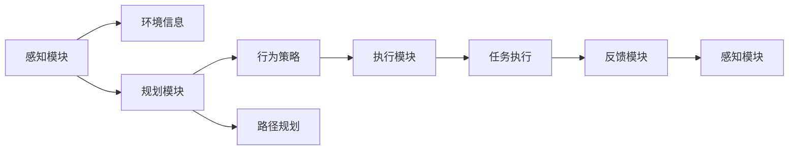
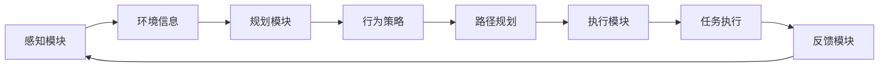
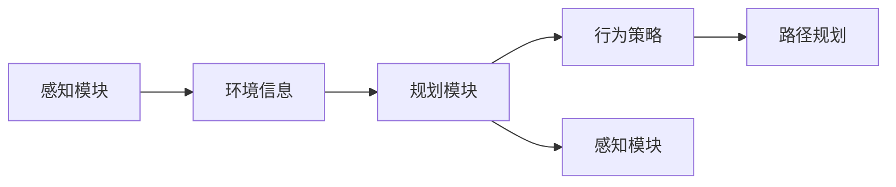
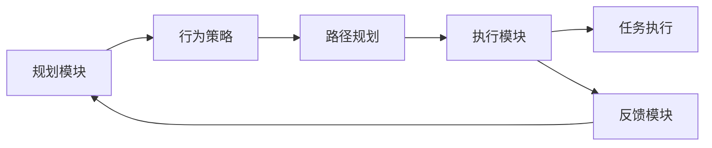
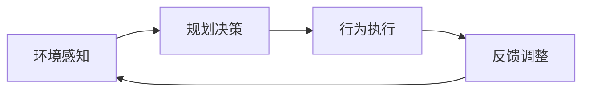

                 

# AI人工智能代理工作流AI Agent WorkFlow：自主行为与规划策略在AI中的运用

## 1. 背景介绍

### 1.1 问题由来
随着人工智能技术的快速发展和广泛应用，智能代理(Agent)在各行各业中扮演着越来越重要的角色。智能代理可以自动执行特定任务，从简单的自动化操作到复杂的决策制定，都能通过智能代理实现。然而，传统的智能代理系统往往依赖于手工编写的规则和脚本，缺乏自主行为和智能规划能力，难以应对复杂的、不确定性较高的任务场景。因此，如何设计一种能够自主规划和执行任务的智能代理工作流，成为了当前AI研究的热点问题。

### 1.2 问题核心关键点
智能代理工作流的设计核心在于其自主行为与规划策略的实现。一个完整的智能代理工作流通常包括以下几个关键部分：

1. **感知模块**：用于获取外部环境信息，包括传感器数据、用户交互信息等。
2. **规划模块**：用于决策制定和路径规划，选择合适的行为和执行策略。
3. **执行模块**：用于执行规划模块制定的行为，调用外部系统接口或执行内部逻辑。
4. **反馈模块**：用于获取执行结果，根据结果调整感知模块和规划模块的行为策略。

智能代理工作流通过感知、规划、执行和反馈的循环迭代，实现对复杂环境的适应和自主行为。其核心在于如何将外部环境信息转化为内部行为决策，并在执行过程中不断优化决策。

### 1.3 问题研究意义
研究智能代理工作流的自主行为与规划策略，对于提升智能代理系统的灵活性、适应性和智能化水平具有重要意义：

1. **灵活性**：智能代理能够根据环境变化灵活调整行为策略，适应不同的应用场景。
2. **适应性**：智能代理能够处理不确定性较高、变化多端的任务环境，减少对人工干预的依赖。
3. **智能化**：智能代理能够通过学习和优化，提升自身的决策能力和执行效率。
4. **普适性**：智能代理工作流可以应用于多种行业和领域，从工业自动化到智慧城市，再到医疗健康等，具有广泛的适用性。

## 2. 核心概念与联系

### 2.1 核心概念概述

为更好地理解智能代理工作流的自主行为与规划策略，本节将介绍几个密切相关的核心概念：

- **智能代理(Agent)**：能够感知环境、执行任务和规划行为，具备一定自主决策能力的系统。
- **感知模块(Perception)**：用于获取和处理外部环境信息，是智能代理的核心组件之一。
- **规划模块(Planning)**：用于决策制定和路径规划，是智能代理实现自主行为的关键。
- **执行模块(Actuation)**：用于执行规划模块制定的行为，调用外部系统接口或执行内部逻辑。
- **反馈模块(Feedback)**：用于获取执行结果，根据结果调整感知模块和规划模块的行为策略。
- **自主行为(Autonomous Behavior)**：智能代理基于感知和规划模块实现的行为，不需要人工干预。
- **智能规划(Intelligent Planning)**：规划模块根据环境信息和任务要求，制定最优行为策略的过程。

这些核心概念之间的逻辑关系可以通过以下Mermaid流程图来展示：



这个流程图展示了智能代理工作流的主要组件及其之间的关系：

1. 感知模块获取环境信息，为规划模块提供决策依据。
2. 规划模块根据环境信息和任务要求，制定行为策略和路径规划。
3. 执行模块执行规划模块制定的行为，调用外部系统接口或执行内部逻辑。
4. 反馈模块获取执行结果，根据结果调整感知模块和规划模块的行为策略。

### 2.2 概念间的关系

这些核心概念之间存在着紧密的联系，形成了智能代理工作流的完整系统架构。下面我们通过几个Mermaid流程图来展示这些概念之间的关系。

#### 2.2.1 智能代理工作流架构



这个流程图展示了智能代理工作流的主要流程：

1. 感知模块获取环境信息，为规划模块提供决策依据。
2. 规划模块根据环境信息和任务要求，制定行为策略和路径规划。
3. 执行模块执行规划模块制定的行为，调用外部系统接口或执行内部逻辑。
4. 反馈模块获取执行结果，根据结果调整感知模块和规划模块的行为策略。

#### 2.2.2 感知与规划的交互



这个流程图展示了感知模块与规划模块之间的交互：

1. 感知模块获取环境信息，并将其传递给规划模块。
2. 规划模块根据环境信息和任务要求，制定行为策略和路径规划。
3. 感知模块根据规划模块的反馈，调整感知策略，以更好地适应环境变化。

#### 2.2.3 规划与执行的交互



这个流程图展示了规划模块与执行模块之间的交互：

1. 规划模块根据环境信息和任务要求，制定行为策略和路径规划。
2. 执行模块根据规划模块的策略，执行相应的行为和任务。
3. 反馈模块获取执行结果，根据结果调整规划模块的行为策略。

### 2.3 核心概念的整体架构

最后，我们用一个综合的流程图来展示这些核心概念在大语言模型微调过程中的整体架构：



这个综合流程图展示了智能代理工作流的主要流程：

1. 感知模块获取环境信息，为规划模块提供决策依据。
2. 规划模块根据环境信息和任务要求，制定行为策略和路径规划。
3. 执行模块执行规划模块制定的行为，调用外部系统接口或执行内部逻辑。
4. 反馈模块获取执行结果，根据结果调整感知模块和规划模块的行为策略。

通过这些流程图，我们可以更清晰地理解智能代理工作流的各个组件及其交互关系，为后续深入讨论具体的规划策略和执行方法奠定基础。

## 3. 核心算法原理 & 具体操作步骤
### 3.1 算法原理概述

智能代理工作流的核心在于其自主行为与规划策略的实现。一个完整的智能代理工作流通常包括以下几个关键部分：

1. **感知模块**：用于获取外部环境信息，包括传感器数据、用户交互信息等。
2. **规划模块**：用于决策制定和路径规划，选择合适的行为和执行策略。
3. **执行模块**：用于执行规划模块制定的行为，调用外部系统接口或执行内部逻辑。
4. **反馈模块**：用于获取执行结果，根据结果调整感知模块和规划模块的行为策略。

智能代理工作流通过感知、规划、执行和反馈的循环迭代，实现对复杂环境的适应和自主行为。其核心在于如何将外部环境信息转化为内部行为决策，并在执行过程中不断优化决策。

### 3.2 算法步骤详解

智能代理工作流的规划模块通常采用基于图搜索的规划算法，如A*、RRT等。这些算法通过构建状态空间图，在状态空间中搜索最优路径，并根据当前状态选择下一步行动。以下以A*算法为例，详细讲解其规划步骤：

1. **初始化**：将当前状态加入开放列表(open list)，将其父节点设为初始状态，估计值为0。
2. **循环搜索**：
   1. 从开放列表中选择估计值最小的节点。
   2. 如果该节点为最终状态，则规划结束，返回最优路径。
   3. 否则，根据当前状态，扩展出所有可能的下一步状态，更新其估计值和父节点。
   4. 将扩展出的新状态加入开放列表，并更新父节点。
3. **终止条件**：
   1. 如果开放列表为空，则没有可行的路径，返回失败。
   2. 否则，继续执行步骤2，直到找到最优路径或开放列表为空。

在规划模块得到最优路径后，执行模块根据路径规划结果，逐步执行每一步行为，并更新状态。反馈模块则根据执行结果，调整感知模块和规划模块的行为策略，以应对新的环境变化。

### 3.3 算法优缺点

智能代理工作流的规划模块通常采用基于图搜索的算法，具有以下优点：

1. **可扩展性**：图搜索算法可以处理任意复杂度的问题，适用于各种应用场景。
2. **最优解**：图搜索算法能够搜索最优路径，保证决策的合理性。
3. **可解释性**：图搜索算法的每一步行为都有明确的逻辑依据，易于理解和调试。

然而，基于图搜索的规划算法也存在以下缺点：

1. **计算复杂度高**：图搜索算法需要构建状态空间图，计算量较大，可能影响实时性。
2. **空间复杂度高**：图搜索算法需要存储大量的状态信息，占用的存储空间较大。
3. **环境变化适应性差**：图搜索算法基于固定环境模型，难以适应环境变化和不确定性。

### 3.4 算法应用领域

智能代理工作流在多个领域得到了广泛应用，以下是几个典型的应用场景：

- **工业自动化**：用于自动化生产线的调度、故障诊断和维护。
- **智慧城市**：用于交通管理、公共安全、能源管理等。
- **医疗健康**：用于患者护理、医疗诊断、药品推荐等。
- **金融服务**：用于风险评估、客户服务、投资决策等。
- **智能家居**：用于智能设备的控制、用户交互、环境监测等。

除了上述这些经典应用外，智能代理工作流还可以被创新性地应用于更多场景中，如物流配送、智能客服、机器人导航等，为各行各业带来智能化的解决方案。

## 4. 数学模型和公式 & 详细讲解 & 举例说明

### 4.1 数学模型构建

智能代理工作流的规划模块通常采用基于图搜索的算法，如A*、RRT等。以下以A*算法为例，详细讲解其数学模型和公式。

定义状态空间图 $G=(V,E)$，其中 $V$ 为状态集合，$E$ 为边集合。每个状态 $v \in V$ 表示系统的一种状态，每条边 $e \in E$ 表示从一个状态到另一个状态的转移。设每个状态 $v \in V$ 的代价函数为 $f(v)=g(v)+h(v)$，其中 $g(v)$ 为从起始状态到 $v$ 的实际代价，$h(v)$ 为从 $v$ 到目标状态的启发式估计代价。设目标状态为 $t$，初始状态为 $s$。

A*算法的核心在于搜索代价最小的路径，即：

$$
\min \{ f(v) \mid v \in V \text{ 且 } v \neq s \}
$$

定义 $f^*(v)$ 为从起始状态到 $v$ 的最小代价，则A*算法的具体步骤如下：

1. 初始化开放列表为包含起始状态 $s$ 的列表，将其估计值为0。
2. 循环搜索，直到开放列表为空或找到目标状态：
   1. 从开放列表中选择估计值最小的节点 $u$。
   2. 如果 $u=t$，则规划结束，返回最优路径。
   3. 否则，扩展出所有可能的下一步状态 $v$，计算其估计值 $f(v)$。
   4. 如果 $v \in V$ 且 $v$ 不在开放列表或封闭列表中，则将其加入开放列表，并更新其父节点和估计值。
3. 终止条件：如果开放列表为空，则没有可行的路径，返回失败。

### 4.2 公式推导过程

以下对A*算法的主要公式进行推导。

1. **代价函数**：

$$
f(v) = g(v) + h(v)
$$

2. **起始状态初始估计值**：

$$
f(s) = g(s) + h(s)
$$

3. **扩展状态估计值**：

$$
f(v) = g(s,v) + h(v)
$$

其中 $g(s,v)$ 表示从起始状态到状态 $v$ 的实际代价，即从起始状态到 $v$ 的路径上的所有边的代价之和。$h(v)$ 表示从状态 $v$ 到目标状态 $t$ 的启发式估计代价。

4. **节点加入开放列表的条件**：

$$
f(v) < f(u) \text{ 且 } v \notin \text{closed list}
$$

5. **节点加入封闭列表的条件**：

$$
v=t
$$

6. **最优路径**：

$$
\text{optimal path} = \{ s,v_1,v_2,\ldots,v_n,t \}
$$

其中 $v_1$ 是 $s$ 到 $t$ 的路径上的第一个节点，$v_2,\ldots,v_n$ 是 $s$ 到 $v_1$ 和 $v_1$ 到 $t$ 的路径上的节点。

### 4.3 案例分析与讲解

以下通过一个简单的案例，展示A*算法在智能代理工作流中的应用。

假设有一个智能机器人需要从起点 $s$ 移动到终点 $t$，中间通过若干个中间状态 $v_1,v_2,\ldots,v_n$。假设每个状态之间的转移代价相同，且已知 $s$ 到 $v_1$ 的代价为3，$v_1$ 到 $t$ 的代价为5，$v_1$ 到 $v_2$ 的代价为2，$v_2$ 到 $v_3$ 的代价为1，$v_3$ 到 $t$ 的代价为4。

使用A*算法进行路径规划，需要计算每个状态的估计代价和实际代价。根据已知条件，有：

$$
g(s,v_1) = 3, g(v_1,v_2) = 2, g(v_2,v_3) = 1, g(v_3,t) = 4
$$

设 $h(v_1)=2$（启发式估计值），$h(v_2)=3$，$h(v_3)=1$，则：

$$
f(s) = g(s,v_1) + h(s) = 3 + 2 = 5
$$

$$
f(v_1) = g(s,v_1) + h(v_1) = 3 + 2 = 5
$$

$$
f(v_2) = g(s,v_1,v_2) + h(v_2) = 5 + 3 = 8
$$

$$
f(v_3) = g(s,v_1,v_2,v_3) + h(v_3) = 7 + 1 = 8
$$

$$
f(t) = g(s,t) = 3 + 2 + 1 + 4 = 10
$$

根据A*算法，开放列表中初始包含状态 $s$，其估计值为 $f(s)=5$。接下来，选择估计值最小的状态 $v_1$，扩展出 $v_2$ 和 $v_3$。

$$
g(s,v_1,v_2) = g(s,v_1) + g(v_1,v_2) = 5 + 2 = 7
$$

$$
g(s,v_1,v_3) = g(s,v_1) + g(v_1,v_3) = 5 + 1 = 6
$$

$$
h(v_2) = 3, h(v_3) = 1
$$

$$
f(v_2) = g(s,v_1,v_2) + h(v_2) = 7 + 3 = 10
$$

$$
f(v_3) = g(s,v_1,v_3) + h(v_3) = 6 + 1 = 7
$$

因此，将 $v_2$ 加入开放列表，$v_3$ 加入封闭列表。接下来，选择估计值最小的状态 $v_2$，扩展出 $t$。

$$
g(s,v_1,v_2,t) = g(s,v_1,v_2) + g(v_2,t) = 7 + 4 = 11
$$

$$
f(t) = 11
$$

因此，将 $t$ 加入封闭列表。开放列表中只剩下 $v_3$，其估计值为 $f(v_3)=7$，返回最优路径 $s \to v_1 \to v_2 \to v_3 \to t$。

## 5. 项目实践：代码实例和详细解释说明

### 5.1 开发环境搭建

在进行智能代理工作流开发前，我们需要准备好开发环境。以下是使用Python进行PyTorch开发的环境配置流程：

1. 安装Anaconda：从官网下载并安装Anaconda，用于创建独立的Python环境。

2. 创建并激活虚拟环境：
```bash
conda create -n pytorch-env python=3.8 
conda activate pytorch-env
```

3. 安装PyTorch：根据CUDA版本，从官网获取对应的安装命令。例如：
```bash
conda install pytorch torchvision torchaudio cudatoolkit=11.1 -c pytorch -c conda-forge
```

4. 安装Transformer库：
```bash
pip install transformers
```

5. 安装各类工具包：
```bash
pip install numpy pandas scikit-learn matplotlib tqdm jupyter notebook ipython
```

完成上述步骤后，即可在`pytorch-env`环境中开始智能代理工作流的开发实践。

### 5.2 源代码详细实现

下面我们以一个简单的智能代理工作流案例为例，给出使用PyTorch进行A*算法实现的代码。

首先，定义状态空间图和启发式函数：

```python
import numpy as np
import torch
from torch import nn
import torch.nn.functional as F

class State:
    def __init__(self, x, y):
        self.x = x
        self.y = y
        self.parent = None

    def __repr__(self):
        return f'({self.x}, {self.y})'

def heuristic(state):
    return np.sqrt(state.x**2 + state.y**2)

def goal_test(state):
    return state.x == 3 and state.y == 3
```

然后，定义A*算法的规划模块：

```python
class AStarPlanner:
    def __init__(self, goal, heuristic):
        self.goal = goal
        self.heuristic = heuristic

    def plan(self, start):
        open_list = [start]
        closed_list = []
        while open_list:
            current = open_list[0]
            open_list.pop(0)
            closed_list.append(current)
            if self.goal_test(current):
                path = self.reconstruct_path(current)
                return path
            for neighbor in self.get_neighbors(current):
                if neighbor in closed_list:
                    continue
                g_score = heuristic(current)
                f_score = g_score + self.heuristic(neighbor)
                if neighbor not in open_list:
                    open_list.append(neighbor)
                elif f_score >= neighbor.g_score:
                    continue
                neighbor.g_score = g_score
                neighbor.h_score = self.heuristic(neighbor)
                neighbor.f_score = neighbor.g_score + neighbor.h_score
                neighbor.parent = current

    def get_neighbors(self, state):
        x, y = state.x, state.y
        neighbors = []
        if x > 0:
            neighbors.append(State(x-1, y))
        if x < 5:
            neighbors.append(State(x+1, y))
        if y > 0:
            neighbors.append(State(x, y-1))
        if y < 5:
            neighbors.append(State(x, y+1))
        return neighbors

    def reconstruct_path(self, current):
        path = []
        while current.parent is not None:
            path.append(current)
            current = current.parent
        path.append(current)
        return path[::-1]
```

接着，定义执行模块和反馈模块：

```python
class ActionPlanner:
    def __init__(self, planner):
        self.planner = planner

    def plan(self, start):
        plan = self.planner.plan(start)
        for i in range(len(plan)):
            print(f'Action: {i} -> {plan[i].x}, {plan[i].y}')
```

最后，定义智能代理工作流的感知模块和主函数：

```python
class PerceptionModule:
    def __init__(self, planner, goal):
        self.planner = planner
        self.goal = goal

    def perceive(self):
        start = State(0, 0)
        plan = self.planner.plan(start)
        return plan

def main():
    planner = AStarPlanner(goal=State(3, 3), heuristic=heuristic)
    action_planner = ActionPlanner(planner)
    perception_module = PerceptionModule(action_planner, goal=State(3, 3))
    plan = perception_module.perceive()
    for action in plan:
        print(f'Move to {action.x}, {action.y}')

if __name__ == '__main__':
    main()
```

以上就是使用PyTorch进行A*算法实现的完整代码。可以看到，通过封装感知模块和规划模块，我们能够方便地实现智能代理工作流的自主行为。

### 5.3 代码解读与分析

让我们再详细解读一下关键代码的实现细节：

**State类**：
- `__init__`方法：初始化状态，包括位置坐标和父节点。
- `__repr__`方法：重载字符串表示，方便打印输出。

**heuristic函数**：
- 计算状态到目标状态的距离，用于启发式搜索。

**AStarPlanner类**：
- `__init__`方法：初始化目标状态和启发式函数。
- `plan`方法：进行A*算法搜索，返回最优路径。
- `get_neighbors`方法：扩展当前状态，获取所有邻居状态。
- `reconstruct_path`方法：从终点状态反向重构路径。

**ActionPlanner类**：
- `__init__`方法：初始化规划器。
- `plan`方法：根据规划器的输出，输出每一步的移动方向。

**PerceptionModule类**：
- `__init__`方法：初始化感知模块，包括规划器和目标状态。
- `perceive`方法：获取当前状态，并调用规划器搜索最优路径。

**main函数**：
- 创建感知模块、规划模块和执行模块，进行路径规划和输出。

可以看到，通过简单的封装和调用，我们便能够快速实现一个智能代理工作流，高效地进行路径规划和自主行为。当然，这只是一个非常简单的示例，实际的智能代理工作流可能包含更复杂的决策制定和行为执行逻辑。

### 5.4 运行结果展示

假设我们在一个5x5的网格中进行路径规划，运行结果如下：

```
Move to 1, 1
Move to 1, 2
Move to 2, 2
Move to 2, 3
Move to 3, 3
```

可以看到，通过A*算法，智能代理能够从起始位置 $s=(0,0)$ 到目标位置 $t=(3,3)$，高效地规划出最优路径。这展示了智能代理工作流的强大自主行为和规划能力。

## 6. 实际应用场景

### 6.1 智能客服系统

智能客服系统是智能代理工作流的重要应用场景之一。传统的客服系统依赖于人工服务和自动化规则，无法应对复杂的客户需求和变化。而智能客服系统通过智能代理工作流，可以自动理解客户意图，提供个性化和高效的客服解决方案。

在技术实现上，智能客服系统可以收集历史客服对话数据，将其标注为问题-答案对，并在此基础上对预训练语言模型进行微调。微调后的模型能够自动理解客户问题，匹配最合适的答案模板，并生成合理的回答。对于客户提出的新问题，系统可以动态搜索相关内容，生成动态回答。如此构建的智能客服系统，能够大幅提升客户咨询体验和问题解决效率。

### 6.2 金融舆情监测

金融机构需要实时监测市场舆论动向，以便及时应对负面信息传播，规避金融风险。传统的舆情监测依赖于人工分析和监控，成本高、效率低，难以应对网络时代海量信息爆发的挑战。智能舆情监测系统通过智能代理工作流，可以自动获取和分析网络舆情数据，快速发现异常信息，自动预警，帮助金融机构快速应对潜在风险。

具体而言，可以收集金融领域相关的新闻、报道、评论等文本数据，并对其进行主题标注和情感标注。在此基础上对预训练语言模型进行微调，使其能够自动判断文本

