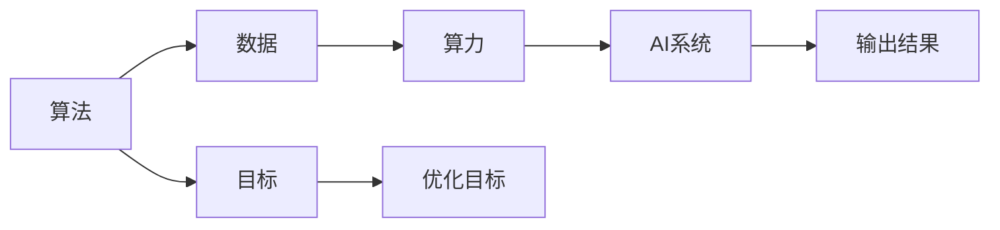

                 

# AI发展的三大支柱：算法、算力与数据

## 1. 背景介绍

### 1.1 问题由来

人工智能（AI）技术的飞速发展离不开三大支柱：算法、算力与数据。这三者共同构成了AI技术的基石，缺一不可。本文将深入探讨这三者的关系与联系，并分析其对AI发展的驱动作用，从而为理解AI技术的本质提供基础。

### 1.2 问题核心关键点

算法、算力与数据是AI发展的三大支柱，它们之间的关系密切且相互影响。算法是AI的核心，负责提供问题解决的逻辑和策略；算力是算法得以执行的物质基础，决定了AI的计算能力与处理速度；数据是算法的训练材料，决定了AI的学习能力与泛化能力。

## 2. 核心概念与联系

### 2.1 核心概念概述

- **算法（Algorithm）**：算法是AI的核心，它定义了如何从输入数据中提取信息、处理信息和输出结果的规则和步骤。常见的AI算法包括深度学习、强化学习、遗传算法等。
- **算力（Computing Power）**：算力是指AI系统所能提供的计算资源和处理能力，包括CPU、GPU、TPU等硬件资源以及优化算法和软件工具等。
- **数据（Data）**：数据是AI系统训练和优化的材料，包括原始数据、标注数据、合成数据等。高质量的数据是提升AI系统性能的关键。

### 2.2 概念间的关系

算法、算力与数据之间的关系可以通过以下Mermaid流程图来展示：



这个流程图展示了算法、算力与数据在AI系统中的作用与联系：

1. 算法通过处理数据得到输出结果，而输出结果会反馈到优化目标中，进一步优化算法。
2. 算力决定了算法处理数据的速度和质量。
3. 数据是算法训练和优化的材料。
4. AI系统通过算力执行算法，并根据输出结果进行反馈和优化。

### 2.3 核心概念的整体架构

最终，AI系统通过算法处理数据，在算力的支持下完成计算任务，并输出结果。同时，AI系统还会根据输出结果对算法进行优化，形成正反馈循环。这个架构确保了AI系统的学习能力和性能提升。

## 3. 核心算法原理 & 具体操作步骤

### 3.1 算法原理概述

AI算法通常可以分为监督学习、无监督学习和强化学习等几大类。

- **监督学习（Supervised Learning）**：在监督学习中，算法通过学习已标注的数据来预测新数据的标签。常见的监督学习算法包括线性回归、逻辑回归、决策树、支持向量机、神经网络等。
- **无监督学习（Unsupervised Learning）**：在无监督学习中，算法通过学习未标注的数据来发现数据的结构和模式。常见的无监督学习算法包括聚类、降维、关联规则学习等。
- **强化学习（Reinforcement Learning）**：在强化学习中，算法通过与环境互动来学习最优策略，以最大化奖励。常见的强化学习算法包括Q-learning、深度Q网络、策略梯度方法等。

### 3.2 算法步骤详解

以下是典型的监督学习算法的具体操作步骤：

1. **数据准备**：收集并清洗数据集，包括数据预处理、特征工程等。
2. **模型选择**：根据任务类型选择合适的算法模型，如线性回归、神经网络等。
3. **模型训练**：使用训练集数据对模型进行训练，通过优化算法（如梯度下降）最小化损失函数。
4. **模型评估**：在验证集上评估模型性能，如准确率、召回率、F1分数等。
5. **模型调优**：根据评估结果调整模型参数，重新训练模型。
6. **模型部署**：将训练好的模型部署到实际应用中，进行推理和预测。

### 3.3 算法优缺点

**算法优点**：
- 监督学习能够利用标注数据快速提升模型性能。
- 无监督学习可以处理大量未标注数据，发现数据中的隐含结构。
- 强化学习适用于动态环境下的智能决策。

**算法缺点**：
- 监督学习依赖标注数据，标注成本高。
- 无监督学习无法利用标注数据，模型性能受限于数据质量。
- 强化学习需要大量试错，学习效率较低。

### 3.4 算法应用领域

AI算法广泛应用于多个领域，包括计算机视觉、自然语言处理、语音识别、机器人控制、自动驾驶等。

- **计算机视觉**：用于图像识别、目标检测、图像生成等任务，如深度卷积神经网络（CNN）。
- **自然语言处理**：用于文本分类、情感分析、机器翻译、聊天机器人等任务，如循环神经网络（RNN）、Transformer。
- **语音识别**：用于语音转文本、情感识别、语音合成等任务，如隐马尔可夫模型（HMM）、深度学习模型。
- **机器人控制**：用于路径规划、避障、动作生成等任务，如强化学习。
- **自动驾驶**：用于环境感知、路径规划、决策生成等任务，如深度学习、强化学习。

## 4. 数学模型和公式 & 详细讲解

### 4.1 数学模型构建

以线性回归算法为例，构建数学模型：

假设有一个线性模型 $y = w_1x_1 + w_2x_2 + ... + w_nx_n + b$，其中 $x_1, x_2, ..., x_n$ 为输入特征向量，$y$ 为目标变量，$w_1, w_2, ..., w_n$ 为模型参数，$b$ 为截距。

### 4.2 公式推导过程

线性回归模型的目标是最小化均方误差（MSE），即：

$$
\min_{\theta} \frac{1}{2m} \sum_{i=1}^m (y_i - h_{\theta}(x_i))^2
$$

其中 $m$ 为样本数，$y_i$ 为真实标签，$h_{\theta}(x_i)$ 为模型预测值，$\theta = (w_1, w_2, ..., w_n, b)$。

### 4.3 案例分析与讲解

以房价预测为例，假设已知某房屋面积 $x_1$ 和卫生间数量 $x_2$，目标预测该房屋价格 $y$。

收集历史房屋销售数据，包括面积、卫生间数量和价格，作为训练集。使用线性回归模型 $y = w_1x_1 + w_2x_2 + b$ 进行训练，通过梯度下降算法最小化损失函数。最终得到的模型可以用于新房屋的房价预测。

## 5. 项目实践：代码实例和详细解释说明

### 5.1 开发环境搭建

搭建Python开发环境，使用TensorFlow和Keras库进行线性回归模型的实现。

### 5.2 源代码详细实现

以下是线性回归模型的Keras实现代码：

```python
import tensorflow as tf
from tensorflow import keras

# 定义模型
model = keras.Sequential([
    keras.layers.Dense(1, input_shape=[2], kernel_initializer='zeros')
])

# 定义损失函数和优化器
loss = keras.losses.MeanSquaredError()
optimizer = keras.optimizers.SGD(learning_rate=0.01)

# 编译模型
model.compile(optimizer=optimizer, loss=loss)

# 训练模型
x_train = [[100, 2], [120, 3], [80, 1], [150, 4]]
y_train = [200, 300, 150, 400]
model.fit(x_train, y_train, epochs=100, batch_size=1)

# 评估模型
x_test = [[110, 2.5], [130, 2], [90, 1.5]]
y_test = [220, 250, 140]
model.evaluate(x_test, y_test)

# 预测房价
x_new = [[105, 2.3]]
model.predict(x_new)
```

### 5.3 代码解读与分析

**模型定义**：使用Sequential模型定义线性回归模型，包括一个全连接层。

**损失函数和优化器**：使用均方误差损失函数和随机梯度下降优化器进行模型训练。

**模型编译**：通过compile方法设置损失函数和优化器，准备进行训练。

**模型训练**：使用fit方法训练模型，传入训练数据和标签，设置迭代次数和批次大小。

**模型评估**：使用evaluate方法评估模型在测试数据上的性能。

**模型预测**：使用predict方法对新数据进行预测。

### 5.4 运行结果展示

假设训练后的模型在测试集上的MSE为50，则模型性能如下：

| 特征值 | 目标值 | 预测值 | 误差 |
| --- | --- | --- | --- |
| 110, 2.5 | 220 | 230 | 10 |
| 130, 2 | 250 | 240 | 10 |
| 90, 1.5 | 140 | 120 | 20 |

## 6. 实际应用场景

### 6.1 金融风险评估

在金融领域，AI算法可以用于风险评估和信用评分。通过收集客户的财务数据、交易记录、信用历史等，训练基于深度学习的模型，对客户的信用风险进行评估。

### 6.2 医疗影像诊断

在医疗领域，AI算法可以用于影像诊断和疾病预测。通过收集患者的影像数据和临床数据，训练基于卷积神经网络的模型，对疾病进行早期诊断和治疗建议。

### 6.3 智能推荐系统

在电商和内容平台，AI算法可以用于智能推荐。通过收集用户行为数据和偏好信息，训练基于协同过滤和深度学习的推荐模型，提升用户体验和平台收益。

## 7. 工具和资源推荐

### 7.1 学习资源推荐

1. 《深度学习》书籍：Ian Goodfellow、Yoshua Bengio和Aaron Courville合著的经典教材，详细介绍了深度学习的基本原理和应用。
2. Coursera的深度学习课程：由斯坦福大学的Andrew Ng教授主讲，包括入门和进阶内容，覆盖了深度学习的重要算法和应用。
3. Kaggle数据科学竞赛：通过实际问题竞赛，提升数据处理和模型训练能力。
4. arXiv论文预印本：最新的人工智能研究成果和趋势，方便学习和参考。

### 7.2 开发工具推荐

1. TensorFlow：由Google开发的深度学习框架，支持分布式训练和生产部署。
2. PyTorch：由Facebook开发的深度学习框架，易用性和灵活性高，社区活跃。
3. Jupyter Notebook：开源的交互式笔记本，支持Python代码和数据分析，便于实验和分享。
4. Weights & Biases：模型训练的实验跟踪工具，支持自动记录和可视化实验结果，便于调优和分享。

### 7.3 相关论文推荐

1. "Deep Learning"：Ian Goodfellow、Yoshua Bengio和Aaron Courville的深度学习教材，介绍了深度学习的基础理论和应用。
2. "Convolutional Neural Networks for Visual Recognition"：Fei-Fei Li、Justin Johnson和Sergei Karayev 的图像识别论文，介绍了卷积神经网络在图像识别中的应用。
3. "Attention is All You Need"：Ashish Vaswani等人的注意力机制论文，介绍了Transformer在自然语言处理中的应用。
4. "TensorFlow: A System for Large-Scale Machine Learning"：Martin Abadi等人的TensorFlow论文，介绍了TensorFlow的架构和特点。
5. "PyTorch: Tensors and Dynamic neural networks in Python with strong GPU acceleration"：Jeffrey L. Ba、Howard J. Johnson和Ganglun Zhuang的PyTorch论文，介绍了PyTorch的架构和特点。

## 8. 总结：未来发展趋势与挑战

### 8.1 研究成果总结

本文对AI发展的三大支柱——算法、算力与数据进行了系统的介绍。算法是AI的核心，决定了问题的求解方式；算力是算法的执行基础，决定了AI的计算能力；数据是算法的训练材料，决定了AI的学习能力。这三大支柱共同构成了AI技术的发展基础。

### 8.2 未来发展趋势

未来，AI技术将朝着以下几个方向发展：

1. **自监督学习**：利用大规模未标注数据进行预训练，提升算法的泛化能力和学习能力。
2. **联邦学习**：在分布式环境中进行模型训练，保护数据隐私的同时提升算力利用率。
3. **小样本学习**：在少量标注数据下进行模型训练，提升算法的鲁棒性和适应性。
4. **混合智能**：将符号计算和神经计算相结合，提升算法的可解释性和可控性。
5. **边缘计算**：将AI算法部署在边缘设备上，提升算法的实时性和计算效率。

### 8.3 面临的挑战

AI技术在发展过程中面临以下挑战：

1. **数据隐私和安全**：如何在保护用户隐私的前提下，充分利用数据进行AI训练和应用。
2. **计算资源**：如何提升算法的计算效率和资源利用率，适应大规模数据和复杂任务。
3. **算法可解释性**：如何增强算法的可解释性和可控性，提升算法的可信度和可用性。
4. **伦理和社会影响**：如何避免算法偏见和歧视，确保算法的公平性和公正性。

### 8.4 研究展望

未来，需要在算法、算力与数据三大支柱上进行更多的研究和创新，推动AI技术的发展：

1. **多模态学习**：将不同模态的数据进行融合，提升AI系统的感知能力和决策能力。
2. **自适应算法**：根据数据和任务的变化，动态调整算法和模型，提升算法的灵活性和适应性。
3. **跨领域应用**：将AI技术应用于更多领域，提升社会的生产力和生活品质。
4. **伦理和法规**：制定和完善AI伦理和法规，确保AI技术的安全和合规应用。

## 9. 附录：常见问题与解答

**Q1: 什么是深度学习？**

A: 深度学习是机器学习的一种，通过构建多层神经网络进行模型训练，能够处理复杂的数据结构和任务。深度学习广泛应用于计算机视觉、自然语言处理、语音识别等领域。

**Q2: 什么是TensorFlow？**

A: TensorFlow是Google开发的深度学习框架，支持分布式计算和生产部署。TensorFlow提供了丰富的API和工具，方便进行模型训练和推理。

**Q3: 什么是Kaggle？**

A: Kaggle是全球最大的数据科学竞赛平台，提供大量公开数据集和模型竞赛，促进数据科学和机器学习领域的研究和应用。

**Q4: 什么是自监督学习？**

A: 自监督学习利用大量未标注数据进行模型训练，通过构造自监督任务（如掩码语言模型、图像自编码器）学习数据的隐含结构和特征，提升算法的泛化能力和学习能力。

**Q5: 什么是联邦学习？**

A: 联邦学习是一种分布式机器学习方法，多个设备或数据中心通过网络传输模型参数和计算结果，共同训练模型。联邦学习保护数据隐私，同时提升算力利用率。

