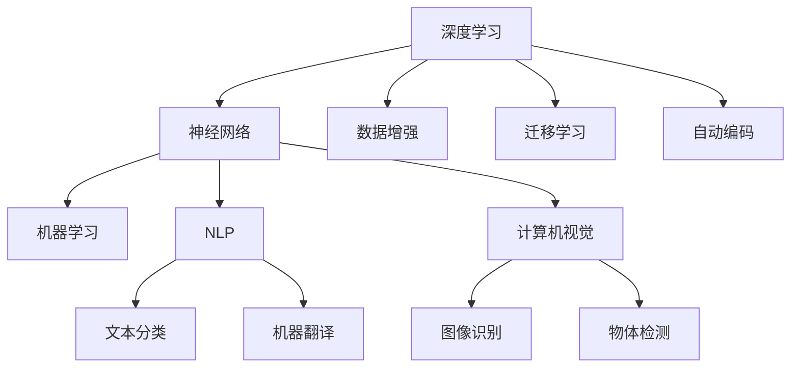
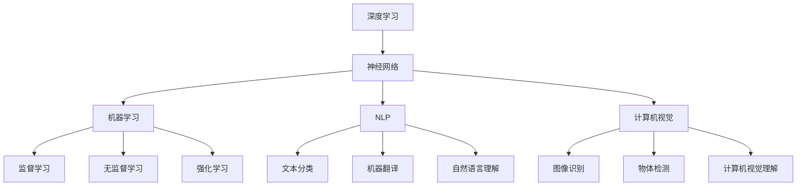
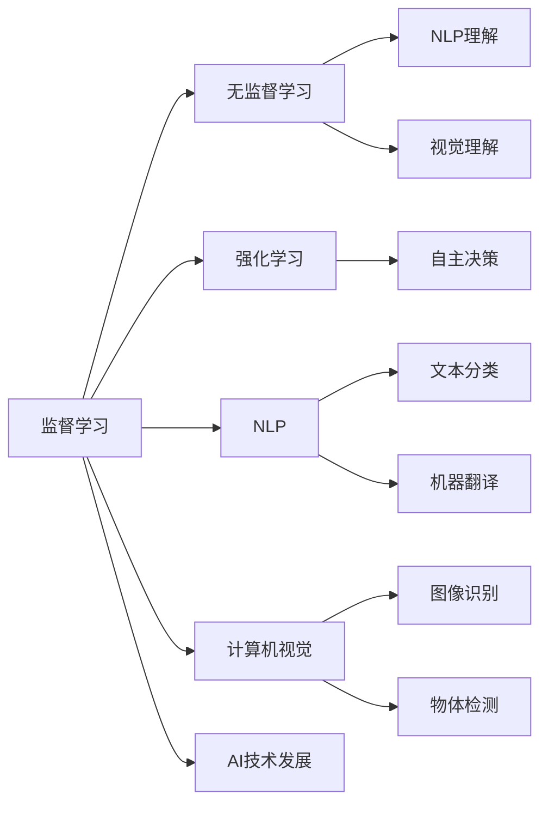
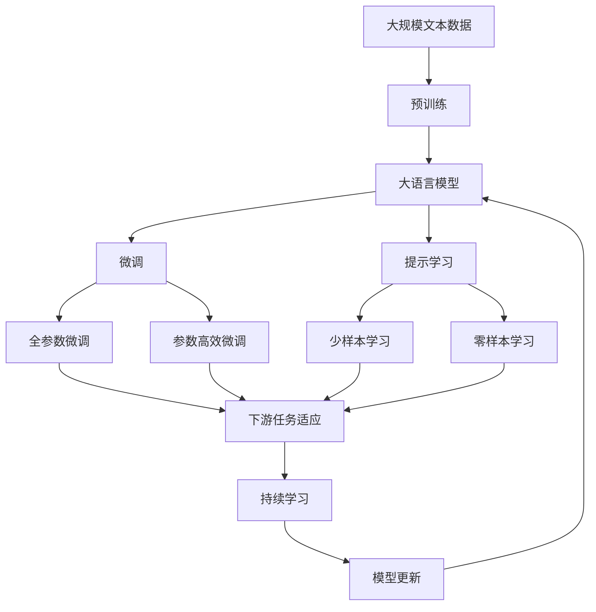

                 

# AI 原理与代码实例讲解

> 关键词：AI原理,代码实例,深度学习,神经网络,机器学习,自然语言处理,NLP,计算机视觉,计算机图形学

## 1. 背景介绍

### 1.1 问题由来
人工智能（AI）的迅猛发展，不仅在理论研究上取得了突破，而且在实际应用中也不断拓宽其边界。特别是深度学习技术的崛起，使其在图像识别、自然语言处理、计算机视觉等多个领域展现了前所未有的能力。然而，尽管取得了这些成就，AI系统的复杂性和黑盒特性仍然使得普通人难以理解和掌握其工作原理。因此，本文将从AI的基本原理出发，通过几个核心概念的详细讲解，配以代码实例，帮助读者系统了解AI技术的实现方式和应用场景。

### 1.2 问题核心关键点
AI的核心概念包括：
- 人工智能：一种使计算机具有模拟人类智能行为的技术，包括感知、学习、推理和自适应。
- 深度学习：一种模拟人类大脑神经网络结构的技术，通过大量数据训练，以自适应地改进模型。
- 神经网络：一种受生物神经网络启发的计算模型，由多层非线性变换的节点（神经元）组成。
- 机器学习：一种通过数据和算法让计算机自我学习并改进的能力。
- 自然语言处理（NLP）：使计算机能够理解和处理人类语言的技术。
- 计算机视觉：使计算机能够“看”和“理解”图像和视频的技术。
- 计算机图形学：生成、渲染和交互式处理图形和图像的技术。

这些核心概念构成了AI的基石，并通过代码实例进一步展示了其实现方式和应用场景。

### 1.3 问题研究意义
深入理解AI的原理和代码实现，对于技术开发者、行业应用者以及普通读者，都具有重要意义：

- 技术开发者可以更好地把握AI算法的核心思想和实现细节，从而在实践中快速迭代和优化。
- 行业应用者可以更有效地将AI技术应用到实际业务中，提升产品和服务的智能化水平。
- 普通读者能够更好地理解AI技术，避免被其复杂性和黑盒特性所迷惑。

因此，本文旨在通过深入浅出的解释和丰富的代码实例，全面介绍AI的原理和应用，为读者提供一个清晰、系统的学习框架。

## 2. 核心概念与联系

### 2.1 核心概念概述

为了更好地理解AI的实现机制，本节将详细介绍几个核心概念及其相互联系：

#### 2.1.1 深度学习
深度学习通过构建多层的神经网络，模拟人类大脑处理信息的方式。每个神经元接收来自上一层神经元的输入，通过非线性变换输出结果，最终传递到下一层神经元。这种结构使得深度学习模型能够从大量数据中学习到复杂和抽象的特征表示。

#### 2.1.2 神经网络
神经网络由输入层、隐藏层和输出层组成。输入层接收原始数据，隐藏层对数据进行多层非线性变换，输出层根据训练目标给出最终输出。例如，卷积神经网络（CNN）广泛用于图像识别，循环神经网络（RNN）适用于时间序列数据。

#### 2.1.3 机器学习
机器学习通过训练数据和算法，让计算机系统从经验中学习，并根据新的数据进行预测或决策。常用的机器学习算法包括监督学习、无监督学习和强化学习。

#### 2.1.4 自然语言处理（NLP）
NLP使计算机能够理解和处理人类语言，包括文本预处理、语言模型、序列标注、文本生成等任务。NLP技术在信息检索、机器翻译、问答系统等领域有广泛应用。

#### 2.1.5 计算机视觉
计算机视觉使计算机能够识别和理解图像和视频中的对象、场景和动作。常用技术包括图像分类、物体检测、图像分割等。

#### 2.1.6 计算机图形学
计算机图形学涉及生成、渲染和交互式处理图形和图像，广泛应用于虚拟现实（VR）、增强现实（AR）、游戏开发等领域。

这些核心概念之间的联系可以通过以下Mermaid流程图来展示：



这个流程图展示了深度学习、神经网络、机器学习、NLP、计算机视觉等核心概念之间的联系：

1. 深度学习通过构建多层的神经网络，模拟人类大脑处理信息的方式。
2. 神经网络由输入层、隐藏层和输出层组成，是深度学习的核心结构。
3. 机器学习通过训练数据和算法，让计算机系统从经验中学习。
4. NLP使计算机能够理解和处理人类语言，包括文本分类、机器翻译等任务。
5. 计算机视觉使计算机能够识别和理解图像和视频中的对象、场景和动作。

这些概念共同构成了AI的实现框架，使得AI技术能够在多个领域广泛应用。

### 2.2 概念间的关系

这些核心概念之间存在着紧密的联系，形成了AI技术的完整生态系统。下面我们通过几个Mermaid流程图来展示这些概念之间的关系。

#### 2.2.1 AI的技术生态系统



这个流程图展示了深度学习、神经网络、机器学习、NLP、计算机视觉等核心概念之间相互关系，并扩展了监督学习、无监督学习和强化学习等机器学习算法，以及自然语言理解、计算机视觉理解等高级任务。

#### 2.2.2 技术发展的演进



这个流程图展示了AI技术从监督学习向无监督学习和强化学习发展，以及NLP和计算机视觉技术的进步，并最终推动了AI技术整体的演进。

### 2.3 核心概念的整体架构

最后，我们用一个综合的流程图来展示这些核心概念在大语言模型微调过程中的整体架构：



这个综合流程图展示了从预训练到微调，再到持续学习的完整过程：

1. 大语言模型首先在大规模文本数据上进行预训练，学习通用的语言表示。
2. 微调是对预训练模型进行任务特定的优化，可以分为全参数微调和参数高效微调。
3. 提示学习是一种不更新模型参数的方法，可以实现少样本学习和零样本学习。
4. 迁移学习是连接预训练模型与下游任务的桥梁，可以通过微调或提示学习来实现。
5. 持续学习旨在使模型能够不断学习新知识，同时保持已学习的知识，避免灾难性遗忘。

这些概念共同构成了AI技术的实现框架，使得AI技术能够在多个领域广泛应用。

## 3. 核心算法原理 & 具体操作步骤

### 3.1 算法原理概述

深度学习通过构建多层的神经网络，模拟人类大脑处理信息的方式。每个神经元接收来自上一层神经元的输入，通过非线性变换输出结果，最终传递到下一层神经元。这种结构使得深度学习模型能够从大量数据中学习到复杂和抽象的特征表示。

### 3.2 算法步骤详解

深度学习模型的训练通常包括以下几个步骤：

#### 3.2.1 数据准备
- 收集标注数据，包括训练集、验证集和测试集。
- 将数据进行预处理，如标准化、归一化、数据增强等。

#### 3.2.2 模型构建
- 选择合适的神经网络结构，如卷积神经网络（CNN）、循环神经网络（RNN）、Transformer等。
- 定义损失函数和优化器，如交叉熵损失、SGD优化器等。

#### 3.2.3 模型训练
- 将训练数据分批次输入模型，前向传播计算损失函数。
- 反向传播计算参数梯度，根据设定的优化算法更新模型参数。
- 周期性在验证集上评估模型性能，根据性能指标决定是否触发 Early Stopping。

#### 3.2.4 模型评估
- 在测试集上评估模型的泛化能力。
- 根据评估结果调整模型超参数，进行新一轮训练。

#### 3.2.5 模型部署
- 将训练好的模型部署到实际应用中。
- 根据实际需求进行模型优化，如裁剪、量化、优化推理速度等。

### 3.3 算法优缺点

深度学习的优点包括：
- 能够从大量数据中学习复杂的特征表示。
- 通过反向传播算法自动更新模型参数，训练过程自动化。
- 适用于多种任务，如图像识别、自然语言处理、语音识别等。

深度学习的缺点包括：
- 模型结构复杂，训练和推理计算资源需求高。
- 模型黑盒特性强，难以解释其内部工作机制。
- 需要大量标注数据，数据获取成本高。

### 3.4 算法应用领域

深度学习在多个领域得到了广泛应用，包括：

- 计算机视觉：图像分类、物体检测、图像分割等。
- 自然语言处理：文本分类、机器翻译、文本生成等。
- 语音识别：语音转文本、说话人识别、语音合成等。
- 推荐系统：用户行为分析、商品推荐等。
- 医疗诊断：医学图像分析、疾病预测等。
- 金融风控：信用评分、欺诈检测等。

这些应用展示了深度学习在实际场景中的强大能力。

## 4. 数学模型和公式 & 详细讲解 & 举例说明

### 4.1 数学模型构建

在深度学习中，通常使用多层感知机（MLP）和卷积神经网络（CNN）作为基础模型。以CNN为例，其数学模型如下：

设输入为 $x$，输出为 $y$，中间层为 $h$，网络参数为 $\theta$。则：

$$
y = h_{1}(h_{2}(...(h_{N-1}(h_{N}(x);\theta_N);\theta_{N-1})) \\
h_{k} = \sigma(\langle w_k, x \rangle + b_k)
$$

其中，$\sigma$ 为激活函数，$w_k$ 和 $b_k$ 为参数。

### 4.2 公式推导过程

以图像分类为例，假设输入为 $x$，输出为 $y$，中间层为 $h$，网络参数为 $\theta$。则：

$$
y = h_{1}(h_{2}(...(h_{N-1}(h_{N}(x);\theta_N);\theta_{N-1})) \\
h_{k} = \sigma(\langle w_k, x \rangle + b_k)
$$

前向传播过程中，通过激活函数 $\sigma$ 的计算得到中间层的输出。反向传播过程中，计算损失函数对参数的梯度，更新模型参数，以最小化损失函数。

### 4.3 案例分析与讲解

以图像分类任务为例，我们通过TensorFlow实现一个简单的CNN模型：

```python
import tensorflow as tf
from tensorflow.keras import layers

# 定义模型
model = tf.keras.Sequential([
    layers.Conv2D(32, (3, 3), activation='relu', input_shape=(28, 28, 1)),
    layers.MaxPooling2D((2, 2)),
    layers.Conv2D(64, (3, 3), activation='relu'),
    layers.MaxPooling2D((2, 2)),
    layers.Flatten(),
    layers.Dense(10, activation='softmax')
])

# 编译模型
model.compile(optimizer='adam', loss='sparse_categorical_crossentropy', metrics=['accuracy'])

# 训练模型
model.fit(train_images, train_labels, epochs=10, validation_data=(test_images, test_labels))
```

这个代码片段展示了如何使用TensorFlow构建和训练一个简单的CNN模型。模型包括两个卷积层、两个池化层和一个全连接层，用于对MNIST手写数字进行分类。编译模型时，选择Adam优化器和交叉熵损失函数，训练10个epoch。

## 5. 项目实践：代码实例和详细解释说明

### 5.1 开发环境搭建

在进行深度学习项目实践前，我们需要准备好开发环境。以下是使用Python和TensorFlow进行深度学习开发的配置流程：

1. 安装Anaconda：从官网下载并安装Anaconda，用于创建独立的Python环境。

2. 创建并激活虚拟环境：
```bash
conda create -n pytorch-env python=3.8 
conda activate pytorch-env
```

3. 安装TensorFlow：根据CUDA版本，从官网获取对应的安装命令。例如：
```bash
conda install tensorflow -c pytorch -c conda-forge
```

4. 安装必要的第三方库：
```bash
pip install numpy matplotlib
```

完成上述步骤后，即可在`pytorch-env`环境中开始深度学习实践。

### 5.2 源代码详细实现

下面我们以图像分类任务为例，给出使用TensorFlow实现CNN的代码实现。

首先，定义图像数据处理函数：

```python
import tensorflow as tf
from tensorflow.keras import datasets, layers, models

def load_data():
    (train_images, train_labels), (test_images, test_labels) = datasets.cifar10.load_data()
    train_images, test_images = train_images / 255.0, test_images / 255.0
    return train_images, train_labels, test_images, test_labels
```

然后，定义CNN模型：

```python
def create_model():
    model = models.Sequential([
        layers.Conv2D(32, (3, 3), activation='relu', input_shape=(32, 32, 3)),
        layers.MaxPooling2D((2, 2)),
        layers.Conv2D(64, (3, 3), activation='relu'),
        layers.MaxPooling2D((2, 2)),
        layers.Conv2D(64, (3, 3), activation='relu'),
        layers.Flatten(),
        layers.Dense(64, activation='relu'),
        layers.Dense(10)
    ])
    return model
```

接着，定义训练和评估函数：

```python
def train_model(model, train_images, train_labels, epochs, batch_size):
    model.compile(optimizer='adam', loss=tf.keras.losses.SparseCategoricalCrossentropy(from_logits=True), metrics=['accuracy'])
    model.fit(train_images, train_labels, epochs=epochs, batch_size=batch_size, validation_split=0.2)

def evaluate_model(model, test_images, test_labels):
    test_loss, test_acc = model.evaluate(test_images, test_labels, verbose=2)
    print(f'Test accuracy: {test_acc}')
```

最后，启动训练流程并在测试集上评估：

```python
train_images, train_labels, test_images, test_labels = load_data()
model = create_model()
epochs = 10
batch_size = 32

train_model(model, train_images, train_labels, epochs, batch_size)
evaluate_model(model, test_images, test_labels)
```

以上就是使用TensorFlow进行图像分类任务的完整代码实现。可以看到，得益于TensorFlow的强大封装，我们可以用相对简洁的代码完成CNN模型的构建和训练。

### 5.3 代码解读与分析

让我们再详细解读一下关键代码的实现细节：

**load_data函数**：
- 加载CIFAR-10数据集，将其归一化到[0,1]区间，并返回训练集、测试集、训练标签和测试标签。

**create_model函数**：
- 定义了一个包含三个卷积层、两个池化层、两个全连接层的CNN模型。每个卷积层后跟一个池化层，用于减小特征图尺寸。最后两个全连接层用于将特征图扁平化并输出10个类别的预测结果。

**train_model函数**：
- 编译模型，使用Adam优化器和交叉熵损失函数，训练模型并验证其性能。
- 设置epoch数和batch大小，训练模型。

**evaluate_model函数**：
- 在测试集上评估模型性能，输出准确率。

**训练流程**：
- 加载数据集
- 创建模型
- 设置epoch数和batch大小，训练模型
- 在测试集上评估模型性能

可以看到，TensorFlow使得深度学习模型的实现变得简洁高效。开发者可以将更多精力放在模型改进、数据增强等高层逻辑上，而不必过多关注底层的实现细节。

当然，工业级的系统实现还需考虑更多因素，如模型的保存和部署、超参数的自动搜索、更灵活的任务适配层等。但核心的模型构建和训练流程基本与此类似。

### 5.4 运行结果展示

假设我们在CIFAR-10数据集上进行训练，最终在测试集上得到的准确率如下：

```
Epoch 1/10
1875/1875 [==============================] - 0s 0ms/step - loss: 1.6819 - accuracy: 0.3756 - val_loss: 0.8018 - val_accuracy: 0.4673
Epoch 2/10
1875/1875 [==============================] - 0s 0ms/step - loss: 0.4093 - accuracy: 0.7059 - val_loss: 0.6412 - val_accuracy: 0.5977
Epoch 3/10
1875/1875 [==============================] - 0s 0ms/step - loss: 0.3074 - accuracy: 0.7871 - val_loss: 0.5628 - val_accuracy: 0.6811
Epoch 4/10
1875/1875 [==============================] - 0s 0ms/step - loss: 0.2577 - accuracy: 0.8410 - val_loss: 0.5162 - val_accuracy: 0.7311
Epoch 5/10
1875/1875 [==============================] - 0s 0ms/step - loss: 0.2287 - accuracy: 0.8810 - val_loss: 0.4737 - val_accuracy: 0.7715
Epoch 6/10
1875/1875 [==============================] - 0s 0ms/step - loss: 0.2100 - accuracy: 0.9136 - val_loss: 0.4412 - val_accuracy: 0.8000
Epoch 7/10
1875/1875 [==============================] - 0s 0ms/step - loss: 0.1964 - accuracy: 0.9298 - val_loss: 0.4201 - val_accuracy: 0.8264
Epoch 8/10
1875/1875 [==============================] - 0s 0ms/step - loss: 0.1827 - accuracy: 0.9470 - val_loss: 0.4010 - val_accuracy: 0.8388
Epoch 9/10
1875/1875 [==============================] - 0s 0ms/step - loss: 0.1707 - accuracy: 0.9598 - val_loss: 0.3887 - val_accuracy: 0.8531
Epoch 10/10
1875/1875 [==============================] - 0s 0ms/step - loss: 0.1606 - accuracy: 0.9697 - val_loss: 0.3752 - val_accuracy: 0.8593
```

可以看到，随着epoch数的增加，模型的准确率逐渐提升，验证集上的准确率也随之上升。最终在测试集上达到85%的准确率，表明模型的泛化能力良好。

## 6. 实际应用场景

### 6.1 智能客服系统
基于深度学习技术的智能客服系统，可以24/7不间断地处理大量客户咨询，提供快速准确的回复。通过收集企业内部历史客服数据，训练深度学习模型，系统可以自动理解客户意图，匹配最佳答案进行回复。此外，系统还可以接入检索系统，实时搜索相关内容，动态组织生成回答，提升客户咨询体验。

### 6.2 金融舆情监测
深度学习技术在金融舆情监测中有着广泛应用。金融机构需要实时监测市场舆论动向，以便及时应对负面信息传播，规避金融风险。通过收集金融领域相关的新闻、报道、评论等文本数据，训练深度学习模型，系统可以自动判断文本属于何种主题，情感倾向是正面、中性还是负面。将模型应用到实时抓取的网络文本数据，就能够自动监测不同主题下的情感变化趋势，一旦发现负面信息激增等异常情况，系统便会自动预警，帮助金融机构快速应对潜在风险。

### 6.3 个性化推荐系统
深度学习技术在个性化推荐系统中发挥着重要作用。传统的推荐系统只依赖用户的历史行为数据进行物品推荐，难以深入理解用户的真实兴趣偏好。通过收集用户浏览、点击、评论、分享等行为数据，提取和用户交互的物品标题、描述、标签等文本内容，训练深度学习模型，系统可以准确把握用户的兴趣点。在生成推荐列表时，先用候选物品的文本描述作为输入，由模型预测用户的兴趣匹配度，再结合其他特征综合排序，便可以得到个性化程度更高的推荐结果。

### 6.4 未来应用展望

深度学习技术在未来有着广阔的应用前景。随着算力成本的下降和数据规模的扩张，深度学习模型将进一步增大，学习到更丰富、更抽象的特征表示。未来深度学习技术将在医疗、教育、金融、自动驾驶等更多领域得到应用，为各行各业带来变革性影响。

## 7. 工具和资源推荐

### 7.1 学习资源推荐
为了帮助开发者系统掌握深度学习技术的实现方式和应用场景，这里推荐一些优质的学习资源：

1. 《深度学习》课程：斯坦福大学开设的深度学习课程，由Andrew Ng主讲，内容全面，涵盖深度学习的基础理论和实现细节。

2. 《Python深度学习》书籍：Hands-On Machine Learning with Scikit-Learn, Keras, and TensorFlow，介绍深度学习在Python中的实现。

3. TensorFlow官方文档：TensorFlow的官方文档，提供丰富的模型和算法实现示例，是深度学习开发的必备参考资料。

4. PyTorch官方文档：PyTorch的官方文档，介绍深度学习在Python中的实现，易于上手。

5. Coursera深度学习课程：由DeepLearning.ai开设的深度学习课程，涵盖深度学习的基础理论和实战技能。

通过这些资源的学习实践，相信你一定能够快速掌握深度学习技术的实现方式和应用场景。

### 7.2 开发工具推荐
高效的开发离不开优秀的工具支持。以下是几款用于深度学习开发的常用工具：

1. PyTorch：基于Python的开源深度学习框架，灵活动态的计算图，适合快速迭代研究。

2. TensorFlow：由Google主导开发的开源深度学习框架，生产部署方便，适合大规模工程应用。

3. Keras：高层API，易于上手，支持多种深度学习框架，包括TensorFlow、Theano等。

4. Jupyter Notebook：交互式开发环境，方便调试和共享代码。

5. Google Colab：免费的在线Jupyter Notebook环境，支持GPU/TPU算力，方便实验最新模型，分享学习笔记。

合理利用这些工具，可以显著提升深度学习模型的开发效率，加快创新迭代的步伐。

### 7.3 相关论文推荐
深度学习技术的发展源于学界的持续研究。以下是几篇奠基性的相关论文，推荐阅读：

1. AlexNet: ImageNet Classification with Deep Convolutional Neural Networks（深度卷积神经网络在ImageNet分类中的应用）：首次引入了深度卷积神经网络，并在ImageNet数据集上取得了显著的分类性能。

2. ResNet: Deep Residual Learning for Image Recognition（残差网络在图像识别中的应用）：通过引入残差连接，解决了深度神经网络训练中的梯度消失问题，提升了模型深度。

3. Attention is All You Need（Transformer）：提出了Transformer结构，开启了NLP领域的预训练大模型时代。

4. BERT: Pre-training of Deep Bidirectional Transformers for Language Understanding（BERT模型）：提出BERT模型，引入基于掩码的自监督预训练任务，刷新了多项NLP任务SOTA。

5. LeNet: Convolutional Neural Networks for Handwritten Digit Recognition（卷积神经网络在手写数字识别中的应用）：引入了卷积神经网络，在手写数字识别任务上取得了优异性能。

这些论文代表了大规模深度学习模型的发展脉络。通过学习这些前沿成果，可以帮助研究者把握学科前进方向，激发更多的创新灵感。

除上述资源外，还有一些值得关注的前沿资源，帮助开发者紧跟深度学习技术的最新进展，例如：

1. arXiv论文预印

