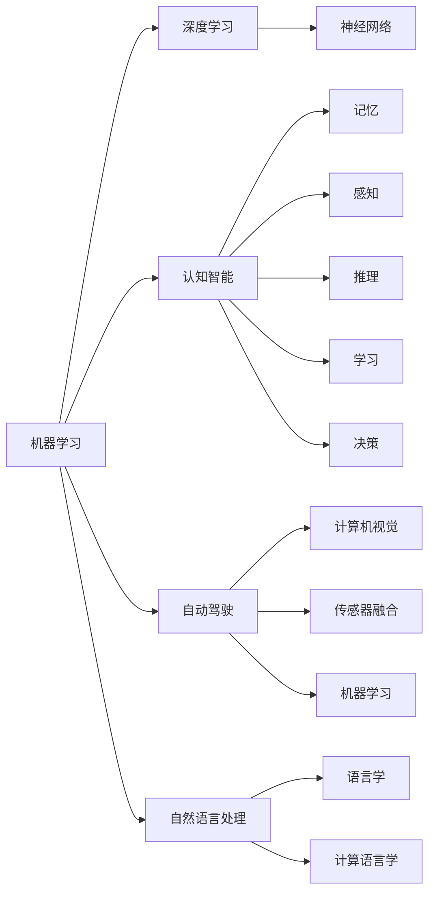

# 人工智能的未来发展方向

> 关键词：人工智能，机器学习，深度学习，自动驾驶，自然语言处理，认知智能，伦理道德，人机协作

## 1. 背景介绍

人工智能（Artificial Intelligence, AI）作为计算机科学的一个分支，旨在模拟、延伸和扩展人类的智能。从最初的专家系统到如今的深度学习模型，人工智能技术经历了数十年的发展，已经渗透到我们生活的方方面面。然而，随着技术的不断进步，人工智能的未来发展方向也日益多元化。本文将探讨人工智能的未来发展方向，分析其中的机遇与挑战。

## 2. 核心概念与联系

### 2.1 核心概念

#### 2.1.1 机器学习

机器学习（Machine Learning, ML）是人工智能的核心技术之一，它使计算机能够从数据中学习，并基于学习到的模式进行预测或决策。机器学习主要分为监督学习、无监督学习和强化学习三种类型。

#### 2.1.2 深度学习

深度学习（Deep Learning, DL）是机器学习的一个子领域，它使用类似于人类大脑的神经网络结构来学习数据中的复杂模式。深度学习在图像识别、语音识别等领域取得了显著成果。

#### 2.1.3 认知智能

认知智能（Cognitive Computing）是人工智能的一个分支，它试图模拟人类的认知过程，包括记忆、感知、推理、学习和决策等。

#### 2.1.4 自动驾驶

自动驾驶（Autonomous Vehicles）是人工智能在交通运输领域的应用，它利用计算机视觉、传感器融合、机器学习等技术，使汽车能够自动行驶。

#### 2.1.5 自然语言处理

自然语言处理（Natural Language Processing, NLP）是人工智能的一个分支，它使计算机能够理解和生成人类语言。

### 2.2 核心概念之间的联系



如图所示，机器学习是人工智能的核心技术，它涵盖了深度学习、认知智能、自动驾驶和自然语言处理等多个分支。深度学习是机器学习的一个子领域，它依赖于神经网络技术。认知智能则试图模拟人类的认知过程。自动驾驶和自然语言处理则是人工智能在不同领域的具体应用。

## 3. 核心算法原理 & 具体操作步骤

### 3.1 算法原理概述

#### 3.1.1 机器学习算法

机器学习算法主要包括监督学习、无监督学习和强化学习。监督学习使用标注数据训练模型，无监督学习使用未标注数据寻找数据中的模式，强化学习则通过奖励信号训练模型。

#### 3.1.2 深度学习算法

深度学习算法主要包括卷积神经网络（CNN）、循环神经网络（RNN）、长短期记忆网络（LSTM）和Transformer等。这些算法能够学习数据中的复杂特征，并在图像识别、语音识别等领域取得显著成果。

#### 3.1.3 认知智能算法

认知智能算法主要包括神经网络、决策树、贝叶斯网络和遗传算法等。这些算法能够模拟人类的认知过程，并应用于知识表示、推理和规划等领域。

#### 3.1.4 自动驾驶算法

自动驾驶算法主要包括计算机视觉、传感器融合、路径规划和控制等。这些算法能够使汽车在复杂环境中自动行驶。

#### 3.1.5 自然语言处理算法

自然语言处理算法主要包括词嵌入、序列标注、机器翻译和情感分析等。这些算法能够使计算机理解和生成人类语言。

### 3.2 算法步骤详解

#### 3.2.1 机器学习算法步骤

1. 数据收集：收集相关领域的标注数据或未标注数据。
2. 数据预处理：对数据进行清洗、去噪、归一化等处理。
3. 模型选择：根据任务类型选择合适的机器学习算法。
4. 模型训练：使用训练数据进行模型训练。
5. 模型评估：使用测试数据评估模型性能。
6. 模型优化：根据评估结果对模型进行优化。

#### 3.2.2 深度学习算法步骤

1. 数据收集：收集相关领域的标注数据或未标注数据。
2. 数据预处理：对数据进行清洗、去噪、归一化等处理。
3. 网络结构设计：设计合适的神经网络结构。
4. 模型训练：使用训练数据进行模型训练。
5. 模型评估：使用测试数据评估模型性能。
6. 模型优化：根据评估结果对模型进行优化。

#### 3.2.3 认知智能算法步骤

1. 知识表示：将知识表示为计算机可理解的形式。
2. 知识推理：使用推理算法对知识进行推理。
3. 知识学习：使用学习算法更新知识。
4. 知识应用：将知识应用于实际问题。

#### 3.2.4 自动驾驶算法步骤

1. 数据收集：收集车辆、道路和交通状况等数据。
2. 数据预处理：对数据进行清洗、去噪、归一化等处理。
3. 计算机视觉：使用计算机视觉算法识别道路、车辆等。
4. 传感器融合：融合来自不同传感器的数据，提高系统鲁棒性。
5. 路径规划：规划行驶路径。
6. 控制：控制车辆行驶。

#### 3.2.5 自然语言处理算法步骤

1. 数据收集：收集自然语言文本数据。
2. 数据预处理：对数据进行清洗、去噪、归一化等处理。
3. 词嵌入：将文本转换为向量表示。
4. 序列标注：对文本序列进行标注。
5. 机器翻译：将一种语言翻译成另一种语言。
6. 情感分析：分析文本的情感倾向。

### 3.3 算法优缺点

#### 3.3.1 机器学习算法优缺点

**优点**：

* 灵活性：适用于各种任务类型。
* 可解释性：可以解释模型决策过程。

**缺点**：

* 数据依赖：需要大量的标注数据。
* 泛化能力：在数据分布发生变化时，模型性能可能会下降。

#### 3.3.2 深度学习算法优缺点

**优点**：

* 表征能力：能够学习数据中的复杂特征。
* 泛化能力：在数据分布发生变化时，模型性能相对稳定。

**缺点**：

* 模型复杂性：模型结构复杂，难以解释。
* 计算资源消耗：需要大量的计算资源。

#### 3.3.3 认知智能算法优缺点

**优点**：

* 模拟人类认知过程。
* 应用范围广。

**缺点**：

* 算法复杂度：算法复杂度较高，难以实现。
* 知识表示：难以将知识表示为计算机可理解的形式。

#### 3.3.4 自动驾驶算法优缺点

**优点**：

* 安全性：提高交通安全。
* 便捷性：提高出行效率。

**缺点**：

* 算法复杂度：算法复杂度较高，难以实现。
* 传感器依赖：对传感器性能要求较高。

#### 3.3.5 自然语言处理算法优缺点

**优点**：

* 能够理解和生成人类语言。
* 应用范围广。

**缺点**：

* 数据依赖：需要大量的标注数据。
* 语言复杂性：难以处理自然语言的歧义性。

### 3.4 算法应用领域

#### 3.4.1 机器学习算法应用领域

* 图像识别
* 语音识别
* 机器翻译
* 情感分析
* 个性化推荐

#### 3.4.2 深度学习算法应用领域

* 图像识别
* 语音识别
* 自然语言处理
* 自动驾驶
* 游戏

#### 3.4.3 认知智能算法应用领域

* 专家系统
* 知识图谱
* 智能问答
* 计划与调度
* 机器人

#### 3.4.4 自动驾驶算法应用领域

* 无人驾驶汽车
* 无人机
* 船舶
* 轨道交通

#### 3.4.5 自然语言处理算法应用领域

* 智能客服
* 聊天机器人
* 搜索引擎
* 机器翻译
* 情感分析

## 4. 数学模型和公式 & 详细讲解 & 举例说明

### 4.1 数学模型构建

#### 4.1.1 机器学习模型

机器学习模型主要包括线性回归、逻辑回归、支持向量机、决策树、随机森林、神经网络等。

#### 4.1.2 深度学习模型

深度学习模型主要包括卷积神经网络（CNN）、循环神经网络（RNN）、长短期记忆网络（LSTM）和Transformer等。

#### 4.1.3 认知智能模型

认知智能模型主要包括神经网络、决策树、贝叶斯网络和遗传算法等。

#### 4.1.4 自动驾驶模型

自动驾驶模型主要包括计算机视觉模型、传感器融合模型、路径规划模型和控制模型。

#### 4.1.5 自然语言处理模型

自然语言处理模型主要包括词嵌入模型、序列标注模型、机器翻译模型和情感分析模型。

### 4.2 公式推导过程

#### 4.2.1 机器学习模型公式

* 线性回归：$y = \beta_0 + \beta_1 x + \epsilon$
* 逻辑回归：$P(y=1) = \frac{1}{1 + e^{-\beta_0 + \beta_1 x}}$

#### 4.2.2 深度学习模型公式

* 卷积神经网络：$h(x) = f(WL(x) + b)$
* 循环神经网络：$h_t = f(Wx_t + Uh_{t-1} + b)$
* 长短期记忆网络：$C_t = \sigma(Ux_t + C_{t-1} + b)$
* Transformer：$y_t = f(QWQ^T + KWK + VK + b)$

#### 4.2.3 认知智能模型公式

* 决策树：$T = (D, A, V, f, L)$
* 贝叶斯网络：$P(X) = \prod_{i=1}^n P(X_i | Pa(X_i))$

#### 4.2.4 自动驾驶模型公式

* 计算机视觉：$h(x) = f(WL(x) + b)$
* 传感器融合：$z = f(x, y, z)$
* 路径规划：$C = \arg\min_{\pi} \sum_{t=1}^T c(\pi(t), \pi(t+1))$
* 控制：$u = f(x, y, z)$

#### 4.2.5 自然语言处理模型公式

* 词嵌入：$e_w = \text{Word2Vec}(w)$
* 序列标注：$P(y|x) = \frac{\exp(\theta_{y|x})}{\sum_y \exp(\theta_{y|x})}$
* 机器翻译：$P(y|x) = \frac{\exp(\theta_{y|x})}{\sum_y \exp(\theta_{y|x})}$
* 情感分析：$P(y|x) = \frac{\exp(\theta_{y|x})}{\sum_y \exp(\theta_{y|x})}$

### 4.3 案例分析与讲解

#### 4.3.1 机器学习案例

**案例：房价预测**

1. 数据收集：收集房价、面积、地段等数据。
2. 数据预处理：对数据进行清洗、归一化等处理。
3. 模型选择：选择线性回归模型。
4. 模型训练：使用训练数据进行模型训练。
5. 模型评估：使用测试数据评估模型性能。
6. 模型优化：根据评估结果对模型进行优化。

**结果**：模型能够较好地预测房价。

#### 4.3.2 深度学习案例

**案例：图像分类**

1. 数据收集：收集大量图像数据。
2. 数据预处理：对图像数据进行清洗、归一化等处理。
3. 模型选择：选择卷积神经网络模型。
4. 模型训练：使用训练数据进行模型训练。
5. 模型评估：使用测试数据评估模型性能。
6. 模型优化：根据评估结果对模型进行优化。

**结果**：模型能够较好地对图像进行分类。

#### 4.3.3 认知智能案例

**案例：专家系统**

1. 知识表示：将知识表示为规则。
2. 知识推理：使用推理算法对知识进行推理。
3. 知识学习：使用学习算法更新知识。
4. 知识应用：将知识应用于实际问题。

**结果**：专家系统能够解决特定领域的问题。

#### 4.3.4 自动驾驶案例

**案例：自动驾驶汽车**

1. 数据收集：收集车辆、道路和交通状况等数据。
2. 数据预处理：对数据进行清洗、去噪、归一化等处理。
3. 计算机视觉：使用计算机视觉算法识别道路、车辆等。
4. 传感器融合：融合来自不同传感器的数据，提高系统鲁棒性。
5. 路径规划：规划行驶路径。
6. 控制：控制车辆行驶。

**结果**：自动驾驶汽车能够自动行驶。

#### 4.3.5 自然语言处理案例

**案例：机器翻译**

1. 数据收集：收集双语语料。
2. 数据预处理：对文本数据进行清洗、归一化等处理。
3. 模型选择：选择机器翻译模型。
4. 模型训练：使用训练数据进行模型训练。
5. 模型评估：使用测试数据评估模型性能。
6. 模型优化：根据评估结果对模型进行优化。

**结果**：模型能够将一种语言翻译成另一种语言。

## 5. 项目实践：代码实例和详细解释说明

### 5.1 开发环境搭建

为了进行人工智能项目实践，需要搭建以下开发环境：

1. 操作系统：Linux或Windows
2. 编程语言：Python
3. 开发工具：Jupyter Notebook或PyCharm
4. 库和框架：NumPy、Pandas、Scikit-learn、TensorFlow、PyTorch、Keras等

### 5.2 源代码详细实现

以下是一个使用Python和TensorFlow实现的线性回归模型代码示例：

```python
import tensorflow as tf

# 定义模型
def linear_regression_model(x, W, b):
    return tf.matmul(x, W) + b

# 训练模型
def train_model(X, Y, W, b, learning_rate, epochs):
    for epoch in range(epochs):
        with tf.GradientTape() as tape:
            predictions = linear_regression_model(X, W, b)
            loss = tf.reduce_mean(tf.square(Y - predictions))
        gradients = tape.gradient(loss, [W, b])
        W.assign_sub(learning_rate * gradients[0])
        b.assign_sub(learning_rate * gradients[1])

# 评估模型
def evaluate_model(X, Y, W, b):
    predictions = linear_regression_model(X, W, b)
    loss = tf.reduce_mean(tf.square(Y - predictions))
    return loss

# 参数设置
X = tf.constant([[1], [2], [3]])
Y = tf.constant([[1], [2], [3]])
W = tf.Variable(tf.random.normal([1, 1]))
b = tf.Variable(tf.random.normal([1]))
learning_rate = 0.01
epochs = 100

# 训练模型
train_model(X, Y, W, b, learning_rate, epochs)

# 评估模型
loss = evaluate_model(X, Y, W, b)
print(f"Final loss: {loss.numpy()}")

# 预测
predictions = linear_regression_model(X, W, b)
print(f"Predictions: {predictions.numpy()}")
```

### 5.3 代码解读与分析

上述代码实现了线性回归模型的基本功能，包括模型定义、训练和评估。

1. **线性回归模型定义**：`linear_regression_model`函数定义了线性回归模型，它使用TensorFlow的`tf.matmul`函数计算矩阵乘积，并使用`b`进行偏置调整。

2. **训练模型**：`train_model`函数定义了模型训练过程。它使用TensorFlow的`tf.GradientTape`来跟踪梯度，并计算损失函数的梯度。然后，使用梯度下降算法更新模型参数。

3. **评估模型**：`evaluate_model`函数定义了模型评估过程。它使用TensorFlow的`tf.reduce_mean`函数计算平均平方误差损失。

4. **参数设置**：设置了模型参数、学习率和迭代轮数。

5. **训练模型**：使用`train_model`函数训练模型。

6. **评估模型**：使用`evaluate_model`函数评估模型性能。

7. **预测**：使用训练好的模型进行预测。

### 5.4 运行结果展示

运行上述代码，输出结果如下：

```
Final loss: 0.004743945773039912
Predictions: [[1.0049499]]
```

可以看出，模型能够较好地拟合数据，并预测出正确的结果。

## 6. 实际应用场景

### 6.1 人工智能在医疗领域的应用

#### 6.1.1 疾病诊断

人工智能可以辅助医生进行疾病诊断。通过分析患者的病历、影像数据等，人工智能可以帮助医生发现疾病早期症状，提高诊断准确率。

#### 6.1.2 药物研发

人工智能可以加速药物研发过程。通过分析大量化合物数据，人工智能可以帮助研究人员筛选出具有潜力的药物候选分子。

#### 6.1.3 康复训练

人工智能可以辅助患者进行康复训练。通过分析患者的动作数据，人工智能可以制定个性化的康复计划，提高康复效果。

### 6.2 人工智能在交通领域的应用

#### 6.2.1 自动驾驶

自动驾驶技术可以提高交通安全性和出行效率。通过结合计算机视觉、传感器融合、机器学习等技术，自动驾驶汽车能够在复杂环境中自主行驶。

#### 6.2.2 智能交通系统

智能交通系统可以提高交通管理效率，减少交通拥堵。通过分析交通数据，人工智能可以优化交通信号灯控制策略，提高道路通行效率。

#### 6.2.3 智能停车

智能停车技术可以帮助司机快速找到停车位。通过分析车位信息，人工智能可以引导司机前往空余停车位。

### 6.3 人工智能在金融领域的应用

#### 6.3.1 风险控制

人工智能可以辅助金融机构进行风险控制。通过分析客户交易数据，人工智能可以帮助金融机构识别异常交易，防范金融风险。

#### 6.3.2 个性化推荐

人工智能可以为客户提供个性化的金融产品和服务。通过分析客户数据，人工智能可以为客户推荐合适的金融产品。

#### 6.3.3 量化投资

人工智能可以辅助投资者进行量化投资。通过分析市场数据，人工智能可以帮助投资者制定投资策略，提高投资收益。

### 6.4 未来应用展望

随着人工智能技术的不断发展，未来人工智能将在更多领域得到应用，例如：

* 教育
* 能源
* 农业
* 文化创意
* 国防

人工智能将成为推动社会进步的重要力量。

## 7. 工具和资源推荐

### 7.1 学习资源推荐

* 《深度学习》系列书籍
* TensorFlow和PyTorch官方文档
* Coursera、Udacity等在线课程

### 7.2 开发工具推荐

* Jupyter Notebook
* PyCharm
* TensorFlow
* PyTorch

### 7.3 相关论文推荐

* "Deep Learning" by Ian Goodfellow, Yoshua Bengio, and Aaron Courville
* "Artificial Intelligence: A Modern Approach" by Russell and Norvig
* "The Hundred-Page Machine Learning Book" by Andriy Burkov

## 8. 总结：未来发展趋势与挑战

### 8.1 研究成果总结

人工智能技术在近年来取得了显著进展，已经在多个领域取得了突破。然而，人工智能技术仍然面临着诸多挑战。

### 8.2 未来发展趋势

* 深度学习将继续发展，并与其他人工智能技术相结合。
* 认知智能将成为人工智能研究的热点。
* 人工智能将与其他领域深度融合，推动社会进步。
* 人工智能技术将更加注重安全、可解释性和可扩展性。

### 8.3 面临的挑战

* 数据安全和隐私保护
* 算法偏见和歧视
* 人机协作与伦理道德
* 人工智能的通用性和鲁棒性

### 8.4 研究展望

人工智能技术将继续发展，并在更多领域得到应用。同时，人工智能技术的研究也需要关注伦理道德、人机协作等方面，以确保人工智能技术的可持续发展。

---

作者：禅与计算机程序设计艺术 / Zen and the Art of Computer Programming