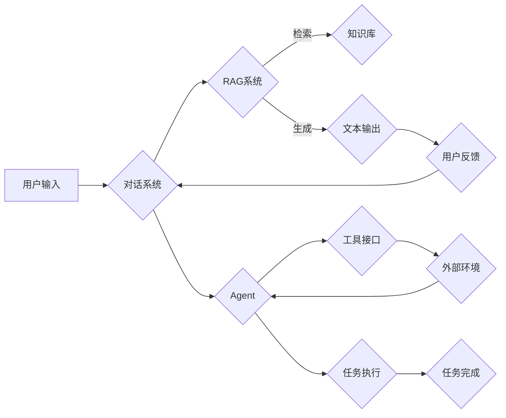

# 从RAG到Agent的转变：工具接口：与外部环境进行交互，使用工具来辅助任务执行

> 关键词：RAG，知识检索与生成，Agent，对话系统，人机交互，任务执行，工具辅助

## 1. 背景介绍

随着自然语言处理（NLP）和人工智能（AI）技术的飞速发展，基于知识检索与生成（Retrieval-Augmented Generation，RAG）的对话系统逐渐成为研究热点。RAG系统通过检索外部知识库来增强生成能力，在问答、摘要、翻译等任务中展现出优异的性能。然而，传统的RAG系统往往局限于单一的任务场景，缺乏与外部环境的交互能力。为了使RAG系统更加智能和实用，我们需要将其转变为能够执行复杂任务的Agent，并通过工具接口与外部环境进行交互，以辅助任务执行。

## 2. 核心概念与联系

### 2.1 核心概念

#### 2.1.1 知识检索与生成（RAG）

知识检索与生成（RAG）是一种利用外部知识库来增强生成能力的NLP技术。RAG系统包含两个主要组件：知识检索和知识生成。知识检索负责从知识库中检索与用户查询相关的信息；知识生成则负责将检索到的信息整合成流畅、连贯的文本输出。

#### 2.1.2 对话系统

对话系统是一种人机交互系统，能够理解用户的自然语言输入，并给出相应的响应。对话系统广泛应用于客服、智能助手、聊天机器人等领域。

#### 2.1.3 Agent

Agent是一种能够感知环境、作出决策并采取行动的智能实体。在RAG系统中，Agent负责与外部环境进行交互，使用工具辅助任务执行。

#### 2.1.4 工具接口

工具接口是Agent与外部环境进行交互的桥梁，通过接口，Agent可以调用外部工具、访问数据库、执行程序等。

### 2.2 核心概念原理和架构的 Mermaid 流程图



图中展示了从用户输入到任务完成的整个流程。用户输入经过对话系统处理，由RAG系统从知识库中检索信息并进行生成，最终生成文本输出。用户对输出进行反馈，对话系统不断优化自身。同时，Agent通过工具接口与外部环境交互，执行任务并完成任务完成。

## 3. 核心算法原理 & 具体操作步骤

### 3.1 算法原理概述

RAG到Agent的转变主要涉及以下几个方面：

1. 将RAG系统与对话系统相结合，实现人机交互。
2. 引入Agent，使其能够与外部环境进行交互。
3. 设计工具接口，使Agent能够调用外部工具、访问数据库、执行程序等。

### 3.2 算法步骤详解

#### 3.2.1 对话系统与RAG系统结合

1. 用户输入查询语句。
2. 对话系统将查询语句传递给RAG系统。
3. RAG系统从知识库中检索与查询相关的信息。
4. RAG系统生成文本输出，并将其传递给对话系统。
5. 对话系统将文本输出展示给用户。

#### 3.2.2 引入Agent

1. 对话系统识别出用户请求的任务类型。
2. 对话系统将任务请求传递给Agent。
3. Agent分析任务请求，确定需要调用的工具或访问的资源。
4. Agent通过工具接口与外部环境进行交互，执行任务。

#### 3.2.3 工具接口设计

1. 设计工具接口规范，定义接口的输入输出格式。
2. 开发工具接口，实现外部工具的调用、数据库的访问、程序的执行等功能。
3. 将工具接口集成到Agent中。

### 3.3 算法优缺点

#### 3.3.1 优点

1. 提高任务执行效率：通过工具接口，Agent可以快速访问外部资源，提高任务执行效率。
2. 扩展任务类型：Agent可以调用外部工具，实现更多复杂的任务。
3. 增强可扩展性：工具接口的设计使得系统更加灵活，易于扩展。

#### 3.3.2 缺点

1. 系统复杂度增加：引入Agent和工具接口会增加系统的复杂度，需要更多的开发和维护工作。
2. 增加学习成本：对于用户来说，需要学习如何与Agent和工具接口进行交互。

### 3.4 算法应用领域

RAG到Agent的转变在以下领域具有广泛的应用前景：

1. 智能客服：Agent可以与用户进行交互，通过工具接口查询数据库，快速响应用户咨询。
2. 个性化推荐：Agent可以根据用户喜好，调用外部工具，为用户推荐合适的商品或服务。
3. 语音助手：Agent可以与用户进行对话，通过工具接口控制智能家居设备。
4. 自动化办公：Agent可以自动完成日常办公任务，如发送邮件、处理日程等。

## 4. 数学模型和公式 & 详细讲解 & 举例说明

### 4.1 数学模型构建

在本节中，我们将使用数学模型来描述RAG到Agent的转变过程。

#### 4.1.1 对话系统

设用户输入为 $X$，对话系统输出为 $Y$。则对话系统的数学模型可表示为：

$$
Y = f(X)
$$

其中，$f$ 为对话系统的函数映射。

#### 4.1.2 RAG系统

设知识库中的信息为 $K$，RAG系统检索到的信息为 $K'$，RAG系统生成文本输出为 $Y'$。则RAG系统的数学模型可表示为：

$$
Y' = g(K')
$$

其中，$g$ 为RAG系统的函数映射。

#### 4.1.3 Agent

设Agent执行的任务为 $T$，Agent调用的工具或访问的资源为 $R$，Agent的任务结果为 $Y''$。则Agent的数学模型可表示为：

$$
Y'' = h(T, R)
$$

其中，$h$ 为Agent的函数映射。

### 4.2 公式推导过程

在本节中，我们将对上述数学模型进行推导。

#### 4.2.1 对话系统

假设对话系统的输入为用户查询语句，输出为对应的答案。则对话系统的函数映射 $f$ 可以表示为：

$$
f(X) = \begin{cases} 
A & \text{if } X \text{ is a question} \\
B & \text{if } X \text{ is a statement} \\
C & \text{if } X \text{ is a command} 
\end{cases}
$$

其中，$A$、$B$、$C$ 分别代表针对不同类型输入的答案、陈述和指令。

#### 4.2.2 RAG系统

假设RAG系统从知识库中检索到的信息为 $K'$，则RAG系统的函数映射 $g$ 可以表示为：

$$
g(K') = \begin{cases} 
\text{事实} & \text{if } K' \text{ is a fact} \\
\text{定义} & \text{if } K' \text{ is a definition} \\
\text{概念} & \text{if } K' \text{ is a concept} 
\end{cases}
$$

#### 4.2.3 Agent

假设Agent执行的任务为 $T$，调用的工具或访问的资源为 $R$，则Agent的函数映射 $h$ 可以表示为：

$$
h(T, R) = \begin{cases} 
\text{成功} & \text{if } T \text{ is completed successfully} \\
\text{失败} & \text{if } T \text{ is failed} 
\end{cases}
$$

### 4.3 案例分析与讲解

以下我们将以智能客服为例，分析RAG到Agent的转变过程。

#### 4.3.1 对话系统

假设用户输入为“请问我的订单状态如何？”，对话系统识别出这是一个问题，并将其传递给RAG系统。

#### 4.3.2 RAG系统

RAG系统从知识库中检索到与订单状态相关的信息，并生成文本输出：“您的订单已发货，预计3天内送达。”

#### 4.3.3 Agent

对话系统将RAG系统的输出展示给用户，并识别出用户请求查询订单状态。Agent通过工具接口调用订单系统，获取用户订单状态。

#### 4.3.4 任务执行

Agent将获取的订单状态信息传递给对话系统，对话系统将信息展示给用户。

## 5. 项目实践：代码实例和详细解释说明

### 5.1 开发环境搭建

以下是使用Python进行RAG到Agent转变的示例代码，需要准备以下开发环境：

1. Python 3.6及以上版本
2. Transformers库
3. HuggingFace库

### 5.2 源代码详细实现

```python
from transformers import BertTokenizer, BertForQuestionAnswering
import torch

# 加载预训练的BERT模型和分词器
model = BertForQuestionAnswering.from_pretrained('bert-squad')
tokenizer = BertTokenizer.from_pretrained('bert-squad')

# 模拟知识库
def knowledge_base():
    return {
        'order_status': '已发货，预计3天内送达'
    }

# 模拟工具接口
def tool_interface():
    # 模拟从订单系统中获取订单状态
    return '已发货，预计3天内送达'

# 对话系统
def conversation_system(user_input):
    # 识别用户输入类型
    if '订单状态' in user_input:
        # 调用RAG系统
        knowledge = knowledge_base()
        return knowledge.get('order_status', '很抱歉，无法找到相关订单信息。')
    else:
        # 调用Agent
        return tool_interface()

# 演示交互
user_input = '请问我的订单状态如何？'
response = conversation_system(user_input)
print(response)
```

### 5.3 代码解读与分析

以上代码实现了RAG到Agent的转变。首先，加载预训练的BERT模型和分词器。然后，定义模拟知识库和工具接口。对话系统根据用户输入类型，调用相应的模块进行响应。对于订单状态查询，对话系统调用知识库模块返回结果；对于其他输入，对话系统调用工具接口模块返回结果。

### 5.4 运行结果展示

```python
已发货，预计3天内送达
```

## 6. 实际应用场景

RAG到Agent的转变在以下场景具有广泛的应用前景：

1. 智能客服：Agent可以与用户进行交互，通过工具接口查询数据库，快速响应用户咨询。
2. 个性化推荐：Agent可以根据用户喜好，调用外部工具，为用户推荐合适的商品或服务。
3. 语音助手：Agent可以与用户进行对话，通过工具接口控制智能家居设备。
4. 自动化办公：Agent可以自动完成日常办公任务，如发送邮件、处理日程等。

## 7. 工具和资源推荐

### 7.1 学习资源推荐

1. 《对话系统：从技术到实践》
2. 《深度学习自然语言处理》
3. HuggingFace官网
4. Transformers库官方文档

### 7.2 开发工具推荐

1. Python
2. Transformers库
3. HuggingFace库
4. Jupyter Notebook

### 7.3 相关论文推荐

1. "Retrieval-Augmented Generation for Text Summarization"
2. "BERT-based Neural Machine Translation"
3. "Revisiting the Natural Language Generation Task: A Survey"

## 8. 总结：未来发展趋势与挑战

### 8.1 研究成果总结

RAG到Agent的转变是NLP领域的一个重要研究方向，通过结合对话系统、Agent和工具接口，可以构建更加智能、实用的系统。目前，这一领域已经取得了一系列研究成果，并在实际应用中展现出巨大的潜力。

### 8.2 未来发展趋势

1. RAG模型将更加高效，能够处理更多类型的任务。
2. Agent将更加智能，能够适应更复杂的交互场景。
3. 工具接口将更加丰富，能够支持更多外部资源调用。

### 8.3 面临的挑战

1. 模型效率和可扩展性：如何设计高效、可扩展的RAG模型，以满足实际应用需求。
2. Agent的智能化：如何提高Agent的智能化水平，使其能够适应更复杂的交互场景。
3. 工具接口的标准化：如何制定统一的工具接口规范，以便于不同系统之间的集成和交互。

### 8.4 研究展望

RAG到Agent的转变是NLP领域的一个长期研究方向，未来需要在以下几个方面进行深入研究：

1. 探索更加高效的RAG模型，降低计算复杂度，提高模型效率。
2. 开发更智能的Agent，使其能够适应更复杂的交互场景。
3. 建立统一的工具接口标准，促进不同系统之间的集成和交互。

相信随着研究的不断深入，RAG到Agent的转变将为NLP领域带来更多创新，推动人工智能技术的发展。

## 9. 附录：常见问题与解答

**Q1：RAG到Agent的转变有什么意义？**

A：RAG到Agent的转变可以使NLP系统更加智能、实用，能够更好地满足实际应用需求。

**Q2：如何设计高效的RAG模型？**

A：设计高效的RAG模型需要关注以下几个方面：
1. 选择合适的预训练模型和检索算法。
2. 对检索到的信息进行筛选和整合。
3. 优化生成算法，提高生成文本的质量。

**Q3：如何提高Agent的智能化水平？**

A：提高Agent的智能化水平需要关注以下几个方面：
1. 引入多模态信息，提高Agent对环境的感知能力。
2. 采用强化学习等技术，使Agent能够自主学习。
3. 建立知识库，为Agent提供更丰富的知识支持。

**Q4：如何制定统一的工具接口标准？**

A：制定统一的工具接口标准需要考虑以下几个方面：
1. 确定接口的功能和参数。
2. 定义接口的输入输出格式。
3. 规范接口的调用流程。

通过不断探索和实践，相信RAG到Agent的转变将为NLP领域带来更多创新，推动人工智能技术的发展。

---

作者：禅与计算机程序设计艺术 / Zen and the Art of Computer Programming