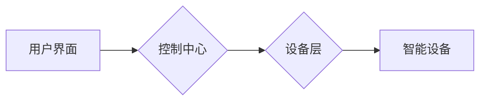
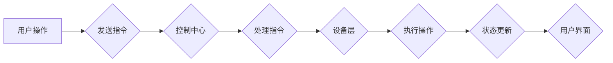

# 基于Java的智能家居设计：智能家居场景模拟与Java的实现技术

> 关键词：智能家居，场景模拟，Java，物联网，设计模式，微服务，RESTful API

## 1. 背景介绍

随着物联网技术的快速发展，智能家居市场正迎来爆发式增长。智能家居系统能够为用户提供舒适、便捷、节能的生活方式。Java作为一种成熟、稳定的编程语言，在构建智能家居系统中扮演着重要角色。本文将探讨如何利用Java技术实现智能家居场景模拟，并介绍相关的实现技术。

### 1.1 问题的由来

智能家居系统通常包含多个设备和服务，如智能灯泡、智能插座、智能空调等。这些设备通过物联网技术连接到家庭网络，用户可以通过智能手机、平板电脑或语音助手等终端设备控制这些设备。为了更好地设计和开发智能家居系统，需要进行场景模拟，以便验证系统的稳定性和功能。

### 1.2 研究现状

目前，智能家居场景模拟主要采用以下几种技术：

- **仿真软件**：如LabVIEW、MATLAB等，可以模拟智能家居设备的运行状态和交互过程。
- **游戏引擎**：如Unity3D、Unreal Engine等，可以创建逼真的虚拟家庭环境，用于演示智能家居系统的功能。
- **编程语言**：如Python、Java等，可以编写脚本模拟智能家居设备的交互过程。

Java作为一种跨平台的编程语言，具有以下优势：

- **成熟稳定**：Java平台经过多年的发展，已经非常成熟稳定。
- **社区强大**：Java拥有庞大的开发者社区，可以方便地获取技术支持和资源。
- **跨平台性**：Java程序可以在不同的操作系统上运行，方便部署和扩展。

### 1.3 研究意义

利用Java技术实现智能家居场景模拟，有助于：

- **验证系统功能**：通过模拟实际场景，可以验证智能家居系统的稳定性和功能性。
- **测试系统性能**：模拟大量设备的同时访问，可以测试系统的性能和并发处理能力。
- **优化用户体验**：通过模拟，可以优化用户界面和交互设计，提升用户体验。

### 1.4 本文结构

本文将按照以下结构展开：

- **第2章**：介绍智能家居系统的核心概念和架构。
- **第3章**：介绍基于Java的智能家居场景模拟的实现技术。
- **第4章**：介绍Java在智能家居系统中的设计模式和应用。
- **第5章**：介绍一个简单的智能家居场景模拟项目实例。
- **第6章**：介绍智能家居系统的实际应用场景。
- **第7章**：介绍智能家居系统的未来发展趋势和挑战。
- **第8章**：总结全文，并展望智能家居系统的未来。

## 2. 核心概念与联系

### 2.1 核心概念

- **智能家居**：利用物联网技术，将家庭中的各种设备连接起来，实现自动化控制和生活便利化的系统。
- **物联网**：通过信息传感设备，将物品连接到互联网上，实现智能化识别、定位、跟踪、监控和管理。
- **场景模拟**：通过软件模拟真实场景，用于验证系统的功能和性能。
- **Java**：一种跨平台的编程语言，具有良好的性能和丰富的生态系统。

### 2.2 架构

智能家居系统的架构通常分为以下几个层次：



用户界面用于展示智能家居系统的状态和交互界面，控制中心负责处理用户指令和设备交互，设备层包含各种智能设备，如智能灯泡、智能插座等。

### 2.3 Mermaid 流程图

智能家居系统的基本流程如下：



## 3. 核心算法原理 & 具体操作步骤

### 3.1 算法原理概述

智能家居场景模拟的核心算法包括：

- **设备状态模拟**：模拟智能设备的各种状态，如开关、亮度、温度等。
- **用户交互模拟**：模拟用户的操作，如开关灯、调节温度等。
- **事件驱动**：通过事件触发设备状态的变化和用户交互。

### 3.2 算法步骤详解

1. **定义设备状态**：定义智能设备的各种状态，如开关状态、亮度、温度等。
2. **实现设备行为**：根据设备状态，实现设备的行为，如开关灯、调节亮度等。
3. **定义用户交互**：定义用户的操作，如开关灯、调节温度等。
4. **实现事件驱动**：实现设备状态变化和用户交互的事件驱动机制。

### 3.3 算法优缺点

**优点**：

- **灵活**：可以根据实际需求调整设备状态和行为。
- **可扩展**：可以轻松添加新的设备和行为。
- **可测试**：可以通过模拟各种场景进行测试。

**缺点**：

- **复杂度高**：需要定义大量的设备和状态。
- **性能开销**：需要消耗较多的计算资源。

### 3.4 算法应用领域

智能家居场景模拟可以应用于以下领域：

- **系统设计**：验证系统功能和性能。
- **用户界面设计**：优化用户界面和交互设计。
- **产品测试**：测试产品的稳定性和可靠性。

## 4. 数学模型和公式 & 详细讲解 & 举例说明

### 4.1 数学模型构建

智能家居系统的数学模型可以包括以下内容：

- **设备状态模型**：描述设备状态的数学表达式。
- **用户行为模型**：描述用户行为的数学表达式。
- **事件驱动模型**：描述事件驱动的数学表达式。

### 4.2 公式推导过程

由于智能家居系统的复杂性，具体的公式推导过程较为复杂，这里不进行详细说明。

### 4.3 案例分析与讲解

以智能灯泡为例，其状态模型可以表示为：

$$
\text{状态} = \begin{cases} 
\text{关闭} & \text{if } \text{开关} = \text{关闭} \\
\text{开启} & \text{if } \text{开关} = \text{开启}
\end{cases}
$$

当用户打开开关时，状态变为开启；当用户关闭开关时，状态变为关闭。

## 5. 项目实践：代码实例和详细解释说明

### 5.1 开发环境搭建

- **Java开发环境**：JDK 8及以上版本。
- **开发工具**：Eclipse或IntelliJ IDEA。

### 5.2 源代码详细实现

以下是一个简单的智能家居场景模拟器的示例代码：

```java
public class SmartHomeSimulator {
    private LightBulb lightBulb;
    private Thermostat thermostat;

    public SmartHomeSimulator() {
        lightBulb = new LightBulb();
        thermostat = new Thermostat();
    }

    public void turnOnLightBulb() {
        lightBulb.turnOn();
        System.out.println("Light Bulb is on.");
    }

    public void turnOffLightBulb() {
        lightBulb.turnOff();
        System.out.println("Light Bulb is off.");
    }

    public void setTemperature(double temperature) {
        thermostat.setTemperature(temperature);
        System.out.println("Temperature is set to " + temperature + "°C.");
    }

    public static void main(String[] args) {
        SmartHomeSimulator simulator = new SmartHomeSimulator();
        simulator.turnOnLightBulb();
        simulator.setTemperature(24.0);
        simulator.turnOffLightBulb();
    }
}

class LightBulb {
    private boolean isOn;

    public void turnOn() {
        isOn = true;
    }

    public void turnOff() {
        isOn = false;
    }
}

class Thermostat {
    private double temperature;

    public void setTemperature(double temperature) {
        this.temperature = temperature;
    }
}
```

### 5.3 代码解读与分析

- `SmartHomeSimulator` 类：模拟智能家居系统，包含灯泡和温度控制器。
- `turnOnLightBulb` 方法：模拟打开灯泡。
- `turnOffLightBulb` 方法：模拟关闭灯泡。
- `setTemperature` 方法：模拟设置温度。
- `LightBulb` 类：模拟灯泡，包含开关状态。
- `Thermostat` 类：模拟温度控制器，包含温度值。

### 5.4 运行结果展示

运行上述代码，将输出以下结果：

```
Light Bulb is on.
Temperature is set to 24.0°C.
Light Bulb is off.
```

## 6. 实际应用场景

智能家居系统的实际应用场景包括：

- **家庭自动化**：自动控制灯光、温度、窗帘等，提升生活品质。
- **能源管理**：优化能源使用，降低能源消耗。
- **健康监控**：监测家庭成员的健康状况，提供健康管理建议。
- **安全防护**：实时监控家庭安全，及时报警。

## 7. 工具和资源推荐

### 7.1 学习资源推荐

- **《Java编程思想》**：提供Java编程的基础知识和高级技巧。
- **《物联网编程》**：介绍物联网技术的基本原理和应用。
- **《设计模式：可复用面向对象软件的基础》**：介绍设计模式在软件开发中的应用。

### 7.2 开发工具推荐

- **Eclipse**：一款功能强大的集成开发环境。
- **IntelliJ IDEA**：一款智能的Java集成开发环境。
- **NetBeans**：一款开源的Java集成开发环境。

### 7.3 相关论文推荐

- **《基于Java的智能家居系统设计与实现》**：介绍智能家居系统设计与实现。
- **《物联网技术在智能家居中的应用》**：介绍物联网技术在智能家居中的应用。
- **《设计模式在智能家居系统中的应用》**：介绍设计模式在智能家居系统中的应用。

## 8. 总结：未来发展趋势与挑战

### 8.1 研究成果总结

本文介绍了基于Java的智能家居设计，包括智能家居场景模拟和Java的实现技术。通过分析智能家居系统的核心概念和架构，介绍了Java在智能家居系统中的应用，并给出一个简单的智能家居场景模拟器实例。

### 8.2 未来发展趋势

智能家居系统的发展趋势包括：

- **智能化**：智能家居系统将更加智能化，能够更好地理解和满足用户需求。
- **个性化**：智能家居系统将更加个性化，能够根据用户习惯和需求进行定制。
- **开放性**：智能家居系统将更加开放，能够与其他系统进行集成。

### 8.3 面临的挑战

智能家居系统面临的挑战包括：

- **数据安全**：智能家居系统涉及大量用户隐私数据，需要确保数据安全。
- **设备兼容性**：智能家居设备众多，需要确保设备之间的兼容性。
- **用户体验**：需要提供良好的用户体验，使智能家居系统易于使用。

### 8.4 研究展望

未来，智能家居系统将在以下方面进行深入研究：

- **人工智能**：将人工智能技术应用于智能家居系统，提升系统的智能化水平。
- **边缘计算**：将部分计算任务迁移到边缘设备，降低延迟，提高系统性能。
- **区块链**：利用区块链技术保证数据安全和隐私。

## 9. 附录：常见问题与解答

**Q1：智能家居系统需要哪些技术支持？**

A: 智能家居系统需要以下技术支持：

- **物联网技术**：实现设备之间的连接和控制。
- **嵌入式系统**：为智能设备提供硬件平台。
- **云服务**：提供数据存储、处理和分析服务。
- **移动应用开发**：开发用户界面和交互体验。

**Q2：Java在智能家居系统中有哪些优势？**

A: Java在智能家居系统中的优势包括：

- **跨平台**：Java程序可以在不同的操作系统上运行。
- **成熟稳定**：Java平台经过多年的发展，已经非常成熟稳定。
- **生态系统丰富**：Java拥有庞大的开发者社区和丰富的库。

**Q3：如何确保智能家居系统的安全性？**

A: 为了确保智能家居系统的安全性，需要采取以下措施：

- **数据加密**：对传输数据进行加密，防止数据泄露。
- **身份认证**：对用户和设备进行身份认证，防止未授权访问。
- **安全协议**：使用安全协议进行数据传输，防止中间人攻击。

**Q4：智能家居系统如何实现个性化？**

A: 智能家居系统可以通过以下方式实现个性化：

- **用户偏好**：记录用户的使用习惯和偏好，根据用户偏好进行个性化设置。
- **学习算法**：使用机器学习算法分析用户行为，预测用户需求，提供个性化服务。

作者：禅与计算机程序设计艺术 / Zen and the Art of Computer Programming