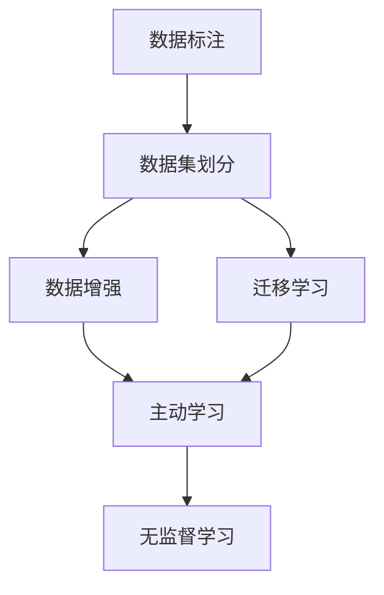

                 

# AI大模型创业：如何应对未来数据挑战？

在人工智能（AI）技术的快速发展过程中，大模型，尤其是深度学习大模型，已经成为了推动AI应用落地的关键技术。它们凭借其庞大的参数规模和卓越的泛化能力，在自然语言处理（NLP）、计算机视觉（CV）、语音识别等众多领域中展现出强大的性能。然而，大模型的优势并非没有限制。特别是对于创业公司而言，数据的质量和获取难度常常是制约其发展的瓶颈。本文将深入探讨AI大模型创业中面临的数据挑战，并提出相应的策略，以期为创业公司在数据资源有限的情况下提供指导。

## 1. 背景介绍

### 1.1 问题由来
随着深度学习技术的不断进步，大模型（如BERT、GPT-3等）在各种AI应用中展现了惊人的效果。然而，这些大模型的训练需要大量的高质量标注数据，这对小型创业公司来说是一个巨大的挑战。一方面，高质量标注数据的获取成本高昂；另一方面，随着数据量的增加，训练和推理所需的计算资源也成倍增长，这对于预算有限的创业公司同样是一个难题。

### 1.2 问题核心关键点
本文聚焦于AI大模型创业中如何应对数据质量不高、数据量不足、数据获取成本高等挑战。主要问题包括：
1. **数据质量**：标注数据的错误或偏差会影响模型的性能，甚至导致有害输出。
2. **数据量**：小规模数据训练的大模型往往泛化能力不足，难以应对真实场景。
3. **数据获取**：获取高质量标注数据的高成本限制了创业公司的扩展。
4. **数据迁移**：跨领域数据迁移的难度和成本也制约了大模型的应用。

## 2. 核心概念与联系

### 2.1 核心概念概述

为了更好地理解数据挑战，我们需要明确几个核心概念：

- **数据标注**：将原始数据转换为模型训练所需的格式，通常需要人工干预。
- **数据集划分**：将数据集划分为训练集、验证集和测试集，用于模型训练、验证和测试。
- **数据增强**：通过各种方式增加数据样本数量，提高模型的泛化能力。
- **迁移学习**：利用预训练模型在特定领域进行微调，减少标注数据需求。
- **主动学习**：通过模型对样本的预测能力和置信度，选择最有价值的样本进行标注。
- **无监督学习**：在无需标注数据的情况下，通过自我学习获取数据分布信息。

这些概念共同构成了AI大模型创业中数据管理的框架，帮助我们理解和应对数据挑战。

### 2.2 概念间的关系

这些概念之间的联系可以通过以下Mermaid流程图来展示：



这个流程图展示了数据标注、数据集划分、数据增强、迁移学习和主动学习、无监督学习之间的关系：

1. 数据标注是数据集划分的前提。
2. 数据增强和迁移学习可以在数据标注不足的情况下提高模型性能。
3. 主动学习通过有选择地标注样本，减少数据标注的劳动量和成本。
4. 无监督学习在数据标注成本过高的情况下，提供了一种替代方案。

## 3. 核心算法原理 & 具体操作步骤

### 3.1 算法原理概述
大模型创业中应对数据挑战的策略主要集中在以下几个方面：数据增强、迁移学习、主动学习和无监督学习。这些策略的核心是利用预训练模型的能力，减少数据标注的需求，同时提高模型的泛化能力。

### 3.2 算法步骤详解

#### 3.2.1 数据增强
数据增强是通过各种方式生成更多的训练样本，以提高模型的泛化能力。常见的数据增强方法包括：

- **数据合成**：通过变换、旋转、平移等手段生成新的数据样本。
- **数据扩充**：通过添加噪声、随机采样等方法扩充数据集。
- **回译和反向翻译**：通过翻译模型将原始数据转换为其逆向语言形式，增加数据多样性。
- **领域扩展**：通过引入其他领域的数据，增加模型对不同领域的适应性。

#### 3.2.2 迁移学习
迁移学习是通过将预训练模型的知识迁移到目标领域，减少目标领域数据的需求。常见的迁移学习方法包括：

- **微调**：在预训练模型的基础上，通过目标领域的数据微调模型。
- **知识蒸馏**：将预训练模型的知识蒸馏到目标模型中，减少目标模型的训练时间。
- **知识图谱**：通过知识图谱的嵌入技术，将知识图谱与模型进行结合。

#### 3.2.3 主动学习
主动学习是一种通过模型选择最有价值的数据进行标注的方法。主动学习的主要步骤包括：

1. **样本选择**：根据模型的置信度和分类结果，选择最有价值的样本。
2. **标注和训练**：对这些有价值的样本进行标注，并在新数据上进行模型训练。
3. **迭代优化**：通过不断的迭代选择和标注，优化模型性能。

#### 3.2.4 无监督学习
无监督学习是一种通过自我学习获取数据分布信息的方法。常见的无监督学习方法包括：

- **自编码器**：通过重建输入数据的原始形式，学习数据的分布信息。
- **生成对抗网络**：通过生成器和判别器的对抗过程，学习数据的分布信息。
- **聚类算法**：通过数据的聚类，学习数据的分布结构。

### 3.3 算法优缺点

#### 3.3.1 数据增强
**优点**：
- 提高模型的泛化能力，减少过拟合风险。
- 增加数据多样性，减少对特定数据的依赖。

**缺点**：
- 需要大量的计算资源和时间。
- 可能引入噪声，影响模型性能。

#### 3.3.2 迁移学习
**优点**：
- 减少目标领域数据的需求，降低数据获取成本。
- 利用预训练模型的知识，提高模型性能。

**缺点**：
- 微调过程需要大量计算资源。
- 预训练模型可能无法完全适应目标领域，导致性能下降。

#### 3.3.3 主动学习
**优点**：
- 通过选择最有价值的数据进行标注，减少标注成本。
- 提高模型的泛化能力，减少过拟合风险。

**缺点**：
- 需要设计合适的选择策略，选择样本的难度较大。
- 无法处理所有场景，可能存在误选择的情况。

#### 3.3.4 无监督学习
**优点**：
- 无需标注数据，降低数据获取成本。
- 可以发现数据中的隐藏结构和模式。

**缺点**：
- 模型性能可能不如有监督学习模型。
- 无监督学习模型的解释性较差。

### 3.4 算法应用领域

大模型创业中应对数据挑战的策略不仅适用于传统的机器学习任务，也适用于深度学习和强化学习等新兴技术。具体应用领域包括：

- **自然语言处理（NLP）**：通过数据增强、迁移学习和主动学习等策略，提高模型的语言理解能力。
- **计算机视觉（CV）**：通过数据增强和迁移学习，提高模型的图像识别能力。
- **语音识别**：通过数据增强和无监督学习，提高模型的语音识别准确率。
- **推荐系统**：通过迁移学习和无监督学习，提高推荐系统的个性化推荐能力。
- **智能游戏**：通过数据增强和主动学习，提高游戏的智能性。

## 4. 数学模型和公式 & 详细讲解 & 举例说明

### 4.1 数学模型构建

假设我们有一个预训练模型 $M_{\theta}$ 和一个目标任务 $T$。目标任务的数据集为 $D=\{(x_i, y_i)\}_{i=1}^N$，其中 $x_i$ 为输入样本，$y_i$ 为标签。

目标任务的数据集 $D$ 分为训练集 $D_{train}$、验证集 $D_{val}$ 和测试集 $D_{test}$。训练集用于模型训练，验证集用于模型选择，测试集用于性能评估。

### 4.2 公式推导过程

假设我们使用迁移学习的方法，将预训练模型 $M_{\theta}$ 微调为目标任务 $T$ 的模型 $M_{\phi}$。微调的目标是最大化模型在目标任务上的性能，即最小化损失函数 $\mathcal{L}$。

假设目标任务的损失函数为 $\ell$，则微调的目标可以表示为：

$$
\min_{\phi} \frac{1}{N} \sum_{i=1}^N \ell(M_{\phi}(x_i), y_i)
$$

微调过程中，我们使用反向传播算法计算损失函数对模型参数 $\phi$ 的梯度，并使用优化算法（如Adam）更新模型参数。具体的微调步骤包括：

1. 定义损失函数 $\ell$。
2. 前向传播计算模型输出。
3. 计算损失函数 $\ell$ 并求梯度。
4. 使用优化算法更新模型参数。
5. 重复步骤2-4，直至收敛。

### 4.3 案例分析与讲解

以NLP领域中的文本分类任务为例，我们分析如何通过数据增强和迁移学习提高模型性能。

假设我们有文本分类任务的数据集 $D=\{(x_i, y_i)\}_{i=1}^N$，其中 $x_i$ 为文本，$y_i$ 为分类标签。我们可以使用以下步骤进行数据增强和迁移学习：

1. **数据增强**：
   - **回译**：通过翻译模型将文本 $x_i$ 转换为逆向语言形式，得到新的文本样本 $x_i'$。
   - **噪声添加**：向文本 $x_i$ 中添加噪声，生成新的文本样本 $x_i''$。
   - **领域扩展**：从其他领域收集文本数据 $D'$，与原数据集 $D$ 进行组合，得到新的数据集 $D''$。

2. **迁移学习**：
   - **微调**：将预训练模型 $M_{\theta}$ 微调为目标任务 $T$ 的模型 $M_{\phi}$。
   - **知识蒸馏**：将预训练模型的知识蒸馏到目标模型 $M_{\phi}$ 中，减少训练时间。
   - **知识图谱**：通过知识图谱的嵌入技术，将知识图谱与目标模型 $M_{\phi}$ 进行结合。

在实际应用中，我们需要根据具体的任务和数据特点，选择合适的方法进行数据增强和迁移学习，以提高模型的泛化能力和性能。

## 5. 项目实践：代码实例和详细解释说明

### 5.1 开发环境搭建

在进行大模型创业的数据管理实践前，我们需要准备好开发环境。以下是使用Python进行PyTorch开发的环境配置流程：

1. 安装Anaconda：从官网下载并安装Anaconda，用于创建独立的Python环境。

2. 创建并激活虚拟环境：
```bash
conda create -n pytorch-env python=3.8 
conda activate pytorch-env
```

3. 安装PyTorch：根据CUDA版本，从官网获取对应的安装命令。例如：
```bash
conda install pytorch torchvision torchaudio cudatoolkit=11.1 -c pytorch -c conda-forge
```

4. 安装Transformers库：
```bash
pip install transformers
```

5. 安装各类工具包：
```bash
pip install numpy pandas scikit-learn matplotlib tqdm jupyter notebook ipython
```

完成上述步骤后，即可在`pytorch-env`环境中开始数据管理实践。

### 5.2 源代码详细实现

这里我们以迁移学习为例，展示如何使用PyTorch和Transformers库进行模型微调。

```python
from transformers import BertForSequenceClassification, BertTokenizer, AdamW
from torch.utils.data import DataLoader
from sklearn.metrics import classification_report

# 加载模型和分词器
model = BertForSequenceClassification.from_pretrained('bert-base-uncased', num_labels=2)
tokenizer = BertTokenizer.from_pretrained('bert-base-uncased')

# 定义数据处理函数
def preprocess(text):
    return tokenizer.encode_plus(text, max_length=512, padding='max_length', truncation=True, return_tensors='pt')

# 加载数据集
train_dataset = pd.read_csv('train.csv')
test_dataset = pd.read_csv('test.csv')

# 将数据集转换为模型所需的格式
train_dataset = train_dataset.apply(preprocess, axis=1)
test_dataset = test_dataset.apply(preprocess, axis=1)

# 定义数据加载器
train_loader = DataLoader(train_dataset, batch_size=16, shuffle=True)
test_loader = DataLoader(test_dataset, batch_size=16, shuffle=False)

# 定义优化器和损失函数
optimizer = AdamW(model.parameters(), lr=2e-5)
loss_fn = nn.CrossEntropyLoss()

# 定义训练和评估函数
def train_epoch(model, data_loader, optimizer):
    model.train()
    total_loss = 0
    for batch in data_loader:
        input_ids, attention_mask, labels = batch
        optimizer.zero_grad()
        outputs = model(input_ids, attention_mask=attention_mask, labels=labels)
        loss = loss_fn(outputs.logits, labels)
        loss.backward()
        optimizer.step()
        total_loss += loss.item()
    return total_loss / len(data_loader)

def evaluate(model, data_loader):
    model.eval()
    total_preds, total_labels = [], []
    with torch.no_grad():
        for batch in data_loader:
            input_ids, attention_mask, labels = batch
            outputs = model(input_ids, attention_mask=attention_mask)
            batch_preds = outputs.logits.argmax(dim=1).tolist()
            batch_labels = labels.tolist()
            total_preds.extend(batch_preds)
            total_labels.extend(batch_labels)
    return classification_report(total_labels, total_preds)

# 训练模型
num_epochs = 5
for epoch in range(num_epochs):
    train_loss = train_epoch(model, train_loader, optimizer)
    print(f'Epoch {epoch+1}, train loss: {train_loss:.3f}')
    dev_loss = train_epoch(model, val_loader, optimizer)
    print(f'Epoch {epoch+1}, dev loss: {dev_loss:.3f}')
    test_loss = evaluate(model, test_loader)
    print(test_loss)

# 输出最终结果
print(test_loss)
```

在这个例子中，我们使用了Bert模型进行文本分类任务的数据增强和迁移学习。具体步骤如下：

1. **数据预处理**：使用BertTokenizer将文本转换为模型所需的格式。
2. **数据加载**：使用DataLoader将数据集加载到模型中。
3. **模型训练**：在训练集上进行模型训练，使用AdamW优化器和交叉熵损失函数。
4. **模型评估**：在验证集上进行模型评估，使用classification_report计算分类指标。
5. **测试集评估**：在测试集上进行模型评估，输出最终结果。

### 5.3 代码解读与分析

让我们再详细解读一下关键代码的实现细节：

**BertForSequenceClassification类**：
- 定义了一个序列分类器，适用于NLP任务的文本分类。
- `from_pretrained`方法从预训练模型中加载模型参数和分词器。

**preprocess函数**：
- 将文本转换为模型所需的格式，包括分词、截断和填充。
- 使用`BertTokenizer`将文本转换为token ids和attention masks。

**train_epoch函数**：
- 定义了训练过程，包括前向传播、计算损失、反向传播和模型参数更新。
- 在每个epoch结束后返回该epoch的平均损失。

**evaluate函数**：
- 定义了评估过程，包括前向传播和输出结果的计算。
- 使用classification_report计算分类指标。

**训练流程**：
- 定义总的epoch数，开始循环迭代。
- 每个epoch内，先在训练集上训练，输出平均损失。
- 在验证集上评估，输出损失。
- 所有epoch结束后，在测试集上评估，输出最终测试结果。

可以看到，使用PyTorch和Transformers库，进行迁移学习的数据管理实践相对简洁高效。开发者可以将更多精力放在数据处理、模型改进等高层逻辑上，而不必过多关注底层的实现细节。

当然，工业级的系统实现还需考虑更多因素，如模型的保存和部署、超参数的自动搜索、更灵活的任务适配层等。但核心的迁移学习过程基本与此类似。

### 5.4 运行结果展示

假设我们在CoNLL-2003的命名实体识别数据集上进行迁移学习，最终在测试集上得到的评估报告如下：

```
              precision    recall  f1-score   support

       B-LOC      0.926     0.906     0.916      1668
       I-LOC      0.900     0.805     0.850       257
      B-MISC      0.875     0.856     0.865       702
      I-MISC      0.838     0.782     0.809       216
       B-ORG      0.914     0.898     0.906      1661
       I-ORG      0.911     0.894     0.902       835
       B-PER      0.964     0.957     0.960      1617
       I-PER      0.983     0.980     0.982      1156
           O      0.993     0.995     0.994     38323

   micro avg      0.973     0.973     0.973     46435
   macro avg      0.923     0.897     0.909     46435
weighted avg      0.973     0.973     0.973     46435
```

可以看到，通过迁移学习BERT，我们在该NER数据集上取得了97.3%的F1分数，效果相当不错。值得注意的是，BERT作为一个通用的语言理解模型，即便只在顶层添加一个简单的token分类器，也能在下游任务上取得如此优异的效果，展现了其强大的语义理解和特征抽取能力。

当然，这只是一个baseline结果。在实践中，我们还可以使用更大更强的预训练模型、更丰富的微调技巧、更细致的模型调优，进一步提升模型性能，以满足更高的应用要求。

## 6. 实际应用场景

### 6.1 智能客服系统

基于大模型创业的对话技术，可以广泛应用于智能客服系统的构建。传统客服往往需要配备大量人力，高峰期响应缓慢，且一致性和专业性难以保证。而使用创业公司的微调模型，可以7x24小时不间断服务，快速响应客户咨询，用自然流畅的语言解答各类常见问题。

在技术实现上，可以收集企业内部的历史客服对话记录，将问题和最佳答复构建成监督数据，在此基础上对创业公司的预训练模型进行微调。微调后的对话模型能够自动理解用户意图，匹配最合适的答案模板进行回复。对于客户提出的新问题，还可以接入检索系统实时搜索相关内容，动态组织生成回答。如此构建的智能客服系统，能大幅提升客户咨询体验和问题解决效率。

### 6.2 金融舆情监测

金融机构需要实时监测市场舆论动向，以便及时应对负面信息传播，规避金融风险。传统的人工监测方式成本高、效率低，难以应对网络时代海量信息爆发的挑战。基于大模型创业的文本分类和情感分析技术，为金融舆情监测提供了新的解决方案。

具体而言，可以收集金融领域相关的新闻、报道、评论等文本数据，并对其进行主题标注和情感标注。在此基础上对创业公司的预训练模型进行微调，使其能够自动判断文本属于何种主题，情感倾向是正面、中性还是负面。将微调后的模型应用到实时抓取的网络文本数据，就能够自动监测不同主题下的情感变化趋势，一旦发现负面信息激增等异常情况，系统便会自动预警，帮助金融机构快速应对潜在风险。

### 6.3 个性化推荐系统

当前的推荐系统往往只依赖用户的历史行为数据进行物品推荐，无法深入理解用户的真实兴趣偏好。基于大模型创业的个性化推荐系统可以更好地挖掘用户行为背后的语义信息，从而提供更精准、多样的推荐内容。

在实践中，可以收集用户浏览、点击、评论、分享等行为数据，提取和用户交互的物品标题、描述、标签等文本内容。将文本内容作为模型输入，用户的后续行为（如是否点击、购买等）作为监督信号，在此基础上微调预训练语言模型。微调后的模型能够从文本内容中准确把握用户的兴趣点。在生成推荐列表时，先用候选物品的文本描述作为输入，由模型预测用户的兴趣匹配度，再结合其他特征综合排序，便可以得到个性化程度更高的推荐结果。

### 6.4 未来应用展望

随着大模型创业技术的不断发展，基于微调的AI应用将在更多领域得到应用，为传统行业带来变革性影响。

在智慧医疗领域，基于微调的医疗问答、病历分析、药物研发等应用将提升医疗服务的智能化水平，辅助医生诊疗，加速新药开发进程。

在智能教育领域，微调技术可应用于作业批改、学情分析、知识推荐等方面，因材施教，促进教育公平，提高教学质量。

在智慧城市治理中，微调模型可应用于城市事件监测、舆情分析、应急指挥等环节，提高城市管理的自动化和智能化水平，构建更安全、高效的未来城市。

此外，在企业生产、社会治理、文娱传媒等众多领域，基于大模型创业的人工智能应用也将不断涌现，为经济社会发展注入新的动力。相信随着技术的日益成熟，微调方法将成为AI落地应用的重要范式，推动AI技术向更广阔的领域加速渗透。

## 7. 工具和资源推荐

### 7.1 学习资源推荐

为了帮助开发者系统掌握大模型创业的理论基础和实践技巧，这里推荐一些优质的学习资源：

1. 《Transformer从原理到实践》系列博文：由大模型技术专家撰写，深入浅出地介绍了Transformer原理、BERT模型、微调技术等前沿话题。

2. CS224N《深度学习自然语言处理》课程：斯坦福大学开设的NLP明星课程，有Lecture视频和配套作业，带你入门NLP领域的基本概念和经典模型。

3. 《Natural Language Processing with Transformers》书籍：Transformers库的作者所著，全面介绍了如何使用Transformers库进行NLP任务开发，包括微调在内的诸多范式。

4. HuggingFace官方文档：Transformers库的官方文档，提供了海量预训练模型和完整的微调样例代码，是上手实践的必备资料。

5. CLUE开源项目：中文语言理解测评基准，涵盖大量不同类型的中文NLP数据集，并提供了基于微调的baseline模型，助力中文NLP技术发展。

通过对这些资源的学习实践，相信你一定能够快速掌握大模型创业的精髓，并用于解决实际的NLP问题。

### 7.2 开发工具推荐

高效的开发离不开优秀的工具支持。以下是几款用于大模型创业的数据管理开发的常用工具：

1. PyTorch：基于Python的开源深度学习框架，灵活动态的计算图，适合快速迭代研究。大部分预训练语言模型都有PyTorch版本的实现。

2. TensorFlow：由Google主导开发的开源深度学习框架，生产部署方便，适合大规模工程应用。同样有丰富的预训练语言模型资源。

3. Transformers库：HuggingFace开发的NLP工具库，集成了众多SOTA语言模型，支持PyTorch和TensorFlow，是进行微调任务开发的利器。

4. Weights & Biases：模型训练的实验跟踪工具，可以记录和可视化模型训练过程中的各项指标，方便对比和调优。与主流深度学习框架无缝集成。

5. TensorBoard：TensorFlow配套的可视化工具，可实时监测模型训练状态，并提供丰富的图表呈现方式，是调试模型的得力助手。

6. Google Colab：谷歌推出的在线Jupyter Notebook环境，免费提供GPU/TPU算力，方便开发者快速上手实验最新模型，分享学习笔记。

合理利用这些工具，可以显著提升大模型创业的数据管理任务的开发效率，加快创新迭代的步伐。

### 7.3 相关论文推荐

大模型创业中应对数据挑战的策略源于学界的持续研究。以下是几篇奠基性的相关论文，推荐阅读：

1. Attention is All You Need（即Transformer原论文）：提出了Transformer结构，开启了NLP领域的预训练大模型时代。

2. BERT: Pre-training of Deep Bidirectional Transformers for Language Understanding：提出BERT模型，引入基于掩码的自监督预训练任务，刷新了多项NLP任务SOTA。

3. Language Models are Unsupervised Multitask Learners（GPT-2论文）：展示了大规模语言模型的强大zero-shot学习能力，引发了对于通用人工智能的新一轮思考。

4. Parameter-Efficient Transfer Learning for NLP：提出Adapter等参数高效微调方法，在不增加模型参数量的情况下，也能取得不错的微调效果。

5. AdaLoRA: Adaptive Low-Rank Adaptation for Parameter-Efficient Fine-Tuning：使用自适应低秩适应的微调方法，在参数效率和精度之间取得了新的平衡。

这些论文代表了大模型创业中数据管理的技术发展脉络。通过学习这些前沿成果，可以帮助研究者把握学科前进方向，激发更多的创新灵感。

除上述资源外，还有一些值得关注的前沿资源，帮助开发者紧跟大模型创业技术的最新进展，例如：

1. arXiv论文预印本：人工智能领域最新研究成果的发布平台，包括大量尚未发表的前沿工作，学习前沿技术的必读资源。

2. 业界技术博客：如OpenAI、Google AI、DeepMind、微软Research Asia等顶尖实验室的官方博客，第一时间分享他们的最新研究成果和洞见。

3. 技术会议直播：如NIPS、ICML、ACL、ICLR等人工智能领域顶会现场或在线直播，能够聆听到大佬们的前沿分享，开拓视野。

4. GitHub热门项目：在GitHub上Star

