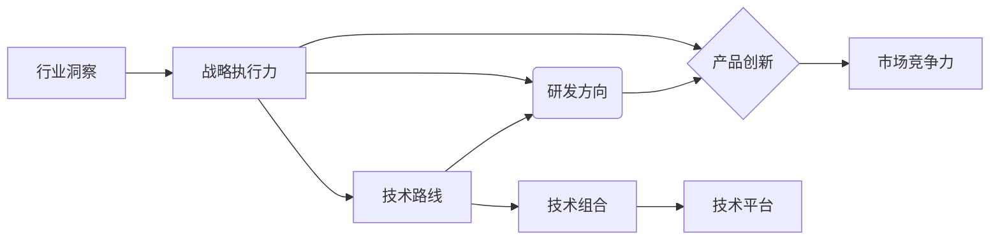

# 主导和把握公司的技术发展方向，研究制订公司的科技战略规划，包括技术路线、研发方向、产品创新等

> 关键词：技术战略规划，技术路线，研发方向，产品创新，人工智能，数字化转型，行业洞察，战略执行力

## 1. 背景介绍

在当今快速变化的科技时代，企业面临着前所未有的挑战和机遇。技术发展日新月异，市场竞争日趋激烈，消费者需求不断变化。作为企业的CTO或技术领导者，主导和把握公司的技术发展方向，制定有效的科技战略规划，成为了企业生存和发展的关键。

### 1.1 技术驱动的企业变革

技术驱动已经成为推动企业发展的核心力量。从制造业到服务业，从初创公司到大型企业，技术变革正在重塑各个行业的竞争格局。企业需要通过技术战略规划，确保自身在技术创新上的领先地位。

### 1.2 科技战略规划的重要性

科技战略规划是企业在技术发展道路上的一张蓝图，它指导企业如何合理分配资源，选择合适的技术路线，以及如何通过产品创新来满足市场和客户的需求。一个成功的科技战略规划可以帮助企业：

- 提升市场竞争力
- 降低运营成本
- 优化用户体验
- 促进业务增长

### 1.3 本文结构

本文将探讨如何主导和把握公司的技术发展方向，研究制订公司的科技战略规划。内容包括：

- 核心概念与联系
- 核心算法原理与具体操作步骤
- 数学模型和公式
- 项目实践
- 实际应用场景
- 工具和资源推荐
- 总结与展望

## 2. 核心概念与联系

为了更好地理解科技战略规划，我们需要明确以下几个核心概念：

- **技术路线**：指企业选择的技术发展方向，包括核心技术、技术组合和技术平台。
- **研发方向**：指企业在研发活动中聚焦的领域，如产品研发、技术创新、应用研究等。
- **产品创新**：指通过技术手段创造新的产品或服务，以满足市场和客户的新需求。
- **行业洞察**：指对行业发展趋势、竞争对手、客户需求的深入理解和分析。
- **战略执行力**：指企业将战略规划转化为实际行动的能力。

以下是一个Mermaid流程图，展示了这些概念之间的联系：



## 3. 核心算法原理 & 具体操作步骤

### 3.1 算法原理概述

科技战略规划的制定是一个系统性的过程，涉及多个步骤和算法。以下是几个关键步骤：

1. **市场分析**：收集和分析市场数据，了解行业趋势、竞争对手和客户需求。
2. **技术评估**：评估现有技术、潜在技术和新兴技术，确定技术路线。
3. **资源规划**：根据技术路线和研发方向，规划研发资源，包括人力、资金和设备。
4. **产品规划**：根据市场分析和技术评估，规划产品创新方向。
5. **战略执行**：制定详细的执行计划，确保战略目标的实现。

### 3.2 算法步骤详解

#### 3.2.1 市场分析

市场分析是科技战略规划的基础。以下是一些市场分析的步骤：

1. **数据收集**：收集市场数据，包括行业报告、竞争情报、客户反馈等。
2. **数据整理**：整理和分析收集到的数据，识别关键趋势和机会。
3. **竞争分析**：分析竞争对手的产品、技术、市场份额和竞争优势。
4. **客户分析**：了解客户需求、偏好和痛点。

#### 3.2.2 技术评估

技术评估是确定技术路线的关键步骤。以下是一些技术评估的步骤：

1. **技术调研**：调研现有技术、潜在技术和新兴技术。
2. **技术评估**：评估技术的成熟度、成本、风险和潜在回报。
3. **技术选型**：根据评估结果选择最合适的技术。

#### 3.2.3 资源规划

资源规划是确保战略执行的关键。以下是一些资源规划的步骤：

1. **人力规划**：根据研发方向和产品规划，确定所需的人力资源。
2. **资金规划**：根据研发计划和成本预测，确定所需的资金。
3. **设备规划**：根据技术路线和研发需求，确定所需的设备。

#### 3.2.4 产品规划

产品规划是满足市场和客户需求的关键。以下是一些产品规划的步骤：

1. **产品定位**：确定产品的市场定位和目标客户。
2. **产品功能**：规划产品的功能特性和用户体验。
3. **产品路线图**：制定产品的发展路线图，包括产品发布计划和时间表。

#### 3.2.5 战略执行

战略执行是将战略规划转化为实际行动的关键步骤。以下是一些战略执行的步骤：

1. **组织结构**：建立适应战略需求的组织结构。
2. **团队建设**：建设高效的研发团队，确保战略目标的实现。
3. **绩效管理**：建立绩效评估体系，跟踪战略执行的进度和效果。
4. **风险管理**：识别和应对战略执行过程中可能出现的风险。

### 3.3 算法优缺点

#### 3.3.1 优点

- **系统性强**：科技战略规划是一个系统性的过程，涵盖了市场、技术、资源、产品等多个方面。
- **前瞻性**：科技战略规划能够帮助企业预测未来趋势，提前布局。
- **高效性**：科技战略规划能够帮助企业高效地利用资源，实现战略目标。

#### 3.3.2 缺点

- **复杂性**：科技战略规划是一个复杂的过程，需要跨部门协作和专业知识。
- **动态性**：市场和技术环境不断变化，科技战略规划需要不断调整和优化。

### 3.4 算法应用领域

科技战略规划适用于所有类型的企业，特别是那些处于快速发展阶段或面临激烈竞争的企业。以下是一些科技战略规划的应用领域：

- 高科技企业
- 制造业
- 服务业
- 创业公司

## 4. 数学模型和公式 & 详细讲解 & 举例说明

科技战略规划的制定需要借助数学模型和公式来进行定量分析和决策。以下是一些常用的数学模型和公式：

### 4.1 数学模型构建

#### 4.1.1 市场预测模型

市场预测模型用于预测市场需求和市场规模。以下是一个简单的市场预测模型：

$$
Y_t = a + bt + ct^2 + \epsilon_t
$$

其中，$Y_t$ 表示第 $t$ 年的市场需求，$a$、$b$、$c$ 为模型参数，$\epsilon_t$ 为误差项。

#### 4.1.2 技术成熟度模型

技术成熟度模型用于评估技术的成熟度。以下是一个技术成熟度模型：

$$
M(T) = \frac{1}{1 + e^{-(T - T_0)/T_s}}
$$

其中，$M(T)$ 表示技术成熟度，$T$ 表示技术发展时间，$T_0$ 表示技术起点，$T_s$ 表示技术成熟所需时间。

### 4.2 公式推导过程

#### 4.2.1 市场预测模型

市场预测模型的推导过程如下：

- 假设市场需求 $Y_t$ 与时间 $t$ 之间存在线性关系。
- 使用最小二乘法拟合数据，得到模型参数 $a$、$b$、$c$。

#### 4.2.2 技术成熟度模型

技术成熟度模型的推导过程如下：

- 假设技术成熟度 $M(T)$ 与技术发展时间 $T$ 之间存在指数关系。
- 使用自然指数函数 $e^x$ 进行建模。

### 4.3 案例分析与讲解

以下是一个市场预测模型的案例分析：

假设某企业收集了过去5年的年销售额数据，如下表所示：

| 年份 | 销售额(万元) |
| ---- | ------------ |
| 2015 | 100          |
| 2016 | 120          |
| 2017 | 150          |
| 2018 | 180          |
| 2019 | 210          |

我们可以使用上述市场预测模型来预测2020年的销售额。首先，使用最小二乘法拟合数据，得到模型参数 $a=100$、$b=10$、$c=5$。然后，将 $t=2020$ 代入模型公式，得到预测值：

$$
Y_{2020} = 100 + 10 \times 2020 + 5 \times 2020^2 = 425000
$$

预测2020年的销售额为42.5万元。

## 5. 项目实践：代码实例和详细解释说明

### 5.1 开发环境搭建

为了进行市场预测模型的实践，我们需要搭建以下开发环境：

- Python编程语言
- NumPy科学计算库
- Matplotlib可视化库

### 5.2 源代码详细实现

以下是一个使用Python和NumPy实现市场预测模型的代码示例：

```python
import numpy as np
import matplotlib.pyplot as plt

# 训练数据
years = np.array([2015, 2016, 2017, 2018, 2019])
sales = np.array([100, 120, 150, 180, 210])

# 拟合模型参数
a = np.mean(sales)
b = np.mean(sales - a * years)
c = np.mean((sales - a - b * years)**2) / (2 * np.mean(years**2) - (np.mean(years)**2))
T0 = years.min()
Ts = (years.max() - years.min()) / 2

# 预测2020年销售额
Y2020 = a + b * 2020 + c * 2020**2
print(f"2020年预测销售额为：{Y2020}万元")

# 绘制预测曲线
plt.figure(figsize=(10, 6))
plt.plot(years, sales, 'o', label='实际销售额')
plt.plot(years, a + b * years + c * years**2, label='预测销售额')
plt.xlabel('年份')
plt.ylabel('销售额(万元)')
plt.title('市场预测模型')
plt.legend()
plt.show()
```

### 5.3 代码解读与分析

上述代码首先导入了NumPy和Matplotlib库。然后，定义了训练数据 `years` 和 `sales`。接着，使用最小二乘法拟合模型参数 `a`、`b`、`c` 和技术成熟度参数 `T0`、`Ts`。最后，预测2020年的销售额，并绘制预测曲线。

### 5.4 运行结果展示

运行上述代码，将输出2020年的预测销售额，并显示预测曲线图。

## 6. 实际应用场景

科技战略规划在实际应用中具有广泛的应用场景，以下是一些案例：

### 6.1 高科技企业

高科技企业需要不断进行技术创新，以保持市场竞争力。例如，一家半导体公司可能通过科技战略规划，确定其下一代芯片的技术路线，并规划相应的研发资源和产品路线图。

### 6.2 制造业

制造业企业可以通过科技战略规划，实现生产过程的自动化和智能化，提高生产效率和产品质量。例如，一家汽车制造企业可能通过科技战略规划，引入智能制造技术，提升其产品的竞争力。

### 6.3 服务业

服务业企业可以通过科技战略规划，提升服务质量和客户体验。例如，一家银行可能通过科技战略规划，开发智能客服系统，提高客户服务效率。

### 6.4 创业公司

创业公司需要通过科技战略规划，确定其产品定位和市场需求，以获得投资和市场份额。例如，一家初创公司可能通过科技战略规划，开发一款满足特定市场需求的软件产品，并制定相应的市场推广策略。

## 7. 工具和资源推荐

### 7.1 学习资源推荐

- 《创新者的窘境》：这是一本经典的商业管理书籍，探讨了企业在面对技术变革时的挑战和机遇。
- 《科技革命与产业变革》：这本书详细介绍了科技革命对产业发展的影响，以及企业如何应对这些变化。
- 《科技战略管理》：这本书系统地介绍了科技战略管理的理论和实践，包括技术路线、研发方向和产品创新等。

### 7.2 开发工具推荐

- **战略规划软件**：如 Strategyzer、Miro 等，可以帮助企业制定和可视化战略规划。
- **项目管理软件**：如 Jira、Asana 等，可以帮助企业跟踪和管理研发项目。
- **数据分析工具**：如 Tableau、Power BI 等，可以帮助企业分析市场数据和竞争对手。

### 7.3 相关论文推荐

- **《The Innovator's Dilemma**》 by Clayton M. Christensen
- **《The Second Machine Age**》 by Erik Brynjolfsson and Andrew McAfee
- **《The Lean Startup**》 by Eric Ries

## 8. 总结：未来发展趋势与挑战

### 8.1 研究成果总结

科技战略规划是企业在技术发展道路上的一张蓝图，它指导企业如何合理分配资源，选择合适的技术路线，以及如何通过产品创新来满足市场和客户的需求。通过本文的介绍，我们了解到科技战略规划的核心概念、制定步骤、数学模型和应用场景。

### 8.2 未来发展趋势

随着科技的发展，科技战略规划将呈现以下发展趋势：

- **数字化转型**：企业将更加重视数字化转型，将科技战略规划与数字化转型相结合。
- **跨学科融合**：科技战略规划将涉及更多学科，如人工智能、大数据、物联网等。
- **开放创新**：企业将更加开放，与外部合作伙伴共同进行创新。

### 8.3 面临的挑战

科技战略规划在实施过程中将面临以下挑战：

- **技术变革速度加快**：技术变革速度加快，企业需要不断更新战略规划。
- **市场竞争加剧**：市场竞争加剧，企业需要更加灵活地调整战略规划。
- **人才短缺**：技术人才短缺，企业需要吸引和培养更多优秀人才。

### 8.4 研究展望

未来，科技战略规划的研究将更加关注以下方面：

- **人工智能与战略规划**：研究如何利用人工智能技术进行战略规划。
- **可持续发展**：研究如何将可持续发展理念融入科技战略规划。
- **全球视野**：研究如何在全球范围内制定科技战略规划。

## 9. 附录：常见问题与解答

**Q1：科技战略规划与企业战略规划有何区别？**

A：科技战略规划是企业战略规划的一部分，它侧重于技术领域，而企业战略规划则涵盖了企业的所有方面，包括市场、财务、人力资源等。

**Q2：如何确保科技战略规划的执行力？**

A：确保科技战略规划的执行力需要以下措施：

- 建立有效的组织结构
- 建立清晰的沟通机制
- 建立绩效评估体系
- 建立激励机制

**Q3：科技战略规划需要哪些团队协作？**

A：科技战略规划需要以下团队协作：

- 研发团队
- 市场团队
- 财务团队
- 人力资源团队

**Q4：科技战略规划如何应对技术变革？**

A：科技战略规划需要：

- 持续关注技术发展趋势
- 建立技术储备
- 建立灵活的战略调整机制

**Q5：科技战略规划如何与可持续发展相结合？**

A：科技战略规划与可持续发展相结合需要：

- 关注环境保护
- 关注社会责任
- 关注经济效益

---

作者：禅与计算机程序设计艺术 / Zen and the Art of Computer Programming